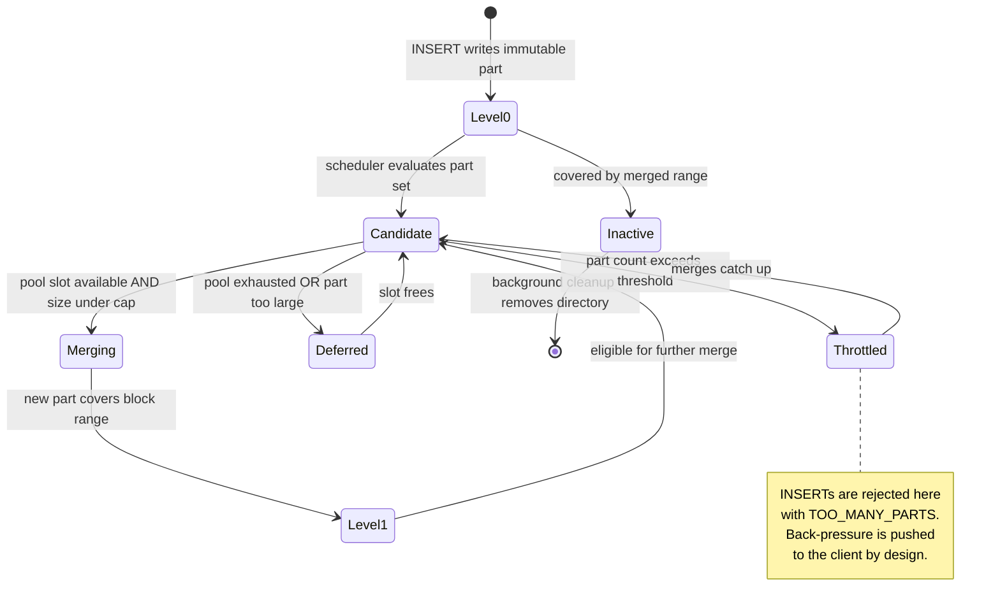

<!--
entry-meta
date: 2026-08-30
category: Database Internals
title: ClickHouse Parts, Merges, and Mutations
slug: clickhouse-mergetree-internals
-->

# ClickHouse Parts, Merges, and Mutations

**2026-08-30 · Database Internals**

## 1. The Part Is the Unit of Everything

- A **part** is a directory on disk holding a contiguous, immutable, `ORDER BY`-sorted run of rows.
- Every `INSERT` produces at least one new part. Nothing is appended to an existing part, ever.
- A block is written atomically if it is under `max_insert_block_size` (default **1048576** rows); larger inserts are chopped into multiple blocks and therefore multiple parts.
- Parts belonging to different partitions are **never** merged. `PARTITION BY` is therefore a hard partitioning of the merge space, not just a pruning hint.
- Because parts are immutable, there is no in-place update path, no page-level locking, and no undo log. Everything else in this document follows from that one decision.

### Why not a memtable?

Classic LSM engines (RocksDB, Cassandra) buffer writes in a sorted in-memory structure and flush on threshold. ClickHouse skips this: the client is expected to batch, and the sorted run is produced during the insert itself. The consequence is brutal and predictable — **many small inserts create many small parts**, and the merge scheduler cannot keep up, which surfaces as the `TOO_MANY_PARTS` error. The engine pushes back-pressure onto the client rather than absorbing it in memory.

## 2. Part Naming Is a Grammar, Not a Label

The directory name is:

```
<partition_id>_<min_block_number>_<max_block_number>_<level>_<data_version>
```

- **`partition_id`** — derived from `PARTITION BY`. With `toYYYYMM(date)` you get `202203`. With no `PARTITION BY`, it is the literal `all`.
- **`min_block_number` / `max_block_number`** — the range of insert block numbers this part covers. A fresh insert has `min == max`.
- **`level`** — merge generation. Level 0 is untouched insert output; merging bumps it.
- **`data_version`** — incremented when the part is mutated.

Concrete progression, three separate inserts into one partition:

```
202203_1_1_0
202203_2_2_0
202203_3_3_0
        ↓ merge
202203_1_3_1          -- covers blocks 1..3, level 1
        ↓ ALTER TABLE ... UPDATE (mutation version 2)
202203_1_3_1_2        -- same range, data_version 2
```

## 3. MVCC Falls Out of Block-Range Coverage

This is the part people usually miss, and it is the most elegant thing in the design.

- After a merge, **both generations exist on disk simultaneously**. The old parts are not deleted synchronously.
- The engine determines visibility by checking whether a part's block range **covers** other parts' ranges. `202203_1_3_1` covers `202203_1_1_0`, `202203_2_2_0`, and `202203_3_3_0`, so those three are marked inactive and are not read.
- No version chains, no per-row transaction IDs, no vacuum process in the Postgres sense. Snapshot consistency is a range-containment check over part names.
- Mutations allocate a separate block number and bump `data_version` on affected parts, so a query can see a consistent snapshot without blocking concurrent operations.

`system.parts` has an `active` column that exposes exactly this. An inactive part is a part whose range is covered by a newer one.

## 4. Wide vs Compact: Two Physical Layouts

| | Wide | Compact |
|---|---|---|
| Column data | one `.bin` per column | all columns in one file |
| Marks | one `.mrk` per column | single mark file |
| Chosen when | part exceeds `min_bytes_for_wide_part` / `min_rows_for_wide_part` | small parts below those thresholds |
| Why | column-level I/O isolation for big scans | avoids thousands of tiny file handles |

A Wide part directory contains, at minimum: `UserID.bin`, `URL.bin`, `EventTime.bin` (data), the matching `.mrk` mark files, `primary.idx`, `checksums.txt`, and partition metadata. Compact parts collapse the per-column files but keep the same logical structure.

The threshold exists because a table with 200 columns and thousands of tiny parts would otherwise burn the file descriptor table.

## 5. The Merge Scheduler

Merging is continuous background work, not a compaction pass you trigger.

- **`background_pool_size`** — threads available for merges and mutations. Setting it to core count clears backlogs aggressively during maintenance.
- **`background_merges_mutations_concurrency_ratio`** — tasks assigned relative to pool size. Default **2** favours many small tasks (good for steady insert load); setting it to **1** favours fewer, larger merges (good for clearing a backlog).
- **`number_of_free_entries_in_pool_to_lower_max_size_of_merge`** — when free pool slots drop below this, the maximum permitted merge size is reduced automatically. This is the anti-starvation valve: it stops one enormous merge from monopolising the pool while small parts pile up.
- **`max_bytes_to_merge_at_max_space_in_pool`** — the ceiling on merged part size when the pool is idle.
- **`background_merges_mutations_scheduling_policy`** — `shortest_task_first` clears small parts fast but can starve large merges under continuous insert load; `round_robin` is the safer choice when large-merge starvation is the concern.

Increases to `background_pool_size` take effect at runtime; **decreases require a server restart**. That asymmetry has bitten people mid-incident.

### The scheduling tension



## 6. Mutations: Three Generations of the Same Problem

`ALTER TABLE ... UPDATE` is genuinely hard in a column store with immutable parts. ClickHouse has attacked it three times.

**Generation 1 — classic mutations (2018).** A mutation version is allocated; every part with a block number below that version is rewritten. Changed columns are fully rewritten; **unchanged columns are hard-linked** to the original files. Cheap on disk for narrow updates on wide tables, but heavyweight in wall-clock time, and visibility is delayed until the rewrite finishes.

**Generation 1.5 — lightweight deletes.** `DELETE` became an `UPDATE` that sets the system column `_row_exists = 0`. Only the deletion-mask column is written; everything else is hard-linked. Vastly cheaper, but still a mutation.

**Generation 2 — on-the-fly mutations.** Updates are held in memory and applied during query execution, so they are visible immediately while the part rewrite proceeds asynchronously.

**Generation 3 — patch parts.** The current design treats an update as a *lightweight insert*:

- Only changed values are written, plus the system columns `_part`, `_part_offset`, `_data_version`.
- Unchanged columns do not appear in the patch part at all.
- Patches piggyback on the background merges that are already running — no separate rewrite pass.
- Row targeting uses `_part_offset` (row position inside its source part), with `_block_number` / `_block_offset` preserved through merges as a fallback.
- At merge time the engine interleaves patch data by sorting on `_part_offset` in a single pass. If the source parts merged *before* the patch applied, it falls back to a hash join on the block-based system columns — correct, but more memory-hungry.
- **Patch-on-read**: patches are applied in memory during query execution, per data range, per parallel stream, so updates are visible instantly without waiting for materialisation.
- `update_parallel_mode` controls concurrency: `auto` serialises dependent updates and parallelises independent ones, `sync` forces sequential, `async` runs everything uncoordinated.

The through-line across all three generations: **make updates look like the operations the engine is already good at** — inserts and merges.

## 7. TTL, Skipping Indexes, and Projections Ride the Merge Path

Nearly every "advanced feature" in MergeTree is implemented as work done during merges, which is why merge health is the single most important operational metric.

- **TTL is evaluated during background merges, not at insert time.** Consequence: `now()`, `rand()`, `now64()` in a TTL expression are re-evaluated on every merge. Table TTL supports `DELETE`, `RECOMPRESS`, `TO DISK`, `TO VOLUME`; column TTL replaces expired values with the column's default.
- **Projections** are part-level materialised views defined as `PROJECTION name (SELECT ... [GROUP BY] [ORDER BY])`. They materialise during merges and are picked transparently by the optimiser, with consistency guarantees that ordinary materialised views do not offer.
- **Compression** is applied per block, bounded by `min_compress_block_size` and `max_compress_block_size`. Codecs (LZ4, ZSTD, Delta for time series) are chosen per column.

## Hands-On Exercise

Prove that unchanged columns are hard-linked rather than copied during a classic mutation. This is a claim you should not take on faith.

```sql
CREATE TABLE hardlink_demo (id UInt64, big String, small UInt8)
ENGINE = MergeTree ORDER BY id
SETTINGS min_bytes_for_wide_part = 0;   -- force Wide so columns are separate files

INSERT INTO hardlink_demo
SELECT number, repeat('x', 500), 0 FROM numbers(200000);

SELECT name, path FROM system.parts
WHERE table = 'hardlink_demo' AND active;
```

Then on the server filesystem, with `PART_PATH` set to the path printed above:

```bash
# Record inode numbers of the column files BEFORE the mutation
ls -i "$PART_PATH"/big.bin "$PART_PATH"/small.bin
```

```sql
SET mutations_sync = 2;                       -- wait for the mutation to finish
ALTER TABLE hardlink_demo UPDATE small = 1 WHERE id < 100;

SELECT name FROM system.parts WHERE table = 'hardlink_demo' AND active;
-- name now carries a data_version suffix, e.g. all_1_1_0_2
```

```bash
# Compare inodes in the NEW part directory against the old ones
ls -i "$NEW_PART_PATH"/big.bin "$NEW_PART_PATH"/small.bin
```

**What to look for:** `big.bin` keeps the *same inode number* as before — it was hard-linked, not copied. `small.bin` has a new inode — it was rewritten. Confirm the link count with `stat -c '%h %n' "$NEW_PART_PATH"/big.bin`; it will be 2 while both parts exist.

Then check `system.mutations` for `is_done`, `parts_to_do`, and `latest_fail_reason` — this is the table you will actually reach for when a mutation is stuck in production.

## Further Study

- ChistaDATA's parts-and-partitions series, for a second explanation of the same lifecycle: <https://chistadata.com/parts-and-partitions-in-clickhouse-part-i/>
- The `system.parts` documentation source in the ClickHouse repo, which lists every column the engine exposes about a part: <https://github.com/ClickHouse/ClickHouse/blob/master/docs/en/operations/system-tables/parts.md>
- The `system.mutations` documentation source, for the mutation-debugging column set: <https://github.com/ClickHouse/ClickHouse/blob/master/docs/en/operations/system-tables/mutations.md>
- BigDataBoutique's MergeTree overview as a compact refresher: <https://bigdataboutique.com/blog/clickhouse-mergetree-engine>

## Next Steps

1. Deliberately induce `TOO_MANY_PARTS` with a single-row insert loop, then fix it two ways — client-side batching and `async_insert` — and measure the difference in part count and insert latency.
2. Instrument `system.merges` during a heavy backfill and plot merge duration against part size to find where your `max_bytes_to_merge_at_max_space_in_pool` ceiling actually bites.
3. Build a table with a projection and verify via `EXPLAIN` that the optimiser selects it; then delete the projection and compare scanned rows.
4. Compare classic mutation cost against patch-part cost on the same update workload, if your build supports both.

## Sources

- [MergeTree table engine — ClickHouse Documentation](https://clickhouse.com/docs/engines/table-engines/mergetree-family/mergetree)
- [Part names & MVCC — Altinity Knowledge Base](https://kb.altinity.com/engines/mergetree-table-engine-family/part-naming-and-mvcc/)
- [How we built fast UPDATEs for the ClickHouse column store – Part 2: SQL-style UPDATEs](https://clickhouse.com/blog/updates-in-clickhouse-2-sql-style-updates)
- [Aggressive merges — Altinity Knowledge Base](https://kb.altinity.com/altinity-kb-setup-and-maintenance/altinity-kb-aggressive_merges/)
- [Replicated* table engines — ClickHouse Documentation](https://clickhouse.com/docs/engines/table-engines/mergetree-family/replication)
- [system.parts — ClickHouse Docs](https://clickhouse.com/docs/operations/system-tables/parts)

## Takeaways

- The part name is a data structure. Reading `all_1_3_1_2` tells you the partition, the covered block range, the merge generation, and the mutation version — enough to reason about visibility without querying anything.
- MVCC is range containment over immutable parts. That is why there is no vacuum and no row-version bloat.
- The merge pool is a shared, contended resource, and nearly every MergeTree feature — TTL, projections, patch parts, recompression — spends from it. Merge lag is the leading indicator for almost every MergeTree incident.
- Mutations evolved from "rewrite the part" to "write a diff and let the merges apply it", which is the same trick the engine already uses for inserts.
