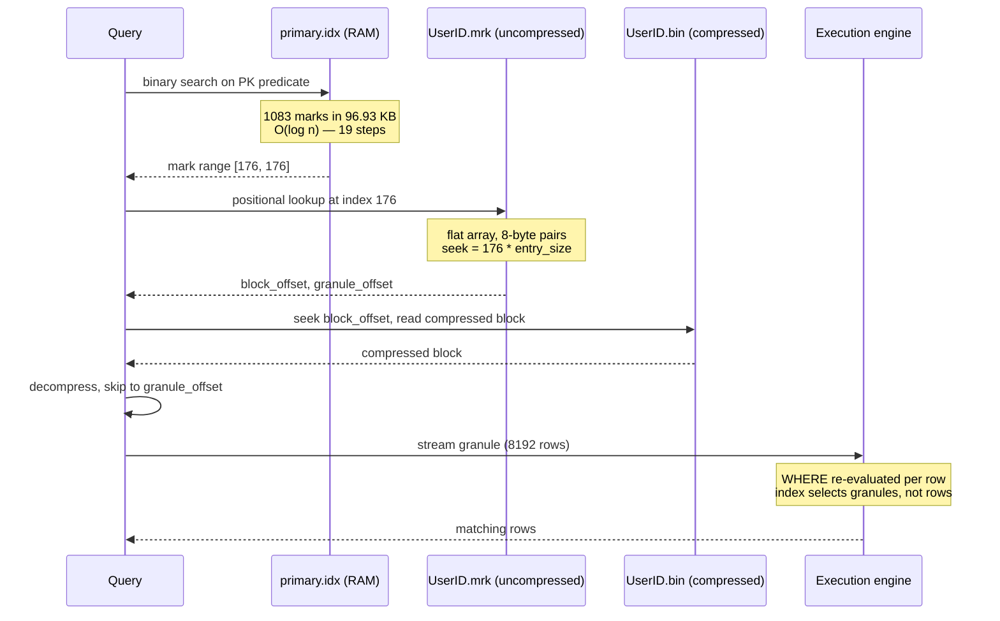

<!--
entry-meta
date: 2026-08-30
category: Database Internals
title: The ClickHouse Sparse Primary Index and Data Skipping
slug: clickhouse-mergetree-internals
-->

# The ClickHouse Sparse Primary Index and Data Skipping

**2026-08-30 · Database Internals**

## 1. The Design Constraint That Explains Everything

ClickHouse's index is not a B-tree, and the reason is a hard requirement, not a preference:

> The primary index must fit **completely in main memory**.

At the scale ClickHouse targets, a dense index — one entry per row — is a non-starter. A billion-row table would need a billion index entries. So instead of indexing rows, ClickHouse indexes **granule boundaries**: one entry per group of `index_granularity` rows (default **8192**).

The storage complexity drops from O(n) to O(n / 8192). Concrete numbers from the official walkthrough dataset:

| Metric | Value |
|--------|-------|
| Table rows | 8.87 million |
| Index marks | 1,083 |
| `primary.idx` size | 96.93 KB, uncompressed |

96 KB of RAM to index 8.87 million rows. That is the whole trade.

## 2. Granules Are the Atomic Read Unit

- A **granule** is "the smallest indivisible data set that is streamed into ClickHouse for data processing" — 8192 rows by default.
- Rows are physically stored ordered by the primary key columns, so granule boundaries are meaningful ranges, not arbitrary chunks.
- The index stores the primary-key column values **of every 8192nd row**, in physical order.

The direct consequence, and the thing that surprises people migrating from OLTP: **there is no such thing as reading one row.** A point lookup on a unique key still decompresses and streams 8192 rows. That is fine for analytics and terrible for a key-value workload, which is exactly why ClickHouse is not a key-value store.

### Adaptive granularity

`index_granularity_bytes` (default **10 MB**) caps granule size in bytes. If 8192 rows would exceed 10 MB, fewer rows form the granule. This prevents wide-row tables from producing enormous granules. Mark files in the adaptive Wide format (`.mrk2`) carry a third value per entry: the number of rows actually in that granule.

## 3. Mark Files: Turning a Mark Number Into a File Offset

The index tells you *which* granule. The mark file tells you *where it is*. This indirection is essential and is where most explanations get vague.

A mark file (`UserID.mrk`, `URL.mrk`, …) is a **flat, uncompressed array**, entries numbered from 0, storing two 8-byte offsets per entry:

1. **`block_offset`** — locates the compressed block inside the column's `.bin` file.
2. **`granule_offset`** — positions the granule inside that block *after* decompression.

Two offsets are required because **compressed blocks and granules are not the same thing**:

| | Compressed block | Granule |
|---|---|---|
| Nature | physical storage unit in `.bin` | logical processing unit |
| Size | bounded by `min_compress_block_size` / `max_compress_block_size` | 8192 rows (or byte-capped) |
| Relationship | may contain several granules | lives inside exactly one block |

So the read path is: seek to `block_offset` → decompress that block → skip to `granule_offset` → stream 8192 rows. Everything else in the `.bin` file stays compressed and untouched.

## 4. The Query Path, End to End

For `WHERE UserID = 749927693` on the reference dataset, the trace log shows:

```
Found (LEFT) boundary mark: 176
Found continuous range in 19 steps
1/1083 marks by primary key
```

Read that carefully — it is the whole algorithm:

- **19 steps** is `log₂(1083)` ≈ 10.1… so 19 steps reflects boundary searches for both ends of the range. The point is that it is logarithmic, not linear.
- **1 of 1083 marks** survived. 8.19 thousand rows were processed instead of 8.87 million — a **1083× reduction** in data touched.



**The critical semantic:** the index is a *filter over granules*, never a filter over rows. The `WHERE` clause is still evaluated row-by-row inside the selected granules. The index's only job is to eliminate granules from consideration.

## 5. The Prefix Rule and Why Column Order Dominates

- The index is over the **tuple** of primary key columns, sorted lexicographically.
- `PRIMARY KEY` must be a **prefix of the `ORDER BY` sorting-key tuple**. `ORDER BY` defines physical sort order (mandatory); `PRIMARY KEY` defines what is indexed (defaults to `ORDER BY` if omitted).
- Splitting them is a deliberate memory optimisation: sort by `(a, b, c)` for merge-time locality and compression, but index only `(a, b)` to shrink `primary.idx`.

The failure mode: filtering on the **second** primary-key column alone gives you no binary search. Rows are sorted by the first column, so the second column's values are scattered across all marks. You fall back to a near-full mark scan. This is why the standard advice is to order primary key columns by ascending cardinality, and why a query pattern that does not match the key prefix needs a projection or a second table, not a hopeful index.

## 6. Data Skipping Indexes: A Second, Coarser Filter

Skipping indexes are secondary structures evaluated *after* primary-key mark selection to eliminate more granules.

| Type | Stores per index block | Best for |
|------|------------------------|----------|
| `minmax` | min and max of an expression | values correlated with sort order (timestamps, monotonic IDs) |
| `set(max_rows)` | up to `max_rows` distinct values; `0` = unbounded | low-cardinality columns |
| `bloom_filter` | probabilistic membership, `false_positive_rate` default **0.025** | high-cardinality equality checks |
| `tokenbf_v1` | tokenised text bloom filter — **deprecated** in favour of the text index | substring/token search |

**`GRANULARITY` is the subtle parameter.** It does *not* mean rows. `GRANULARITY n` means **n primary-index granules are grouped into one skip-index block**. Higher `n` → smaller index, coarser filtering. Lower `n` → bigger index, sharper filtering.

```sql
INDEX idx_url url TYPE bloom_filter(0.01) GRANULARITY 4
-- one bloom filter per 4 granules = per ~32768 rows
```

The trap: a `minmax` index on a column that is uncorrelated with the sort order is worthless — nearly every block's `[min, max]` spans the whole domain, so nothing is skipped, and you have paid the build and storage cost for zero benefit. Always verify with `EXPLAIN indexes = 1` rather than assuming.

## Hands-On Exercise

Make the index actually visible on disk and in the query plan. Run this against a local ClickHouse.

```sql
CREATE TABLE idx_lab
(
    user_id  UInt64,
    ts       DateTime,
    url      String
)
ENGINE = MergeTree
ORDER BY (user_id, ts)
SETTINGS index_granularity = 8192, min_bytes_for_wide_part = 0;

INSERT INTO idx_lab
SELECT
    number % 100000            AS user_id,
    now() - (number % 1000000) AS ts,
    concat('/page/', toString(number % 5000))
FROM numbers(10000000);

OPTIMIZE TABLE idx_lab FINAL;
```

**Step 1 — measure the index, don't guess at it:**

```sql
SELECT
    name,
    formatReadableSize(primary_key_bytes_in_memory) AS idx_ram,
    formatReadableSize(bytes_on_disk)               AS on_disk,
    marks,
    rows
FROM system.parts
WHERE table = 'idx_lab' AND active;
```

Compute `rows / marks` yourself — it should land near 8192, modulo the `index_granularity_bytes` cap.

**Step 2 — watch mark selection, the key observation:**

```sql
SET send_logs_level = 'trace';

-- Matches the key prefix: expect a tiny number of marks
SELECT count() FROM idx_lab WHERE user_id = 42;

-- Does NOT match the prefix: expect nearly all marks
SELECT count() FROM idx_lab WHERE url = '/page/42';

SET send_logs_level = 'none';
```

Read the `... marks by primary key` line in each trace. The second query is the lesson: same table, same size, and the index does nothing for it.

**Step 3 — inspect the raw files:**

```bash
ls -la "$PART_PATH"
stat -c '%s %n' "$PART_PATH"/primary.idx "$PART_PATH"/user_id.mrk*
```

Divide the `.mrk` file size by the mark count. You should get 16 bytes for the non-adaptive format (two 8-byte offsets) or 24 bytes for `.mrk2` (plus the row-count value). Confirming that arithmetic yourself is the moment the mark-file design stops being abstract.

**Step 4 — fix query two with a skipping index and quantify it:**

```sql
ALTER TABLE idx_lab ADD INDEX idx_url url TYPE bloom_filter(0.01) GRANULARITY 4;
ALTER TABLE idx_lab MATERIALIZE INDEX idx_url;

EXPLAIN indexes = 1
SELECT count() FROM idx_lab WHERE url = '/page/42';
```

The `EXPLAIN` output shows granules before and after each index step. That before/after pair is the only honest measure of whether a skipping index earns its cost.

## Further Study

- OneUptime's write-ups on granules and `index_granularity` tuning, useful as a cross-check on the official docs: <https://oneuptime.com/blog/post/2026-03-31-clickhouse-data-parts-granules-mergetree/view> and <https://oneuptime.com/blog/post/2026-03-31-clickhouse-index-granularity-mergetree/view>
- BigDataBoutique's MergeTree engine overview, which situates the index inside the wider engine: <https://bigdataboutique.com/blog/clickhouse-mergetree-engine>
- The `system.parts` column reference, for `primary_key_bytes_in_memory` and `marks`: <https://clickhouse.com/docs/reference/system-tables/parts>

## Next Steps

1. Build the same 10M-row table with `index_granularity` at 1024, 8192, and 32768. Plot index RAM against scanned rows for a point lookup — you will see the trade curve directly instead of reasoning about it abstractly.
2. Construct a case where a `minmax` skipping index is useless (random values) and one where it is excellent (monotonic timestamp), and confirm both with `EXPLAIN indexes = 1`.
3. Implement a toy sparse index in Python over a sorted array — binary search plus mark array — and compare against `bisect` on a dense index. Roughly 100 lines, and it makes the memory argument concrete.
4. Read the ClickHouse source for `MergeTreeDataSelectExecutor` to see how mark ranges are actually computed and merged.

## Sources

- [A practical introduction to primary indexes in ClickHouse — ClickHouse Docs](https://clickhouse.com/docs/guides/best-practices/sparse-primary-indexes)
- [MergeTree table engine — ClickHouse Documentation](https://clickhouse.com/docs/engines/table-engines/mergetree-family/mergetree)
- [system.parts — ClickHouse Docs](https://clickhouse.com/docs/reference/system-tables/parts)

## Takeaways

- The index is sparse because it must fit in RAM; every other property follows from that constraint.
- Two offsets per mark exist because compressed blocks and granules are independent groupings — conflating them is the most common misunderstanding of the read path.
- The index selects granules, not rows. `WHERE` still runs per row inside the surviving 8192-row granules.
- Primary key column order is the single highest-leverage schema decision in ClickHouse; a non-prefix filter gets no binary search at all.
- `GRANULARITY` on a skipping index counts primary-index granules, not rows. Verify every skipping index with `EXPLAIN indexes = 1` — an uncorrelated `minmax` index is pure overhead.
