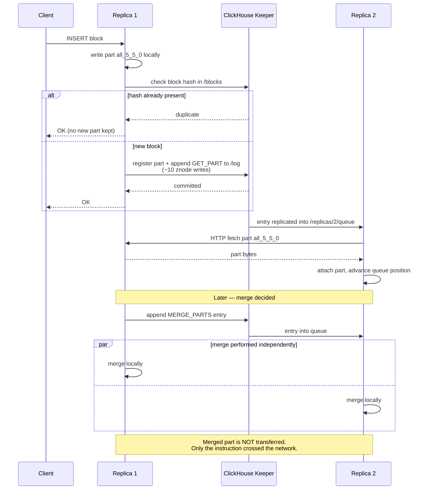

<!--
entry-meta
date: 2026-08-30
category: Database Internals
title: ClickHouse Replication, Keeper, and the Replication Queue
slug: clickhouse-mergetree-internals
-->

# ClickHouse Replication, Keeper, and the Replication Queue

**2026-08-30 · Database Internals**

## 1. The Shape of the System

ClickHouse replication is **asynchronous, multi-master, and per-table**. Those three properties each have sharp consequences:

- **Asynchronous** — an `INSERT` returns after one replica has the data. Reading a different replica immediately afterward may not show it. This is a real consistency gap, not a theoretical one.
- **Multi-master** — every replica accepts writes. There is no primary to fail over.
- **Per-table** — replication is configured on the table via `ReplicatedMergeTree`, with its own Keeper path. Two tables in the same database can have entirely different replication topologies.

Critically: **Keeper carries coordination metadata, not the data itself.** Parts move replica-to-replica over HTTP. Keeper holds the log of *what should happen*, the per-replica queues, and the deduplication state. Confusing these two planes is the source of most bad capacity planning around Keeper.

## 2. The Keeper Znode Layout

The table path is set at table creation and **must be unique per replicated table**:

```sql
CREATE TABLE events ON CLUSTER my_cluster
(
    id UInt64,
    ts DateTime
)
ENGINE = ReplicatedMergeTree(
    '/clickhouse/tables/{shard}/{database}/{table}',
    '{replica}'
)
ORDER BY (id, ts);
```

The macro substitution matters: `{shard}` and `{replica}` come from the server's `<macros>` config, so the same DDL statement produces a correct per-node identity across the cluster. Getting the path wrong — two different tables sharing one path — produces silent, extremely confusing corruption, because two unrelated tables will start exchanging parts.

The subtree holds, at minimum:

- **table metadata and column definitions** — replicas validate their local schema against `/metadata` and `/columns`; the `ALTER_METADATA` queue entry exists to apply changes from these paths
- **`/replicas/<name>/`** — one subtree per replica, including its **queue**
- **`/log`** — the shared, ordered sequence of replicated operations
- **block deduplication records** — hashes of recently inserted blocks
- **`/replicas/<name>/flags/`** — including `force_restore_data`

Auxiliary ZooKeeper clusters are supported via configuration, which lets you isolate a hot table's coordination traffic onto its own ensemble.

## 3. The Insert Path

- Data is split into blocks up to `max_insert_block_size` (**1048576** rows). Blocks under that limit are written **atomically**.
- The receiving replica writes the part locally, then registers it.
- Per inserted block, "approximately ten entries are added to ZooKeeper through several transactions." **This is the number that governs Keeper load.** Ten Keeper writes per block means small, frequent inserts are expensive at the coordination layer as well as at the merge layer — inserting one row at a time punishes you twice.

### Deduplication Is Built In and Is a Correctness Feature

- A hash is computed over each block's contents and recorded in Keeper.
- "For multiple writes of the same data block… the block is only written once."
- Therefore **`INSERT` is idempotent** for identical blocks: a client can retry a timed-out insert without creating duplicates.

This is why ClickHouse ingestion pipelines can be built on at-least-once delivery from Kafka and still be correct — as long as the block boundaries are deterministic. Reshuffling rows between retries changes the hash and defeats dedup. That is a real, easy-to-hit footgun in a pipeline that batches by time rather than by offset.

Dedup behaviour is governed by the `merge_tree` server settings section; the window is finite, so a retry arriving long after the original will not be caught.

## 4. Merges Are Replicated as Instructions, Not as Data

This is the most important idea in ClickHouse replication and it is easy to miss.

"Data transformation (merging) is coordinated and performed on all the replicas in the same way."

When a merge is decided, an entry is appended to the Keeper log. Every replica pulls it into its own queue and **performs the merge locally on parts it already has**. The merged part is not shipped across the network.

The payoff: for a merge of 100 GB of parts, the network cost is one small Keeper entry rather than 100 GB of transfer. The requirement this imposes: merges must be **deterministic**, so every replica independently produces a byte-comparable result.

This is also why the TTL determinism caveat from document 01 matters here — `now()` in a TTL expression is re-evaluated per merge, and under replication that non-determinism becomes a cross-replica divergence risk.

## 5. `system.replication_queue`: The Operational Ground Truth

When replication misbehaves, this table is where you look. It has 23 columns; the ones that matter in practice group as:

| Group | Columns |
|-------|---------|
| Identity | `database`, `table`, `replica_name`, `position`, `node_name` |
| Task | `type`, `create_time`, `source_replica`, `new_part_name`, `parts_to_merge` |
| Execution | `is_currently_executing`, `required_quorum`, `is_detach` |
| Errors | `num_tries`, `last_exception`, `last_exception_time`, `last_attempt_time` |
| Postponement | `num_postponed`, `postpone_reason`, `last_postpone_time` |
| Merge detail | `merge_type` |

**Entry types (`type` column):**

- **`GET_PART`** — get the part from another replica
- **`ATTACH_PART`** — attach the part, possibly from our own replica
- **`MERGE_PARTS`** — merge the parts
- **`MUTATE_PART`** — apply one or several mutations to the part
- **`DROP_RANGE`** — delete parts in the specified partition in the specified number range
- **`REPLACE_RANGE`** — drop a range of parts and replace them with new ones
- **`ALTER_METADATA`** — apply an alter per the global `/metadata` and `/columns` paths
- **`CLEAR_COLUMN`**, **`CLEAR_INDEX`** — deprecated

Diagnostic reading of these columns:

- `num_postponed` climbing with a `postpone_reason` set → the queue is *not* stuck, it is waiting on a dependency (usually a part that has not arrived yet). Often self-healing; do not intervene reflexively.
- `num_tries` climbing with a repeating `last_exception` → genuinely stuck. Read the exception before touching anything.
- A long queue of `GET_PART` entries → this replica is behind and pulling data. Check `background_fetches_pool_size`.



## 6. Consistency Controls and Failure Modes

### `insert_quorum`

By default an `INSERT` waits for **one** replica. Setting `insert_quorum` requires confirmation of the write from multiple replicas before returning success. You are trading write latency and availability for a stronger durability guarantee — the standard quorum bargain. Pair it with `select_sequential_consistency` on the read side if you need read-your-writes, and understand that you have then given up some availability during a partition.

### Keeper unavailable

**Replicated tables switch to read-only mode.** Reads continue from local data; writes fail. The server periodically reconnects and revalidates local data against the expected metadata.

This is the failure mode to actually plan for: Keeper is a hard dependency for writes on every replicated table. Keeper capacity and latency are ClickHouse write-availability concerns, not a side detail of the deployment.

### Divergence and recovery

- On reconnection, if local data disagrees with Keeper's expectations, "the system resolves them by syncing data with the replicas."
- **Broken parts are moved to a `detached` subdirectory**, not deleted. `detached/` filling up is a signal worth alerting on — it is where evidence of past corruption accumulates.
- **Missing parts are copied from replicas** via `GET_PART`.

### Forced restoration

When a replica's local data is untrusted and you want it rebuilt from peers:

```bash
sudo -u clickhouse touch /var/lib/clickhouse/flags/force_restore_data
# then restart the server
```

or create `/path_to_table/replica_name/flags/force_restore_data` in Keeper. This is a blunt instrument — it triggers wholesale re-fetching. Understand why the replica diverged before reaching for it, or you will simply repeat the divergence.

### Relevant thread pools

- **`background_schedule_pool_size`** — threads for background replication tasks (queue processing, Keeper interaction)
- **`background_fetches_pool_size`** — thread pool for replicated part fetches

A replica that is behind but not erroring is frequently just fetch-throughput-bound.

## Hands-On Exercise

Observe the queue and prove insert idempotency. Two ClickHouse nodes plus one Keeper, via Docker.

**Step 1 — bring up Keeper and two replicas.** Use the official `clickhouse/clickhouse-server` image with a `<zookeeper>` section pointing both nodes at one Keeper, and `<macros>` giving each node a distinct `{replica}` and a shared `{shard}`.

**Step 2 — create the replicated table on both nodes:**

```sql
CREATE TABLE repl_lab
(
    id UInt64,
    ts DateTime DEFAULT now()
)
ENGINE = ReplicatedMergeTree('/clickhouse/tables/01/default/repl_lab', '{replica}')
ORDER BY id;
```

**Step 3 — watch the queue while inserting.** On replica 2, poll:

```sql
SELECT type, new_part_name, source_replica, num_tries,
       num_postponed, postpone_reason, is_currently_executing
FROM system.replication_queue
WHERE table = 'repl_lab';
```

On replica 1, insert a large batch:

```sql
INSERT INTO repl_lab (id) SELECT number FROM numbers(20000000);
```

You should catch `GET_PART` entries appearing and draining. Then force a merge on replica 1 with `OPTIMIZE TABLE repl_lab FINAL` and look for `MERGE_PARTS` on replica 2 — **note that no large fetch accompanies it.** That absence is the point of the exercise.

**Step 4 — prove idempotency, which is the real payoff:**

```sql
-- Run this exact statement twice on replica 1
INSERT INTO repl_lab (id, ts) VALUES (1, '2026-08-30 00:00:00'), (2, '2026-08-30 00:00:01');

SELECT count() FROM repl_lab WHERE id IN (1, 2);
```

The count stays at 2. The block hash matched an existing entry in Keeper's dedup records, so the second insert was discarded.

Now break it deliberately — reorder the two rows in the `VALUES` list and run it again. The hash changes, dedup does not fire, and you get duplicates. **This is the exact bug that appears in production Kafka pipelines that batch non-deterministically**, and it is worth feeling once in a lab rather than discovering in an incident.

**Step 5 — simulate Keeper loss.** Stop the Keeper container and attempt an insert. Confirm the table has gone read-only and that `SELECT` still works. Restart Keeper and watch recovery.

## Further Study

- Pulse's practical `ReplicatedMergeTree` and HA architecture write-ups: <https://pulse.support/kb/what-is-clickhouse-replicatedmergetree> and <https://pulse.support/kb/clickhouse-replication>
- QueryPlane on running clusters, replication, and Keeper in practice: <https://queryplane.com/blog/clickhouse-cluster-replication-and-keeper-in-practice/>
- OneUptime's replication protocol walkthrough as a second framing: <https://oneuptime.com/blog/post/2026-03-31-clickhouse-replication-protocol/view>
- Altinity's data-management-internals webinar, covering merges and replication together: <https://altinity.com/webinarspage/clickhouse-data-management-internals-understanding-mergetree-storage-merges-and-replication>
- Jack Vanlightly's analysis of serverless ClickHouse Cloud, where shared object storage changes these tradeoffs substantially: <https://jack-vanlightly.com/analyses/2024/1/23/serverless-clickhouse-cloud-asds-chapter-5-part-1>

## Next Steps

1. Measure Keeper write amplification directly: insert 1000 single-row blocks vs. one 1000-row block and compare Keeper request counts. This turns "batch your inserts" from advice into a number you own.
2. Benchmark `insert_quorum = 2` against the default and quantify the added p99 write latency on your hardware.
3. Kill a replica mid-merge, bring it back, and trace exactly how the queue reconciles — specifically whether it re-merges or fetches.
4. Build a Kafka → ClickHouse ingestion path and deliberately break dedup by reshuffling rows within a batch, so the failure is one you have seen rather than one you have read about.
5. Read the `StorageReplicatedMergeTree` source, focusing on `queueTask` and the log-pulling logic.

## Sources

- [Replicated* table engines — ClickHouse Documentation](https://clickhouse.com/docs/engines/table-engines/mergetree-family/replication)
- [system.replication_queue — ClickHouse Docs](https://clickhouse.com/docs/operations/system-tables/replication_queue)
- [MergeTree table engine — ClickHouse Documentation](https://clickhouse.com/docs/engines/table-engines/mergetree-family/mergetree)

## Takeaways

- Keeper holds coordination state — the log, per-replica queues, dedup hashes — while parts move replica-to-replica over HTTP. Sizing Keeper by data volume is the wrong mental model; size it by insert-block rate.
- Merges replicate as instructions and are executed independently on every replica, which is why merge determinism is a correctness requirement rather than a nicety.
- Insert idempotency via block hashing is what makes at-least-once ingestion safe — and it silently fails if your batching is non-deterministic.
- Roughly ten Keeper writes per inserted block means small inserts hurt at the coordination layer, on top of hurting at the merge layer.
- Keeper is a hard dependency for writes: lose it and every replicated table goes read-only. Plan Keeper availability as write availability.
