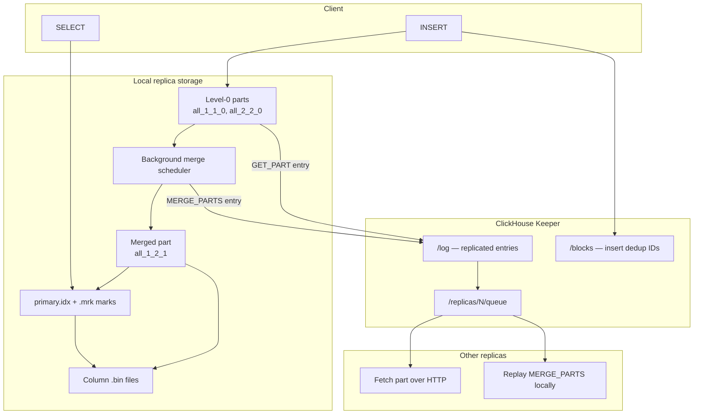

<!--
entry-meta
date: 2026-08-30
category: Database Internals
title: ClickHouse MergeTree Internals — Storage, Indexing, and Replication
slug: clickhouse-mergetree-internals
-->

# ClickHouse MergeTree Internals — Storage, Indexing, and Replication

**2026-08-30 · Database Internals**

## Why This Is Split

MergeTree is not one mechanism; it is three tightly coupled ones that are usually explained as if they were a single "engine". Each is substantial enough to stand alone, and the interesting behaviour lives in how they interact:

- **The on-disk part lifecycle** decides what files exist and when they are rewritten.
- **The sparse index** decides how much of those files a query ever touches.
- **Replication** decides which of those parts a given replica is allowed to have, and it is coordinated entirely through Keeper metadata — not through streaming a WAL.

The critical coupling: **replication replicates parts, and merges are replicated as instructions rather than as data.** You cannot reason about ClickHouse HA without first understanding the part lifecycle, which is why the documents are ordered this way.

## Documents

| # | Document | What it covers |
|---|----------|----------------|
| 01 | [Parts, Merges, and Mutations](01-parts-merges-and-mutations.md) | Part naming grammar, Wide vs Compact, the merge scheduler, MVCC via block ranges, mutations and patch parts |
| 02 | [The Sparse Primary Index and Data Skipping](02-sparse-primary-index-and-skipping-indexes.md) | Granules, `primary.idx`, mark files, binary search + mark ranges, why not a B-tree, skipping indexes and `GRANULARITY` |
| 03 | [Replication, Keeper, and the Replication Queue](03-replication-keeper-and-the-replication-queue.md) | Keeper znode layout, the log/queue split, insert deduplication, merge assignment, `insert_quorum`, recovery |

## The One-Paragraph Model

An insert creates an immutable part directory sorted by `ORDER BY`. A background scheduler merges parts into bigger parts, and a part covering a block-number range implicitly supersedes every part inside that range — that is the whole MVCC mechanism. Queries never scan rows to find rows: they binary-search a small in-memory array of one primary-key value per 8192 rows, translate the surviving marks into file offsets via `.mrk` files, and decompress only those blocks. Replication does not ship rows for merges — it writes a `MERGE_PARTS` entry into a Keeper log, and every replica performs the same deterministic merge locally.

## System Map



## Hands-On Entry Point

Each sub-document has its own exercise. If you only run one thing, run this: it makes the entire part lifecycle visible in about thirty seconds.

```sql
CREATE TABLE lifecycle (id UInt64, v String)
ENGINE = MergeTree ORDER BY id
SETTINGS index_granularity = 8192;

INSERT INTO lifecycle SELECT number, 'a' FROM numbers(100000);
INSERT INTO lifecycle SELECT number, 'b' FROM numbers(100000, 100000);

SELECT name, level, rows, bytes_on_disk, part_type, active
FROM system.parts WHERE table = 'lifecycle';

OPTIMIZE TABLE lifecycle FINAL;

-- Re-run the system.parts query. Note that the old parts are still listed
-- with active = 0 until cleanup, and the new part's name encodes the merged
-- block range and an incremented level.
SELECT name, level, rows, active FROM system.parts WHERE table = 'lifecycle';
```

Watch three things: the part names, the `level` increment, and the fact that the pre-merge parts do not disappear immediately — they become inactive. That last detail is the MVCC mechanism, made visible.

## Further Study

- The Altinity webinar on data-management internals covers merge/replication interaction with production war stories: <https://altinity.com/webinarspage/clickhouse-data-management-internals-understanding-mergetree-storage-merges-and-replication>
- Jack Vanlightly's analysis of serverless ClickHouse Cloud, for how this architecture changes when storage is decoupled: <https://jack-vanlightly.com/analyses/2024/1/23/serverless-clickhouse-cloud-asds-chapter-5-part-1>
- ChistaDATA on parts and partitions, as a second framing of the same model: <https://chistadata.com/parts-and-partitions-in-clickhouse-part-i/>

## Next Steps

1. Reproduce the "too many parts" failure mode deliberately: insert single rows in a tight loop and watch `system.parts` count climb until the insert throttle engages. This teaches why batching is not a style preference.
2. Set up a two-replica cluster with Keeper and read `system.replication_queue` while inserting — see document 03.
3. Compare a sparse-index point lookup against Postgres B-tree behaviour on the same dataset, and quantify where the crossover is.

## Sources

- [A practical introduction to primary indexes in ClickHouse — ClickHouse Docs](https://clickhouse.com/docs/guides/best-practices/sparse-primary-indexes)
- [MergeTree table engine — ClickHouse Documentation](https://clickhouse.com/docs/engines/table-engines/mergetree-family/mergetree)
- [Replicated* table engines — ClickHouse Documentation](https://clickhouse.com/docs/engines/table-engines/mergetree-family/replication)
- [system.replication_queue — ClickHouse Docs](https://clickhouse.com/docs/operations/system-tables/replication_queue)
- [Part names & MVCC — Altinity Knowledge Base](https://kb.altinity.com/engines/mergetree-table-engine-family/part-naming-and-mvcc/)
- [How we built fast UPDATEs for the ClickHouse column store – Part 2: SQL-style UPDATEs](https://clickhouse.com/blog/updates-in-clickhouse-2-sql-style-updates)
- [Aggressive merges — Altinity Knowledge Base](https://kb.altinity.com/altinity-kb-setup-and-maintenance/altinity-kb-aggressive_merges/)
- [system.parts — ClickHouse Docs](https://clickhouse.com/docs/operations/system-tables/parts)

## Takeaways

- MergeTree is an LSM-shaped design without a memtable: the "sorted run" is produced at insert time and written straight to disk as an immutable part.
- Immutability plus block-range coverage gives you MVCC for free — no per-row version chains, no vacuum.
- The index is sparse because it is designed to fit entirely in RAM; the tradeoff is that the minimum unit of read is 8192 rows, not one row.
- Replication is metadata-driven: Keeper carries instructions and dedup state, not data volume.
