<!--
entry-meta
date: 2026-09-03
category: System Design / Paper Analysis
title: Spanner — How TrueTime Turns Clock Uncertainty Into External Consistency
slug: spanner-truetime-external-consistency
-->

# Spanner — How TrueTime Turns Clock Uncertainty Into External Consistency

**2026-09-03 · System Design / Paper Analysis**

Source: Corbett et al., *"Spanner: Google's Globally-Distributed Database"*, OSDI 2012. This is the paper that made "globally consistent, globally distributed, ACID transactions" a solved-in-practice problem rather than a theoretical one. The mechanism is not clever algorithmics — it is turning a hardware property (bounded clock uncertainty) into a distributed-systems invariant.

## The Problem Spanner Actually Solves

Every prior wide-area system picked one of two answers to "what does a transaction's commit timestamp mean":

- **Logical timestamps** (Lamport clocks, vector clocks): correct ordering, but the numbers carry no relation to wall-clock time, so you can't answer "what did the DB look like at 3:00pm" or reason about staleness in human terms.
- **Wall-clock timestamps without bounds**: human-meaningful, but two nodes' clocks can disagree by an unknown amount, so you can't prove ordering — a later transaction could get an earlier timestamp than one that already committed.

Spanner's move: don't eliminate clock uncertainty, **expose it as an explicit interval and design the protocol to be correct regardless of its width.** That's TrueTime.

## Architecture, Top to Bottom

| Layer | Component | Role |
|---|---|---|
| Deployment | **Universe** | One Spanner deployment (Google runs a handful: test, dev, prod) |
| Deployment | **Zone** | Unit of physical isolation/replication — roughly one Bigtable-server deployment's worth of machines |
| Per-zone | **zonemaster** | Assigns data to spanservers in that zone |
| Per-zone | **spanserver** (100s–1000s per zone) | Actually serves reads/writes; each hosts 100–1000 **tablets** |
| Per-zone | **location proxy** | Tells clients which spanserver holds which data |
| Global | **universe master** | Debugging/status console |
| Global | **placement driver** | Moves data between zones on a minutes timescale for load/constraint balancing |

A **tablet** is a Bigtable-style abstraction implementing `(key: string, timestamp: int64) → string` — i.e. every tablet is already multi-versioned key-value storage, with the version being a timestamp, not a monotonic counter. Tablet state lives in B-tree-like files plus a write-ahead log, both written to **Colossus** (Google's distributed filesystem — GFS's successor).

**Directories** are the actual unit of placement: a directory is a set of contiguous keys sharing a common prefix, and every key in a directory shares one replication configuration (how many replicas, in which zones). One tablet — and therefore one Paxos group — can hold many directories, which decouples "unit of Paxos replication" from "unit of lexicographic key range." A background `Movedir` task relocates whole directories between Paxos groups; it's implemented as a sequence of small transactions rather than one big one specifically so it doesn't block ongoing reads/writes on the data being moved.

## Replication: One Paxos Group per Tablet

Each spanserver runs a Paxos state machine per tablet it hosts. This is the redundancy layer: a tablet's data is replicated across zones (often across datacenters, sometimes continents) via that Paxos group, with:

- **Leader leases** — time-based, default **10 seconds**, giving each group a stable, long-lived leader instead of re-electing per operation.
- A **lock table** at the leader, mapping key ranges to lock state, used for pessimistic two-phase locking on read-write transactions.
- A **transaction manager** at the leader, which participates in cross-group two-phase commit when a transaction touches more than one Paxos group.

So the two coordination layers are cleanly separated: **Paxos** gives you durability/availability for one shard; **2PC across participant leaders** gives you atomicity across shards. Spanner didn't invent a new cross-shard commit protocol — the paper explicitly describes it as Percolator-style 2PC, layered on top of Paxos-replicated groups instead of a single unreplicated coordinator.

## TrueTime: The Actual Novelty

```
TT.now()      → TTinterval [earliest, latest]   (absolute time is guaranteed inside this interval)
TT.after(t)   → true iff t has definitely passed
TT.before(t)  → true iff t has definitely not arrived yet
```

`ε` ("epsilon") is half the interval width — the instantaneous uncertainty bound. Every Google datacenter running Spanner has **GPS receivers and atomic clocks**, chosen deliberately because they have *uncorrelated* failure modes (GPS fails from antenna/receiver/atmospheric issues; atomic clocks drift from oscillator aging — different failure classes, so a bad day for one doesn't imply a bad day for the other). Per-machine time daemons poll a set of these time masters and apply a worst-case drift bound between polls.

- **2012 paper measurement**: ε ranged **1–7ms**, averaging **~4ms** most of the time (occasional bad legs from network delays pushed it toward the high end).
- **Current production** (per Google's own docs, over a decade of infrastructure hardening): **99th-percentile uncertainty is now under 1ms.** The mechanism hasn't changed; the time-distribution infrastructure got much tighter.

## The Two Rules That Make It Work

**Start rule.** When a coordinator leader assigns a commit timestamp `s_i` to transaction `T_i`, it picks `s_i ≥ TT.now().latest`, sampled *after* the commit request has fully arrived (i.e., after all locks are held and all participants have prepared).

**Commit-wait rule.** The coordinator does not let any client observe `T_i`'s effects — does not release locks, does not ack the client — until `TT.after(s_i)` is true, i.e. until the *earliest* bound of the current TrueTime interval has passed `s_i`.

Put together: by the time anyone can see the write, the wall clock has definitely passed the assigned timestamp. That gives you the external consistency guarantee:

> If transaction `T2` starts (its client calls `Commit()`) after `T1`'s commit has returned, then `T2`'s commit timestamp is greater than `T1`'s.

This is stronger than plain serializability — a schedule can be serializable and recoverable while still assigning commit order that contradicts real-world causal order (imagine `T1` commits, someone picks up the phone and tells a colleague, that colleague starts `T2` — serializability alone says nothing about `T2 > T1` in timestamp terms). External consistency plus "never expose uncommitted data" is what gets you strict serializability, not the other way around.

**Cost:** expected commit-wait duration is about `2ε` — around 8ms with the 2012 numbers, sub-millisecond with current infrastructure. Note the wait overlaps with Paxos replication of the commit record, so it's not usually pure added latency on top of consensus — it's a floor under it.

## Read-Write vs. Read-Only vs. Snapshot Reads

| Transaction type | Locking | Timestamp | Where it can execute |
|---|---|---|---|
| Read-write | Pessimistic 2PL via lock table | Assigned via the Start/Commit-wait rules above | Must go through the leader of every group touched |
| Read-only (predeclared, no writes) | None | System-chosen, `TT.now().latest`-based | Any sufficiently up-to-date replica — leader not required |
| Snapshot read | None | Caller-specified exact timestamp, or a staleness bound | Any replica whose applied-Paxos-log position covers that timestamp |

Because tablets are natively `(key, timestamp) → value`, a snapshot read at timestamp `t` is just "read the version visible as of `t`" — MVCC comes for free from the storage format, no separate versioning layer. The catch the paper is honest about: read-only transactions still have to wait if the replica hasn't yet applied a Paxos log position covering the chosen timestamp, so "lock-free" doesn't mean "wait-free" under replication lag.

## Cross-Group Commit: 2PC Over Paxos Leaders

For a transaction spanning multiple Paxos groups: one participant's leader is elected **coordinator leader**; the rest are **participant leaders** (not raw replicas — each is itself the leader of its own Paxos group). The coordinator:

1. Collects `prepare_ts` from every participant (each participant applies the Start rule locally and logs Prepare through its own Paxos group).
2. Picks the transaction's final `commit_ts = max(all prepare timestamps, its own TT.now().latest)`.
3. Logs Commit through its own Paxos group, performs commit-wait, then tells every participant to apply at `commit_ts` and release locks.

Measured cost in the paper's microbenchmarks: 2PC scales tolerably to **~50 participant groups** (mean latency ≈ **31.5ms**) and degrades sharply past **100**. In production (F1, Google's ads database, running on Spanner): mean read latency **8.7ms**, single-datacenter commit **72.3ms**, multi-datacenter commit **103.0ms** — with large standard deviations from lock contention and tail effects, not from TrueTime itself.

## System Map

```mermaid
flowchart TB
    subgraph Universe
        UM["Universe Master<br/>(status/debug)"]
        PD["Placement Driver<br/>(cross-zone data movement)"]
    end

    subgraph ZoneA["Zone A"]
        ZMA["zonemaster"]
        LPA["location proxy"]
        SSA1["spanserver<br/>Paxos leader, tablet T1"]
        SSA2["spanserver<br/>Paxos replica, tablet T1"]
    end

    subgraph ZoneB["Zone B"]
        ZMB["zonemaster"]
        SSB1["spanserver<br/>Paxos leader, tablet T2"]
        SSB2["spanserver<br/>Paxos replica, tablet T2"]
    end

    subgraph Node["Inside a leader spanserver"]
        LOCK["Lock table<br/>(2PL for read-write txns)"]
        TXM["Transaction manager<br/>(2PC coordinator/participant)"]
        TTD["Local TrueTime daemon"]
        COL["Colossus: B-tree files + WAL"]
    end

    CLIENT["Client"] --> LPA
    LPA --> SSA1
    ZMA --> SSA1
    ZMA --> SSA2
    SSA1 <-->|Paxos replication| SSA2
    SSA1 -->|2PC: prepare/commit| SSB1
    SSB1 <-->|Paxos replication| SSB2
    SSA1 --- LOCK
    SSA1 --- TXM
    SSA1 --- TTD
    SSA1 --- COL
    PD -.->|Movedir| SSA1
    PD -.->|Movedir| SSB1
```



## Transaction Commit Sequence (the part that actually uses TrueTime)

```mermaid
sequenceDiagram
    participant C as Client
    participant CL as Coordinator Leader<br/>(Paxos Group A)
    participant PL as Participant Leader<br/>(Paxos Group B)
    participant TT as TrueTime (local daemon)

    C->>CL: Read + buffer writes, then Commit()
    CL->>PL: Prepare (2PC phase 1)
    PL->>TT: TT.now()
    TT-->>PL: [earliest, latest], epsilon
    PL->>PL: Acquire locks; prepare_ts >= TT.now().latest
    PL->>PL: Log Prepare via its own Paxos group
    PL-->>CL: Prepared, prepare_ts
    CL->>TT: TT.now()
    TT-->>CL: [earliest, latest]
    CL->>CL: commit_ts = max(prepare_ts, TT.now().latest)
    CL->>CL: Log Commit via its own Paxos group
    Note over CL,TT: Commit wait: block until TT.after(commit_ts)
    CL->>PL: Commit(commit_ts)
    PL->>PL: Apply write, release locks
    PL-->>CL: Ack
    CL-->>C: Commit acknowledged (commit_ts is now provably in the past)
```

## The Honest Failure Mode

TrueTime is a shared dependency across an entire datacenter's worth of Spanner traffic. If time masters become unreachable or drift, `ε` widens for every server in the zone simultaneously — not gracefully degraded, but a step function. A wide `ε` means longer commit-wait everywhere at once, which shows up as a correlated latency spike across the whole zone rather than an isolated slow node — the kind of failure that's easy to misdiagnose as a network or Paxos problem if you don't know to look at TrueTime uncertainty first.

## The Alternative: CockroachDB's "Wait vs. Retry" Trade

CockroachDB implements the same external-consistency goal without atomic clocks/GPS, using **hybrid logical clocks** (HLC: a physical wall-clock component plus a logical counter to break ties) synced via NTP instead of dedicated time hardware:

| | Spanner | CockroachDB |
|---|---|---|
| Clock source | GPS + atomic clocks, dedicated hardware | NTP |
| Typical max offset | ε ≈ sub-ms to a few ms | ~100–250ms (configurable `--max-offset`) |
| Strategy | **Always pay commit-wait** on every read-write commit, proportional to ε | **Usually pay nothing**; on the rare read that lands inside another transaction's uncertainty window, restart that read at a pushed timestamp (`ReadWithinUncertaintyIntervalError`) |
| Failure mode | Correlated latency spike if time infra degrades | A node crashes itself if its clock drifts past ~80% of `--max-offset` from the cluster median |

The framing worth internalizing: Spanner converts uncertainty into a **guaranteed, small, constant tax paid by every commit**; CockroachDB converts it into a **rare, larger tax paid only by transactions that actually collide within the uncertainty window**. Neither eliminates the uncertainty — the physics is the same — they just decide where in the protocol to charge for it.

## Hands-On Exercise

Two parts: observe Spanner's actual commit-timestamp mechanism via the official emulator, then observe CockroachDB's uncertainty-driven retry as the contrasting design.

**Part 1 — Spanner commit timestamps (no GCP account needed, runs locally):**

```bash
docker run -d --name spanner-emu -p 9010:9010 -p 9020:9020 \
  gcr.io/cloud-spanner-emulator/emulator

export SPANNER_EMULATOR_HOST=localhost:9010
gcloud config set auth/disable_credentials true
gcloud config set project test-project
gcloud config set api_endpoint_overrides/spanner http://localhost:9020/

gcloud spanner instances create test-instance \
  --config=emulator-config --description="local" --nodes=1

gcloud spanner databases create test-db --instance=test-instance --ddl='
CREATE TABLE Events (
  Id STRING(36) NOT NULL,
  Payload STRING(256),
  CommitTs TIMESTAMP NOT NULL OPTIONS (allow_commit_timestamp=true)
) PRIMARY KEY (Id)'

# Insert several rows back to back using PENDING_COMMIT_TIMESTAMP()
gcloud spanner databases execute-sql test-db --instance=test-instance --sql='
INSERT INTO Events (Id, Payload, CommitTs)
VALUES ("evt-1", "first", PENDING_COMMIT_TIMESTAMP())'

gcloud spanner databases execute-sql test-db --instance=test-instance --sql='
INSERT INTO Events (Id, Payload, CommitTs)
VALUES ("evt-2", "second", PENDING_COMMIT_TIMESTAMP())'

gcloud spanner databases execute-sql test-db --instance=test-instance --sql='
SELECT Id, CommitTs FROM Events ORDER BY CommitTs'
```

**What to look for:** the emulator doesn't run real TrueTime (single process, no clock uncertainty to speak of), but it still assigns `CommitTs` via the same server-side pseudocolumn mechanism the real service uses. Confirm `evt-1`'s timestamp is strictly less than `evt-2`'s even though you never specified a client-side clock reading — the server, not the client, is the source of the commit timestamp. That's the piece of the design you can't get from a client-generated `NOW()` column: it's assigned at the moment of Paxos commit, not at the moment of the SQL call.

**Part 2 — CockroachDB's HLC and the uncertainty concept:**

```bash
docker run -d --name roach1 -p 26257:26257 -p 8080:8080 \
  cockroachdb/cockroach:latest start-single-node --insecure

docker exec -it roach1 ./cockroach sql --insecure --execute="
SELECT cluster_logical_timestamp();
SELECT now(), statement_timestamp(), transaction_timestamp();"
```

**What to look for:** `cluster_logical_timestamp()` returns an HLC value with a physical-time component and a logical tie-breaking component packed together — run it twice in the same millisecond and watch the logical component increment while the physical component stays flat. That's the mechanism Spanner doesn't need (its ε already resolves ordering) and CockroachDB does (its clocks are far looser, so ties within one NTP-synced millisecond need a tiebreaker). Read CockroachDB's transaction-retry-error docs (linked below) for exactly when a real cluster throws `ReadWithinUncertaintyIntervalError` — reproducing it deliberately requires actual clock skew across nodes, which a single-node demo can't show, but the docs describe the exact trigger condition precisely.

## Further Study

- [Spanner official OSDI 2012 session (slides/video)](https://www.usenix.org/conference/osdi12/technical-sessions/presentation/corbett)
- [TrueTime and external consistency — Google Cloud Docs](https://docs.cloud.google.com/spanner/docs/true-time-external-consistency)
- [Notes on the Google Spanner Paper — Lu's blog](https://uvdn7.github.io/notes-on-the-spanner/)
- [Use of Time in Distributed Databases (part 4): Synchronized clocks in production databases — Murat Demirbas](http://muratbuffalo.blogspot.com/2025/01/use-of-time-in-distributed-databases.html)
- [Jepsen analysis of CockroachDB — for what happens when clock/consistency assumptions are tested adversarially](https://jepsen.io/analyses/cockroachdb-beta-20160829)

## Next Steps

1. Build a tiny toy TrueTime simulator: a clock struct returning `[now - ε, now + ε]`, wire it into a fake two-node commit protocol, and manually verify the Start/Commit-wait rules actually prevent an ordering inversion under injected clock skew.
2. Run the Part 2 exercise on an actual 3-node CockroachDB cluster (not single-node) with `--max-offset` set low and artificial clock skew injected via `faketime` on one node, and capture a real `ReadWithinUncertaintyIntervalError`.
3. Read the Percolator paper next (Google's earlier 2PC-over-Bigtable system) to see the direct ancestor of Spanner's cross-group commit protocol before TrueTime was layered on top of it.
4. Compare against a Raft-based NewSQL system (TiDB/YugabyteDB) that uses neither TrueTime nor HLC uncertainty windows but a centralized timestamp oracle — a third point in the design space.

## Sources

- [Spanner: Google's Globally-Distributed Database — OSDI 2012 paper (research.google.com)](https://research.google.com/archive/spanner-osdi2012.pdf)
- [Strict Serializability and External Consistency in Spanner — Google Cloud Blog](https://cloud.google.com/blog/products/databases/strict-serializability-and-external-consistency-in-spanner)
- [Living without atomic clocks: Where CockroachDB and Spanner diverge — Cockroach Labs](https://www.cockroachlabs.com/blog/living-without-atomic-clocks/)
- [Transaction Layer — CockroachDB Architecture Docs](https://docs.cockroachlabs.com/docs/stable/architecture/transaction-layer)
- [Transaction Retry Error Reference — CockroachDB Docs](https://www.cockroachlabs.com/docs/stable/transaction-retry-error-reference)
- [cloud-spanner-emulator — GoogleCloudPlatform (GitHub README)](https://github.com/GoogleCloudPlatform/cloud-spanner-emulator/blob/master/README.md)
- [Commit timestamps in GoogleSQL-dialect databases — Spanner Docs](https://docs.cloud.google.com/spanner/docs/commit-timestamp)
- [How to Use the Cloud Spanner Emulator for Local Development — oneuptime.com](https://oneuptime.com/blog/post/2026-02-17-how-to-use-the-cloud-spanner-emulator-for-local-development/view)

## Takeaways

- Spanner's real contribution isn't Paxos or 2PC (both pre-existing) — it's TrueTime: making clock uncertainty an explicit, bounded, first-class API value instead of an unstated assumption.
- External consistency comes from two cheap rules (assign timestamp ≥ TT.now().latest; don't expose the write until TT.after(commit_ts)) applied uniformly, not from a clever global ordering algorithm.
- The commit-wait cost is a direct, measurable function of clock hardware quality — 8ms in 2012, sub-millisecond now, same protocol, better GPS/atomic infrastructure.
- CockroachDB proves the same external-consistency property is reachable without special hardware, at the cost of turning a guaranteed small tax (wait) into an occasional larger one (retry on collision).
- Directories, not tablets, are Spanner's real unit of data placement — a Paxos group/tablet is a container that can hold many independently-placed directories.
