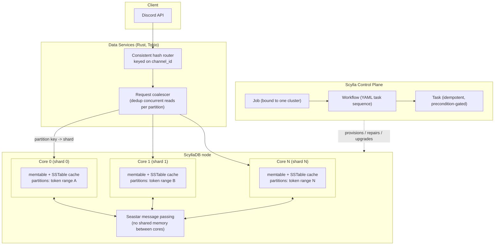
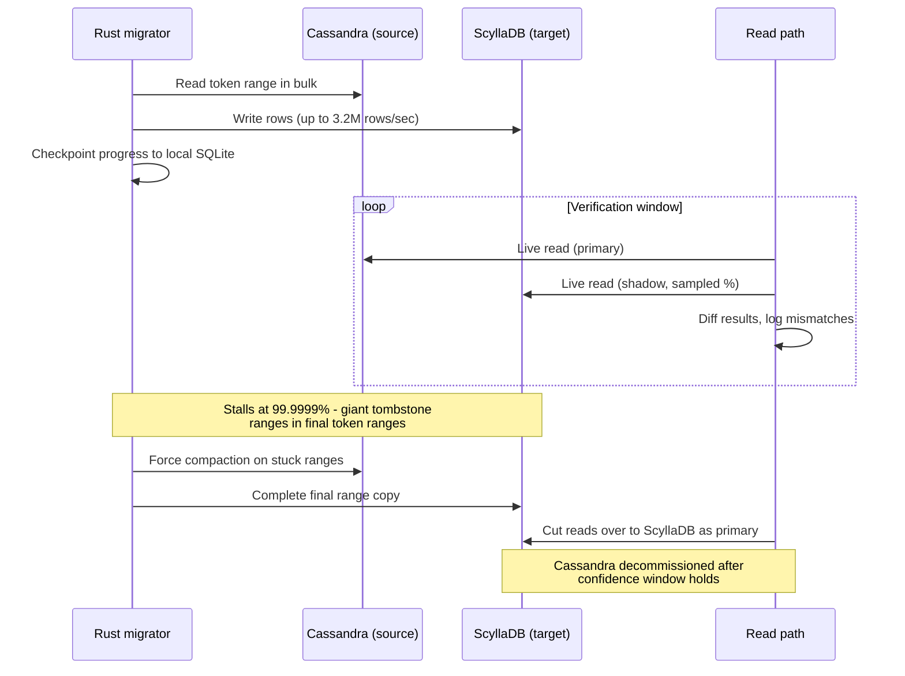

<!--
entry-meta
date: 2026-09-04
category: Tech Blog Analysis
title: How Discord Moved Trillions of Messages From Cassandra to ScyllaDB
slug: discord-cassandra-scylladb-migration
-->

# How Discord Moved Trillions of Messages From Cassandra to ScyllaDB

**2026-09-04 · Tech Blog Analysis**

Source: Discord's own engineering blog, "How Discord Stores Trillions of Messages" and its follow-up "How Discord Automates ScyllaDB Clusters at Scale." This is a genuine production war story — not a vendor pitch — about outgrowing a data model that was correct on paper and hostile in practice, and about what it actually took to move a live, latency-sensitive dataset between two storage engines without downtime.

## The Starting Point: A Reasonable Cassandra Schema That Still Hurt

Messages are partitioned by `(channel_id, bucket)`, where `bucket` is a static time window — this keeps a channel's message history contiguous and lets Discord avoid unbounded partitions by rolling into a new bucket periodically. Within a partition, rows cluster by Snowflake message ID, which is monotonic, so "give me the last 50 messages" is a clustering-key range scan, not a secondary-index lookup.

That schema is not the problem. The problem is what Cassandra does under it at scale:

- **Write path is cheap, read path is not.** Writes append to a commit log and land in an in-memory memtable, flushed to disk later. Reads have to reconcile the memtable with however many on-disk SSTables currently hold fragments of that partition — read amplification that gets worse the more SSTables pile up.
- **Compaction is the tax that comes due later.** SSTables merge in the background to keep read amplification bounded. Discord's clusters "were prone to falling behind on compactions" — when the backlog grows, reads touch more files, latency rises, and the fix (temporarily pulling a node, letting it compact, bringing it back, waiting out hinted-handoff recovery) was manual, per-node, repeated firefighting across 177 nodes.
- **JVM GC pauses stack on top of that.** Cassandra runs on the JVM; heap and garbage-collector tuning became a standing job, because a GC pause on one node shows up as a latency spike on every quorum read or write that touches it.
- **Hot partitions are structural, not incidental.** A huge Discord server and a two-person DM both use the same `(channel_id, bucket)` shape, but their traffic differs by orders of magnitude. Cassandra distributes partitions across the ring by token range, with no awareness that one partition is about to get hammered — so a viral channel could park a disproportionate share of cluster load on whichever node(s) held its token range.

None of these are Cassandra "bugs" — they're consequences of its architecture: a JVM process, SSTable-based LSM storage, and a thread-pooled (SEDA-style) request-handling model where stages hand work off across shared thread pools rather than pinning work to cores.

## Why ScyllaDB: Shard-Per-Core Changes the Failure Mode, Not Just the Numbers

ScyllaDB is a from-scratch reimplementation of the Cassandra wire protocol and SSTable format in C++, built on the **Seastar** framework. The architectural bet that matters here is **shard-per-core**:

- The cluster is divided into token ranges as usual (Cassandra-compatible partitioning), but *within* a node, each partition additionally maps deterministically to one specific CPU core.
- Each core gets its own memtables, its own SSTable cache, its own heap, its own I/O queues — no shared mutable state between cores, so no lock contention and no cache-line bouncing between cores serving different partitions.
- Cross-core work happens through explicit, non-blocking message passing (Seastar's async runtime), never shared memory — the same design principle actix/tokio-style Rust services use, applied inside the database engine itself.
- There is no JVM, so there is no GC pause to tune around. Memory management is manual/arena-based inside Seastar.

The practical effect: a hot partition still concentrates load, but it concentrates onto one core's dedicated queue instead of contending with every other core's work through shared thread pools and a shared heap. The blast radius of "one channel got hot" shrinks from "the whole node's GC and thread pools" to "one core's queue."

## Migration: The Estimate That Was Wrong, and Why the Rewrite Fixed It

**Plan A** was a Spark-based batch migrator doing a time-windowed copy: estimated **3 months** to move the full message history at Discord's scale — too slow for a moving dataset that keeps taking new writes throughout.

**Plan B**: Discord's data-services team already maintained a Rust library (Tokio-based) used to build the request-routing services in front of the database. They extended that library into a purpose-built migrator instead of using a generic ETL framework. Result: an estimated **9-day** migration, executing at up to **3.2 million rows/second**, with progress checkpointed into local SQLite so a restart didn't mean starting over.

**Correctness, not just speed:** a small percentage of live reads were dual-served against both Cassandra and ScyllaDB and diffed before the read path was allowed to cut over to Scylla as the source of truth — this is the part that makes "9 days" trustworthy rather than just fast.

**The long tail:** the migration stalled at **99.9999%** complete. Cause: a small number of final token ranges held enormous tombstone ranges — accumulated delete markers that Cassandra hadn't yet compacted away — which made those specific ranges pathologically expensive to scan and copy. Compacting that data out on the source side is what let the migration actually finish. This is a good example of the kind of failure that only shows up at the tail: the first 99.9% validates your approach, the last sliver tests your patience and your tooling's ability to diagnose *why* one shard of work is stuck instead of just retrying it blindly.

## Data Services: A Routing Layer That Does More Than Route

In front of both databases (during and after migration), Discord runs Rust services that add two mechanisms databases don't give you for free:

- **Consistent hash routing on `channel_id`.** Every request for a given channel lands on the same service instance. This isn't just cache locality — it's what makes the next mechanism possible.
- **Request coalescing.** If N requests for the same partition arrive concurrently, the first spawns a worker task; the rest subscribe to that task's in-flight result instead of issuing N redundant queries. Because routing is consistent-hashed, "concurrent requests for the same partition" reliably land on the *same* service instance where they can actually be coalesced — decoupling routing from coalescing would make this far less effective.

This layer is why a hot channel doesn't turn into N redundant database reads in the first place — it's damage control applied *before* the query ever reaches the shard-per-core engine underneath.

## Results (2022 migration)

| Metric | Cassandra | ScyllaDB |
|---|---|---|
| Node count | 177 | 72 |
| Avg. disk per node | ~4 TB | 9 TB |
| Historical fetch p99 | 40–125 ms | ~15 ms |
| Message insert p99 | 5–70 ms | steady ~5 ms |

Fewer, denser nodes *and* tighter, less variable tail latency — the variance drop (a fixed ~15ms/~5ms instead of a wide range) matters as much as the average, because tail latency is what actually page an on-call engineer.

## The Sequel Nobody Talks About: Operating Dozens of Clusters, Not One

A successful migration just relocates the operational burden — "How Discord Automates ScyllaDB Clusters at Scale" describes what they built once they had *many* ScyllaDB clusters instead of one: the **Scylla Control Plane (SCP)**, replacing ad hoc scripts that were, in their words, "unsafe, unrecoverable, and hard to extend."

SCP has three layers:

- **Tasks** — the smallest unit of work, scoped to either a single node or a whole cluster. Every task must be idempotent and must declare its own preconditions (checked against live ScyllaDB APIs and Prometheus metrics before it's allowed to run).
- **Workflows** — YAML-defined sequences of tasks, with retry counts, parallelism limits (`concurrency_unit` for batching strategy — e.g. one node per availability zone — and `concurrency_limit` for the cap on simultaneous execution), and template variables for runtime parameters.
- **Jobs** — one concrete execution of a workflow against a specific cluster, with state persisted to SQLite so an interrupted job resumes from its last completed task rather than restarting.

The idempotence-plus-precondition combination is the actual point: a task doesn't run because it's "next in the script," it runs because the cluster is verifiably in the state that makes running it safe, and re-running a job after a crash re-checks those preconditions rather than blindly resuming a sequence. Measured impact: cluster operations that took **a day and a half** of hands-on engineering time now finish in **under two hours**, mostly unattended bootstrap wait time.

## System Map



## Migration Cutover Sequence



## Hands-On Exercise

**Part 1 — reproduce the partition-to-shard mapping locally.** This makes the "hot partition = hot shard, not hot cluster" claim concrete.

```bash
docker run -d --name scylla-local -p 9042:9042 scylladb/scylla \
  --smp 4 --memory 1G --overprovisioned 1

# wait ~30s for it to come up, then:
docker exec -it scylla-local cqlsh
```

```sql
CREATE KEYSPACE learnlog WITH replication =
  {'class': 'SimpleStrategy', 'replication_factor': 1};
USE learnlog;

CREATE TABLE messages (
  channel_id bigint,
  bucket int,
  message_id bigint,
  author_id bigint,
  content text,
  PRIMARY KEY ((channel_id, bucket), message_id)
) WITH CLUSTERING ORDER BY (message_id DESC);

TRACING ON;
INSERT INTO messages (channel_id, bucket, message_id, author_id, content)
VALUES (1001, 0, 100000001, 55, 'first message');
INSERT INTO messages (channel_id, bucket, message_id, author_id, content)
VALUES (1001, 0, 100000002, 55, 'second message, same partition');
INSERT INTO messages (channel_id, bucket, message_id, author_id, content)
VALUES (9999, 0, 100000003, 77, 'different channel');
```

**What to look for:** the trace output for each `INSERT` names the coordinating node/shard that handled it. The two inserts into `(1001, 0)` should trace through the same shard every time; the insert into `(9999, 0)` very likely traces through a different one. That's the whole hot-partition mechanism made visible — the partition key, not the row, is the unit of placement, so every message ever sent in channel 1001's bucket 0 is permanently pinned to whichever shard that partition hashed to.

**Part 2 — build and decode a Snowflake ID by hand**, to see why clustering by message ID gives free time-ordering:

```python
DISCORD_EPOCH = 1420070400000  # 2015-01-01T00:00:00Z, in ms

def make_snowflake(timestamp_ms, worker_id=1, process_id=0, sequence=0):
    return ((timestamp_ms - DISCORD_EPOCH) << 22) | (worker_id << 17) | (process_id << 12) | sequence

def decode_snowflake(snowflake):
    timestamp_ms = (snowflake >> 22) + DISCORD_EPOCH
    return {
        "timestamp_ms": timestamp_ms,
        "worker_id": (snowflake >> 17) & 0b11111,
        "process_id": (snowflake >> 12) & 0b11111,
        "sequence": snowflake & 0b111111111111,
    }

import time
sf = make_snowflake(int(time.time() * 1000), worker_id=3, sequence=7)
print(sf, decode_snowflake(sf))
```

**What to look for:** the decoded `timestamp_ms` should land within a second of when you ran it. Generate two IDs a few milliseconds apart and confirm the later one is numerically larger — that's the property that lets `ORDER BY message_id DESC` substitute for `ORDER BY created_at DESC` with no separate timestamp column or secondary index.

## Further Study

- [How Discord Migrated Trillions of Messages to ScyllaDB — The New Stack](https://thenewstack.io/how-discord-migrated-trillions-of-messages-to-scylladb/)
- [Why ScyllaDB's Shard Per Core Architecture Matters — ScyllaDB](https://www.scylladb.com/2024/10/21/why-scylladbs-shard-per-core-architecture-matters/)
- [Staged event-driven architecture — Wikipedia](https://en.wikipedia.org/wiki/Staged_event-driven_architecture)

## Next Steps

1. Run the Part 1 exercise on a 3-node local ScyllaDB cluster (`--smp` per node) and deliberately hammer one partition with concurrent writes; watch `nodetool tablehistograms` or the Prometheus shard metrics to see load concentrate on one shard while siblings idle.
2. Read the SEDA architecture description for Cassandra and map each stage (read, write, gossip, compaction) to a thread pool, then contrast explicitly with where Seastar removes that indirection.
3. Prototype the request-coalescing pattern described here as a small Rust/Tokio service in front of any local database, and measure query reduction under synthetic concurrent load on the same key.
4. Read Discord's original Cassandra-to-ScyllaDB migration post end to end (not just this analysis) for details this entry didn't cover, particularly their earlier MongoDB-to-Cassandra migration referenced as prior history.

## Sources

- [How Discord Stores Trillions of Messages — Discord Blog](https://discord.com/blog/how-discord-stores-trillions-of-messages)
- [How Discord Automates ScyllaDB Clusters at Scale — Discord Blog](https://discord.com/blog/how-discord-automates-scylladb-clusters-at-scale)
- [ScyllaDB Shard-per-Core Architecture — ScyllaDB](https://www.scylladb.com/product/technology/shard-per-core-architecture/)
- [Snowflake ID — Wikipedia](https://en.wikipedia.org/wiki/Snowflake_ID)

## Takeaways

- A correct partition key (`channel_id, bucket`) doesn't save you from the storage engine's own overhead model — Cassandra's compaction backlog and JVM GC were structural costs independent of schema quality.
- Shard-per-core doesn't eliminate hot partitions; it isolates their blast radius to one core's queue instead of a shared thread pool and heap, which is a smaller, more diagnosable failure.
- The migration's real bottleneck was the generic tool (Spark), not the data volume — a purpose-built Rust migrator using infrastructure they already trusted cut the estimate from 3 months to 9 days.
- The last 0.0001% of a migration is where the differently-shaped failures live (tombstone ranges) — budget for that tail explicitly rather than assuming linear completion.
- Automation maturity is a distinct project from migration itself: SCP's idempotent-task-plus-precondition model is what turned "day-and-a-half firefight" into "two-hour unattended job," and it was built *after* the migration succeeded, not before.
