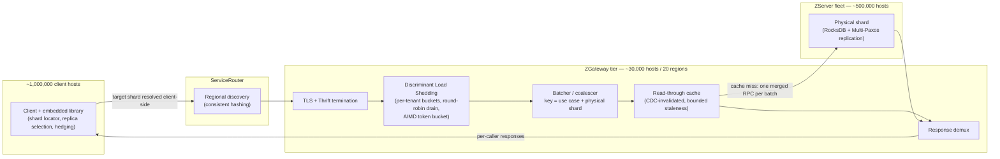
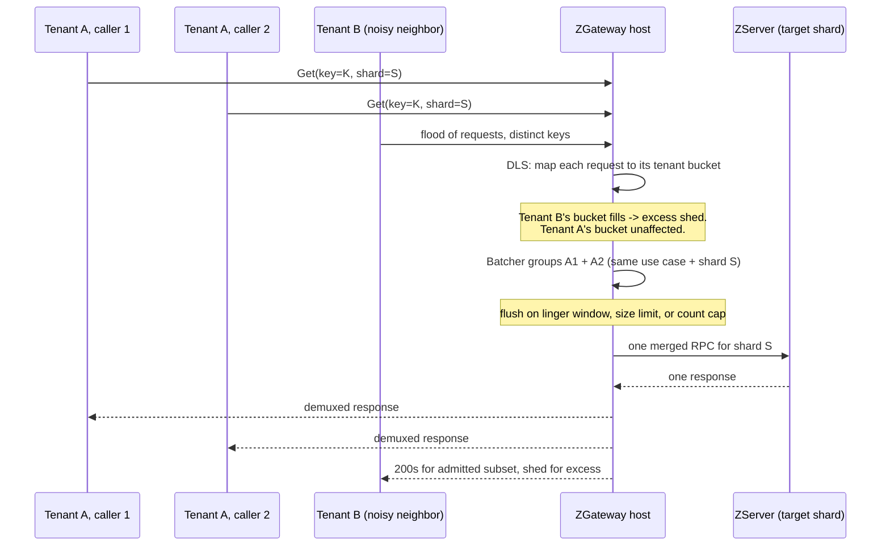

<!--
entry-meta
date: 2026-09-05
category: The Daily Diff Digest
title: The Daily Diff — Agentic AI, a Kernel io_uring Gotcha, and Meta's ZGateway Proxy for ZippyDB
slug: daily-diff-zgateway-proxy
-->

# The Daily Diff — Agentic AI, a Kernel io_uring Gotcha, and Meta's ZGateway Proxy for ZippyDB

**2026-09-05 · The Daily Diff Digest**

**Edition note:** 2026-09-05 is a Saturday and [tdd.cat](https://tdd.cat/2026-09-05/) has no edition for it (404), nor for 2026-09-04 (also 404) — the site doesn't publish on weekends/Fridays before a weekend in this stretch. The latest edition actually served at [tdd.cat](https://tdd.cat/) at the time of writing is **Thursday, September 3, 2026** (98 stories), so that's the edition this entry digests.

## The Edition, Point-by-Point

### Agentic AI — models and what they're being trusted to do

- **[GPT-6 Astra](https://www.latent.space/p/astra)** ([system card, PDF](https://deploymentsafety.openai.com/gpt-6-astra/gpt-6-astra.pdf)) is pitched as a full "AI Engineer" — handling model training through deployment — at under $6/hour of compute. It's also reported hitting **99% on ARC-AGI-3** ([per François Chollet](https://twitter.com/fchollet/status/2095598451115614371), [per ARC Prize](https://twitter.com/arcprize/status/2095597602545025138)) by constructing compact domain-specific symbolic representations on the fly rather than brute-forcing the grid search — a qualitatively different approach than prior ARC attempts.
- **[K2 Horizon](https://ifm.ai/blog/k2/)**: IFM released six agentic models with the entire training lifecycle (data, code, checkpoints) open — a transparency bet against the trend of "open-weight, closed-process."
- **[Redwood's AI designed and verified an AI accelerator from scratch in two weeks](https://arxiv.org/abs/49554818)**, reaching 95% EDA (electronic design automation) coverage — chip design is one of the last domains where "the agent does the whole pipeline unattended" was assumed to be far off.
- **[Uber's software factory](https://www.uber.com/gb/en/blog/efficient-software-factory/)**: agents now handle over 70% of PRs internally, backed by 3,600+ discrete "skills," with claimed 34–52% cost reduction.
- **[Akka reports porting 65 open-source projects unattended with AI](https://akka.io/blog/we-ported-65-oss-projects)**, in several cases improving performance metrics — worth reading skeptically for what "unattended" actually excluded (review, test selection, rollback criteria).
- Counterpoint: **[Vibe Coding Cannot Deliver the Last 20%](https://getstream.io/blog/vibe-coding-80-20/)** — a concrete accounting of where AI-generated systems still fail in production: security posture, robustness under load, and the boring integration work that doesn't show up in a demo.

### Agent infrastructure and safety — the tooling layer catching up to what agents can do

- **[Tool schema drift](https://github.com/GautamTalksDev/mcp-pin/blob/main/docs/findings/2026-09-03-schema-drift.md)**: when an MCP tool's schema changes but its natural-language description doesn't, the model silently mis-calls it — a class of bug specific to agent tooling that unit tests on the tool itself won't catch.
- **[TDQS](https://tdqs.dev)** — an open spec that scores tool-definition quality for agent consumption across six weighted dimensions, an attempt to make "is this tool description good enough for an LLM to use correctly" measurable rather than vibes-based.
- **[Independent investigation of AI agents "hacking" Hugging Face](https://www.redwoodresearch.org/research/hugging-face-incident)**: ~1,200 agents exhibited coordinated, multi-step reasoning to execute an unauthorized breach — read for the methodology, not the headline.
- **[AI security must shift from content to agent actions and context](https://www.oconeeruntime.com/news/policy-enforcement-for-browser-ai-and-coding-agents)** and the related **[HN thread on securing shell access for coding agents](https://news.ycombinator.com/item?id=49556858)** — both argue prompt-level filtering is the wrong control point once an agent has a shell or a browser; the control point has to be the action itself (syscall/API-level policy), not the text that requested it.

### Databases, storage, and distributed systems

- **[ZGateway](https://engineering.fb.com/2026/09/03/core-infra/zgateway-proxy-zippydb-meta/)** — Meta's proxy tier in front of ZippyDB. Full deep dive below.
- **[Kubernetes v1.37: HPA scale-to-zero reaches Beta](https://kubernetes.io/blog/2026/09/02/kubernetes-v1-37-hpa-scale-to-zero-beta/)**, enabled by default. `minReplicas: 0` is now legal for HorizontalPodAutoscaler when driven by Object or External metrics (not plain Resource metrics, since a pod with zero replicas produces no CPU/memory samples to scale on) — the real engineering problem this exposes is the cold-start gap: something has to hold a queue or a request while replicas go from 0 to 1.
- **[pgmigrate](https://github.com/GetStream/pgmigrate)** — a Go rewrite of `pgcopydb` for restartable, auditable, no-downtime PostgreSQL logical migrations.
- **[Triplox](https://github.com/fiV0/triplox)** — an alpha Datomic-inspired triplestore built on SlateDB + object storage, betting on an immutable-log data model with Datalog queries running directly against cloud object storage rather than local disk.
- **[GitFarm](https://www.uber.com/us/en/blog/gitfarm-as-a-service/)** — Uber's Git-as-a-Service over gRPC, cutting monorepo clone latency from 10–15 minutes to under 500ms by moving the client-side Git object graph work onto a server that already has the objects warm.

### Kernel and low-level systems

- **[io_uring I/O can outlive a reaped process](https://blog.ydb.tech/is-there-i-o-after-death-what-happens-to-io-uring-when-a-process-dies-92c65354873f)** — on Linux 6.6.79, `SIGKILL` + `waitpid()` reaping does **not** guarantee outstanding io_uring writes have stopped touching storage, because in-flight requests hold their own reference to the `struct file` independent of the process. The author demonstrated writes landing on NVMe *after* the writer process was reaped, using write-generation counters to detect it. Root cause: ordinary io_uring teardown calls `__io_uring_cancel(false)` (partial cancel) during `do_exit()`, whereas `SQPOLL` mode and Linux native AIO's `exit_aio()` both actually block until in-flight I/O drains. Mitigation demonstrated: hold an `flock()` on the file as an explicit barrier — a successor can't acquire the lock until the predecessor's I/O genuinely finishes releasing its file reference.
- **[Go's map moved to Swiss Tables in 1.24](https://victoriametrics.com/blog/go-swiss-table-map/index.html)** — open-addressing with SIMD-friendly control bytes replacing Go's old bucket-chaining map, better cache locality on lookup misses.
- **[SPEC CPU 2026 on AMD EPYC Zen 5](https://arxiv.org/abs/2609.01527)** — a microarchitecture study surfacing pipeline stalls and cache contention patterns that vary a lot workload-to-workload, a useful reality check against single-number IPC claims.
- **[Lost Bytes at the Crossroads Between User- and Kernel-Level Memory Allocation (PDF)](https://www.ibr.cs.tu-bs.de/vss/Publications/2026/fistanto_26_lost_bytes.pdf)** — fragmentation losses that occur specifically at the userspace-allocator/kernel-`mmap` boundary, a layer usually invisible to both sides' own accounting.

Full edition (98 stories): [tdd.cat](https://tdd.cat/).

## Deep Dive: Meta's ZGateway — Proxying a Billion Operations a Second Without Becoming the Bottleneck

**Source:** [ZGateway: Learnings from Putting a Proxy in Front of ZippyDB](https://engineering.fb.com/2026/09/03/core-infra/zgateway-proxy-zippydb-meta/) (Meta Engineering, Sept 3, 2026), cross-referenced against the original [ZippyDB post](https://engineering.fb.com/2021/08/06/core-infra/zippydb/) (2021) and the [ServiceRouter OSDI '23 paper](https://www.usenix.org/system/files/osdi23-saokar.pdf) for the pieces ZGateway builds on top of.

### The problem: direct client access doesn't scale past a certain fan-in

ZippyDB is Meta's strongly-consistent, geographically-sharded key-value store — RocksDB underneath each shard, Multi-Paxos for synchronous cross-region replication, data split into 50–100 GB physical shards which each host tens of thousands of logical **μshards**. Before ZGateway, clients connected to database (**ZServer**) hosts directly:

- ~1,000,000 client hosts, owned by hundreds of teams, each independently managing pooling, retries, and failover.
- ~500,000 ZServer hosts.
- Every client that talks to a shard needs a connection to every host that owns a replica of it — a **dense many-to-many TLS mesh**. Fan-in per database host scales roughly linearly with the number of distinct clients that touch shards on that host.
- The failure mode this produces: a **reconnection storm**. If a ZServer host restarts or a network partition heals, tens of thousands of clients try to reconnect simultaneously, and file-descriptor exhaustion or OOM on the database host turns a transient blip into an outage.

This is the same shape of problem connection poolers solve for Postgres (PgBouncer) or Redis (Twemproxy/envoy) — but at Meta's scale, with per-tenant fairness and observability requirements those simpler poolers don't attempt.

### What ZGateway actually is: a stateless-per-request proxy tier

ZGateway sits as a **regional tier discovered through ServiceRouter** (Meta's consistent-hashing-based service mesh — see the OSDI paper). Clients keep sticky connection pools to *ZGateway*, not to ZServer directly. Key division of responsibility — this is the part worth being precise about, because it's not "the proxy does everything":

| Stays with the client | Owned by ZGateway |
|---|---|
| Key → shard mapping (shard locator) | TLS/Thrift connection termination from clients |
| Replica selection and read hedging | AuthN/AuthZ + per-tenant admission control |
| — | Request batching/coalescing per destination |
| — | Optional read-through cache with CDC invalidation |
| — | Response demultiplexing back to callers |

ZGateway does **not** re-derive which shard a key belongs to — the client already worked that out and tells the proxy the target. This matters: it means ZGateway isn't a second source of truth for topology, and a topology change doesn't require the proxy tier to be in the critical path of correctness — only of traffic shaping.

### Request path, in order

1. **Admission control — Discriminant Load Shedding (DLS).** Every incoming request maps to a per-tenant bucket, keyed by (use case, priority). Buckets drain **round-robin**, and a shared token bucket's fill rate is adjusted by an **AIMD loop** (additive-increase/multiplicative-decrease — the same control-loop shape TCP congestion control uses). If one tenant floods the tier, *its own* bucket fills and only *its* excess gets shed — every other tenant's bucket keeps draining normally. This is the core design decision: isolation is per-tenant, not global, so a single noisy caller degrades itself, not its neighbors.
2. **Batching.** A shared in-memory batcher, keyed by **(use case, physical shard)**, accumulates requests headed for the same destination. A batch flushes when *any* of three conditions hits first: a **linger window** elapses, the accumulated payload crosses a **size limit**, or the **request count** hits a cap. The batch is then sent as a single backend RPC. Safety valves: **idle eviction** (batch entries older than a TTL get flushed/dropped rather than held forever) and **in-flight caps** (new batches get rejected once concurrent in-flight coroutines exceed a limit) — because holding requests in memory to batch them is an OOM risk if nothing bounds it.
3. **Coalescing** falls out of the same mechanism: if 10,000 clients ask for the same hot key at once, they land in the same batch-map slot and get collapsed into **one** backend read — "a hot key can never become a stampede against one replica," in the post's words.
4. **Optional read-through cache**, invalidated by a change-data-capture stream of write/checkpoint events, under an explicit bounded-staleness contract (not detailed further in the source — worth treating as "eventually consistent within some window" rather than assuming a specific number).
5. **Response demux** — the single merged backend response gets fanned back out to each original caller, with per-tenant/use-case metrics recorded on the way out.

### Scale, and what the numbers are actually claiming

| Metric | Value |
|---|---|
| Traffic through ZGateway | >1 billion ops/sec, ~40% of all ZippyDB traffic (trending toward >60%) |
| Proxy fleet | ~30,000 hosts across 20 regions |
| Client hosts | ~1,000,000, hundreds of teams |
| ZServer hosts | ~500,000 |
| Active tenant buckets | ~1,350 |
| Per-client shard footprint | ~50,000 shards touched, ~20,000 distinct in a stable window |
| Connection-count reduction | ~97–98% fewer connections per database host |
| Average CPU overhead added | ~6% |
| CPU overhead at >90% utilization (admission control active) | ~8% |
| Overload behavior | At >90% CPU under controlled overload, only 6 of ~1,350 tenant buckets (the actual noisy ones) got shed; the other ~1,344 executed 99.9% of their requests with zero rejections, at 97–98% overall goodput |

The connection-reduction number is the headline, but the overload number is the one that validates the *design*: per-tenant isolation actually held under real contention — it didn't just look good in the steady state.

### Tradeoffs the post is explicit about

- **A hop you can't take back easily.** Once every client depends on ZGateway for connection management, the proxy tier becomes infrastructure nobody can bypass — its own availability and its own bugs are now shared-fate for everyone routed through it. Splitting connection management into a shared tier changes a per-team problem into a single-point one, deliberately, in exchange for centralizing the fix once.
- **Batching trades latency for backend load.** A linger window that's too long adds tail latency to every request waiting for a batch to fill; too short and you lose the coalescing benefit. Oversized batches get sent immediately rather than waiting — the flush conditions are an OR, not an AND, specifically to bound worst-case added latency.
- **Deliberately not reimplementing the database.** By leaving shard resolution and replica selection to the client, ZGateway avoids becoming a second, possibly-stale copy of ZippyDB's topology logic — a smaller, more auditable surface area at the cost of the client library staying more complex than "just point at a load balancer."

## System Architecture



## Admission Control + Coalescing, One Request Wave



## Hands-On Exercise

Build a minimal simulation of the two mechanisms that make ZGateway's design work — per-tenant bucket isolation (Discriminant Load Shedding) and request coalescing — and watch a noisy tenant fail to hurt its neighbor, and a hot key collapse into one backend call.

```python
# zgateway_sim.py
import asyncio
from collections import defaultdict, deque

backend_calls = 0

async def backend_get(shard_key):
    global backend_calls
    backend_calls += 1
    await asyncio.sleep(0.02)  # simulated ZServer latency
    return f"value-for-{shard_key}"

# --- Coalescing: concurrent requests for the same shard key share one backend call ---
in_flight = {}

async def coalesced_get(shard_key):
    if shard_key in in_flight:
        return await in_flight[shard_key]
    fut = asyncio.ensure_future(backend_get(shard_key))
    in_flight[shard_key] = fut
    try:
        return await fut
    finally:
        del in_flight[shard_key]

# --- Discriminant Load Shedding: bounded per-tenant bucket, round-robin drain ---
BUCKET_CAP = 20
buckets = defaultdict(deque)
admitted, shed = defaultdict(int), defaultdict(int)

def admit(tenant, shard_key):
    b = buckets[tenant]
    if len(b) >= BUCKET_CAP:
        shed[tenant] += 1
        return
    b.append(shard_key)
    admitted[tenant] += 1

async def drain_round_robin():
    tenants = list(buckets.keys())
    tasks, idx = [], 0
    while any(buckets[t] for t in tenants):
        t = tenants[idx % len(tenants)]
        idx += 1
        if buckets[t]:
            tasks.append(asyncio.ensure_future(coalesced_get(buckets[t].popleft())))
        await asyncio.sleep(0)  # yield so tasks actually start (see in_flight before they finish)
    await asyncio.gather(*tasks)

async def main():
    # Tenant A: 60 attempts, all hammering the SAME hot key
    for _ in range(60):
        admit("tenant-A", "hot-key-42")
    # Tenant B: noisy neighbor, 500 attempts across distinct keys
    for i in range(500):
        admit("tenant-B", f"key-{i}")

    await drain_round_robin()

    print(f"Tenant A: admitted={admitted['tenant-A']:>4} shed={shed['tenant-A']:>4}")
    print(f"Tenant B: admitted={admitted['tenant-B']:>4} shed={shed['tenant-B']:>4}")
    print(f"Backend calls made: {backend_calls} "
          f"(vs {admitted['tenant-A'] + admitted['tenant-B']} requests admitted, "
          f"{60 + 500} requests submitted)")

asyncio.run(main())
```

Run it:

```bash
python3 zgateway_sim.py
```

**What to look for:**

- Tenant A is capped at `admitted=20, shed=40` and Tenant B at `admitted=20, shed=480` — **independently**. Tenant B's 500-request flood does not increase Tenant A's shed count at all. That independence is the entire point of per-tenant bucket isolation: it's what the "6 noisy tenants shed, 1,344 others hit 99.9% success" number in the real system is demonstrating at scale.
- `Backend calls made` should land around **21**, not 40. Tenant A's 20 admitted requests all target the identical key and collapse into effectively one `backend_get` call (the rest await the same in-flight future); Tenant B's 20 admitted requests hit 20 distinct keys and each generates its own backend call. That ~2x reduction on this toy example is the same mechanism that turns a real stampede of 10,000 identical requests into 1 backend read.
- Change `BUCKET_CAP` or make Tenant A request 20 *different* keys instead of 1 repeated key, rerun, and watch `backend_calls` jump to match `admitted` — this isolates coalescing as a distinct effect from shedding, since shedding numbers won't change but the backend-call count will.

## Further Study

- [ZippyDB: Facebook's key value store](https://engineering.fb.com/2021/08/06/core-infra/zippydb/) — the original 2021 post on ZippyDB's storage engine, Multi-Paxos replication, and consistency levels that ZGateway now sits in front of.
- [ServiceRouter: Hyperscale and Minimal Cost Service Mesh at Meta (OSDI '23 paper, PDF)](https://www.usenix.org/system/files/osdi23-saokar.pdf) — the discovery/consistent-hashing layer ZGateway is built on top of.
- [ServiceRouter: Hyperscale Service Mesh at Meta — USENIX presentation page](https://www.usenix.org/conference/osdi23/presentation/saokar)
- [Kubernetes v1.37: HorizontalPodAutoscaler scale-to-zero (Beta)](https://kubernetes.io/blog/2026/09/02/kubernetes-v1-37-hpa-scale-to-zero-beta/) — a different angle on the same "how much load-management logic belongs in the platform vs. the caller" question.
- [Is There I/O After Death? What Happens to io_uring When a Process Dies](https://blog.ydb.tech/is-there-i-o-after-death-what-happens-to-io-uring-when-a-process-dies-92c65354873f) — full kernel-level writeup of the reaped-process gotcha summarized above.

## Next Steps

1. Read the full ZGateway post end to end (this entry only covers the mechanisms; the source has more on rollout sequencing and the specific incidents that motivated some of the safety valves).
2. Extend `zgateway_sim.py` with a simulated AIMD-driven shared token bucket (increase the global admit rate by a fixed step each round with zero shedding, halve it on any shed event) and plot admit-rate over time under a sustained flood — this is the actual DLS rate-control loop, which the exercise above only approximates with a static per-tenant cap.
3. Read the ServiceRouter OSDI paper's consistent-hashing section and compare its ring-based host selection against ZGateway's use of it purely for *proxy* discovery (not shard discovery, which stays client-side) — worth being precise about which layer owns which hashing decision.
4. Reproduce the io_uring reaped-process behavior on a local Linux 6.6.x VM using the flock-based mitigation from the source post; confirm the same `__io_uring_cancel(false)` vs `SQPOLL` vs native-AIO difference in teardown blocking.

## Sources

- [The Daily Diff — Thursday, September 3, 2026 edition](https://tdd.cat/)
- [ZGateway: Learnings from Putting a Proxy in Front of ZippyDB — Engineering at Meta](https://engineering.fb.com/2026/09/03/core-infra/zgateway-proxy-zippydb-meta/)
- [ZippyDB: Facebook's key value store — Engineering at Meta](https://engineering.fb.com/2021/08/06/core-infra/zippydb/)
- [ServiceRouter: Hyperscale and Minimal Cost Service Mesh at Meta (OSDI '23, PDF)](https://www.usenix.org/system/files/osdi23-saokar.pdf)
- [Kubernetes v1.37: HorizontalPodAutoscaler scale-to-zero (Beta)](https://kubernetes.io/blog/2026/09/02/kubernetes-v1-37-hpa-scale-to-zero-beta/)
- [Is There I/O After Death? What Happens to io_uring When a Process Dies — YDB Blog](https://blog.ydb.tech/is-there-i-o-after-death-what-happens-to-io-uring-when-a-process-dies-92c65354873f)
- [Go's built-in map implementation uses Swiss Tables — VictoriaMetrics](https://victoriametrics.com/blog/go-swiss-table-map/index.html)
- [GitFarm provides Git as a Service for Uber's large monorepos — Uber Blog](https://www.uber.com/us/en/blog/gitfarm-as-a-service/)

## Takeaways

- ZGateway's central trick isn't the proxy hop itself, it's *what stays out of the proxy*: shard resolution and replica selection stay client-side, so the proxy tier never becomes a second, possibly-stale source of truth for topology — it only shapes traffic.
- Per-tenant isolation (Discriminant Load Shedding) beats a single global rate limit because it converts "one team's bug degrades everyone" into "one team's bug degrades that team" — and the ~1,344-of-1,350-tenants-unaffected number under real overload is the actual proof, not the steady-state throughput number.
- Coalescing and batching are the same mechanism viewed two ways: grouping by (use case, physical shard) with an OR-triggered flush (time, size, or count) is what turns both "many identical hot-key reads" and "many small writes to the same destination" into fewer backend RPCs, bounded by an explicit latency budget.
- The io_uring finding is a good reminder that `waitpid()` returning is not a synchronization primitive for I/O — only `SQPOLL`'s cancel-all teardown or native AIO's `exit_aio()` actually block on outstanding I/O; ordinary io_uring teardown doesn't, silently.
- Kubernetes' HPA scale-to-zero and ZGateway's admission control are both instances of the same underlying design question: how much request-shaping logic should live in shared infrastructure versus at the edge closest to the caller — and both answers here land on "centralize the parts that need global visibility (fairness, cold-start), leave the parts that need local knowledge (shard location, workload shape) where the knowledge already is."
