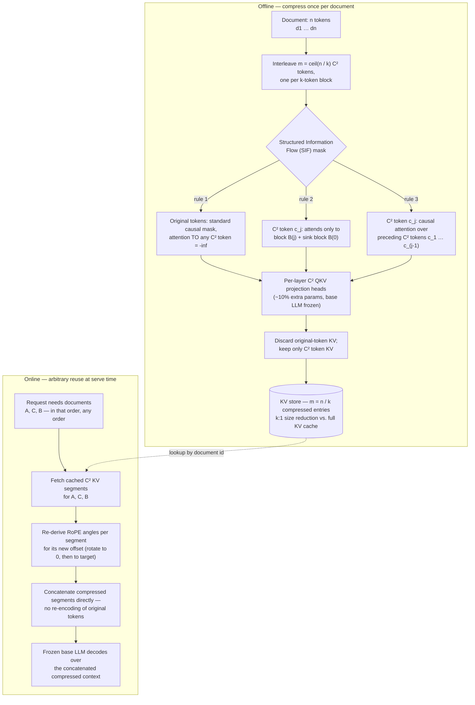

<!--
entry-meta
date: 2026-09-06
category: Variety
title: C²KV — Making KV-Cache Reuse Compression-Aware and Position-Free
slug: c2kv-composable-kv-cache-reuse
-->

# C²KV — Making KV-Cache Reuse Compression-Aware and Position-Free

**2026-09-06 · Variety**

Today's variety slot: an AI/ML systems paper. [C²KV](https://arxiv.org/abs/2607.17715) (Du et al., accepted at ACM SIGKDD 2026) attacks a problem that sits underneath every long-context LLM deployment — the KV cache is too big to move around fast, and the two existing tricks for reusing it (prefix caching, block-local caching) each give up something to get there. Understanding *why* requires putting three systems side by side, so this entry traces the lineage: **RadixAttention → Block-Attention → C²KV**.

## 1. Why the KV cache is the bottleneck, not attention FLOPs

During autoregressive decode, each new token's attention step has to read the **entire** existing KV cache from HBM to compute `softmax(QKᵀ)V`. That read is pure memory traffic — no reuse of the loaded bytes across tokens in the batch dimension the way weights are reused. For a GQA model:

```
bytes_per_token = 2 (K and V) × n_layers × n_kv_heads × head_dim × dtype_bytes
```

For Llama-3.1-8B (32 layers, 8 KV heads, head_dim 128, bf16): `2 × 32 × 8 × 128 × 2 = 131,072 bytes = 128 KiB/token`. That number alone explains the paper's opening claim that "the transfer of uncompressed KV states between memory hierarchies is the dominant latency factor" — see the exercise below for the actual millisecond cost this implies at real context lengths.

Two independent levers exist to cut this traffic: **don't recompute what you can cache**, and **store less per cached token**. Prior systems mostly pulled the first lever. C²KV pulls both.

## 2. Three generations of KV-cache reuse

| System | Reuse granularity | What's cached | Position handling | Compression | Fine-tuning cost | Reported gain |
|---|---|---|---|---|---|---|
| [RadixAttention / SGLang](https://www.lmsys.org/blog/2024-01-17-sglang/) | **Prefix only** | Full-precision KV, keyed by a radix tree over token-id sequences | N/A — reused spans are always at their original offset | None | None (inference-time only) | up to 5× throughput vs vLLM v0.2.5 |
| [Block-Attention](https://arxiv.org/html/2409.15355v1) | **Any block, any order** (block = one retrieved passage) | Full-precision KV per block | RoPE re-rotation: rotate to zero, then to the new offset | None | ~400 SFT steps | TTFT 45 ms vs 3,638 ms at 32K context (98.7%↓); FLOPs ↓99.8%; accuracy 68.4% vs 67.9% (Llama3) |
| [C²KV](https://arxiv.org/abs/2607.17715) | **Any block, any order** | *Compressed* KV — only k:1 "C² tokens," not original tokens | Same re-rotation idea, applied to far fewer cached positions | **k:1**, k is a knob | SFT of a ~10%-parameter sidecar extractor | up to **17×** inference speedup |

The progression is a straight line: RadixAttention proved caching helps but only along a single tree-shaped axis (shared prefixes). Block-Attention broke the prefix constraint by making each retrieved chunk self-contained — computed with attention restricted to itself — and used a RoPE trick to relocate it anywhere in a new sequence. But it still caches the *original, uncompressed* KV tensors, so storage and bandwidth scale exactly like doing nothing. C²KV asks: if a block's KV is going to be reusable at any position anyway, why not also shrink it?

### RadixAttention's structural limit

A radix tree maps token-ID sequences to cached KV pages one page per token. Lookup finds the longest matching **prefix**; anything after the first divergence is a cache miss, however similar the remaining text is. That's why two requests that share a *middle* chunk (e.g., the same retrieved passage inserted in a different position, or after a different system prompt) get zero reuse — the data structure itself only understands "same characters so far, in order, from position 0."

### Block-Attention's fix, and its remaining cost

Block-Attention removes the "from position 0" requirement by computing each block's KV with attention **restricted to that block** (self-attention only, no cross-block leakage during encoding), so the block's KV is well-defined independent of what precedes it. To slot a cached block into a new sequence at a new offset, it undoes the original RoPE rotation (rotate counter-clockwise back to position 0) and reapplies the rotation for the new position (rotate clockwise). This is exact for RoPE because rotation is invertible and composable: `R(θ_new) · R(θ_old)⁻¹ · R(θ_old) = R(θ_new)`.

The cost: the fine-tuned model still produces **full-size** per-token KV for every cached block. Reuse eliminates recomputation FLOPs and the associated latency, but the bytes sitting in cache — and the bytes you'd need to move if that cache lives off-GPU — are unchanged.

## 3. C²KV's mechanism, in order

**Step 1 — Interleave compression tokens.** For a document of `n` tokens and compression ratio `k`, insert `m = ⌈n/k⌉` learnable "C² tokens," one per k-token block. Each C² token is a designated "compressed memory slot" for its block.

**Step 2 — Structured Information Flow (SIF) mask**, three simultaneously-enforced rules:

1. *Original-token invariance* — document tokens attend only to other document tokens (standard causal mask); attention from document tokens **to** C² tokens is set to `-∞`. This guarantees the frozen base model's forward pass is byte-for-byte unaffected by the extractor's presence.
2. *Block-local extraction* — C² token `c_j` attends only to its own block `B(j)` and a designated "sink block" `B(0)` (a fixed anchor block, the same trick anchor-token / attention-sink methods use to stabilize compression). This is what caps information flow into `c_j` to exactly one block's worth of content, which is what makes the resulting KV "block-local" and therefore relocatable.
3. *Causal accumulation* — C² tokens may attend to **preceding** C² tokens, so later compressed slots can carry forward document-level context without violating block-locality of the raw tokens.

**Step 3 — Per-layer QKV projection heads.** New trainable weight matrices, applied only to C² token hidden states, produce their own K and V (and Q, used only during extraction):
`Q_C²⁽ℓ⁾ = W_C²,Q⁽ℓ⁾ · h_C²⁽ℓ⁾` (and similarly for K, V). These project into the *same* space as the frozen model's own K/V so the two concatenate and enter standard attention arithmetic unmodified. This adds roughly 10% extra parameters — the base model's own weights never move.

**Step 4 — Discard, keep only C².** After the forward pass, only the K/V belonging to C² tokens are retained — the original per-token KV is thrown away. That's the actual compression: `n` tokens' worth of KV becomes `m = n/k` tokens' worth.

**Step 5 — Reuse.** At serving time, retrieved C² KV segments get fresh RoPE angles for wherever they land in the new sequence (same idea as Block-Attention, applied to `n/k` positions instead of `n`), then concatenate directly — no decompression back to token-level representations, no re-running the base model over the original text.

**Training — Compression-Concatenation Co-Training.** The extractor is trained end-to-end on the actual downstream task (supervised generation), with **concatenated** C² segments from multiple documents in the input — not single-document reconstruction. This is deliberate: it's what forces the extractor to produce representations that stay coherent when reordered and mixed with other documents' compressed segments, i.e., actually composable rather than just "a decent single-document summary vector." The paper reports training-based prefix methods like Block-Attention losing up to 10.4% on LongBench when pushed outside their trained regime — the co-training objective is the paper's answer to that fragility.

## 4. System diagram



## 5. Hands-on exercise

Two parts: (A) verify the SIF mask actually enforces the three invariants the paper claims, by building it yourself; (B) quantify why any of this matters, using real model numbers.

### Part A — build and verify the SIF mask

Save and run this (pure Python + NumPy, no GPU or model weights needed):

```python
import numpy as np

def build_sif_mask(n_doc, k):
    m = -(-n_doc // k)  # ceil
    total = n_doc + m
    mask = np.full((total, total), -np.inf)

    doc_idx = np.arange(n_doc)
    c2_idx = np.arange(n_doc, total)
    block_of_doc = doc_idx // k
    sink_block = 0

    # Rule 1: original tokens -> causal over doc tokens only, never see C2 tokens
    for i in doc_idx:
        mask[i, :i+1] = 0.0
        mask[i, n_doc:] = -np.inf

    # Rule 2 + 3: C2 token j -> its block + sink block, and causal over prior C2 tokens
    for row, j in enumerate(c2_idx):
        allowed_doc = doc_idx[(block_of_doc == row) | (block_of_doc == sink_block)]
        mask[j, allowed_doc] = 0.0
        mask[j, c2_idx[:row+1]] = 0.0

    return mask, n_doc, m, block_of_doc

def check_invariants(mask, n_doc, m, block_of_doc):
    c2_idx = np.arange(n_doc, n_doc + m)
    assert np.all(mask[:n_doc, n_doc:] == -np.inf), "a doc token attends to a C2 token"
    for row, j in enumerate(c2_idx):
        allowed = set(np.where(mask[j, :n_doc] == 0.0)[0].tolist())
        expected = set(np.where((block_of_doc == row) | (block_of_doc == 0))[0].tolist())
        assert allowed == expected, f"C2 token {row} block-locality violated"
    for row in range(m):
        seen = set(np.where(mask[n_doc+row, n_doc:] == 0.0)[0].tolist())
        assert seen == set(range(row+1)), f"C2 causal-accumulation violated at row {row}"
    print("All three SIF invariants hold.")

n_doc, k = 12, 3
mask, n_doc, m, block_of_doc = build_sif_mask(n_doc, k)
print(f"n_doc={n_doc}, k={k} -> m={m} C2 tokens, seq_len={n_doc+m}")
check_invariants(mask, n_doc, m, block_of_doc)

total = n_doc + m
for r in range(total):
    row = "".join("X" if mask[r, c] == 0.0 else "." for c in range(total))
    tag = f"d{r}" if r < n_doc else f"C{r-n_doc}"
    print(f"{tag:>3} {row}")
```

**What to look for:** the printed grid should show doc rows as a plain lower-triangular staircase (ordinary causal attention, zero contact with the C² columns), and each `C{j}` row should light up exactly the columns of its own block plus block 0 (the sink), plus every `C` column up to and including itself. If you shrink `k` from 3 to 1, `m` should equal `n_doc` and each C² token collapses to covering a single doc token — the degenerate, no-compression case. That confirms the mask *is* the mechanism, not just a description of it: block-locality and causality are structural properties of a matrix you can print and inspect, not emergent training behavior.

### Part B — quantify the bandwidth bottleneck the paper is solving

```python
layers, kv_heads, head_dim, dtype_bytes = 32, 8, 128, 2  # Llama-3.1-8B, bf16
bytes_per_token = 2 * layers * kv_heads * head_dim * dtype_bytes
print(bytes_per_token, "bytes/token =", bytes_per_token / 1024, "KiB/token")

for ctx in (8_192, 32_768, 128_000):
    total_gib = bytes_per_token * ctx / 1024**3
    for name, bw in [("A100 (2.0 TB/s)", 2.0e12), ("H100 (3.35 TB/s)", 3.35e12)]:
        ms = bytes_per_token * ctx / bw * 1000
        print(f"ctx={ctx:>7}  kv={total_gib:6.3f} GiB  {name:18s} -> {ms:6.3f} ms/decode-step")
```

**What to look for:** this reproduces `128 KiB/token`, and at 128K context, ~15.6 GiB of KV that costs 5–8 ms to merely *read* per decode step, before a single FLOP of attention math runs. A k=8 C²KV compression ratio turns that into ~2 GiB and ~0.6–1 ms — the mechanism from Part A applied at the byte-accounting level. This is the arithmetic behind the paper's headline 17× number: it isn't a training trick making the model "smarter," it's removing bytes from a bandwidth-bound read.

## Further Study

- [KVLink: Accelerating LLMs via Efficient KV Cache Reuse](https://arxiv.org/pdf/2502.16002) — another non-prefix reuse approach, useful point of comparison to C²KV's block-locality design.
- [AttentionStore: Cost-effective Attention Reuse across Multi-turn Conversations](https://arxiv.org/html/2403.19708v2) — reuse across conversation turns rather than across documents.
- [KVShare: Multi-Tenant KV Cache Reuse](https://arxiv.org/html/2503.16525v2) — the multi-tenant serving angle on the same underlying problem.
- [PagedEviction: Structured Block-wise KV Cache Pruning](https://arxiv.org/html/2509.04377v1) — orthogonal lever (evict rather than compress) worth contrasting with C²KV's keep-everything-but-smaller approach.
- [A³: Attention-Aware Accurate KV Cache Fusion](https://arxiv.org/html/2511.17560v1) — a fusion-based alternative to block-local compression.

## Next Steps

1. Extend the Part A script to a toy learned setting: random-initialize the C² projection matrices, run a forward pass with real Q/Kᵀ scores through the SIF mask, and confirm the softmax output for document-token rows is numerically identical with and without C² tokens present (verifies "original-token invariance" end-to-end, not just at the mask level).
2. Locally reproduce the RadixAttention prefix-hit/miss behavior using SGLang, then construct a request pair that shares a *non-prefix* middle span, to directly observe the cache-miss failure mode C²KV and Block-Attention are built to fix.
3. Implement the RoPE "rotate-to-zero, rotate-to-target" repositioning trick standalone (it's ~10 lines given a rotation-matrix helper) and verify it's numerically exact by comparing to directly computing RoPE at the target position.
4. Watch for C²KV's code/weights release and, if available, replicate the TTFT-vs-accuracy curve at k ∈ {2, 4, 8} on a small open model, since the abstract's 17× figure is a maximum, not a typical operating point.

## Sources

- [C²KV: Compressed and Composable KV Cache Reuse for Efficient LLM Inference (full text)](https://arxiv.org/html/2607.17715v1)
- [C²KV abstract page](https://arxiv.org/abs/2607.17715)
- [Block-Attention for Low-Latency RAG](https://arxiv.org/html/2409.15355v1)
- [Fast and Expressive LLM Inference with RadixAttention and SGLang — LMSYS blog](https://www.lmsys.org/blog/2024-01-17-sglang/)

## Takeaways

- The KV cache bottleneck is a **bandwidth** problem (128 KiB/token for an 8B model, read in full every decode step), not primarily a FLOPs problem — any fix that doesn't reduce bytes moved only attacks half the cost.
- RadixAttention → Block-Attention → C²KV is a clean lineage: relax "prefix only" to "any block," then relax "full-size" to "compressed," while each step keeps the previous step's guarantees (exact reuse validity, frozen base model).
- C²KV's actual trick is architectural, not statistical: a hard attention mask (SIF) that structurally forces compressed tokens to be block-local and unidirectionally derived from content — composability is a *guaranteed property of the mask*, not a hoped-for side effect of training.
- Co-training on concatenated, reordered segments (not single-document reconstruction) is what prevents the fragility seen in prior training-based methods when they're used outside their exact trained configuration.
