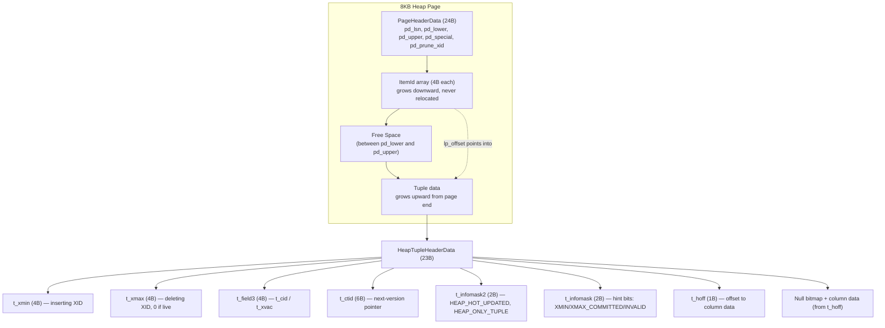
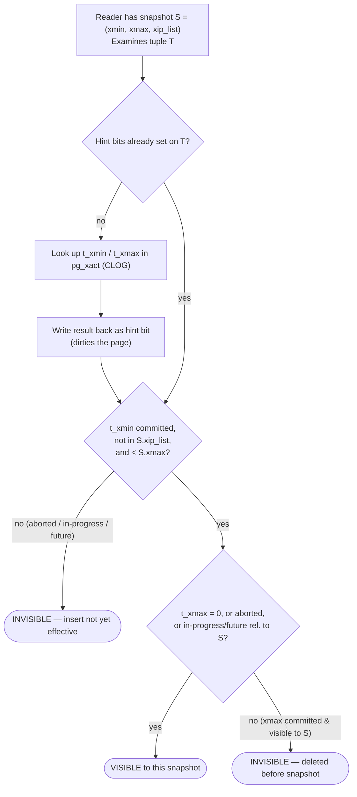
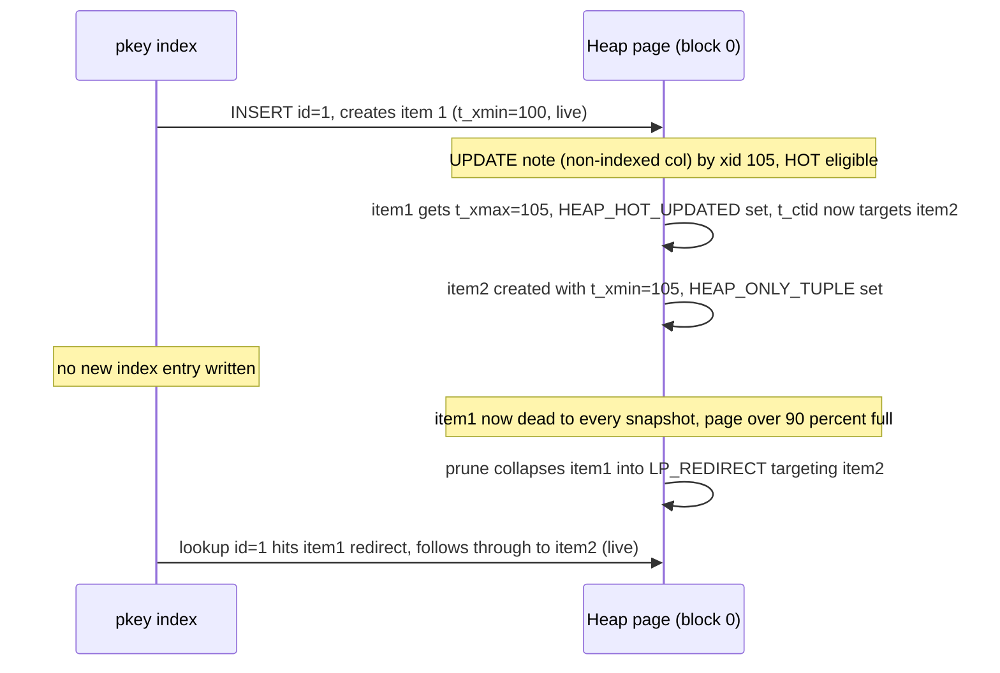

<!--
entry-meta
date: 2026-09-07
category: Database Internals
title: PostgreSQL MVCC Internals — Tuple Versions, Hint Bits, HOT Chains, and VACUUM
slug: postgres-mvcc-vacuum-internals
-->

# PostgreSQL MVCC Internals: Tuple Versions, Hint Bits, HOT Chains, and VACUUM

**2026-09-07 · Database Internals**

Postgres has no in-place update in the general case. `UPDATE` inserts a new tuple and marks the old one dead; `DELETE` just marks a tuple dead. Everything else — hint bits, HOT chains, VACUUM, freezing, autovacuum thresholds — exists to make that scheme cheap to read and eventually clean up. This entry walks the actual on-disk structures and algorithms, not the "MVCC = versions" one-liner.

## 1. The Physical Layout: What's Actually on an 8 KB Page

A heap page has five regions. Item pointers grow down from the header; tuples grow up from the end of the page — they meet in the middle at `pd_lower`/`pd_upper`.

| Region | Size | Contents |
|---|---|---|
| `PageHeaderData` | 24 bytes | `pd_lsn` (last WAL LSN touching this page), `pd_checksum`, `pd_flags`, `pd_lower`, `pd_upper`, `pd_special`, `pd_pagesize_version`, `pd_prune_xid` (oldest unpruned XMAX — a fast skip-check for the pruning routine) |
| Item pointer array (`ItemIdData`) | 4 bytes/entry | `(lp_offset, lp_flags, lp_len)` triples. `lp_flags` is one of `LP_UNUSED`(0), `LP_NORMAL`(1), `LP_REDIRECT`(2), `LP_DEAD`(3) |
| Free space | variable | Between the item array and the tuple data |
| Tuple data | variable | Actual row versions, packed from the end of the page backward |
| Special space | variable | Index-only (AM-specific); empty on heap pages |

A `CTID` (`ItemPointerData`, 6 bytes) is just `(block number, item pointer index)`. Because item pointers never move once allocated (only their target or flags change), a CTID is a stable long-term handle — that's what indexes store.

The tuple header itself (`HeapTupleHeaderData`, 23 bytes on a typical 64-bit build) is the whole MVCC engine in a struct:

| Field | Size | Purpose |
|---|---|---|
| `t_xmin` | 4B | XID that inserted this version |
| `t_xmax` | 4B | XID that deleted/updated this version away (0 = still current) |
| `t_field3` | 4B | union of `t_cid` (command id within the inserting/deleting xact) and `t_xvac` (legacy VACUUM FULL move marker) |
| `t_ctid` | 6B | forward pointer: for a live tuple, points to itself; for an updated tuple, points to the next version |
| `t_infomask2` | 2B | low 11 bits = attribute count; high bits = `HEAP_HOT_UPDATED`, `HEAP_ONLY_TUPLE`, etc. |
| `t_infomask` | 2B | hint bits + null-bitmap-present flag + a dozen other status bits |
| `t_hoff` | 1B | offset (MAXALIGN'd) where user column data starts |

User data follows: an optional null bitmap (1 bit/column, only if `HEAP_HASNULL` is set), then fixed- and variable-length columns, with `varlena` headers for anything that might be TOASTed out-of-line.

## 2. MVCC Is Just Disciplined Use of `xmin`/`xmax`

- **INSERT**: new tuple, `t_xmin = <inserter's XID>`, `t_xmax = 0`, `t_ctid` points to itself.
- **DELETE**: no bytes removed. `t_xmax` is set to the deleting XID. The tuple is now dead to any snapshot that can see that XID as committed, but it physically stays until VACUUM.
- **UPDATE** (non-HOT path): old tuple gets `t_xmax = <updater's XID>` and `t_ctid` rewritten to point at the new tuple's TID; a brand-new tuple is inserted with `t_xmin = <updater's XID>`. Every index gets a new entry pointing at the new TID — this is the expensive path.
- **Row versions accumulate** on the page (or spill to a new page) until nothing needs them — that's "bloat," and it's the direct, mechanical consequence of never overwriting in place.

## 3. Snapshots and the Visibility Decision

A snapshot is `(xmin, xmax, xip_list)`:

- `xmin` — smallest XID still running when the snapshot was taken; anything older is guaranteed either committed or aborted.
- `xmax` — one past the largest XID assigned so far; anything ≥ this didn't exist yet.
- `xip_list` — the specific XIDs that were in-progress at snapshot time (needed because `xmin..xmax` isn't contiguous in usage).

**Read Committed** takes a fresh snapshot per *statement*. **Repeatable Read** and **Serializable** take one snapshot for the whole transaction (Serializable additionally tracks read/write dependencies to detect and abort dangerous cycles — Serializable Snapshot Isolation, not classic locking).

The core check (`HeapTupleSatisfiesMVCC` in `heapam_visibility.c`) is roughly:

1. Is `t_xmin`'s hint bit already `HEAP_XMIN_COMMITTED` / `HEAP_XMIN_INVALID`? If not, look up the XID's status in `pg_xact` (the commit log, formerly `pg_clog`) and cache the answer as a hint bit — **this write dirties the page**, even on a pure `SELECT`.
2. If `t_xmin` aborted → invisible, full stop.
3. If `t_xmin` committed but is in the snapshot's `xip_list`, or `t_xmin >= snapshot.xmax` → the insert happened "in the future" relative to this snapshot → invisible.
4. Otherwise the insert is visible. Now check `t_xmax` the same way: if it's `0`/invalid, or its XID aborted, or it's uncommitted/in `xip_list`/in the future → the deletion doesn't count yet → tuple is **visible**.
5. If `t_xmax` is committed and visible to the snapshot → tuple is **dead** to this snapshot.

This is why two transactions can look at the same page and see completely different rows: they're evaluating the same bytes against different `(xmin, xmax, xip_list)` triples, and readers never block writers because nobody takes a lock to do it.

## 4. Hint Bits: Caching the Commit Log

Checking `pg_xact` on every visibility check would mean a lookup (with its own buffer/lock traffic) for every row, every scan, forever. So the first backend to resolve a tuple's commit status writes the answer back into `t_infomask`:

- `HEAP_XMIN_COMMITTED` / `HEAP_XMIN_INVALID`
- `HEAP_XMAX_COMMITTED` / `HEAP_XMAX_INVALID`

Any subsequent reader trusts the bit and skips `pg_xact` entirely. The catch: setting a hint bit modifies the page, so it becomes dirty and eventually needs to be written back — a plain `SELECT * FROM freshly_bulk_loaded_table` can generate real write I/O the first time it scans rows whose hint bits were never set (e.g., right after `COPY`).

## 5. HOT: Skip the Index When You Can

A **HOT (Heap-Only Tuple) update** applies when both hold:

1. No column referenced by any index (including expression/partial index predicates) changed.
2. There's free space for the new version *on the same page* as the old one.

Mechanics:

- The old tuple's `t_infomask2` gets `HEAP_HOT_UPDATED` set, and its `t_ctid` is rewritten to point at the new tuple's line pointer — still on the same page.
- The new tuple gets `HEAP_ONLY_TUPLE` set, meaning "no index points directly at me; you only get here by following a chain."
- Every index keeps pointing at the *root* line pointer of the chain. An index lookup lands on the root, sees `HEAP_HOT_UPDATED`, and walks `t_ctid` forward until it finds the version visible to its snapshot. **No new index entry is written.**

Once every tuple before the last one in a chain is dead to all snapshots, **pruning** can collapse it: intermediate line pointers are freed, and the root line pointer is rewritten as `LP_REDIRECT`, pointing straight at the surviving item — a redirect costs 4 bytes, not a tuple's worth of space. Pruning runs opportunistically (during `SELECT`, `UPDATE`, `INSERT`, `DELETE`) whenever a page is more than ~90% full and a buffer cleanup lock is available — it does **not** wait for VACUUM. A separate defragmentation step (also opportunistic, also needs a cleanup lock) then compacts the freed gaps into one contiguous free region so new tuples can actually use the space.

Lowering `fillfactor` on a heavily updated table reserves per-page slack specifically so more updates qualify as HOT.

## 6. VACUUM: Reclaiming Space Without Rewriting the Table

Plain `VACUUM`:

- Scans for dead tuples (invisible to every current and future snapshot), removes their line pointers/space, and records the freed space in the **Free Space Map** (`_fsm` fork) so future inserts/updates can find it.
- Does **not** return space to the OS, except trailing all-free pages at the end of the file, which can be truncated.
- Takes no exclusive table lock — it runs concurrently with normal reads and writes (it does need brief cleanup locks per page).
- Updates the **visibility map** (`_vm` fork, 2 bits/page): `all-visible` (every tuple on the page is visible to all current transactions — lets index-only scans skip the heap fetch entirely) and `all-frozen` (every tuple is additionally frozen — lets aggressive vacuum skip the page outright). The VM is tiny relative to the heap and typically stays fully cached, which is what makes index-only scans cheap.

`VACUUM FULL` (and `CLUSTER`) instead rewrites the whole table into a new file with zero bloat and returns space to the OS — but needs `ACCESS EXCLUSIVE`, blocking everything, and needs temporary extra disk. It's a last resort, not routine maintenance.

## 7. Freezing: Defusing a 32-bit Clock

XIDs are 32-bit. After ~2 billion transactions the counter would wrap, and an old `xmin` would suddenly look like it's from the future — silently making committed rows invisible. Postgres prevents this by **freezing**: once a tuple's `xmin` is old enough, it's marked as permanently in the past (visible to everyone, forever) instead of tracked as a real XID.

| Parameter | Meaning | Typical default |
|---|---|---|
| `vacuum_freeze_min_age` | Minimum XID age before an eligible row gets frozen during a normal vacuum | ~50,000,000 |
| `vacuum_freeze_table_age` | Age of `relfrozenxid` that forces an aggressive (whole-table) vacuum | ~150,000,000 |
| `autovacuum_freeze_max_age` | Hard ceiling — autovacuum forces a vacuum on this table regardless of other settings | ~200,000,000 |

Safety valve if autovacuum can't keep up: a warning at 40M transactions before wraparound, and at 3M remaining the database **refuses new XID-consuming transactions**, allowing only read-only queries, until an administrator manually vacuums. PostgreSQL 18 added *eager freezing*, where normal (non-aggressive) vacuums opportunistically freeze all-visible-but-not-all-frozen pages to spread the freezing cost out and shrink future aggressive-vacuum work, tunable via `vacuum_max_eager_freeze_failure_rate`.

## 8. Autovacuum: When Does It Actually Fire?

For each table, per cycle, autovacuum checks (approximately):

```
vacuum_threshold  = min(autovacuum_vacuum_max_threshold,
                         autovacuum_vacuum_threshold + autovacuum_vacuum_scale_factor * reltuples)
-> VACUUM if dead_tuples > vacuum_threshold

insert_threshold  = autovacuum_vacuum_insert_threshold
                     + autovacuum_vacuum_insert_scale_factor * reltuples * (1 - relallfrozen/relpages)
-> VACUUM if inserted_tuples_since_last_vacuum > insert_threshold   (freezes insert-only tables, PG13+)

analyze_threshold = autovacuum_analyze_threshold + autovacuum_analyze_scale_factor * reltuples
-> ANALYZE if (ins+upd+del) > analyze_threshold

ALWAYS: VACUUM if age(relfrozenxid) > autovacuum_freeze_max_age   (wraparound override, ignores the above)
```

With the common defaults (`autovacuum_vacuum_threshold=50`, `autovacuum_vacuum_scale_factor=0.2`), a 1M-row table needs roughly 200,050 dead tuples before a routine vacuum triggers — which is exactly why a table with a hot, narrow, frequently-updated slice of rows can bloat badly between autovacuum runs on the whole relation. The launcher spawns up to `autovacuum_max_workers` workers, one per database per `autovacuum_naptime` cycle, and cost-delay throttling is divided across concurrently running workers so autovacuum doesn't starve foreground I/O.

## Diagram: Page and Tuple Layout



## Diagram: Simplified Visibility Check (`HeapTupleSatisfiesMVCC`)



## Diagram: HOT Update and Pruning on One Page



## Hands-On Exercise

Requires `pageinspect` (built-in contrib extension). Run in `psql`:

```sql
CREATE EXTENSION IF NOT EXISTS pageinspect;

CREATE TABLE hot_demo (id int PRIMARY KEY, note text);
INSERT INTO hot_demo (id, note) VALUES (1, 'v1');

-- 1) Inspect the raw page before any update
SELECT lp, lp_offset, lp_flags, lp_len, t_xmin, t_xmax, t_ctid, t_infomask, t_infomask2
FROM heap_page_items(get_raw_page('hot_demo', 0));

-- 2) Update a column NOT covered by any index -> should go HOT
UPDATE hot_demo SET note = 'v2' WHERE id = 1;

SELECT lp, lp_flags, t_xmin, t_xmax, t_ctid,
       (heap_tuple_infomask_flags(t_infomask, t_infomask2)).raw_flags
FROM heap_page_items(get_raw_page('hot_demo', 0));

-- 3) Confirm it counted as a HOT update, and that the index didn't grow
SELECT n_tup_upd, n_tup_hot_upd FROM pg_stat_user_tables WHERE relname = 'hot_demo';
SELECT pg_relation_size('hot_demo_pkey');

-- 4) Force pruning/redirect and re-inspect
VACUUM hot_demo;
SELECT lp, lp_offset, lp_flags, lp_len, t_xmin, t_xmax, t_ctid
FROM heap_page_items(get_raw_page('hot_demo', 0));
```

**What to look for:**

- After step 2, item 1's `t_xmax` becomes a real (non-zero) XID and its `t_ctid` points at a *different* line pointer on the *same* block — the old version wasn't deleted, it was chained forward. `raw_flags` on item 1 should include `HEAP_HOT_UPDATED`; the new item's flags should include `HEAP_ONLY_TUPLE`.
- `n_tup_hot_upd` increments alongside `n_tup_upd`, and `pg_relation_size('hot_demo_pkey')` does **not** grow from the update — direct proof no index entry was written.
- After `VACUUM`, item 1's `lp_flags` becomes `2` (`LP_REDIRECT`) with `lp_len = 0`, and `lp_offset` now equals item 2's offset — the chain got collapsed into a 4-byte redirect instead of a physical dead tuple.
- Repeat the update but touch a column that *is* indexed (or add an index on `note` first) — `n_tup_hot_upd` should stop incrementing while `n_tup_upd` keeps climbing, and the index relation size grows on each update. That contrast is the whole point of HOT.

## Further Study

- [PostgreSQL MVCC Visualized (interactive)](https://boringsql.com/visualizers/mvcc/)
- [PostgreSQL HOT Updates and Page Pruning Visualized (interactive)](https://boringsql.com/visualizers/hot-updates/)
- [Heap HOT Selective Index Updates — PostgreSQL wiki](https://wiki.postgresql.org/wiki/Heap_HOT_Selective_Index_Updates)
- [Operations cheat sheet — PostgreSQL wiki](https://wiki.postgresql.org/wiki/Operations_cheat_sheet)
- [heapam_visibility.c source (Doxygen)](https://doxygen.postgresql.org/heapam__visibility_8c_source.html)

## Next Steps

1. Reproduce the exercise on a table with a partial/expression index and confirm HOT breaks when the indexed expression's inputs change, even if the underlying column update looks identical otherwise.
2. Build a small harness that bulk-loads rows, runs a mixed update/read workload, and graphs `n_dead_tup` / table bloat (via `pgstattuple`) against `autovacuum_vacuum_scale_factor` to see the threshold math from Section 8 play out in practice.
3. Read `heapam_visibility.c` end to end (linked above) and compare the real `HeapTupleSatisfiesMVCC` branches against the simplified flowchart in this entry — note every case the simplification glossed over (sub-transactions, `t_infomask` combined flags like `HEAP_XMIN_FROZEN`, multixact `xmax`).
4. Instrument a session to watch hint-bit dirtying directly: bulk load with `COPY`, checkpoint, then run `EXPLAIN (ANALYZE, BUFFERS)` on a first-touch `SELECT *` and compare `shared dirtied` on the first run vs. a repeat run.

## Sources

- [PostgreSQL Docs — Database Page Layout](https://www.postgresql.org/docs/current/storage-page-layout.html)
- [PostgreSQL Docs — Routine Vacuuming](https://www.postgresql.org/docs/current/routine-vacuuming.html)
- [PostgreSQL Docs — Heap-Only Tuples (HOT)](https://www.postgresql.org/docs/15/storage-hot.html)
- [PostgreSQL Docs — Introduction to MVCC](https://www.postgresql.org/docs/current/mvcc-intro.html)
- [postgres/postgres — src/backend/access/heap/README.HOT](https://github.com/postgres/postgres/blob/master/src/backend/access/heap/README.HOT)
- [InterDB — 7.1. Heap Only Tuple (HOT)](https://www.interdb.jp/pg/pgsql07/01.html)
- [boringSQL — PostgreSQL MVCC, Byte by Byte](https://boringsql.com/posts/postgresql-mvcc-byte-by-byte/)
- [PostgreSQL wiki — Hint Bits](https://wiki.postgresql.org/wiki/Hint_Bits)
- [Highgo Software — A Deeper Look Inside PostgreSQL Visibility Check Mechanism](https://www.highgo.ca/2024/04/19/a-deeper-look-inside-postgresql-visibility-check-mechanism/)
- [PostgreSQL Docs — pageinspect](https://www.postgresql.org/docs/current/pageinspect.html)

## Takeaways

- MVCC in Postgres is not abstract — it's two 4-byte XID fields per tuple, checked against a snapshot triple, with the results cached as hint bits that turn reads into writes.
- HOT exists specifically to avoid the two most expensive parts of an update: writing a new index entry and waiting for VACUUM to reclaim space. It only works when no indexed column changes and the page has room.
- VACUUM's job isn't "cleanup" in the abstract — it's freeing line pointers into the FSM, maintaining the visibility map for index-only scans, and, critically, freezing old XIDs before the 32-bit counter wraps. Autovacuum not keeping up with freezing is a real production outage mode, not a theoretical one.
- The visibility map and hint bits are both bets that most pages, most of the time, stop changing — and that caching "this is settled" beats re-deriving it from the commit log on every read.
