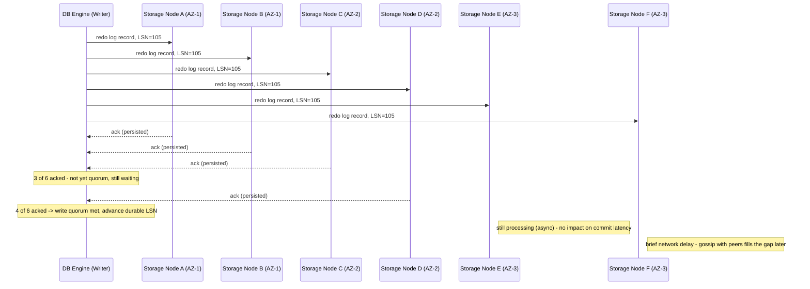

<!--
entry-meta
date: 2026-09-08
category: System Design / Paper Analysis
title: Amazon Aurora — Storage Architecture and the Quorum Model
slug: amazon-aurora-log-is-the-database
-->

# Amazon Aurora — Storage Architecture and the Quorum Model

**2026-09-08 · System Design / Paper Analysis**

## 1. The Starting Observation: The Network Is the Bottleneck, Not Disk or CPU

Traditional MySQL/PostgreSQL replication (e.g. synchronous mirrored EBS volumes under RDS Multi-AZ, pre-Aurora) writes *everything* over the network at every layer: redo log, binlog, the modified data pages themselves, and again for a second replica. The SIGMOD 2017 paper's framing: for a mirrored, multi-AZ MySQL setup, a single user write fans out into a chain of network hops — application → database, then database → mirrored storage replicas for the double-write buffer, the actual data pages, the redo log, and the binlog. Every one of those hops can stall the transaction if it's slow, and every one of them is send-everything, not send-the-delta.

Aurora's answer: **the only writes that cross the network are redo log records.** Data pages are never shipped from the database engine to storage. This isn't a minor optimization — it changes what "storage" even means: storage stops being a dumb block device that stores whatever bytes it's given, and becomes a service that understands the redo log format well enough to materialize pages from it on its own.

## 2. "The Log Is the Database"

Concretely:

- The database engine (a modified MySQL/InnoDB, or PostgreSQL in later Aurora versions) generates redo log records exactly as it always would — tagged with a **Log Sequence Number (LSN)**, a strictly monotonically increasing integer assigned by the engine.
- Those log records — and *only* those records — are shipped to the storage tier, sharded by which 10 GB segment (below) they belong to.
- The storage nodes apply redo to their own local copy of the data to materialize pages, entirely in the background, off the write's critical path.
- Because the storage layer can regenerate any page from the log at any point, the engine's buffer pool can treat storage as "a place that will always hand back the right page version if asked," without ever having pushed that page there itself.

This is why the paper's title phrase is literal: the redo log is not a recovery aid bolted onto page storage, it *is* the durable representation of the database. Pages are a cache of the log, materialized lazily, and can always be reconstructed from it.

## 3. Protection Groups: The Unit of Replication

A database volume is partitioned into fixed-size **10 GB segments**. Each segment is replicated 6 ways — 2 copies in each of 3 Availability Zones — forming one **Protection Group (PG)**. A 64 TB Aurora volume, at 10 GB per segment, is on the order of 6,400 segments, each independently a 6-way-replicated PG.

Why 10 GB specifically, not larger:

- Failure/repair time scales with segment size. A 10 GB segment can be fully re-replicated to a fresh node in roughly **10 seconds to under a minute** over a 10 Gbit link.
- Smaller segments mean smaller **Mean Time To Repair (MTTR)**, which is the actual lever that makes correlated-failure math work: the whole point of tolerating "AZ + 1 fault" is that the *second* fault has to be independent and has to arrive within the repair window. Shrink the repair window and you shrink the probability that a second, unrelated fault lands inside it.
- Segments are also the unit of **independent placement** — one PG failing over to a new node doesn't touch any other PG's membership, so a storage-node failure only requires repairing that node's *specific* segments, spread across potentially thousands of independent PGs system-wide, in parallel.

## 4. Why 6 Copies, 3 AZs, 4-of-6 Write, 3-of-6 Read

This is a **quorum system**, the same family as Dynamo-style `R + W > N`. The specific numbers are chosen to answer a sharper question than "how many nodes can fail": *how many correlated + independent failures can this survive without losing write availability, and separately, without losing data?*

| Failure scenario | Nodes lost | Write quorum (need 4) still reachable? | Read quorum (need 3) still reachable? |
|---|---|---|---|
| One storage node down (any AZ) | 1 | Yes (5 alive) | Yes |
| One entire AZ down (2 nodes, since 2 copies/AZ) | 2 | Yes, exactly (4 alive) | Yes |
| One AZ down + one more independent node down ("AZ+1") | 3 | **No** (3 alive < 4) | Yes, exactly (3 alive) |

The AZ+1 row is the one worth sitting with: Aurora explicitly does **not** claim you can keep *writing* through an AZ outage plus an extra fault — it claims you don't **lose data**, because a read quorum (3) is still reachable to recover the volume's true state, even though new writes are blocked until repair completes. That distinction (write-availability vs. data-durability) is precise in the paper and easy to blur in summaries.

Contrast with the naive alternative — 3 copies, 1 per AZ, majority (2-of-3) quorum for both reads and writes:

- A single whole-AZ outage removes exactly 1 of the 3 copies. 2 remain — quorum (2) is still met. Looks fine in isolation.
- But this scheme has **no slack**: if any *one* node is already down for unrelated reasons (routine maintenance, a disk failure mid-repair) when an AZ outage hits a second node, only 1 copy survives — below the quorum of 2. You've lost both write availability and, if that was your only remaining reachable replica set, effectively lost the ability to reconstruct definite state.

Aurora's 6-copy scheme has exactly the slack the 3-copy scheme lacks: it's sized so that a *correlated* fault (the AZ) and an *independent* fault (any other single node) can overlap without dropping below a read quorum. This is the concrete meaning of "correlated failure" the AWS Database Blog discusses — treating "one AZ goes down" and "one random node fails" as two separate, simultaneously-possible fault classes, not variations of the same event.

## 5. The Storage Node Write Pipeline

Each storage node processes an incoming log record through an **8-step pipeline**, of which only the first two are synchronous (on the critical path of the write):

1. **Receive** the log record over the network; append to an in-memory queue. *(synchronous)*
2. **Persist** to local disk; send the acknowledgment back to the database engine. *(synchronous — this ack is what counts toward the 4-of-6 quorum)*
3. Organize records by which page(s) they touch.
4. Identify **gaps** in the local log sequence via a **gossip protocol** with peer replicas in the same PG.
5. Coalesce applicable log records into new/updated data page versions.
6. Periodically **stage pages to S3** for continuous, incremental backup.
7. **Garbage-collect** old page versions once no open transaction or read view needs them.
8. **Validate CRC codes** on pages, continuously, as a background integrity check.

Steps 3–8 all happen asynchronously, off the write's latency path, which is precisely what makes step 2's ack fast: a storage node acknowledges as soon as the record is durably persisted locally, not once it has been turned into an up-to-date page.

**Gossip and gaps.** Because network delivery isn't ordered, a given storage node can receive LSN 105 and 107 before 106 arrives (from a retry, a reordered packet, or a temporarily partitioned peer). Each node tracks a **Segment Complete LSN (SCL)** — the highest LSN below which it has *every* record with no gaps. Nodes gossip their SCL and recent log records with peers in the same PG specifically to fill in gaps without needing the database engine to resend anything — the segment's own peers are the source of truth for making each other whole.

## 6. Cutting the Replication Cost: Heterogeneous Quorums

A naive reading of "6 copies" implies 6x storage cost for every byte written. Aurora reduces this using a **heterogeneous quorum**: not every one of the 6 segments needs to store the same thing.

- **3 "full" segments** — store both redo log records *and* materialized data pages.
- **3 "tail" segments** — store redo log records only, no materialized pages.

The write quorum becomes **4-of-6 of any segment type, OR all 3-of-3 full segments** — because if all 3 full segments have the record, at least one of them is guaranteed to be able to generate the actual data block even if every tail segment is unreachable. The read quorum becomes **3-of-6 of any segment AND at least 1-of-3 full segments** — a read needs to be sure it can reach at least one segment capable of producing a materialized page, not just a segment holding raw log.

This drops the storage cost multiplier from a full 6x to roughly **3x** (tail segments are much cheaper to store — pure log, no page images) while preserving the same AZ+1 fault tolerance, because the quorum condition still guarantees at least one full segment is reachable under any tolerated failure combination.

## Diagram: A Single Write's Journey Through the Quorum



## Hands-On Exercise: Simulating the AZ+1 Fault Boundary

This makes the boundary in Section 4's table executable, and directly compares Aurora's 6-copy/3-AZ scheme against the naive 3-copy/1-per-AZ majority scheme under the exact fault pattern ("one AZ down, plus one independent node down elsewhere") that motivates the whole design.

```python
# aurora_quorum_sim.py
from itertools import combinations

def eval_scheme(name, az_map, total, write_q, read_q):
    print(f"\n=== {name}: {total} copies, write_q={write_q}, read_q={read_q} ===")
    nodes = list(az_map.keys())
    azs = sorted(set(az_map.values()))

    for az in azs:
        az_nodes = [n for n in nodes if az_map[n] == az]
        other_nodes = [n for n in nodes if n not in az_nodes]

        # Scenario 1: the whole AZ goes down, nothing else
        alive = total - len(az_nodes)
        w_ok = alive >= write_q
        r_ok = alive >= read_q
        print(f"AZ-{az} down alone ({len(az_nodes)} nodes) -> "
              f"{alive} alive | write_ok={w_ok} read_ok={r_ok}")

        # Scenario 2: the whole AZ down + one more independent node elsewhere
        for extra in other_nodes:
            failed = len(az_nodes) + 1
            alive2 = total - failed
            w_ok2 = alive2 >= write_q
            r_ok2 = alive2 >= read_q
            print(f"  + node {extra} also down -> {alive2} alive | "
                  f"write_ok={w_ok2} read_ok={r_ok2}")
            break  # one representative "+1" case per AZ is enough to see the pattern

# Aurora: 6 copies, 2 per AZ, 3 AZs, write=4, read=3
aurora_map = {"A": 1, "B": 1, "C": 2, "D": 2, "E": 3, "F": 3}
eval_scheme("Aurora (6-copy, 4/6 write, 3/6 read)", aurora_map, 6, write_q=4, read_q=3)

# Naive: 3 copies, 1 per AZ, majority quorum (2-of-3) for both reads and writes
naive_map = {"A": 1, "B": 2, "C": 3}
eval_scheme("Naive (3-copy, 2/3 write, 2/3 read)", naive_map, 3, write_q=2, read_q=2)
```

Run it:

```bash
python3 aurora_quorum_sim.py
```

**What to look for:**

- Under the Aurora scheme, "AZ down alone" always leaves `write_ok=True` (4 of 6 alive) — matching the paper's claim of surviving an AZ loss with no write-availability impact. "AZ + 1" always leaves `write_ok=False` but `read_ok=True` (exactly 3 alive) — writes pause, but a read quorum can still reconstruct the volume's durable state. That's the write-availability-vs-data-durability distinction made numeric.
- Under the naive scheme, "AZ down alone" leaves exactly 2 of 3 alive — quorum still met, looking safe. But "AZ + 1" leaves only **1** node alive — both `write_ok` and `read_ok` are `False`. There is no way to even determine the latest durable state from a single remaining copy without trusting it blindly. This is the concrete failure the AWS blog calls out: a scheme that looks adequate against single, isolated faults has zero slack against a correlated fault stacked with an independent one.
- Try changing `write_q`/`read_q` for the Aurora scheme to `3, 3` (the "cheaper-looking" split rejected in the overview exercise) and rerun — you'll see `write_ok=True` even under AZ+1, which looks *better*, but per the overlap math (`3+3-6=0`), it no longer guarantees a read sees every prior write. Availability and correctness are being traded against each other here, not co-optimized for free.

## Further Study

- [Amazon Aurora storage demystified: How it all works — AWS re:Invent 2019/2020 slides (PDF)](https://d1.awsstatic.com/events/reinvent/2019/REPEAT_Amazon_Aurora_storage_demystified_How_it_all_works_DAT309-R.pdf)
- [Introducing the Aurora Storage Engine — AWS Database Blog](https://aws.amazon.com/blogs/database/introducing-the-aurora-storage-engine/)
- [MIT 6.824 lecture notes on Aurora](https://pdos.csail.mit.edu/6.824/notes/l-aurora.txt)

## Next Steps

1. Extend `aurora_quorum_sim.py` to model the heterogeneous full/tail-segment quorum from Section 6 (3 full + 3 tail, write = 4-of-6 OR 3-of-3-full, read = 3-of-6 AND 1-of-3-full) and confirm it tolerates exactly the same AZ+1 fault pattern as the homogeneous 6-copy scheme.
2. Compute the actual repair-time math for a given network link speed: at what segment size does repair time exceed the assumed "independent fault arrives within the repair window" safety margin, for a fleet of a given size and per-node annual failure rate?
3. Move to document 02 to see how the database engine actually decides *when* 4-of-6 has been reached without running a consensus round to agree on it.

## Sources

- [Amazon Aurora: Design Considerations for High Throughput Cloud-Native Relational Databases — SIGMOD 2017 (PDF)](https://www.cs.purdue.edu/homes/csjgwang/CS592DisaggregatedDB/AuroraSIGMOD17.pdf)
- [Amazon Aurora Under the Hood: Quorum and Correlated Failure — AWS Database Blog](https://aws.amazon.com/blogs/database/amazon-aurora-under-the-hood-quorum-and-correlated-failure)
- [Weekend Reading: Amazon Aurora — All Things Distributed (Werner Vogels)](https://www.allthingsdistributed.com/2017/05/amazon-aurora-design-considerations.html)

## Takeaways

- Aurora treats the network, not disk or CPU, as the scarce resource — the entire storage architecture exists to make "redo log record" the only unit that ever crosses it on a write.
- 10 GB segments aren't an arbitrary chunk size — they're sized so that repair time (MTTR) stays short enough that a second, independent fault is unlikely to land inside the repair window.
- 4-of-6 write / 3-of-6 read isn't a majority quorum picked for simplicity — it's specifically sized to survive a correlated failure (a whole AZ) stacked with an independent one, a fault pattern a naive 3-copy majority quorum has zero slack for.
- The heterogeneous full/tail-segment split shows the quorum condition itself can be made asymmetric (different node types, different rules) without weakening the fault-tolerance guarantee, as long as the "at least one full segment reachable" invariant holds under every tolerated failure combination.
