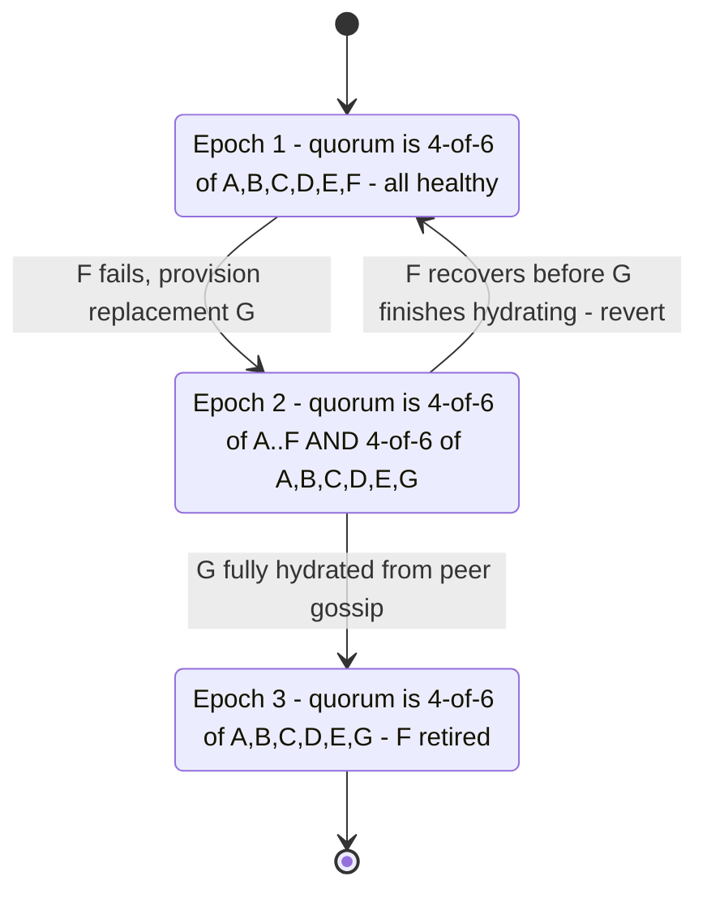
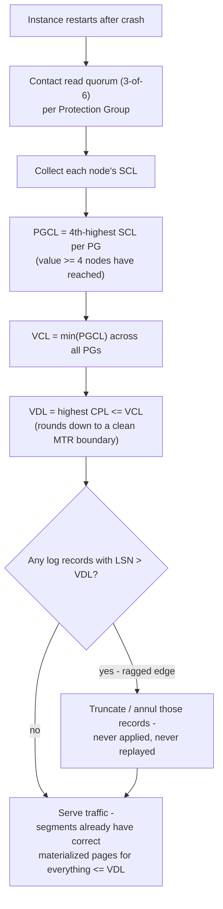

<!--
entry-meta
date: 2026-09-08
category: System Design / Paper Analysis
title: Amazon Aurora — Avoiding Consensus for Commits, Reads, Replicas, and Recovery
slug: amazon-aurora-log-is-the-database
-->

# Amazon Aurora — Avoiding Consensus for Commits, Reads, Replicas, and Recovery

**2026-09-08 · System Design / Paper Analysis**

Document 01 established the quorum: 6 copies, 4-of-6 to write, 3-of-6 to read. The harder engineering claim, made explicit in the 2018 SIGMOD follow-up, is that **every consistency-sensitive operation Aurora needs — deciding when a write is durable, serving reads, keeping up to 15 read replicas consistent, recovering from a crash, and even replacing a failed storage node — can be done without running a distributed consensus protocol (Paxos, Raft, 2PC) at any point on the normal path.** This document is about how that's actually possible: it comes down to four LSN watermarks that each node computes purely from local bookkeeping.

## 1. The Four Watermarks

Every one of these is computed by counting acknowledgments or taking a min/max over already-known values — never by a consensus round:

| Watermark | Computed by | Meaning |
|---|---|---|
| **SCL** (Segment Complete LSN) | Each storage node, locally | Highest LSN below which *this node* has every record with no gaps |
| **PGCL** (Protection Group Complete LSN) | The database engine | The highest LSN that at least `Vw` (4-of-6) storage nodes in a PG have acknowledged — literally the 4th-highest SCL value among the 6 |
| **VCL** (Volume Complete LSN) | The database engine | `min(PGCL)` across every Protection Group in the volume — one lagging PG caps the whole volume's completeness |
| **VDL** (Volume Durable LSN) | The database engine | The highest **Consistency Point LSN (CPL)** ≤ VCL — i.e., VCL rounded down to the last point that represents a complete mini-transaction, not a partial one |

The paper's own framing of why this needs no consensus: *"No consensus is required to advance SCL, PGCL, or VCL — all that is required is bookkeeping by each individual storage node and local ephemeral state"* on the database instance. A quorum ack is a fact you can just count; it isn't a proposal that multiple parties need to agree on.

**Why VDL, not VCL, is the actual durability boundary.** A transaction's redo log is made of **mini-transactions (MTRs)** — atomic, all-or-nothing groups such as a single B+-tree page split. VCL might land in the *middle* of an MTR's log records (some but not all of an MTR's records have reached quorum). Exposing that half-applied state would violate atomicity. So the engine tags the *last* log record of each MTR as a **Consistency Point LSN (CPL)**, and VDL is defined as the highest CPL at or below VCL — the latest point that is both fully quorum-durable *and* represents a clean transaction boundary.

There's also a fifth number worth knowing: the **LSN Allocation Limit (LAL)**, which caps how far the engine is allowed to allocate new LSNs ahead of VDL (roughly VDL + 10 million in the paper). This exists purely so that on crash recovery, the engine can put a hard, provable upper bound on how much outstanding log could possibly exist — it doesn't have to scan an unbounded log range to find the ragged edge.

## 2. Commits Without a Commit Protocol

A naive design would have the client's commit call block a worker thread until the write quorum acks — turning quorum latency directly into thread-occupancy time, and multiplying it across every concurrent transaction.

Aurora decouples the two:

1. A worker thread appends the transaction's commit log record (tagged with a commit LSN), places the transaction on a **queue of transactions waiting to be acknowledged**, and immediately returns to do other work. It does not block.
2. A separate, dedicated thread watches VDL. Whenever VDL advances, it scans the waiting queue and sends acknowledgments to every client whose commit LSN is now `≤ VDL`.

The result, in the paper's words: *"no induced latency from group commits and no idle time for worker threads."* This is really just asynchronous group commit, but the mechanism generalizes past a single commit-batch flush: VDL is a single, continuously advancing watermark that every waiting transaction can be checked against, so batching falls out of the data structure rather than needing a separate batching policy.

## 3. Reads: Avoiding Quorum Amplification

If every read had to contact a read quorum (3 nodes) and reconcile their responses, read cost would triple relative to a single-copy system — the opposite of Aurora's design goal.

Instead, the engine tracks, per page, which segments are known to hold the latest durable version, and:

- Issues the read to **one** segment, chosen by observed latency (favor whichever has been responding fastest recently).
- If that segment is slow to respond, the engine **hedges** — it fires a second, parallel read to a different segment and accepts whichever comes back first. This is checked by inspecting outstanding requests opportunistically (e.g. when other I/O completes), not via a fixed timer, which avoids the classic tradeoff of "timeout too short = wasted duplicate reads, too long = wasted latency."

This keeps the common case at 1 I/O per read while still capping tail latency from a single slow or temporarily unreachable segment — without ever needing multiple segments to agree on anything.

## 4. Read Replica Consistency Without Coordination

Aurora supports 1 writer + up to 15 read replicas, all mounting the **same shared storage volume** — there is exactly one copy of the data at the storage layer, not one copy per replica. The writer streams its redo log to every replica; each replica runs a **log applicator** against its own buffer cache to keep its in-memory page images current. Typical replica lag: **~20ms or less** (the paper's own benchmark: 5.38ms replica lag at 10,000 writes/sec, versus MySQL's 300,000ms under a comparable synchronous binlog-replication setup).

Three invariants keep this consistent without any replica-to-writer or replica-to-replica handshake:

1. **Replicas never see past the writer's durability boundary.** A replica only applies (and only exposes to readers) log records with LSN ≤ VDL. Since VDL only ever moves forward and is computed the same way everywhere, replicas can never expose a write the writer itself hasn't durably committed — no separate "is this replica caught up enough" check is needed.
2. **MTRs apply atomically.** Log records belonging to one mini-transaction are shipped and applied as one indivisible unit — a replica's cache is never left holding half of a B+-tree split.
3. **Read views anchor to VDL plus commit notifications**, not to a replica-local clock or a coordination round — the writer's VDL updates and transaction-commit records *are* the replica's read-view construction inputs.

The payoff shows up most sharply at failover: because a promoted replica shares the same durable storage the old writer used, *"there is no data loss when a replica is promoted to a write instance — it only needs to run a local crash recovery"* (Section 5 below) rather than resynchronizing from another node. Promotion is a local operation, not a distributed one.

One more piece of bookkeeping worth knowing: storage nodes track a **Protection Group Minimum Read Point LSN (PGMRPL)** across every instance (writer and all replicas) that has the volume open, and only garbage-collect old page versions once every open instance's read point has moved past them — otherwise a replica lagging slightly behind VDL could have its needed old version collected out from under it.

## 5. Crash Recovery: Truncate, Don't Replay

Traditional database recovery replays the log forward from the last checkpoint — a process whose duration scales with how much log has accumulated since that checkpoint, which is exactly why checkpoint frequency is such a persistent operational tuning knob elsewhere.

Aurora's storage nodes are *continuously* applying redo to materialize pages in the background, all the time, not only during recovery — so there's no backlog to replay in the first place. What crash recovery actually does on instance restart:

1. Contact a **read quorum (3-of-6)** across every Protection Group.
2. From each PG's returned SCL values, recompute PGCL (the 4th-highest) and then VCL = min(PGCL) across all PGs, then VDL as the highest CPL ≤ VCL — exactly the same computation described in Section 1, just run once at startup instead of continuously.
3. **Truncate**: any log records beyond the newly computed VDL are simply discarded — annulled, not applied, not replayed. These are records from in-flight writes that were in progress but never reached quorum before the crash; the paper calls this the **"ragged edge"** of the log, since different storage nodes may have received a different, non-uniform prefix of those trailing records.
4. Because materialized pages are always kept up to date incrementally by the storage layer, no redo application step is needed at all during this recovery — the segments can already generate correct data blocks on their own for anything ≤ VDL.

Reported result: recovery typically completes in **under 10 seconds**, independent of how much throughput (up to 100,000 writes/sec in the paper's benchmark) the instance was handling right before the crash — because recovery time is a function of "how large is the ragged edge to truncate" (bounded by LAL, i.e. a fixed ~10 million LSNs at most), not "how much log has accumulated since the last checkpoint."

To prevent a recovering-but-not-yet-fully-restarted old instance from racing a newly promoted instance and corrupting state, storage metadata carries a **volume epoch** that increments on instance transitions; storage nodes reject any request tagged with a stale epoch. The paper is explicit that this is chosen deliberately over a lease-expiry approach — *"changes the locks on the door"* immediately rather than making the new instance wait out an old lease's timeout.

## 6. Membership Changes: Replacing a Failed Segment Without Blocking I/O

This is the part of "avoiding consensus" that's easy to miss: even *changing which 6 nodes make up a Protection Group* — because one failed and a replacement needs to be hydrated — is done without a consensus round, using **reversible, epoch-numbered membership transitions**.

Worked example: segment **F** fails and is replaced by a fresh segment **G**.

| Epoch | Quorum condition | What's happening |
|---|---|---|
| 1 | 4-of-6 of {A,B,C,D,E,F} | Steady state, all 6 healthy |
| 2 | 4-of-6 of {A,B,C,D,E,F} **AND** 4-of-6 of {A,B,C,D,E,G} | Transitional: G is being hydrated from peers; every write during this window must satisfy quorum under *both* the old and new membership sets simultaneously |
| 3 | 4-of-6 of {A,B,C,D,E,G} | G is fully hydrated; F is retired; new steady state |

Two properties make this safe without agreement:

- **Reversibility.** If F unexpectedly recovers before G finishes hydrating, the system can simply revert from epoch 2 back to epoch 1 — no data was ever written that assumed epoch 3 had been reached.
- **Composability under multiple failures.** If a second node (say E) also fails while F is still being replaced, the write condition just becomes the conjunction of *all* the relevant epoch conditions simultaneously — e.g. `(4/6 of A-F AND 4/6 of A-F,G) AND (4/6 of A,D,F,H AND 4/6 of A,D,G,H)`. In practice, the paper notes, simply writing to the 4 nodes common to every one of those sets (e.g. A, B, C, D) satisfies all of them at once — the conjunction doesn't require more actual work, just a condition that's checked locally against whichever epoch each request claims.

A membership change itself only requires a **single quorum write of an incremented epoch number** to the relevant metadata — not a distributed vote about whether the change should happen. Any request carrying a stale epoch is simply rejected and must re-fetch current membership before retrying, which is what keeps stale writers from corrupting state during a transition, without anyone waiting on a lease to expire.

## Diagram: Membership Epoch Transition During Node Replacement



## Diagram: Crash Recovery Sequence (No Replay)



## Hands-On Exercise: Simulating LSN Bookkeeping and the Ragged Edge

This reproduces the exact PGCL/VCL/VDL computation from Section 1 and Section 5 numerically, and shows *why* recovery needs truncation instead of replay: some node's local log always runs slightly ahead of what quorum actually confirmed.

```python
# aurora_lsn_sim.py

def pgcl(node_scls, vw=4):
    """The Vw-th highest SCL among 6 nodes: the value at least Vw nodes have reached."""
    return sorted(node_scls, reverse=True)[vw - 1]

# Two protection groups, 6 storage nodes each, reporting their SCL after a crash.
pg1_scls = [120, 120, 119, 121, 118, 120]  # PG holding, say, the index pages
pg2_scls = [130, 130, 130, 129, 125, 130]  # PG holding the table's data pages

# Consistency Point LSNs (MTR boundaries) known to the engine, most recent first.
known_cpls = [128, 124, 119, 115, 108]

pgcl1 = pgcl(pg1_scls)
pgcl2 = pgcl(pg2_scls)
vcl = min(pgcl1, pgcl2)
vdl = max(cpl for cpl in known_cpls if cpl <= vcl)

print(f"PGCL(PG1) = {pgcl1}   (4th-highest of {sorted(pg1_scls, reverse=True)})")
print(f"PGCL(PG2) = {pgcl2}   (4th-highest of {sorted(pg2_scls, reverse=True)})")
print(f"VCL = min(PGCL1, PGCL2) = {vcl}")
print(f"VDL = highest CPL <= VCL = {vdl}")

print("\n--- Ragged edge check ---")
for pg_name, scls in [("PG1", pg1_scls), ("PG2", pg2_scls)]:
    for i, lsn in enumerate(scls):
        if lsn > vdl:
            print(f"{pg_name} node {i}: local SCL={lsn} > VDL={vdl} "
                  f"-> holds records that must be TRUNCATED on recovery "
                  f"(never reached quorum, or fell mid-MTR)")
```

Run it:

```bash
python3 aurora_lsn_sim.py
```

**What to look for:**

- `PGCL` for each PG is exactly the **4th-highest** value in that PG's SCL list — confirms PGCL literally means "at least 4-of-6 nodes have this LSN," nothing more exotic.
- `VCL` is the **minimum** across PGs — even though PG2 is running well ahead (LSN ~130) of PG1 (~120), the *volume's* completeness is capped by the slower PG. This is why a single lagging Protection Group can throttle the entire volume's durable point.
- `VDL` rounds `VCL` **down** to the nearest known CPL — in this run, VCL=120 but the nearest CPL at or below it is 119, so VDL=119, not 120. That 1-LSN gap is exactly the "VCL might land mid-MTR" problem from Section 1: LSN 120 exists somewhere in the log but isn't a safe transaction boundary to expose yet.
- The ragged-edge check should flag exactly the nodes whose SCL exceeds VDL (in PG1: the node reporting 121, 120, 120, 120 all exceed 119; in PG2: several nodes exceed as well) — these are real bytes sitting on real disks that recovery is required to *ignore*, not delete immediately, just never treat as durable. Change `known_cpls` to include a value between `vcl` and the max SCL and rerun — watch VDL jump upward, shrinking the ragged edge, which is what happens in the real system once the engine's own commit-thread bookkeeping (Section 2) catches up and tags a later CPL.

## Further Study

- [Amazon Aurora: On Avoiding Distributed Consensus for I/Os, Commits, and Membership Changes — Murat Demirbas's paper notes](https://muratbuffalo.blogspot.com/2022/03/amazon-aurora-design-considerations-and.html)
- [Paper Notes: Amazon Aurora — Design Considerations — Distributed Computing Musings](https://distributed-computing-musings.com/2023/02/paper-notes-amazon-aurora-design-considerations-for-high-throughput-cloud-native-relational-databases/)
- [MIT 6.824 lecture notes on Aurora](https://pdos.csail.mit.edu/6.824/notes/l-aurora.txt)

## Next Steps

1. Extend `aurora_lsn_sim.py` to model the asynchronous commit-acknowledgment thread from Section 2: maintain a queue of `(client_id, commit_lsn)` pairs, advance VDL in a loop, and ack every waiting client whose commit_lsn falls at or below the new VDL — this is the actual mechanism, not just the watermark math.
2. Model the membership-epoch state machine from Section 6 as an actual finite-state machine in code (not just the diagram), including the "revert to prior epoch" transition, and unit-test that a write satisfying only the *old* membership's quorum during a transitional epoch is correctly rejected.
3. Compare this recovery model directly against Raft's log-matching/commit-index approach: Raft also has a single leader deciding when an index is "committed" via a majority, but requires an explicit leader-election consensus round on failover, whereas Aurora's design pushes that same decision down to "any instance can recompute VDL locally by reading a quorum." Write down precisely what Aurora trades away to make failover leader-election-free (hint: look at what a replica promotion still requires per Section 4).

## Sources

- [Amazon Aurora: On Avoiding Distributed Consensus for I/Os, Commits, and Membership Changes — SIGMOD 2018 (PDF)](https://www.cs.purdue.edu/homes/bb/cs542-20Spr/readings/impl/sigmod-18-amazon-aurora-avoiding-consensus.pdf)
- [Amazon Aurora: Design Considerations for High Throughput Cloud-Native Relational Databases — SIGMOD 2017 (PDF)](https://www.cs.purdue.edu/homes/csjgwang/CS592DisaggregatedDB/AuroraSIGMOD17.pdf)
- [Paper Notes: Amazon Aurora — Design Considerations — Distributed Computing Musings](https://distributed-computing-musings.com/2023/02/paper-notes-amazon-aurora-design-considerations-for-high-throughput-cloud-native-relational-databases/)

## Takeaways

- Every consistency fact Aurora needs — durability, replica read-view boundaries, recovery's stopping point — reduces to counting quorum acknowledgments and taking a min/max over LSNs, which is why none of it needs a consensus round: there's nothing to vote on, only something to count.
- VDL, not VCL, is the real durability line, because VCL alone can land mid-mini-transaction; the CPL tagging mechanism is what keeps recovery from ever exposing a partially-applied atomic operation.
- Crash recovery is truncation, not replay — the storage layer already materializes pages continuously in the background, so recovery time depends on the size of the bounded "ragged edge," not on how much log built up since the last checkpoint.
- Replacing a failed storage node is handled the same way as every other consistency decision here: a single quorum-written epoch increment, checked locally per request, reversible if the old member comes back — never a distributed vote about whether the membership change is allowed to happen.
