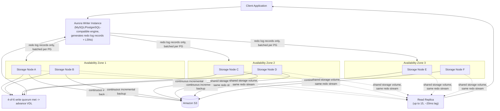

<!--
entry-meta
date: 2026-09-08
category: System Design / Paper Analysis
title: Amazon Aurora — The Log Is the Database, and How It Avoids Consensus
slug: amazon-aurora-log-is-the-database
-->

# Amazon Aurora — The Log Is the Database, and How It Avoids Consensus

**2026-09-08 · System Design / Paper Analysis**

Source: Verbitski et al., *"Amazon Aurora: Design Considerations for High Throughput Cloud-Native Relational Databases"*, SIGMOD 2017, and its 2018 follow-up *"Amazon Aurora: On Avoiding Distributed Consensus for I/Os, Commits, and Membership Changes"*. Two papers, one system, and a deliberate split in scope: the 2017 paper is the storage architecture and the quorum model; the 2018 paper is the harder claim — that you can get Paxos-grade durability and correct failover **without running a consensus protocol on the hot path at all**.

## Why This Is Split

Aurora is genuinely two separable ideas stacked on top of each other, and conflating them is how most summaries go soft on the actual mechanism:

- **Storage and quorums** — replicate 10 GB segments six ways across three Availability Zones, ship only redo log records over the network (never pages), and use a 4-of-6 write / 3-of-6 read quorum sized specifically to survive an AZ failure plus one more independent fault.
- **Avoiding consensus** — everything downstream of that quorum (commits, reads, crash recovery, replica consistency, and even *replacing a failed storage node*) is engineered to need zero rounds of Paxos/2PC, using nothing but local bookkeeping (per-node LSN watermarks) plus quorum reads/writes. This is the less-discussed, more interesting half of the design.

You cannot evaluate the second claim without first knowing exactly what the quorum guarantees in the first place — hence the ordering.

## Documents

| # | Document | What it covers |
|---|----------|----------------|
| 01 | [Storage Architecture and the Quorum Model](01-storage-quorum-architecture.md) | Log-is-the-database, protection groups, the storage-node write pipeline, why 4/6 and 3/6, heterogeneous full/tail-segment quorums |
| 02 | [Avoiding Consensus: Commits, Reads, Replicas, and Recovery](02-avoiding-consensus-and-replicas.md) | SCL/PGCL/VCL/VDL bookkeeping, asynchronous commit, replica consistency without coordination, crash recovery by truncation, membership epochs for node replacement |

## The One-Paragraph Model

A database engine that never writes a data page to the network — only redo log records, tagged with a monotonically increasing LSN — to six storage replicas spread across three AZs. A write is durable once 4 of 6 replicas have it; a read only needs to check 3, and because `4 + 3 > 6`, every read quorum is guaranteed to overlap every write quorum by at least one node. The storage layer, not the database engine, is responsible for turning that log into pages, on its own schedule, in the background. Because every consistency fact the engine needs (has this LSN been durably quorum-written? is this the highest complete point in the log?) can be derived by *counting acknowledgments and taking a min/max*, no node ever needs to run a consensus round to agree on any of it — the log's total order plus quorum counting **is** the consensus protocol, just one that never needs a leader election or a two-phase commit to advance.

## Compact System Model

| Concept | Value / Rule |
|---|---|
| Replication factor | 6 copies, 2 per Availability Zone, 3 AZs |
| Write quorum (Vw) | 4 of 6 |
| Read quorum (Vr) | 3 of 6 |
| Quorum overlap invariant | Vw + Vr > V (4 + 3 = 7 > 6) → every read set intersects every write set |
| Segment size | 10 GB per Protection Group (PG); repairs in ~10s–1min over a 10 Gbit link |
| What crosses the network on write | Redo log records only — never full pages |
| What crosses the network on read | One page fetch from the fastest current segment, hedged if slow |
| Crash recovery | No replay: read a quorum, compute the durable point, truncate anything past it |
| Consensus protocol used | None, on the steady-state path — local LSN bookkeeping + quorum counting only |

## System Map



## Quick Entry-Point Exercise

Before the sub-documents, verify the one inequality the entire design rests on. Run this:

```python
V, Vw, Vr = 6, 4, 3
overlap = Vw + Vr - V
assert overlap > 0, "no guaranteed overlap between any write quorum and any read quorum!"
print(f"V={V}, Vw={Vw}, Vr={Vr} -> every write quorum and every read quorum "
      f"share at least {overlap} node(s).")

# Now check the quorum split Aurora explicitly rejected: 3-of-6 write / 3-of-6 read.
V2, Vw2, Vr2 = 6, 3, 3
overlap2 = Vw2 + Vr2 - V2
print(f"V={V2}, Vw={Vw2}, Vr={Vr2} -> guaranteed overlap = {overlap2} "
      f"({'safe' if overlap2 > 0 else 'UNSAFE: a read can miss the latest write'})")
```

**What to look for:** the first case prints an overlap of exactly 1 — the minimum that still guarantees correctness, which is why Aurora didn't pick 5/6+2/6 or similar (more expensive reads for no correctness gain). The second case prints an overlap of **0**, meaning a 3-of-6 write quorum and a 3-of-6 read quorum could, in the worst case, be two disjoint halves of the 6 nodes — a legal-looking "majority-ish" split that is actually unsafe. That distinction — 4/6+3/6 works, 3/6+3/6 doesn't — is the entire reason the numbers in this design are 4 and 3, not something more symmetric-looking.

## Further Study

- [Amazon Aurora storage demystified: How it all works — AWS re:Invent slides (PDF)](https://d1.awsstatic.com/events/reinvent/2020/Amazon_Aurora_storage_demystified_DAT401.pdf)
- [MIT 6.824 lecture notes on Aurora](https://pdos.csail.mit.edu/6.824/notes/l-aurora.txt)
- [Introducing the Aurora Storage Engine — AWS Database Blog](https://aws.amazon.com/blogs/database/introducing-the-aurora-storage-engine/)
- [Amazon Aurora: Design Considerations + On Avoiding Distributed Consensus — Murat Demirbas's paper notes](https://muratbuffalo.blogspot.com/2022/03/amazon-aurora-design-considerations-and.html)

## Next Steps

1. Work through both sub-documents' exercises — the quorum-fault simulator in 01 and the LSN-bookkeeping/ragged-edge simulator in 02 — since together they reproduce the two central claims from the two papers.
2. Compare Aurora's quorum model directly against Spanner's Paxos-per-tablet replication (see the [Spanner entry](../../2026/09/2026-09-03-spanner-truetime-external-consistency/README.md) in this log) — both solve "replicate consistently across failure domains," but Spanner pays a consensus round on every write while Aurora pays only a quorum count. Write down concretely what each design gives up to get there.
3. Read the 2018 "avoiding consensus" paper's Section 6 (evaluation) in full for the actual latency numbers on failover and membership changes, which this entry summarizes but doesn't reproduce in full.

## Sources

- [Amazon Aurora: Design Considerations for High Throughput Cloud-Native Relational Databases — SIGMOD 2017 (PDF)](https://www.cs.purdue.edu/homes/csjgwang/CS592DisaggregatedDB/AuroraSIGMOD17.pdf)
- [Amazon Aurora: On Avoiding Distributed Consensus for I/Os, Commits, and Membership Changes — SIGMOD 2018 (PDF)](https://www.cs.purdue.edu/homes/bb/cs542-20Spr/readings/impl/sigmod-18-amazon-aurora-avoiding-consensus.pdf)
- [Amazon Aurora Under the Hood: Quorum and Correlated Failure — AWS Database Blog](https://aws.amazon.com/blogs/database/amazon-aurora-under-the-hood-quorum-and-correlated-failure)
- [Weekend Reading: Amazon Aurora — All Things Distributed (Werner Vogels)](https://www.allthingsdistributed.com/2017/05/amazon-aurora-design-considerations.html)

## Takeaways

- Aurora's core move is architectural, not algorithmic: push redo-log processing into the storage layer so the only thing crossing the network on a write is a log record, not a page.
- The quorum numbers (6 copies, 4/6 write, 3/6 read) are chosen specifically to survive a *correlated* failure (a whole AZ) plus one *independent* fault — a plain majority quorum with fewer copies cannot make that distinction.
- "Avoiding consensus" doesn't mean avoiding correctness guarantees — it means deriving the same guarantees from local LSN bookkeeping and quorum counting instead of running a distributed agreement protocol on every operation.
