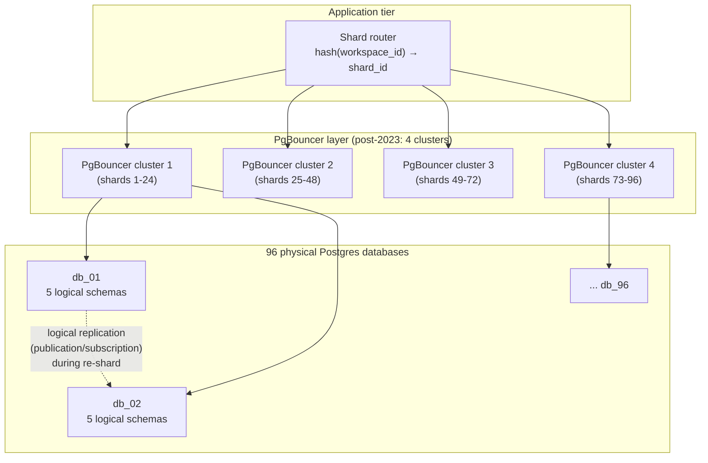
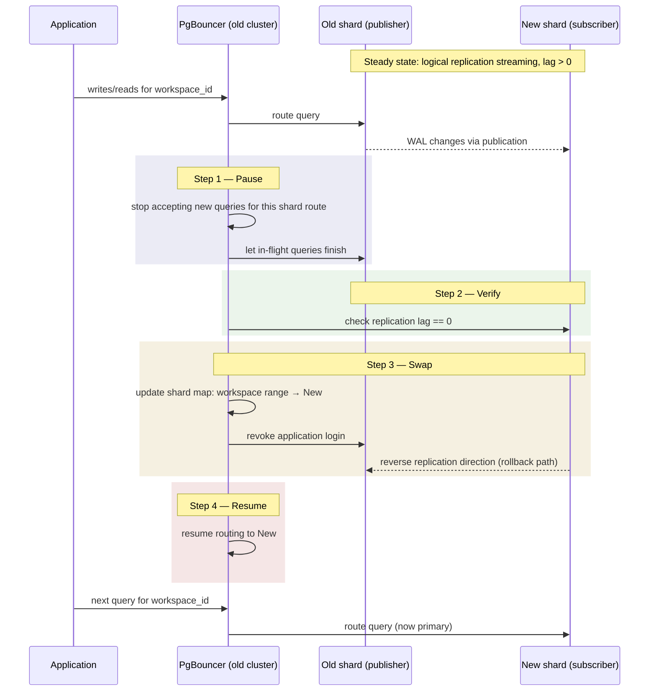

<!--
entry-meta
date: 2026-09-10
category: Tech Blog Analysis
title: Notion's Postgres Sharding — From Monolith to 480 Shards, Then a Zero-Downtime 3x Re-shard
slug: notion-postgres-sharding
-->

# Notion's Postgres Sharding — From Monolith to 480 Shards, Then a Zero-Downtime 3x Re-shard

**2026-09-10 · Tech Blog Analysis**

Notion runs its entire workspace-content model — blocks, comments, collections, permissions — on plain PostgreSQL, not a distributed database. Two of their engineering posts describe how they scaled that single Postgres instance to 32 physical databases in 2021 under emergency pressure (transaction ID wraparound was about to force the database read-only), and then, in 2023, split those 32 into 96 with a failover process that leaked less than a second of latency per shard. This entry dissects both, because the second post is really a case study in fixing every mistake the first one made.

## 1. The 2021 problem: not "too slow," but "about to stop accepting writes"

Notion's monolith hit a specific, catastrophic Postgres failure mode, not generic slowness:

- **`VACUUM` stopped keeping up.** Dead tuples (rows made obsolete by `UPDATE`/`DELETE` under MVCC) accumulated faster than autovacuum could reclaim them, so disk usage kept climbing.
- **Transaction ID (XID) wraparound loomed.** Postgres transaction IDs are 32-bit. Every row's visibility is decided by comparing its `xmin`/`xmax` against the current XID counter using modulo-2^32 arithmetic, so an unfrozen table with a 2-billion-transaction age gap becomes ambiguous — is a given row's writer in the past or the (wrapped-around) future? Postgres's answer is to force `autovacuum` into a non-cancellable "wraparound" mode and, at the edge case, refuse new transactions entirely (`ERROR: database is not accepting commands to avoid wraparound data loss`). That's the failure Notion was racing.
- This is a mechanical consequence of MVCC bookkeeping, not a Notion-specific bug — any single-writer Postgres instance under sustained heavy write load without disciplined vacuum tuning hits the same wall.

## 2. The 2021 shard design

| Decision | What they picked | Why |
|---|---|---|
| Shard key | `workspace_id` (UUID) | Nearly all reads/writes are workspace-scoped; keeps a workspace's data co-located |
| Logical shards | 480 | Highly composite number (factors: 2,3,4,5,6,8,10,12,15,16,20,24,30,32,40,48,60,80,96,120,160,240) — lets the *physical* host count grow later (32 → 40 → 48 → 96 → ...) without ever re-hashing every row, only re-mapping which physical host owns which logical shard |
| Physical databases | 32 | 15 logical shards (schemas) per physical Postgres instance |
| Implementation of a "logical shard" | A Postgres **schema** inside a shared physical database/cluster | Cheap to create, cheap to move (schema-level `pg_dump`/logical replication), avoids one-database-per-tenant overhead |
| Table selection | Every table reachable from `block` via FK, migrated as one unit | Preserves the ability to `JOIN` within a shard; cross-shard joins were never supported — they're done in application code |
| Routing | Custom application-level router, not middleware | Notion evaluated Citus and Vitess and rejected both because, in their words, the clustering logic would be "opaque" — they wanted the mapping from `workspace_id → physical host` to be code they owned and could reason about under incident pressure |

The key architectural bet: **sharding is a routing problem, solved once in an application-side lookup table, not a database feature you turn on.** That choice pays off directly in the 2023 re-shard (below), because the router only had to learn a new mapping — it didn't have to change how sharding worked at all.

## 3. The 2021 migration mechanics — why not logical replication?

This is the part worth sitting with: Notion's first migration did **not** use Postgres logical replication for the cutover, despite it existing and being the "obvious" tool. Their write volume was too high for logical replication's apply process to keep pace during the bulk historical backfill. Instead:

1. **Audit-log double-write.** Every write to a to-be-migrated table also appended a row to an audit log. This decouples "capture the change" from "apply the change" — the audit log can absorb bursts that a synchronous logical-replication apply worker would fall behind on.
2. **Bulk backfill off the hot path.** A backfill job ran on a dedicated **96-vCPU `m5.24xlarge`** instance, comparing row versions and skipping rows already caught up, and finished the full historical copy in **~3 days**.
3. **Catch-up pass.** After backfill, a script drained the audit log to bring new shards fully current with in-flight writes.
4. **Verification via dark reads.** Once shards were believed to be in sync, production reads were issued to *both* the monolith and the new shard, results compared, and the shard's copy discarded (not yet serving traffic) — a live differential test rather than a one-time row count check.
5. **Cutover: 5 minutes of scheduled downtime.** The catch-up script needed time to fully drain in front of the actual switch, so Notion took the outage deliberately rather than risk serving stale reads.
6. **A prepared reverse audit log** stood by for rollback, in case the new shards misbehaved post-cutover.

Their own retrospective calls out three regrets, and each one shows up as an explicit fix in 2023:

- **They shipped urgency, not preparation.** By the time they acted, `workspace_id` wasn't even pre-populated across the monolith, so backfilling *that column* added load to an already-strained system. Lesson: shard before you're forced to.
- **5 minutes of downtime was a solved problem they didn't solve.** They estimated another week of hardening the catch-up script (getting it under ~30 seconds) plus a load-balancer-level pause/resume would have made the cutover fully invisible. This is exactly the four-step failover procedure they built for the 2023 re-shard.
- **Separate `id` and `space_id` (partition key) columns added routing complexity everywhere.** A composite key would have been simpler application code.

## 4. The 2023 problem: success made the shards too big

By late 2022 the *fixed* 32-shard topology was itself the bottleneck:

- Several shards were pinned above **90% CPU** at peak.
- IOPS provisioning limits were being approached on the busiest shards.
- The single PgBouncer connection-pooling cluster in front of all 32 databases was running out of connection headroom — you can't just raise `max_connections` arbitrarily on Postgres, because each connection carries real backend process memory and scheduling overhead, and PgBouncer exists precisely to multiplex many client connections onto few Postgres backends.
- A new-year traffic spike was on the calendar. This was capacity planning under a deadline, not an incident.

## 5. The 2023 re-shard mechanics — this time, logical replication *does* fit

The critical difference from 2021: this was **redistributing existing logical shards across more machines**, not migrating a monolith into shards for the first time. That's a much smaller, steadier write-replication problem, so native Postgres logical replication was viable:

- **Scale-out ratio:** 32 physical databases → **96** (a clean 3x, chosen because 96 divides evenly into the same "highly composite" shard-count strategy from 2021 — no logical shard ever needed to be re-split).
- **Schema redistribution:** each physical database went from **15 logical schemas** to **5 logical schemas**, spread across 3x as many hosts.
- **Publication/subscription setup:** 3 Postgres **publications** were created per existing database (each covering 5 of its 15 schemas), and matching **subscriptions** were created on the new target databases. Logical replication in Postgres works by decoding the WAL (write-ahead log) on the publisher into a stream of row-level changes and shipping them to subscribers, which apply them in the same commit order — giving transactional consistency per subscription without physical (byte-for-byte) replication.
- **The index trick: 3 days → 12 hours.** Logical replication's initial sync does a `COPY`-style snapshot of existing data, then streams ongoing changes. Notion found that **deferring index creation until after the bulk copy finished**, then building indexes once against the now-mostly-static data, cut initial sync time from 3 days to 12 hours — building an index once on settled data is cheaper than maintaining it row-by-row during a multi-day copy.
- **The PgBouncer bottleneck they didn't expect:** naively pointing the *existing* single PgBouncer cluster at 96 downstream databases would have required either cutting application-side connections 3x (causing query queuing) or scaling PgBouncer's own connections-per-database up to unsustainable levels (~18 per instance to the *old* shards, mid-migration). Their fix was to **shard PgBouncer itself** — one cluster became **4 independent PgBouncer clusters**, each fronting 24 database shards. This has a secondary benefit they called out explicitly: a PgBouncer cluster incident now blast-radius-limits to 25% of the fleet instead of 100%.

## 6. The zero-downtime failover procedure (the fix for 2021's 5 minutes)

For each database being cut over, in order:

1. **Pause** — PgBouncer stops accepting new queries for that shard's route and lets in-flight queries finish.
2. **Verify** — confirm logical replication lag is zero (subscriber fully caught up to publisher).
3. **Swap** — update the PgBouncer shard→host mapping to point at the new database, revoke the application's login on the old database, and **reverse the replication direction** so the old (now standby) database starts replicating *from* the new one.
4. **Resume** — PgBouncer starts routing traffic to the new database again.

Reversing replication in step 3 is the rollback insurance: if something looks wrong after cutover, the old database is still being kept current and traffic can be pointed back at it without a second bulk resync.

Verification before failover used the same "dark read" idea as 2021, tuned for cost: parallel reads issued to old and new databases, but scoped to small result sets (≤5 rows), sampled rather than exhaustive, with a deliberate 1-second pause after writes to let replication catch up before comparing — reported as "near 100% equivalence."

## 7. Before / after

| Metric | 2021 (pre-shard) | 2021→2023 (32 shards) | 2023 (96 shards) |
|---|---|---|---|
| Physical Postgres hosts | 1 | 32 | 96 |
| Logical schemas per host | — | 15 | 5 |
| Peak CPU on hot shards | N/A (wraparound risk) | 90%+ | ~20% |
| PgBouncer clusters | — | 1 | 4 (24 shards each) |
| Sync method | — | audit-log double-write + backfill | native logical replication |
| Initial data sync time | — | ~3 days (backfill) | 12 hours (after deferring index build; was 3 days) |
| Cutover downtime | — | 5 minutes | ~0 (worst case ~1s UI "saving" state) |

## 8. System diagram



Failover sequence for one shard being split (the four-step process from Section 6):



## 9. Hands-on exercise: build a miniature version of this with two local Postgres instances

This reproduces the actual mechanism Notion used in 2023 — logical replication via publication/subscription — and lets you *observe* the two things their post glosses over: replication lag, and the fact that DDL is not replicated automatically.

```bash
# 1. Start two Postgres 16 instances (stand-ins for "old shard" and "new shard")
docker network create notion-shard-demo

docker run -d --name pub_db --network notion-shard-demo \
  -e POSTGRES_PASSWORD=postgres \
  -c wal_level=logical -c max_replication_slots=4 -c max_wal_senders=4 \
  postgres:16

docker run -d --name sub_db --network notion-shard-demo \
  -e POSTGRES_PASSWORD=postgres \
  postgres:16

sleep 5

# 2. Create the "table reachable from block" on the publisher and seed data
docker exec -i pub_db psql -U postgres <<'SQL'
CREATE TABLE blocks (
  workspace_id uuid NOT NULL,
  id uuid PRIMARY KEY,
  content text,
  updated_at timestamptz NOT NULL DEFAULT now()
);
INSERT INTO blocks (workspace_id, id, content)
SELECT gen_random_uuid(), gen_random_uuid(), 'seed row ' || g
FROM generate_series(1, 5000) g;
CREATE PUBLICATION notion_pub FOR TABLE blocks;
SQL

# 3. Create the matching table on the subscriber, then subscribe
docker exec -i sub_db psql -U postgres <<'SQL'
CREATE TABLE blocks (
  workspace_id uuid NOT NULL,
  id uuid PRIMARY KEY,
  content text,
  updated_at timestamptz NOT NULL DEFAULT now()
);
CREATE SUBSCRIPTION notion_sub
  CONNECTION 'host=pub_db port=5432 dbname=postgres user=postgres password=postgres'
  PUBLICATION notion_pub;
SQL

# 4. Watch initial sync complete, then generate ongoing writes on the publisher
docker exec -i sub_db psql -U postgres -c "SELECT count(*) FROM blocks;"   # should reach 5000

docker exec -i pub_db psql -U postgres -c \
  "INSERT INTO blocks (workspace_id, id, content) SELECT gen_random_uuid(), gen_random_uuid(), 'live row '||g FROM generate_series(1,500) g;"

# 5. Inspect the replication slot and lag — this is what "verify replication lag is zero" means in step 2 of the failover
docker exec -i pub_db psql -U postgres -c \
  "SELECT slot_name, active, confirmed_flush_lsn, pg_current_wal_lsn() FROM pg_replication_slots;"

docker exec -i sub_db psql -U postgres -c \
  "SELECT subname, received_lsn, latest_end_lsn, last_msg_send_time, last_msg_receipt_time FROM pg_stat_subscription;"

# 6. Prove DDL is NOT replicated — the gotcha that makes re-sharding operationally delicate
docker exec -i pub_db psql -U postgres -c "ALTER TABLE blocks ADD COLUMN priority int;"
docker exec -i pub_db psql -U postgres -c "INSERT INTO blocks (workspace_id, id, content, priority) VALUES (gen_random_uuid(), gen_random_uuid(), 'after ddl', 1);"
docker exec -i sub_db psql -U postgres -c "SELECT * FROM blocks ORDER BY updated_at DESC LIMIT 1;"
# expect an error or a NULL/missing 'priority' column on the subscriber — replication only ships row changes,
# the schema change has to be applied by hand on both sides, in the right order
```

**What to look for:**

- `count(*)` on `sub_db` reaching 5000 (then 5500) confirms the initial snapshot copy plus streamed changes both worked — this is the mechanism behind Notion's "12 hours after deferring index build" number: the copy is a bulk data operation, replication of new rows is separate and continuous.
- `confirmed_flush_lsn` on the publisher's slot advancing to match `pg_current_wal_lsn()` is *exactly* what "verify replication lag is zero" (step 2 of the failover, Section 6) checks in production — you're watching the same signal Notion's cutover script polled.
- The DDL step should surprise you if you haven't hit it before: Postgres logical replication ships row-level data changes decoded from WAL, not schema changes. In a 96-shard fleet, this means every schema migration has to be coordinated and applied identically across all subscribers *before* new-shape rows are written anywhere — a real operational tax of Notion's architecture that the blog posts don't dwell on but the four-step failover implicitly has to work around.
- Clean up with `docker rm -f pub_db sub_db && docker network rm notion-shard-demo`.

## Further Study

- [How Figma's multiplayer technology works](https://www.figma.com/blog/how-figmas-multiplayer-technology-works/) — a contrasting scaling problem (CRDT-based real-time collaboration) from a similarly-sized design tool, useful for comparing "shard the database" vs. "shard the document" scaling strategies.
- [PostgreSQL: Documentation — Chapter 29, Logical Replication](https://www.postgresql.org/docs/current/logical-replication.html) — read the Restrictions section (29.8) directly for the full list of what logical replication does not carry (sequences, large objects, DDL, `TRUNCATE` needs explicit handling).
- [PostgreSQL: Documentation — Subscription](https://www.postgresql.org/docs/current/logical-replication-subscription.html) — the mechanics of `CREATE SUBSCRIPTION`, slot creation, and how apply workers track progress.

## Next Steps

1. Extend the local exercise to simulate the actual 2023 failover: add a third container, replicate from `pub_db` to it, then practice the pause → verify-lag-zero → swap-and-reverse → resume sequence manually with `pg_bouncer` or a hand-rolled routing script in front of both.
2. Read Postgres's `pg_stat_replication` and `pg_replication_slots` views in detail and reproduce a *lagging* subscriber (e.g., pause the subscription with `ALTER SUBSCRIPTION ... DISABLE`, keep writing to the publisher, then re-enable and watch catch-up) to see what "replication lag" looks like when it isn't zero.
3. Read the transaction ID wraparound mechanics directly against a real table: run `SELECT relname, age(relfrozenxid) FROM pg_class ORDER BY 2 DESC LIMIT 10;` on any Postgres instance you have and compare the ages to `autovacuum_freeze_max_age` (default 200 million) to understand the actual number Notion was racing against in 2021.
4. Compare Notion's "application-level router, reject Citus/Vitess" decision against a system that *did* adopt a clustering middleware (e.g., Vitess at YouTube/PlanetScale) to build an opinion on when the control tradeoff is worth it.

## Sources

- [Herding elephants: lessons learned from sharding Postgres at Notion](https://www.notion.com/blog/sharding-postgres-at-notion)
- [The Great Re-shard: adding Postgres capacity (again) with zero downtime](https://www.notion.com/blog/the-great-re-shard)
- [How Figma and Notion scaled Postgres — pganalyze](https://pganalyze.com/blog/5mins-postgres-partitioning-tables-between-servers-horizontal-sharding)
- [PostgreSQL: Documentation — Chapter 29, Logical Replication](https://www.postgresql.org/docs/current/logical-replication.html)
- [How Figma's multiplayer technology works — Figma Blog](https://www.figma.com/blog/how-figmas-multiplayer-technology-works/)

## Takeaways

- Notion's core insight was making sharding an **application-owned routing problem** (a lookup table from `workspace_id` to physical host) rather than a database feature — that's what let them re-shard in 2023 by changing the mapping, not the mechanism.
- Choosing a **highly composite logical shard count (480)** up front is what made the 2021→2023 jump (32→96 hosts) a pure redistribution instead of a second painful re-hash.
- The two migrations used genuinely different sync mechanisms for a principled reason: bulk first-time migration under heavy write load (2021) needed a custom audit-log/backfill pipeline because logical replication's apply process couldn't keep pace; redistributing already-sharded, steady-state data (2023) is exactly the workload logical replication is built for.
- Zero-downtime failover is a **four-step state machine** (pause → verify-lag-zero → swap-and-reverse → resume), and the "reverse replication direction" step is what turns a risky one-way cutover into something with an actual rollback path.
- Logical replication does not replicate DDL — at 96-shard scale, every schema change becomes a coordination problem across the whole fleet, not a single `ALTER TABLE`.
