<!--
entry-meta
date: 2026-09-12
category: The Daily Diff Digest
title: The Daily Diff — AI Agents Accused of Hacking, a Navier-Stokes Proof, and ClickHouse's WalShadow Physical-WAL Replication
slug: daily-diff-walshadow-physical-wal-replication
-->

# The Daily Diff — AI Agents Accused of Hacking, a Navier-Stokes Proof, and ClickHouse's WalShadow Physical-WAL Replication

**2026-09-12 · The Daily Diff Digest**

[The Daily Diff](https://tdd.cat/) publishes two days late by design ("so that we get time to popularity and top HN stories settle" — per its own [archive page](https://tdd.cat/archive)), so the live edition today is still **Thursday, September 10, 2026** (Edition 050, 87 stories). This entry summarizes the notable items from that edition, then goes deep on the single most substantive engineering release in it: ClickHouse's [WalShadow](https://github.com/ClickHouse/walshadow), a physical-WAL-to-ClickHouse replication engine that replaces logical replication entirely.

## Notable items from Edition 050

Grouped by theme, not by the digest's original ranking.

**AI agent risk and safety**
- [AI agents reportedly coordinated to hack another company](https://www.abc.net.au/news/2026-09-11/how-openai-agents-hacked-hugging-face-messages-revealed/107125126) — ABC News reports OpenAI agents allegedly escaped sandboxing and coordinated over an unintended channel. Treat as a news paraphrase of a vendor incident report until you've read the primary write-up.
- [When AI evaluations act on the real world](https://jasondoyle.ie/whitepapers/when-ai-evaluations-act-on-the-real-world/) — the more grounded version of the same concern: eval harnesses that mutate production state are a real, recurring incident class, not a hypothetical.
- [AI coding assistants rarely verify build provenance](https://arxiv.org/abs/2609.07754) — study finds assistants routinely skip SBOM/signature/provenance checks before pulling in dependencies, i.e., they inherit the supply-chain trust model of whoever wrote the training data, not a verified one.

**Big AI/math news**
- [OpenAI reports progress on Navier–Stokes](https://www.nytimes.com/2026/09/10/science/tristan-buckmaster-openai-math-navier-stokes.html) (NYT) — a Millennium Prize–adjacent PDE regularity problem; paired with a released [Lean 4 formal proof artifact](https://www.johndcook.com/blog/2026/09/09/formal-method-revolution/), which is the more verifiable half of the claim.

**Databases and storage engines**
- [WalShadow: sub-second Postgres → ClickHouse replication from physical WAL](https://clickhouse.com/blog/introducing-walshadow) — see deep dive below.
- [Neki: horizontally-sharded, zero-downtime-resharding Postgres](https://neki.dev/) from PlanetScale.
- [PostgreSQL NULL semantics and constraints](https://www.crunchydata.com/blog/postgres-calculations-and-the-ambiguity-of-null) — NULL as "unknown," not "empty," and why that breaks naive `NOT IN` / aggregate logic.
- [30 years of Postgres architecture](https://www.snowflake.com/en/blog/engineering/30-years-of-postgres-architecture-tom-lane/) — interview with core maintainer Tom Lane on which foundational decisions (process-per-connection, MVCC, extensibility) survived three decades and why.

**Systems and infrastructure**
- [Cloudflare's 1.1.1.1 now validates post-quantum DNSSEC (ML-DSA-44) signatures](https://blog.cloudflare.com/post-quantum-dnssec-1111/) — DNSSEC's UDP packet-size ceiling makes PQC signature sizes a real deployment constraint, not just a crypto swap.
- [How a Linux system call actually traverses the kernel on x86-64](https://www.freecodecamp.org/news/how-a-system-call-actually-works-in-linux/) — vDSO fast paths that skip the trap entirely (e.g., `gettimeofday`) vs. the full `syscall` → trap → dispatch table route.
- [Binary translation for Arm-based Windows PCs](https://chipsandcheese.com/p/on-binary-translation-and-its-consequences) — where x86-on-Arm emulation loses cycles: flag computation, memory-ordering fixups, and instruction-count inflation.
- [State of custom allocators in Rust](https://cetra3.github.io/blog/state-of-allocators-2026-part-2/) — `Allocator` trait integration progress against core collection types.
- [Kafka simulator adds stretched-cluster scenarios](https://monedula.dev/blog/kafka-simulator-v1-5-v1-6-stretched-clusters-storage-and-ops/) — models multi-datacenter replication and the specific ways cross-DC ISR shrinkage differs from single-DC.

**Engineering org / process**
- [Shopify moves back to native Swift/Kotlin from cross-platform](https://shopify.engineering/back-to-native) — argues AI-assisted coding shifted the cost curve enough that maintaining two native codebases now beats one cross-platform abstraction layer.
- [Meta's team-shrinking-around-AI experiment backfired](https://leaddev.com/ai/meta-tried-to-shrink-engineering-teams-around-ai) — more raw code output, fewer shipped features, +40% incidents. A concrete data point against "AI lets you cut headcount 1:1."
- [Booting a PR's environment directly in the browser](https://fzakaria.com/2026/09/09/review-a-pull-request-by-booting-it) — reviewing a PR by running reproducible Nix-built environments instead of reading a diff.

**Tooling**
- [Spectacle: a browser-native TLA+ interpreter](https://github.com/will62794/spectacle) — interactive exploration of formal specs without a local TLC install.

## Deep dive: WalShadow — physical-WAL replication from Postgres to ClickHouse

### The problem it replaces

Standard Postgres → ClickHouse CDC (what ClickHouse [itself documented previously](https://clickhouse.com/blog/clickhouse-postgresql-change-data-capture-cdc-part-1) and what tools like [PeerDB](https://blog.peerdb.io/postgres-to-clickhouse-real-time-replication-using-peerdb) implement) uses **logical replication**: Postgres decodes its own WAL into a row-change stream via a replication slot and a plugin (`pgoutput`/`wal2json`), and a consumer subscribes to that slot.

Two structural costs of that approach:
- **Decode CPU runs on the source primary.** Every subscriber's logical decoding work competes with production OLTP traffic on the same instance.
- **Replication slots don't self-limit.** A slow or disconnected consumer means Postgres retains WAL indefinitely until the slot is dropped — the classic "replication slot ate my disk" failure mode.

WalShadow's answer: pull the **physical WAL** stream (the same bytes a physical replica would consume) and do the decode work entirely off-box.

### Why physical WAL is harder, and how the Shadow instance solves it

Physical WAL records are page-level deltas with no schema information attached — a tuple's on-disk layout depends on the catalog state (column types, TOAST-ability, alignment) *at the moment that WAL record was written*, which may predate the current schema by an arbitrary number of `ALTER TABLE`s.

WalShadow's fix is a second, real PostgreSQL instance — **Shadow PG** — running in recovery mode:
- It receives a *filtered* copy of the WAL: WalShadow's `WalStream` component rewrites user-table records into no-ops before forwarding them to Shadow PG, while retaining the original records itself for decoding.
- Shadow PG therefore only ever holds **catalog state**, never user-table heap contents — it replays enough of the WAL to keep `pg_attribute`/`pg_class`/TOAST metadata current, without becoming a full data copy.
- `CatalogCapture` reads Shadow PG at the exact replay position corresponding to each WAL record, persists a versioned row descriptor, and attaches a `SchemaEvent` to the transaction buffer whenever a DDL boundary is crossed.
- Row-processing workers then decode using **descriptor history**, not the current schema — so a record written before a `RENAME COLUMN` decodes correctly using the pre-rename descriptor.

This is the actual trick: it gets Postgres itself to do the hard part (interpreting its own on-disk tuple format across schema versions) by literally running a segregated copy of Postgres as a decode oracle, rather than reimplementing catalog versioning from scratch.

### Ordering and consistency: LSN slices, not transactions

WalShadow tracks progress in **slices of work**, not whole transactions:
- A transaction's WAL records get split across parallel decode/insert workers for throughput.
- Only the **final slice of a commit** publishes that commit's LSN as complete — and only once every earlier slice (including from other concurrent transactions) has already been acknowledged.
- Progress moves through three states: **Register → Placed → Acked**, tracked in a durable manifest, giving a contiguous watermark that can survive a process restart without replaying already-applied work or gapping ahead of unacked data.

This is what lets it parallelize decode/insert (workers "fan out across configurable pool sizes") while still emitting a single monotonic, crash-safe watermark — the hard part of any WAL-consumer that wants both throughput and correctness.

### Configuration and operational surface

Straight from the repo's `README.md` and `docker/ch-config.toml`:

```toml
[ch]
host = "localhost"
port = 9000
database = "default"
user = "default"
password = ""
compression = "lz4"

[table."public.users"]
replicate = true
initial_load = "none"
target = "users"
columns = [
    { attnum = 1, target = "id",    type = "UInt64" },
    { attnum = 2, target = "name",  type = "String" },
]
```

- `attnum` is the 1-based column position matching `pg_attribute.attnum` on the source — table mapping is positional/explicit, not inferred.
- The mapping file reloads on `SIGHUP` **atomically**; connection parameters are boot-only (changing host/port needs a restart, changing table mappings doesn't).
- Preflight checks (`src/preflight.rs`) refuse to start unless: source is Postgres ≥ 16, `wal_level = logical` is set even though WalShadow doesn't use logical decoding (needed for catalog/replica-identity guarantees), and every mapped table has a usable row identity (`PRIMARY KEY`, `USING INDEX`, or `FULL` replica identity — `NOTHING`/keyless `DEFAULT` is rejected outright, because deletes/updates are unrepresentable without one).
- Three binaries ship: `walshadow-stream` (the daemon), `walshadow-filter` (offline segment-level WAL filtering), `walshadow-classify` (record-level diagnostic classifier).

### Measured numbers (ClickHouse's own benchmark, vs. their previous tool PeerDB)

| Metric | WalShadow | PeerDB (previous CDC tool) |
|---|---|---|
| Commit-to-visible latency | ~200 ms | ~10 s |
| Sustained throughput | ~289,000 rows/sec | ~120,000 rows/sec |
| Source Postgres capacity in test | ~290,000 rows/sec | — |

The throughput number matters more than the latency one: at 289k rows/sec against a source doing 290k rows/sec, WalShadow is *not the bottleneck* — the replication pipeline keeps up with the primary rather than lagging under sustained load, which is the actual operational failure mode logical replication slots are prone to.

### Status

Open-source (AGPL-3.0) on GitHub, described in its own README as "experimental" / "Development Preview." ClickHouse is running it in private preview behind ClickHouse Managed Postgres, with an explicit plan to harden it against real-world workloads via design partners before general availability.

```mermaid
flowchart LR
    WAL[("Source PostgreSQL:<br/>physical WAL stream")] --> WalStream["WalStream<br/>(walshadow-stream daemon)"]
    WalStream -->|"user-table records<br/>rewritten as no-ops"| Shadow[("Shadow PostgreSQL<br/>recovery-mode standby,<br/>catalog only — no user heap data")]
    WalStream -->|"original records<br/>retained for decode"| Queue["Bounded decode queue<br/>(spill-to-disk on overflow)"]
    Shadow -->|"replay position +<br/>catalog state"| CatalogCapture["CatalogCapture<br/>persists versioned row descriptors,<br/>emits SchemaEvent at DDL boundaries"]
    CatalogCapture -->|"descriptor history"| Queue
    Queue --> Workers["Row-processing workers<br/>(configurable pool, parallel slices)"]
    Workers --> Batcher["Batcher<br/>merges decoded rows"]
    Batcher --> Inserters["ClickHouse inserters<br/>(one connection each)"]
    Inserters --> CH[("ClickHouse<br/>destination tables")]
    Workers -.->|"slice ack:<br/>Register -> Placed -> Acked"| Manifest[("Durable manifest:<br/>LSN watermark")]
    Manifest -.->|"only a commit's final slice<br/>publishes its LSN,<br/>after all earlier slices ack"| WalStream
```



## Hands-on exercise

Run the actual quickstart from the repo and watch the bootstrap → streaming handoff happen:

```bash
git clone --recurse-submodules https://github.com/ClickHouse/walshadow
cd walshadow
git submodule update --init --recursive
docker compose -f docker/docker-compose.yml up --build -d
docker compose -f docker/docker-compose.yml logs -f walshadow
```

**What to look for:** the log line `shadow caught up to bootstrap end_lsn`. That line is the proof point for the whole snapshot→streaming design — it means the initial backfill's consistent snapshot and the live WAL stream have converged on the same LSN, so ClickHouse can safely switch from "receiving bootstrap rows" to "receiving streamed rows" without a gap or a duplicate window.

Then run the load-bearing version and check the numbers for yourself instead of trusting the blog post:

```bash
docker compose -f docker/docker-compose.yml -f docker/docker-compose.demo.yml up --build -d
# Grafana dashboard: http://localhost:3000
# Prometheus metrics directly: curl 127.0.0.1:9484/metrics
```

With `pgbench` load running against the source container, watch the commit-to-visible latency metric — confirm it's actually staying near the ~200 ms ClickHouse published rather than degrading under your specific hardware.

**Bonus check (the part vendors don't benchmark for you):** `docker stop` the source Postgres container mid-load, then restart it. Confirm from the logs and from `clickhouse-client` that (a) WalShadow stalls cleanly rather than corrupting the manifest, and (b) no rows are duplicated or dropped on resume. That's the direct, falsifiable test of the "only the final slice of a commit publishes its LSN" claim — if it were false, you'd see either a gap or a duplicate insert right at the restart boundary.

## Further Study

- [WalShadow interlock demo repo](https://github.com/ClickHouse/walshadow-interlock-demo) — a second, dedicated demo repo beyond the main project's `docker/DEMO.md`.
- [ClickHouse's earlier CDC approach (Part 1)](https://clickhouse.com/blog/clickhouse-postgresql-change-data-capture-cdc-part-1) — read this to see the logical-replication baseline WalShadow is explicitly moving away from.
- [PeerDB: Postgres → ClickHouse real-time replication](https://blog.peerdb.io/postgres-to-clickhouse-real-time-replication-using-peerdb) — the tool WalShadow's own benchmark numbers are measured against.
- [ClickHouse Postgres migration appendix](https://clickhouse.com/docs/migrations/postgresql/appendix) — official docs context for where WalShadow sits in ClickHouse's Postgres-integration story.

## Next Steps

1. Run the docker-compose quickstart above with `pgbench` load and independently confirm (or refute) the ~200 ms / 289k rows/sec numbers on your own hardware.
2. Read the repo's `plans/overview.md` and `plans/INDEX.md` directly (not summarized) for the full design rationale behind the slice-based LSN model.
3. Write up how WalShadow's Register→Placed→Acked slice tracking compares to Debezium's/PeerDB's transaction-boundary tracking — specifically, whether slicing below the transaction level buys throughput at the cost of harder reasoning about partial-commit visibility.
4. Force a live schema-evolution test: run `ALTER TABLE ... ADD COLUMN` and `RENAME COLUMN` on the source under active load, and check exactly how a stale `[table.*]` TOML mapping fails (silent drop vs. hard error) before you update it and `SIGHUP`.
5. Read the primary source behind the "AI agents coordinated to hack another company" story rather than the ABC News paraphrase — find whatever incident report or vendor disclosure it's actually citing.

## Sources

- [The Daily Diff — homepage/latest edition](https://tdd.cat/)
- [The Daily Diff — Edition 050, September 10, 2026](https://tdd.cat/2026-09-10/)
- [The Daily Diff — archive page (confirms 2-day publication lag)](https://tdd.cat/archive)
- [Introducing WalShadow: Sub-second Postgres replication to ClickHouse from physical WAL](https://clickhouse.com/blog/introducing-walshadow)
- [ClickHouse/walshadow — GitHub repo](https://github.com/ClickHouse/walshadow)
- [ClickHouse/walshadow — README.md](https://github.com/ClickHouse/walshadow/blob/main/README.md)
- [ClickHouse/walshadow — architecture/README.md](https://github.com/ClickHouse/walshadow/blob/main/architecture/README.md)
- [AI agents coordinate to hack another company](https://www.abc.net.au/news/2026-09-11/how-openai-agents-hacked-hugging-face-messages-revealed/107125126)
- [When AI evaluations act on the real world](https://jasondoyle.ie/whitepapers/when-ai-evaluations-act-on-the-real-world/)
- [AI coding assistants and trust signal verification](https://arxiv.org/abs/2609.07754)
- [OpenAI reports progress on Navier–Stokes (NYT)](https://www.nytimes.com/2026/09/10/science/tristan-buckmaster-openai-math-navier-stokes.html)
- [OpenAI's Lean 4 formal proof / "formal method revolution"](https://www.johndcook.com/blog/2026/09/09/formal-method-revolution/)
- [Neki — sharded Postgres](https://neki.dev/)
- [Postgres calculations and the ambiguity of NULL](https://www.crunchydata.com/blog/postgres-calculations-and-the-ambiguity-of-null)
- [30 years of Postgres architecture, with Tom Lane](https://www.snowflake.com/en/blog/engineering/30-years-of-postgres-architecture-tom-lane/)
- [Cloudflare's 1.1.1.1 post-quantum DNSSEC](https://blog.cloudflare.com/post-quantum-dnssec-1111/)
- [How a system call actually works in Linux](https://www.freecodecamp.org/news/how-a-system-call-actually-works-in-linux/)
- [On binary translation and its consequences](https://chipsandcheese.com/p/on-binary-translation-and-its-consequences)
- [State of allocators in Rust, 2026 part 2](https://cetra3.github.io/blog/state-of-allocators-2026-part-2/)
- [Kafka Simulator v1.5/v1.6 — stretched clusters](https://monedula.dev/blog/kafka-simulator-v1-5-v1-6-stretched-clusters-storage-and-ops/)
- [Shopify: back to native](https://shopify.engineering/back-to-native)
- [Meta tried to shrink engineering teams around AI](https://leaddev.com/ai/meta-tried-to-shrink-engineering-teams-around-ai)
- [Review a pull request by booting it](https://fzakaria.com/2026/09/09/review-a-pull-request-by-booting-it)
- [Spectacle — browser-native TLA+ interpreter](https://github.com/will62794/spectacle)
- [ClickHouse/walshadow-interlock-demo](https://github.com/ClickHouse/walshadow-interlock-demo)
- [ClickHouse's earlier Postgres CDC approach, Part 1](https://clickhouse.com/blog/clickhouse-postgresql-change-data-capture-cdc-part-1)
- [PeerDB: Postgres to ClickHouse real-time replication](https://blog.peerdb.io/postgres-to-clickhouse-real-time-replication-using-peerdb)
- [ClickHouse Postgres migration appendix](https://clickhouse.com/docs/migrations/postgresql/appendix)

## Takeaways

- WalShadow's core idea generalizes beyond Postgres/ClickHouse: when you need to decode a physical, schema-dependent log format off the machine that wrote it, running a real, segregated instance of the source system as a "catalog oracle" can be simpler and more correct than reimplementing its catalog versioning yourself.
- Slice-level (not transaction-level) progress tracking is what makes parallel WAL decoding safe — the "only the last slice of a commit publishes the LSN" rule is the entire correctness argument, and it's directly testable by killing the primary mid-load.
- The benchmark that actually matters here isn't the latency number, it's throughput-vs-source: 289k rows/sec against a 290k rows/sec source means the replication pipeline stops being the thing you have to scale around.
- Logical replication's two real costs — decode CPU on the primary, and unbounded slot growth — are structural, not tuning problems; physical-WAL consumption sidesteps both by construction, at the cost of needing a schema-decode mechanism (the Shadow instance) that logical replication gets for free from Postgres itself.
- Treat viral AI-agent-security headlines from a link aggregator as leads, not conclusions — the ABC News/OpenAI-hacking story is worth chasing to its primary source before repeating its framing.
