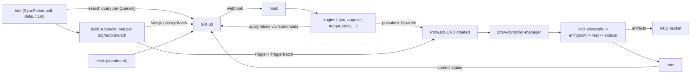
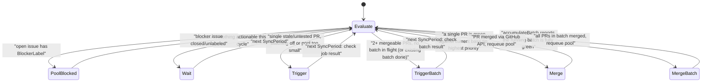

<!--
entry-meta
date: 2026-09-14
category: Variety
title: Kubernetes Prow & Tide — How OWNERS Trees and Batch-Tested Merge Queues Actually Work
slug: kubernetes-prow-tide-merge-automation
-->

# Kubernetes Prow & Tide — How OWNERS Trees and Batch-Tested Merge Queues Actually Work

**2026-09-14 · Variety**

`kubernetes/kubernetes` merges hundreds of PRs a week across dozens of SIGs with no single human gatekeeper and no GitHub native merge queue. The mechanism is two separate systems bolted together: a **review-gate plugin** that computes "who is allowed to say yes" from a directory tree of `OWNERS` files, and **Tide**, a poller that turns "yes" into an actual merge by re-testing PRs together in batches before pushing them. Neither piece is exotic — it's YAML tree-walking plus a 1-minute reconciliation loop — but the reasons behind the design (semantic merge conflicts, flaky-test masking, CODEOWNERS not scaling to per-path regex rules) are worth understanding because most large monorepos eventually reinvent a worse version of this.

## 1. The system this replaces

GitHub's native primitives are too coarse for a repo this size:

- **CODEOWNERS** maps paths to reviewer sets but has no concept of "approve" vs "review", no per-path *regex* filters, no alias indirection, and no way to track "this person is no longer active, demote to emeritus."
- **Branch protection + auto-merge** merges the instant a PR goes green, one at a time. If PR #100 and PR #101 both pass CI individually but conflict *semantically* (not textually — e.g. both add a field with the same name to a shared struct), auto-merge happily lands both and breaks `main` for everyone after.
- **Required status checks** don't distinguish "PR is stale against a newly-merged sibling" from "PR was tested seconds ago" — a flaky test that passed once stays green forever unless something explicitly re-triggers it.

Prow (the CI platform) and Tide (its merge-queue component) exist specifically to close those three gaps.

## 2. Prow's architecture — the pieces around Tide

Prow is a set of stateless microservices around one Kubernetes CRD, `ProwJob`:

| Component | Job |
|---|---|
| `hook` | Receives GitHub webhooks, dispatches to ~40 plugins (`lgtm`, `approve`, `trigger`, `label`, `size`, …) |
| plugins | Implement `/command` handling — apply labels, request reviews, create `ProwJob`s for presubmit tests |
| `deck` | Read-only dashboard — PR status, job logs, the merge-pool view |
| `tide` | The merge automation controller (this entry's focus) |
| `prow-controller-manager` | Watches `ProwJob` CRDs, schedules them as Pods on build clusters |
| `sinker` | Garbage-collects finished `ProwJob`s and their Pods |
| `crier` | Reports job results back to GitHub as commit statuses |

A `ProwJob` is just a CRD; the pod that actually runs the test is built from **pod utilities** — `clonerefs` (fetches the right refs, including for batch tests where multiple PR heads must be merged into one working tree), `entrypoint` (wraps the test binary, captures exit code), `initupload`/`sidecar` (stream logs and artifacts to GCS as the job runs, independent of whether the test container itself survives).

Crucially, **Tide's own core loop does not depend on webhooks**. It polls the GitHub Search API directly on a fixed period (`SyncPeriod`, default 1 minute) — webhooks only drive the *plugins* that set labels.

## 3. The human gate: OWNERS-file tree walking

Before Tide ever looks at a PR, two labels have to exist on it: `lgtm` and `approved`. Both are computed by walking a directory tree of `OWNERS` files — this is the part CODEOWNERS can't do.

### File format

Real example — the root `OWNERS` file of `kubernetes/kubernetes`:

```yaml
reviewers:
- dep-reviewers
- sig-architecture-approvers
approvers:
- dep-approvers
- sig-architecture-approvers
emeritus_approvers:
- brendandburns
- bgrant0607
- ...
filters:
  "^(go\\.mod|go\\.sum|go\\.work|go\\.work\\.sum)$":
    labels:
    - area/dependency
    reviewers:
    - dep-reviewers
    approvers:
    - kubernetes/dep-approvers
  "metrics\\.go$":
    labels:
    - sig/instrumentation
```

The `filters` block is the part a flat CODEOWNERS file structurally cannot express: a **regex keyed on changed filename**, layered on top of the directory-level default, that swaps in a different approver set and auto-applies a label — here, touching `go.mod` requires `dep-approvers` specifically, even though the directory default is `sig-architecture-approvers`.

Names like `dep-reviewers` and `sig-architecture-approvers` aren't GitHub Teams — they're resolved against a root **`OWNERS_ALIASES`** file, because GitHub Team membership changes aren't publicly auditable in the git history the way a YAML file's blame is:

```yaml
aliases:
  sig-api-machinery-approvers:
    - deads2k
    - jpbetz
    - sttts
  # Note: sig-architecture-approvers has approval on root files
  # (including go.mod/go.sum) until kubernetes/test-infra#21398 is
  # resolved. People with approve rights via this alias should defer
  # dependency update PRs to dep-approvers.
  sig-architecture-approvers:
    - dims
    - derekwaynecarr
    - johnbelamaric
```

Note the comment: even the maintainers use it to document a known gap (an alias has broader approve rights than it should, pending a fix) — the file doubles as a changelog for governance decisions.

### The tree-walk algorithm

For a given diff, the `approve` plugin:

1. For every changed file, walks from the file's directory **up** to the repo root, collecting every `OWNERS` file it finds along the way (unless a file sets `options: {no_parent_owners: true}`, which stops inheritance from anything above it — used to fence off a subtree with different governance, e.g. vendored code).
2. Unions the `approvers` lists per *leaf* OWNERS file relevant to that file's path, applying any matching `filters` regex.
3. Requires **at least one approver from every distinct leaf OWNERS file touched by the diff** — not one approver total. A PR touching three unrelated directories needs sign-off from someone in each directory's approver set (or a person who happens to be in all three).
4. Posts suggested reviewers/approvers as a comment, but does *not* auto-assign — a human still runs `/assign` or the suggested people self-select. This keeps assignment auditable as explicit GitHub actions rather than silent bot state.
5. Once every required OWNERS file has an `/approve` from a listed approver, the plugin applies the `approved` label. `/lgtm` (from anyone in the `reviewers` list, author excluded) is a separate, independently-tracked label — a PR can be `lgtm` without being `approved` and vice versa, though some repos configure implicit-lgtm-on-approve.

Inactive maintainers aren't just left stale: approvers with fewer than roughly 10 tracked contributions in the last year get moved to `emeritus_approvers` automatically via periodic bot housekeeping, keeping the *required-approver* set from including people who will never answer.

## 4. Tide — the merge automation controller

Tide doesn't watch webhooks for merge decisions; it **polls**. Each `SyncPeriod` (default 1m) it:

1. Runs the configured GitHub search `Queries` (per org/repo: required `labels` like `lgtm`+`approved`, `missingLabels` like `do-not-merge/hold`, `includedBranches`) to pull the candidate PR set.
2. Splits results into **subpools** — one per distinct `org/repo:branch` triple. Subpools are fully independent and processed in parallel, bounded by `MaxGoroutines` (default 20). A backlog in `kubernetes/kubernetes:master` doesn't stall `kubernetes/kubernetes:release-1.31`.
3. Within a subpool, filters out PRs with unresolved merge conflicts, failing required contexts, or an open blocking issue carrying the `BlockerLabel` (if configured) — those flip the whole subpool to `PoolBlocked`.
4. Picks what to do next via `pickHighestPriorityPR`: PRs are grouped by the ordered `Priority` list (label-set based — e.g. `kind/failing-test` PRs can jump the queue), and *within* the top matching priority tier, the **lowest PR number wins** — a simple, gameable-resistant FIFO instead of anything based on wall-clock arrival.
5. Decides between testing a single PR (`Trigger`) or testing several together (`TriggerBatch`) via `accumulateBatch` / batch-selection logic, bounded by `BatchSizeLimitMap` (0 = unlimited, negative = batching disabled for that repo) and `PrioritizeExistingBatchesMap` (default true — finish an in-flight batch before starting a new, possibly bigger one).
6. Once a batch or single PR is fully green **against the current base branch tip**, merges it (`Merge` / `MergeBatch`) using the configured `MergeType` (merge/squash/rebase, overridable per-repo or by label).

### Why batches exist

This is the actual answer to the semantic-conflict problem from §1. A batch test merges N candidate PRs into one throwaway ref and runs the full presubmit suite against *that*. If it's green, all N PRs merge together — Tide has proven they don't conflict with each other, not just with `main` individually. If a batch fails, Tide doesn't know which PR caused it, so it falls back to testing PRs individually and re-forms batches from whatever remains green. This trades some wasted CI (re-running tests on PRs already proven fine) for a hard guarantee: nothing merges without having been tested next to everything else about to land alongside it.

### Staleness and retesting

A PR's test results go stale the moment *any other PR merges into its base branch* — Tide requires "tested against the current tip," not "tested at some point." This is what actually prevents the flaky-green-forever problem: it isn't that Tide distrusts old results, it's that old results are for a base branch commit that no longer exists as the tip. A PR sitting untouched in the pool while siblings merge ahead of it gets silently re-queued for test, with no author action needed — visible only as the `tide` GitHub status context flipping from `success` back to `pending`.





## 5. Hands-on exercise

Two parts: (A) manually resolve a real OWNERS requirement the way the `approve` plugin does, (B) read a live PR's actual Tide status.

**A. Walk the OWNERS tree for a real path**

```bash
REPO=kubernetes/kubernetes
FILE="staging/src/k8s.io/api/core/v1/types.go"
DIR=$(dirname "$FILE")

# Walk from the file's directory up to root, printing every OWNERS file found
while : ; do
  URL="https://raw.githubusercontent.com/$REPO/master/$DIR/OWNERS"
  if curl -sf "$URL" -o /tmp/owners_$$_"$(echo $DIR | tr / _)".yaml; then
    echo "=== $DIR/OWNERS ==="
    cat /tmp/owners_$$_"$(echo $DIR | tr / _)".yaml
  fi
  [ "$DIR" = "." ] && break
  DIR=$(dirname "$DIR")
done

# Resolve the alias names you just saw against the root alias file
curl -s "https://raw.githubusercontent.com/$REPO/master/OWNERS_ALIASES" | less
```

**What to look for:** every directory level does *not* necessarily have its own `OWNERS` file — note which levels are silent (inheriting from further up) versus which override. Then cross-reference every alias name (e.g. `sig-api-machinery-approvers`) against `OWNERS_ALIASES` to get the actual GitHub usernames who can `/approve` this exact file. Confirm for yourself: a PR touching `types.go` needs one of *those specific people*, regardless of who reviews it.

**B. Read a live PR's Tide status context**

```bash
# Pick any open kubernetes/kubernetes PR number, e.g. from https://github.com/kubernetes/kubernetes/pulls
PR=<pr_number>
curl -s "https://api.github.com/repos/kubernetes/kubernetes/pulls/$PR" \
  | python3 -c "import json,sys; d=json.load(sys.stdin); print(d['statuses_url'])"

# Then fetch the status list and isolate the tide context
curl -s "<statuses_url from above>" \
  | python3 -c "
import json,sys
for s in json.load(sys.stdin):
    if s['context'] == 'tide':
        print(s['state'], '-', s['description'])
"
```

**What to look for:** the `description` string on the `tide` context is Tide telling you, in plain English, exactly which of its merge criteria this PR fails right now (missing label, needs rebase, "In merge pool.", etc.) — this is the live output of the `Evaluate` step in the state diagram above, not a cached CI result.

## Further Study

- [Tide — Prow docs](https://docs.prow.k8s.io/docs/components/core/tide/) — design rationale, subpool model
- [PR Author's Guide to Tide](https://docs.prow.k8s.io/docs/components/core/tide/pr-authors/) — merge-pool status, retest behavior from the author's side
- [OWNERS Files — Kubernetes Contributors](https://www.kubernetes.dev/docs/guide/owners/) — full field reference, filters, emeritus pruning
- [Pull Request Process — Kubernetes Contributors](https://www.kubernetes.dev/docs/guide/pull-requests/) — full command/label reference (`/ok-to-test`, `/hold`, size labels, CLA gate)
- [Prow and Tide for Kubernetes Contributors (blog, 2022)](https://www.kubernetes.dev/blog/2022/12/12/prow-and-tide-for-kubernetes-contributors/) — the "tide comes in / tide goes out" framing, squash-merge label example
- [Prow overview](https://docs.prow.k8s.io/docs/overview/) — full component list and job execution pipeline
- [`tide` Go package reference](https://pkg.go.dev/github.com/kubernetes/test-infra/prow/tide) — `Pool` type, action constants
- [kubernetes-sigs/prow](https://github.com/kubernetes-sigs/prow) — current home of the Prow source (migrated out of `kubernetes/test-infra`)

## Next Steps

1. Read the full `syncSubpool`/`takeAction` implementation directly (`prow/tide/tide.go` in the history at `kubernetes/test-infra`, or the current `kubernetes-sigs/prow` tree) to get the exact ordering of the checks sketched in the state diagram above.
2. Stand up a local Prow instance against a `kind` cluster and a throwaway test repo, using the `kubernetes-sigs/prow` local-development docs; watch `hook` and `tide` logs live while opening a real PR against it.
3. Write a small script that fully automates part A of the exercise — recursive OWNERS union respecting `no_parent_owners` and `filters` — and check it against a case with multiple changed files in different subtrees, to see the "one approver per leaf OWNERS file" rule force multiple distinct approvers onto one PR.
4. Compare Tide's batch-test design against GitHub's native merge queue and against Mergify, specifically on what batching buys over "require green + auto re-run on base update" — and at what CI-cost.

## Sources

- [Tide — Prow docs](https://docs.prow.k8s.io/docs/components/core/tide/)
- [PR Author's Guide to Tide](https://docs.prow.k8s.io/docs/components/core/tide/pr-authors/)
- [Prow overview](https://docs.prow.k8s.io/docs/overview/)
- [OWNERS Files — Kubernetes Contributors](https://www.kubernetes.dev/docs/guide/owners/)
- [Pull Request Process — Kubernetes Contributors](https://www.kubernetes.dev/docs/guide/pull-requests/)
- [Prow and Tide for Kubernetes Contributors (blog)](https://www.kubernetes.dev/blog/2022/12/12/prow-and-tide-for-kubernetes-contributors/)
- [`prow/config/tide.go`](https://github.com/kubernetes/test-infra/blob/88f7c53b24193903a7e5d9267886cb1b55ac42cd/prow/config/tide.go) — Tide configuration struct fields (`SyncPeriod`, `MaxGoroutines`, `BatchSizeLimitMap`, `Priority`, `ContextOptions`, etc.)
- [`prow/tide/tide.go`](https://github.com/kubernetes/test-infra/blob/88f7c53b24193903a7e5d9267886cb1b55ac42cd/prow/tide/tide.go) — `accumulateBatch`, `pickHighestPriorityPR`, action constants
- [`tide` Go package reference](https://pkg.go.dev/github.com/kubernetes/test-infra/prow/tide)
- [kubernetes-sigs/prow](https://github.com/kubernetes-sigs/prow)
- [`kubernetes/kubernetes` root `OWNERS`](https://raw.githubusercontent.com/kubernetes/kubernetes/master/OWNERS) — live example of `filters`, `emeritus_approvers`
- [`kubernetes/kubernetes` root `OWNERS_ALIASES`](https://raw.githubusercontent.com/kubernetes/kubernetes/master/OWNERS_ALIASES) — live alias-to-username resolution

## Takeaways

- The `lgtm`/`approved` gate is not GitHub CODEOWNERS — it's a bot walking a directory tree of YAML files, unioning per-leaf approver sets, applying regex `filters` for per-filename overrides, and resolving names through a separately-auditable alias file instead of GitHub Teams.
- Tide never reacts to webhooks for its core decision loop; it's a 1-minute poller running GitHub search queries, which is what makes "stale test result after a sibling merge" a solvable, uniform problem instead of a race condition.
- Batch testing is the actual fix for semantic merge conflicts between independently-green PRs — it costs extra CI cycles but is the only way to prove N PRs are mutually compatible before any of them lands.
- Priority in the merge queue is a two-level sort: label-set tier first, then lowest PR number — simple enough to reason about, resistant to manual queue-jumping.
- `ProwJob` is "just" a CRD; all the actual cloning/testing/artifact-upload behavior lives in ordinary pod init-container chains (`clonerefs`, `entrypoint`, `sidecar`), which is why Prow can run on arbitrary Kubernetes build clusters with no special scheduler.
