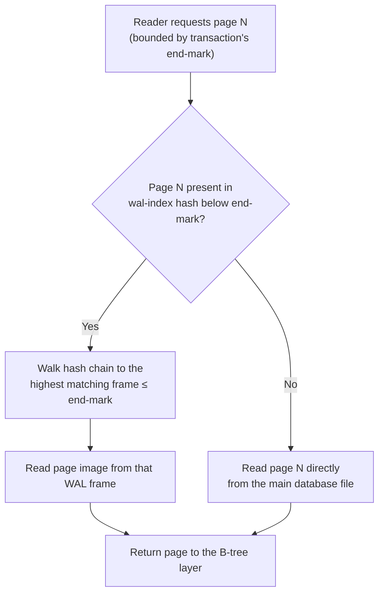

<!--
entry-meta
date: 2026-09-15
category: Database Internals
title: SQLite WAL Internals — Frame Checksums, Checkpoints, and the 16-Year Reset Race That Broke Tailscale
slug: sqlite-wal-internals-reset-bug
-->

# SQLite WAL Internals — Frame Checksums, Checkpoints, and the 16-Year Reset Race That Broke Tailscale

**2026-09-15 · Database Internals**

SQLite's default transaction mechanism is a rollback journal: copy the original page to a journal file, overwrite it in place, delete the journal on commit. Write-Ahead Logging (WAL) mode inverts this — the database file is never touched during a transaction; new page images are appended to a side file instead. This entry works through the exact on-disk layout that makes that possible, then uses a real, still-fresh production incident — a 16-year-old data race that corrupted Tailscale's control-plane databases — to show what happens when the bookkeeping around that layout gets a single ordering assumption wrong.

## 1. Why WAL Exists

| | Rollback journal (default) | WAL mode |
|---|---|---|
| Original page | Copied to `-journal` file before overwrite | Left untouched in the main DB file |
| New page | Written **in place** in the main DB file | **Appended** to the `-wal` file |
| Commit | Delete/truncate the journal | Append a commit frame to the WAL |
| Readers vs writers | Readers block writers (shared/exclusive locks) | Readers run against a stable snapshot while a writer appends |
| I/O pattern | Random writes (page in place) + journal writes | Fully sequential appends |

The trade: WAL moves the cost from "every write blocks readers" to "someone eventually has to copy WAL content back into the main file" — that's a **checkpoint**, and it's where this entry's case study lives.

## 2. The Database File: B-Tree Pages on Disk

Every SQLite table and index is a B-tree; every page in the main database file is either a table-btree page, an index-btree page, a freelist page, or an overflow page. Page 1 begins with a 100-byte header.

### 2.1 Database header (first 100 bytes of page 1)

| Offset | Size | Field | Notes |
|---|---|---|---|
| 0 | 16 | Magic string | `"SQLite format 3\0"` |
| 16 | 2 | Page size | Power of 2, 512–32768, or `1` meaning 65536 |
| 18 | 1 | File format write version | 1 = legacy (rollback), 2 = WAL |
| 19 | 1 | File format read version | 1 or 2 |
| 20 | 1 | Reserved bytes per page | Usually 0 |
| 24 | 4 | File change counter | Bumped after every unlock-following-write |
| 28 | 4 | In-header database size (pages) | |
| 32 | 4 | First freelist trunk page | 0 if none |
| 36 | 4 | Total freelist page count | |
| 40 | 4 | Schema cookie | Bumped on DDL |
| 56 | 4 | Text encoding | 1=UTF-8, 2=UTF-16LE, 3=UTF-16BE |
| 92 | 4 | Version-valid-for | Change-counter value the version fields were stamped at |
| 96 | 4 | SQLite version number | Of the last writer |

Bytes 18–19 are the detail worth remembering: switching a database to WAL mode is literally flipping these two bytes from `1` to `2`, which is why pre-3.7.0 SQLite refuses a WAL database outright ("file is encrypted or is not a database") — it doesn't recognize format version 2.

### 2.2 B-tree page header

8 bytes on leaf pages, 12 on interior pages (the extra 4 = right-most child pointer):

| Offset | Size | Field |
|---|---|---|
| 0 | 1 | Page type: `0x02` interior-index, `0x05` interior-table, `0x0a` leaf-index, `0x0d` leaf-table |
| 1 | 2 | Offset to first freeblock (0 = none) |
| 3 | 2 | Number of cells on this page |
| 5 | 2 | Start of the cell-content area (0 means 65536) |
| 7 | 1 | Fragmented free bytes (≤ 60) |
| 8 | 4 | *(interior only)* right-most child page number |

Layout, in order: page header → **cell pointer array** (2-byte big-endian offsets, one per cell, in key order) → unallocated space → cell content (packed from the *end* of the page backward) → reserved region.

Cells differ sharply by page type:

```
Table leaf   (0x0d): varint(payload size) · varint(rowid) · payload[...] · [4B overflow ptr]
Table interior(0x05): 4B(left child page) · varint(rowid)          — no payload at all
Index leaf   (0x0a): varint(key size) · key payload[...] · [4B overflow ptr]
Index interior(0x02): 4B(left child page) · varint(key size) · key payload[...] · [4B overflow ptr]
```

This is why an `INTEGER PRIMARY KEY` is nearly free in SQLite: it *is* the rowid key already threaded through every interior table-btree cell — no separate index structure needed. Index b-trees, by contrast, carry payload on interior pages too, because the indexed columns must be comparable at every level of the tree, not just at the leaves.

**Overflow**: when payload exceeds what fits on the page, SQLite computes a threshold `X = U - 35` (table leaf; `U` = usable page size) and a minimum local payload `M`, stores between `M` and `X` bytes in the cell body, and chains the rest through overflow pages — each one just a 4-byte "next page" pointer followed by raw content.

**Freelist**: freed pages are chained as trunk pages (each a 4-byte "next trunk" pointer + a count + up to ~120 leaf-page numbers, all in 4-byte big-endian slots) pointing at leaf pages that are recycled **without ever being read or written** — SQLite just hands their page number back out, which is why dropping a huge table is fast: no leaf-page I/O at all.

## 3. The WAL File Format, Byte by Byte

### 3.1 WAL header (32 bytes)

| Offset | Size | Field |
|---|---|---|
| 0 | 4 | Magic: `0x377f0682` (little-endian content) or `0x377f0683` (big-endian content) |
| 4 | 4 | File format version (`3007000`) |
| 8 | 4 | Database page size |
| 12 | 4 | Checkpoint sequence number |
| 16 | 4 | **Salt-1** |
| 20 | 4 | **Salt-2** |
| 24 | 4 | Checksum-1 (over bytes 0–23) |
| 28 | 4 | Checksum-2 |

### 3.2 WAL frame header (24 bytes, precedes every page image)

| Offset | Size | Field |
|---|---|---|
| 0 | 4 | Page number |
| 4 | 4 | Commit size (pages in DB *after* this commit — 0 for non-commit frames) |
| 8 | 4 | Salt-1 (copied from WAL header) |
| 12 | 4 | Salt-2 |
| 16 | 4 | Checksum-1 (cumulative, through this frame) |
| 20 | 4 | Checksum-2 |

A frame is valid **iff**: its salts match the current WAL header's salts, *and* its checksum is the cumulative checksum of the WAL header's first 24 bytes plus every frame up to and including this one. The checksum itself is a simple two-accumulator running sum over pairs of 32-bit words:

```
s0 = s1 = 0
for i in 0, 2, 4, ... (N words, N even):
    s0 += x[i]   + s1
    s1 += x[i+1] + s0
# (s0, s1) is the checksum, always stored big-endian
```

Salts are the mechanism that makes WAL **recycling** safe: instead of truncating the WAL file after a checkpoint, SQLite can just start overwriting it from the beginning with a *new* salt pair. Any stale frame left over from before the reset now has the wrong salt and is correctly ignored as garbage — recovery after a crash walks the file frame by frame and simply stops at the first checksum/salt mismatch.

### 3.3 The wal-index (`-shm` file)

A reader has to answer "which frame in a multi-megabyte WAL holds the newest copy of page N?" without scanning the whole file. The answer is the wal-index: a hash table mapping page numbers to frame offsets, kept in a `-shm` file.

Two details that read as odd until you think about the constraint:

- It's an **mmapped ordinary file**, not real POSIX/SysV shared memory. SQLite's own docs are blunt about why: there's no portable way to get a *nameable* shared-memory segment across Unix flavors and Windows, and processes that `chroot()` into different roots would see different `/dev/shm` entries and silently corrupt each other's view. A file in the same directory as the database sidesteps both problems.
- It's **never synced to disk** and is entirely reconstructible from the WAL, so losing it in a crash costs a recovery scan, not data.

### 3.4 Reader isolation: the end-mark

When a read transaction opens, it records the WAL's current last-valid-commit position as its **end-mark** and holds it for the transaction's lifetime. Every page lookup after that either walks the wal-index hash chain for the highest frame ≤ the end-mark, or falls through to the main database file if the page was never touched in the WAL. That single number is the entirety of SQLite's snapshot isolation in WAL mode — no MVCC row versions, no undo log, just "don't look past this frame."



## 4. Checkpointing

A checkpoint copies WAL frames back into the main database file so the WAL can shrink. Four modes:

| Mode | Blocks writers? | Blocks readers? | Guarantees completion? |
|---|---|---|---|
| `PASSIVE` (default, automatic) | No | No | No — stops at the oldest active reader's end-mark |
| `FULL` | No | No | Waits for writers, but new readers can still block it |
| `RESTART` | Yes (briefly) | Can | Yes, plus resets the WAL for reuse from frame 0 |
| `TRUNCATE` | Yes (briefly) | Can | Yes, plus truncates the `-wal` file to zero bytes |

Rules that matter operationally:

- Auto-checkpoint fires (`PASSIVE`) once the WAL passes **1000 pages** by default (`SQLITE_DEFAULT_WAL_AUTOCHECKPOINT`), run inline by whichever connection's `COMMIT` crossed the threshold — one slow commit per ~1000-page window.
- Sync ordering is load-bearing: the WAL frame being copied must be durable *before* the corresponding page is written to the main file, and the main file must be durable before the WAL is reset. Get this backwards and a crash mid-checkpoint can leave the database ahead of the WAL or vice versa.
- **Checkpoint starvation**: a `PASSIVE` checkpoint cannot advance past any currently-open reader's end-mark. With continuously overlapping long readers, the checkpoint stalls at the same boundary indefinitely and the WAL grows without bound — this is a known, documented failure mode, not a bug.

## 5. Case Study: The 16-Year WAL-Reset Race

This is where the mechanics above stop being trivia. In 2026, Tailscale traced 19 database-corruption incidents over six months in their control plane to a data race inside SQLite's own checkpoint code — present since WAL mode shipped in **SQLite 3.7.0 (2010-07-21)** and fixed only in **3.51.3 (2026-03-13)**, with backports to the 3.44.6 and 3.50.7 maintenance lines.

### 5.1 Symptoms

- Corruption at irregular intervals — sometimes hours apart, sometimes weeks.
- The most diagnostic symptom: data committed by one transaction became invisible to later transactions, with no error raised — impossible in a system that claims serializable commits.
- During some checkpoints, SQLite reported copying **more pages than actually existed in the WAL file**.

### 5.2 Diagnosis

Tailscale couldn't reproduce it synthetically. They ruled out broken POSIX advisory locks, memory mismanagement, and thread-safety misconfiguration, then worked with the SQLite team, who built `tmstmpvfs` — a VFS shim that wraps the OS filesystem layer and records extra timing/ordering tracing — and shipped it into Tailscale's **production** environment to catch the race live.

### 5.3 Root cause

The bug sits at the intersection of two pieces of state this entry already covered: the WAL's **salts** (§3.1/3.2) and the wal-index's **frame bookkeeping** (§3.3). A checkpoint that reaches the end of the WAL resets the shared wal-index state — clears the hash table, rolls in new salts, zeroes the tracked frame count — so the WAL can be recycled from the front. That reset has to happen *after* the checkpointer is certain no other connection still believes there's live, uncheckpointed data at the old salts.

The race: a write transaction commits at almost the exact moment a checkpoint is resetting that shared state. The writer's commit frame is built and checksummed against the **old** salts, but the checkpointer's reset (new salts, cleared hash entries, `mxFrame` rolled back) is landing concurrently without the checkpointer knowing the writer is still mid-append. The checkpointer ends up believing frames were already durably copied to the main file when they weren't; the wal-index is left disagreeing with what's actually in the WAL, and the checkpoint discards committed frames as if they were superseded. Index pages already written earlier in the same or later transactions go on to reference table pages that were quietly never persisted — that's the "vanishing write" and the eventual `PRAGMA integrity_check` failure.

Tailscale specifically triggered it more than a typical deployment would because they took **manual control of checkpointing and ran it aggressively** (frequent `PASSIVE` checkpoints outside the default automatic cadence) — exactly the kind of unusual timing pressure a 16-year-dormant race needs to actually fire.

### 5.4 How it was finally forced to reproduce

Antithesis — a deterministic-simulation testing platform — pointed a **generic** workload (concurrent writers and checkpoints plus routine integrity assertions, no bug-specific exploit) at SQLite and hit the corruption in **15 minutes** on the first run, then confirmed it disappeared on 3.51.3 versus reproducing reliably on 3.51.2. SQLite's own developers noted they had never reproduced it organically and had to add deliberate test instrumentation to force the timing — deterministic replay is what made a 16-year race tractable at all.

### 5.5 The fix and aftermath

The upstream fix adds a check in the checkpoint path that detects when the WAL has been reset by a concurrent connection mid-checkpoint, so a checkpointer can no longer act on frame/salt state it no longer owns. Tailscale added their own monitoring for overlapping write/checkpoint windows after upgrading; roughly two months later that monitor fired once — confirming the exact race still occurs in the wild — and their fixed build handled it without corruption. Four-plus months incident-free followed.

```mermaid
sequenceDiagram
    participant W as Writer (COMMIT)
    participant C as Checkpointer (PASSIVE)
    participant SHM as wal-index (-shm)
    participant WAL as WAL file
    participant DB as Main DB file

    Note over C: Checkpoint nears end of WAL,<br/>believes it owns all live frames
    C->>WAL: Copy frames 1..mxFrame into DB
    C->>DB: fsync(DB)
    par Racing commit
        W->>WAL: Append new page frames (old salts)
    end
    Note over C,SHM: RACE WINDOW (pre-3.51.3)
    C->>SHM: Reset wal-index — new salts,<br/>mxFrame back to 0, hash cleared
    W->>WAL: Append commit frame<br/>(checksummed against now-stale salts)
    Note over SHM,WAL: wal-index no longer agrees<br/>with what the WAL file actually holds
    Note over C: Next checkpoint trusts wal-index,<br/>treats W's commit as already durable
    C-->>DB: W's pages never copied — silently dropped
    Note over DB: Later readers see missing writes;<br/>PRAGMA integrity_check eventually fails
```

## 6. Hands-On Exercise

Two parts: decode a real WAL file by hand, then reproduce the *class* of problem (checkpoint starvation) that the reset bug is a pathological version of. You need the `sqlite3` CLI and `xxd`/`python3`.

**Part A — decode the WAL header yourself:**

```bash
rm -f wal_demo.db wal_demo.db-wal wal_demo.db-shm
sqlite3 wal_demo.db "PRAGMA journal_mode=WAL;"
sqlite3 wal_demo.db "CREATE TABLE t(x INTEGER, y TEXT);"
sqlite3 wal_demo.db "INSERT INTO t VALUES (1,'a'),(2,'b'),(3,'c');"

xxd -l 32 wal_demo.db-wal
python3 - <<'EOF'
import struct
data = open('wal_demo.db-wal', 'rb').read(32)
magic, ver, pgsz, ckpt_seq, salt1, salt2, cksum1, cksum2 = struct.unpack('>8I', data)
print(f"magic=0x{magic:08x} version={ver} page_size={pgsz}")
print(f"checkpoint_seq={ckpt_seq} salt1=0x{salt1:08x} salt2=0x{salt2:08x}")
EOF
```

**What to look for:** `magic` should read `0x377f0682` (this build is little-endian-content), and `page_size` should match whatever `PRAGMA page_size` reports. Insert a few more rows, re-run the header dump, and confirm the salts are unchanged — salts only rotate on checkpoint/reset, not on every write.

**Part B — force checkpoint starvation and watch it in `PRAGMA wal_checkpoint`'s own return values:**

```bash
# Terminal 1: open a long-lived read transaction and hold it
sqlite3 wal_demo.db "BEGIN; SELECT count(*) FROM t;"   # leave this connection open

# Terminal 2: generate enough writes to blow well past the WAL's normal size,
# then ask for a checkpoint and inspect the three returned integers
sqlite3 wal_demo.db <<'EOF'
WITH RECURSIVE seq(n) AS (SELECT 1 UNION ALL SELECT n+1 FROM seq WHERE n < 5000)
INSERT INTO t SELECT n, hex(randomblob(200)) FROM seq;
PRAGMA wal_checkpoint(PASSIVE);
EOF
```

**What to look for:** `PRAGMA wal_checkpoint(PASSIVE)` returns three integers — `busy`, `log` (total frames in the WAL), and `checkpointed` (frames actually copied). With the Terminal 1 reader still holding its end-mark open, `checkpointed` will land *below* `log` — the checkpoint physically cannot pass the reader's snapshot boundary. Commit or close the Terminal 1 transaction, re-run the checkpoint, and `checkpointed` should now equal `log`. You've just reproduced, under controlled conditions, the exact boundary condition (a checkpoint stopped short by concurrent activity it must respect) whose *unsafe* handling — resetting shared state without confirming every writer had cleared that boundary — is what the reset bug got wrong.

## Further Study

- [Michael Tsai's roundup and commentary on the WAL-reset bug](https://mjtsai.com/blog/2026/08/14/sqlite-wal-reset-bug/)
- [The Register's writeup of the 16-year-old bug and the Tailscale outages](https://www.theregister.com/databases/2026/08/12/deeply-buried-16-year-old-sqlite-bug-caused-last-years-tailscale-outages/5287004)
- [daily.dev summary: "AI found it in 15 minutes"](https://daily.dev/posts/a-16-year-old-sqlite-bug-took-months-to-catch-ai-found-it-in-15-minutes-qbikvyoyy)
- [TechPlanet's account of how Tailscale and the SQLite developers uncovered the race](https://techplanet.today/post/the-16-year-sqlite-wal-reset-bug-how-tailscale-and-sqlite-developers-uncovered-a-critical-data-race)
- [Real-world downstream reports of the bug hitting other projects' bundled SQLite](https://github.com/NousResearch/hermes-agent/issues/69784), [and another](https://github.com/ynishi/eventsdb/issues/18)

## Next Steps

1. Build a small Python/`apsw` harness that opens two connections against the same WAL-mode database — one issuing `PRAGMA wal_checkpoint(PASSIVE)` in a tight loop, the other committing single-row transactions in a tight loop — and log `wal_checkpoint`'s `(busy, log, checkpointed)` tuple every iteration to get an intuitive feel for how tight the legitimate contention window normally is, as a baseline before reasoning about the pathological case.
2. Read the actual `walIndexRecover`/checkpoint code path in SQLite's `wal.c` (current release) to name the specific functions and lock levels the 3.51.3 fix touches, rather than relying on third-party summaries.
3. Write a one-page note on how this bug interacts with `PRAGMA synchronous=NORMAL` — does relaxing the sync guarantee widen or narrow the practical exposure window, given the sync-ordering rule in §4?
4. Compare this failure mode against Postgres's WAL + checkpoint design (see the 2026-09-07 entry on Postgres MVCC/VACUUM in this log) — Postgres checkpoints don't reset a shared in-memory index the way SQLite's wal-index does; work out whether that's a structural reason the equivalent race can't occur there, or just a difference in where the same class of risk would show up.

## Sources

- [SQLite File Format — database header, B-tree pages, freelist, WAL frame layout](https://www.sqlite.org/fileformat2.html)
- [SQLite Write-Ahead Logging — checkpoint modes, wal-index, starvation, and the WAL-reset bug summary](https://www.sqlite.org/wal.html)
- [SQLite Release History / Changelog — 3.51.3 and 3.52.0 entries](https://www.sqlite.org/changes.html)
- [Tailscale: How we found and fixed a 16-year-old SQLite bug](https://tailscale.com/blog/sqlite-wal-reset-bug)
- [Antithesis: Breaking the WAL](https://antithesis.com/blog/2026/wal-reset-bug/)
- [The Consensus: Another look at SQLite's WAL-Reset bug](https://theconsensus.dev/p/2026/08/23/another-look-at-sqlite-wal-reset.html)

## Takeaways

- WAL mode's entire value proposition — readers never block writers — rests on one field: the reader's **end-mark**. Everything else (hash table, salts, checksums) exists to answer "what does page N look like as of that mark" cheaply.
- Salts aren't decoration — they're what makes WAL *recycling* (overwrite-from-start instead of truncate) safe, by making stale leftover frames fail checksum validation instead of silently being read as valid.
- Checkpoint starvation is a documented, intentional trade-off (correctness over WAL size); the reset bug was the unsafe version of the same boundary condition — a checkpoint that stopped believing it needed to respect that boundary during its own state reset.
- A 16-year-old, timing-exact concurrency bug in one of the most heavily used pieces of software on earth was only forced into reproducing via deterministic simulation with a *generic* workload — not a targeted exploit — which says more about the limits of conventional testing for concurrency bugs than about SQLite's code quality.
- If you run manual/aggressive checkpointing outside SQLite's default automatic cadence (as Tailscale did), you are exercising code paths far less battle-tested by the ecosystem's default usage pattern — worth remembering before overriding any database's default background-maintenance behavior "for performance."
