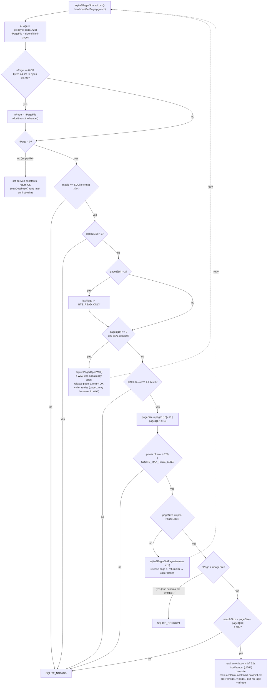

<!--
entry-meta
date: 2026-09-16
type: lesson
track: SQLite
lesson: 01
category: Database Internals
title: The Database File Header and How lockBtree() Bootstraps Page 1
slug: sqlite-file-header-page1-bootstrap
-->

# The Database File Header and How `lockBtree()` Bootstraps Page 1

**2026-09-16 · SQLite Track · Lesson 01 of 32**

## Where This Fits

- **Before this:** this is the first lesson of the track. The pre-track entry [SQLite WAL Internals](../2026-09-15-sqlite-wal-internals-reset-bug/README.md) already listed the header fields and explained what bytes 18–19 mean for WAL. This lesson doesn't repeat that table. It covers what the code *does* with each field.
- **This lesson:** how `btree.c` checks and interprets the first 100 bytes when a connection first touches the file, how `pager.c` uses bytes 24–39 to decide whether its page cache is stale, how the "meta" integers at offsets 36–71 map to `sqlite3BtreeGetMeta()` indices, and how the schema cookie invalidates prepared statements.
- **Sets up:** Lesson 02 (varints and the record format) and Lesson 03 (the b-tree page header). Page 1 is also a b-tree page: its b-tree header starts at byte **100**, right after this header. Lesson 05 (overflow) reuses the `maxLocal`/`minLocal`/`maxLeaf` constants derived here.

---

## 1. The File Is an Array of Pages; Page 1 Is Special

- **Page numbering:** pages are numbered from **1**, and page 0 doesn't exist. Page *N* lives at byte offset `(N-1) * pageSize`. This is the `offset = (pgno-1)*(i64)pPager->pageSize` line in `pager_write_pagelist()` in `pager.c`.
- **Page 1 holds two headers:**
  - Bytes **0–99**: the database header (this lesson).
  - Bytes **100…**: a normal b-tree page header for the root of `sqlite_schema`. In a fresh test DB the byte at offset 100 is `0x0d`, which marks a leaf table page:
    ```
    0000100 0d 00 00 00 02 0f b9 00 0f df 0f b9
            ^type  ^freeblk ^nCell=2 ^content start 0x0fb9
    ```
    `newDatabase()` creates exactly this page with `zeroPage(pP1, PTF_INTKEY|PTF_LEAF|PTF_LEAFDATA)`.
- **Integer encoding:** every multi-byte integer in the header is **big-endian**. The one exception is how the page size is decoded (§3).
- **The lock-byte page:** bytes `1073741824..1073742335` (the 512 bytes starting at 1 GiB) are reserved for the VFS's byte-range locks. The SQLite core never reads or writes them. Whichever page covers that range gets burned: with 4096-byte pages it is page **262145**, and with 65536-byte pages it is page **16385**. It only exists in files larger than 1 GiB.

## 2. Who Reads and Writes Each Header Field

The 09-15 entry gave the layout. This table maps each field to the code that uses it.

| Offset | Field | Runtime consumer | What happens |
|---|---|---|---|
| 0–15 | `"SQLite format 3\0"` | `lockBtree()` | `memcmp(page1, zMagicHeader, 16)`. A mismatch returns `SQLITE_NOTADB`. |
| 16–17 | page size | `lockBtree()` | Decoded with a byte-swap trick (§3). If it differs from the assumed size, page 1 is released and the open is retried. |
| 18 / 19 | write / read version | `lockBtree()` | `[18] > 2` sets `BTS_READ_ONLY`. `[19] > 2` fails the open. `[19] == 2` opens the WAL. |
| 20 | reserved bytes | `lockBtree()` | `usableSize = pageSize - page1[20]`. The open fails if `usableSize < 480`. |
| 21–23 | payload fractions | `lockBtree()` | Must be exactly `"\100\040\040"` (64, 32, 32). These have been fixed since 3.6.0. |
| 24–27 | file change counter | `pager.c` | Part of the 16-byte `dbFileVers[]` cache-validity key (§5). |
| 28–31 | in-header DB size | `lockBtree()` | Trusted only if it is non-zero **and** bytes 24–27 equal bytes 92–95 (§4). |
| 32–35 / 36–39 | freelist trunk / freelist count | btree allocator; also in `dbFileVers[]` | Covered in Lesson 06. |
| 36 + 4·i | "meta" value *i* | `sqlite3BtreeGetMeta/UpdateMeta` | See §6. |
| 52 | largest root page (auto-vacuum) | `lockBtree()` | `pBt->autoVacuum = get4byte(&page1[36 + 4*4]) ? 1 : 0` |
| 64 | incremental vacuum flag | `lockBtree()` | `pBt->incrVacuum = get4byte(&page1[36 + 7*4]) ? 1 : 0` |
| 72–91 | reserved | none | Must be zero. |
| 92–95 | version-valid-for | `pager_write_changecounter()` | Set to the new change counter on every stamp. |
| 96–99 | `SQLITE_VERSION_NUMBER` | `pager_write_changecounter()` | Holds the version of the last library that stamped the file, e.g. `0x002e7689` = `3045001`. |

## 3. Creating the Header: `newDatabase()`

When the file is empty (`pBt->nPage == 0`), `btree.c` fills in page 1 in memory. It becomes durable with the first commit.

```c
memcpy(data, zMagicHeader, sizeof(zMagicHeader));   /* 16 bytes */
data[16] = (u8)((pBt->pageSize>>8)&0xff);
data[17] = (u8)((pBt->pageSize>>16)&0xff);
data[18] = 1;                                         /* rollback journal */
data[19] = 1;
data[20] = (u8)(pBt->pageSize - pBt->usableSize);    /* reserved bytes  */
data[21] = 64;  data[22] = 32;  data[23] = 32;
memset(&data[24], 0, 100-24);
zeroPage(pP1, PTF_INTKEY|PTF_LEAF|PTF_LEAFDATA );     /* b-tree hdr at 100 */
put4byte(&data[36 + 4*4], pBt->autoVacuum);
put4byte(&data[36 + 7*4], pBt->incrVacuum);
pBt->nPage = 1;
data[31] = 1;                                         /* in-header size = 1 page */
```

What the code shows:

- **Page-size encoding:** byte 16 gets `pageSize>>8` and byte 17 gets `pageSize>>16`. Read as a little-endian number, the two bytes hold `pageSize/256`.
  - `4096` → `10 00`
  - `65536` → `00 01`. Read as big-endian that is the value `1`, which is why the spec says "1 means 65536".
  - Decoding reverses it: `pageSize = (page1[16]<<8) | (page1[17]<<16)`. One formula covers 512…65536 with no special case.
- **Defaults are written explicitly:** WAL mode, the change counter, and the schema cookie all start at 0/1. The only non-zero field past offset 24 is byte 31 (size = 1 page) plus the vacuum flags.
- **Nothing is on disk yet:** the header is only a dirty page in the cache at this point. Your first `CREATE TABLE` commits it, and that commit is also where the change counter first becomes `1` (see the experiment in §5).

## 4. Opening the File: The `lockBtree()` Validation Pipeline

`lockBtree()` in `btree.c` runs the first time a connection needs page 1. It takes a SHARED lock through `sqlite3PagerSharedLock()`, fetches page 1, and then:



Details that matter:

- **Two restart paths.** Page 1 is first read at the connection's *assumed* page size (default 4096). If the header disagrees, `lockBtree()` fixes `pBt->pageSize`, sets `BTS_PAGESIZE_FIXED`, and returns `SQLITE_OK` without setting `pPage1`. The caller notices and calls it again. WAL works the same way: the copy of page 1 in the main file may be stale because a newer version can sit in the `-wal`, so after opening the WAL the function starts over.
- **Asymmetric version checks.** A future *write* version (`[18] > 2`) only makes the file read-only. A future *read* version (`[19] > 2`) makes it unreadable. This lets future formats say "old readers are fine, old writers are not."
- **The in-header size is a hint with a validity check.** Offset 28 was added in 3.7.0. Older libraries never update it but still bump the change counter, and they also don't copy the counter into offset 92. After such a writer, `[24..27] != [92..95]`, so newer libraries ignore offset 28 and use the real file size. If offset 28 is "valid" but claims **more** pages than the file holds, the file is treated as corrupt, unless `writable_schema` is on.
- **Derived constants** are computed here once per open and used by every cell operation later (Lesson 05):
  ```c
  pBt->maxLocal = (u16)((pBt->usableSize-12)*64/255 - 23);
  pBt->minLocal = (u16)((pBt->usableSize-12)*32/255 - 23);
  pBt->maxLeaf  = (u16)(pBt->usableSize - 35);
  pBt->minLeaf  = (u16)((pBt->usableSize-12)*32/255 - 23);
  ```
  For `usableSize = 4096` these are **1002 / 489 / 4061 / 489** (computed this run). The fixed 64/32/32 fractions in bytes 21–23 are the constants in these formulas. That is why those bytes must match exactly: the numbers are compiled in, and the header bytes only confirm them.

### Verified by patching a real database (SQLite 3.45.1, this run)

| Patch | Result |
|---|---|
| byte 21 = 65 | `file is not a database` |
| byte 19 = 3 | `file is not a database` |
| byte 18 = 3 | reads work; `INSERT` → `attempt to write a readonly database` |
| bytes 16–17 = `03 00` (768, not a power of two) | `file is not a database` |
| magic changed to `SQLite format 4` | `file is not a database` |
| offset 28 = real pages + 50, with 24 == 92 | `database disk image is malformed` |
| offset 28 = real pages + 50, with 92 ≠ 24 | opens normally; `page_count` = 3 (the real file size) |
| byte 20 = 64 on an existing 4096-page DB | opens, and `SELECT` even works, but `integrity_check` reports `Offset 4032 out of range 3654..4028` on every page |

The last row shows that the reserved-byte count isn't per page. It sets the **usable size of every page in the file**, so changing it after creation shifts where every page's cell-content area is supposed to end.

## 5. Bytes 24–39: The Pager's Cache-Validity Key

- The `Pager` struct keeps `char dbFileVers[16]; /* Changes whenever database file changes */`. It is a copy of file bytes **24–39**: change counter, in-header size, freelist trunk, and freelist count.
- It is refreshed whenever page 1 is read from disk (`readDbPage`), rolled back, or written (`pager_write_pagelist`).
- **Staleness check:** in `sqlite3PagerSharedLock()`, when a connection that has held a lock before re-acquires SHARED:
  ```c
  rc = sqlite3OsRead(pPager->fd, &dbFileVers, sizeof(dbFileVers), 24);
  ...
  if( memcmp(pPager->dbFileVers, dbFileVers, sizeof(dbFileVers))!=0 ){
    pager_reset(pPager);            /* drop the whole page cache */
    if( USEFETCH(pPager) ) sqlite3OsUnfetch(pPager->fd, 0, 0);  /* and mmap */
  }
  ```
  This is how SQLite keeps its page cache between transactions in rollback mode. Each new read transaction costs one 16-byte `pread()` at offset 24 instead of re-reading pages. The same comment explains why it's 16 bytes and not 4: with an encryption codec, those bytes change randomly on every write, so a longer key avoids collisions.
- **The mmap unmap** handles a subtle case: another process may have truncated the file and grown it back to the same size, which would leave the old mapping looking valid.
- **Stamping:** `pager_write_changecounter()` does
  ```c
  change_counter = sqlite3Get4byte((u8*)pPg->pPager->dbFileVers)+1;
  put32bits(((char*)pPg->pData)+24, change_counter);
  put32bits(((char*)pPg->pData)+92, change_counter);
  put32bits(((char*)pPg->pData)+96, SQLITE_VERSION_NUMBER);
  ```
  so bytes 24 and 92 always move together when a current library writes, which keeps offset 28 trustworthy. `pager_incr_changecounter()` guards this with `changeCountDone`, so a transaction stamps once. In exclusive locking mode, transactions after the first skip the stamp entirely (atomic-commit doc §7.2).

### WAL mode changes the rule

In `pagerWalFrames()`: `if( pList->pgno==1 ) pager_write_changecounter(pList);`. The counter is stamped **only when page 1 is already among the frames being written**. WAL readers detect changes through the wal-index, not through bytes 24–39. Measured this run:

| Step | counter @24 | @92 | in-header size | schema cookie |
|---|---|---|---|---|
| `CREATE TABLE` (rollback mode) | 1 | 1 | 2 | 1 |
| + 3 autocommit INSERTs | 4 | 4 | 2 | 1 |
| + 1 explicit txn with 100 INSERTs | 5 | 5 | 2 | 1 |
| `journal_mode=wal` (bytes 18/19 → 2) | 6 | 6 | 2 | 1 |
| + 5 WAL commits + `wal_checkpoint(TRUNCATE)` | **6** | 6 | 2 | 1 |
| `CREATE INDEX` (touches page 1) + checkpoint | 7 | 7 | 3 | **2** |

So in WAL mode the change counter isn't a reliable "did anything change?" signal. The spec says as much: it "may not be incremented" per transaction. Use `PRAGMA data_version` instead.

### `PRAGMA data_version` is not in the header

- `BTREE_DATA_VERSION = 15` is a *virtual* meta index. btree.h says it "is not really a value stored in the header. It is a read-only number computed by the pager" (`Pager.iDataVersion`).
- It is **per connection** and changes only when *another* connection commits. Measured: two connections both read `1`; after connection 1 inserts, connection 1 still reads `1` and connection 2 reads `2`.

## 6. The Meta Array: Offsets 36–71 as `sqlite3BtreeGetMeta(idx)`

The upper layers never use raw offsets. They use `offset = 36 + idx*4`:

| idx | `#define` (btree.h) | Offset | SQL surface |
|---|---|---|---|
| 0 | `BTREE_FREE_PAGE_COUNT` | 36 | `PRAGMA freelist_count` |
| 1 | `BTREE_SCHEMA_VERSION` | 40 | `PRAGMA schema_version` (the schema cookie) |
| 2 | `BTREE_FILE_FORMAT` | 44 | schema format 1–4 (4 = DESC indexes + serial types 8/9) |
| 3 | `BTREE_DEFAULT_CACHE_SIZE` | 48 | legacy `default_cache_size` (a suggestion only) |
| 4 | `BTREE_LARGEST_ROOT_PAGE` | 52 | non-zero ⇒ ptrmap pages exist (Lesson 13) |
| 5 | `BTREE_TEXT_ENCODING` | 56 | `PRAGMA encoding` (fixed at creation) |
| 6 | `BTREE_USER_VERSION` | 60 | `PRAGMA user_version` |
| 7 | `BTREE_INCR_VACUUM` | 64 | incremental vs. full auto-vacuum |
| 8 | `BTREE_APPLICATION_ID` | 68 | `PRAGMA application_id` (the `file(1)` magic) |
| 15 | `BTREE_DATA_VERSION` | — | virtual, from the pager |

Offset 32 (freelist trunk) sits just before this array and is read directly by the allocator, not through `GetMeta`.

## 7. The Schema Cookie and `SQLITE_SCHEMA`

- Every DDL statement bumps offset 40. The experiment above shows `CREATE INDEX` moving it from 1 to 2.
- Every prepared statement that touches a database starts with an `OP_Transaction` opcode. When `p5` is set, `p3` carries the schema cookie from when the statement was compiled, and `p4.i` carries the in-memory schema generation. `vdbe.c`:
  ```c
  if( rc==SQLITE_OK
   && pOp->p5
   && (iMeta!=pOp->p3 || pDb->pSchema->iGeneration!=pOp->p4.i)
  ){
    ...
    p->zErrMsg = sqlite3DbStrDup(db, "database schema has changed");
  ```
  This raises `SQLITE_SCHEMA`. `sqlite3_prepare_v2()` statements then re-prepare automatically and retry.
- **Why this is a cookie and not a lock:** another *process* can run DDL at any time. The only shared state every process sees is the file, so the file header carries the schema version, and each statement checks it cheaply when it starts its transaction.
- **Foot-gun:** `PRAGMA schema_version = N` can run statements against an obsolete schema, which the docs say "can lead to incorrect answers and/or database corruption." It is a silent no-op under `SQLITE_DBCONFIG_DEFENSIVE`.

## Hands-On

You need `python3` with its bundled `sqlite3` module. The `sqlite3` CLI is optional.

**1. Decode a header and watch the counters move.**

```bash
rm -f hdr.db*
python3 - <<'PY'
import sqlite3, struct
def hdr(p):
    h = open(p,'rb').read(100); g = lambda o: struct.unpack('>I', h[o:o+4])[0]
    ps = h[16] << 8 | h[17] << 16
    return dict(pgsz=ps, wv=h[18], rv=h[19], chg=g(24), npg=g(28), cookie=g(40),
                vvf=g(92), ver=g(96), appid=hex(g(68)), uv=g(60))
c = sqlite3.connect('hdr.db', isolation_level=None)
c.execute("PRAGMA application_id=0x41525954"); c.execute("PRAGMA user_version=7")
c.execute("CREATE TABLE t(x)");               print("create  ", hdr('hdr.db'))
for _ in range(3): c.execute("INSERT INTO t VALUES(1)")
print("3 inserts", hdr('hdr.db'))
c.execute("PRAGMA journal_mode=wal")
for _ in range(5): c.execute("INSERT INTO t VALUES(2)")
c.execute("PRAGMA wal_checkpoint(TRUNCATE)"); print("wal x5   ", hdr('hdr.db'))
c.execute("CREATE INDEX i ON t(x)"); c.execute("PRAGMA wal_checkpoint(TRUNCATE)")
print("ddl      ", hdr('hdr.db'))
PY
od -A d -t x1 -N 112 hdr.db     # or: xxd -l 112 hdr.db
```

**What to look for:**

- `chg` and `vvf` are always equal.
- `chg` goes up by one per autocommit INSERT in rollback mode, but stays flat across five WAL commits.
- DDL bumps both `chg` and `cookie`.
- Bytes 68–71 read `41 52 59 54`.
- Byte 100 is `0d`: page 1's own leaf-table b-tree header.

**2. Break the header on purpose.** Copy the file, patch one byte, and open it. This reproduces the §4 table.

```bash
python3 - <<'PY'
import sqlite3, shutil
for off, val, label in [(21,65,'max frac'),(19,3,'read ver'),(18,3,'write ver'),(20,64,'reserved')]:
    shutil.copy('hdr.db','bad.db'); d = bytearray(open('bad.db','rb').read()); d[off] = val
    open('bad.db','wb').write(d)
    try:
        c = sqlite3.connect('bad.db')
        print(label, c.execute("SELECT count(*) FROM t").fetchone(),
              c.execute("PRAGMA integrity_check").fetchone()[0][:60])
        c.execute("INSERT INTO t VALUES(9)"); c.commit(); print('  write ok')
    except Exception as e: print(label, '->', e)
PY
```

**What to look for:**

- `max frac` and `read ver` never open.
- `write ver` opens but rejects writes. That is `BTS_READ_ONLY`.
- `reserved` opens and even counts rows, but `integrity_check` fails. The header silently changed the geometry of every page.

(Run it against a rollback-mode copy for the cleanest results; `hdr.db` is in WAL mode by the end of step 1, so `bad.db` may get its own `-wal`/`-shm` files.)

**3. Watch `data_version` versus the change counter.** Open two connections to a rollback-mode DB. Read `PRAGMA data_version` on both, write on connection 1, and read both again. Only connection 2's value moves, even though the file counter moved for everyone.

**4. (Optional, needs a build with `SQLITE_ENABLE_DBPAGE_VTAB`)**: `SELECT hex(substr(data,1,100)) FROM sqlite_dbpage WHERE pgno=1;` reads the same 100 bytes through the pager, so it includes a newer page 1 that is still in the WAL. The raw `od` in step 1 reads the main file only, which can be stale in WAL mode. Comparing the two before a checkpoint makes the §4 "page 1 may be newer in the WAL" restart concrete.

## Where This Breaks Down

- **The header is a single point of failure.** Some things are fixed at creation and can't be changed in place: the page size (changeable only through `VACUUM`, and not in WAL mode), the encoding, and the usable size. Garbage in bytes 16–23 makes the whole file unreadable (`SQLITE_NOTADB`), even when every other page is intact. There is no backup copy of the header.
- **Change detection is a heuristic.** It depends on every writer bumping bytes 24–27. A buggy or foreign writer that edits pages without stamping the counter leaves other connections serving stale cached pages. The code comment admits "a vanishingly small chance that a change will not be detected."
- **WAL mode demotes the counter.** Tools that poll offset 24 to detect changes (some sync and backup scripts do) are wrong for WAL databases. Only page-1 writes stamp it there.
- **The schema cookie is global.** Any DDL, even `CREATE INDEX` on an unrelated table, forces *every* prepared statement on *every* connection to re-prepare on next use. In schema-churning workloads this shows up as `SQLITE_SCHEMA` retry storms and re-prepare CPU.
- **The fixed payload fractions are a dead design.** Bytes 21–23 still take space and are checked on every open, though they have been constants since 3.6.0. The original tunability was dropped, so SQLite can't adjust overflow thresholds per workload.
- **The lock-byte page permanently wastes one page** in every file over 1 GiB. That's the cost of compatibility with Win95-era mandatory locking.
- **Not verified here:** the exact `.dbinfo` output fields of the CLI (the CLI doc only says it shows "status information about the database"). Read `shell.c` before relying on its layout.

## Further Study

- [The SQLITE_DBPAGE virtual table](https://www.sqlite.org/dbpage.html): page-level read/write through the pager.
- [File Locking and Concurrency in SQLite v3](https://www.sqlite.org/lockingv3.html): the SHARED lock that `lockBtree()` takes first, plus hot journals (Lessons 15–17).
- [Atomic Commit in SQLite](https://www.sqlite.org/atomiccommit.html): §7.1–7.2 on cache retention and skipping change-counter updates in exclusive mode.
- [Architecture of SQLite](https://www.sqlite.org/arch.html): the module map for the rest of this track.
- [SQLite source mirror: `src/pager.c`](https://raw.githubusercontent.com/sqlite/sqlite/master/src/pager.c): read `sqlite3PagerSharedLock()` in full.

## Next Steps

1. Write a ~60-line header validator in the language of your choice that repeats `lockBtree()`'s checks in the same order and prints *which* check fails. Run it against the patched files from Hands-On step 2.
2. Extend it to compute `maxLocal/minLocal/maxLeaf` for page sizes 512 through 65536, and check the 4096 row against **1002/489/4061**.
3. Build a DB with `PRAGMA page_size=65536` and confirm bytes 16–17 read `00 01`. Then create a >1 GiB file and confirm with `sqlite_dbpage` or `od` that page 16385 is never written.
4. Read `pager_incr_changecounter()` and work out why it has a `DIRECT_MODE` path that writes page 1 straight to the file. Keep the answer for Lesson 16 (the atomic commit sequence).
5. Prepare a statement, run `CREATE INDEX` from a *second process*, then step the statement. Trace the re-prepare with `sqlite3_trace_v2` or `EXPLAIN` to find the `OP_Transaction` p3/p5 operands.

## Sources

- [Database File Format (fileformat2)](https://www.sqlite.org/fileformat2.html)
- [Architecture of SQLite](https://www.sqlite.org/arch.html)
- [PRAGMA statements: schema_version, data_version, page_size, application_id, encoding](https://www.sqlite.org/pragma.html)
- [Atomic Commit in SQLite](https://www.sqlite.org/atomiccommit.html)
- [File Locking and Concurrency in SQLite Version 3](https://www.sqlite.org/lockingv3.html)
- [The SQLITE_DBPAGE Virtual Table](https://www.sqlite.org/dbpage.html)
- [Command Line Shell For SQLite](https://www.sqlite.org/cli.html)
- [SQLite source: src/btree.c](https://raw.githubusercontent.com/sqlite/sqlite/master/src/btree.c): `lockBtree()` and `newDatabase()`, read at commit `4ebc786`
- [SQLite source: src/btree.h](https://raw.githubusercontent.com/sqlite/sqlite/master/src/btree.h): meta-index defines
- [SQLite source: src/pager.c](https://raw.githubusercontent.com/sqlite/sqlite/master/src/pager.c): `dbFileVers`, `pager_write_changecounter()`, `sqlite3PagerSharedLock()`

## Takeaways

- Page 1 does double duty: a 100-byte file header, then the `sqlite_schema` root b-tree page at offset 100.
- `lockBtree()` is a strict gate: magic, then versions, then fractions, then page size, then size sanity, then usable ≥ 480. It *restarts itself* when the page size is wrong or when a WAL may hold a newer page 1.
- Offset 28 is trusted only when bytes 24–27 equal bytes 92–95. That pair of fields lets new libraries detect edits made by old ones.
- Bytes 24–39 are the pager's cache key. One 16-byte read per transaction decides whether the whole page cache survives. In WAL mode the counter only moves when page 1 changes, so use `data_version`.
- The schema cookie at offset 40 is checked by every `OP_Transaction`. That check is how DDL in one process invalidates prepared statements in another.
