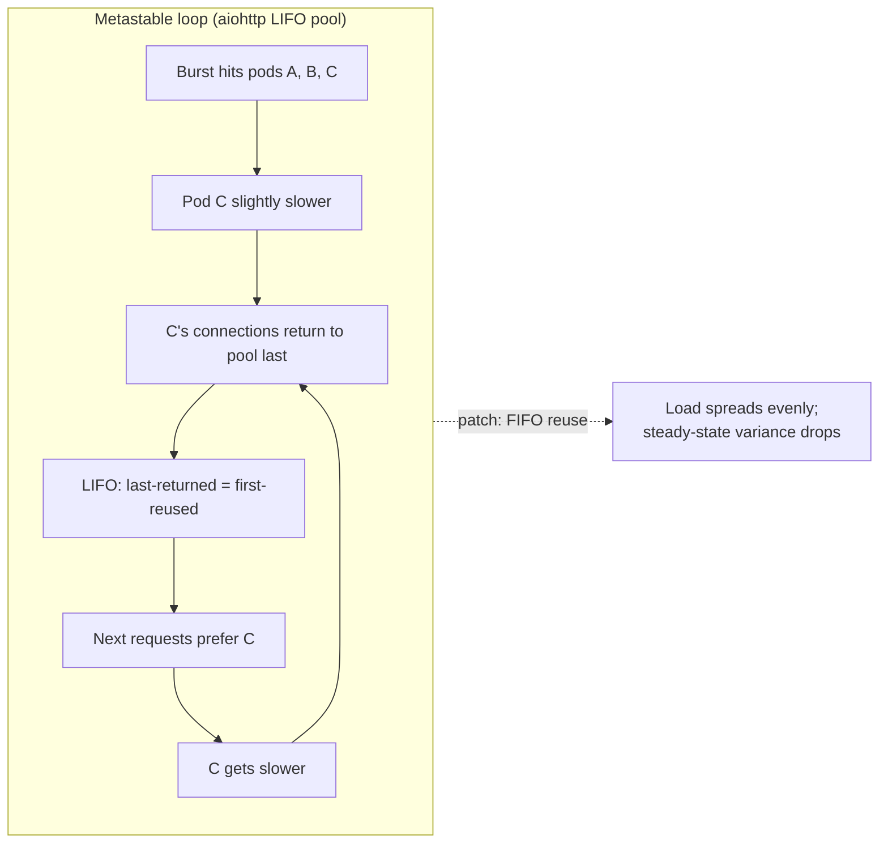

<!--
entry-meta
date: 2026-09-16
type: daily-diff
category: Daily Diff
title: Daily Diff — 2026-09-16
slug: sqlite-file-header-page1-bootstrap
edition: 2026-09-13
-->

# Daily Diff — 2026-09-16

**2026-09-16 · Daily Diff Digest**

> **Edition note:** tdd.cat has **no edition dated 2026-09-16**. The archive says "Editions are updated 2 days late so that we get time to popularity and top HN stories settle." The newest published edition when this ran was **[2026-09-13](https://tdd.cat/2026-09-13/)** (59 stories), and this log last covered 2026-09-12, so this digest covers **2026-09-13**. Nothing below is invented; every item comes from that edition.

## Notable Items (2026-09-13 edition)

**Storage and databases**

- **OpenAI: scaling online storage to 1B+ ChatGPT users (part 1).** Covers Habitat, OpenAI's storage platform: 70M+ req/s, a TAO-style object/edge API, and a Python service rewritten in Rust. *(Deep dive below.)*
- **PostgreSQL 19's "scary patch" contest (LWN).** Covers risky internal changes going into PG19. The LWN page returned 403 on fetch, so there's no detail here.
- **PlanetScale: the lifecycle of a sharded Postgres query.** Covers planning queries across many shards so the fleet looks like a single server.
- **DuckDB `AT` clause with `LATERAL`.** Uses time-travel lookups to query historical table versions inside a single SQL statement.
- **One lock for long-running DB operations.** Uses Postgres advisory locks so migrations run on exactly one instance.
- **RawTree.** A ClickHouse fork for schema-free OLAP.
- **"Your Filesystem is Lying to You."**
  - `write()` success only means the kernel accepted bytes into the page cache.
  - Writeback `EIO` can surface on a *later* `fsync()`, or on another file descriptor, or not at all before process exit.
  - PostgreSQL PANICs after fsyncgate.
  - The post's advice is to use SQLite rather than hand-roll durability.

**Distributed systems and runtime internals**

- **"A lease with a timeout is not a lock."** Walks through race conditions in common lease-based locking.
- **Go GC metadata in swap.** GC metadata that gets swapped out causes ~40 ms stop-the-world pauses.
- **ThreadSanitizer's limits in C and Go.** How the race detector works and what it structurally can't see.
- **Incr (OSDI '26).** Bolt-on incrementalization of shell scripts, with up to ~30× faster re-execution.
- **Principles for fast Tokio apps.** Batching and fairness in async Rust.
- **A Clippy lint made 3133× faster.**

**AI / ML (most of the edition)**

- AgentJIT, which compiles multi-step LLM workflows into deterministic Python.
- Bengio on why agents lie and cheat.
- Recurrent looped transformers and attractor models.
- MoBA block attention.
- Magic's pretraining efficiency claims.
- ZLUDA and CUDA on AMD.
- A red-team of 100 agents.
- Plus a long tail of agent harness and tooling projects.

## Deep Dive: OpenAI's Habitat — What Actually Broke When They Scaled

This is the most significant item because it's a first-hand production account at extreme scale, with specific failure mechanisms.

### What Habitat is

| | |
|---|---|
| Role | OpenAI's online storage platform behind its products |
| Scale | **>70 M req/s**, **>1 B weekly users**, **>500 PB**, **~40 regions** |
| Primary store | Azure Cosmos DB (part 2 is promised to cover it) |
| API | NoSQL, TAO-inspired: clients predefine **object and edge types** and how they relate, but not the content of each type |
| Partitioning | Each object and its edges are **colocated in one storage-level partition**. There is **no** attempt to colocate an edge's remote endpoint. |
| Query model | "simple, predictable, constant-work requests" only. There is no general SQL. |
| Complex queries | CDC streams changes to **isolated per-team Rockset instances** as an offline secondary view |

**Why they left the old design:**

- **Postgres:** reviewing every query and schema change stopped scaling with team growth, and "a single expensive new query on a hot path took out the database."
- **Client library:** Habitat began at DevDay 2023 as a Python library. By mid-2025, every change needed coordinated rollouts across dozens of services. Regional redundancy alone took days of flag-gated rollout, shadowing, and bug-fix rollouts.

### Failure mechanisms they hit (the useful part)

1. **Asyncio scheduling delay.**
   - The per-request CPU work (routing, compression, encryption, checksumming, health checks, shadowing, hedging) runs under the GIL.
   - At high utilization, even modest per-process concurrency caused event-loop jitter of **hundreds of ms**, occasionally **seconds**.
   - They measured it by scheduling periodic background tasks and recording expected-versus-actual run time.
   - **Fix:** fewer concurrent requests per process, many more processes (**up to 8 Python processes per pod**).
2. **LIFO connection reuse leading to metastable failure.**
   - aiohttp's connector reuses the most recently returned connection first.
   - A slow pod returns its connections *later*, so they are always the "most recent," so the slow pod gets *more* requests and gets slower still.
   - Some processes stayed degraded long after the burst ended.
   - **Fix:** FIFO reuse. This broke the loop and also *reduced steady-state variance*. Pooling later moved to Envoy/Istio.
3. **Thundering herd from process fan-out.**
   - The fix for (1) multiplied connection counts.
   - A normal deploy could cause CPU churn from connection cycling, and a leak could saturate the NAT gateway.
   - **Fix:** Envoy as the fan-in point. It upgrades HTTP/1 to multiplexed HTTP/2, pools connections and extends their lifetime, and applies rate limits and circuit breakers in one place.
4. **Feature-flag parsing stalls.**
   - Statsig polled a config containing *every production rule for every service* **every minute with no jitter**.
   - All 8 workers in a pod stalled at the same moment to parse the JSON.
   - They found it through live CPU profiling.
   - **Fix:** a targeted config, a longer interval, and jitter on background tasks.
5. **The exit: a Rust rewrite.**
   - In Q2 2026, **2 engineers with Codex and GPT-5.5** rewrote the service in Rust.
   - It now serves **95%** of production traffic.
   - It is **6× more CPU-efficient and 15× more memory-efficient**, with lower average and tail latency.
   - The Python version peaked at **>20 M req/s**.
   - The post gives no detail on how the rewrite was verified or rolled out.

### Why it matters

- **Pool order is a load-balancing policy, whether you meant it or not.** LIFO is the default in many client libraries because it keeps warm connections hot. Under heterogeneous backend latency it becomes a positive-feedback loop. Check your pool's reuse order before blaming the load balancer.
- **"Constant-work requests only" is a scaling decision, not a missing feature.** Pushing arbitrary queries to a CDC-fed offline copy is what stops one bad query from taking the primary down, which is the exact Postgres failure they left behind.
- **Tail latency in async Python is often scheduler latency.** Measure event-loop lag directly with a timer probe. Don't infer it from request timings.
- **Open question:** part 1 describes the service tier only. Consistency semantics, how partitions map to Cosmos DB, and read-path layering are promised for part 2 and aren't verified here.

## Sources

- [The Daily Diff — front page (showing the 2026-09-13 edition)](https://tdd.cat/)
- [The Daily Diff — archive](https://tdd.cat/archive/)
- [The Daily Diff — 2026-09-13 edition](https://tdd.cat/2026-09-13/)
- [OpenAI — Rapidly scaling online storage to serve over 1B ChatGPT users (part one)](https://openai.com/index/scaling-storage-one-billion-users-part-one/)
- [Your Filesystem is Lying to You](https://faraazahmad.github.io/blog/posts/filesystem-is-lying-to-you/)
