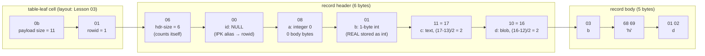
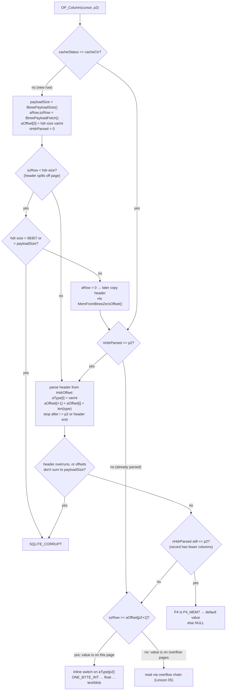

<!--
entry-meta
date: 2026-09-17
type: lesson
track: SQLite
lesson: 02
category: Database Internals
title: Varints, Serial Types, and the Record Format
slug: sqlite-varints-serial-types-record-format
-->

# Varints, Serial Types, and the Record Format

**2026-09-17 · SQLite Track · Lesson 02 of 32**

## Where This Fits

- **Previous lesson:** [Lesson 01](../2026-09-16-sqlite-file-header-page1-bootstrap/README.md) covered how `lockBtree()` checks page 1 and derives `usableSize`. It also covered meta slot `BTREE_FILE_FORMAT` (offset 44), whose value `4` enables serial types 8 and 9. This lesson shows the code that depends on that value.
- **This lesson:** how SQLite encodes a *row* as bytes. That means the 1–9-byte varint, the serial-type header, and the two VDBE opcodes that write and read records: `OP_MakeRecord` (encode) and `OP_Column` (lazy decode).
- **Next:** Lesson 03 (b-tree page header and cell layouts). A table-leaf cell is `varint(payload size) · varint(rowid) · record`, and this lesson only touches that prefix to find the records. Lesson 05 (overflow) explains why `OP_Column` separates `szRow` (bytes on this page) from `payloadSize` (the whole record). Lesson 09 (index b-trees) builds on the record-compare fast paths in §6.

Source code references are to `sqlite/sqlite` at commit `4ebc786`, the same commit used in Lesson 01. Experiments ran against SQLite **3.45.1** (Python's bundled library).

---

## 1. The Varint

**Encoding rules (fileformat2 §B-tree Pages):**

- A varint is a big-endian base-128 encoding of a 64-bit two's-complement integer.
- Bytes 1–8 each contribute 7 bits. The high bit is a continuation flag.
- If a 9th byte is present, it contributes **all 8 bits** and has no flag. This gives exactly 8·7 + 8 = 64 bits, so no varint is ever longer than 9 bytes.

| Length | Payload bits | Max unsigned value | Example (verified this run) |
|---|---|---|---|
| 1 | 7 | 127 | `127` → `7f` |
| 2 | 14 | 16,383 | `128` → `81 00`, `16383` → `ff 7f` |
| 3 | 21 | 2,097,151 | `16384` → `81 80 00` |
| 4 | 28 | 268,435,455 | `2097152` → `81 80 80 00` |
| 8 | 56 | 2⁵⁶−1 | `2⁵⁶−1` → `ff ff ff ff ff ff ff 7f` |
| 9 | 64 | 2⁶⁴−1 | `2⁵⁶` → `80 c0 80 80 80 80 80 80 00` |

- **Negative numbers are always 9 bytes.** For example, `-1` → `ff ×9`. Varints are therefore used only for values that are non-negative in practice: sizes, serial types, page numbers, and rowids. Most rowids are positive, but a negative rowid costs 9 bytes in every cell that stores it.
- **The length isn't in the first byte.** The decoder must walk continuation bits one byte at a time. *Where This Breaks Down* covers the cost.

### Encoder: `sqlite3PutVarint()` (util.c)

```c
int sqlite3PutVarint(unsigned char *p, u64 v){
  if( v<=0x7f ){ p[0] = v&0x7f; return 1; }
  if( v<=0x3fff ){ p[0] = ((v>>7)&0x7f)|0x80; p[1] = v&0x7f; return 2; }
  return putVarint64(p,v);
}
```

`putVarint64()` has two paths:

- **Top 8 bits set** (`v & ((u64)0xff000000)<<32`): it writes the 9-byte form directly. First `p[8] = (u8)v`, then 8×7 bits go into `p[7]..p[0]`.
- **Otherwise:** it builds the bytes little-end-first in a scratch `buf[10]`, clears the continuation bit on the least-significant group (`buf[0] &= 0x7f`), and copies the buffer out reversed.

### Decoder: `sqlite3GetVarint()`

- The decoder accumulates with `iKey = (iKey<<7) ^ x`, using XOR instead of mask-then-OR.
- The continuation bits that were shifted into the accumulator are then cancelled with constants such as `^ 0x4000` and `^ 0x10204000`.
- The final byte is folded in with `(iKey<<8) ^ 0x8000 ^ *++p`, which uses all 8 bits.
- This removes one `& 0x7f` per byte on the hot path. It reads as unusual code, but it's deliberate.

### The fast-path macros callers actually use (sqliteInt.h)

```c
#define getVarint32(A,B)  \
  (u8)((*(A)<(u8)0x80)?((B)=(u32)*(A)),1:sqlite3GetVarint32((A),(u32 *)&(B)))
#define putVarint32(A,B)  \
  (u8)(((u32)(B)<(u32)0x80)?(*(A)=(unsigned char)(B)),1:\
  sqlite3PutVarint((A),(B)))
```

- **The single-byte case is inlined.** It covers most serial types and every header size ≤ 127.
- **`sqlite3GetVarint32()` in brief:**
  - It open-codes the 2- and 3-byte cases.
  - It falls back to the 64-bit decoder only for longer varints.
  - If the result doesn't fit in 32 bits, it **saturates to `0xffffffff`**. This is a corruption guard, not a truncation.

### A quirk: `sqlite3VarintLen()`

```c
int sqlite3VarintLen(u64 v){
  int i;
  for(i=1; (v >>= 7)!=0; i++){ assert( i<10 ); }
  return i;
}
```

- **The quirk:** this counts 7-bit groups, so it returns **10** for a value with bit 63 set, although the real encoding is 9 bytes. A Python port of the loop confirmed this this run.
- **Why it's harmless where it's used:** in the record path, `OP_MakeRecord` calls it only on serial types and header sizes, and those never come close to 2⁶³.
- **The lesson:** it's a size estimator for small values, not a general `len(putVarint(v))`.

## 2. The Record: Header, Then Body

```
| hdr-size | type 0 | type 1 | ... | type N-1 | data0 | ... | data N-1 |
```

- **`hdr-size`** is a varint that counts **itself** plus all the type varints. It is also the offset of `data0`.
- **Type varints:** one per column, in declaration order.
- **Body:** values are concatenated with **no separators and no per-value length**. Each length is implied by its serial type.

A real record from this run: row `(id=1, a=0, b=3.0, c='hi', d=x'0102')` in `CREATE TABLE t(id INTEGER PRIMARY KEY, a, b REAL, c TEXT, d BLOB)`:



Things this example shows that the spec table doesn't:

- **`INTEGER PRIMARY KEY` is stored as NULL (type 0) in the record.** The value lives only in the cell's rowid varint. This costs one header byte and zero body bytes per row. Lesson 08 covers the aliasing.
- **`id` and `a` cost nothing in the body.** Types 0, 8, 9, 12, and 13 have zero-length content. A record whose values are all of those types has an empty body. This run's 130-column table of all `1`s has `payload = 132 = header size`.
- **Text length counts bytes in the database encoding.** In a `UTF-16le` database, `'hi'` became serial type **21** (4 bytes), not 17. The encoding comes from header offset 56, which Lesson 01 covered.

### Serial types as the decoder sees them

`sqlite3SmallTypeSizes[128]` (vdbeaux.c) is a lookup table that makes every one-byte type O(1):

```c
/*  0   1   2   3   4   5   6   7   8   9 */
    0,  1,  2,  3,  4,  6,  8,  8,  0,  0,     /* 0..9  : NULL, ints, float, 0, 1 */
    0,  0,  0,  0,  1,  1,  2,  2,  3,  3,     /* 10,11 reserved; 12/13 = empty blob/text */
    ...                                        /* up to 127: (N-12)/2 */
u32 sqlite3VdbeSerialTypeLen(u32 serial_type){
  if( serial_type>=128 ) return (serial_type-12)/2;
  return sqlite3SmallTypeSizes[serial_type];
}
```

- **Types 10 and 11:**
  - **10** is used internally. `OP_MakeRecord` assigns it to a `MEM_Null|MEM_Zero` value, meaning a virtual table "no change" column in an UPDATE, so that `sqlite3_value_nochange()` survives into `xUpdate`.
  - **11** decodes as NULL.
  - Neither may appear in a well-formed file.
- **Integer decode macros (vdbeInt.h)** sign-extend from the top byte only:
  ```c
  #define ONE_BYTE_INT(x)    ((i8)(x)[0])
  #define TWO_BYTE_INT(x)    (256*(i8)((x)[0])|(x)[1])
  #define THREE_BYTE_INT(x)  (65536*(i8)((x)[0])|((x)[1]<<8)|(x)[2])
  #define SIX_BYTE_INT(x)    (FOUR_BYTE_UINT(x+2)+4294967296LL*TWO_BYTE_INT(x))
  ```

## 3. The Writer: `OP_MakeRecord` (vdbe.c)

`OP_MakeRecord P1 P2 P3 P4` packs registers `P1..P1+P2-1` into a blob in register `P3`, after applying the affinity string in `P4`. It makes **two passes** over the registers.

### Pass 1 (right to left): choose serial types and size everything

- Each `Mem` gets its serial type in `pRec->uTemp`. `nHdr` (header bytes) and `nData` (body bytes) accumulate as it goes.
- **Integer width selection** folds negatives with `uu = ~i`, so `-128` (`~` = 127) is 1 byte and `-129` (`~` = 128) is 2 bytes:

| Condition on `uu` | Serial type | Body bytes |
|---|---|---|
| `≤ 127` and value is 0 or 1 and `p->minWriteFileFormat>=4` | 8 / 9 | 0 |
| `≤ 127` | 1 | 1 |
| `≤ 32767` | 2 | 2 |
| `≤ 8388607` | 3 | 3 |
| `≤ 2147483647` | 4 | 4 |
| `≤ 140737488355327` (2⁴⁷−1) | 5 | 6 |
| otherwise | 6, or **7 if `MEM_IntReal`** | 8 |

- **Types 8/9 are gated on file format.** The test is `(i&1)==i && p->minWriteFileFormat>=4`. This is the offset-44 meta value from Lesson 01, and it's why schema format 4 is required for types 8 and 9.
- **REAL stored as an integer (`MEM_IntReal`):**
  - When the affinity is `SQLITE_AFF_REAL` and the value is an integer, the flag changes from `MEM_Int` to `MEM_IntReal`.
  - The value is then stored with the *integer* serial types. The datatype doc calls this "completely invisible at the SQL level and can only be detected by examining the raw bits."
  - If the integer would need 8 bytes anyway, it is converted back to a double (type 7), since an int saves nothing at that size.
- **Strings and blobs:**
  - The serial type is `len*2 + 12 + isText`.
  - `MEM_Zero` blobs (from `zeroblob()`) add their zero count to the serial type.
  - If the zeroblob is the trailing field (`nData==0` at that point in the right-to-left pass), its zero bytes are *not materialised*. They are carried as `nZero` on the output Mem.

### The self-referential header size

`hdr-size` includes its own length, which is circular. The code resolves it like this:

```c
if( nHdr<=126 ){
  nHdr += 1;                                   /* common case */
}else{
  nVarint = sqlite3VarintLen(nHdr);
  nHdr += nVarint;
  if( nVarint<sqlite3VarintLen(nHdr) ) nHdr++; /* adding the varint pushed it over a boundary */
}
```

- **Why the cutoff is 126:** 126 type bytes plus 1 size byte = 127, which still fits a 1-byte varint.
- **Verified:** a 130-column record has header size **132** (`81 04`), which is 130 type bytes plus a 2-byte size varint.

### Pass 2 (left to right): emit bytes

- **Header varint:** `*(zHdr++) = nHdr` when it's `< 0x80`, otherwise `sqlite3PutVarint`.
- **Numeric types (≤ 7):** each writes one header byte. The body value is written big-endian with a trick:
  ```c
  v = sqlite3BSwap64(v);                         /* little-endian host */
  static const u8 aShift[] = { 0, 56, 48, 40, 32, 16, 0, 0 };
  v >>= aShift[serial_type];
  memcpy(zPayload, &v, 8);                        /* always copy 8 bytes */
  zPayload += len;                                /* advance only len */
  ```
  The buffer is allocated with **`OVERRUN` = 7** spare bytes (when `SQLITE_MAX_LENGTH<=2147483640` and byte order is known at compile time). That lets every integer be a fixed 8-byte `memcpy` with no per-width branch. The next field overwrites the extra bytes.
- **Optional `SQLITE_ENABLE_NULL_TRIM`** drops trailing NULLs when `P5` says no dropped column has a non-NULL default. This is the same mechanism as the short records in §4.

## 4. The Reader: `OP_Column` Decodes Lazily

`OP_Column P1 P2 P3` extracts column `P2` from the row under cursor `P1`. It avoids re-parsing on every call by keeping per-cursor state in `VdbeCursor`:

| Field | Meaning |
|---|---|
| `aType[i]` | serial type of column *i*, once parsed |
| `aOffset[i]` | body offset of column *i*. `aOffset[0]` is the header size. |
| `nHdrParsed` | how many header entries have been decoded so far |
| `iHdrOffset` | byte position of the next unparsed header varint |
| `aRow`, `szRow` | pointer to the record bytes **on the current page**, and how many there are |
| `payloadSize` | full record size (can exceed `szRow` if it spills to overflow pages) |
| `cacheStatus` | compared with `p->cacheCtr`. A mismatch means the cursor moved, so the cached parse is stale. |



What the code shows:

- **Parsing stops at `p2`.** The loop condition is `while( (u32)i<=p2 && zHdr<zEndHdr )`. Reading column 3 of a 50-column row decodes 4 header entries, not 50. A later `OP_Column` for column 10 on the same row resumes from `iHdrOffset`.
- **Offsets are prefix sums.** `aOffset[i+1] = aOffset[i] + len(aType[i])`. To find column *k* you must know the types of columns 0..k−1, so there is no random access into a record (see *Where This Breaks Down*).
- **The corruption check is cheap and complete.** When the header is fully consumed, the summed offsets must equal `payloadSize` exactly, and no offset may exceed it.
- **Why 98,307:** the header-size limit comes from a comment: 32,768 columns max × 3-byte type varints + 3 bytes for the size itself. The comment reasons that 4- and 5-byte types imply so much data that a legal record can hold only 4,096 and 32 of them, respectively.
- **Short records:**
  - `ALTER TABLE … ADD COLUMN` doesn't rewrite rows.
  - When `nHdrParsed <= p2` after parsing, the record simply has fewer columns. The opcode returns `P4` (a `P4_MEM` holding the column default) or NULL.
  - Verified: the row inserted before `ADD COLUMN b DEFAULT 'dflt'` is the 2-byte record `02 09` (one column, the integer 1), and it reads back as `(1, 'dflt')`.
- **`OPFLAG_LENGTHARG` / `OPFLAG_TYPEOFARG`** let `length()` and `typeof()` / `IS NULL` skip loading content. `typeof()` needs only `aType[p2]`.
- **NaN becomes NULL on read.** `sqlite3VdbeSerialGet7()` sets `MEM_Null` if the 8 bytes are a NaN. Separately, binding a Python `float('nan')` stored NULL this run (`typeof` = `null`).

## 5. What Actually Lands on Disk (Measured This Run)

`CREATE TABLE t(id INTEGER PRIMARY KEY, a, b REAL, c TEXT, d BLOB)`. Column `a` has no declared type, so its affinity is BLOB (no conversion).

| Value inserted | Column | Serial type | Body bytes | Why |
|---|---|---|---|---|
| `0`, `1` | a | 8, 9 | 0 | file format 4 (`PRAGMA`-visible at offset 44 = `00000004`) |
| `127` / `-128` | a | 1 | 1 | `uu ≤ 127` |
| `128` / `-129` | a | 2 | 2 | `uu = 128` |
| `32768` | a | 3 | 3 | |
| `8388608` | a | 4 | 4 | |
| `2³¹` | a | 5 | 6 | there is no 5-byte type; the 6-byte type covers up to 2⁴⁷−1 |
| `2⁴⁷`, `2⁶³−1` | a | 6 | 8 | |
| `1.0` | a (BLOB affinity) | **7** | 8 | no REAL affinity, so no int optimisation |
| `3.0` | b (REAL) | **1** | 1 | `MEM_IntReal`; `typeof(b)` still says `real` |
| `2.0⁶⁰` | b (REAL) | 7 | 8 | integer would need 8 bytes, so converted back to double |
| `-0.0` | b (REAL) | **8** | 0 | stored as integer 0: **the sign of zero is lost** |
| `-0.0` | untyped column | 7 | 8 | bytes `80 00 00 00 00 00 00 00`: sign kept |
| `'42'` | a | 17 | 2 | BLOB affinity leaves text alone |
| `'hi'` | c, UTF-16le DB | 21 | 4 | length in bytes of the DB encoding |
| `'7x'` | INTEGER column | 21 (UTF-16) | 4 | not a well-formed number, so it stays TEXT |
| 100×`'x'` | c | 213 (`81 55`) | 100 | 2-byte serial-type varint |

**Index records** use the same format. Entries in `CREATE INDEX ia ON t(c)` look like `03 00 01 04`: header size 3, `c` = NULL, rowid as a 1-byte int, body `04`. The **rowid is appended as the last field** of every index key. Lesson 09 builds on this.

## 6. Comparing Records Without Fully Decoding Them

B-tree seeks compare a search key (`UnpackedRecord`) against serialized records many times per lookup. `sqlite3VdbeFindCompare()` chooses a specialised comparator:

```c
if( p->pKeyInfo->nAllField<=13 ){
  ...
  if( (flags & MEM_Int) ){ p->u.i = p->aMem[0].u.i; return vdbeRecordCompareInt; }
  if( (flags & (MEM_Real|MEM_IntReal|MEM_Null|MEM_Blob))==0
   && sqlite3IsBinary(p->pKeyInfo->aColl[0]) ){
    ...
    return vdbeRecordCompareString;
  }
}
return sqlite3VdbeRecordCompare;
```

- **Why the limit is 13 fields:** the fast comparators assume the header-size varint is a single byte. They may also over-read by at most the maximum legal header plus 8 bytes. With ≤ 13 fields and an integer first field, the header is at most `12*5 + 1 + 1` bytes, which is within the guaranteed padding (at least 74 bytes, per the comment).
- **Other conditions:**
  - `DESC` columns flip `r1`/`r2`.
  - `NULLS LAST` ordering (`KEYINFO_ORDER_BIGNULL`) always takes the general path.
  - Non-`BINARY` collations also take the general path, because a custom collation can't be reduced to `memcmp`.
- **Practical consequence:** an index whose **first column is an INTEGER, or a TEXT with the default collation**, gets the fast path on every probe.

## Hands-On

The following needs only `python3`. It parses records straight out of the file, without `sqlite_dbpage`, which Python's bundled build lacks (`no such table: sqlite_dbpage` this run).

```bash
mkdir -p ~/sqlite-lab && cd ~/sqlite-lab && rm -f r.db
cat > rec.py <<'PY'
import struct
def getvarint(b, i):
    v = 0
    for k in range(8):
        x = b[i+k]; v = (v << 7) | (x & 0x7f)
        if x < 0x80: return v, k+1
    return (v << 8) | b[i+8], 9
SIZES = {0:0,1:1,2:2,3:3,4:4,5:6,6:8,7:8,8:0,9:0}
def decode(rec):
    hsz, n = getvarint(rec, 0); i = n; types = []
    while i < hsz:
        t, n = getvarint(rec, i); types.append(t); i += n
    out, off = [], hsz
    for t in types:
        L = SIZES[t] if t < 12 else (t-12)//2; d = rec[off:off+L]; off += L
        out.append(None if t == 0 else
                   int.from_bytes(d, 'big', signed=True) if t <= 6 else
                   struct.unpack('>d', d)[0] if t == 7 else
                   t-8 if t in (8, 9) else
                   bytes(d) if t % 2 == 0 else d.decode())
    return hsz, types, out
def leaf_records(path, pgno):
    raw = open(path, 'rb').read(); ps = raw[16] << 8 | raw[17] << 16
    pg = raw[(pgno-1)*ps : pgno*ps]; h = 100 if pgno == 1 else 0
    assert pg[h] == 0x0d, "not a table-leaf page (Lesson 03)"
    ncell = struct.unpack('>H', pg[h+3:h+5])[0]
    for c in range(ncell):
        p = struct.unpack('>H', pg[h+8+2*c : h+10+2*c])[0]
        plen, a = getvarint(pg, p); rowid, b = getvarint(pg, p+a)
        yield rowid, pg[p+a+b : p+a+b+plen]
PY
python3 - <<'PY'
import sqlite3
from rec import decode, leaf_records
c = sqlite3.connect('r.db', isolation_level=None)
c.execute("CREATE TABLE t(id INTEGER PRIMARY KEY, a, b REAL, c TEXT)")
c.executemany("INSERT INTO t VALUES(?,?,?,?)", [
  (1, 0, 3.0, 'hi'), (2, 1, 3.5, ''), (3, -129, -0.0, 'x'*100),
  (4, 2**31, float(2**60), None), (5, 1.0, None, None)])
c.execute("CREATE TABLE al(a)"); c.execute("INSERT INTO al VALUES(1)")
c.execute("ALTER TABLE al ADD COLUMN b DEFAULT 'dflt'")
for name in ('t', 'al'):
    pg = c.execute("SELECT rootpage FROM sqlite_schema WHERE name=?", (name,)).fetchone()[0]
    for rowid, rec in leaf_records('r.db', pg):
        h, types, vals = decode(rec)
        print(name, rowid, rec[:h].hex(' '), types, vals)
print(c.execute("SELECT id, typeof(b), b FROM t").fetchall())
print(c.execute("SELECT * FROM al").fetchall())
PY
```

**What to look for, and what each observation proves:**

1. **`id` is type `0` in every row.** The primary key is not in the record; it is the cell's rowid.
2. **Row 1 has types `[0, 8, 1, 17]`.** Integer 0 costs no body bytes (type 8). `3.0` in a REAL column is a **1-byte integer**, yet `typeof(b)` returns `real`. That is `MEM_IntReal` at work.
3. **Row 3 has `-129` → type 2 and `-0.0` → type 8.** The first is the `~i` fold. The second shows that the REAL-as-int optimisation erased the sign bit.
4. **Row 3's header is `06 00 02 08 81 55`.** The other rows have 5-byte headers, but the 100-char string's serial type 213 needs a 2-byte varint (`81 55`), so this header is 1 + 1 + 1 + 1 + 2 = **6** bytes. Every header in this table grows by one byte as soon as a single long value appears.
5. **Row 4 has `2³¹` → type 5 (6 bytes) and `2⁶⁰` as REAL → type 7.** The integer form would need 8 bytes, so it stays a double.
6. **Row 5 has `1.0` in the untyped column → type 7.** There is no affinity, so no conversion.
7. **`al` rowid 1 is `02 09`**, a one-column record. It still reads back as `(1, 'dflt')`. That is `OP_Column`'s short-record path returning the `P4_MEM` default.

**Stretch:** run `EXPLAIN INSERT INTO t VALUES(9,1,2.0,'z')` in the `sqlite3` CLI.

- Find `MakeRecord`. Its P4 is the affinity string: one character per column. This run it was `DAEB`: `D` = INTEGER, `A` = BLOB (no type), `E` = REAL, `B` = TEXT.
- Then run `EXPLAIN SELECT c FROM t` and note `Column 0 3 1`. Column index 3 means `OP_Column` will parse 4 header entries.

## Where This Breaks Down

- **There is no random access to a column.** Body offsets are prefix sums of the types before them. Reading the last column of a wide row parses the whole header, and if earlier columns are large, the target value may sit on an overflow page even when it is tiny. **Put small, hot columns first** in wide tables. This is a direct consequence of `aOffset[i+1] = aOffset[i] + len(aType[i])`.
- **The varint length isn't in the first byte**, so decoding branches once per byte. The SQLite4 design note describes a replacement where "the length of any varint can be determined by looking at just the first byte" (1 byte for values 0–240, 2 bytes up to 2,287, 3 bytes up to 67,823), and where lexicographic order equals numeric order. SQLite3's varint has neither property, so records can't be compared with `memcmp`. That is why §6 needs typed comparators.
- **Negative values are expensive wherever varints are used.** A negative rowid is 9 bytes in every table cell and every index entry that carries it.
- **Every row stores its own type header.** That is at least one byte per column per row, which is the cost of dynamic typing. (This run did not check whether `STRICT` tables change the on-disk encoding.)
- **Information loss you might not expect:**
  - `-0.0` in a REAL-affinity column comes back as `+0.0`.
  - NaN can't be stored; it becomes NULL.
  - The REAL-as-int trick is lossless only for values that are integral and fit in the smaller int widths.
- **Adding a column is O(1), with lasting side effects.** `ADD COLUMN` leaves short records around indefinitely. The column default must remain constant, and `OP_Column` carries the default in `P4` for every read of those rows.
- **Hard limits:**
  - A header over 98,307 bytes is treated as corruption.
  - `SQLITE_LIMIT_LENGTH` caps the whole record (`goto too_big`).
- **Not verified here:** whether any caller other than the record path passes `sqlite3VarintLen()` a value ≥ 2⁶³. Only `OP_MakeRecord`'s uses were checked.

## Further Study

- [Datatypes In SQLite](https://www.sqlite.org/datatype3.html): the affinity rules that feed `OP_MakeRecord`'s `P4`, and the REAL-storage note.
- [SQLite4 variable-length integers](https://sqlite.org/src4/doc/trunk/www/varint.wiki): an order-preserving, length-in-first-byte alternative, and what SQLite3 gave up.
- [SQLite source: src/vdbe.c](https://raw.githubusercontent.com/sqlite/sqlite/master/src/vdbe.c): read `OP_Column` and `OP_MakeRecord` side by side.
- [SQLite source: src/vdbeaux.c](https://raw.githubusercontent.com/sqlite/sqlite/master/src/vdbeaux.c): `vdbeRecordCompareInt()` shows how the fast comparator reads an integer straight out of a serialized record.

## Next Steps

1. Extend `rec.py` to decode **index-leaf pages** (type `0x0a`; cells have no rowid varint, only `varint(payload) · record`). Confirm that the rowid is the last field.
2. Write `encode(values, affinity)` so that it reproduces `OP_MakeRecord` byte for byte, including the `~i` fold and the IntReal rule. Diff its output against real cells for 1,000 random rows.
3. Benchmark column position: in a 100-column table with a 2 KB blob at column 1, time `SELECT c99` against `SELECT c0`. Then move the blob to the last position and time again.
4. Build a database, set offset 44 to `3` with a hex editor, and insert `0`/`1`. See whether types 8/9 still appear. The code says `minWriteFileFormat` gates them, so predict the result first.
5. Read `vdbeRecordCompareInt()` and work out why it can safely over-read. Keep the answer for Lesson 09.

## Sources

- [Database File Format (fileformat2): varints and record format](https://www.sqlite.org/fileformat2.html)
- [Datatypes In SQLite Version 3](https://www.sqlite.org/datatype3.html)
- [SQLite4: Variable-Length Integers](https://sqlite.org/src4/doc/trunk/www/varint.wiki)
- [SQLite source: src/util.c](https://raw.githubusercontent.com/sqlite/sqlite/master/src/util.c): `sqlite3PutVarint`, `sqlite3GetVarint`, `sqlite3GetVarint32`, `sqlite3VarintLen`
- [SQLite source: src/vdbe.c](https://raw.githubusercontent.com/sqlite/sqlite/master/src/vdbe.c): `OP_MakeRecord`, `OP_Column`. Line-level reads were at commit `4ebc786` through a code index.
- [SQLite source: src/vdbeaux.c](https://raw.githubusercontent.com/sqlite/sqlite/master/src/vdbeaux.c): `sqlite3SmallTypeSizes`, `sqlite3VdbeSerialGet`, `sqlite3VdbeFindCompare`. Same commit as above.

## Takeaways

- **Varints:** 7 bits per byte for 8 bytes, then a full 9th byte, so the maximum is 9 bytes. Negative values always take 9 bytes. `getVarint32` and `putVarint32` inline the 1-byte case, which covers almost every serial type.
- **Records:** a record is `hdr-size · types… · values…`. Lengths are implied by types, so there are no separators, and the size varint counts itself.
- **`OP_MakeRecord`:**
  - It chooses the narrowest integer width using `~i` for negatives.
  - It uses zero-byte types 8/9 when the file format is ≥ 4.
  - It silently stores integral REALs as ints, which loses the sign of `-0.0`.
- **`OP_Column`:**
  - It parses the header lazily, only up to the column you asked for.
  - It caches `aType`/`aOffset` per cursor row.
  - It returns defaults for short records left by `ADD COLUMN`.
- **Record order matters.** Column position is a performance decision, and records can't be compared with `memcmp`. Fast comparators exist only for keys of ≤ 13 fields whose first column is an integer or BINARY-collated text.
