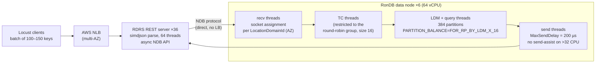

<!--
entry-meta
date: 2026-09-17
type: daily-diff
category: Daily Diff
title: Daily Diff — 2026-09-17
slug: sqlite-varints-serial-types-record-format
edition: 2026-09-15
-->

# Daily Diff — 2026-09-17

**2026-09-17 · Daily Diff Digest**

> **Edition note:** tdd.cat has **no edition dated 2026-09-17**. Editions are published about two days late.
> - The front page showed **Tuesday, 2026-09-15** (92 stories), so this digest covers that edition.
> - `https://tdd.cat/2026-09-14/` returned **404**, so there was no 09-14 edition to cover.
> - The previous digest covered 2026-09-13.
>
> The fetched page listed the first 68 stories in detail and truncated the rest. Nothing below is invented.

## Notable Items (2026-09-15 edition)

**Databases and storage**

- **RonDB reaches 100M key lookups/s through a REST API with Python clients.** *(Deep dive below.)*
- **Rewriting a search-and-inference database in Zig from scratch** (Antfly).
- **Cockroach Continuum**: CockroachDB's architecture pitch for fleets of databases created by agents.
- **Zep: a purpose-built graph database service for agent memory.**
- **"Database query cost us four round-trips for six months"**: a latency postmortem.
- **Tigris: remaking Git packfiles to sit on object storage.**
- **GEFS**, a crash-safe snapshotting filesystem, has an early-preview port to OpenBSD (openbsd-tech).
- **HN thread: serializing runtime state to disk vs. memory-mapping it.**
- **sqliteai/WARP**: runs AI models larger than available RAM.
- A **VLDB vol. 19 paper** (p4658). The summariser couldn't parse the PDF, so it isn't described here.

**Systems and runtime**

- **Building an Apple M4 GPU driver from scratch in one month.**
- **JDK 27 is GA.**
- **What every kernel programmer should know about jump labels.**
- **Namespace: instant container image loading** via on-demand fetching.
- **A NEON backend makes gearhash ~2× faster on ARM64.**
- **Remoc**: Rust RPC with multiplexed, sendable channels over one connection.
- **Lovable's "OJ"**: faster preview environments and cold starts.

**AI, agents, and tooling (most of the edition)**

- Anthropic scales test-impact analysis for agentic coding in CI.
- Dan Luu on an AI agent fabricating a bug reproduction.
- OpenAI's LLMs helped design the Jalapeño chip (IEEE Spectrum).
- GRP-Obliteration unaligns LLMs with a single unlabeled prompt.
- Formal methods for checking agent permissions (NVIDIA OpenShell).
- "An AI agent used 5B tokens to make $1.54."
- The ATLAS-Finance benchmark.
- A long tail of agent harnesses, guardrail layers, and MCP servers.

## Deep Dive: How RonDB Got to 104.5M Key Lookups per Second over HTTP

This is the most significant item: a database vendor publishing a first-party, reproducible-style scaling log with **eight concrete bottlenecks, listed in the order they were hit**. It's more useful than the headline number.

### The setup

| Tier | Count × size | Role |
|---|---|---|
| Benchmark clients | 22 × 64 vCPU (c8g/c7a) | Locust (Python), batch requests of **150 keys** (throughput) / **100 keys** (latency) |
| AWS Network Load Balancer | 1 (quota raised to 48,000 LCU) | fans HTTP to REST servers |
| REST API servers (RDRS) | 36 × 16 vCPU | C++ with **simdjson**; 64 threads each; async NDB API |
| RonDB data nodes | 6 × c8g.16xlarge (64 vCPU Graviton 4, 30 Gbit/s) | NDB storage/transaction engine, 384 partitions |

That is about 2,500 vCPUs in total, across 2 AZs in eu-north-1.

**Results:**

- **104.5M lookups/s** with 5 integer features per row.
- **96.4M/s** with 10 mixed features, carrying 15.6 GB/s of JSON.
- **Latency run:** 1,407 clients at 61.5M lookups/s gave **1.93 ms average, 2 ms p95, 3 ms p99** per *batch request*.
- Each REST server handled about **3.5M lookups/s**.
- Graviton 4 delivered "about 20% more throughput" than the Intel and AMD instances tested.

### The data-node thread pipeline (why the fixes look the way they do)

According to RonDB's thread-config docs:

- **LDM threads** own the data, hash indexes, and ordered indexes, and use about 50–60% of CPU. Query threads pair with them in LDM groups.
- **TC threads** receive NDB API operations and coordinate transactions (about 20–25%).
- **Recv threads** handle inbound network traffic (10–15%).
- **Send threads** handle outbound traffic (about 10%).
- LDM and query thread pairs are grouped into **round-robin groups** that share an L3 cache.

A request crosses four stages: receive, then transaction coordination, then query execution, then send.

### The bottleneck log, and the mechanism behind each fix

1. **Partition contention (ceiling: 2.5M/s).**
   - **Problem:** one table with the default 4 partitions topped out at about 600K ops/s per partition.
   - **Fix:** `PARTITION_BALANCE=FOR_RP_BY_LDM_X_16` plus `PartitionsPerNode` raised from 2 to 4, giving 384 partitions.
   - **Lesson:** partition count, not core count, caps parallelism in a partition-owning engine.
2. **REST server under-threaded.**
   - **Problem:** 16 threads on 16 vCPUs didn't saturate the CPUs.
   - **Fix:** 64 threads plus **no response compression**.
   - **Result:** roughly 2× per server, reaching 22M/s. With an async client API, threads mostly wait on I/O, so oversubscribing is correct.
3. **Load balancer scaling.**
   - **ALB:** needed 5–6 warm-up runs before it scaled.
   - **NLB:** scaled faster but hit a **single-AZ 50 Gb/s** ceiling.
   - **Fix:** go multi-AZ, and remove any LB from the NDB path so REST servers talk to data nodes directly.
4. **AZ-aware socket assignment bug.**
   - **Problem:** round-robin assignment across 2 AZs meant only 4 of 8 recv threads got first-AZ traffic, so scaling reached only about 60% of linear.
   - **Fix:** a double loop that assigns one AZ at a time.
5. **TC batching destroyed by spreading.**
   - **Problem:** receive threads round-robined transactions over all 16 TC threads, which broke up batches. Going from 32 to 64 CPUs gained only about 50%.
   - **Fix:** confine distribution to the round-robin group, with group size raised from 8 to 16.
   - **Lesson:** spreading work *too* evenly can cost more than it gains.
6. **Over-eager send assist.**
   - **Problem:** on large nodes, LDM and TC threads assisting with sends caused contention.
   - **Fix:** disable send assist above 32 CPUs and set `MaxSendDelay = 200 µs`, trading a bounded amount of latency for batching.
7. **Load-generator saturation.** The Locust master hit 100% CPU beyond 1,005 workers. Raising file-descriptor limits got it to 1,407.
8. **False successes.**
   - **Problem:** batch responses return **HTTP 200 with per-key error codes**, so the benchmark counted failures as throughput.
   - **Fix:** validate each response body.
   - **Lesson:** this matters for anyone benchmarking any batch API.

### Why it matters

- **Most of the ceilings weren't in the storage engine.** They were in partitioning, thread-to-queue affinity, load balancers, socket assignment, and the load generator. At this scale, **topology and batching boundaries are the performance model**.
- **Batching is carrying much of the headline.** The ~2 ms p99 is per 100-key batch, and single-key latency isn't reported. Divide the throughput by the batch size (104.5M / 150 ≈ 0.7M HTTP requests/s) before comparing with per-request systems.
- **Item 8 generalises.** Any "partial success in a 200" protocol needs body-level validation in benchmarks and alerting, or your success rate is fiction.
- **Caveats:**
  - The cost comparison with DynamoDB ignores reserved-instance pricing and operational overhead.
  - The network (30 Gbit/s per instance, NLB quotas) shaped the design as much as CPU did.

## Sources

- [The Daily Diff: front page (showing the 2026-09-15 edition)](https://tdd.cat/)
- [The Daily Diff: 2026-09-15 edition](https://tdd.cat/2026-09-15/)
- [The Daily Diff: archive](https://tdd.cat/archive/)
- [RonDB: The process to reach 100M key lookups per second with REST API and Python clients](https://www.rondb.com/post/the-process-to-reach-100m-key-lookups-per-second-with-rest-api-and-python-clients)
- [RonDB docs: Automatic Thread Configuration](https://docs.rondb.com/automatic_thread_config/)
- [RonDB docs: Research on a Thread Pipeline](https://docs.rondb.com/research_thread_pipeline/) (seen in search results; not fetched)
