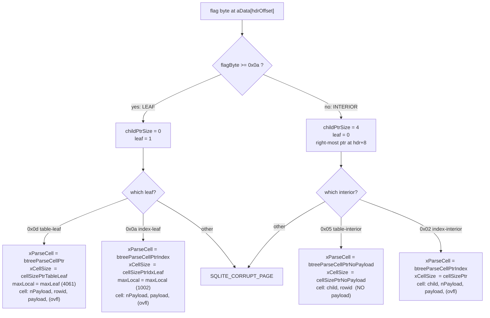

<!--
entry-meta
date: 2026-09-18
type: lesson
track: SQLite
lesson: 03
category: Database Internals
title: The B-tree Page Header, Cell Pointer Array, and the Four Cell Layouts
slug: sqlite-btree-page-header-cell-layouts
-->

# The B-tree Page Header, Cell Pointer Array, and the Four Cell Layouts

**2026-09-18 · SQLite Track · Lesson 03 of 32**

## Where This Fits

- **Previous lesson:** [Lesson 02](../2026-09-17-sqlite-varints-serial-types-record-format/README.md) encoded a *row* as a record (`hdr-size · types… · values…`) and left the cell prefix unexplained, noting only that a table-leaf cell is `varint(payload) · varint(rowid) · record`. [Lesson 01](../2026-09-16-sqlite-file-header-page1-bootstrap/README.md) derived `usableSize` and the constants `maxLocal/minLocal/maxLeaf/minLeaf` = **1002 / 489 / 4061 / 489** at `usableSize = 4096`. Both are used on every line below.
- **This lesson:** the container those records live in. The 8- or 12-byte page header, the cell pointer array, the cell content area, and the **four** cell layouts that `decodeFlags()` dispatches between. This is the layer that turns "a page" into "a sorted array of cells".
- **Next:** Lesson 04 takes the free-space fields introduced in §6 (`freeblock` at offset 1, `frag` at offset 7) and covers the allocator — `allocateSpace()`, `freeSpace()`, and `defragmentPage()`. Lesson 05 takes the `nLocal < nPayload` case from §5 and follows the overflow chain. Lesson 11 takes the convergence measured in §1 and covers `balance()`.

Source references are to `sqlite/sqlite` at commit **`4ebc786`**, the same commit as Lessons 01–02. Experiments ran against SQLite **3.45.1** (Python's bundled library), page size 4096, `reserved = 0`, so `usableSize = 4096` throughout.

---

## 1. A Page Is Three Regions That Grow Toward Each Other

Every b-tree page — including page 1, which carries the 100-byte file header first — is laid out as:

| Region | Grows | Notes |
|---|---|---|
| b-tree page header | fixed | 8 bytes on a leaf, **12** on an interior page |
| cell pointer array | **downward**, 2 bytes per cell | sorted in **key order** |
| unallocated gap | shrinks from both sides | the only region that must stay contiguous |
| cell content area | **upward**, from the end of the page | cells in **arbitrary physical order** |
| reserved region | fixed | `page1[20]` bytes, usually 0 (Lesson 01) |

The two ends grow toward each other, and a page splits when they would touch. That is directly measurable. Inserting rows of a fixed 45-byte cell size into `t(a INTEGER PRIMARY KEY, b TEXT)` with `b = 'x'*40`:

| rows | root page type | nCell | `iCellFirst` | cell content start | gap |
|---|---|---|---|---|---|
| 1 | table-leaf | 1 | 10 | 4051 | 4041 |
| 20 | table-leaf | 20 | 48 | 3196 | 3148 |
| 40 | table-leaf | 40 | 88 | 2296 | 2208 |
| 60 | table-leaf | 60 | 128 | 1396 | 1268 |
| 80 | table-leaf | 80 | 168 | 496 | 328 |
| 82 | table-leaf | 82 | 172 | 406 | 234 |
| 100 | **table-interior** | 1 | 14 | 4091 | 4077 |

- **Each row costs exactly 47 bytes of gap**: 45 bytes of cell plus 2 bytes of pointer. The gap falls 4041 → 3148 over 19 rows, and 893 / 19 = **47**.
- **The split point is arithmetic, not a heuristic.** At `nCell = 86`: `iCellFirst = 8 + 2·86 = 180`, content start `= 4096 − 86·45 = 226`, gap `= 46`. One more cell needs 47. Measured: the root became a `table-interior` page holding **one** cell with key 86 pointing at a left child with rowids 1..86, plus a right-most pointer to rowids 87..100.
- **`iCellFirst` is the first byte a cell or freeblock may occupy**, and `btreeComputeFreeSpace()` computes it exactly this way:
  ```c
  iCellFirst = hdr + 8 + pPage->childPtrSize + 2*pPage->nCell;
  iCellLast  = usableSize - 4;
  ```
  Note it is `8 + childPtrSize`, not a separate constant for interior pages — the 12-byte header is just the 8-byte header plus the 4-byte right-most pointer.

## 2. The Page Header, Field by Field

| Offset | Size | Field | Consumer in `btree.c` |
|---|---|---|---|
| 0 | 1 | page type flag | `decodeFlags()` — dispatches everything (§3) |
| 1 | 2 | first freeblock, 0 if none | `btreeComputeFreeSpace()`; allocator in Lesson 04 |
| 3 | 2 | number of cells | `pPage->nCell = get2byte(&data[3])` |
| 5 | 2 | start of cell content area, **0 means 65536** | `get2byteNotZero()` |
| 7 | 1 | fragmented free bytes | added straight into `nFree` |
| 8 | 4 | right-most child pointer | **interior pages only** |

Two details that only show up in the code:

- **Offset 5 needs a special decoder.** A 65536-byte page that is empty has its content area starting at 65536, which does not fit in two bytes, so it is stored as 0:
  ```c
  #define get2byteNotZero(X)  (((((int)get2byte(X))-1)&0xffff)+1)
  ```
  This maps 0 → 65536 and leaves every other value alone, with no branch.
- **`hdrOffset` is 100 on page 1 and 0 everywhere else.** Every field above is read at `data[hdrOffset + n]`. Measured on page 1 of a real file: header at 100, cell pointer array at **108**, `iCellFirst = 112`.

### The type byte is a bit set, not an enum

```c
#define PTF_INTKEY    0x01
#define PTF_ZERODATA  0x02
#define PTF_LEAFDATA  0x04
#define PTF_LEAF      0x08
```

| Byte | Flags | Page type | Header | Key | Payload |
|---|---|---|---|---|---|
| `0x02` | `ZERODATA` | index interior | 12 | record | yes |
| `0x05` | `LEAFDATA\|INTKEY` | table interior | 12 | rowid | **none** |
| `0x0a` | `ZERODATA\|LEAF` | index leaf | 8 | record | yes |
| `0x0d` | `LEAFDATA\|INTKEY\|LEAF` | table leaf | 8 | rowid | yes |

Only those four bytes are legal. `decodeFlags()` reaches every other combination through an `else` that returns `SQLITE_CORRUPT_PAGE`.

## 3. `decodeFlags()`: One Byte Selects the Whole Page Personality

This is the dispatch that makes the rest of `btree.c` branch-free. It sets two function pointers — `xParseCell` and `xCellSize` — plus the local-payload limits.

```c
if( flagByte>=(PTF_ZERODATA | PTF_LEAF) ){          /* i.e. >= 0x0a : a LEAF */
  pPage->childPtrSize = 0;
  pPage->leaf = 1;
  if( flagByte==(PTF_LEAFDATA | PTF_INTKEY | PTF_LEAF) ){       /* 0x0d */
    pPage->intKeyLeaf = 1;
    pPage->xCellSize  = cellSizePtrTableLeaf;
    pPage->xParseCell = btreeParseCellPtr;
    pPage->intKey = 1;
    pPage->maxLocal = pBt->maxLeaf;     /* 4061 */
    pPage->minLocal = pBt->minLeaf;     /*  489 */
  }else if( flagByte==(PTF_ZERODATA | PTF_LEAF) ){              /* 0x0a */
    pPage->intKey = 0;  pPage->intKeyLeaf = 0;
    pPage->xCellSize  = cellSizePtrIdxLeaf;
    pPage->xParseCell = btreeParseCellPtrIndex;
    pPage->maxLocal = pBt->maxLocal;    /* 1002 */
    pPage->minLocal = pBt->minLocal;    /*  489 */
  }else{ ... return SQLITE_CORRUPT_PAGE(pPage); }
}else{                                               /* an INTERIOR page */
  pPage->childPtrSize = 4;
  pPage->leaf = 0;
  if( flagByte==(PTF_ZERODATA) ){                               /* 0x02 */
    pPage->xCellSize  = cellSizePtr;
    pPage->xParseCell = btreeParseCellPtrIndex;
    pPage->maxLocal = pBt->maxLocal;  pPage->minLocal = pBt->minLocal;
  }else if( flagByte==(PTF_LEAFDATA | PTF_INTKEY) ){            /* 0x05 */
    pPage->xCellSize  = cellSizePtrNoPayload;
    pPage->xParseCell = btreeParseCellPtrNoPayload;
    pPage->intKey = 1;
    pPage->maxLocal = pBt->maxLeaf;   pPage->minLocal = pBt->minLeaf;
  }else{ ... return SQLITE_CORRUPT_PAGE(pPage); }
}
```

Things worth noticing:

- **The leaf test is a range comparison, not an equality test.** `flagByte >= (PTF_ZERODATA|PTF_LEAF)` is `>= 0x0a`, which covers both legal leaf bytes in one branch.
- **`childPtrSize` is 0 or 4, and it is the *only* thing that shifts cell parsing.** Every parser starts at `pCell + pPage->childPtrSize`.
- **Index interior and index leaf share `btreeParseCellPtrIndex` but not `xCellSize`** (`cellSizePtr` vs `cellSizePtrIdxLeaf`). The two size functions are near-identical; they differ in the `assert(childPtrSize==...)` and the starting pointer, and `cellSizePtrIdxLeaf` clamps to 4 while `cellSizePtr` asserts the result is already `> 4`.
- **Table pages use `maxLeaf`/`minLeaf`; index pages use `maxLocal`/`minLocal`.** That is the mechanism behind Lesson 01's four derived constants: a table leaf can hold 4061 bytes locally, an index cell only 1002.



## 4. The Cell Pointer Array

- **`nCell` 2-byte big-endian offsets**, starting at `hdrOffset + 8 + childPtrSize`, held in `pPage->aCellIdx`.
- **Sorted by key, not by address.** The array is the b-tree's ordering; the cell content area is a heap.
- **Lookup is a macro, and it masks:**
  ```c
  #define findCell(P,I) \
    ((P)->aData + ((P)->maskPage & get2byteAligned(&(P)->aCellIdx[2*(I)])))
  #define findCellPastPtr(P,I) \
    ((P)->aDataOfst + ((P)->maskPage & get2byteAligned(&(P)->aCellIdx[2*(I)])))
  ```
  `maskPage = pageSize - 1`. Because the page size is a power of two, masking makes a corrupt offset land *somewhere inside this page* instead of out of bounds. It is a cheap containment guard, not a validity check — `btreeInitPage()` deliberately does not validate every pointer, and says so: "a return of `SQLITE_OK` does not guarantee that the page is well-formed."
- **`findCellPastPtr()` uses `aDataOfst` (`= aData + childPtrSize`)**, so callers that already know they are past the child pointer skip re-adding it.
- **The cap on `nCell`:**
  ```c
  #define MX_CELL(pBt) ((pBt->pageSize-8)/6)
  ```
  "assumes a minimum cell size of 6 bytes (4 bytes for the cell itself plus 2 bytes for the index to the cell)". For a 4096-byte page that is **681** cells. `btreeInitPage()` rejects anything larger as corrupt.

**Measured: pointer order is key order, physical order is whatever.** After deleting rowids 3, 4, 9, 15 from a 20-row page and re-inserting rowid 3 with a shorter value:

```
cell ptrs (key order): [4051, 4006, 3457, 3871, 3826, 3781, 3736, 3646, ...]
(offset,size,rowid):   [(4051,45,1), (4006,45,2), (3457,9,3), (3871,45,5), ...]
```

Rowid 3 sits at offset 3457, physically *below* rowids 5..20, because it was re-allocated out of a freeblock. The pointer array is still perfectly sorted.

## 5. The Four Cell Layouts, With Real Bytes

All four were read out of one database (`t(a INTEGER PRIMARY KEY, b TEXT)` with an index on `b`, 1200 rows, which produces all four page types in a 13-page file).

### `0x0d` table leaf — `varint(nPayload) · varint(rowid) · payload · [ovfl]`

```
0a 01 03 00 1b 76 30 30 30 30 30 31
^^ nPayload=10
   ^^ rowid=1
      ^^^^^^^^ record header: size 3, type 00 (IPK -> NULL), type 0x1b=27 -> text len (27-13)/2 = 7
               ^^^^^^^^^^^^^^^^^^^^^ 'v000001'
```

### `0x05` table interior — `u32(leftChild) · varint(rowid)` — **no payload at all**

```
00 00 00 06 82 19
^^^^^^^^^^^ leftChild = page 6
            ^^^^^ rowid varint = (2<<7)|0x19 = 281
```

`btreeParseCellPtrNoPayload()` is the whole parser:

```c
pInfo->nSize = 4 + sqlite3GetVarint(&pCell[4], (u64*)&pInfo->nKey);
pInfo->nPayload = 0;
pInfo->nLocal = 0;
pInfo->pPayload = 0;
```

A table interior cell is **at most 13 bytes** and usually 5–9. That is why table b-trees are so shallow: 1200 rows fit under a root with 4 cells.

### `0x0a` index leaf — `varint(nPayload) · payload · [ovfl]` — **no rowid varint**

```
0a 03 1b 09 76 30 30 30 30 30 31
^^ nPayload=10
   ^^^^^^^^ record header: size 3, type 0x1b -> text len 7, type 09 -> integer 1, zero body bytes
            ^^^^^^^^^^^^^^^^^^^^ 'v000001'
```

This is Lesson 02's claim made concrete: **the rowid is the last field of the index record**, not a separate cell field. Here rowid 1 costs **zero** body bytes because it uses serial type 9. The next cell, for rowid 2, is one byte longer (`... 01 76 ... 02`: serial type 1, one body byte).

### `0x02` index interior — `u32(leftChild) · varint(nPayload) · payload · [ovfl]`

```
00 00 00 04 0c 03 1b 02 76 30 30 30 32 34 38 00 f8
^^^^^^^^^^^ leftChild = page 4
            ^^ nPayload=12
               ^^^^^^^^ header: size 3, text len 7, type 02 = 2-byte int
                        ^^^^^^^^^^^^^^^^^^^^^ 'v000248'
                                              ^^^^^ rowid = 0x00f8 = 248
```

### The asymmetry that matters

| Page type | Has child ptr | Has separate rowid field | Has payload | Parser |
|---|---|---|---|---|
| `0x0d` table leaf | no | **yes** | yes | `btreeParseCellPtr` |
| `0x05` table interior | yes | **yes** | **no** | `btreeParseCellPtrNoPayload` |
| `0x0a` index leaf | no | no (in record) | yes | `btreeParseCellPtrIndex` |
| `0x02` index interior | yes | no (in record) | yes | `btreeParseCellPtrIndex` |

**Table interior pages are pure routing structures.** They carry keys and pointers and nothing else, so a table b-tree's interior levels stay tiny regardless of row width. **Index interior pages carry full keys**, so a wide index makes the interior levels wide too — this is why `maxLocal` (1002) is far below `maxLeaf` (4061): the spec targets "a minimum fanout of 4" for index b-trees.

### `nKey` means two different things

```c
struct CellInfo {
  i64 nKey;      /* The key for INTKEY tables, or nPayload otherwise */
  u8 *pPayload;  /* Pointer to the start of payload */
  u32 nPayload;  /* Bytes of payload */
  u16 nLocal;    /* Amount of payload held locally, not on overflow */
  u16 nSize;     /* Size of the cell content on the main b-tree page */
};
```

On a table page `nKey` is the rowid. On an index page `btreeParseCellPtrIndex()` sets `pInfo->nKey = nPayload` — the same number twice, because an index cell has no integer key. Cursor code that reads `nKey` must already know which kind of b-tree it is on.

## 6. Cell Size and the Overflow Branch

`xCellSize` computes bytes occupied *on this page* without a full parse. All three payload-carrying variants share one shape:

```c
if( nSize<=pPage->maxLocal ){
  nSize += (u32)(pIter - pCell);        /* header bytes + all payload */
  if( nSize<4 ) nSize = 4;
}else{
  int minLocal = pPage->minLocal;
  nSize = minLocal + (nSize - minLocal) % (pPage->pBt->usableSize - 4);
  if( nSize>pPage->maxLocal ) nSize = minLocal;
  nSize += 4 + (u16)(pIter - pCell);    /* + 4 for the overflow page number */
}
```

That `%` is the spec's `K = M + ((P-M) % (U-4))` rule. **Verified this run** on a table leaf (`X = U−35 = 4061`, `M = 489`):

| text length | `nPayload` | `nLocal` | overflow page | cell size | file pages |
|---|---|---|---|---|---|
| 4057 | 4061 | 4061 | — | 4064 | 2 |
| 4058 | **4062** | **489** | 3 | 496 | 3 |
| 4059 | 4063 | 489 | 3 | 496 | 3 |

One byte over the threshold and the on-page payload collapses from 4061 to `minLocal` = 489, because `K = 489 + (4062−489) % 4092 = 4062 > X`, so the `K > X → M` branch fires. Lesson 05 covers the chain that holds the other 3573 bytes.

Two more size details:

- **`cellSizePtrTableLeaf()` unrolls the rowid varint skip** as eight chained `(*pIter++)&0x80` tests rather than calling the decoder — it only needs the *length*, never the value.
- **The 4-byte floor** (`if( nSize<4 ) nSize = 4;`) exists because a freed cell must be able to hold a freeblock header (2-byte next + 2-byte size). Measured: a table with only an `INTEGER PRIMARY KEY` produces cells of exactly 4 bytes (`02 01 02 00` = payload 2, rowid 1, record `02 00`), spaced exactly 4 apart. I did not manufacture a sub-4-byte cell in this build; 4 is the observed floor as well as the designed one.

## 7. Free Space Accounting

`btreeComputeFreeSpace()` fills in `pPage->nFree`, which `btreeInitPage()` deliberately leaves as `-1` ("Indicate that this value is yet uncomputed") so pages that are only read never pay for it.

```c
top = get2byteNotZero(&data[hdr+5]);
iCellFirst = hdr + 8 + pPage->childPtrSize + 2*pPage->nCell;
iCellLast = usableSize - 4;

pc = get2byte(&data[hdr+1]);
nFree = data[hdr+7] + top;          /* fragments + everything below the content area */
if( pc>0 ){
  if( pc<top ) return SQLITE_CORRUPT_PAGE(pPage);   /* a cell must precede the 1st freeblock */
  while( 1 ){
    if( pc>iCellLast ) return SQLITE_CORRUPT_PAGE(pPage);
    next = get2byte(&data[pc]);
    size = get2byte(&data[pc+2]);
    if( size<4 ... ) return SQLITE_CORRUPT_PAGE(pPage);   /* min freeblock size is 4 */
    nFree = nFree + size;
    if( next<pc+size+4 ) break;
    pc = next;
  }
  if( next>0 )  return SQLITE_CORRUPT_PAGE(pPage);  /* freeblocks not ascending */
  if( pc+size>usableSize ) return SQLITE_CORRUPT_PAGE(pPage);
}
if( nFree>usableSize || nFree<iCellFirst ) return SQLITE_CORRUPT_PAGE(pPage);
pPage->nFree = (u16)(nFree - iCellFirst);
```

The identity this computes is `nFree = unallocatedGap + fragmentedBytes + Σ(freeblock sizes)`. **Verified on every page of the 13-page test file this run.**

Four corruption invariants fall out of it, and all four are cheap:

1. The first freeblock must be **at or above** the content-area start.
2. Every freeblock is **≥ 4 bytes** (it has to hold its own 4-byte header).
3. The chain is **strictly ascending** — the loop exits when `next < pc+size+4`, and then demands `next == 0`. A cycle or a backward link is caught immediately, so the walk cannot loop forever.
4. Total free space cannot exceed the page or fall below `iCellFirst`.

**Measured behaviour of the chain.** Deleting rowids 3, 4, 9, 15 from a 20-row page (45-byte cells):

```
firstFreeblock=3421  frag=0  nFree=3336
chain (offset,next,size): [(3421,3691,45), (3691,3916,45), (3916,0,90)]
```

- Rowids 3 and 4 were **physically adjacent**, so their two 45-byte holes coalesced into one **90-byte** freeblock.
- The chain is in ascending offset order, exactly as the corruption check requires.

**And fragmentation.** Freeing one 45-byte cell and then inserting a shorter one:

| inserted cell size | leftover | resulting chain | `frag` |
|---|---|---|---|
| 42 | 3 | `[]` | **3** |
| 43 | 2 | `[]` | **2** |
| 44 | 1 | `[]` | **1** |

A leftover of 1–3 bytes cannot become a freeblock (minimum 4), so it is abandoned and counted in the offset-7 byte. The freeblock disappears from the chain entirely. Lesson 04 covers the allocator that makes this choice and the `defragmentPage()` that reclaims it.

## Hands-On

Needs only `python3`. This builds one database containing **all four page types** and dumps every page's header, pointer array, and cells with the correct layout for its type.

```bash
mkdir -p ~/sqlite-lab && cd ~/sqlite-lab && rm -f b.db
cat > pg.py <<'PY'
import struct
def getvarint(b, i):
    v = 0
    for k in range(8):
        x = b[i+k]; v = (v << 7) | (x & 0x7f)
        if x < 0x80: return v, k+1
    return (v << 8) | b[i+8], 9
TYPES = {0x02:'index-interior', 0x05:'table-interior', 0x0a:'index-leaf', 0x0d:'table-leaf'}
class DB:
    def __init__(self, path):
        self.raw = open(path,'rb').read()
        self.ps = self.raw[16]<<8 | self.raw[17]<<16
        self.usable = self.ps - self.raw[20]
        self.npages = len(self.raw)//self.ps
    def page(self, n): return self.raw[(n-1)*self.ps : n*self.ps]
def hdr(db, pgno):
    pg = db.page(pgno); h = 100 if pgno == 1 else 0
    t = pg[h]
    if t not in TYPES: return None
    leaf = t in (0x0a, 0x0d)
    d = dict(pgno=pgno, hdrOffset=h, type=t, kind=TYPES[t], leaf=leaf,
             childPtrSize=0 if leaf else 4,
             freeblock=struct.unpack('>H', pg[h+1:h+3])[0],
             nCell=struct.unpack('>H', pg[h+3:h+5])[0],
             frag=pg[h+7])
    d['cellContent'] = struct.unpack('>H', pg[h+5:h+7])[0] or 65536
    d['rightChild'] = None if leaf else struct.unpack('>I', pg[h+8:h+12])[0]
    d['cellOffset'] = h + (8 if leaf else 12)
    d['iCellFirst'] = h + 8 + d['childPtrSize'] + 2*d['nCell']
    d['ptrs'] = [struct.unpack('>H', pg[d['cellOffset']+2*i:d['cellOffset']+2*i+2])[0]
                 for i in range(d['nCell'])]
    nFree = d['frag'] + d['cellContent']; chain=[]; pc=d['freeblock']
    while pc > 0:
        nxt, size = (struct.unpack('>H', pg[pc:pc+2])[0],
                     struct.unpack('>H', pg[pc+2:pc+4])[0])
        chain.append((pc,nxt,size)); nFree += size
        if nxt < pc + size + 4: break
        pc = nxt
    d['freeChain']=chain
    d['nFree'] = nFree - d['iCellFirst']
    d['unallocated'] = d['cellContent'] - d['iCellFirst']
    return d
def cells(db, pgno):
    d = hdr(db, pgno); pg = db.page(pgno); U = db.usable
    maxLeaf, maxLocal, minLocal = U-35, (U-12)*64//255-23, (U-12)*32//255-23
    for off in d['ptrs']:
        p = off; c = {}
        if not d['leaf']:
            c['leftChild'] = struct.unpack('>I', pg[p:p+4])[0]; p += 4
        if d['type'] == 0x05:
            c['rowid'], n = getvarint(pg, p); p += n
            yield off, p-off, c; continue
        npay, n = getvarint(pg, p); p += n
        c['nPayload'] = npay
        if d['type'] == 0x0d:
            c['rowid'], n = getvarint(pg, p); p += n
        mx = maxLeaf if d['type'] == 0x0d else maxLocal
        if npay <= mx:
            nLocal, ovfl = npay, None
        else:
            k = minLocal + (npay - minLocal) % (U - 4)
            nLocal = k if k <= mx else minLocal
            ovfl = struct.unpack('>I', pg[p+nLocal:p+nLocal+4])[0]
        c['nLocal'], c['overflow'] = nLocal, ovfl
        c['payload'] = pg[p:p+nLocal]
        yield off, max((p-off)+nLocal+(4 if ovfl is not None else 0), 4), c
PY
python3 - <<'PY'
import sqlite3
from pg import DB, hdr, cells
c = sqlite3.connect('b.db', isolation_level=None)
c.execute("PRAGMA page_size=4096")
c.execute("CREATE TABLE t(a INTEGER PRIMARY KEY, b TEXT)")
c.execute("CREATE INDEX ib ON t(b)")
c.executemany("INSERT INTO t VALUES(?,?)", [(i,'v%06d'%i) for i in range(1,1201)])
c.close()
db = DB('b.db')
U = db.usable
print("usable=%d  maxLeaf=%d maxLocal=%d minLocal=%d  MX_CELL=%d" %
      (U, U-35, (U-12)*64//255-23, (U-12)*32//255-23, (db.ps-8)//6))
seen = {}
for p in range(1, db.npages+1):
    d = hdr(db,p)
    if d and d['type'] not in seen: seen[d['type']] = p
for t,p in sorted(seen.items()):
    d = hdr(db,p); pg = db.page(p)
    print(f"\n-- page {p} [{d['kind']} 0x{t:02x}] hdr@{d['hdrOffset']} nCell={d['nCell']} "
          f"content={d['cellContent']} frag={d['frag']} right={d['rightChild']} nFree={d['nFree']}")
    print(f"   ptrs[:5]={d['ptrs'][:5]}  iCellFirst={d['iCellFirst']}  gap={d['unallocated']}")
    for i,(off,size,cc) in enumerate(cells(db,p)):
        if i>=2: break
        print(f"   cell[{i}] @{off} size={size} raw={pg[off:off+min(size,18)].hex(' ')}")
        print(f"            {cc}")
    assert d['nFree'] == d['unallocated'] + d['frag'] + sum(s for _,_,s in d['freeChain'])
print("\nnFree identity holds on every sampled page.")
PY
```

**What to look for, and what each observation proves:**

1. **Exactly four distinct type bytes appear**, and the `hdr@` value is 100 only for page 1. That is `hdrOffset`, and it is why page 1's pointer array starts at 108.
2. **`right=` is a page number on `0x02`/`0x05` and `None` on `0x0a`/`0x0d`.** That single field is the entire difference between the 8- and 12-byte headers.
3. **The `0x05` cell is 6 bytes and has no `nPayload` key at all.** Compare it with the `0x02` cell on the same file, which carries a full record. This is the table-vs-index interior asymmetry from §5, and it is why table b-trees stay shallow.
4. **The `0x0a` cell has no rowid field**, yet the last bytes of its payload decode as an integer. That integer *is* the rowid, stored as the final column of the index record.
5. **The assertion passes**: `nFree == gap + frag + Σ freeblocks` on every page. You have just re-implemented `btreeComputeFreeSpace()`.

**Stretch 1 — watch the two ends converge and the page split.** Insert `'x'*40` rows one batch at a time and print `iCellFirst` and `cellContent` for page 2 after each. Predict the split point first: each cell is 45 bytes plus a 2-byte pointer, so solve `8 + 2n + 45n ≤ 4096`. Then check whether the root turned into `0x05`.

**Stretch 2 — make a freeblock chain and then a fragment.** Insert 20 rows, `DELETE FROM t WHERE a IN (3,4,9,15)`, and print `freeChain`. Confirm that 3 and 4 coalesce into one 90-byte block and that the chain is ascending. Then re-insert rowid 3 with a 37-character value and watch the chain entry vanish while `frag` becomes 3.

## Where This Breaks Down

- **The 2-byte cell pointer caps the page at 65536 bytes**, and the offset-5 zero-means-65536 hack is the seam where that cap shows. A 64 KiB page is the largest SQLite can address with this format, and at that size an empty page must lie about its content-area start.
- **`MX_CELL` is a hard ceiling, not a soft one.** 681 cells on a 4096-byte page. A schema of many tiny rows hits the pointer array's cost — 2 bytes per row of pure overhead, before any cell content.
- **The page is a heap with a sorted index over it, so it fragments.** Leftovers of 1–3 bytes are *unrecoverable without a full defragmentation pass*: they are counted in a single byte at offset 7 and belong to no freeblock. The spec caps well-formed fragments at 60 bytes, which is a tacit admission that this leaks.
- **Free space being non-contiguous is a real failure mode.** `nFree` can say 3336 bytes are free while no single 100-byte cell fits, because the space is split across three freeblocks. The allocator must then defragment — Lesson 04's subject, and a latency spike that does not show up in any row count.
- **Index interior pages carry full keys, so wide indexes get deep fast.** `maxLocal` is 1002 against `maxLeaf`'s 4061. An index on a long text column pushes interior cells toward overflow, and an interior cell that overflows costs an extra page read *during descent*, not just at the leaf. This is the strongest argument against indexing wide text columns directly rather than a hash or prefix of them.
- **`btreeInitPage()` validates almost nothing.** It checks the type byte and `nCell <= MX_CELL` and stops. Cell pointers are *masked*, not bounds-checked, so a corrupt page reads plausible garbage rather than failing. The full per-cell check exists but is off by default — it is `PRAGMA cell_size_check`, and `btreeCellSizeCheck()` is only called when `SQLITE_CellSizeCk` is set.
- **The 4-byte minimum cell size wastes space on the narrowest possible tables** — a rowid-only table stores 4 bytes per row plus 2 bytes of pointer to hold what is logically just an integer.
- **Not verified here:** I did not construct a cell whose natural size is below 4 bytes, so the `nSize<4` clamp is confirmed only by reading the code, not by observation. I also did not test pages with a non-zero reserved-byte count, so every `usableSize` figure above is the `reserved = 0` case.

## Further Study

- [The DBSTAT Virtual Table](https://www.sqlite.org/dbstat.html): reports per-b-tree page counts, payload bytes, and unused bytes — the same accounting as §7, exposed as SQL.
- [The SQLite B-Tree Module](https://sqlite.org/btreemodule.html): SQLite's own design notes on the b-tree layer.
- [The sqlite3_analyzer.exe Utility Program](https://sqlite.org/sqlanalyze.html): builds a whole-file report of page utilisation and fragmentation.
- [SQLite User Forum: Table Btree and Index Btree](https://sqlite.org/forum/info/8cc2c696291c52b8): discussion of the table/index asymmetry covered in §5.
- [Requirements for the SQLite Database File Format](http://www.sqlite.org/draft/hlr30000.html): the `EVIDENCE-OF` requirement IDs that appear as comments throughout `btree.c`.

## Next Steps

1. Extend `pg.py` into a **whole-file page map**: walk from each `sqlite_schema.rootpage`, follow interior children and the right-most pointer, and print the tree depth and fanout per b-tree. Confirm every leaf of one b-tree is at the same depth.
2. **Re-implement `btreeCellSizeCheck()`**: for every cell, assert `iCellFirst <= pc <= iCellLast` (with `iCellLast--` on interior pages) and `pc + xCellSize(cell) <= usableSize`. Run it over a large real-world database and see whether anything trips.
3. **Find the empirical fanout of an index interior page** as a function of key width. Build indexes on `TEXT` columns of 8, 64, 256, and 900 bytes, and plot `nCell` on the interior pages. Predict where `maxLocal = 1002` starts forcing overflow *during descent*.
4. **Corrupt a cell pointer** to a value larger than the page size and open the file. Predict first: `maskPage` will fold it back into the page, so you should get garbage rather than a crash. Then turn on `PRAGMA cell_size_check` and see what changes.
5. Read `allocateSpace()` and `freeSpace()` and work out **when a 1–3 byte leftover becomes a fragment instead of a freeblock**. Keep the answer for Lesson 04.

## Sources

- [Database File Format (fileformat2): B-tree Pages, cell formats, and the X/M/K overflow rules](https://www.sqlite.org/fileformat2.html)
- [SQLite source: src/btree.c](https://raw.githubusercontent.com/sqlite/sqlite/master/src/btree.c) — `decodeFlags()`, `btreeInitPage()`, `zeroPage()`, `btreeComputeFreeSpace()`, `btreeCellSizeCheck()`, the four `btreeParseCellPtr*()` parsers, the four `cellSizePtr*()` size methods, and the `findCell`/`get2byteNotZero` macros. Line-level reads were at commit `4ebc786` through a code index.
- [SQLite source: src/btreeInt.h](https://raw.githubusercontent.com/sqlite/sqlite/master/src/btreeInt.h) — `struct MemPage`, `struct CellInfo`, the `PTF_*` flags, `MX_CELL`, and `MX_CELL_SIZE`. Same commit.
- [The DBSTAT Virtual Table](https://www.sqlite.org/dbstat.html)
- [The SQLite B-Tree Module](https://sqlite.org/btreemodule.html)
- [The sqlite3_analyzer.exe Utility Program](https://sqlite.org/sqlanalyze.html)

## Takeaways

- **A page is a downward-growing sorted pointer array over an upward-growing heap of cells.** They meet, and that is a page split. The arithmetic is exact: cell size + 2 bytes per row.
- **One flag byte decides everything.** `decodeFlags()` turns `0x02/0x05/0x0a/0x0d` into `childPtrSize`, two function pointers, and the local-payload limits. Every other byte value is corruption.
- **The four cell layouts differ along two independent axes**: child pointer (interior only) and separate rowid varint (table only). Table interior cells have *no payload*, which is why table b-trees stay shallow while index b-trees do not.
- **`nKey` is overloaded**: the rowid on table pages, a copy of `nPayload` on index pages.
- **Free space is three separate things** — the unallocated gap, the freeblock chain, and 1–3 byte fragments in a single byte at offset 7 — and `nFree` is their sum. Having enough free space is not the same as being able to use it.
- **Validation on read is deliberately thin.** `btreeInitPage()` checks the type byte and the cell count; cell pointers are masked into range rather than verified. The thorough check exists but is opt-in.
