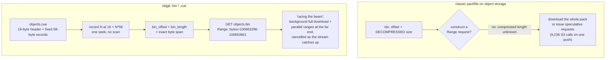

<!--
entry-meta
date: 2026-09-18
type: daily-diff
category: Daily Diff
title: Daily Diff — 2026-09-18
slug: sqlite-btree-page-header-cell-layouts
edition: 2026-09-15 (no newer edition published)
-->

# Daily Diff — 2026-09-18

**2026-09-18 · Daily Diff Digest**

> **Edition note — read this first.** tdd.cat has published **no new edition since the last digest**.
> - The front page still shows **Edition 053, Tuesday 2026-09-15** (92 stories).
> - The [archive](https://tdd.cat/archive/) confirms 053 is the most recent of 53 editions. There is no 09-16, 09-17, or 09-18 edition.
> - The [2026-09-17 digest](../2026-09-17-sqlite-varints-serial-types-record-format/daily-diff.md) already covered edition 053 and went deep on RonDB.
>
> Rather than emit an empty document or re-run yesterday's analysis, this digest takes a **second pass over edition 053** and goes deep on an item the previous digest listed but did not analyse: **Tigris's columnar Git packfile format**. It was picked because it is the closest thing in the edition to today's lesson — a hand-rolled on-disk container format, and specifically one whose central design decision is the exact opposite of SQLite's. Nothing below is invented; no new items have appeared.

## What Changed Since the Last Digest

- **Nothing.** Edition count is unchanged at 53, and the newest edition is unchanged at 2026-09-15.
- The next digest should check for edition 054 and, if present, cover it normally.

## Items From Edition 053 Not Yet Analysed

The previous digest enumerated the edition in full. The database- and storage-adjacent items it listed but did not go into:

- **Tigris: remaking Git packfiles for object storage** — *deep dive below.*
- **GEFS**, the Plan 9 crash-safe snapshotting filesystem, in early-preview port to OpenBSD.
- **A VLDB vol. 19 paper on GPU DBMS kernel fusion** (p4658) — runtime CUDA kernel compilation and fusion. The previous digest noted its summariser could not parse the PDF; that is still the case, so it remains undescribed here rather than guessed at.
- **Namespace: instant container image loading** via boot-time mounting with lazy fetch.
- **A NEON backend making gearhash ~2× faster on ARM64.**
- **An HN thread on serializing runtime state vs. memory-mapping it** — directly relevant to the mmap discussion coming in Lesson 31.

## Deep Dive: objgit — What Breaks When a Packfile Meets Object Storage

**Source:** [Remaking Git packfiles enables object storage integration](https://www.tigrisdata.com/blog/objgit-packfiles/) (Tigris).

### The problem is one missing field

Git packfiles were, in the author's words, "designed for mmap and local disk." The cost model they assume is a filesystem seek — "10 nanoseconds *at most*." On object storage every access is an HTTP request, "10 milliseconds *at minimum*": roughly a **million times** slower.

That difference alone would be survivable if you could fetch *one object* out of a packfile. You cannot, and the reason is precise:

> "you know the *decompressed* size of a single object in the packfile, but not the *compressed* size. This means you don't have enough information to construct a HTTP Range request."

The pack index stores each object's **offset** and its **decompressed** size. To issue `Range: bytes=start-end` you need the **compressed** length, and it is nowhere in the format. So a client either downloads the whole packfile or issues a cascade of small speculative requests. The reported blast radius: a single push on a monorepo cost **9,236 S3 requests**.

### The fix: store the length

objgit replaces the packfile with a `.bin` / `.cue` pair, named after CD cue sheets:

- **`objects.bin`** — objects stored back to back, capped at **128 MiB** per file.
- **`objects.cue`** — a fixed-width index: a 16-byte header (`"OGCU"`, u16 version, u16 record size, u64 record count) followed by **58-byte records**:

| Offset | Size | Field |
|---|---|---|
| 0 | 20 | SHA-1 hash |
| 20 | 1 | object type |
| 21 | 1 | compression codec (zstd) |
| 22 | 8 | `bin_offset` — position in `objects.bin` |
| 30 | 4 | **`bin_length` — compressed size** |
| 34 | 4 | `size` — decompressed size |
| 38 | 20 | `delta_base` |

Because records are fixed width, **record N lives at `16 + N*58`** — one seek, no scan. And because `bin_length` exists, a read becomes a single precise range request: the post shows fetching a 366-byte object as `Range: bytes=100663296-100663661`.

### "Racing the beam"

The read strategy is the part worth stealing. Rather than choosing between *stream the whole file* and *issue range requests*, objgit does both:

1. Start downloading the entire packfile in the background immediately.
2. In parallel, issue Range requests for objects near the **far end** of the file, which the sequential download will not reach for a while.
3. **Cancel** each range request as the background download passes its offset.
4. Net effect: objects arrive just in time, and the range requests only pay for the part of the file the stream has not yet covered.

The post illustrates four simultaneous range requests at 16, 40, 77 and 107 MiB while the full file streams.

### Results

| Repository | Op | Packfile | Columnar | Speedup |
|---|---|---|---|---|
| objgit | push | 8.7 s | 2.2 s | 4.0× |
| Xe/x monorepo | push | 3 m 29.4 s | 14.3 s | **14.6×** |
| tigris-blog | push | 2 m 13.4 s | 26.5 s | 5.0× |
| objgit | clone | 11.8 s | 2.6 s | 4.5× |
| Xe/x | clone | 3 m 23.5 s | 54.4 s | 3.7× |
| tigris-blog | clone | 2 m 23.6 s | 1 m 22 s | 1.8× |

API calls, which is the number that actually explains the latency:

- objgit push: **231 → 18** requests (−92%)
- Xe/x push: **9,236 → 30** requests (−99.7%)
- tigris-blog push: **3,324 → 136** requests (−96%)

Tested on a Mac over Wi-Fi with Go 1.26.5 and Git 2.55.0 — deliberately poor conditions.

### Why this pairs with today's lesson

Today's SQLite lesson is about a page format that makes exactly the **opposite** tradeoff, for exactly the right reasons:

| | SQLite record/page | objgit `.cue` |
|---|---|---|
| Index entries | **variable width** (serial-type varints) | **fixed 58 bytes** |
| Locating item N | prefix sums — must parse 0..N−1 | `16 + N*58`, one seek |
| Per-item length stored? | **no**, implied by serial type | **yes**, `bin_length` |
| Random access | none | direct |
| Optimised for | bytes on disk, local access | round trips over a network |

Lesson 02's *Where This Breaks Down* made the SQLite side of this explicit: "There is no random access to a column. Body offsets are prefix sums of the types before them." SQLite can afford that because its access is `mmap`/`pread` on local storage and its scarce resource is **space**. objgit cannot, because its scarce resource is **round trips**, and it buys random access by spending 58 fixed bytes per object.

Today's lesson shows SQLite hedging in the same direction *once*, and it is instructive: the **cell pointer array** is a fixed-width 2-byte-per-cell index precisely so that binary search within a page needs no scan. SQLite is variable-width where it reads sequentially (inside a record) and fixed-width where it must seek (across cells on a page). objgit's `.cue` is the same instinct applied at a layer where every seek costs 10 ms.

### Caveats

- The format is explicitly experimental: no auth, authz, rate limiting, or API endpoints yet.
- **Packfiles accumulate with no compaction**, which is the part most likely to bite in production — the benchmark repos are small enough that this never surfaces.
- Objects over 128 MiB are unsupported; Git LFS integration is planned.
- The benchmark environment (one Mac, Wi-Fi) was chosen to flatter a round-trip-reduction story. The API-call reduction is the durable result; the wall-clock multipliers are environment-specific.

## Sources

- [The Daily Diff: front page (still showing edition 053, 2026-09-15)](https://tdd.cat/)
- [The Daily Diff: archive (confirms 053 is the newest of 53 editions)](https://tdd.cat/archive/)
- [The Daily Diff: 2026-09-15 edition](https://tdd.cat/2026-09-15/)
- [Tigris: Remaking Git packfiles enables object storage integration](https://www.tigrisdata.com/blog/objgit-packfiles/)
