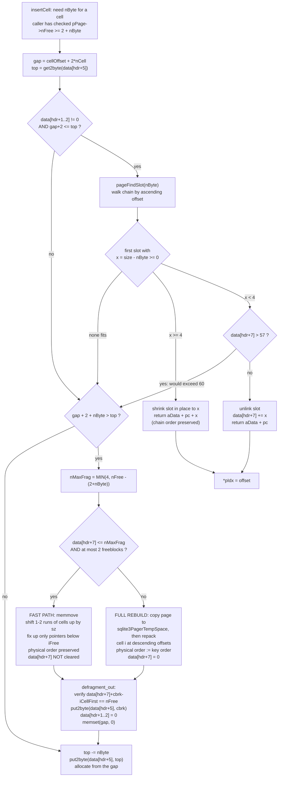

<!--
entry-meta
date: 2026-09-19
type: lesson
track: SQLite
lesson: 04
category: Database Internals
title: In-Page Space Management — freeSpace(), pageFindSlot(), and defragmentPage()
slug: sqlite-page-space-allocator-defragmentation
-->

# In-Page Space Management — `freeSpace()`, `pageFindSlot()`, and `defragmentPage()`

**2026-09-19 · SQLite Track · Lesson 04 of 32**

## Where This Fits

- **Previous lesson:** [Lesson 03](../2026-09-18-sqlite-btree-page-header-cell-layouts/README.md) established the page as a downward-growing cell pointer array over an upward-growing cell heap, decoded all six header fields, and showed `btreeComputeFreeSpace()` computing the identity `nFree = gap + frag + Σ freeblocks`. It *observed* coalescing and 1–3 byte fragments but explicitly deferred the code that produces them. [Lesson 01](../2026-09-16-sqlite-file-header-page1-bootstrap/README.md) fixed `usableSize = 4096` and the local-payload constants used throughout.
- **This lesson:** the four routines that are the only things allowed to move the `freeblock` (offset 1), `cellContent` (offset 5) and `frag` (offset 7) fields — `freeSpace()`, `pageFindSlot()`, `allocateSpace()`, `defragmentPage()` — plus their callers `dropCell()`, `insertCell()` and `pageFreeArray()`. This is the byte-level allocator inside one page.
- **Next:** Lesson 05 takes the `nLocal < nPayload` case from Lesson 03 §6 and follows the overflow chain. **Lesson 06 covers a different allocator that shares the word "freelist"** — the database-file freelist of *whole pages* (`allocateBtreePage()` / `freePage2()`). Today's freelist never leaves one page. Lesson 11 covers `balance()`, which drives `pageFreeArray()` and the one call site that forces a full defragmentation.

Source references are to `sqlite/sqlite` at commit **`4ebc786`**, the same commit as Lessons 01–03. Every number below was measured this run against SQLite **3.45.1** (Python 3.11's bundled library), page size 4096, `reserved = 0`, so `usableSize = 4096`.

---

## 1. Two Allocators, One Word

`btree.c` has two independent allocators and both call their data structure a freelist. Keeping them apart now avoids a lesson's worth of confusion later:

| | **In-page freeblock chain** (today) | **Database freelist** (Lesson 06) |
|---|---|---|
| Unit | bytes inside one page | whole pages inside the file |
| Head | 2-byte field at `hdrOffset+1` | 4-byte field at `page1[32]` |
| Chain node | 4-byte freeblock header in the page body | trunk page holding an array of leaf page numbers |
| Freed by | `freeSpace()` | `freePage2()` |
| Allocated by | `pageFindSlot()` / `allocateSpace()` | `allocateBtreePage()` |
| Compaction | `defragmentPage()` | `VACUUM` / auto-vacuum |
| Visible as | `dbstat.unused`, header offset 1/7 | `PRAGMA freelist_count` |

`PRAGMA freelist_count` — "Return the number of unused pages in the database file" — says nothing about today's subject. A page can be 25% wasted internally with `freelist_count = 0`.

## 2. `freeSpace()`: Insert Into an Ascending Chain, Coalesce Both Ways

Lesson 03 established that the chain is sorted by ascending offset and that `btreeComputeFreeSpace()` enforces it. `freeSpace(pPage, iStart, iSize)` is the routine that maintains that invariant. It walks to the insertion point, then makes up to **three** decisions.

### 2.1 Find the insertion point

```c
iPtr = hdr + 1;
if( data[iPtr+1]==0 && data[iPtr]==0 ){
  iFreeBlk = 0;  /* Shortcut for the case when the freelist is empty */
}else{
  while( (iFreeBlk = get2byte(&data[iPtr]))<iStart ){
    if( iFreeBlk<=iPtr ){
      if( iFreeBlk==0 ) break;        /* TH3: corrupt082.100 */
      return SQLITE_CORRUPT_PAGE(pPage);
    }
    iPtr = iFreeBlk;
  }
  ...
```

- `iPtr` ends up holding **the address of the pointer to** `iFreeBlk`, which is either `hdr+1` (the header field) or a preceding freeblock's own next-pointer. That distinction drives everything below.
- The empty-chain shortcut reads the two bytes individually rather than calling `get2byte()`. The same trick appears in `allocateSpace()`.
- `iFreeBlk <= iPtr` is the non-ascending check. The `iFreeBlk==0` escape is annotated with the TH3 test case that needs it.

### 2.2 Coalesce forward, then backward

```c
/* forward: absorb the next freeblock if it is adjacent (or ≤3 bytes away) */
if( iFreeBlk && iEnd+3>=iFreeBlk ){
  nFrag = iFreeBlk - iEnd;
  if( iEnd>iFreeBlk ) return SQLITE_CORRUPT_PAGE(pPage);
  iEnd = iFreeBlk + get2byte(&data[iFreeBlk+2]);
  ...
  iSize = iEnd - iStart;
  iFreeBlk = get2byte(&data[iFreeBlk]);
}
/* backward: only if iPtr is a real freeblock, not the header field */
if( iPtr>hdr+1 ){
  int iPtrEnd = iPtr + get2byte(&data[iPtr+2]);
  if( iPtrEnd+3>=iStart ){
    if( iPtrEnd>iStart ) return SQLITE_CORRUPT_PAGE(pPage);
    nFrag += iStart - iPtrEnd;
    iSize = iEnd - iPtr;
    iStart = iPtr;
  }
}
if( nFrag>data[hdr+7] ) return SQLITE_CORRUPT_PAGE(pPage);
data[hdr+7] -= (u8)nFrag;
```

Two things here are easy to miss and both matter:

- **The adjacency test is `+3`, not exact adjacency.** `iEnd+3 >= iFreeBlk` means a gap of **1, 2 or 3 bytes** between the new hole and the next freeblock is swallowed into the merged block. Those bytes are exactly the fragments of Lesson 03 §7.
- **So freeing space can *reduce* `frag`.** `nFrag` is the number of fragment bytes absorbed, and `data[hdr+7] -= nFrag` gives them back. Fragmentation in SQLite is not monotonic — it is a byte count that a well-placed delete can pay down. The `nFrag > data[hdr+7]` check is the corruption guard: you cannot reclaim more fragments than the page admits to having.

### 2.3 The third decision: extend the content area instead

```c
x = get2byte(&data[hdr+5]);         /* start of cell content area */
if( iStart<=x ){
  if( iStart<x )      return SQLITE_CORRUPT_PAGE(pPage);
  if( iPtr!=hdr+1 )   return SQLITE_CORRUPT_PAGE(pPage);
  put2byte(&data[hdr+1], iFreeBlk);
  put2byte(&data[hdr+5], iEnd);     /* just move the content boundary up */
}else{
  put2byte(&data[iPtr], iStart);    /* link the new freeblock in */
  put2byte(&data[iStart], iFreeBlk);
  put2byte(&data[iStart+2], (u16)iSize);
}
pPage->nFree += iOrigSize;
```

If the freed cell sits **exactly at the content-area boundary**, no freeblock is created at all — the boundary simply moves up and the space rejoins the unallocated gap. Note also that `nFree` is incremented by `iOrigSize`, the size of *this* cell, not the coalesced block: the absorbed bytes were already counted.

**Measured.** 20 rows, `L=45` so every cell is 50 bytes; rowid *n* lives at offset `4096 − 50n`, so rowid 20 is the cell at the content boundary (3096) and rowid 1 is the highest (4046).

| operation | `cellContent` | freeblock chain | `nFree` |
|---|---|---|---|
| — (20 rows) | 3196 | `[]` | 3148 |
| `DELETE a=20` (at the boundary) | **3241** | **`[]`** | 3195 |
| `DELETE a=19` (one above) | 3196 | `[(3241, 0, 45)]` | 3195 |
| `DELETE a=1` (the top cell) | 3196 | `[(4051, 0, 45)]` | 3195 |

`nFree` is 3195 in all three cases — `3148 + 45 + 2`, the cell plus its pointer. What differs is *where the bytes live*: boundary deletes produce contiguous gap, interior deletes produce a freeblock.

**And forward coalescing, measured:**

| deletes | chain | blocks |
|---|---|---|
| `3` | `[(3961, 0, 45)]` | 1 × 45 |
| `3,4` | `[(3916, 0, 90)]` | 1 × **90** |
| `3,4,5` | `[(3871, 0, 135)]` | 1 × **135** |
| `3,5` | `[(3871, 3961, 45), (3961, 0, 45)]` | 2 × 45 |
| `3,4,9,15` | `[(3421, 3691, 45), (3691, 3916, 45), (3916, 0, 90)]` | 45, 45, 90 |

Adjacent holes merge; non-adjacent ones do not. The chain is ascending in every case, as `btreeComputeFreeSpace()` demands.

### 2.4 `dropCell()`: the caller, and the empty-page reset

`dropCell()` is the only thing that calls `freeSpace()` outside of balancing. Its tail is the interesting part:

```c
rc = freeSpace(pPage, pc, sz);
...
pPage->nCell--;
if( pPage->nCell==0 ){
  memset(&data[hdr+1], 0, 4);        /* freeblock = 0, nCell = 0 */
  data[hdr+7] = 0;                   /* frag = 0 */
  put2byte(&data[hdr+5], pPage->pBt->usableSize);
  pPage->nFree = pPage->pBt->usableSize - pPage->hdrOffset
                     - pPage->childPtrSize - 8;
}else{
  memmove(ptr, ptr+2, 2*(pPage->nCell - idx));
  put2byte(&data[hdr+3], pPage->nCell);
  pPage->nFree += 2;                 /* the recovered cell pointer */
}
```

Emptying a page does not leave a 4088-byte freeblock — it **resets the header to pristine**, which is why a repeatedly-emptied page never carries fragmentation forward.

**Measured**, deleting from the top rowid downward (which walks the content boundary up, hitting §2.3 every time):

| rows left | `nCell` | `cellContent` | freeblock | `frag` | `nFree` |
|---|---|---|---|---|---|
| 5 | 5 | 3846 | 0 | 0 | 3828 |
| 2 | 2 | 3996 | 0 | 0 | 3984 |
| 1 | 1 | 4046 | 0 | 0 | 4036 |
| **0** | 0 | **4096** | 0 | 0 | **4088** |

4088 is exactly `usableSize − 0 − 0 − 8`. And **not one freeblock was created across 20 deletes**, because ascending-rowid deletion coalesces forward and then repeatedly trips the content-boundary branch. *Deleting a page's rows in key order is free; deleting them from the middle is not.*

### 2.5 `secure_delete` lives here

```c
if( pPage->pBt->btsFlags & BTS_FAST_SECURE ){
  memset(&data[iStart], 0, iSize);
}
```

The memset happens **before** the 4-byte freeblock header is written, so the header survives on top of the zeroed hole. Measured, on rows whose text begins `SECRET`:

| `PRAGMA secure_delete` | first 16 bytes of the freed hole | `SECRET` recoverable? | nonzero bytes after the header |
|---|---|---|---|
| `0` (default) | `00 00 00 32 67 53 45 43 52 45 54 78 78 78 78 78` | **yes** | 46 |
| `1` | `00 00 00 32 00 00 00 00 00 00 00 00 00 00 00 00` | no | **0** |

`00 00` is the next-pointer and `00 32` is the size (50). The docs are precise about the limit of the `FAST` setting: it "has the effect of purging all old content from b-tree pages, but leaving forensic traces on freelist pages."

## 3. `pageFindSlot()`: First Fit, Allocated From the Block's *End*

This is the allocator. It is 57 lines and every one of them is load-bearing.

```c
while( pc<=maxPC ){                       /* maxPC = usableSize - nByte */
  size = get2byte(&aData[pc+2]);
  if( (x = size - nByte)>=0 ){
    if( x<4 ){
      if( aData[hdr+7]>57 ) return 0;     /* refuse: would exceed 60 */
      memcpy(&aData[iAddr], &aData[pc], 2);   /* unlink the slot */
      aData[hdr+7] += (u8)x;                  /* 0..3 bytes become fragment */
      return &aData[pc];
    }else if( x+pc > maxPC ){
      *pRc = SQLITE_CORRUPT_PAGE(pPg); return 0;
    }else{
      put2byte(&aData[pc+2], x);          /* shrink the slot in place */
    }
    return &aData[pc + x];                /* allocate from the TOP of the slot */
  }
  iAddr = pc; pc = get2byte(&aData[pc]);
  if( pc<=iAddr ){ if( pc ) *pRc = SQLITE_CORRUPT_PAGE(pPg); return 0; }
}
```

Four properties, all of them consequences rather than stated policy:

1. **First fit by ascending offset.** The loop takes the *first* slot with `size >= nByte`. Since the chain is offset-ordered, that is the lowest-addressed slot that fits — not the smallest, not the best.
2. **A split allocates from the slot's high end.** `put2byte(&aData[pc+2], x)` keeps the block at `pc` and shrinks it to the remainder `x`; the returned pointer is `pc + x`. The freeblock's *offset never changes*, so the chain stays sorted with no relinking.
3. **`x < 4` is the whole fragment story.** A remainder of 0, 1, 2 or 3 bytes cannot become a freeblock (minimum 4), so the slot is unlinked and the remainder is added to the offset-7 counter. `x == 0` — an exact fit — goes down this path too, adding zero.
4. **`x == 4` is the boundary**, and a 4-byte freeblock is legal and kept.

### 3.1 Measured: five requests against known chains

20 rows of 50-byte cells. Holes are made by deleting known rowids; then one row is inserted with a cell of a chosen size.

| # | chain before | request | placed at | chain after | `frag` |
|---|---|---|---|---|---|
| D1 | `[(3296,→3846,100), (3846,0,50)]` | 48 | **3348** | `[(3296,→3846,**52**), (3846,0,50)]` | 0 |
| D2 | `[(3296,→3846,100), (3846,0,50)]` | **100** | 3296 | `[(3846,0,50)]` | 0 |
| D3 | `[(3346,→3796,50), (3796,0,100)]` | 48 | 3346 | `[(3796,0,100)]` | **2** |
| D4 | `[(3346,0,50)]` | 47 | 3346 | `[]` | **3** |
| D5 | `[(3346,0,50)]` | 46 | **3350** | `[(3346,0,**4**)]` | 0 |

- **D1 vs D3 is the first-fit proof.** Identical request (48 bytes), identical set of holes (one 100, one 50) — only the *order* differs. D1 takes the 100-byte head and splits it; D3 takes the 50-byte head and burns 2 bytes as fragment while leaving a 100-byte block untouched. A best-fit allocator would have made the same choice in both cases. SQLite's choice depends on physical address.
- **D1 confirms allocation from the block's end:** `3296 + 52 = 3348`, and the block keeps its offset with size reduced to 52.
- **D5 confirms the `x == 4` boundary:** a 4-byte freeblock survives, and the cell is placed at `3346 + 4 = 3350`.

### 3.2 The `>57` gate, and how a page gets pinned

The check is `if( aData[hdr+7]>57 ) return 0;` — so `frag` may pass through 57 and land on exactly **60**, matching the spec: "In a well-formed b-tree page, the total number of bytes in fragments may not exceed 60."

**Measured.** 60 rows of 50-byte cells. Each round deletes one row (a 50-byte hole) and inserts a 47-byte cell, so `x = 3` every time:

| round | `frag` | placed at | chain after |
|---|---|---|---|
| 1 | 3 | 3946 | `[]` |
| … | … | … | … |
| 19 | **57** | 2146 | `[]` |
| 20 | **60** | 2046 | `[]` |
| 21 | 60 | **1049 (from the gap)** | `[(1946,0,50)]` |
| 22 | 60 | 1002 (gap) | `[(1846,→1946,50), (1946,0,50)]` |
| 23 | 60 | 955 (gap) | 3 × 50 |
| 24 | 60 | 908 (gap) | 4 × 50 |

Round 20 is the boundary: `57 > 57` is false, so the allocation is allowed and `frag` becomes 60. From round 21 onward `pageFindSlot()` returns 0 on a slot that fits perfectly well, and every allocation comes from the unallocated gap while 50-byte holes pile up unused. **That is not a leak of 3 bytes; it is a page that has stopped reusing its own free space.**

## 4. `allocateSpace()`: A Three-Way Decision

```c
gap = pPage->cellOffset + 2*pPage->nCell;      /* == iCellFirst from Lesson 03 */
top = get2byte(&data[hdr+5]);
if( gap>top ){
  if( top==0 && pPage->pBt->usableSize==65536 ) top = 65536;   /* the 65536 hack */
  else return SQLITE_CORRUPT_PAGE(pPage);
}else if( top>(int)pPage->pBt->usableSize ) return SQLITE_CORRUPT_PAGE(pPage);

/* 1. try the freeblock chain */
if( (data[hdr+2] || data[hdr+1]) && gap+2<=top ){
  u8 *pSpace = pageFindSlot(pPage, nByte, &rc);
  if( pSpace ){ *pIdx = g2 = (int)(pSpace-data);
                return g2<=gap ? SQLITE_CORRUPT_PAGE(pPage) : SQLITE_OK; }
  else if( rc ) return rc;
}

/* 2. not enough contiguous gap? compact. */
if( gap+2+nByte>top ){
  rc = defragmentPage(pPage, MIN(4, pPage->nFree - (2+nByte)));
  if( rc ) return rc;
  top = get2byteNotZero(&data[hdr+5]);
}

/* 3. carve from the gap */
top -= nByte;
put2byte(&data[hdr+5], top);
*pIdx = top;
```

- **`gap+2`, everywhere.** The `+2` is the cell pointer this allocation will also need. The function's own comment: "This routine will avoid using the first two bytes past the cell pointer area since presumably this allocation is being made in order to insert a new cell, so we will also end up needing a new cell pointer."
- **`(data[hdr+2] || data[hdr+1])`** is "is the 2-byte freeblock pointer nonzero", read as two byte loads. Same idiom as `freeSpace()`.
- **`nMaxFrag = MIN(4, pPage->nFree - (2+nByte))`** is the only caller-supplied tolerance `defragmentPage()` ever sees from this path, and it is at most 4. That single fact decides which of the two defragmentation paths runs (§5).
- **The freelist is tried before defragmentation**, and defragmentation is tried only when the *contiguous* gap is too small. So a page with 900 bytes spread over 19 holes and 28 bytes of gap will defragment; the same page with 200 bytes of gap will not.



## 5. `defragmentPage()`: Two Paths That Are Not Equivalent

The function takes `nMaxFrag` — "the maximum amount of fragmented space that may be present in the page after this routine returns" — and branches on it immediately.

### 5.1 The fast path: `memmove`, at most two freeblocks

```c
if( (int)data[hdr+7]<=nMaxFrag ){
  int iFree = get2byte(&data[hdr+1]);
  if( iFree ){
    int iFree2 = get2byte(&data[iFree]);
    if( 0==iFree2 || (data[iFree2]==0 && data[iFree2+1]==0) ){
      ...
      if( iFree2 ){
        memmove(&data[iFree+sz+sz2], &data[iFree+sz], iFree2-(iFree+sz));
        sz += sz2;
      }
      cbrk = top+sz;
      memmove(&data[cbrk], &data[top], iFree-top);
      for(pAddr=&data[cellOffset]; pAddr<pEnd; pAddr+=2){
        pc = get2byte(pAddr);
        if( pc<iFree )       { put2byte(pAddr, pc+sz);  }
        else if( pc<iFree2 ) { put2byte(pAddr, pc+sz2); }
      }
      goto defragment_out;
```

Conditions, both required: `frag <= nMaxFrag` (so at most 4, given §4) **and** the chain is at most two blocks — `iFree2 == 0`, or `iFree2`'s own next-pointer is zero. Then it shifts one or two runs of cells up by the hole size and adds a constant to the affected pointers. The comment gives the reasoning: "it is faster to move the two (or one) blocks of cells using `memmove()` and add the required offsets to each pointer in the cell-pointer array than it is to reconstruct the entire page."

### 5.2 The slow path: copy the page out, repack in key order

```c
cbrk = usableSize;
temp = sqlite3PagerTempSpace(pPage->pBt->pPager);
memcpy(temp, data, usableSize);              /* the whole page */
src = temp;
for(i=0; i<nCell; i++){
  pAddr = &data[cellOffset + i*2];
  pc = get2byte(pAddr);
  if( pc>iCellLast ) return SQLITE_CORRUPT_PAGE(pPage);
  size = pPage->xCellSize(pPage, &src[pc]);  /* re-parse every cell */
  cbrk -= size;
  ...
  put2byte(pAddr, cbrk);
  memcpy(&data[cbrk], &src[pc], size);
}
data[hdr+7] = 0;
```

The loop walks the pointer array **in index order** and assigns descending offsets. Its side effect is the observable difference between the two paths: **after a full rebuild, physical order is exactly key order.** It also costs a `memcpy` of the entire usable page plus an `xCellSize()` call per cell.

### 5.3 The shared tail

```c
defragment_out:
  if( data[hdr+7]+cbrk-iCellFirst!=pPage->nFree ) return SQLITE_CORRUPT_PAGE(pPage);
  put2byte(&data[hdr+5], cbrk);
  data[hdr+1] = 0;  data[hdr+2] = 0;
  memset(&data[iCellFirst], 0, cbrk-iCellFirst);
```

- The identity check is Lesson 03's `nFree` formula with `Σ freeblocks` now zero — a free self-audit on every compaction.
- The chain head is cleared, so **both** paths end with zero freeblocks.
- The gap is zeroed on both paths. Note `data[hdr+7] = 0` is **only** in the slow path; the fast path `goto`s straight past it.

### 5.4 Measured: the paths are distinguishable from the bytes

Setup: 84 rows of 45-byte cells, then rowid **120** (the largest key) is inserted into the hole left by rowid 3 (a high offset, exact fit) — so physical order and key order disagree by exactly one inversion before any defragmentation. Then holes are made and an oversized cell requested.

| # | blocks before | `frag` before | request | `iCellFirst+2+nByte` vs `top` | predicted path | physical == key order after | `frag` after |
|---|---|---|---|---|---|---|---|
| F1 | 4 × 45 | 0 | 250 | 420 > 316 | full rebuild | **yes (0 inversions)** | 0 |
| F2 | 2 × 45 | 0 | 150 | 324 > 316 | fast memmove | **no (1 inversion)** | 0 |
| F3 | 1 × 45 | 0 | 150 | 326 > 316 | fast memmove | **no (1 inversion)** | 0 |
| H1 | 1 × 45 | **3** | 150 | 326 > 316 | fast memmove | no | **3 (preserved)** |
| H2 | 3 × 45 | **3** | 250 | 420 > 316 | full rebuild | yes | **0 (cleared)** |

Two independent signals agree with the code:

- **F1 vs F2/F3:** the inversion survives the fast path and is erased by the full rebuild, because only the rebuild reassigns offsets in index order.
- **H1 vs H2:** `frag = 3` survives the fast path and is cleared by the rebuild, because `data[hdr+7] = 0` is inside the slow path only.

The arithmetic checks out to the byte in every case:

| # | path arithmetic | predicted `cellContent` after the insert | measured |
|---|---|---|---|
| F3 | `cbrk = top + sz = 316 + 45 = 361`, then `top -= 150` | 211 | **211** |
| F2 | `cbrk = 316 + (45+45) = 406`, then `− 150` | 256 | **256** |
| F1 | `cbrk = 4096 − 80·45 = 496`, then `− 250` | 246 | **246** |

And the gap is zeroed on both paths: nonzero bytes in the gap went `2 → 0` (H1) and `6 → 0` (H2).

### 5.5 One call site forces the slow path

```c
/* It is critical that the child page be defragmented before being
** copied into the parent, because if the parent is page 1 then it will
** by smaller than the child due to the database header, and so all the
** free space needs to be up front. */
rc = defragmentPage(apNew[0], -1);
```

`nMaxFrag = -1` can never satisfy `(int)data[hdr+7] <= -1`, so this guarantees the full rebuild. That is deliberate: `balance()` is about to memcpy this page's body into a page whose header is 100 bytes longer, so every free byte must already be in one leading run. This is the only `defragmentPage()` caller other than `allocateSpace()`.

## 6. The Bulk Path: `pageFreeArray()` and Its 10-Slot Coalescer

`balance()` does not call `dropCell()` per cell. `pageFreeArray()` frees a run of cells and does its **own** coalescing first, in a fixed-size buffer:

```c
int aOfst[10];
int aAfter[10];
...
for(j=0; j<nFree; j++){
  if( aOfst[j]==iAfter ){ aOfst[j] = iOfst; break; }     /* extend downward */
  else if( aAfter[j]==iOfst ){ aAfter[j] = iAfter; break; } /* extend upward */
}
if( j>=nFree ){
  if( nFree>=(int)(sizeof(aOfst)/sizeof(aOfst[0])) ){
    for(j=0; j<nFree; j++) freeSpace(pPg, aOfst[j], aAfter[j]-aOfst[j]);
    nFree = 0;                                            /* flush and restart */
  }
  ...
}
```

It accumulates up to **10** disjoint byte ranges, merging each new cell into an existing range when they touch, and only then calls `freeSpace()` once per range. Ten is a hard limit: the eleventh disjoint range flushes all ten and starts over, which discards the chance to merge anything already flushed with what comes next.

## 7. Putting It Together: Saturation, Then Self-Healing

The `>57` gate and the `nMaxFrag ≤ 4` tolerance interact in a way neither is obviously designed for. A page with `frag = 60` refuses every near-fit allocation (§3.2), so it drains its gap instead — and once the gap is gone, `frag = 60 > nMaxFrag ≤ 4` forces the **full rebuild**, which is the only path that resets `frag`. The pathology is real but bounded.

**Measured end to end.** 60 rows of 50-byte cells driven to `frag = 60` as in §3.2, then churned: every operation deletes one 50-byte cell and inserts one 47-byte cell.

| op | `frag` | freeblocks | bytes in holes | gap | `cellContent` |
|---|---|---|---|---|---|
| 1 | 60 | 1 | 50 | 921 | 1049 |
| 5 | 60 | 5 | 250 | 733 | 861 |
| 10 | 60 | 10 | 500 | 498 | 626 |
| 15 | 60 | 15 | 750 | 263 | 391 |
| 19 | 60 | 19 | 950 | 75 | 203 |
| 20 | 60 | 20 | **1000** | **28** | 156 |
| **21** | **0** | **0** | **0** | **1091** | 1219 |

For twenty consecutive operations the page holds a **kilobyte** of perfectly-sized holes — the request is 47 bytes and every hole is 50 — and allocates from the gap instead, because 3 wasted bytes would push `frag` past 60. On operation 21 the gap can no longer satisfy the request, `defragmentPage()` runs, takes the full-rebuild path, and every byte is reclaimed into one contiguous run.

`VACUUM` does the same thing deliberately. On a page saturated the same way:

```
saturated:     frag=60  blocks=1  holeBytes=50  gap=921  nFree=1031
dbstat page 2: payload=2817  unused=1031
after VACUUM:  frag=0   blocks=0  holeBytes=0   gap=1031 nFree=1031
```

`nFree` is **identical** at 1031 before and after. `VACUUM` freed nothing; it made the same 1031 bytes *contiguous* — and `dbstat.unused` reports that same 1031 either way, which is exactly why `unused` is not a fragmentation metric.

## Hands-On

Needs only `python3`. Part 1 builds the page parser; parts 2–4 are the three discriminating experiments.

```bash
mkdir -p ~/sqlite-lab && cd ~/sqlite-lab
cat > pg.py <<'PY'
import struct
def getvarint(b, i):
    v = 0
    for k in range(8):
        x = b[i+k]; v = (v << 7) | (x & 0x7f)
        if x < 0x80: return v, k+1
    return (v << 8) | b[i+8], 9
class DB:
    def __init__(self, path):
        self.raw = open(path,'rb').read()
        self.ps = ((self.raw[16]<<8) | (self.raw[17]<<16)) or 65536
        self.usable = self.ps - self.raw[20]
    def page(self, n): return self.raw[(n-1)*self.ps : n*self.ps]
def hdr(db, pgno=2):
    pg = db.page(pgno); h = 100 if pgno == 1 else 0
    t = pg[h]
    if t not in (0x02,0x05,0x0a,0x0d): return None
    leaf = t in (0x0a,0x0d)
    d = dict(type=t, leaf=leaf, freeblock=struct.unpack('>H',pg[h+1:h+3])[0],
             nCell=struct.unpack('>H',pg[h+3:h+5])[0], frag=pg[h+7])
    d['cellContent'] = struct.unpack('>H',pg[h+5:h+7])[0] or 65536
    d['cellOffset']  = h + (8 if leaf else 12)
    d['iCellFirst']  = h + 8 + (0 if leaf else 4) + 2*d['nCell']
    d['ptrs'] = [struct.unpack('>H',pg[d['cellOffset']+2*i:d['cellOffset']+2*i+2])[0]
                 for i in range(d['nCell'])]
    nFree = d['frag'] + d['cellContent']; chain=[]; pc=d['freeblock']
    while pc > 0:                              # exactly btreeComputeFreeSpace()
        nxt  = struct.unpack('>H',pg[pc:pc+2])[0]
        size = struct.unpack('>H',pg[pc+2:pc+4])[0]
        chain.append((pc,nxt,size)); nFree += size
        if nxt < pc + size + 4: break
        pc = nxt
    d['freeChain']=chain; d['holeBytes']=sum(s for _,_,s in chain)
    d['nFree']=nFree-d['iCellFirst']; d['gap']=d['cellContent']-d['iCellFirst']
    assert d['nFree'] == d['gap'] + d['frag'] + d['holeBytes']
    return d
def cells(db, pgno=2):
    """(offset, size, rowid) in KEY order, for a table-leaf page."""
    d = hdr(db,pgno); pg = db.page(pgno); out=[]
    for off in d['ptrs']:
        p = off
        npay,n = getvarint(pg,p); p += n
        rid,n  = getvarint(pg,p); p += n
        out.append((off, max((p-off)+npay,4), rid))
    return out
PY
cat > mk.py <<'PY'
import sqlite3, os
from pg import DB, cells
def build(name, rows, L, ps=4096):
    if os.path.exists(name): os.remove(name)
    c = sqlite3.connect(name, isolation_level=None)
    c.execute(f"PRAGMA page_size={ps}")
    c.execute("CREATE TABLE t(a INTEGER PRIMARY KEY, b TEXT)")
    c.executemany("INSERT INTO t VALUES(?,?)", [(i,'x'*L) for i in rows])
    return c
def L_for_cell(target):
    """Text length giving exactly `target` bytes of cell (rowid must be <=127)."""
    for L in range(2000):
        if (5+L if L<=57 else (6+L if L<=123 else 7+L)) == target:
            build('_p.db',[1],L).close()
            assert cells(DB('_p.db'))[0][1] == target
            return L
    raise ValueError(f"cell size {target} is unreachable")
PY
```

**Part 2 — first fit, not best fit.** Same request, same two holes, opposite order:

```bash
python3 - <<'PY'
import sqlite3
from pg import DB, hdr, cells
from mk import build, L_for_cell
def run(label, deletes, cell):
    c = build('d.db', range(1,21), 45)                 # every cell is 50 bytes
    for k in deletes: c.execute("DELETE FROM t WHERE a=?", (k,))
    c.close(); before = hdr(DB('d.db'))
    c = sqlite3.connect('d.db', isolation_level=None)
    c.execute("INSERT INTO t VALUES(?,?)", (15,'x'*L_for_cell(cell))); c.close()
    db = DB('d.db'); after = hdr(db)
    at = [o for o,s,r in cells(db) if r==15][0]
    print(f"{label}\n  before {before['freeChain']}\n  request {cell} -> offset {at}"
          f"\n  after  {after['freeChain']}  frag={after['frag']}\n")
run("100-byte hole FIRST, 50-byte hole second", [15,16,5], 48)
run("50-byte hole FIRST, 100-byte hole second", [15,5,6],  48)
run("x==4 boundary: 50-byte hole, request 46",  [15],      46)
PY
```

**What to look for:** the two 48-byte requests land in *different-sized* holes purely because the chain order differs — that is first fit, and it is the single most consequential property of this allocator. In the first case the placed offset is `3296+52 = 3348`, i.e. the high end of the block, and the block keeps offset 3296 with size 52. In the third, a **4-byte freeblock survives** and the cell sits at `3346+4`.

**Part 3 — drive `frag` to 60 and watch the page refuse its own holes.**

```bash
python3 - <<'PY'
import sqlite3
from pg import DB, hdr, cells
from mk import build, L_for_cell
build('e.db', range(1,61), 45).close()
L = L_for_cell(47)
for i in range(1, 25):
    c = sqlite3.connect('e.db', isolation_level=None)
    c.execute("DELETE FROM t WHERE a=?", (2*i+1,))
    c.execute("INSERT INTO t VALUES(?,?)", (60+i,'x'*L)); c.close()
    db = DB('e.db'); d = hdr(db)
    at = [o for o,s,r in cells(db) if r==60+i][0]
    src = 'freelist' if at != d['cellContent'] else 'GAP (freelist refused)'
    print(f"round {i:<3} frag={d['frag']:<4} placed@{at:<6}{src:<24} holes={d['holeBytes']}")
PY
```

**What to look for:** `frag` climbs by 3 per round to exactly **57**, is allowed one more step to **60**, and from then on every allocation says `GAP (freelist refused)` while `holeBytes` grows by 50 each round. The `>57` in `pageFindSlot()` is the only reason a 50-byte hole cannot serve a 47-byte request.

**Part 4 — tell the two defragmentation paths apart.**

```bash
python3 - <<'PY'
import sqlite3
from pg import DB, hdr, cells
from mk import build, L_for_cell
def prep():
    """Scramble physical order: rowid 120 (largest key) goes into rowid 3's hole."""
    c = build('f.db', range(1,85), 40)                  # 45-byte cells
    c.execute("DELETE FROM t WHERE a=3")
    c.execute("INSERT INTO t VALUES(120,?)", ('x'*40,))  # exact fit, x==0
    return c
def run(label, deletes, cell, pre_frag=False):
    c = prep()
    if pre_frag:
        c.execute("DELETE FROM t WHERE a=10")
        c.execute("INSERT INTO t VALUES(121,?)", ('x'*L_for_cell(42),))  # x==3
    for k in deletes: c.execute("DELETE FROM t WHERE a=?", (k,))
    c.close(); b = hdr(DB('f.db'))
    nmf = min(4, b['nFree'] - (2+cell))
    c = sqlite3.connect('f.db', isolation_level=None)
    c.execute("INSERT INTO t VALUES(122,?)", ('x'*L_for_cell(cell),)); c.close()
    db = DB('f.db'); a = hdr(db)
    offs = [o for o,_,_ in cells(db)]
    inv = sum(1 for i in range(len(offs)-1) if offs[i] < offs[i+1])
    print(f"{label}\n  blocks={len(b['freeChain'])} frag={b['frag']} nMaxFrag={nmf} "
          f"| need {b['iCellFirst']+2+cell} > top {b['cellContent']}?"
          f" {b['iCellFirst']+2+cell > b['cellContent']}")
    print(f"  after: frag={a['frag']} inversions={inv}"
          f"  -> {'FULL REBUILD' if inv==0 else 'fast memmove'}\n")
run("F1  four freeblocks", [20,30,40,50], 250)
run("F2  two freeblocks",  [20,40],       150)
run("H1  one freeblock, frag=3 beforehand", [20], 150, pre_frag=True)
run("H2  three freeblocks, frag=3 beforehand", [20,30,40], 250, pre_frag=True)
PY
```

**What to look for, and what it proves:**

1. **`inversions == 0` only for F1 and H2** (3+ freeblocks). The full rebuild reassigns offsets in pointer-array order, so the deliberately out-of-place rowid-120 cell is relocated into key order. With one or two freeblocks the inversion survives — proof the `memmove` branch ran.
2. **`frag` survives H1 and is cleared in H2.** `data[hdr+7] = 0` sits inside the slow path only. Two independent observables, same conclusion.
3. **Predict `cellContent` before running.** Fast path: `top + Σ(freeblock sizes) − nByte`. Slow path: `usableSize − Σ(all cell sizes) − nByte`. Both are exact.

**Stretch — watch a saturated page heal.** Continue Part 3's database, then churn (delete one 50-byte cell, insert one 47-byte cell) and print `frag`, block count and gap each round. The gap drains by 47 per operation while the holes are refused; on the operation where `iCellFirst+2+47` finally exceeds `cellContent`, `frag` snaps to 0 and every hole is reclaimed at once. Predict which operation that is from the starting gap.

## Where This Breaks Down

- **First fit, chosen by physical address, is the allocator's defining weakness.** D1 and D3 issue an identical 48-byte request against an identical pair of holes and get different outcomes — one splits a 100-byte block cleanly, the other burns 2 bytes as permanent fragment and leaves the 100-byte block untouched. Which one you get depends on where in the page the rows happened to be deleted. There is no size-class bucketing, no best fit, no policy at all beyond "lowest address that fits".
- **The 60-byte fragment cap is a cliff, not a soft limit.** Measured: 20 consecutive operations during which a page held up to **1000 bytes** of holes each exactly 3 bytes larger than the request, refused every one, and drained its gap instead. The waste is not the 60 bytes of fragment — it is the unbounded number of allocations that bypass usable free space while the counter is pinned. The page recovers only when the gap runs out.
- **"Defragmented" is doing two different jobs.** The fast path leaves `data[hdr+7]` untouched, so it produces a page with zero freeblocks and non-zero fragments. Only the full rebuild clears the counter. The saving grace is that `nMaxFrag ≤ 4` from `allocateSpace()` means a page with real fragmentation can never take the fast path — but that is an emergent property of two unrelated constants, not a stated invariant.
- **The full rebuild is O(usableSize) plus an `xCellSize()` call per cell**, and it runs inside a single `insertCell()`. `memcpy(temp, data, usableSize)` copies the whole page into shared pager temp space, then writes every cell back. `insertCell()` has no idea whether it is about to cost 50 bytes of `memmove` or a full page rewrite. This is latency that correlates with *deletion history*, not with anything visible in the statement being executed.
- **`nFree` conflates usable and unusable space, and so does `dbstat`.** Measured: `nFree = 1031` and `dbstat.unused = 1031` both before and after a `VACUUM` that eliminated all fragmentation. Neither number distinguishes 1031 contiguous bytes from 1031 bytes the allocator will refuse. There is no exposed counter for "bytes the page cannot use".
- **`pageFreeArray()`'s coalescer is ten entries wide.** Freeing eleven or more disjoint ranges in one balance flushes the buffer mid-run, so ranges that would have merged across the flush boundary become separate freeblocks. Ten is a `sizeof` on a stack array, not a tuned number.
- **Ascending-key deletion is free; interior deletion is not.** Deleting a page's rows in rowid order produced **zero** freeblocks across 20 deletes, because forward coalescing plus the content-boundary branch returns everything to the gap. Deleting from the middle produces a chain. Same rows, same final row count, completely different page state — and no way to express the preference in SQL.
- **`secure_delete` does not cover everything.** The 4-byte freeblock header is written on top of the zeroed hole, and per the docs the `FAST` setting leaves "forensic traces on freelist pages" — the *page*-level freelist of Lesson 06, which this routine never touches.
- **`VACUUM` is the only general fix and it needs "as much as twice the size of the original database file … in free disk space"**, takes a write lock on the whole database, and invalidates every page in the cache. `auto_vacuum` is not a substitute: it "does not compact partially filled pages of the database as VACUUM does" — it is a page-level reclaimer, blind to everything in this lesson.
- **Not verified here.** I did not instrument how often `defragmentPage()` runs, or which path it takes, under a real workload — no counter is exposed, and every path conclusion above is inferred from two observable side effects (fragment preservation and physical reordering) rather than from a trace. I also did not manufacture a page with more than two freeblocks *and* `frag ≤ 4` where the fast path's `iFree2` check is the sole rejecting condition, so that clause is confirmed by reading only. All measurements are the `reserved = 0`, 4096-byte-page case.

## Further Study

- [SQLite User Forum: Defragment a table?](https://sqlite.org/forum/info/7b9ce23cec4d3975) — what SQLite's own developers say about per-table compaction, and why the answer is `VACUUM`.
- [SQLite User Forum: Disk space consumption versus raw data size](https://sqlite.org/forum/info/e087f3791182693f4c60e55951b5cf0bfb451de241485af594e45fda61195211) — where the overhead measured in this lesson shows up as a whole-file number.
- [The sqlite3_analyzer.exe Utility Program](https://sqlite.org/sqlanalyze.html) — the per-b-tree fragmentation and utilisation report, i.e. §7's numbers for a whole database.
- [Optimizing a SQLite Database](https://www.danwatt.org/2017/06/optimizing-a-sqlite-database/) — a worked example of page utilisation driving file size.
- [PRAGMA secure_delete / cell_size_check / freelist_count](https://www.sqlite.org/pragma.html) — the three pragmas that touch this layer, and the exact scope of each.

## Next Steps

1. **Write a page-level fragmentation metric SQLite does not expose:** for every page, report `gap`, `frag`, `holeBytes`, and `largestHole`. Then define *refusable bytes* = holes that `pageFindSlot()` would decline at the page's current `frag`, and run it over a real application database. This is the number §7 shows is missing.
2. **Re-implement `pageFindSlot()` as best fit** in the Python model, replay a recorded delete/insert trace through both, and compare total fragments created and defragmentations triggered. Predict first: best fit should reduce fragments and *increase* the number of tiny unusable blocks.
3. **Find the worst case for the `>57` gate.** Construct a workload that keeps `frag` pinned at 60 for as many operations as possible, and measure the total bytes refused before the gap forces a rebuild. The bound should be roughly `gap / nByte` operations — confirm it.
4. **Determine empirically whether the fast path ever leaves `frag > 4`** in normal operation. `allocateSpace()` caps `nMaxFrag` at 4, and `balance()` passes −1, so the answer should be no for every in-tree caller. Prove it or find the exception.
5. **Instrument `defragmentPage()`** in a local SQLite build with two counters (fast path, slow path) exposed through a test pragma, then rerun §7's churn. That closes the one gap this lesson could only infer.
6. Read `allocateBtreePage()` and `freePage2()` and note **every place the word "freelist" changes meaning**. Keep it for Lesson 06.

## Sources

- [Database File Format (fileformat2): freeblocks, the fragmented-free-bytes field, and the 60-byte limit](https://www.sqlite.org/fileformat2.html) — "A freeblock requires at least 4 bytes of space"; "Freeblocks are always connected in order of increasing offset"; "In a well-formed b-tree page, the total number of bytes in fragments may not exceed 60."
- [SQLite source: src/btree.c](https://raw.githubusercontent.com/sqlite/sqlite/master/src/btree.c) — `defragmentPage()`, `pageFindSlot()`, `allocateSpace()`, `freeSpace()`, `dropCell()`, `insertCell()`, `pageFreeArray()`, and the `defragmentPage(apNew[0], -1)` call in `balance_shallower()`. Line-level reads were at commit `4ebc786` through a code index; the file above confirms the routines and the `if( aData[hdr+7]>57 ) return 0;` line.
- [PRAGMA statements: secure_delete, cell_size_check, freelist_count](https://www.sqlite.org/pragma.html)
- [VACUUM](https://www.sqlite.org/lang_vacuum.html) — the fragmentation wording, the 2× disk requirement, and why `auto_vacuum` is not equivalent.
- [The sqlite3_analyzer.exe Utility Program](https://sqlite.org/sqlanalyze.html)
- [SQLite User Forum: Defragment a table?](https://sqlite.org/forum/info/7b9ce23cec4d3975)

## Takeaways

- **There are two freelists.** Today's is a chain of byte ranges inside one page, headed at `hdrOffset+1`. Lesson 06's is a chain of whole pages headed at `page1[32]`. `PRAGMA freelist_count` reports the second and says nothing about the first.
- **`freeSpace()` coalesces with a ±3-byte tolerance, so fragmentation is reversible.** A delete adjacent to an existing hole swallows the 1–3 byte fragments between them and *decrements* the offset-7 counter.
- **A delete at the content-area boundary creates no freeblock at all** — the boundary just moves. Deleting a page's rows in ascending key order therefore produces zero freeblocks; deleting from the middle produces a chain. Measured, 20 deletes, both ways.
- **`pageFindSlot()` is first fit by ascending offset, splitting from the block's high end so the chain never needs relinking.** Identical requests against identical holes give different results depending on physical order. That is the allocator's whole policy.
- **`frag` is a one-byte counter with a hard gate at `>57`.** Once it reaches 60, every near-fit allocation is refused — measured at 1000 bytes of perfectly-sized holes ignored across 20 operations — until the gap is exhausted and the full rebuild resets it.
- **`defragmentPage()` has two paths that are not interchangeable.** The `memmove` path preserves both physical cell order and the fragment count; the full rebuild repacks cells into key order and zeroes the counter. Both leave zero freeblocks, so only the surviving fragments and the cell order reveal which one ran.
- **`nFree` and `dbstat.unused` measure bytes, not usability.** A `VACUUM` that eliminated all fragmentation left both numbers unchanged at 1031.
