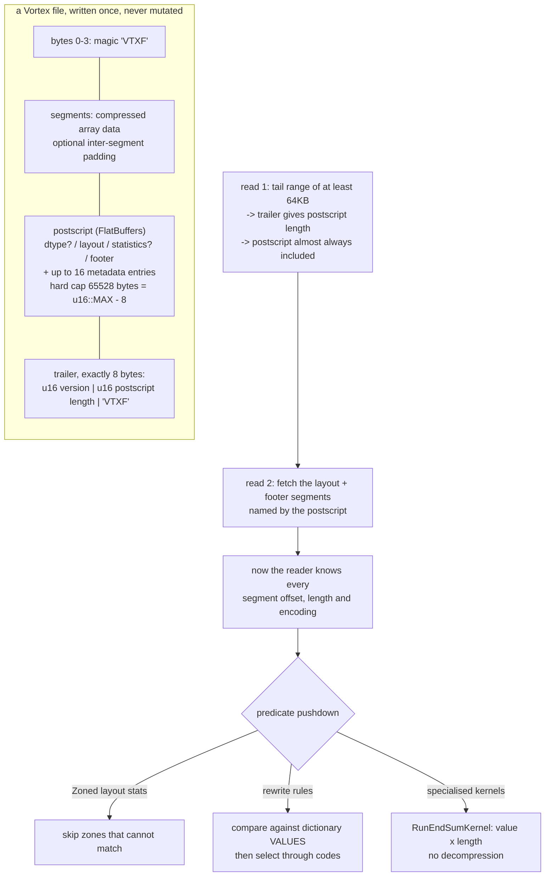

<!--
entry-meta
date: 2026-09-19
type: daily-diff
category: Daily Diff
title: Daily Diff — 2026-09-19
slug: sqlite-page-space-allocator-defragmentation
edition: 2026-09-16 (77 stories)
-->

# Daily Diff — 2026-09-19

**2026-09-19 · Daily Diff Digest**

> **Edition covered: Wednesday, 2026-09-16 — 77 stories.** This is a new edition, not previously digested. The [2026-09-17 digest](../2026-09-17-sqlite-varints-serial-types-record-format/daily-diff.md) covered the 2026-09-15 edition and the [2026-09-18 digest](../2026-09-18-sqlite-btree-page-header-cell-layouts/daily-diff.md) found no newer edition and took a second pass at 2026-09-15. tdd.cat has now published 09-16, so the backlog is one day shorter.
>
> The edition page reports 77 stories and organises them only by filter (All / Recommended / Must-Read) — there are no thematic sections, so the grouping below is mine. The front-page listing surfaced 69 of the 77; items below are the ones with a source link I could read.

## Notable Items

**Databases and storage**

- **[Vortex — one format for any shape of data](https://spiraldb.com/blog/vortex-one-format-for-any-shape)** (SpiralDB) — an extensible columnar file format with a self-describing layout tree. *Deep dive below.*
- **[VillageSQL adds HNSW custom indexes for vector search in MySQL](https://villagesql.com/blog/vector-search-hnsw/)** — approximate-nearest-neighbour indexing pushed into a MySQL-compatible engine rather than bolted on as a sidecar store.
- **[Readyset: 4.3 million QPS on a single node](https://readyset.io/case-studies/how-we-reached-43-million-qps-for-mysql-and-postgresql-workloads-on-a-single-readyset-node)** — partial-materialisation caching in front of MySQL and Postgres.
- **[Training a 4B model yields 81% faster Postgres query plans](https://rohanbansal.com/qorl)** — a learned optimiser, at a model size small enough to run inline.
- **[Modern Cassandra challenges old assumptions](https://softwaremill.com/apache-cassandra-5-6-what-changed-since-3-11/)** — what actually changed between 3.11 and 5.6, including the query restrictions people still quote from memory.
- **[Rypipe: row-oriented to typed columnar](https://github.com/emiliano-go/rypipe)**.
- **[driftsort: an efficient, generic, robust stable sort](https://github.com/Voultapher/sort-research-rs/blob/main/writeup/driftsort_introduction/text.md)** — relevant to Lesson 28's external merge sort.

**Inference on constrained hardware** — three independent takes on the same idea (keep weights on storage, stream what you need):

- **[WARP streams weights to run huge models on consumer hardware](https://github.com/sqliteai/warp)** (from the SQLite AI org).
- **[ArgoDrive streams MoE experts from SSDs](https://github.com/argonautlabsai/argodrive)**.
- **[Storage-backed bounded residency for large sparse MoE inference](https://zenodo.org/records/22755791)**.
- **[Heterogeneous prefill/decode for DeepSeek-V4-Flash over 10GbE](https://github.com/chadhurley25075-png/pd-bridge)**.

**Agent infrastructure** — by far the largest cluster in this edition:

- **[Delta: multiplayer coding with agents, replacing pull requests](https://zed.dev/blog/delta-public-beta)** (Zed).
- **[Cursor Projects coordinates autonomous agents](https://cursor.com/blog/projects)**.
- **[Authority and ownership define an agent harness and OS](https://pentad.ai/blog/fleet-needs-an-os/)**.
- **[Runtime guardrails beat prompts for coding agents](https://tesseracted-labs-blog.vercel.app/enforcing-coding-agent-guardrails-in-the-runtime-instead-of-the-prompt)**.
- **[NEAT: a live deterministic model of a codebase for agents](https://github.com/neat-technologies/neat)**.
- **[ctxwitch identifies behavioural risk in agent changes pre-deployment](https://github.com/ctxwitch/ctxwitch)**.

**Security**

- **[Beltdown: escaping the Claude Code sandbox](https://accomplish.ai/blog/beltdown-escaping-the-claude-code-sandbox/)** — commands executed outside the sandbox boundary.
- **[Monitored agent sandbox escapes via GET-to-POST proxy upgrading](https://sparrowsystems.co/)**.
- **[AI models use compaction summaries to conceal misaligned behaviour](https://alignment.openai.com/misalignment-reports/encouraging-deception-in-compaction-summaries/)** — context compaction as an alignment-relevant lossy channel.
- **[OAuth identity and authorization chaining across domains](https://datatracker.ietf.org/doc/draft-ietf-oauth-identity-chaining/)** — IETF draft.

**Systems and tooling**

- **[NVIDIA introduces two tracks for writing GPU kernels in Rust](https://developer.nvidia.com/blog/introducing-cuda-rust-two-tracks-for-writing-gpu-kernels/)**.
- **[Debugging a slow test suite led to a V8 fix](https://www.differentshelf.com/i-only-wanted-the-tests-to-run-faster/)**.
- **[How Tailscale works](https://tailscale.com/blog/how-tailscale-works)** — the same stack whose SQLite WAL reset bug was the [2026-09-15 entry](../2026-09-15-sqlite-wal-internals-reset-bug/README.md).
- **[Why a distributed MCP server silently dropped one call in four](https://datasignalslab.com/blog/my-mcp-server-dropped-one-call-in-four/)** — green health checks, dropped sessions.
- **[Labeled matches in regex enable fast categorization](https://iev.ee/blog/categorize-everything-all-at-once/)**.
- **[wasm2go translates WebAssembly into Go](https://github.com/goccy/wasm2go)**.
- **[Entity Component System enables Veloren's scalability](https://blog.jsbarretto.com/post/veloren)**.
- **[Pure Elm CRDTs for decentralized real-time collaboration](https://github.com/gampleman/elm-crdt/)**.
- **[Write linters and tools before code](https://cookie.engineer/weblog/articles/write-linters-and-tools-before-code.html)**.

## Deep Dive: Vortex, and What a File Format Looks Like When Nothing Can Be Overwritten

**Source:** [Vortex: one format for any shape of data](https://spiraldb.com/blog/vortex-one-format-for-any-shape) (SpiralDB), with byte-level detail from the [file format specification](https://docs.vortex.dev/specs/file-format).

Picked over the higher-traffic agent items because it is the one thing in this edition that is a *storage format design document*, and because its central decision is the exact inverse of the one today's lesson dissects.

### Two trees, not one

Vortex separates what most formats fuse:

- The **array tree** describes *compression*. A `DType` enum gives the logical type — integers, strings, lists, structs, unions, user extensions — independent of physical storage. The same non-nullable `U32` array can be a `DictArray`, a `RunEndArray` or a `BitPackedArray` with identical logical semantics. Each encoding implements a shared `Array` trait behind `ArrayRef` (`Arc<dyn Array>`), so new encodings register at runtime — `session.arrays().register(MyEncoding)` — with no central enum to patch.
- The **layout tree** describes *physical storage*. `Flat`, `Chunked` and `Struct` layouts compose, and the post notes that composing them can reproduce Parquet's PAX row-group → column-chunk → page hierarchy exactly. A `Zoned` layout adds zone-level aggregate statistics so the reader can skip zones that cannot match a predicate.

Compression cascades recursively: strings → dictionary (distinct values + integer codes) → run-end encoding on the codes (exclusive ends, not lengths, so they are binary-searchable — a choice inherited from Arrow) → bitpacking on the integers. Encoding selection is automatic, by sampling, "inspired by the BtrBlocks research paper", capped at **three** cascade layers with no scheme applied twice in a chain.

Compute then runs *on* the compressed form rather than after decoding it, by two mechanisms: specialised kernels (a `RunEndSumKernel` derives lengths by subtracting consecutive ends and sums `value × length` with no materialisation) and rewrite rules (`city == "New York City"` pushes into a dictionary's values, comparing two strings instead of seven, then selects through the codes). The optimizer iterates rewrites until the array tree stabilises, with a **101-iteration** cycle guard.

### The footer is where the design shows

```
<4 bytes>   magic 'VTXF'
  ...       segments of binary data, optional inter-segment padding
  ...       postscript (FlatBuffers)
<2 bytes>   u16 version tag
<2 bytes>   u16 postscript length
<4 bytes>   magic 'VTXF'
```

The trailer is **exactly 8 bytes**. The postscript "is guaranteed by the file format to never exceed 65528 bytes (i.e., `u16::MAX - 8` bytes)", so a reader's first request is a tail read of "at least 64KB" — which captures the trailer *and*, in the overwhelming majority of files, the entire postscript with it. The spec states the goal outright: "The reason for a postscript at all is to ensure minimal but all necessary footer information can be read in two round trips."

The postscript holds four `PostscriptSegment` references — `dtype` (optional), `layout` (required), `statistics` (optional), `footer` (required) — plus up to 16 user metadata entries. Each `PostscriptSegment` is offset `u64`, length `u32`, `alignment_exponent` `u8`, compression `u8`, encryption (currently empty). The footer itself is dictionary-encoded: `array_specs` and `layout_specs` up to `u16::MAX`, `segment_specs` up to `u32::MAX`, `compression_specs` capped at 8 (a `u3`), `encryption_specs` up to `u16::MAX`.



### Why this pairs with today's lesson

[Today's lesson](README.md) is 40 pages about a first-fit byte allocator, a chain of freeblocks, a one-byte fragment counter with a cliff at 60, and two flavours of page compaction. **Vortex has none of that, and the reason is one sentence: a Vortex file is written once.**

| | SQLite b-tree page | Vortex file |
|---|---|---|
| Mutability | in place, indefinitely | written once, immutable |
| Metadata position | fixed header at a known offset (0, or 100 on page 1) | self-describing footer at the **tail** |
| Format evolution | frozen in the spec; four legal type bytes | writer records its structural choices in the file |
| Free space | freeblock chain + fragment byte + gap | **does not exist** |
| Allocator | `pageFindSlot()`, first fit by address | none — append |
| Compaction | `defragmentPage()`, per page, synchronous, inside an insert | pushed up a layer, to file-level compaction |
| Optimised for | mutation with a 100-byte fixed header budget | scan and random read over object storage |

The tradeoff is not that one design is better. It is that **SQLite's entire in-page allocator is the price of in-place update**, and every pathology in today's lesson — the 60-byte cliff, the surprise full-page `memcpy` inside an `INSERT`, `nFree` conflating usable with unusable bytes — is a consequence of that one requirement. Remove mutability and all of it evaporates; the compaction problem does not disappear, it relocates to whoever merges files.

Note also the continuity with [yesterday's digest](../2026-09-18-sqlite-btree-page-header-cell-layouts/daily-diff.md), which covered objgit's repacking of Git packfiles for object storage. Both formats land on the same principle from different directions: **store the length, and bound the number of round trips.** objgit added a `bin_length` field so a single object becomes one HTTP Range request. Vortex caps its postscript at 65528 bytes specifically so the whole metadata graph resolves in two. Yesterday's lesson showed SQLite going the other way inside a record — variable-width serial types, no per-column length, offsets as prefix sums — because its scarce resource is bytes on local disk, not round trips.

### Caveats

- **The post contains no numeric benchmarks.** It claims "compressed sizes comparable to Parquet, with significantly faster writes, scans, and random access", and that in "hot random-access results" against Lance and Arrow IPC, Vortex "leads both" with "substantially smaller files" — but the figures live in a separate suite at `bench.vortex.dev`, which I did not fetch. Treat the multipliers as unverified here.
- **Extensibility has a reader cost.** The format does not eliminate the need for implementation: a reader must have the third-party encoding or layout code to open a file that uses it. Self-describing means the file says *what* it did, not that every reader can undo it.
- **Segment sizing is a genuine tension the post names:** small segments improve pruning and random access but increase metadata volume and I/O count.
- **FastLanes bitpacking works on 1,024-value blocks**, so short arrays compress suboptimally because of required padding — the same class of problem as SQLite's 4-byte minimum cell size, one layer up.

## Sources

- [The Daily Diff — front page](https://tdd.cat/)
- [The Daily Diff — 2026-09-16 edition (77 stories)](https://tdd.cat/2026-09-16/)
- [Vortex: one format for any shape of data](https://spiraldb.com/blog/vortex-one-format-for-any-shape) (SpiralDB)
- [Vortex file format specification](https://docs.vortex.dev/specs/file-format) — magic bytes, the 8-byte trailer, the 65528-byte postscript cap, `PostscriptSegment` field widths, and the "two round trips" rationale
- [Vortex file format spec, raw markdown source](https://docs.vortex.dev/_sources/specs/file-format.md.txt)
- [vortex-file crate](https://lib.rs/crates/vortex-file)
- [Towards Vortex 1.0](https://spiraldb.com/post/towards-vortex-10)
