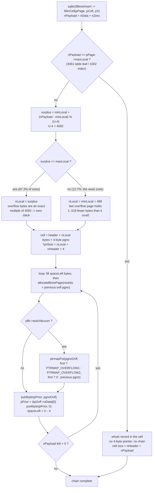
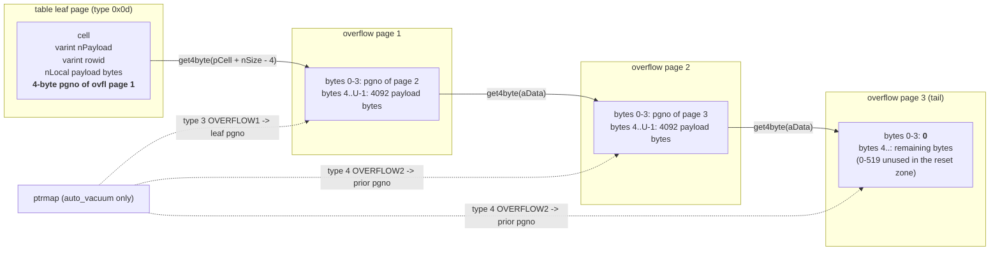

<!--
entry-meta
date: 2026-09-20
type: lesson
track: SQLite
lesson: 05
category: Database Internals
title: Cell Payload Overflow — nLocal, the Sawtooth, and the Overflow Chain
slug: sqlite-cell-payload-overflow
-->

# Cell Payload Overflow — `nLocal`, the Sawtooth, and the Overflow Chain

**2026-09-20 · SQLite Track · Lesson 05 of 32**

## Where This Fits

- **Previous lesson:** [Lesson 04](../2026-09-19-sqlite-page-space-allocator-defragmentation/README.md) covered the byte allocator *inside* one page — `freeSpace()`, `pageFindSlot()`, `allocateSpace()`, `defragmentPage()` — and established that no cell may exceed what one page can hold. It also drew the line between the in-page freeblock chain and the database-file freelist.
- **This lesson:** what happens when a record is larger than a page can hold. [Lesson 03](../2026-09-18-sqlite-btree-page-header-cell-layouts/README.md) §6 decoded the four cell layouts and noted the `nLocal < nPayload` case and its trailing 4-byte overflow pointer without following it. Today follows it: the four constants (`maxLeaf`, `minLeaf`, `maxLocal`, `minLocal`), the `surplus` formula in `fillInCell()` that picks `nLocal`, the overflow page chain it builds, `accessPayload()`'s walk back down that chain, and `clearCellOverflow()`'s teardown. The serial types from [Lesson 02](../2026-09-17-sqlite-varints-serial-types-record-format/README.md) turn out to decide, by one byte, which rows overflow at all.
- **Next:** Lesson 06 is `allocateBtreePage()` / `freePage2()` — the database-file freelist. Overflow pages are allocated and freed through exactly those two routines, so today establishes the largest single consumer of the machinery Lesson 06 explains. Lesson 13's `ptrmap` pages appear here in cameo (`PTRMAP_OVERFLOW1` / `PTRMAP_OVERFLOW2`) and are covered properly there.

Source references are to `sqlite/sqlite` at commit **`30fbf30`** (`src/btree.c`, 11,658 lines), read through a code index this run. Every measurement below was taken this run against SQLite **3.45.1** (Python 3.11's bundled library), `page_size = 4096`, `reserved = 0`, so `usableSize = U = 4096` — the same configuration as Lessons 01–04.

---

## 1. Four Constants, Computed Once Per Connection

The thresholds are not per-page. They are computed once, in `lockBtree()` — the same routine Lesson 01 followed through the page-1 bootstrap — right after `usableSize` is known:

```c
pBt->maxLocal = (u16)((pBt->usableSize-12)*64/255 - 23);
pBt->minLocal = (u16)((pBt->usableSize-12)*32/255 - 23);
pBt->maxLeaf  = (u16)(pBt->usableSize - 35);
pBt->minLeaf  = (u16)((pBt->usableSize-12)*32/255 - 23);
```

`btreeInitPage()` then copies the right pair onto each `MemPage` according to the page's flag byte:

| page type | flag byte | `pPage->maxLocal` | `pPage->minLocal` |
|---|---|---|---|
| table leaf | `0x0d` | `pBt->maxLeaf` | `pBt->minLeaf` |
| index leaf | `0x0a` | `pBt->maxLocal` | `pBt->minLocal` |
| index interior | `0x02` | `pBt->maxLocal` | `pBt->minLocal` |
| table interior | `0x05` | — (no payload) | — |

So there are really only three numbers, because `minLeaf` and `minLocal` are the same expression. At `U = 4096`:

| constant | expression | value |
|---|---|---|
| `maxLeaf` | `U - 35` | **4061** |
| `maxLocal` | `(U-12)*64/255 - 23` | **1002** |
| `minLeaf` = `minLocal` | `(U-12)*32/255 - 23` | **489** |
| overflow page capacity | `U - 4` | **4092** |

Two things follow immediately:

- **A table row and an index entry have completely different spill thresholds** — 4061 bytes versus 1002. The same 1500-byte string is local in the table and overflowed in every index over it.
- **`maxLocal` is almost exactly `2 × minLocal`**, because `64/255` is twice `32/255`. The file format documentation gives the reason: the thresholds "are designed to give a minimum fanout of 4 for index b-trees and to make sure enough of the payload is on the b-tree page that the record header can usually be accessed without consulting an overflow page." §8 tests the fanout claim and §9 breaks the header claim.

The docs also concede the design: "In hindsight, the designer of the SQLite b-tree logic realized that these thresholds could have been made much simpler. However, the computations cannot be changed without resulting in an incompatible file format." `fillInCell()` says the same thing in its own comment: "Warning: changing the way overflow payload is distributed in any way will result in an incompatible file format."

## 2. Picking `nLocal`: One Modulo, Two Branches

`btreeParseCellAdjustSizeForOverflow()` is the canonical statement of the rule, and `fillInCell()`, `btreePayloadToLocal()` and all four `cellSizePtr*` variants repeat it verbatim:

```c
minLocal = pPage->minLocal;
maxLocal = pPage->maxLocal;
surplus  = minLocal + (pInfo->nPayload - minLocal)%(pPage->pBt->usableSize-4);
testcase( surplus==maxLocal );
testcase( surplus==maxLocal+1 );
if( surplus <= maxLocal ){
  pInfo->nLocal = (u16)surplus;
}else{
  pInfo->nLocal = (u16)minLocal;
}
```

with the fast path ahead of it — `if( nPayload<=pPage->maxLocal )` → everything is local, no overflow pointer, no chain.

The stated goal is in the comment above it: "The strategy is to minimize the amount of unused space on overflow pages while keeping the amount of local storage in between minLocal and maxLocal."

That is worth restating precisely, because the modulo is doing something specific:

- `(P − minLocal) % (U−4)` is the remainder after packing as many **full** overflow pages as possible.
- Adding `minLocal` back gives the local size that makes the overflow bytes an **exact multiple of `U−4`** — i.e. every overflow page completely full, zero slack.
- That is only accepted if it stays inside `[minLocal, maxLocal]`. When it does not, SQLite falls back to `minLocal` and eats a partial last page.

So `nLocal` is not "as much as fits". It is "whatever makes the overflow pages come out even, if that is legal."

## 3. The Sawtooth, Measured

For a table leaf at `U = 4096`: `minLeaf = 489`, `maxLeaf = 4061`, `U−4 = 4092`. Below is a single-row table `t(a INTEGER PRIMARY KEY, b BLOB)`, blob length swept, cell parsed straight out of the file.

| blob len | `P` | `nLocal` | overflow bytes | # ovfl pages | bytes on last page | wasted | total pages |
|---|---|---|---|---|---|---|---|
| 4057 | 4061 | **4061** | 0 | 0 | — | 0 | 2 |
| 4058 | **4062** | **489** | 3573 | 1 | 3573 | **519** | 3 |
| 4200 | 4204 | 489 | 3715 | 1 | 3715 | 377 | 3 |
| 4576 | 4580 | 489 | 4091 | 1 | 4091 | 1 | 3 |
| 4577 | 4581 | 489 | **4092** | 1 | 4092 | **0** | 3 |
| 4600 | 4604 | **512** | 4092 | 1 | 4092 | 0 | 3 |
| 5000 | 5004 | 912 | 4092 | 1 | 4092 | 0 | 3 |
| 8149 | 8153 | **4061** | 4092 | 1 | 4092 | 0 | 3 |
| 8150 | 8154 | **489** | 7665 | 2 | 3573 | 519 | 4 |
| 12240 | 12245 | 4061 | 8184 | 2 | 4092 | 0 | 4 |
| 12241 | 12246 | 489 | 11757 | 3 | 3573 | 519 | 5 |

The shape is a sawtooth with period `U−4 = 4092` payload bytes:

- **`P = 4061 → 4062` is a cliff.** One extra payload byte moves **3573 bytes** off the page and drops `nLocal` from 4061 to 489, a factor of 8.3.
- **From `P = 4581` to `P = 8153`, `nLocal` ramps linearly 489 → 4061** while the overflow stays pinned at exactly one full 4092-byte page. Every byte added to the row goes onto the b-tree page, not the overflow page.
- **At `P = 8154` it resets** to 489 and a second overflow page opens.

Sweeping one full period (4092 consecutive payload sizes starting at 4062):

```
exact-fill (0 wasted bytes on the last overflow page): 3573 sizes
partial last page:                                      519 sizes
  predicted = (U-4) - (maxLeaf - minLeaf + 1) = 4092 - 3573 = 519   ✓
  waste on those: 1 .. 519 bytes
  fraction of payload sizes that waste a partial page: 12.68%
```

The design goal is met for **87.3%** of payload sizes: the overflow pages are completely full and the slack is zero. The remaining 12.7% is the reset zone, where `surplus` would exceed `maxLocal` and the fallback to `minLocal` leaves 1–519 bytes of a page unused. `519` is not a tuning constant; it is `(U−4) − (maxLeaf − minLeaf + 1)`, i.e. the part of the period that the legal range of `nLocal` cannot cover.

## 4. The Cliff Costs 12% of the File

The sawtooth is not academic. 200 rows, same schema, `auto_vacuum=0`:

| blob len | pages | file size | bytes/row | overhead vs. payload |
|---|---|---|---|---|
| 4000 | 202 | 808.0 KiB | 4137 | 3.4% |
| **4057** | **202** | **808.0 KiB** | 4137 | 2.0% |
| **4058** | **227** | **908.0 KiB** | 4649 | **14.6%** |
| 4300 | 227 | 908.0 KiB | 4649 | 8.1% |
| 4577 | 227 | 908.0 KiB | 4649 | 1.6% |
| 8149 | 402 | 1608.0 KiB | 8233 | 1.0% |
| 8150 | 427 | 1708.0 KiB | 8745 | 7.3% |

**One byte per row costs 100 KiB across 200 rows — the file grows 12.4%.** And note what happened structurally: at 4057 bytes the b-tree is 200 leaf pages holding one 4065-byte cell each. At 4058 bytes the cell shrinks to 497 bytes, so eight fit per leaf and the b-tree collapses to 25 leaves — but each row now owns a 4096-byte overflow page carrying only 3573 useful bytes. The b-tree got 8× denser and the file got bigger.

Rows 4058 → 4577 are all the same file size, because they all use one leaf-cell slot of the same size and one overflow page; the extra bytes go into the slack. **519 bytes of payload are free** in that window, and then the next byte is not.

## 5. Building the Chain: `fillInCell()`

Once `nLocal` is fixed, the write loop is small. Per the file format: "The first four bytes of each overflow page are a big-endian integer which is the page number of the next page in the chain, or zero for the final page in the chain. The fifth byte through the last usable byte are used to hold overflow content."

```c
mn = pPage->minLocal;
n  = mn + (nPayload - mn) % (pPage->pBt->usableSize - 4);
if( n > pPage->maxLocal ) n = mn;
spaceLeft = n;
*pnSize   = n + nHeader + 4;        /* the +4 is the overflow pointer */
pPrior    = &pCell[nHeader+n];      /* where the first pgno gets written */
...
while( 1 ){
  n = nPayload; if( n>spaceLeft ) n = spaceLeft;
  ... memcpy / memset into pPayload ...
  nPayload -= n;
  if( nPayload<=0 ) break;
  pPayload += n; pSrc += n; nSrc -= n; spaceLeft -= n;
  if( spaceLeft==0 ){
    ...
    rc = allocateBtreePage(pBt, &pOvfl, &pgnoOvfl, pgnoOvfl, 0);
    ...
    put4byte(pPrior, pgnoOvfl);     /* link the PREVIOUS node to this page */
    releasePage(pToRelease);
    pToRelease = pOvfl;
    pPrior    = pOvfl->aData;       /* this page's own next-pointer */
    put4byte(pPrior, 0);            /* provisionally the tail */
    pPayload  = &pOvfl->aData[4];
    spaceLeft = pBt->usableSize - 4;
  }
}
```

Four details worth keeping:

1. **`pPrior` is a moving "write the next pointer here" cursor.** It starts inside the cell (just past the local payload) and then lives at offset 0 of each overflow page. The chain is built forward with exactly one 4-byte write per link, and the tail always already reads 0 — the chain is never in a state where it runs off into garbage.
2. **`allocateBtreePage(..., pgnoOvfl, 0)` passes the previous overflow page number as the "nearby" hint**, which is what produces the contiguity measured in §6.
3. **The `nSrc` / `nPayload` split is how `zeroblob()` is cheap.** `nPayload = pX->nData + pX->nZero`; when `nSrc` runs out the loop switches to `memset(pPayload, 0, n)`. The zero tail is never materialised in the caller's buffer — but it *is* materialised on disk, one full page at a time.
4. **Auto-vacuum writes the ptrmap entry here, and deliberately writes a partial one for the first page:**

```c
u8 eType = (pgnoPtrmap ? PTRMAP_OVERFLOW2 : PTRMAP_OVERFLOW1);
ptrmapPut(pBt, pgnoOvfl, eType, pgnoPtrmap, &rc);
```

with the comment: "If this is the first overflow page, then write a partial entry to the pointer-map. If we write nothing to this pointer-map slot, then the optimistic overflow chain processing in `clearCell()` may misinterpret the uninitialized values and delete the wrong pages from the database." The two types are the ones the file format spec numbers 3 and 4: type 3 "the first page of a cell payload overflow chain… the page number is the b-tree page that contains the cell whose content has overflowed"; type 4 "a page in an overflow chain other than the first page… the page number is the prior page of the overflow chain."

## 6. Chain Locality Is a Bet, and It Is Measurable

`getOverflowPage()` has an auto-vacuum fast path that never reads the overflow page at all:

```c
if( pBt->autoVacuum ){
  Pgno iGuess = ovfl+1;
  while( PTRMAP_ISPAGE(pBt, iGuess) || iGuess==PENDING_BYTE_PAGE(pBt) ) iGuess++;
  if( iGuess<=btreePagecount(pBt) ){
    rc = ptrmapGet(pBt, iGuess, &eType, &pgno);
    if( rc==SQLITE_OK && eType==PTRMAP_OVERFLOW2 && pgno==ovfl ){
      next = iGuess;
      rc = SQLITE_DONE;                 /* skip the btreeGetPage() below */
    }
  }
}
```

It literally guesses that the next link is the next page number, and verifies the guess against the ptrmap. So the value of this optimisation is exactly the fraction of chain links that are physically consecutive. Measured — 20 rows, `P = 13004`, three overflow pages each, 40 links total:

| database | pages | consecutive links | first three chains |
|---|---|---|---|
| fresh sequential insert | 66 | **40/40 (100%)** | `[3,4,5] [6,7,8] [9,10,11]` |
| after delete+reinsert churn | 68 | **22/40 (55%)** | `[3,4,5] [9,10,11] [15,16,17]` |
| `auto_vacuum=1`, fresh | 67 | **40/40 (100%)** | `[4,5,6] [7,8,9] [10,11,12]` |
| `auto_vacuum=1`, churned | 69 | **31/40 (78%)** | `[4,5,6] [10,11,12] [16,17,18]` |

A freshly-built database gives perfectly contiguous chains: the `nearby` hint in `fillInCell()` plus a monotonically growing file means link *i+1* really is page *i+1*. After deleting every other row and reinserting, 45% of links (non-auto-vacuum) point somewhere else, because the pages now come off the freelist in whatever order it hands them out. **The ptrmap shortcut degrades with exactly the same curve, and so does sequential-read performance on the chain.** Nothing reports this number; the only way to see it is to walk the chains yourself.

## 7. Reading: `accessPayload()` and the `aOverflow` Cache

`accessPayload()` handles reads and writes at an arbitrary `(offset, amt)` within a payload. Getting to byte *N* means walking the chain, because the only pointer to link *i+1* lives in link *i*. The mitigation is a per-cursor array:

```c
if( (pCur->curFlags & BTCF_ValidOvfl)==0 ){
  i64 nOvfl = pCur->info.nPayload;
  nOvfl = (nOvfl - pCur->info.nLocal + ovflSize-1)/ovflSize;
  ... realloc to nOvfl*2*sizeof(Pgno) ...
  memset(pCur->aOverflow, 0, nOvfl*sizeof(Pgno));
  pCur->curFlags |= BTCF_ValidOvfl;
}else{
  if( pCur->aOverflow[offset/ovflSize] ){        /* direct index! */
    iIdx    = (offset/ovflSize);
    nextPage = pCur->aOverflow[iIdx];
    offset  = (offset%ovflSize);
  }
}
```

"The `aOverflow[]` array is sized at one entry for each overflow page in the overflow chain. The page number of the first overflow page is stored in `aOverflow[0]`, etc. A value of 0 in the `aOverflow[]` array means 'not yet known' (the cache is lazily populated)." Populated, it turns an O(n) pointer chase into `offset/ovflSize` — one array index.

Note also that the walk loop skips page *content* when it only needs the link: `if( offset>=ovflSize )` consults `aOverflow[iIdx+1]` first and falls back to `getOverflowPage()`, which in auto-vacuum mode may answer from the ptrmap (§6) without touching the page.

**Measured.** One 8 MiB `zeroblob` = 2050 overflow pages, `cache_size=8` pages so the pager cannot hold the chain, one 1-byte read per trial, median of 7, fresh connection and cursor each time:

| byte offset | overflow page index | cold cursor | warm cursor (cache populated) |
|---|---|---|---|
| 0 | 0 | 0.4 µs | 0.2 µs |
| 4,092 | 1 | 6.3 µs | — |
| 409,200 | 100 | 47.5 µs | — |
| 2,046,000 | 500 | 247.7 µs | — |
| 4,092,000 | 1000 | 521.9 µs | **0.3 µs** |
| 6,138,000 | 1500 | 775.8 µs | — |
| 8,183,999 | 1999 | **998.9 µs** | **0.3 µs** |

Dead linear: **0.4997 µs per link**, R² by eye 1.0. With the cache populated the cost is flat at ~0.3 µs regardless of offset — a **3,300× difference** at the far end of the blob. The entire benefit is destroyed the moment the cache is invalidated, which the source lists as: another cursor writing to the same table, the cursor moving to a different row, and several auto-vacuum events.

## 8. Index B-Trees: A 1002-Byte Threshold, and the One-Byte Escape

Index pages use `maxLocal = 1002`, not `maxLeaf = 4061`. Measured with `CREATE INDEX i ON t(b)` over 60 rows:

| blob len | index-entry `P` | `nLocal` | overflows? | index leaf pages | total pages |
|---|---|---|---|---|---|
| 900 | 904 | 904 | no | 13 | 34 |
| 997 | 1001–1002 | = `P` | no | 13 | 34 |
| **998** | **1002–1003** | 1002 / **489** | **mostly** | 8 | **85** |
| 1100 | 1104 | 489 | yes | 8 | 91 |
| 2000 | 2004 | 489 | yes | 8 | 101 |

The jump from 34 to 85 pages at a one-byte change is 59 new overflow pages for 60 rows. **Not 60.** The reason is Lesson 02's serial types, and it is exact.

An index entry over `t(b)` is the record `(b, rowid)`. The record header is `[hdrSize][serial(b)][serial(rowid)]` = 4 bytes here. For `len(b) = 998`, `serial(b) = 2·998+12 = 2008`, a 2-byte varint. So:

```
P = 1 (hdrSize) + 2 (blob serial) + 1 (rowid serial) + 998 (blob) + len(rowid data)
```

and `len(rowid data)` is not always 1. Serial types **8 and 9 encode the integers 0 and 1 in zero bytes** — the value is the type. Measured over the 53 keys that live on index *leaf* pages, with rowids 0…59:

```
P histogram: {1002: 2, 1003: 51}
overflowing: 51 of 53
record header serials: 8f 58 08   -> P=1002, nLocal=1002 (rowid 0, serial type 8)
                       8f 58 09   -> P=1002, nLocal=1002 (rowid 1, serial type 9)
                       8f 58 01   -> P=1003, nLocal=489  (every other rowid)
```

Two rows out of sixty escape overflow entirely, and they are precisely the rows whose rowid is 0 or 1. A one-byte difference in a column you did not index decides whether the entry spills. This is the clearest demonstration in the track so far that the record encoding of Lesson 02 and the b-tree layer of Lessons 03–05 are not independent layers.

## 9. The Record Header Does Not Always Fit

The file format's stated rationale is that the thresholds "make sure enough of the payload is on the b-tree page that the record header can usually be accessed without consulting an overflow page." `minLocal = 489` bytes is the worst case. A record header is `1–9` bytes of length prefix plus one varint per column, so a wide table blows through 489 bytes of header on column count alone.

Measured, a table of 900 columns all holding the integer `1` (serial type 9: one header byte, **zero** data bytes) plus one blob:

| blob len | `nPayload` | `nLocal` | record header size | header within `nLocal`? |
|---|---|---|---|---|
| 3000 | 3905 | 3905 | 905 | yes (no overflow at all) |
| **3200** | 4105 | **489** | **905** | **NO — 416 header bytes are on an overflow page** |
| 3300 | 4205 | 489 | 905 | NO |
| 6000 | 6905 | 2813 | 905 | yes |
| **7300** | 8205 | **489** | **905** | **NO** |

And the crossover, with 1-byte serial types throughout:

```
columns=484   recordHeader=489   (= minLocal exactly)
columns=485   recordHeader=490   (> minLocal)
```

**At 485 columns the header can no longer be guaranteed to fit.** It only actually spills when the payload lands in the 12.7% reset zone where `nLocal` falls back to `minLocal` — but when it does, reading *any* column, including the first, requires fetching an overflow page. "Usually" is carrying real weight in that sentence, and the failure is silent.

## 10. Teardown: `clearCellOverflow()`

Deletion frees the chain before the cell is dropped. `sqlite3BtreeDelete()` calls the macro, which parses the cell and only takes the slow path when there is a chain:

```c
#define BTREE_CLEAR_CELL(rc, pPage, pCell, sInfo)   \
  pPage->xParseCell(pPage, pCell, &sInfo);          \
  if( sInfo.nLocal!=sInfo.nPayload ){               \
    rc = clearCellOverflow(pPage, pCell, &sInfo);   \
  }else{                                            \
    rc = SQLITE_OK;                                 \
  }
```

`clearCellOverflow()` itself is `SQLITE_NOINLINE` — the overflow case is explicitly the cold path. It recomputes the chain length rather than trusting it:

```c
ovflPgno     = get4byte(pCell + pInfo->nSize - 4);
ovflPageSize = pBt->usableSize - 4;
nOvfl = (pInfo->nPayload - pInfo->nLocal + ovflPageSize - 1)/ovflPageSize;
while( nOvfl-- ){
  if( ovflPgno<2 || ovflPgno>btreePagecount(pBt) ) return SQLITE_CORRUPT_BKPT;
  if( nOvfl ){ rc = getOverflowPage(pBt, ovflPgno, &pOvfl, &iNext); ... }
  if( (pOvfl || ((pOvfl = btreePageLookup(pBt, ovflPgno))!=0))
   && sqlite3PagerPageRefcount(pOvfl->pDbPage)!=1 ){
    rc = SQLITE_CORRUPT_BKPT;
  }else{
    rc = freePage2(pBt, pOvfl, ovflPgno);
  }
  ...
  ovflPgno = iNext;
}
```

- **The loop count comes from arithmetic on `nPayload`/`nLocal`, not from walking to a zero terminator.** The chain length is a derived quantity; a mismatch between the arithmetic and the actual links is treated as corruption.
- **`if( nOvfl )` means the last page's link is never fetched.** One fewer page read per delete, and the reason the last iteration passes `pOvfl = 0` into `btreePageLookup()`.
- **The refcount check is a safety interlock against secure-delete**: "It is helpful to detect this before calling `freePage2()`, as `freePage2()` may zero the page contents if secure-delete mode is enabled."
- **Every page goes to `freePage2()`** — Lesson 06's routine. Deleting one 8 MiB blob pushes 2050 pages onto the file freelist in a single statement.

## 11. The Whole Path



And the physical layout of one overflowing table-leaf cell:



## Hands-On

Needs only `python3`. `dbstat` is compiled into most builds — check first; if it is missing, parts 1–3 still work, they just lose the cross-check.

```bash
mkdir -p ~/sqlite-ovfl && cd ~/sqlite-ovfl
cat > ov.py <<'PY'
import struct, sqlite3, os

def getvarint(b, i):
    v = 0
    for k in range(8):
        x = b[i+k]; v = (v << 7) | (x & 0x7f)
        if x < 0x80: return v, k+1
    return (v << 8) | b[i+8], 9

class DB:
    def __init__(self, path):
        self.raw = open(path,'rb').read()
        self.ps  = ((self.raw[16]<<8) | (self.raw[17]<<16)) or 65536
        self.usable = self.ps - self.raw[20]
        self.npage  = struct.unpack('>I', self.raw[28:32])[0] or len(self.raw)//self.ps
    def page(self, n): return self.raw[(n-1)*self.ps : n*self.ps]

def consts(U):
    return dict(maxLeaf=U-35, minLeaf=((U-12)*32)//255-23,
                maxLocal=((U-12)*64)//255-23, minLocal=((U-12)*32)//255-23)

def nlocal(P, U, index=False):
    """Exact port of btreeParseCellAdjustSizeForOverflow()."""
    c  = consts(U)
    mx = c['maxLocal'] if index else c['maxLeaf']
    mn = c['minLocal']
    if P <= mx: return P
    n = mn + (P - mn) % (U - 4)
    return n if n <= mx else mn

def tableleaf_cells(db, pgno):
    pg = db.page(pgno); h = 100 if pgno == 1 else 0
    assert pg[h] == 0x0d, f"page {pgno} is type {pg[h]:#x}, not a table leaf"
    nCell = struct.unpack('>H', pg[h+3:h+5])[0]
    out = []
    for i in range(nCell):
        off = struct.unpack('>H', pg[h+8+2*i:h+10+2*i])[0]
        p = off
        npay, k = getvarint(pg, p); p += k
        rid,  k = getvarint(pg, p); p += k
        nl = nlocal(npay, db.usable)
        first = struct.unpack('>I', pg[p+nl:p+nl+4])[0] if nl != npay else 0
        out.append(dict(off=off, nPayload=npay, rowid=rid, nLocal=nl,
                        first=first, hdrlen=p-off))
    return out

def walk(db, first):
    chain, pn, seen = [], first, set()
    while pn:
        if pn in seen: raise RuntimeError("cycle in overflow chain")
        seen.add(pn); chain.append(pn)
        pn = struct.unpack('>I', db.page(pn)[0:4])[0]
    return chain

def build(L, n=1, name='t.db', ps=4096, av=0):
    if os.path.exists(name): os.remove(name)
    c = sqlite3.connect(name, isolation_level=None)
    c.execute(f"PRAGMA page_size={ps}"); c.execute(f"PRAGMA auto_vacuum={av}")
    c.execute("CREATE TABLE t(a INTEGER PRIMARY KEY, b BLOB)")
    c.executemany("INSERT INTO t VALUES(?,?)", [(i, b'\xab'*L) for i in range(1, n+1)])
    c.close(); return DB(name)
PY
python3 -c "from ov import consts; print(consts(4096))"
# -> {'maxLeaf': 4061, 'minLeaf': 489, 'maxLocal': 1002, 'minLocal': 489}
```

**Part 1 — find the cliff yourself, then the sawtooth.**

```bash
python3 - <<'PY'
from ov import DB, build, tableleaf_cells, walk, consts
U = 4096; cap = U-4
print(f"{'blobLen':>8} {'P':>6} {'nLocal':>7} {'ovflBytes':>9} {'#pg':>4} {'lastPg':>7} {'waste':>6}  chain")
for L in [4057, 4058, 4200, 4576, 4577, 4600, 5000, 8149, 8150, 12240, 12241]:
    db = build(L)
    c  = tableleaf_cells(db, 2)[0]
    ch = walk(db, c['first']) if c['first'] else []
    ov = c['nPayload'] - c['nLocal']
    last = ov - cap*(len(ch)-1) if ch else 0
    print(f"{L:>8} {c['nPayload']:>6} {c['nLocal']:>7} {ov:>9} {len(ch):>4} "
          f"{last:>7} {cap-last if ch else 0:>6}  {ch}")
PY
```

**What to look for:** `nLocal` collapses 4061 → 489 between blob lengths 4057 and 4058 — 3573 bytes leave the page for one extra byte of input. Then watch `waste` fall 519 → 0 as the blob grows to 4577, and `nLocal` climb 489 → 4061 while `#pg` stays at 1. The chain is `[3]`, then `[3,4]`, then `[3,4,5]`: contiguous, because nothing has been deleted yet.

**Part 2 — prove the exact-fill claim over a whole period.** No database needed; this is pure arithmetic against the ported formula.

```bash
python3 - <<'PY'
from ov import nlocal, consts
U = 4096; c = consts(U); cap = U-4
zero = part = 0
for P in range(c['maxLeaf']+1, c['maxLeaf']+1+cap):
    ov  = P - nlocal(P, U)
    last = ov - cap*((ov+cap-1)//cap - 1)
    if cap - last == 0: zero += 1
    else: part += 1
print(f"period = U-4 = {cap} payload sizes")
print(f"  exact-fill: {zero}   partial: {part}")
print(f"  predicted partial = {cap} - (maxLeaf-minLeaf+1) = {cap-(c['maxLeaf']-c['minLeaf']+1)}")
PY
```

**What to look for:** `3573 / 519`, and `519` matching the prediction exactly. If you change `U` (try `page_size=8192`, `U=8192`) both numbers move and the identity still holds — that is the check that you have the formula right and not a coincidence at 4096.

**Part 3 — cross-check against `dbstat`, which reports slack directly.**

```bash
python3 - <<'PY'
import sqlite3
from ov import build
for L in (12240, 12241):                   # one byte apart, opposite sides of the cliff
    build(L, n=1, name='s.db')
    c = sqlite3.connect('s.db')
    rows = c.execute("SELECT pageno,pagetype,payload,unused FROM dbstat "
                     "WHERE name='t' ORDER BY pageno").fetchall()
    print(f"blob={L}"); [print("   ", r) for r in rows]; c.close()
PY
```

**What to look for:** the whole lesson in eight rows.

```
blob=12240
    (2, 'leaf',     payload=4061, unused=18)
    (3, 'overflow', payload=4092, unused=0)
    (4, 'overflow', payload=4092, unused=0)
blob=12241
    (2, 'leaf',     payload=489,  unused=3590)      <- nLocal collapsed
    (3, 'overflow', payload=4092, unused=0)
    (4, 'overflow', payload=4092, unused=0)
    (5, 'overflow', payload=3573, unused=519)       <- a third page, 519 bytes wasted
```

One payload byte turns a 4061-byte leaf cell into a 489-byte one, leaves 3590 bytes of the leaf page unused, and opens a third overflow page carrying 3573 of its 4092 bytes. `dbstat` is the one place SQLite exposes the §3 slack without parsing pages yourself — but note it reports `unused` and never `nLocal`, so it shows you the cost and not the cause.

**Part 4 — measure the O(n) seek and the `aOverflow` cache.**

```bash
python3 - <<'PY'
import sqlite3, os, time, statistics
N = 8*1024*1024
if os.path.exists('b.db'): os.remove('b.db')
c = sqlite3.connect('b.db', isolation_level=None)
c.execute("PRAGMA page_size=4096")
c.execute("CREATE TABLE t(a INTEGER PRIMARY KEY, b BLOB)")
c.execute("INSERT INTO t VALUES(1, zeroblob(?))", (N,)); c.close()

def cold(off, reps=7):
    ts = []
    for _ in range(reps):
        c = sqlite3.connect('b.db'); c.execute("PRAGMA cache_size=8")
        bl = c.blobopen('t','b',1)
        t0 = time.perf_counter(); bl.seek(off); bl.read(1); ts.append(time.perf_counter()-t0)
        bl.close(); c.close()
    return statistics.median(ts)*1e6

print("cold cursor:")
for k in (0, 1, 100, 500, 1000, 1500, 1999):
    print(f"  ovfl page {k:>5}: {cold(k*4092):8.1f} us")

c = sqlite3.connect('b.db'); c.execute("PRAGMA cache_size=8")
bl = c.blobopen('t','b',1); bl.seek(1999*4092); bl.read(1)   # populate aOverflow
print("warm cursor (same handle):")
for k in (0, 1000, 1999):
    ts = []
    for _ in range(50):
        t0 = time.perf_counter(); bl.seek(k*4092); bl.read(1); ts.append(time.perf_counter()-t0)
    print(f"  ovfl page {k:>5}: {statistics.median(ts)*1e6:8.1f} us")
bl.close(); c.close()
PY
```

**What to look for:** the cold column should be a straight line through the origin — divide any row by its page index and you get the per-link cost (≈0.5 µs here). The warm column should be flat and roughly 1000× smaller at the far end. That flat line *is* `aOverflow[offset/ovflSize]`. `cache_size=8` matters: with the default cache the pager holds the whole chain and you measure memory, not the chain walk.

**Part 5 — the one-byte index escape.** Rebuild with an index and rowids that include 0 and 1:

```bash
python3 - <<'PY'
import sqlite3, os, struct
from ov import DB, getvarint, nlocal
L = 998
if os.path.exists('i.db'): os.remove('i.db')
c = sqlite3.connect('i.db', isolation_level=None)
c.execute("PRAGMA page_size=4096")
c.execute("CREATE TABLE t(a INTEGER PRIMARY KEY, b BLOB)")
c.execute("CREATE INDEX i ON t(b)")
c.executemany("INSERT INTO t VALUES(?,?)",
              [(i, bytes([i])+b'\xcd'*(L-1)) for i in range(0, 60)])
c.close()
db = DB('i.db'); hist = {}
for p in range(1, db.npage+1):
    pg = db.page(p); h = 100 if p == 1 else 0
    if pg[h] != 0x0a: continue                       # index leaf
    n = struct.unpack('>H', pg[h+3:h+5])[0]
    for k in range(n):
        off = struct.unpack('>H', pg[h+8+2*k:h+10+2*k])[0]
        P, kk = getvarint(pg, off)
        hdr = pg[off+kk+1 : off+kk+pg[off+kk]]
        hist[(P, nlocal(P, db.usable, index=True), hdr.hex())] = \
            hist.get((P, nlocal(P, db.usable, index=True), hdr.hex()), 0) + 1
for key, n in sorted(hist.items()):
    print(f"  P={key[0]} nLocal={key[1]} serials={key[2]}  x{n}")
PY
```

**What to look for:** two distinct `P` values one byte apart, straddling `maxLocal = 1002`. The `serials` hex ends in `08` or `09` for the two entries that stay local — serial types 8 and 9, the zero-byte encodings of integers 0 and 1 from Lesson 02. Every other rowid costs one extra byte and overflows. Change the `range(0, 60)` to `range(2, 62)` and all of them overflow.

## Where This Breaks Down

- **The threshold is a cliff, and nothing warns you.** 4061 → 4062 payload bytes moves 3573 bytes off-page and, measured over 200 rows, grows the file 12.4%. There is no pragma, no `EXPLAIN` output and no error that tells you a row is one byte over. The only symptom is file size and latency.
- **12.7% of payload sizes waste a partial overflow page**, up to 519 bytes each at `U = 4096`. That is not a bug — it is the price of keeping `nLocal` inside `[minLocal, maxLocal]` — but it means per-row storage overhead is a *discontinuous, non-monotonic* function of row size. A schema change that adds two bytes to every row can shrink the file.
- **Seeking into a payload is O(chain length) and the only mitigation is a per-cursor cache that is invalidated aggressively.** Measured: 999 µs to reach the last byte of an 8 MiB blob cold, 0.3 µs warm. The cache dies when any other cursor writes to the table, when the cursor moves to another row, and on several auto-vacuum events. Incremental blob I/O over a large blob with concurrent writers gets the cold number every time.
- **Chain contiguity is a silent, unmeasured property that degrades with churn.** 100% consecutive links on a fresh build, 55% after deleting and reinserting half the rows (78% with auto-vacuum). `getOverflowPage()`'s ptrmap shortcut is literally a bet on this, and so is any hope of sequential I/O down the chain. No pragma reports it; `PRAGMA integrity_check` does not care; you have to walk the chains and diff page numbers.
- **The "record header usually fits" rationale fails at 485 columns.** Measured: a 900-column record has a 905-byte header, and whenever the payload lands in the reset zone `nLocal` is 489, so 416 bytes of *header* live on an overflow page. Reading column 1 then costs an extra page fetch. Wide tables and large blobs in the same row is the combination that triggers it.
- **A one-byte difference in an unindexed column changes whether an index entry overflows.** Rowids 0 and 1 encode in zero data bytes (serial types 8 and 9), so in a 60-row table with identical key lengths exactly two entries stayed local and 51 of the 53 leaf entries spilled. Index entry size depends on the *values*, not just the declared types — and the index threshold is 1002 bytes, four times tighter than the table's 4061.
- **Deleting one large row is a large, unbatched freelist operation.** `clearCellOverflow()` pushes every page of the chain through `freePage2()` inside the delete. An 8 MiB blob is 2050 `freePage2()` calls in one statement, and `SQLITE_NOINLINE` on that function is an admission that it is the cold path.
- **The format cannot be fixed.** Both the documentation and `fillInCell()`'s own comment say changing the distribution breaks file compatibility, and the docs explicitly say the thresholds "could have been made much simpler". This is a permanent property of every SQLite database file, not a tunable.
- **Not verified here.** I did not measure the `SQLITE_DIRECT_OVERFLOW_READ` path in `accessPayload()` — it is compile-time optional and its six preconditions (read-only, offset 0, no dirty pages, file-backed, not in WAL, ≥4 bytes already buffered) were not something I could confirm were met in the stock Python build, so every timing above is the ordinary `sqlite3PagerGet()` path. I also did not instrument how often the auto-vacuum ptrmap guess in `getOverflowPage()` actually fires at runtime; §6 measures the *structural* precondition (chain contiguity), not the hit rate. All numbers are `U = 4096`, `reserved = 0`, single-threaded, warm OS page cache.

## Further Study

- [SQLite: Database File Format, §1.6 "Cell payload overflow pages" and §1.7](https://www.sqlite.org/fileformat2.html) — the normative `X`/`M`/`K` statement of the rule, and the design-rationale paragraph quoted in §1.
- [sqlite/sqlite — `src/btree.c` on GitHub](https://github.com/sqlite/sqlite/blob/master/src/btree.c) — `fillInCell()`, `accessPayload()`, `getOverflowPage()`, `clearCellOverflow()`, `btreePayloadToLocal()`. Reading them side by side shows the same modulo written out five times.
- [SQLite: The B-Tree Module (historical design document)](https://sqlite.org/btreemodule.html) — explicitly marked obsolete, and useful precisely for that: it treats "overflow cell" as a transient balancing condition, a completely different meaning of the word from today's on-disk chains. Worth reading before Lesson 11 so the two senses do not collide.
- [SQLite B-Tree — Table vs Index, Cells, Overflow Pages, Splits](https://systeminternals.dev/sqlite/btree/) — a secondary walkthrough of the same layer; useful as a cross-check on terminology.
- [SQLite source repository: `btree.c` artifact view](https://www.sqlite.org/src/artifact/eecc84f02375b2bb7a44abbcbbe3747dde73edb2) — the canonical Fossil-hosted copy, for pinning a line number to a specific check-in rather than to `master`.

## Next Steps

1. **Write the fragmentation metric `dbstat` cannot express.** For every overflowing cell, emit `(nPayload, nLocal, chainLength, slackOnLastPage, consecutiveLinkFraction)`. Run it over a real application database. The slack number is recoverable from `dbstat`; the contiguity number is not, and §6 shows it is the one that moves under churn.
2. **Find your schema's cliffs.** For each table, compute the payload-size distribution and overlay the sawtooth for your page size. Any mass sitting just above `maxLeaf` (or just above `maxLocal` for an index) is paying the §4 penalty. Predict the file-size saving from trimming those rows below the threshold, then measure it.
3. **Test whether page size moves the problem or just relabels it.** Rebuild the same data at `page_size` 1024, 4096, 8192, 65536 and compare total file size, chain lengths and cold-seek latency. `maxLeaf` scales linearly with `U` but `minLocal` scales at `32/255 ≈ 12.5%` of it — so the reset-zone penalty as a *fraction* of the page should stay roughly constant while its absolute cost grows. Confirm or refute.
4. **Quantify the `aOverflow` invalidation cost under concurrency.** Two connections: one doing incremental blob reads down a large blob, one writing unrelated rows in the same table. Measure read latency as a function of the writer's rate. The prediction from §7 is that latency jumps from the warm number to the cold number as soon as the writer commits.
5. **Rebuild chain contiguity deliberately.** Take the churned database from §6, run `VACUUM`, and re-measure the consecutive-link fraction. Lesson 04 showed `VACUUM` making in-page free space contiguous; the prediction is that it does the same for chains. If it does, that is a concrete, measurable reason to `VACUUM` that has nothing to do with file size.
6. Read `allocateBtreePage()` and `freePage2()` with §5 and §10 in hand, and note specifically what the `nearby` hint does and does not guarantee. That is Lesson 06.

## Sources

- [SQLite: Database File Format](https://www.sqlite.org/fileformat2.html) — the `X`/`M`/`K` formulas for table-leaf and index pages ("Let X be U-35… Let M be ((U-12)*32/255)-23 and let K be M+((P-M)%(U-4))"); the overflow page layout ("The first four bytes of each overflow page are a big-endian integer which is the page number of the next page in the chain, or zero for the final page in the chain"); ptrmap entry types 3 and 4; and the design-rationale paragraph including "In hindsight, the designer of the SQLite b-tree logic realized that these thresholds could have been made much simpler."
- [sqlite/sqlite — `src/btree.c`](https://github.com/sqlite/sqlite/blob/master/src/btree.c) — read this run at commit `30fbf30` via a code index: `pBt->maxLocal/minLocal/maxLeaf/minLeaf` assignment in `lockBtree()`; `btreeParseCellAdjustSizeForOverflow()` and `btreePayloadToLocal()`; `fillInCell()` and its overflow loop with `PTRMAP_OVERFLOW1`/`PTRMAP_OVERFLOW2`; `getOverflowPage()`'s `iGuess = ovfl+1` ptrmap shortcut; `accessPayload()`'s `aOverflow` cache and `BTCF_ValidOvfl`; `clearCellOverflow()` and the `BTREE_CLEAR_CELL` macro.
- [SQLite: The B-Tree Module](https://sqlite.org/btreemodule.html) — historical design document, marked obsolete; source of the different, balancing-time sense of "overflow cell".
- [SQLite B-Tree — Table vs Index, Cells, Overflow Pages, Splits](https://systeminternals.dev/sqlite/btree/)
- [SQLite source repository: `btree.c` artifact](https://www.sqlite.org/src/artifact/eecc84f02375b2bb7a44abbcbbe3747dde73edb2)

## Takeaways

- **There are three thresholds, not one.** `maxLeaf = U-35` (4061) for table leaves, `maxLocal = (U-12)*64/255-23` (1002) for index pages, and `minLocal = (U-12)*32/255-23` (489) as the floor for both. An index spills at a quarter of the table's threshold.
- **`nLocal` is chosen to make the overflow pages come out exactly full**, not to maximise local storage. `surplus = minLocal + (P-minLocal) % (U-4)`, accepted if it lands in `[minLocal, maxLocal]`, otherwise `minLocal`.
- **The result is a sawtooth with period `U-4`.** Measured at `U=4096`: 3573 of every 4092 payload sizes fill their overflow pages exactly; the other 519 waste 1–519 bytes. The crossing is a cliff — one payload byte moved 3573 bytes off the page and grew a 200-row file by 12.4%.
- **Chains are built forward with one 4-byte write per link**, using the previous overflow page as the `nearby` allocation hint. Freshly built chains were 100% physically consecutive; after churn, 55%.
- **Reading byte N of a payload is O(N/4092) pointer chases** unless the per-cursor `aOverflow` cache is populated. Measured 999 µs cold versus 0.3 µs warm at the end of an 8 MiB blob — and the cache is invalidated by any other cursor writing to the table.
- **Record encoding decides overflow, not just column types.** Serial types 8 and 9 store the integers 0 and 1 in zero bytes, so in a table of identical-length keys exactly the rowid-0 and rowid-1 index entries stayed local while the rest spilled.
- **The documented rationale that the record header "can usually be accessed without consulting an overflow page" fails past 485 columns**, and silently.
