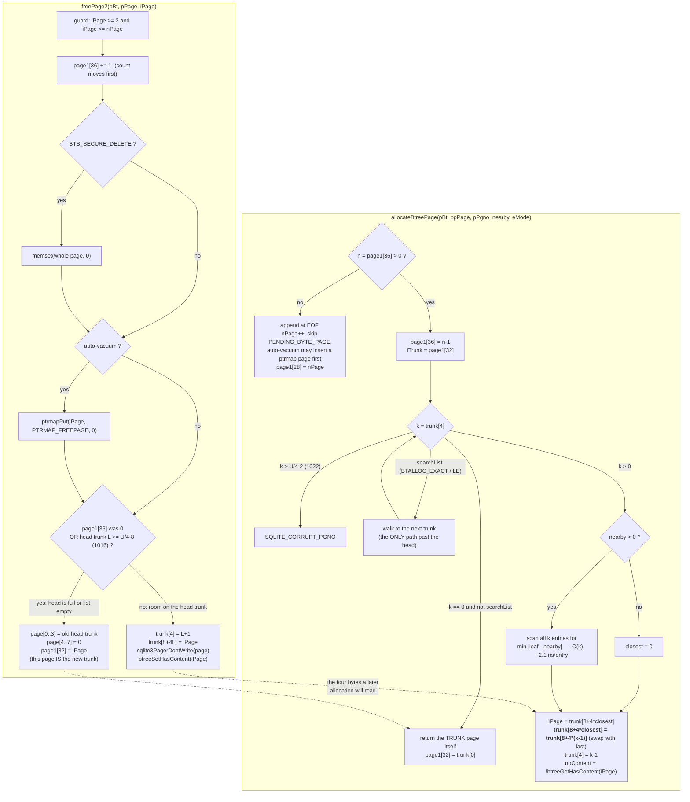
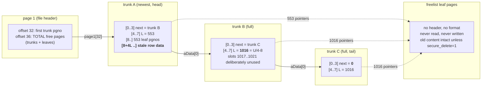

<!--
entry-meta
date: 2026-09-21
type: lesson
track: SQLite
lesson: 06
category: Database Internals
title: The Database Freelist — Trunk Pages, Leaf Arrays, and Swap-With-Last Reuse
slug: sqlite-freelist-trunk-leaf-pages
-->

# The Database Freelist — Trunk Pages, Leaf Arrays, and Swap-With-Last Reuse

**2026-09-21 · SQLite Track · Lesson 06 of 32**

## Where This Fits

- **Previous lesson:** [Lesson 05](../2026-09-20-sqlite-cell-payload-overflow/README.md) built overflow chains with `allocateBtreePage(pBt, &pOvfl, &pgnoOvfl, pgnoOvfl, 0)` and tore them down with `freePage2()`, and measured chain contiguity falling from 100% to 55% under churn without explaining why. [Lesson 04](../2026-09-19-sqlite-page-space-allocator-defragmentation/README.md) §1 drew the table separating the in-page freeblock chain from "a different allocator that shares the word freelist" and deferred it to today.
- **This lesson:** that second allocator. The two header fields at `page1[32]` and `page1[36]`, the trunk/leaf page structure they head, `freePage2()`'s two-way decision, `allocateBtreePage()`'s three branches, the `nearby` hint's linear scan, the `pHasContent` bitvec that exists to stop the freelist's own I/O optimisations from corrupting a rollback, and the six array slots SQLite has refused to use since 2008.
- **What it explains retroactively:** Lesson 05 §6's contiguity collapse is a direct consequence of §4's swap-with-last removal and §5's first-trunk-only `nearby` scan. Lesson 04 §7's `VACUUM` measurement (`nFree` unchanged, bytes made contiguous) has a file-level twin here: `VACUUM` is the only thing that returns freelist pages to the filesystem in `auto_vacuum=none`.
- **Next:** Lesson 07 reads `sqlite_schema` and root page numbers. Root pages are allocated through today's `allocateBtreePage()`, and `DROP TABLE` returns an entire b-tree to today's freelist through `clearDatabasePage()` (§8). Lesson 13's `ptrmap` pages appear here as `PTRMAP_FREEPAGE` and are covered properly there.

Source references are to `sqlite/sqlite` at commit **`30fbf30`** (`src/btree.c`, 11,658 lines), read through a code index this run — the same commit as Lesson 05. Measurements are against SQLite **3.45.1** (Python 3.11's bundled library) unless stated, `page_size = 4096`, `reserved = 0`, so `usableSize = U = 4096`, matching Lessons 01–05. §3 and §11 are cross-checked against SQLite **3.53.4** via `apsw`.

---

## 1. Two Fields in the File Header, and What They Count

The entire freelist hangs off eight bytes of the page-1 header that Lesson 01 decoded but did not follow:

| offset | width | meaning |
|---|---|---|
| 32 | 4 | page number of the **first freelist trunk page**, or 0 if the freelist is empty |
| 36 | 4 | **total number of pages on the freelist** |

Both are quoted by the source as `EVIDENCE-OF` comments against the file format spec: "The 4-byte big-endian integer at offset 32 stores the page number of the first page of the freelist, or zero if the freelist is empty" and "The 4-byte big-endian integer at offset 36 stores the total number of pages on the freelist."

The word **total** is load-bearing. The count at offset 36 includes the trunk pages themselves, not just the leaves they point at. Measured — 2,300 rows deleted from a 2,590-page database:

```
page1[36] (freelist total)  = 2588
trunk pages                 = 3
leaves across those trunks  = 553 + 1016 + 1016 = 2585
3 + 2585                    = 2588        ✓ walked total == page1[36]
page_count                  = 2590        (only page 1 and the table root are in use)
```

`PRAGMA freelist_count` — "Return the number of unused pages in the database file" — returns exactly this number, so it reports trunk pages as unused too. They are: a trunk page holds no table data. But it is not free space you can put a row in without first consuming the trunk.

## 2. The Trunk Page: Eight Bytes of Header and an Array

A freelist trunk page has no b-tree page header at all — none of Lesson 03's six fields apply. It is "an array of 4-byte big-endian integers":

| offset | meaning |
|---|---|
| 0–3 | page number of the **next** trunk page, or 0 if this is the last |
| 4–7 | **L**, the number of leaf page pointers that follow |
| 8 + 4*i | the *i*-th leaf page number, for `0 ≤ i < L` |

And the leaves themselves: "Freelist leaf pages contain no information. SQLite avoids reading or writing freelist leaf pages in order to reduce disk I/O." That sentence is the root of §6 and §9.

Three sizes matter, all derived from `usableSize`:

| quantity | expression | at `U = 4096` |
|---|---|---|
| array slots on a trunk page | `U/4` | 1024 |
| spec maximum for L | `U/4 − 2` | 1022 |
| **maximum L SQLite will actually write** | `U/4 − 8` | **1016** |

The gap between 1022 and 1016 is not a rounding artifact. `freePage2()` explains it in a nine-line comment:

```c
if( nLeaf < (u32)pBt->usableSize/4 - 8 ){
  /* Note that the trunk page is not really full until it contains
  ** usableSize/4 - 2 entries, not usableSize/4 - 8 entries as we have
  ** coded.  But due to a coding error in versions of SQLite prior to
  ** 3.6.0, databases with freelist trunk pages holding more than
  ** usableSize/4 - 8 entries will be reported as corrupt.  In order
  ** to maintain backwards compatibility with older versions of SQLite,
  ** we will continue to restrict the number of entries to usableSize/4 - 8
  ** for now.  At some point in the future (once everyone has upgraded
  ** to 3.6.0 or later) we should consider fixing the conditional above
  ** to read "usableSize/4-2" instead of "usableSize/4-8".
  */
```

The spec states the same thing from the other side: "newer versions of SQLite still avoid using the last six entries in the freelist trunk page array in order that database files created by newer versions of SQLite can be read by older versions of SQLite." **Six array slots per trunk page have been deliberately unused since 2008-07-16**, and the "at some point in the future" has not arrived in eighteen years.

Note also the *reading* side is stricter than the writing side. `allocateBtreePage()` rejects a trunk only at the spec limit:

```c
}else if( k>(u32)(pBt->usableSize/4 - 2) ){
  /* Value of k is out of range.  Database corruption */
  rc = SQLITE_CORRUPT_PGNO(iTrunk);
```

So SQLite writes at most 1016 but will happily read 1022 — which is how it stays compatible with a file some other implementation packed to the spec limit.

## 3. Measured: Where the Second Trunk Appears

If the capacity is 1016 leaves per trunk, then a freelist of *n* pages needs a new trunk exactly every `1016 + 1 = 1017` pages. Sweeping 2,300 single-row deletes and recording the freelist state after every one, printing only the deletes where the trunk count changed:

| delete # | `page1[36]` | trunks | leaf counts (head first) | `page1[32]` |
|---|---|---|---|---|
| 1 | **1** | 1 | `[0]` | 3 |
| 906 | **1018** | 2 | `[0, 1016]` | 1022 |
| 1809 | **2035** | 3 | `[0, 1016, 1016]` | 2037 |

`1018 − 1 = 1017` and `2035 − 1018 = 1017`. Exactly the predicted period, twice. Every full trunk holds exactly **1016** leaves, and each new trunk is born with `L = 0`.

The same measurement on **SQLite 3.53.4** (via `apsw`, a completely separate library) gives `leaves = [332, 1016]` — the constant has not moved. It cannot: it is a file-format compatibility promise, not a tuning parameter.

Note where the new trunk goes: `page1[32]` changes to the *newly freed* page (1022, then 2037). The freelist is a **stack of trunks, pushed at the head**, and the head trunk is the only one anything ever looks at (§5).

## 4. `freePage2()`: Two Outcomes, Decided by One Comparison

```c
static int freePage2(BtShared *pBt, MemPage *pMemPage, Pgno iPage){
  ...
  if( iPage<2 || iPage>pBt->nPage ) return SQLITE_CORRUPT_BKPT;
  ...
  /* Increment the free page count on pPage1 */
  nFree = get4byte(&pPage1->aData[36]);
  put4byte(&pPage1->aData[36], nFree+1);

  if( pBt->btsFlags & BTS_SECURE_DELETE ){
    ... memset(pPage->aData, 0, pPage->pBt->pageSize);
  }
  if( ISAUTOVACUUM(pBt) ){
    ptrmapPut(pBt, iPage, PTRMAP_FREEPAGE, 0, &rc);
  }
  if( nFree!=0 ){
    iTrunk = get4byte(&pPage1->aData[32]);
    ...
    nLeaf = get4byte(&pTrunk->aData[4]);
    if( nLeaf > (u32)pBt->usableSize/4 - 2 ) return SQLITE_CORRUPT_BKPT;
    if( nLeaf < (u32)pBt->usableSize/4 - 8 ){
      put4byte(&pTrunk->aData[4], nLeaf+1);
      put4byte(&pTrunk->aData[8+nLeaf*4], iPage);        /* append */
      if( pPage && (pBt->btsFlags & BTS_SECURE_DELETE)==0 ){
        sqlite3PagerDontWrite(pPage->pDbPage);           /* <- the I/O saving */
      }
      rc = btreeSetHasContent(pBt, iPage);
      goto freepage_out;
    }
  }
  /* otherwise: this page becomes the new head trunk */
  put4byte(pPage->aData, iTrunk);      /* next = old head */
  put4byte(&pPage->aData[4], 0);       /* L = 0 */
  put4byte(&pPage1->aData[32], iPage);
```

Five things to hold onto:

1. **`page1[36]` is incremented before anything can fail.** Two branches follow, both of which can `goto freepage_out` with an error, and the count has already moved. Corruption of the count is prevented by the pager rolling the whole statement back, not by ordering.
2. **Leaves are appended at index `nLeaf`,** so the leaf array is in free order. §3's `[0]`-to-`[1016]` growth is literally `put4byte(&pTrunk->aData[8+nLeaf*4], iPage)` running 1016 times.
3. **`sqlite3PagerDontWrite()` is the whole point of the leaf representation.** The freed page is *not* written back and may not even be journalled — the only durable record of it is four bytes in the trunk's array. This is why bulk deletes are cheap (§10) and why deleted data survives on disk (§9).
4. **That call is skipped under `secure_delete`,** because the page was just zeroed and the zeros have to reach the disk.
5. **The "full" test is against the head trunk only.** A trunk deeper in the chain with free slots is never considered. Once the head is full, the next freed page becomes a new trunk regardless of how much room the rest of the chain has.

The trunk-creation branch costs nothing extra: the page being freed *is* the new trunk, so a trunk page is not overhead on top of the freelist — it is one of the free pages doing double duty. Steady-state self-overhead is one page per 1017, or **0.098%**.

## 5. `allocateBtreePage()`: Three Branches and a Swap

Allocation decrements the count up front, before it knows which page it will return:

```c
n = get4byte(&pPage1->aData[36]);
if( n>=mxPage ) return SQLITE_CORRUPT_BKPT;
if( n>0 ){
  ...
  put4byte(&pPage1->aData[36], n-1);
  do {
    iTrunk = pPrevTrunk ? get4byte(&pPrevTrunk->aData[0])
                        : get4byte(&pPage1->aData[32]);
    if( iTrunk>mxPage || nSearch++ > n ) rc = SQLITE_CORRUPT_PGNO(...);
    ...
    k = get4byte(&pTrunk->aData[4]);
```

Then three cases, in source order:

### 5.1 `k == 0` — the trunk itself is the allocation

```c
if( k==0 && !searchList ){
  *pPgno = iTrunk;
  memcpy(&pPage1->aData[32], &pTrunk->aData[0], 4);   /* head := next */
  *ppPage = pTrunk;
```

An empty trunk is consumed as an ordinary page and the head pointer jumps to its successor. This is the *only* way a trunk page re-enters service, and it happens only after every one of its leaves is gone.

### 5.2 `searchList` — auto-vacuum's exact-page mode

Set when `eMode == BTALLOC_EXACT` and a `ptrmapGet()` confirms the wanted page is `PTRMAP_FREEPAGE`, or when `eMode == BTALLOC_LE`. Only then does the `do…while( searchList )` loop walk past the head trunk. The modes are declared right next to `get2byteNotZero`:

```c
#define BTALLOC_ANY   0           /* Allocate any page */
#define BTALLOC_EXACT 1           /* Allocate exact page if possible */
#define BTALLOC_LE    2           /* Allocate any page <= the parameter */
```

`BTALLOC_EXACT` and `BTALLOC_LE` are used by `incrVacuumStep()` and the auto-vacuum commit path (Lesson 13). **Every b-tree allocation — overflow pages, new leaves, new roots — uses `BTALLOC_ANY`,** so for ordinary work the loop body runs exactly once and only the head trunk is ever read.

### 5.3 `k > 0` — take a leaf, backfill the hole from the end

```c
if( nearby>0 ){
  ...
  int dist = sqlite3AbsInt32(get4byte(&aData[8]) - nearby);
  for(i=1; i<k; i++){
    int d2 = sqlite3AbsInt32(get4byte(&aData[8+i*4]) - nearby);
    if( d2<dist ){ closest = i; dist = d2; }
  }
}else{
  closest = 0;
}
iPage = get4byte(&aData[8+closest*4]);
if( iPage>mxPage || iPage<2 ) rc = SQLITE_CORRUPT_PGNO(iTrunk);
...
if( closest<k-1 ){
  memcpy(&aData[8+closest*4], &aData[4+k*4], 4);   /* move the LAST leaf into the hole */
}
put4byte(&aData[4], k-1);
noContent = !btreeGetHasContent(pBt, *pPgno)? PAGER_GET_NOCONTENT : 0;
```

`&aData[4 + k*4]` is `&aData[8 + (k-1)*4]` — the last occupied slot. So removal is **swap-with-last**, the cheapest possible array deletion, and it scrambles the array's order on every allocation.

**Measured.** A 60-row table; rows 10, 20, 30, 40, 50, 12, 14, 16 deleted in that order, freeing their overflow pages 14, 25, 36, 47, 59, 16, 18, 20. Page 14 (first freed) became the trunk; the rest were appended as leaves. Then rows were inserted one at a time, each needing one overflow page (`nearby = 0`, so `closest = 0` every time):

| insert | page handed out | leaf array afterwards |
|---|---|---|
| — | — | `[25, 36, 47, 59, 16, 18, 20]` |
| 1 | **25** | `[20, 36, 47, 59, 16, 18]` |
| 2 | **20** | `[18, 36, 47, 59, 16]` |
| 3 | **18** | `[16, 36, 47, 59]` |
| 4 | **16** | `[59, 36, 47]` |
| 5 | 47, 59 | `[36]` |
| 6 | **36** | `[]` |
| 7 | **14** (the trunk, §5.1) | — freelist empty |

The handout order is `25, 20, 18, 16, …, 36, 14`. That is not FIFO, not LIFO, and not sorted. It is "slot 0, then whatever the tail keeps throwing into slot 0" — the array's tail is consumed in reverse while its middle sits untouched until the end. **This is the mechanism behind Lesson 05 §6's 55% chain contiguity after churn:** pages come back in an order determined by array bookkeeping, not by page number or by when they were freed.

## 6. The `nearby` Hint Works, Within One Trunk

`fillInCell()` passes the previous overflow page as `nearby`, and §5.3 turns that into a linear scan for the numerically closest free page. It works.

**Measured.** A 400-row table, rows 5, 200, 201, 202, 203, 100, 300, 350 deleted, leaving leaf array `[227, 228, 230, 231, 115, 340, 396]` on trunk 7. Then one row with a three-page overflow chain:

```
chain pages allocated: 227 -> 228 -> 230
(227 taken at slot 0 with nearby=0; then nearby=227 finds 228; then nearby=228 finds 230)
```

Near-contiguous, out of a deliberately scattered array. Page 229 was not free, so the chain took the next-closest — exactly the behaviour Lesson 05 §6 depends on, now with the mechanism visible.

The limit is that the scan never leaves the head trunk. **Measured** — a 1,400-row table with rows 1–1200 deleted, producing:

```
head trunk 1022:  332 leaves, page numbers 1023..1363
old  trunk    3: 1016 leaves, page numbers    4..1021
```

300 inserts were then run, consuming 338 pages. Pages taken from the old trunk: **5**. And `332 leaves + 1 trunk page = 333`, so the first 333 allocations came from the head trunk and the 334th was the first to reach the older one. A thousand lower-numbered free pages sat unreachable for 333 consecutive allocations no matter what `nearby` asked for.

**The scan is O(L) and it is measurable.** Allocating a 300-page overflow chain out of freelists of different sizes, so that head-trunk `L` varies while everything else is held constant:

| freelist pages | head-trunk `L` | time for ~301 allocations | per page |
|---|---|---|---|
| 320 | 319 | 0.49 ms | **1.61 µs** |
| 500 | 499 | 0.62 ms | 2.05 µs |
| 700 | 699 | 0.70 ms | 2.32 µs |
| 900 | 899 | 0.88 ms | 2.94 µs |
| 1010 | 1009 | 0.92 ms | **3.07 µs** |

Linear in `L`, slope ≈ **2.1 ns per array entry scanned**. At the trunk's 1016-entry ceiling the hint costs about 1.5 µs per allocated page — small in absolute terms, but it is a cost that grows with how much free space you have, paid on every page of every overflow chain, and it buys locality only among the ≤1016 candidates the head trunk happens to hold.

`BTALLOC_LE` is different and worth noting: it `break`s on the *first* leaf `≤ nearby` rather than scanning for the closest. Same loop, different termination, because incremental vacuum only needs *some* low page, not the best one.

## 7. `pHasContent`: A Bitvec That Exists to Stop a Rollback Bug

The `noContent` flag in §5.3 is guarded by a query most readers skip past. The comment above `btreeSetHasContent()` is the clearest statement in `btree.c` of why an optimisation needs a bodyguard:

> The `BtShared.pHasContent` bitvec exists to work around an obscure bug caused by the interaction of two useful IO optimizations surrounding free-list leaf pages:
>
> 1) When all data is deleted from a page and the page becomes a free-list leaf page, the page is not written to the database (as free-list leaf pages contain no meaningful data). Sometimes such a page is not even journalled (as it will not be modified, why bother journalling it?).
>
> 2) When a free-list leaf page is reused, its content is not read from the database or written to the journal file (why should it be, if it is not at all meaningful?).
>
> By themselves, these optimizations work fine and provide a handy performance boost to bulk delete or insert operations. However, if a page is moved to the free-list and then reused within the same transaction, a problem comes up. If the page is not journalled when it is moved to the free-list and it is also not journalled when it is extracted from the free-list and reused, then the original data may be lost. In the event of a rollback, it may not be possible to restore the database to its original configuration.

The fix is a bit per page:

```c
static int btreeSetHasContent(BtShared *pBt, Pgno pgno){
  if( !pBt->pHasContent ) pBt->pHasContent = sqlite3BitvecCreate(pBt->nPage);
  if( rc==SQLITE_OK && pgno<=sqlite3BitvecSize(pBt->pHasContent) ){
    rc = sqlite3BitvecSet(pBt->pHasContent, pgno);
  }
  ...
}
static int btreeGetHasContent(BtShared *pBt, Pgno pgno){
  Bitvec *p = pBt->pHasContent;
  return p && (pgno>sqlite3BitvecSize(p) || sqlite3BitvecTestNotNull(p, pgno));
}
```

Set on every `freePage2()` leaf append; tested on every leaf allocation; "cleared at the end of every transaction." So the optimisation is disabled precisely for pages freed and reused **inside the same transaction**, and enabled for everything else. `DELETE FROM t; INSERT INTO t …;` in one transaction is the pattern that turns it off — and that is the common pattern, which is worth knowing before attributing a delete-then-reinsert slowdown to anything else.

## 8. Who Calls These

`freePage2()` has one thin wrapper, `freePage(MemPage*, int*)`, which is just an error-latching version. The volume callers are:

- **`clearCellOverflow()`** (Lesson 05 §10) — one `freePage2()` per overflow page. An 8 MiB blob is 2,050 calls in one `DELETE`.
- **`clearDatabasePage()`** — the recursive b-tree walk behind `DELETE FROM t` (without `WHERE`) and `DROP TABLE`. It recurses through interior cells and frees on the way out, with the recursion depth packed into the same integer as the free flag:

```c
/*    *  Bit 0 (freePageFlag&1) means that the page should be freed
**       after it is cleared.
**    *  Bits 1-31 (freePageFlag>>1) is the depth of recursion.  Use this
**       to prevent a corrupt database file from recursing too deeply and
**       overflowing the CPU stack. */
```

- **`balance()`** — frees pages that underflow away (Lesson 12).

And on the allocation side: `fillInCell()` (overflow chains), `balance()` (new siblings), `sqlite3BtreeCreateTable()` (new roots), and `incrVacuumStep()` (Lesson 13).

## 9. Forensics: Deleted Rows Live on the Freelist

§4's `sqlite3PagerDontWrite()` means a freed leaf keeps its old bytes. `PRAGMA secure_delete` controls this, and it is the *strict* flag that matters — `freePage2()` tests `BTS_SECURE_DELETE`, not Lesson 04 §2.5's `BTS_FAST_SECURE`.

**Measured.** Twelve rows whose blob payload is the repeated string `SECRET-CARDNO-4111111111111111;`, four rows deleted, then the raw file scanned for that literal:

| `PRAGMA secure_delete` | copies on the freelist's pages | trunk page nonzero bytes | copies in the whole file |
|---|---|---|---|
| `0` (default) | **523** | 4080 / 4096 | 1871 |
| `FAST` | **523** | 4080 / 4096 | 1691 |
| `1` | **0** | **4** / 4096 | 1168 |

The `FAST` column is the documentation's sentence made concrete: it "has the effect of purging all old content from b-tree pages, but leaving forensic traces on freelist pages." Whole-file copies drop from 1871 to 1691 — that is Lesson 04's b-tree scrubbing working — while the freelist figure does not move by a single byte.

The trunk page is the sharper finding. Only its first `8 + 4L` bytes are written when it is created and extended; **the remaining bytes keep the deleted row content they held as a data page.** With `L = 3`, bytes 20…4095 were stale, and 130 copies of the secret were readable from a page whose job is to be structural metadata. Under `secure_delete=1` the whole page is zeroed first and exactly 4 nonzero bytes survive — the three leaf page numbers and `L` itself.

## 10. Cost, and the File That Never Shrinks

Deleting is not free, and reusing is not slow. Both measured, `page_size=4096`, `synchronous=off`, one 4 MiB blob (1,025 overflow pages):

| operation | time | result |
|---|---|---|
| `INSERT` with an **empty** freelist (append to EOF) | **2.5 ms** | file grows to 4108 KiB |
| `INSERT` with a **full** freelist (1,025 pages, 2 trunks) | **2.0 ms** | file stays at 4108 KiB |
| `DELETE` of the blob | **4.2 ms** | 1,025 pages onto the freelist, **4.1 µs/page** |
| `VACUUM` afterwards | 7.8 ms | file 4108 KiB → **8 KiB** |

Reuse is *faster* than extending the file, which is the opposite of the usual intuition about free-list allocators — appending has to grow the file image and touch the header page count, while reuse mostly writes four bytes into a trunk. The expensive direction is the delete: 4.1 µs per page, all of it `freePage2()` bookkeeping, and it is charged to whatever statement happened to remove the rows.

And after the delete, `page_count = 1027` with `freelist_count = 1025`: two pages in use, 4 MB on disk. That is the documented contract — "When auto-vacuum is disabled and data is deleted from a database, the database file remains the same size… So no database file space is lost. However, the database file does not shrink."

## 11. What Actually Shrinks It

Three modes, same workload (400 rows of one overflow page each, then 300 deleted):

| mode | after `DELETE`: `page_count` | `freelist_count` | file on disk |
|---|---|---|---|
| `auto_vacuum=none` | 452 | 337 | 1808 KiB |
| `auto_vacuum=full` | **116** | **0** | **464 KiB** |
| `auto_vacuum=incremental` | 453 | 337 | 1812 KiB |
| ↳ then `incremental_vacuum` | 353 | 237 | 1412 KiB |

`auto_vacuum=full` keeps `freelist_count` pinned at 0: every freed page is relocated to the end of the file and truncated away at commit, via the `BTALLOC_EXACT` / `BTALLOC_LE` paths of §5.2. The price is documented and real — "because it moves pages around within the file, auto-vacuum can actually make fragmentation worse" — which is Lesson 05 §6's churned auto-vacuum row (78% chain contiguity) seen from the other side.

**One gotcha worth the paragraph.** `PRAGMA incremental_vacuum(100)` reclaimed exactly **one** page through Python's stdlib `sqlite3` module. The pragma emits an `OP_ResultRow` per step, and pysqlite reports `cursor.description is None` and resets the statement after the first step, so `execute()` performs one step and stops. Cross-checked against `apsw` (SQLite 3.53.4), which drains the rows:

```
apsw:    PRAGMA incremental_vacuum(100)  -> 100 rows yielded, page_count 453 -> 353
stdlib:  PRAGMA incremental_vacuum(100)  ->   0 rows, description=None, page_count 453 -> 452
stdlib:  100 x PRAGMA incremental_vacuum(1) ->            page_count 453 -> 353   (identical)
```

So the loop is driven by the *client consuming result rows*. A driver that discards them silently truncates a 100-step vacuum to one step, and nothing reports an error. This is a binding-level behaviour, not a SQLite defect — but it is invisible unless you check `page_count` before and after.

## 12. The Whole Picture



And the on-disk shape the code above maintains:



## Hands-On

Needs only `python3`. Part 4 additionally wants `apsw` (`pip install apsw`); skip it if unavailable and the rest still works.

```bash
mkdir -p ~/sqlite-freelist && cd ~/sqlite-freelist
cat > fl.py <<'PY'
import struct, sqlite3, os

class DB:
    def __init__(self, path):
        self.raw = open(path,'rb').read()
        self.ps  = ((self.raw[16]<<8) | (self.raw[17]<<16)) or 65536
        self.usable = self.ps - self.raw[20]
        self.npage  = struct.unpack('>I', self.raw[28:32])[0] or len(self.raw)//self.ps
        self.first  = struct.unpack('>I', self.raw[32:36])[0]   # page1[32]
        self.nfree  = struct.unpack('>I', self.raw[36:40])[0]   # page1[36]
    def page(self, n): return self.raw[(n-1)*self.ps : n*self.ps]

def trunks(db):
    """[(trunkPgno, nextTrunk, L, [leaf pgnos])] -- exactly the walk allocateBtreePage does."""
    out, pg, seen = [], db.first, set()
    while pg:
        if pg in seen: raise RuntimeError("cycle in the freelist")
        seen.add(pg)
        d = db.page(pg)
        nxt = struct.unpack('>I', d[0:4])[0]
        L   = struct.unpack('>I', d[4:8])[0]
        out.append((pg, nxt, L, [struct.unpack('>I', d[8+4*i:12+4*i])[0] for i in range(L)]))
        pg = nxt
    return out

def summary(path):
    db = DB(path); t = trunks(db)
    return dict(npage=db.npage, first=db.first, nfree=db.nfree, ntrunk=len(t),
                leaves=[x[2] for x in t], walked=len(t)+sum(x[2] for x in t), tr=t)

def freeset(path):
    db = DB(path); s = set()
    for pg,_,_,lv in trunks(db): s.add(pg); s.update(lv)
    return s

def build(name, n, L, ps=4096, av=0, secure=0):
    if os.path.exists(name): os.remove(name)
    c = sqlite3.connect(name, isolation_level=None)
    c.execute(f"PRAGMA page_size={ps}"); c.execute(f"PRAGMA auto_vacuum={av}")
    c.execute(f"PRAGMA secure_delete={secure}")
    c.execute("CREATE TABLE t(a INTEGER PRIMARY KEY, b BLOB)")
    c.executemany("INSERT INTO t VALUES(?,?)", [(i, b'\xab'*L) for i in range(1, n+1)])
    return c
PY
python3 -c "print('trunk capacity at U=4096:', 4096//4-8, ' spec max:', 4096//4-2)"
# -> trunk capacity at U=4096: 1016   spec max: 1022
```

**Part 1 — find the trunk boundary without being told where it is.** Blob length 4577 gives each row exactly one overflow page (Lesson 05 §3), so deletes free pages roughly one at a time.

```bash
python3 - <<'PY'
from fl import build, summary
import sqlite3
build('cap.db', 2300, 4577).close()
c = sqlite3.connect('cap.db', isolation_level=None); prev = None
for i in range(1, 2301):
    c.execute("DELETE FROM t WHERE a=?", (i,))
    s = summary('cap.db')
    if s['ntrunk'] != prev:
        print(f"delete {i:<5} page1[36]={s['nfree']:<6} trunks={s['ntrunk']} "
              f"leaves={s['leaves']} page1[32]={s['first']}")
        prev = s['ntrunk']
c.close()
s = summary('cap.db')
print(f"\nfinal: page1[36]={s['nfree']} walked={s['walked']} "
      f"(equal? {s['nfree']==s['walked']})  page_count={s['npage']}")
PY
```

**What to look for:** trunk 2 and trunk 3 appear at `page1[36]` values exactly 1017 apart, and every full trunk shows `L = 1016`, never 1022. `walked == page1[36]` proves the header count includes trunk pages. `page_count` barely moves — nothing was returned to the filesystem. Change `page_size` to 8192 and the capacity should become `8192/4 − 8 = 2040`; confirm it.

**Part 2 — watch swap-with-last scramble the array.**

```bash
python3 - <<'PY'
from fl import build, summary, freeset
import sqlite3
c = build('ord.db', 60, 4577)
for a in (10, 20, 30, 40, 50, 12, 14, 16): c.execute("DELETE FROM t WHERE a=?", (a,))
c.close()
t = summary('ord.db')['tr'][0]
print(f"trunk {t[0]}  leaf array {t[3]}")
c = sqlite3.connect('ord.db', isolation_level=None)
for i in range(1, 9):
    b = freeset('ord.db')
    c.execute("INSERT INTO t VALUES(?,?)", (1000+i, b'\xcd'*4577))
    a = freeset('ord.db'); tr = summary('ord.db')['tr']
    print(f"  insert {i}: took {sorted(b-a) or '-- nothing free --'}"
          f"   array now {tr[0][3] if tr else '[]'}")
c.close()
PY
```

**What to look for:** the page taken is always slot 0, and the page that replaces it in slot 0 is always the array's *last* element. Trace it by hand against `memcpy(&aData[8+closest*4], &aData[4+k*4], 4)`. The last allocation consumes the trunk page itself (§5.1), which is the only time a trunk re-enters service. Free the rows in a different order and the handout sequence changes completely, for the same set of free pages.

**Part 3 — prove `nearby` works, and that it is blind past the head trunk.**

```bash
python3 - <<'PY'
from fl import build, summary, freeset
import sqlite3
c = build('nb.db', 400, 4577)
for a in (5, 200, 201, 202, 203, 100, 300, 350): c.execute("DELETE FROM t WHERE a=?", (a,))
c.close()
print("leaf array:", summary('nb.db')['tr'][0][3])
b = freeset('nb.db')
c = sqlite3.connect('nb.db', isolation_level=None)
c.execute("INSERT INTO t VALUES(9001,?)", (b'\xcd'*12241,))   # 3 overflow pages
c.close()
print("3-page chain took:", sorted(b - freeset('nb.db')))

build('big.db', 1400, 4577).close()
c = sqlite3.connect('big.db', isolation_level=None)
c.execute("DELETE FROM t WHERE a<=1200"); c.close()
head, old = summary('big.db')['tr'][:2]
print(f"\nhead trunk {head[0]}: {head[2]} leaves {min(head[3])}..{max(head[3])}")
print(f"old  trunk {old[0]}: {old[2]} leaves {min(old[3])}..{max(old[3])}")
oldset = set(old[3]) | {old[0]}; used = []
c = sqlite3.connect('big.db', isolation_level=None)
for i in range(300):
    b = freeset('big.db')
    c.execute("INSERT INTO t VALUES(?,?)", (5000+i, b'\xcd'*4577))
    used += sorted(b - freeset('big.db'))
c.close()
print(f"300 inserts took {len(used)} pages; from the old trunk: "
      f"{sum(1 for p in used if p in oldset)}  (predict: len(used) - ({head[2]}+1))")
PY
```

**What to look for:** the three-page chain lands on near-consecutive page numbers chosen out of a scattered array — the hint working. Then the second half: the count of pages drawn from the older trunk equals total allocations minus (head leaves + 1). Until the head trunk is drained *including its own trunk page*, a thousand lower-numbered free pages are unreachable, whatever `nearby` asks for.

**Part 4 — read deleted rows off the freelist, and check your driver's `incremental_vacuum`.**

```bash
python3 - <<'PY'
from fl import DB, summary
import sqlite3, os
PAT = b'SECRET-CARDNO-4111111111111111;'
for secure in ('0', 'FAST', '1'):
    n = f'f_{secure}.db'
    if os.path.exists(n): os.remove(n)
    c = sqlite3.connect(n, isolation_level=None)
    c.execute("PRAGMA page_size=4096"); c.execute(f"PRAGMA secure_delete={secure}")
    c.execute("CREATE TABLE t(a INTEGER PRIMARY KEY, b BLOB)")
    c.executemany("INSERT INTO t VALUES(?,?)", [(i, (PAT*200)[:4577]) for i in range(1,13)])
    for a in (3,4,5,6): c.execute("DELETE FROM t WHERE a=?", (a,))
    c.close()
    db = DB(n); tr = summary(n)['tr'][0]; free = {tr[0]} | set(tr[3])
    print(f"secure_delete={secure:<5} trunk={tr[0]} leaves={tr[3]}")
    print(f"   trunk page nonzero bytes: {sum(1 for x in db.page(tr[0]) if x):5}"
          f"   secret copies on it: {db.page(tr[0]).count(PAT)}")
    print(f"   secret copies on freelist pages: {sum(db.page(p).count(PAT) for p in free):5}"
          f"   whole file: {sum(db.page(p).count(PAT) for p in range(1, db.npage+1))}")
PY
```

**What to look for:** identical freelist residue for `0` and `FAST`, zero for `1`; the whole-file count drops between `0` and `FAST` and the freelist count does not. On the trunk page, exactly 4 nonzero bytes survive under `secure_delete=1` — `L` and the leaf page numbers — while under the default it keeps thousands of bytes of the row it used to be.

Then the driver check, worth running against whatever binding you actually use:

```bash
python3 - <<'PY'
from fl import build
import sqlite3
def fresh(n):
    c = build(n, 400, 4577, av=2); c.execute("DELETE FROM t WHERE a<=300"); return c
pc = lambda c: (c.execute("PRAGMA page_count").fetchone()[0],
                c.execute("PRAGMA freelist_count").fetchone()[0])
c = fresh('iv.db'); print("before:", pc(c))
cur = c.cursor(); cur.execute("PRAGMA incremental_vacuum(100)")
print("description:", cur.description, "rows:", len(cur.fetchall()), "after:", pc(c)); c.close()
c = fresh('iv2.db')
for _ in range(100): c.execute("PRAGMA incremental_vacuum(1)")
print("100 x incremental_vacuum(1):", pc(c)); c.close()
PY
```

**What to look for:** with pysqlite, `description is None`, zero rows, and `page_count` moves by **one**, not one hundred — while a hundred separate one-step calls move it by exactly a hundred. If your driver yields 100 rows, it completes the loop. Either way, the number to trust is `page_count` before and after, not the absence of an error.

## Where This Breaks Down

- **Six array slots per trunk page have been unused since 2008,** to stay readable by SQLite versions older than 3.6.0. Measured: every full trunk holds exactly 1016 leaves where the format allows 1022. The source comment proposing to fix it is eighteen years old. The cost is negligible (0.6% of trunk capacity) but it is a permanent, documented concession in a file format that cannot change.
- **Allocation order is an artifact of array bookkeeping, not a policy.** Swap-with-last means the handout sequence is slot 0, then the tail in reverse, then the middle — measured as `25, 20, 18, 16, …, 36, 14` from an array of `[25, 36, 47, 59, 16, 18, 20]`. This is the direct cause of Lesson 05 §6's contiguity collapse from 100% to 55% under churn, and nothing in the design tries to keep the freelist ordered.
- **The `nearby` hint cannot see past the head trunk.** Measured: 333 consecutive allocations served from a 332-leaf head trunk while 1,016 lower-numbered free pages sat in the next trunk. Locality is optimised over an arbitrary ≤1016-page window whose membership is determined by deletion order.
- **The hint's cost grows with the amount of free space.** Measured 1.61 µs/page at `L = 319` rising to 3.07 µs/page at `L = 1009`, a linear ~2.1 ns per array entry scanned, paid on every page of every overflow chain. A database with a large freelist pays more per allocated page than one with a small freelist, for a locality guarantee that gets weaker as the array gets more scrambled.
- **`freelist_count` counts trunk pages as free.** They are unused, but they are not available: a trunk is only allocatable once all of its leaves are gone. A `freelist_count` of 2,588 across 3 trunks means 2,585 immediately usable pages and 3 that are gated.
- **`page1[36]` is mutated before the operation can succeed.** Both routines adjust the count first and then perform work that can return `SQLITE_CORRUPT`. Consistency depends entirely on the pager rolling back, which is fine — but it means the count is not a checkable invariant mid-statement.
- **Deleted row content survives on freelist pages, and `secure_delete=FAST` does not help.** Measured: 523 copies of a deleted secret readable from freelist pages under both `0` and `FAST`, zero under `1`. Worse, a **trunk** page keeps everything past its `8 + 4L`-byte header — 130 copies on a page that is pure metadata. The default is `0`.
- **Freeing is the expensive direction.** 4.1 µs per page, 4.2 ms for a single 4 MiB blob's 1,025 overflow pages, charged synchronously to the `DELETE`. `SQLITE_NOINLINE` on `clearCellOverflow()` (Lesson 05 §10) is the same admission from the caller's side.
- **`auto_vacuum=full` trades file size for locality.** It keeps `freelist_count` at 0 — measured 1808 KiB → 464 KiB on the same workload — by relocating pages, and the documentation concedes it "can actually make fragmentation worse". `VACUUM` is the only operation that both shrinks the file and leaves it ordered, and Lesson 04 established it needs up to twice the database size in free space.
- **`incremental_vacuum(N)` may do one step, depending on your client.** Measured: one page reclaimed through pysqlite, one hundred through `apsw`. The pragma drives its loop by emitting a result row per step, so a binding that discards the result set silently truncates it. No error is raised.
- **The `pHasContent` optimisation is off exactly when you would want it on.** Pages freed and reused within the same transaction — `DELETE` then `INSERT` in one transaction, the most common bulk-rewrite shape — must be journalled on both ends, because otherwise a rollback cannot restore them.
- **Not verified here.** I did not exercise the `BTALLOC_EXACT` / `BTALLOC_LE` search paths directly — they are reachable only through `incrVacuumStep()` and the auto-vacuum commit path, and every measurement above used `BTALLOC_ANY`; the multi-trunk `do…while(searchList)` walk is therefore confirmed by reading only. I also did not instrument `pHasContent` hit rates, since no counter is exposed, and I did not test `page_size` other than 4096 for the timing results. The `incremental_vacuum` cross-check used SQLite 3.53.4 via `apsw` against 3.45.1 via pysqlite, so a version difference is not fully excluded as a contributing factor — though the stdlib `description is None` observation is sufficient on its own to explain the one-step result.

## Further Study

- [SQLite Database File Format, §1.5 "The freelist"](https://www.sqlite.org/fileformat2.html) — the normative trunk/leaf description, the pre-3.6.0 compatibility note, and ptrmap type 2.
- [sqlite/sqlite — `src/btree.c`](https://github.com/sqlite/sqlite/blob/master/src/btree.c) — `allocateBtreePage()`, `freePage2()`, `btreeSetHasContent()` / `btreeGetHasContent()`, `clearDatabasePage()`. The `pHasContent` comment block is the most readable explanation of a journalling hazard anywhere in the file.
- [PRAGMA statements — `freelist_count`, `secure_delete`, `auto_vacuum`, `incremental_vacuum`, `page_count`](https://www.sqlite.org/pragma.html) — the exact scope of each, including the "forensic traces on freelist pages" sentence.
- [VACUUM](https://www.sqlite.org/lang_vacuum.html) — why it is the only general answer, and what it costs.
- [The sqlite3_analyzer.exe Utility Program](https://sqlite.org/sqlanalyze.html) — reports freelist page counts alongside per-b-tree utilisation, i.e. §1 and Lesson 04 §7 in one place.

## Next Steps

1. **Write the freelist health metric SQLite does not expose.** Per trunk: `L`, min/max/median leaf page number, and the fraction of leaves that are consecutive. Run it over a real application database. The prediction from §5.3 is that the head trunk is well-ordered right after a bulk delete and progressively scrambled as allocations swap the tail into slot 0.
2. **Close the loop on Lesson 05 §6.** Take the churned database that measured 55% chain contiguity, dump its freelist array at each step, and confirm that every non-consecutive link is explained by the closest candidate in the head trunk being non-adjacent. If any link is not, the model in §6 is incomplete.
3. **Measure the `pHasContent` penalty directly.** Same bulk `DELETE`+`INSERT`, once in a single transaction and once in two, with identical row counts. The two-transaction version should skip journalling on reused leaves; time both and size the journal files.
4. **Test the capacity constant at other page sizes.** `U/4 − 8` predicts 248 leaves at 1024 bytes and 16,376 at 65536. Confirm, and check whether the 0.098% trunk self-overhead really is page-size-independent.
5. **Build the adversarial case for the head-trunk-only scan.** Construct a workload that keeps a nearly-empty head trunk in front of several full ones, and measure how much worse overflow-chain locality gets than a freelist of the same size in one trunk. §6 says it should be severe; quantify it.
6. Read `sqlite_schema`, `sqlite3InitOne()`, and how a root page number is allocated and recorded. That is Lesson 07.

## Sources

- [SQLite: Database File Format](https://www.sqlite.org/fileformat2.html) — "The 4-byte big-endian integer at offset 32 stores the page number of the first page of the freelist, or zero if the freelist is empty"; "The 4-byte big-endian integer at offset 36 stores the total number of pages on the freelist"; "The freelist is organized as a linked list of freelist trunk pages with each trunk page containing page numbers for zero or more freelist leaf pages"; "The first integer on a freelist trunk page is the page number of the next freelist trunk page in the list or zero if this is the last freelist trunk page. The second integer on a freelist trunk page is the number of leaf page pointers to follow"; "Freelist leaf pages contain no information. SQLite avoids reading or writing freelist leaf pages in order to reduce disk I/O"; the pre-3.6.0 bug and the "last six entries" compatibility rule; ptrmap type 2, "A freelist page. The page number should be zero."
- [sqlite/sqlite — `src/btree.c`](https://github.com/sqlite/sqlite/blob/master/src/btree.c) — read this run at commit `30fbf30` through a code index: `allocateBtreePage()` (lines 6546–6854) including the `BTALLOC_ANY`/`EXACT`/`LE` defines, the `searchList` loop, the `nearby` distance scan and the swap-with-last removal; `freePage2()` (6868–7001) and the `freePage()` wrapper; `btreeSetHasContent()` / `btreeGetHasContent()` (626–685) and the two-optimisation comment quoted in §7; `clearDatabasePage()` (10252–10302) and its `freePageFlag` depth encoding.
- [SQLite PRAGMA statements](https://www.sqlite.org/pragma.html) — `freelist_count` ("Return the number of unused pages in the database file"); `secure_delete` and the "leaving forensic traces on freelist pages" limitation of the `FAST` setting; `auto_vacuum` ("because it moves pages around within the file, auto-vacuum can actually make fragmentation worse"); `incremental_vacuum` ("causes up to N pages to be removed from the freelist"); `page_count`.
- [VACUUM](https://www.sqlite.org/lang_vacuum.html) — referenced via the pragma documentation for what `auto_vacuum` does *not* do.

## Takeaways

- **The freelist is a stack of trunk pages, and only the head is ever read** by an ordinary allocation. `page1[32]` points at the head; `page1[36]` counts trunks *and* leaves, which is exactly what `PRAGMA freelist_count` reports.
- **A trunk holds 1016 leaves at `page_size=4096`, not the 1022 the format allows.** Measured: new trunks appear every 1017 freelist pages, on both SQLite 3.45.1 and 3.53.4. Six slots are reserved forever for compatibility with versions released in 2008.
- **A trunk page is not overhead; it is one of the free pages.** Self-overhead is one page per 1017, or 0.098%, and a trunk is only reusable after every leaf it points at has been consumed.
- **Removal is swap-with-last,** so the allocation order is slot 0 followed by the array's tail in reverse. Measured handout from `[25, 36, 47, 59, 16, 18, 20]`: `25, 20, 18, 16, …`. That scrambling is the mechanism behind Lesson 05's churn-degraded chain contiguity.
- **`nearby` is a real O(L) scan for the numerically closest page, but only within the head trunk.** Measured 2.1 ns per entry, and 333 consecutive allocations that never looked at 1,016 better-placed free pages one trunk away.
- **Freed pages keep their bytes.** `sqlite3PagerDontWrite()` is why bulk deletes are fast and why 523 copies of a deleted secret stayed readable — under `secure_delete=FAST` as well as the default. A trunk page leaks everything past its `8 + 4L`-byte header.
- **Deleting costs 4.1 µs/page; reusing a freelist page is *faster* than extending the file** (2.0 ms vs 2.5 ms for 1,025 pages). The file never shrinks in `auto_vacuum=none` — `page_count 1027, freelist_count 1025, 4 MB on disk` after deleting everything.
