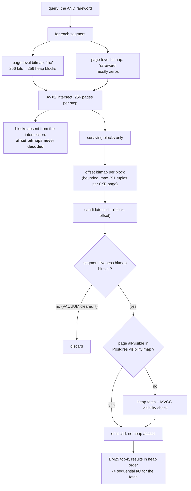

<!--
entry-meta
date: 2026-09-21
type: daily-diff
category: Daily Diff
title: Daily Diff — 2026-09-21
slug: sqlite-freelist-trunk-leaf-pages
-->

# Daily Diff — 2026-09-21

**2026-09-21 · Daily Diff Digest**

**Edition covered: 2026-09-19 (52 stories).** [tdd.cat](https://tdd.cat/) was fetched this run and served the Saturday 2026-09-19 edition as its current one. No 2026-09-20 or 2026-09-21 edition had published at fetch time (03:45 UTC / 09:15 IST). The 2026-09-19 edition is newer than the 2026-09-17 edition covered in [yesterday's digest](../2026-09-20-sqlite-cell-payload-overflow/daily-diff.md), so it is the newest edition not yet covered here.

## The Edition, Point-Wise

**Databases and storage**

- **TIN, a new full-text search index for Postgres** from PlanetScale — boolean, phrase, fuzzy, wildcard and regex matching with BM25 top-*k*, claiming 8×–25× over ParadeDB and orders of magnitude over GIN. Deep dive below.
- **PostgreSQL 19 plan advice** — new modules for pinning a query plan so a regression cannot silently change it. (The linked post at tapoueh.org returned a redirect loop when fetched this run, so it is listed but not analysed.)
- **Virtual memory deep dive for data-intensive systems** — page tables, TLBs and kernel internals from the perspective of a database author.
- **Notion's concurrent editing with CRDTs** — why "last write wins" was not viable for block-structured documents.

**Systems and performance**

- **Benchmarking modern filesystems** — ZFS and Btrfs behaving unexpectedly under specific workloads.
- **Divergent Wild vs Mold linker benchmarks** — David Lattimore on how the *filesystem under the test* changed the result enough to flip the conclusion. A good companion to the item above, and a reminder that benchmark setup is part of the measurement.
- **Mold** — 4.9× faster than LLVM's lld, with a Rust rewrite planned.
- **Rubrol PDF engine** — Rust PDF generation claiming 318× faster and 57× less memory than headless Chrome.
- **MiTeX** — LaTeX→Typst in Rust/WASM, 32,500 equations in 0.1 s.
- **Microsoft ported the Copilot runtime to Rust with AI agents** — 430,000 lines of TypeScript in three weeks, 16× speedup claimed.

**Correctness, security and testing**

- **matklad on custom fuzzers** — domain-specific randomised testing finding bugs that generic fuzzers and unit tests miss. Directly relevant to this track: it is the approach SQLite's own test suite is built on, and Lesson 32 will cover it.
- **Docker hypervisor sandbox escape** (patched) — container to host filesystem via virtio-fs and symlinks.
- **"When the debugger lies"** — KMU/TrustZone interactions on an SoC producing memory values that are simply wrong in the debugger.
- **The ABA problem vs Rust's ownership model** — a visualisation of how `crossbeam-epoch` handles it.
- **DeepSWE benchmark defects** — 37% of tasks claimed to have flaws that produce false model failures.
- **ZK-JPEG** — zero-knowledge proofs of image edits that survive lossy re-encoding.

**AI tooling and the "Jev" cluster**

Roughly a sixth of the edition (items 3, 5, 18, 19, 21, 27, 46) is about one model release, *Jev*, which outputs typed values and calibrated probabilities instead of text. The most useful of them is the sceptical one: an empirical analysis arguing Jev's confidence score is a rescaled top probability — certainty about its own answer, not about correctness. The rest of the cluster (agent governance, MCP proxies, token-inflation audits, agent billing bugs) is the usual shape of the list right now.

**Everything else worth a click**

- **Commodore 64 hits 99.5% on MNIST** with binary neural networks on stock 8-bit hardware.
- **"The senior engineer death spiral"** — overwork and invisibility as a failure mode.
- **Foundational expertise as a prerequisite for durable skill from AI assistance** (NBER) — junior lawyers gained no lasting skill; seniors did.

---

## Deep Dive: TIN — Using `ctid` as the Native Posting Format

Source fetched this run: [planetscale.com/blog/introducing-tin](https://planetscale.com/blog/introducing-tin).

### The idea

Every full-text index needs to map a term to the documents containing it. Almost every implementation invents a dense sequential document ID for this, because dense integers delta-encode well. That invention then costs you two things: a **docid → row** mapping structure, and a **renumbering pass** whenever segments merge.

TIN's claim is that Postgres already has a perfectly good document identifier and everybody has been throwing it away: the `ctid`. As the post puts it — "Every version of every row (tuple) stored in a Postgres table has an associated `ctid` value… the upper 32 bits indicate the block number and the lower 16 indicate the offset within that block."

Using `ctid` directly means:

- **No docid mapping structure at all.** The index returns `ctid`s, which is exactly what a Postgres index access method is supposed to hand back.
- **Postings survive segment merges unchanged.** A posting like `(190, 17)` means the same physical location in every segment, so merging is concatenation rather than renumbering — and compressed blocks can be reused without being decompressed and re-encoded.

### The encoding: two levels of bitmap, not delta lists

A `ctid` is a (block, offset) pair, so TIN encodes it as a pair of bitmaps rather than as a 48-bit integer in a delta chain:

- a **page-level bitmap**, 256 bits wide, saying which heap blocks contain the term;
- a **per-page offset bitmap**, saying which tuple slots within that block contain it.

The offset bitmap is bounded by a physical property of Postgres: "An 8KB page can never contain more than 291 tuples", and in practice "pages often contain 32 or fewer tuples". So the second level is small and fixed-width rather than open-ended.

The reported compression: **~1 bit per posting for high-frequency terms, ~7 bits for medium-frequency, up to ~25 bits for rare terms.** Note the inversion against delta-encoded posting lists, where common terms are the expensive ones — a bitmap gets *cheaper* per posting as the term gets more common, because the bits are already allocated.

### Why the shape pays off at query time

The 256-bit page-level bitmap "fit[s] nicely into vector registers on any x86 CPU with AVX2 or higher". For a conjunction like `the AND rareword`, TIN intersects page-level bitmaps 256 pages at a time; every page absent from the intersection is a page whose offset bitmaps are never decoded. The selective term prunes the frequent term at the block level before any per-tuple work happens.

For `COUNT` over a disjunction, exact posting counts are kept in segment metadata, so TIN "often skips reading postings lists entirely".

### MVCC, which is where full-text indexes usually go wrong

Three mechanisms, layered:

1. **Heap checks** — queries that return columns fetch the matched `ctid`s and let Postgres do ordinary visibility validation.
2. **Visibility-map intersection** — the page-level bitmaps are the same shape as Postgres's visibility map, so they intersect directly, and all-visible pages skip the heap check.
3. **A per-segment liveness bitmap** — "When VACUUM runs and determines a `ctid` has been deleted… TIN clears that `ctid`'s liveness bit."

That third point is the one to notice. Because postings *are* `ctid`s, deletion tracking is a bit-clear in a bitmap the index already has, rather than a tombstone list keyed by a synthetic ID. Writes go to mutable segments that are "less efficient for searches but allow easy insertion of new documents", with background workers promoting and merging them into immutable segments.

### What is claimed, and what to hold back on

On an 85 GB / 150 M-document Stack Exchange corpus: mixed top-10 queries at **199 QPS** versus ParadeDB's 7.9, with GIN going OOM; conjunction/phrase top-10 at 242 QPS versus 24 and 0.4. On an 8.0 GB Wikipedia corpus, a disjunction count ran at **10,260 QPS with 2 ms p99 and 1.7 MB read per query**, against ParadeDB's 291 QPS / 95 ms / 22 MB and GIN's 1.4 QPS / 30 s / 2.5 MB.

These are the vendor's own numbers on the vendor's own corpora, and the read-amplification column (1.7 MB vs 22 MB per query) is doing as much work in the comparison as the QPS column. The mechanism is sound and the `ctid`-as-docid argument is genuinely a structural simplification rather than a tuning trick — but the honest reading is that the architecture is interesting, and the benchmark is marketing until someone reproduces it.

### Why it belongs next to this week's track

The tie to the SQLite track is not incidental. TIN's central move — **stop inventing an identifier, use the one the storage layer already assigns** — is the same trade SQLite makes with rowids and with the overflow-chain `nearby` hint: bind the index to physical layout and you get cheap intersection, cheap merges and sequential I/O, at the cost of coupling the index's efficiency to how the heap is physically laid out. That coupling is exactly what [today's lesson](README.md) measured from the other end: when the physical layout is scrambled by a free-page allocator that hands pages back in array-bookkeeping order, the locality assumption quietly stops paying. A `ctid`-native index inherits whatever order `VACUUM` and the heap leave behind.

## Sources

- [The Daily Diff](https://tdd.cat/) — the 2026-09-19 edition, 52 stories; item titles, descriptions and source links above are from that page as fetched this run.
- [Introducing TIN: fast, full-featured full-text search for Postgres](https://planetscale.com/blog/introducing-tin) — `ctid` as native posting format, the two-level bitmap encoding, the 291-tuples-per-8KB-page bound, the compression figures, AVX2 page-bitmap intersection, the liveness bitmap and VACUUM interaction, and all benchmark numbers quoted above.
- Linked from the edition and cited above but **not fetched** this run: [matklad on finding bugs with custom fuzzers](https://matklad.github.io/2026/09/19/finding-bugs.html), [Wild vs Mold benchmark divergence](https://davidlattimore.github.io/posts/2026/09/18/benchmarking-wild-vs-mold.html), [Notion's CRDT post](https://www.notion.com/blog/how-notion-handles-concurrent-editing-with-crdts), [virtual memory deep dive](https://blog.codingconfessions.com/p/virtual-memory), [Docker hypervisor escape](https://accomplish.ai/blog/escaping-dockers-hypervisor/), [ABA problem visualisation](https://sofiabelen.github.io/projects/visualizing-the-aba-problem/), [mnist64 on the C64](https://github.com/jarnoh/mnist64).
- [PostgreSQL 19 plan advice](https://tapoueh.org/blog/2026/09/plan-advice-in-postgresql-19/) — listed in the edition; the fetch failed this run with a redirect loop, so nothing is claimed about its contents.
