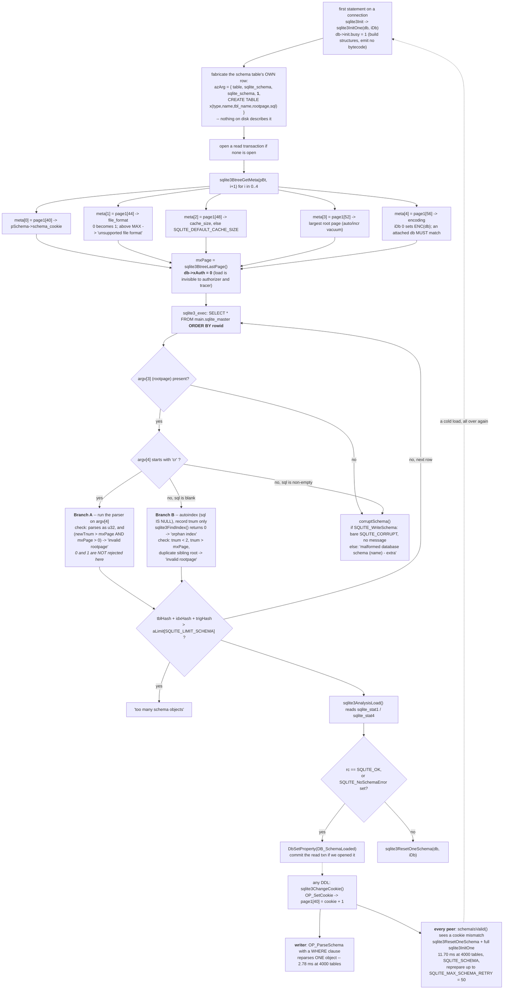
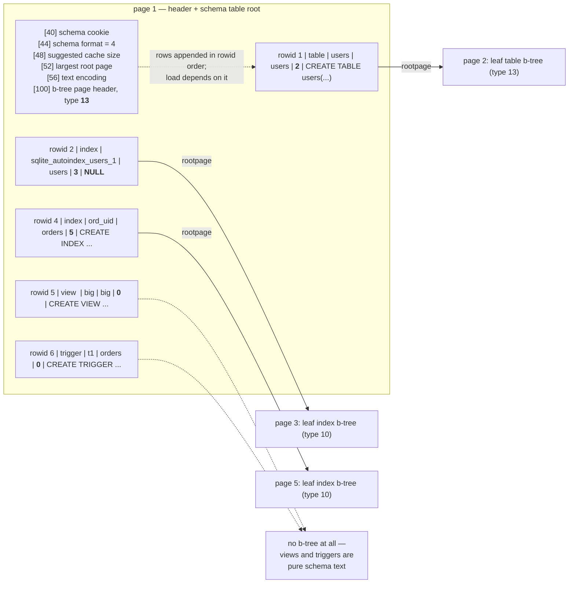

<!--
entry-meta
date: 2026-09-22
type: lesson
track: SQLite
lesson: 07
category: Database Internals
title: The Schema Table — Root Pages, sqlite3InitOne(), and the Cookie That Reparses Everything
slug: sqlite-schema-table-rootpages-initone
-->

# The Schema Table — Root Pages, sqlite3InitOne(), and the Cookie That Reparses Everything

**2026-09-22 · SQLite Track · Lesson 07 of 32**

## Where This Fits

- **Previous lesson:** [Lesson 06](../2026-09-21-sqlite-freelist-trunk-leaf-pages/README.md) built `allocateBtreePage()` and `freePage2()` and closed by noting that root pages are allocated through the same allocator and that `DROP TABLE` returns a whole b-tree to the freelist. [Lesson 01](../2026-09-16-sqlite-file-header-page1-bootstrap/README.md) decoded the page-1 header and left offsets 40, 44, 52, 56 unexplained. [Lesson 02](../2026-09-17-sqlite-varints-serial-types-record-format/README.md) built the record decoder used here to read page 1 without SQLite's help.
- **This lesson:** the one b-tree whose location is a constant — page 1 — and the five-column rows it holds. Where a `rootpage` value comes from, why it is not stable, the exact bytecode that writes a schema row, the five `meta[]` values `sqlite3InitOne()` reads before it reads any row, the three branches of `sqlite3InitCallback()` and the two *different* rootpage validations they apply, why the load query carries `ORDER BY rowid`, and what the schema cookie at `page1[40]` costs every other connection when you type one `CREATE TABLE`.
- **What it explains retroactively:** Lesson 06 §5.1's "a trunk page re-enters service only after every leaf is gone" is visible here as the page numbers handed to two consecutive `CREATE TABLE`s after a `DROP`. Lesson 01's `page1[44] = 4` is the schema format number that `sqlite3InitOne()` refuses to exceed.
- **Next:** Lesson 08 opens the table b-trees these root pages point at — rowids, `INTEGER PRIMARY KEY` aliasing, and `WITHOUT ROWID`. §3 below shows the on-disk tell that distinguishes them; Lesson 08 explains the consequence. Lesson 13 covers the `ptrmap` pages that §11's root-page relocation depends on.

Source references are to `sqlite/sqlite` at commit **`30fbf30`** (`src/prepare.c`, `src/build.c`, `src/vdbe.c`), read through a code index this run — the same commit as Lessons 05 and 06. Measurements are against SQLite **3.45.1** (Python 3.11's bundled library), `page_size = 4096`, `reserved = 0`, matching Lessons 01–06, and cross-checked against **3.53.4** via `apsw` where a version difference is plausible. §5 contains one place where the two versions genuinely differ.

---

## 1. Page 1 Is a Table B-tree, and Its Rows Are the Schema

Every other b-tree in the file has to be found by reading a number out of some other page. Page 1 does not:

> "Page 1 of a database file is the root page of a table b-tree that holds a special table named `sqlite_schema`. This b-tree is known as the 'schema table' since it stores the complete database schema."

That is the bootstrap. Lesson 01's 100-byte header occupies the first 100 bytes of page 1; the b-tree page header starts at offset 100 and is an ordinary Lesson 03 header. Decoding it with the Lesson 02 record reader, with no SQLite involved:

```
page 1 byte at offset 100 = 13        -> leaf table b-tree
```

The row shape is fixed by the format, not by a row in the file:

```sql
CREATE TABLE sqlite_schema(
  type text,
  name text,
  tbl_name text,
  rootpage integer,
  sql text
);
```

> "The `sqlite_schema` table contains one row for each table, index, view, and trigger (collectively 'objects') in the database schema, except there is no entry for the `sqlite_schema` table itself."

**Measured.** Six DDL statements, then page 1 read directly:

| rowid | type | name | tbl_name | rootpage | sql |
|---|---|---|---|---|---|
| 1 | table | `users` | `users` | 2 | `CREATE TABLE users(id INTEGER PRIMARY KEY, email TEXT UNIQUE, …` |
| 2 | index | `sqlite_autoindex_users_1` | `users` | 3 | **`NULL`** |
| 3 | table | `orders` | `orders` | 4 | `CREATE TABLE orders(id INTEGER PRIMARY KEY, uid INT …` |
| 4 | index | `ord_uid` | `orders` | 5 | `CREATE INDEX ord_uid ON orders(uid)` |
| 5 | view | `big` | `big` | **0** | `CREATE VIEW big AS SELECT * FROM orders WHERE amt>100` |
| 6 | trigger | `t1` | `orders` | **0** | `CREATE TRIGGER t1 AFTER INSERT ON orders BEGIN …` |
| 7 | table | `logs` | `logs` | 6 | `CREATE TABLE logs(a INTEGER PRIMARY KEY AUTOINCREMENT, …` |
| 8 | table | `sqlite_sequence` | `sqlite_sequence` | 7 | `CREATE TABLE sqlite_sequence(name,seq)` |

Four things this table proves at a glance, all of them normative:

1. **No row for `sqlite_schema`.** Its location is a constant, so there is nothing to record.
2. **`rootpage` is 0 for views and triggers** — "For rows that define views, triggers, and virtual tables, the rootpage column is 0 or NULL."
3. **`sql` is `NULL` for the autoindex** — "The `sqlite_schema.sql` is NULL for the internal indexes that are automatically created by UNIQUE or PRIMARY KEY constraints." That NULL selects a completely different code path at load time (§7).
4. **`sqlite_sequence` appeared without being asked for**, because `logs` has `AUTOINCREMENT` — "Once created, the `sqlite_sequence` table exists in the `sqlite_schema` table forever; it cannot be dropped."

The `name`/`tbl_name` split is the join key the loader needs: for a table or view `tbl_name` is a copy of `name`; for an index it is the indexed table; for a trigger it is the table that fires it.

## 2. What `rootpage` Actually Points At

`rootpage` is one 4-byte integer that turns a name into a b-tree. What kind of b-tree it points at is not recorded anywhere in the schema row — it is implied by the object, and visible on the target page's first byte (Lesson 03).

**Measured.** A `WITHOUT ROWID` table beside an ordinary one:

| type | name | rootpage | page type byte | b-tree kind |
|---|---|---|---|---|
| table | `k` (`WITHOUT ROWID`) | 2 | **10** | **leaf index** b-tree |
| table | `r` | 3 | 13 | leaf table b-tree |
| index | `sqlite_autoindex_r_1` | 4 | 10 | leaf index b-tree |

A `WITHOUT ROWID` table's row says `type='table'`, and its root page is an *index* b-tree. That is the whole implementation: the table's rows are stored as index keys. Lesson 08 works through what that does to lookups; the point here is that `type` in the schema row is a SQL-level label and carries no information about the on-disk structure.

On the write side the distinction is one opcode argument:

```
/* Opcode: CreateBtree P1 P2 P3 * *
** Synopsis: r[P2]=root iDb=P1 flags=P3
**
** Allocate a new b-tree in the main database file if P1==0 or in the
** TEMP database file if P1==1 or in an attached database if
** P1>1.  The P3 argument must be 1 (BTREE_INTKEY) for a rowid table
** it must be 2 (BTREE_BLOBKEY) for an index or WITHOUT ROWID table.
** The root page number of the new b-tree is stored in register P2.
*/
```

## 3. Root Pages Come Out of Lesson 06's Allocator

`OP_CreateBtree` does not append a page at EOF. It calls `sqlite3BtreeCreateTable()`, which calls `allocateBtreePage()` — the routine from Lesson 06 §5, with `nearby = 0` and `BTALLOC_ANY`. So a root page is an ordinary free page, and `DROP TABLE` puts one back.

**Measured.** Four creates, a drop, then two more creates, watching both the schema rows and the page-1 freelist fields:

| after | root pages | `page_count` | `page1[36]` |
|---|---|---|---|
| `CREATE a, b, c` + `CREATE INDEX bi ON b(x)` | `a=2 b=3 c=4 bi=5` | 5 | 0 |
| `DROP TABLE b` | `a=2 c=4` | 5 | **2** |
| `CREATE TABLE d` | `a=2 c=4 **d=3**` | 5 | 1 |
| `CREATE TABLE e` | `a=2 c=4 d=3 **e=5**` | 5 | 0 |

`DROP TABLE b` freed two pages — the table root and the index root — and the file did not grow again for either of the next two tables. Which page each new table got is Lesson 06's allocator, exactly:

```
after DROP TABLE b: page1[32] head trunk = 5   L = 1   leaves = [3]   page1[36] = 2
```

Page **5** (the *index* root) became the trunk and page **3** (the table root) its single leaf — so `DROP TABLE` freed the index's b-tree before the table's. `CREATE TABLE d` then took leaf slot 0 (page 3), and `CREATE TABLE e` consumed the now-empty trunk itself (page 5), which is Lesson 06 §5.1's `k==0` branch. Two DDL statements, and the allocator's behaviour is fully determined by a deletion order nobody chose deliberately.

## 4. The Write Path, in Bytecode

`EXPLAIN CREATE TABLE t(a INTEGER PRIMARY KEY, b TEXT)` on a database that already has one table (3.45.1, abridged to the interesting opcodes):

```
  1 ReadCookie      0  3  2                                   -- read cookie 2 (file format)
  2 If              3  5                                      -- already stamped? skip
  3 SetCookie       0  2  4                                   -- page1[44] = 4   schema format
  4 SetCookie       0  5  1                                   -- page1[56] = 1   UTF-8
  5 CreateBtree     0  2  1                                   -- r[2] = new root, BTREE_INTKEY
  6 OpenWrite       0  1  0   p4=5                            -- cursor on ROOT PAGE 1
  7 NewRowid        0  1
  8 Blob            6  3                                      -- a zero-length blob
  9 Insert          0  3  1                                   -- the PLACEHOLDER row
 ...
 14 OpenWrite       1  1  0   p4=5
 15 SeekRowid       1 17  1                                   -- find the placeholder again
 18 String8         0  6      'table'
 19 String8         0  7      't'
 20 String8         0  8      't'
 21 Copy            2  9                                      -- r[9] = the root page from step 5
 22 String8         0 10      'CREATE TABLE t(a INTEGER PRIMARY KEY, b TEXT)'
 23 MakeRecord      6  5  4   BBBDB
 24 Delete          1 68  5
 25 Insert          1  4  5                                   -- the real row replaces it
 26 SetCookie       0  1  2                                   -- page1[40] = 2   SCHEMA COOKIE
 27 ParseSchema     0  0  0   p4="tbl_name='t' AND type!='trigger'"
 28 SqlExec         1  0  0   p4=PRAGMA "main".integrity_check('t')
```

Read that against `build.c`:

```c
    /* A slot for the record has already been allocated in the
    ** schema table.  We just need to update that slot with all
    ** the information we've collected.
    */
    assert( pParse->isCreate );
    sqlite3NestedParse(pParse,
      "UPDATE %Q." LEGACY_SCHEMA_TABLE
      " SET type='%s', name=%Q, tbl_name=%Q, rootpage=#%d, sql=%Q"
      " WHERE rowid=#%d",
      ...
      pParse->u1.cr.regRoot,
      zStmt,
      pParse->u1.cr.regRowid
    );
```

`#%d` is not a typo: `"The '#NNN' in the SQL is a special constant that means whatever value is in register NNN. See grammar rules associated with the TK_REGISTER token for additional information."` The root page number does not exist until `OP_CreateBtree` runs, so the schema row is inserted blank first and back-patched from a register. That two-step — `Blob`/`Insert` then `SeekRowid`/`Delete`/`Insert` — is the SQL-level `UPDATE` above, compiled by a nested parse inside the statement that is building the table.

`CREATE INDEX` needs no placeholder, because everything except the root page is known before the b-tree exists, and the root page is in a register by the time the row is built:

```
  2 CreateBtree     0  1  2                       -- BTREE_BLOBKEY
  4 String8         0  3   'index'
  9 NewRowid        0  2
 10 MakeRecord      3  5  8   BBBDB
 11 Insert          0  8  2                       -- one row, no back-patch
 12 SorterOpen      3  0  1   k(2,,)              -- build the index through the sorter
 ...
 29 SetCookie       0  1  2
 30 ParseSchema     0  0  0   p4="name='bi' AND type='index'"
 31 Expire          0  1                          -- invalidate prepared statements
```

Three things worth pinning down:

- **`ParseSchema` carries a `WHERE` clause.** The writer does *not* reparse its whole schema; it reparses the one object it just changed (§9 measures what that saves). `tbl_name='t' AND type!='trigger'` also picks up the table's autoindexes, which is why they must be findable by then.
- **`CREATE INDEX` emits `OP_Expire`, `CREATE TABLE` does not.** `build.c`'s comment at the index path is explicit: *"Fill the index with data and reparse the schema. Code an OP_Expire"*. Adding an index changes query plans for statements that are already compiled; adding a table cannot.
- **`SetCookie 0 2 4` / `SetCookie 0 5 1` stamp the format and encoding lazily** — guarded by `ReadCookie`+`If`, so they fire only on a database that has not been stamped yet. This is the write-side counterpart of the `meta[1]` and `meta[4]` reads in §6.

**One version difference, and I could not trace it to a commit.** 3.45.1 appends `OP_SqlExec` running `PRAGMA "main".integrity_check('t')` after `CREATE TABLE`. 3.53.4 does not emit that opcode at all, and at `30fbf30` the only `OP_SqlExec` on this path is guarded by `TF_HasGenerated`:

```c
    /* Test for cycles in generated columns and illegal expressions
    ** in CHECK constraints and in DEFAULT clauses. */
    if( p->tabFlags & TF_HasGenerated ){
      sqlite3VdbeAddOp4(v, OP_SqlExec, 0x0001, 0, 0,
             sqlite3MPrintf(db, "SELECT*FROM\"%w\".\"%w\"",
                   db->aDb[iDb].zDbSName, p->zName), P4_DYNAMIC);
    }
```

Confirmed on 3.53.4: `CREATE TABLE g(a, b, c AS (a+b))` emits `SqlExec` with `SELECT*FROM"main"."g"`, and a plain table emits none. So the `integrity_check` call was removed somewhere between 3.45.1 and 3.53.4; I did not find the commit.

## 5. `sqlite3InitOne()`: Five Numbers Before Any Row

Nothing above is usable until a connection turns those rows into in-memory `Table`/`Index`/`Trigger` objects. That is `sqlite3InitOne()`, and its first act is to fabricate a schema row for the schema table itself — the one object that has no row on disk:

```c
  azArg[0] = "table";
  azArg[1] = zSchemaTabName = SCHEMA_TABLE(iDb);
  azArg[2] = azArg[1];
  azArg[3] = "1";
  azArg[4] = "CREATE TABLE x(type text,name text,tbl_name text,"
                            "rootpage int,sql text)";
  azArg[5] = 0;
  ...
  sqlite3InitCallback(&initData, 5, (char **)azArg, 0);
```

Note `azArg[3] = "1"` — rootpage 1, hardcoded, and the table name `"x"`: *"The appropriate table name will be inserted automatically by the parser so we can just use the abbreviation 'x' here. The parser will also automatically tag the schema table as read-only."*

Then, before reading a single schema row, it reads five header fields through `sqlite3BtreeGetMeta()`:

```c
  ** Meta values are as follows:
  **    meta[0]   Schema cookie.  Changes with each schema change.
  **    meta[1]   File format of schema layer.
  **    meta[2]   Size of the page cache.
  **    meta[3]   Largest rootpage (auto/incr_vacuum mode)
  **    meta[4]   Db text encoding. 1:UTF-8 2:UTF-16LE 3:UTF-16BE
  ...
  for(i=0; i<ArraySize(meta); i++){
    sqlite3BtreeGetMeta(pDb->pBt, i+1, (u32 *)&meta[i]);
  }
```

Those map onto Lesson 01's header, one for one:

| `meta[i]` | page-1 offset | used for |
|---|---|---|
| `meta[0]` | 40 | cached as `pSchema->schema_cookie` — the value §8 compares against |
| `meta[1]` | 44 | `pSchema->file_format`; `0` is coerced to `1`, `> SQLITE_MAX_FILE_FORMAT` is `"unsupported file format"` |
| `meta[2]` | 48 | `pDb->pSchema->cache_size`, falling back to `SQLITE_DEFAULT_CACHE_SIZE`, then `sqlite3BtreeSetCacheSize()` |
| `meta[3]` | 52 | largest root page, auto/incremental vacuum (Lesson 13) |
| `meta[4]` | 56 | text encoding — sets `ENC(db)` for `iDb==0`, and must *match* it for an attached db |

**Measured** on a freshly created file, read straight out of the header:

```
meta[1] file_format   (page1[44]) = 4
meta[2] cache size    (page1[48]) = 0     -> falls back to SQLITE_DEFAULT_CACHE_SIZE
meta[3] largest root  (page1[52]) = 0     -> no ptrmap pages, auto_vacuum unavailable
meta[4] text encoding (page1[56]) = 1     -> UTF-8
```

Two behaviours fall out of this ordering that are worth knowing:

- **The encoding of the main database wins, and an attached database that disagrees is rejected** with `"attached databases must use the same text encoding as main database"`. There is no conversion path.
- **`meta[1]` is checked against a compile-time ceiling before any row is parsed,** so a file from a future format fails at open with a clear message rather than mid-query.

Then the load itself:

```c
  initData.mxPage = sqlite3BtreeLastPage(pDb->pBt);
  {
    char *zSql;
    zSql = sqlite3MPrintf(db,
        "SELECT*FROM\"%w\".%s ORDER BY rowid",
        db->aDb[iDb].zDbSName, zSchemaTabName);
#ifndef SQLITE_OMIT_AUTHORIZATION
    {
      sqlite3_xauth xAuth;
      xAuth = db->xAuth;
      db->xAuth = 0;
#endif
      rc = sqlite3_exec(db, zSql, sqlite3InitCallback, &initData, 0);
```

An ordinary `sqlite3_exec()` of an ordinary `SELECT`, against the schema table, with the authorizer switched off around it and `db->init.busy` set so that the parser builds structures instead of emitting code.

**Measured — the authorizer really is bypassed.** An `apsw` authorizer that logs every call, on a connection whose schema is not yet loaded:

```
first statement (schema not yet loaded):
  authorizer calls: [(21, None, None), (20, 't', 'a'), (20, 't', 'b')]
explicit user read of sqlite_master:
  authorizer calls: [(21, None, None), (20, 'sqlite_master', 'name')]
```

`21` is `SQLITE_SELECT`, `20` is `SQLITE_READ`. The schema-loading statement produced reads for `t.a` and `t.b` and **not one read of `sqlite_master`**, while a user query on `sqlite_master` produces one. An authorizer cannot see, or refuse, the schema load. `SQLITE_TRACE_STMT` cannot see it either — tracing the first statement on a cold connection yields only `'SELECT * FROM t'`.

## 6. `sqlite3InitCallback()`: Three Branches, Two Different Rootpage Checks

Each row arrives as five strings:

```c
**     argv[0] = type of object: "table", "index", "trigger", or "view".
**     argv[1] = name of thing being created
**     argv[2] = associated table if an index or trigger
**     argv[3] = root page number for table or index. 0 for trigger or view.
**     argv[4] = SQL text for the CREATE statement.
```

and is routed by whether `argv[4]` starts with the letters `cr`:

```c
  if( argv[3]==0 ){
    corruptSchema(pData, argv, 0);
  }else if( argv[4]
         && 'c'==sqlite3UpperToLower[(unsigned char)argv[4][0]]
         && 'r'==sqlite3UpperToLower[(unsigned char)argv[4][1]] ){
```

with a comment that explains why two characters are enough:

> "No other valid SQL statement, other than the variable CREATE statements, can begin with the letters 'C' and 'R'. Thus, it is not possible run any other kind of statement while parsing the schema, even a corrupt schema."

**Branch A — `sql` starts with `CR`:** run the parser on `argv[4]`. With `db->init.busy` set, *"no VDBE code is generated or executed. All the parser does is build the internal data structures."* The root page is handed to the parser through `db->init.newTnum`, validated like this:

```c
    if( sqlite3GetUInt32(argv[3], &db->init.newTnum)==0
     || (db->init.newTnum>pData->mxPage && pData->mxPage>0)
    ){
      if( sqlite3Config.bExtraSchemaChecks ){
        corruptSchema(pData, argv, "invalid rootpage");
      }
    }
```

**Branch B — `sql` is blank:** the autoindex case. The `Index` object already exists (the `CREATE TABLE` in branch A built it), so all this does is record the root page — and it validates much harder:

```c
    Index *pIndex;
    pIndex = sqlite3FindIndex(db, argv[1], db->aDb[iDb].zDbSName);
    if( pIndex==0 ){
      corruptSchema(pData, argv, "orphan index");
    }else
    if( sqlite3GetUInt32(argv[3],&pIndex->tnum)==0
     || pIndex->tnum<2
     || pIndex->tnum>pData->mxPage
     || sqlite3IndexHasDuplicateRootPage(pIndex)
    ){
      if( sqlite3Config.bExtraSchemaChecks ){
        corruptSchema(pData, argv, "invalid rootpage");
      }
    }
```

**Branch C —** neither, and `argv[1]==0` or `argv[4]` is non-empty: straight to `corruptSchema()`.

Compare the two rootpage checks. Branch B rejects `tnum < 2`, rejects a root page shared with a sibling index, and compares against `mxPage` unconditionally. Branch A rejects neither `0` nor `1`, and only compares against `mxPage` when `mxPage > 0`. That asymmetry is measurable.

**Measured.** Each database is patched through `PRAGMA writable_schema=ON`, closed, reopened, and queried:

| patch | result on reopen |
|---|---|
| explicit index, `rootpage=9999` (> `mxPage`) | `malformed database schema (ti) - invalid rootpage` |
| explicit index, `rootpage=0` | **loads; `SELECT * FROM t` returns the row** |
| explicit index, `rootpage=1` | **loads; `SELECT * FROM t` returns the row** |
| explicit index, `rootpage=1`, query that *uses* the index | `EXPLAIN QUERY PLAN` → `SEARCH t USING COVERING INDEX ti (a=?)`, then `database disk image is malformed` |
| autoindex, `rootpage=1` | `malformed database schema (sqlite_autoindex_t_1) - invalid rootpage` |
| autoindex renamed to `sqlite_autoindex_NOSUCH_1` | `malformed database schema (sqlite_autoindex_NOSUCH_1) - orphan index` |

So: an explicit index pointing at **page 1 — the schema table itself —** loads without complaint, survives any query the planner solves without it, and fails as a run-time `SQLITE_CORRUPT` the first time a plan actually opens it. The same value in an autoindex row is caught at load. Both branches are guarded by `sqlite3Config.bExtraSchemaChecks`, so even the check that does exist is defeatable.

The error strings themselves come from `corruptSchema()`, and its *first* branch is the reason `PRAGMA writable_schema` changes the outcome:

```c
  }else if( db->flags & SQLITE_WriteSchema ){
    pData->rc = SQLITE_CORRUPT_BKPT;
  }else{
    char *z;
    const char *zObj = azObj[1] ? azObj[1] : "?";
    z = sqlite3MPrintf(db, "malformed database schema (%s)", zObj);
    if( zExtra && zExtra[0] ) z = sqlite3MPrintf(db, "%z - %s", z, zExtra);
```

**Measured** on the same `rootpage=9999` file:

```
writable_schema=False -> DatabaseError: malformed database schema (ti) - invalid rootpage
writable_schema=True  -> OK
```

The query *succeeds* with `writable_schema=ON`, because that pragma also sets the flag behind this hack at the end of `sqlite3InitOne()`:

```c
  if( rc==SQLITE_OK || ((db->flags&SQLITE_NoSchemaError) && rc!=SQLITE_NOMEM)){
    /* Hack: If the SQLITE_NoSchemaError flag is set, then consider
    ** the schema loaded, even if errors (other than OOM) occurred. ...
    ** The primary purpose of this is to allow access to the sqlite_schema
    ** table even when its contents have been corrupted.
    */
    DbSetProperty(db, iDb, DB_SchemaLoaded);
    rc = SQLITE_OK;
  }
```

That is the recovery escape hatch, and it is also why `writable_schema=ON` is the wrong setting to leave on: a corrupt schema stops announcing itself.

## 7. Why the Load Query Says `ORDER BY rowid`

`ORDER BY rowid` looks decorative. It is load-bearing: branch B in §6 requires that the `CREATE TABLE` which built the `Index` object has *already* been parsed, and rowid order is the only thing guaranteeing that, because SQLite always appends schema rows (`OP_NewRowid`) and never reuses a lower rowid for a later object.

**Measured.** A table and its index, with their rowids swapped so the index row sorts first:

```
normal order  : [(1, 'table', 't'), (2, 'index', 'ti')]
swapped order : [(100, 'index', 'ti'), (101, 'table', 't')]
reopen + query: DatabaseError: malformed database schema (ti) - no such table: main.t
```

The index here has real `sql` text, so it took branch A, the parser ran `CREATE INDEX ti ON t(a)` before `t` existed, and the failure surfaces as `no such table` wrapped in `malformed database schema`. Give the same treatment to an autoindex and you get branch B's `orphan index` instead. Either way the file is unreadable, and nothing about it is corrupt at the b-tree level — every page is intact and every row decodes. **`sqlite_schema` has an ordering invariant that is not expressible in its own schema and is not checked by `PRAGMA integrity_check`; it is enforced only by never writing rows out of order.**

## 8. The Cookie at `page1[40]`, and What It Costs Everyone Else

`page1[40]` is the schema cookie:

> "The schema cookie is a 4-byte big-endian integer at offset 40 that is incremented whenever the database schema changes. A prepared statement is compiled against a specific version of the database schema. When the database schema changes, the statement must be reprepared."

It is incremented by `sqlite3ChangeCookie()`, from the in-memory value, not from the file:

```c
void sqlite3ChangeCookie(Parse *pParse, int iDb){
  ...
  sqlite3VdbeAddOp3(v, OP_SetCookie, iDb, BTREE_SCHEMA_VERSION,
                   (int)(1+(unsigned)db->aDb[iDb].pSchema->schema_cookie));
}
```

**Measured**, `PRAGMA schema_version` beside a direct read of `page1[40]`:

| statement | `PRAGMA schema_version` | `page1[40]` |
|---|---|---|
| (after `CREATE TABLE seed`) | 1 | 1 |
| `CREATE TABLE t(a,b)` | 2 | 2 |
| `CREATE INDEX i ON t(a)` | 3 | 3 |
| `INSERT INTO t VALUES(1,2)` | 3 | 3 |
| `UPDATE t SET b=3` | 3 | 3 |
| `DELETE FROM t` | 3 | 3 |
| `CREATE VIEW v …` | 4 | 4 |
| `DROP VIEW v` | 5 | 5 |
| `ALTER TABLE t ADD COLUMN z` | 6 | 6 |
| `ALTER TABLE t RENAME TO t2` | 7 | 7 |
| `CREATE TABLE w(a INTEGER PRIMARY KEY AUTOINCREMENT, b)` | **8** | **8** |
| `VACUUM` | **9** | **9** |
| `PRAGMA user_version=9` | 9 | 9 |
| `ANALYZE` | **10** | **10** |

Exactly one increment per DDL *statement*, not per object: the `AUTOINCREMENT` table also created `sqlite_sequence` and the cookie still moved by one. DML never touches it. Three entries are worth noticing:

- **`VACUUM` bumps it** even though the schema text is byte-identical afterwards — because `VACUUM` rebuilds the file and every `rootpage` changes.
- **`ANALYZE` bumps it**, because it creates `sqlite_stat1`.
- **`PRAGMA user_version` does not**, confirming `page1[60]` is genuinely unused by SQLite.

The read side is `schemaIsValid()`, run when a prepare needs checking:

```c
    sqlite3BtreeGetMeta(pBt, BTREE_SCHEMA_VERSION, (u32 *)&cookie);
    ...
    if( cookie!=db->aDb[iDb].pSchema->schema_cookie ){
      if( DbHasProperty(db, iDb, DB_SchemaLoaded) ) pParse->rc = SQLITE_SCHEMA;
      sqlite3ResetOneSchema(db, iDb);
    }
```

A mismatch throws away **the entire schema for that database** and returns `SQLITE_SCHEMA`, which `sqlite3_step()` handles by recompiling, bounded:

```c
/*
** The maximum number of times that a statement will try to reparse
** itself before giving up and returning SQLITE_SCHEMA.
*/
#ifndef SQLITE_MAX_SCHEMA_RETRY
# define SQLITE_MAX_SCHEMA_RETRY 50
#endif
```

```c
  while( (rc = sqlite3Step(v))==SQLITE_SCHEMA
         && cnt++ < SQLITE_MAX_SCHEMA_RETRY ){
```

Note what is *not* granular: the cookie is one counter for the whole database. There is no way to learn that only one table changed, so `sqlite3ResetOneSchema()` plus a full `sqlite3InitOne()` is the only response available to a reader.

**Measured — `PRAGMA schema_version` is writable, and that is enough on its own:**

```
after PRAGMA schema_version=4242 on connection a:
  page1[40] = 4242
  connection b's next query still works -> b reparsed its whole schema
```

No DDL, no data change; one pragma, and every other connection re-reads and re-parses everything.

## 9. What the Schema Costs

**Loading it is linear in the number of objects, and it is paid on the first statement of every connection.** `1`…`4000` tables, each `(a INTEGER PRIMARY KEY, b TEXT, c REAL)`, median of 7 runs:

| tables | schema rows | file size | open + first statement | second statement | per object |
|---|---|---|---|---|---|
| 1 | 1 | 8 KiB | 0.054 ms | 0.008 ms | 53.8 µs |
| 10 | 10 | 44 KiB | 0.056 ms | 0.007 ms | 5.60 µs |
| 100 | 100 | 412 KiB | 0.239 ms | 0.008 ms | 2.39 µs |
| 500 | 500 | 2.0 MiB | 1.024 ms | 0.009 ms | 2.05 µs |
| 1000 | 1000 | 4.0 MiB | 2.094 ms | 0.009 ms | 2.09 µs |
| 2000 | 2000 | 8.0 MiB | 4.403 ms | 0.010 ms | 2.20 µs |
| 4000 | 4000 | 16.0 MiB | **9.659 ms** | 0.012 ms | **2.41 µs** |

Flat at roughly **2.1–2.4 µs per schema object** from 100 objects up — the cost of running the parser over one `CREATE TABLE` and hashing the result. The second statement is ~0.01 ms, so the whole figure is `sqlite3InitOne()`, not query work.

**And the whole of it is re-paid whenever anyone else runs one DDL statement:**

| tables | warm `SELECT` | first `SELECT` after a foreign `CREATE TABLE` | ratio |
|---|---|---|---|
| 100 | 0.011 ms | 0.378 ms | 36x |
| 1000 | 0.009 ms | 2.552 ms | 272x |
| 4000 | 0.010 ms | **11.699 ms** | **1194x** |

The reload figure tracks the cold-load figure almost exactly (11.70 ms vs 9.66 ms), which is the point: `sqlite3ResetOneSchema()` + `sqlite3InitOne()` is a cold load. Nothing is retained.

**The writer, meanwhile, gets off lightly**, because `OP_ParseSchema` carries a `WHERE` clause (§4):

| tables | `CREATE TABLE` on the writer | next `SELECT` on a peer |
|---|---|---|
| 100 | 1.228 ms | 0.305 ms |
| 1000 | 1.434 ms | 2.506 ms |
| 4000 | **2.778 ms** | **11.849 ms** |

The writer's cost grows from 1.23 ms to 2.78 ms across a 40x schema — it is dominated by the commit, not by schema work, because it reparses one object. The peer's cost grows 39x, linearly. Below ~1000 objects the writer is actually the slower of the two; above it, the asymmetry is the story. **A schema migration that runs 20 `ALTER TABLE`s against a 4000-object database charges a busy pool of 50 connections roughly 20 × 50 × 11.7 ms ≈ 11.7 seconds of pure reparsing** that appears in no query plan and in no slow-query log.

## 10. Root Pages Are Not Stable

Under `auto_vacuum`, freeing pages moves other pages, and a moved page might be somebody's root. `build.c` handles that by rewriting `sqlite_schema` from inside the `DROP`:

```c
  /* The "#NNN" in the SQL is a special constant that means whatever value
  ** is in register NNN.  See grammar rules associated with the TK_REGISTER
  ** token for additional information.
  */
  sqlite3NestedParse(pParse,
     "UPDATE %Q." LEGACY_SCHEMA_TABLE
     " SET rootpage=%d WHERE #%d AND rootpage=#%d",
     pParse->db->aDb[iDb].zDbSName, iTable, r1, r1);
```

**Measured.** Four tables `a`,`b`,`c`,`d` with 200 rows each, then `DROP TABLE b`:

| mode | before | after `DROP TABLE b` |
|---|---|---|
| `auto_vacuum=0` | `a=2 b=3 c=4 d=5`, `page1[52]=0`, 5 pages | `a=2 c=4 d=5`, 5 pages, freelist 1 |
| `auto_vacuum=1` | `a=3 b=4 c=5 d=6`, `page1[52]=6`, 6 pages | `a=3 c=5 **d=4**`, `page1[52]=5`, **5 pages**, freelist 0 |

Two separate effects:

1. **Every root page is one higher under `auto_vacuum`**, because page 2 becomes the first `ptrmap` page (Lesson 13).
2. **`d`'s root page changed from 6 to 4** as a side effect of dropping an unrelated table. The last root page was relocated into the hole, `page1[52]` fell from 6 to 5, the file shrank, and the freelist stayed empty — Lesson 06 §11's `auto_vacuum=full` behaviour, now visible in the schema.

So `rootpage` is a cache of a physical location that another transaction may move. Anything that reads `sqlite_schema.rootpage` and remembers it — a forensic tool, a page-level replicator, a hand-rolled reader like the one in this lesson's Hands-On — must re-read it after any DDL and, under `auto_vacuum`, after any `DROP`.

## 11. The Whole Picture



And the on-disk shape it all rests on:



## Hands-On

Needs `python3`. Parts 3 and 5 additionally want `apsw` (`pip install apsw --break-system-packages`); the rest works without it. The reader below only handles what page 1 needs, and deliberately does not use SQLite to read the schema.

```bash
mkdir -p ~/sqlite-schema && cd ~/sqlite-schema
cat > sch.py <<'PY'
import struct

def varint(b, off):
    v = 0
    for i in range(9):
        c = b[off+i]
        if i == 8: return (v << 8) | c, off+9
        v = (v << 7) | (c & 0x7f)
        if not (c & 0x80): return v, off+i+1

def stoi(b):
    n = int.from_bytes(b, 'big')
    return n - (1 << (8*len(b))) if (b and b[0] & 0x80) else n

SZ = {1:1, 2:2, 3:3, 4:4, 5:6, 6:8}

def decode_record(pl):                      # Lesson 02
    hlen, off = varint(pl, 0)
    types, p = [], off
    while p < hlen:
        t, p = varint(pl, p); types.append(t)
    out, d = [], hlen
    for t in types:
        if t == 0: out.append(None)
        elif t in SZ: n = SZ[t]; out.append(stoi(pl[d:d+n])); d += n
        elif t == 7: out.append(struct.unpack('>d', pl[d:d+8])[0]); d += 8
        elif t == 8: out.append(0)
        elif t == 9: out.append(1)
        elif t >= 12 and t % 2 == 0:
            n = (t-12)//2; out.append(pl[d:d+n]); d += n
        else:
            n = (t-13)//2; out.append(pl[d:d+n].decode('utf-8','replace')); d += n
    return out

class DB:
    def __init__(self, path):
        self.raw = open(path,'rb').read()
        self.ps = ((self.raw[16]<<8) | (self.raw[17]<<16)) or 65536
        self.usable = self.ps - self.raw[20]
    def page(self, n): return self.raw[(n-1)*self.ps : n*self.ps]
    def u32(self, off): return struct.unpack('>I', self.raw[off:off+4])[0]
    def meta(self):
        return dict(page_count=self.u32(28), freelist_first=self.u32(32),
                    freelist_n=self.u32(36), schema_cookie=self.u32(40),
                    schema_format=self.u32(44), cache_size=self.u32(48),
                    largest_root=self.u32(52), text_encoding=self.u32(56),
                    user_version=self.u32(60), incr_vacuum=self.u32(64))
    def cells(self, pgno):                   # Lesson 03 + Lesson 05 overflow
        d = self.page(pgno); off = 100 if pgno == 1 else 0
        typ = d[off]; ncell = struct.unpack('>H', d[off+3:off+5])[0]
        hsz = 12 if typ in (2,5) else 8
        ptrs = [struct.unpack('>H', d[off+hsz+2*i: off+hsz+2+2*i])[0] for i in range(ncell)]
        if typ == 5:
            for p in ptrs: yield from self.cells(struct.unpack('>I', d[p:p+4])[0])
            yield from self.cells(struct.unpack('>I', d[off+8:off+12])[0])
        elif typ == 13:
            U, X = self.usable, self.usable - 35
            for p in ptrs:
                sz, q = varint(d, p); rid, q = varint(d, q)
                if sz <= X:
                    yield rid, d[q:q+sz]; continue
                M = ((U-12)*32//255)-23
                K = M + ((sz-M) % (U-4))
                nloc = K if K <= X else M
                buf = bytearray(d[q:q+nloc]); nxt = struct.unpack('>I', d[q+nloc:q+nloc+4])[0]
                while nxt and len(buf) < sz:
                    op = self.page(nxt)
                    buf += op[4:4+min(U-4, sz-len(buf))]
                    nxt = struct.unpack('>I', op[0:4])[0]
                yield rid, bytes(buf)
    def schema_rows(self):
        return [(rid, decode_record(pl)) for rid, pl in self.cells(1)]
    def roots(self):
        return {r[1]: r[3] for _, r in self.schema_rows()}
PY
```

**Part 1 — read the schema without SQLite, and identify each root page's b-tree kind.**

```bash
python3 - <<'PY'
from sch import DB
import sqlite3, os
if os.path.exists('a.db'): os.remove('a.db')
c = sqlite3.connect('a.db', isolation_level=None)
c.execute('PRAGMA page_size=4096')
for s in ['CREATE TABLE users(id INTEGER PRIMARY KEY, email TEXT UNIQUE, name TEXT)',
          'CREATE TABLE orders(id INTEGER PRIMARY KEY, uid INT, amt REAL)',
          'CREATE INDEX ord_uid ON orders(uid)',
          'CREATE VIEW big AS SELECT * FROM orders WHERE amt>100',
          'CREATE TRIGGER t1 AFTER INSERT ON orders BEGIN UPDATE users SET name=name; END',
          'CREATE TABLE k(a TEXT PRIMARY KEY, b) WITHOUT ROWID',
          'CREATE TABLE logs(a INTEGER PRIMARY KEY AUTOINCREMENT, b TEXT)',
          'INSERT INTO logs(b) VALUES("x")']:
    c.execute(s)
c.close()
db = DB('a.db')
print('page 1 byte at offset 100 =', db.page(1)[100], '(13 = leaf table b-tree)')
print('meta:', db.meta())
KIND = {2:'interior index', 5:'interior table', 10:'leaf index', 13:'leaf table'}
for rid, (t, n, tn, rp, sql) in db.schema_rows():
    b = db.page(rp)[0] if rp else None
    print(f'{rid:>3} {t:<8} {n:<26} {tn:<16} root={str(rp):>3}  page type={str(b):>4} {KIND.get(b,"-")}  sql={"NULL" if sql is None else sql[:34]+"..."}')
PY
```

**What to look for:** no row names `sqlite_schema`; `rootpage` is 0 for the view and the trigger; `sql` is `NULL` for `sqlite_autoindex_users_1`; `sqlite_sequence` is present because of `AUTOINCREMENT`; and `k`, a `type='table'` row, points at a page whose type byte is **10** — an index b-tree. Change `page_size` and re-run; every root page number changes and nothing else does.

**Part 2 — watch root pages come out of Lesson 06's freelist.**

```bash
python3 - <<'PY'
from sch import DB
import sqlite3, os, struct
if os.path.exists('r.db'): os.remove('r.db')
c = sqlite3.connect('r.db', isolation_level=None)
c.execute('PRAGMA page_size=4096')
def show(label):
    db = DB('r.db'); m = db.meta()
    line = f'  {label:<22} roots={db.roots()}  pages={m["page_count"]} freelist={m["freelist_n"]}'
    if m['freelist_first']:
        d = db.page(m['freelist_first']); L = struct.unpack('>I', d[4:8])[0]
        line += f'  trunk={m["freelist_first"]} L={L} leaves={[struct.unpack(">I",d[8+4*i:12+4*i])[0] for i in range(L)]}'
    print(line)
for s in ['CREATE TABLE a(x)','CREATE TABLE b(x)','CREATE TABLE c(x)','CREATE INDEX bi ON b(x)']:
    c.execute(s)
show('4 creates')
c.execute('DROP TABLE b');    show('DROP TABLE b')
c.execute('CREATE TABLE d(x)'); show('CREATE TABLE d')
c.execute('CREATE TABLE e(x)'); show('CREATE TABLE e')
c.close()
PY
```

**What to look for:** `DROP TABLE b` frees two pages and the trunk is the *index* root, with the table root as its only leaf — so the index b-tree is freed first. `d` then gets the leaf and `e` gets the trunk page itself (Lesson 06 §5.1), and `page_count` never grows. Reorder the creates and the assignment changes completely for the same set of statements.

**Part 3 — the write path, and whether anything can observe the load.**

```bash
python3 - <<'PY'
import sqlite3, os
if os.path.exists('x.db'): os.remove('x.db')
c = sqlite3.connect('x.db', isolation_level=None); c.execute('CREATE TABLE base(a,b)')
for sql in ['CREATE TABLE t(a INTEGER PRIMARY KEY, b TEXT)', 'CREATE INDEX bi ON base(a)']:
    print('\n==', sql)
    for a, op, p1, p2, p3, p4, p5, _ in c.execute('EXPLAIN ' + sql):
        if op in ('ReadCookie','SetCookie','CreateBtree','OpenWrite','NewRowid','Blob',
                  'Insert','SeekRowid','MakeRecord','Delete','ParseSchema','Expire','SqlExec'):
            print(f'  {a:>3} {op:<12} {p1:>3} {p2:>3} {p3:>3}  {str(p4)[:58]}')
c.close()
PY
python3 - <<'PY'
import apsw, os
if os.path.exists('au.db'): os.remove('au.db')
c = apsw.Connection('au.db'); c.execute('CREATE TABLE t(a,b)'); c.execute('INSERT INTO t VALUES(1,2)'); c.close()
calls = []
c = apsw.Connection('au.db')
c.authorizer = lambda op, a1, a2, db, trig: (calls.append((op, a1, a2)), apsw.SQLITE_OK)[1]
c.execute('SELECT * FROM t').fetchall()
print('cold connection, first statement   ->', calls)   # 21=SELECT 20=READ
calls.clear()
c.execute('SELECT name FROM sqlite_master').fetchall()
print('explicit user read of sqlite_master ->', calls)
seen = []
c.trace_v2(apsw.SQLITE_TRACE_STMT, lambda d: seen.append(d.get('sql')))
c.execute('SELECT count(*) FROM t').fetchall()
print('SQLITE_TRACE_STMT saw              ->', seen)
c.close()
PY
```

**What to look for:** in `CREATE TABLE`, the `Blob`/`Insert` pair followed by `SeekRowid`/`Delete`/`Insert` — the placeholder and its back-patch — then `SetCookie 0 1` and `ParseSchema` whose P4 is a `WHERE` clause. `CREATE INDEX` inserts one row and ends with `Expire`; `CREATE TABLE` does not. In the authorizer run, the cold connection logs reads of `t.a` and `t.b` and **no read of `sqlite_master`**, while the explicit query logs one: the schema load runs with `db->xAuth = 0` and is invisible to both the authorizer and the statement tracer.

**Part 4 — break the ordering invariant, and probe the two rootpage checks.**

```bash
python3 - <<'PY'
from sch import DB
import sqlite3, os
def mk(f, ddl, patch):
    if os.path.exists(f): os.remove(f)
    c = sqlite3.connect(f, isolation_level=None); c.execute('PRAGMA page_size=4096')
    for s in ddl: c.execute(s)
    c.execute('PRAGMA writable_schema=ON')
    for s in patch: c.execute(s)
    c.execute('PRAGMA writable_schema=RESET'); c.close()
def probe(f, queries, pre=()):
    d = sqlite3.connect(f)
    for s in pre: d.execute(s)
    for q in queries:
        try: print(f'    {q[:44]:<46} -> {d.execute(q).fetchall()}')
        except sqlite3.DatabaseError as e: print(f'    {q[:44]:<46} -> {e}')
    d.close()

print('ORDER BY rowid:')
mk('o.db', ['CREATE TABLE t(a,b)','CREATE INDEX ti ON t(a)'],
   ['UPDATE sqlite_schema SET rowid=100 WHERE name="ti"',
    'UPDATE sqlite_schema SET rowid=101 WHERE name="t"'])
print('   rows now:', [(r[0], r[1][0], r[1][1]) for r in DB('o.db').schema_rows()])
probe('o.db', ['SELECT * FROM t'])

print('branch A (explicit index) vs branch B (autoindex):')
for root in (9999, 0, 1):
    mk(f'x{root}.db', ['CREATE TABLE t(a,b)','CREATE INDEX ti ON t(a)','INSERT INTO t VALUES(1,2)'],
       [f'UPDATE sqlite_schema SET rootpage={root} WHERE name="ti"'])
    print(f'  explicit index rootpage={root}')
    probe(f'x{root}.db', ['SELECT * FROM t', 'SELECT a FROM t WHERE a=1'])
mk('ai.db', ['CREATE TABLE t(a UNIQUE, b)','INSERT INTO t VALUES(1,2)'],
   ['UPDATE sqlite_schema SET rootpage=1 WHERE sql IS NULL'])
print('  autoindex rootpage=1'); probe('ai.db', ['SELECT * FROM t'])
mk('ai2.db', ['CREATE TABLE t(a UNIQUE, b)','INSERT INTO t VALUES(1,2)'],
   ['UPDATE sqlite_schema SET name="sqlite_autoindex_NOSUCH_1" WHERE sql IS NULL'])
print('  autoindex renamed');   probe('ai2.db', ['SELECT * FROM t'])
print('  same corrupt file, writable_schema=ON:')
probe('x9999.db', ['SELECT * FROM t'], pre=['PRAGMA writable_schema=ON'])
PY
```

**What to look for:** swapped rowids give `malformed database schema (ti) - no such table: main.t` on a file whose every page is intact. `rootpage=9999` is caught; `rootpage=0` and `rootpage=1` load *fine* and only fail on the query the planner routes through the index (`database disk image is malformed`) — check with `EXPLAIN QUERY PLAN` that it really chose the index. The same `rootpage=1` in an autoindex row is caught at load, and a renamed autoindex gives `orphan index`. Finally, `writable_schema=ON` makes the caught case *succeed*, via the `SQLITE_NoSchemaError` hack.

**Part 5 — price the cookie.**

```bash
python3 - <<'PY'
import sqlite3, os, time, statistics
def build(n):
    f = f'p{n}.db'
    if os.path.exists(f): os.remove(f)
    c = sqlite3.connect(f, isolation_level=None); c.execute('PRAGMA page_size=4096')
    c.execute('BEGIN')
    for i in range(n): c.execute(f'CREATE TABLE t{i}(a INTEGER PRIMARY KEY, b TEXT, c REAL)')
    c.execute('COMMIT'); c.close(); return f
print(f'{"tables":>7} {"cold 1st stmt":>14} {"warm":>9} {"writer DDL":>12} {"peer after DDL":>16}')
for n in (100, 1000, 4000):
    f = build(n)
    cold = []
    for _ in range(7):
        c = sqlite3.connect(f); t0 = time.perf_counter(); c.execute('SELECT * FROM t0')
        cold.append(time.perf_counter()-t0); c.close()
    w = sqlite3.connect(f, isolation_level=None); w.execute('SELECT * FROM t0')
    p = sqlite3.connect(f, isolation_level=None); p.execute('SELECT * FROM t0')
    warm, wd, pd = [], [], []
    for k in range(5):
        t0=time.perf_counter(); p.execute('SELECT * FROM t0'); warm.append(time.perf_counter()-t0)
        t0=time.perf_counter(); w.execute(f'CREATE TABLE q{k}(x)'); wd.append(time.perf_counter()-t0)
        t0=time.perf_counter(); p.execute('SELECT * FROM t0'); pd.append(time.perf_counter()-t0)
    w.close(); p.close()
    m = lambda a: statistics.median(a)*1e3
    print(f'{n:>7} {m(cold):>11.3f} ms {m(warm):>6.3f} ms {m(wd):>9.3f} ms {m(pd):>13.3f} ms')
PY
python3 - <<'PY'
from sch import DB
import sqlite3, os
f='sv.db'
if os.path.exists(f): os.remove(f)
a = sqlite3.connect(f, isolation_level=None); a.execute('CREATE TABLE t(a)'); a.execute('INSERT INTO t VALUES(1)')
b = sqlite3.connect(f, isolation_level=None)
print('b sees', b.execute('SELECT * FROM t').fetchall(), 'cookie', b.execute('PRAGMA schema_version').fetchone()[0])
a.execute('PRAGMA writable_schema=ON'); a.execute('PRAGMA schema_version=4242'); a.execute('PRAGMA writable_schema=OFF')
print('page1[40] =', DB(f).meta()['schema_cookie'], '| b still works:', b.execute('SELECT * FROM t').fetchall())
a.close(); b.close()
PY
```

**What to look for:** the cold-load column and the peer-after-DDL column should be within ~20% of each other at every size — proof that a foreign DDL buys a peer a full cold load, not an incremental update. The writer's DDL column should stay nearly flat while the peer's grows linearly. Then: one `PRAGMA schema_version=4242`, no schema change at all, and the other connection reparses everything.

## Where This Breaks Down

- **The schema cookie has no granularity.** One 32-bit counter covers every object in a database. `schemaIsValid()` can only tell that *something* changed, so the response is `sqlite3ResetOneSchema()` and a full reparse. Measured: 11.70 ms on a 4000-table schema, versus a 0.010 ms warm query — 1194x, for a `CREATE TABLE` on an unrelated object. There is no incremental path for readers, and the writer's `OP_ParseSchema` `WHERE`-clause optimisation is available only to the connection that did the DDL.
- **Schema load is linear in object count and repeated per connection.** 2.1–2.4 µs per object, paid on the first statement, with nothing shared between connections in the default (non-shared-cache) configuration. 4000 objects is ~9.7 ms of pure parsing on every new connection — which makes a connection pool's warm-up cost proportional to schema size, invisible to query-level instrumentation.
- **The cookie wraps, and SQLite accepts that.** `build.c`: *"But schema changes are infrequent and the probability of hitting the same cookie value is only 1 chance in 2^32. So we're safe enough."* It is also user-writable via `PRAGMA schema_version`, so "infrequent" is not enforced.
- **Reprepare is bounded at 50 attempts.** `SQLITE_MAX_SCHEMA_RETRY = 50`; a workload that changes the schema faster than a statement can be recompiled surfaces `SQLITE_SCHEMA` to the application.
- **The two rootpage validations disagree, and the weaker one guards user-created indexes.** Measured: an explicit index with `rootpage=1` — pointing at the schema table — loads without error, answers queries the planner solves without it, and returns `database disk image is malformed` only when a plan opens it. The autoindex path rejects the same value at load because it checks `tnum < 2`. Both are behind `sqlite3Config.bExtraSchemaChecks`.
- **`ORDER BY rowid` is an unchecked structural invariant.** Measured: swapping two rowids produces `malformed database schema (ti) - no such table: main.t` on a file with no b-tree damage. `PRAGMA integrity_check` does not verify schema row order, so a tool that rewrites `sqlite_schema` — or a recovery process that reinserts rows — can produce a file that is bit-perfect at every layer this track has covered so far and still unopenable.
- **`writable_schema=ON` suppresses schema corruption errors.** Measured: the same `rootpage=9999` file errors normally and succeeds with the pragma on, because it also sets `SQLITE_NoSchemaError` and triggers the "consider the schema loaded, even if errors occurred" hack. That is deliberate — it is how you get at a corrupt `sqlite_schema` to repair it — but it means leaving the pragma on converts load-time detection into silent partial schemas.
- **`rootpage` is not stable.** Measured under `auto_vacuum=1`: `DROP TABLE b` moved `d`'s root page from 6 to 4. Anything caching a root page number must invalidate on DDL, and under `auto_vacuum` on any `DROP`.
- **The load is unobservable from the public API.** Measured: no authorizer callback and no `SQLITE_TRACE_STMT` event for the internal `SELECT*FROM"main".sqlite_master ORDER BY rowid`. You cannot audit, rate-limit, or trace schema reads, and the cost does not appear in any statement's statistics.
- **Not verified here.** I did not trigger `"too many schema objects"` — `SQLITE_LIMIT_SCHEMA` is not in the public limit list exposed by `apsw` 3.53.4 (only the 14 documented `SQLITE_LIMIT_*` ids are), so I confirmed that check by reading `prepare.c` only. I did not exhaust `SQLITE_MAX_SCHEMA_RETRY`, did not exercise the attached-database encoding mismatch, and did not test `UTF-16` databases at all. The `sqlite3AnalysisLoad()` step is named in §5's flow but its internals are Lesson 27. The `integrity_check` opcode difference in §4 is an observed behavioural change between 3.45.1 and 3.53.4 that I did not trace to a commit; the `30fbf30` source agrees with 3.53.4.

## Further Study

- [The `sqlite_schema` table](https://www.sqlite.org/schematab.html) — the normative column-by-column reference, the `sqlite_master` / `sqlite_temp_schema` aliases, and the exact normalisation rules applied to the stored `sql` text.
- [SQLite Database File Format, "Storage Of The SQL Database Schema"](https://www.sqlite.org/fileformat2.html) — schema format numbers 1–4 and what each one enables, the `sqlite_sequence` / `sqlite_stat1` / `sqlite_stat4` internal tables, and the "Representation Of SQL Tables / Indices" sections that Lessons 08–09 build on.
- [sqlite/sqlite — `src/prepare.c`](https://github.com/sqlite/sqlite/blob/master/src/prepare.c) — the whole loader in about 500 lines: `sqlite3InitCallback()`, `sqlite3InitOne()`, `sqlite3Init()`, `schemaIsValid()`, `sqlite3Reprepare()`. The shortest interesting file in the source tree.
- [sqlite/sqlite — `src/build.c`](https://github.com/sqlite/sqlite/blob/master/src/build.c) — `sqlite3StartTable()`, `sqlite3EndTable()`, `sqlite3ChangeCookie()`, `sqlite3CreateIndex()`, and the `#NNN` register-substitution trick in the nested-parse SQL.
- [PRAGMA statements](https://www.sqlite.org/pragma.html) — `schema_version`, `writable_schema`, `table_info`, `index_list`, `integrity_check`.

## Next Steps

1. **Write a `sqlite_schema` linter that checks what `integrity_check` does not.** Verify, straight off page 1: rowid order places every index after its table, no two objects share a root page, every non-zero `rootpage` is ≤ `page_count` and ≥ 2, every `rootpage` points at a page whose type byte matches the object kind, and every `type='view'`/`'trigger'` row has `rootpage` 0. §6 and §7 say each of these is reachable without any b-tree damage.
2. **Measure the connection-pool cost of a real migration.** Take an application database, count its schema objects, and compute `objects × 2.2 µs × pool_size × DDL_statements`. Then verify it by timing a pool through an actual migration. §9 predicts the reparse dominates the migration itself above ~1000 objects.
3. **Check whether shared cache changes the picture.** `sqlite3Init()` skips reloading when `DbHasProperty(DB_SchemaLoaded)`, and `sqlite3ReadSchema()` sets `DBFLAG_SchemaKnownOk` only when `db->noSharedCache`. Open the 4000-table database with `cache=shared` across several connections and re-run §9's table.
4. **Find the commit that removed the post-`CREATE TABLE` `integrity_check`.** §4 shows 3.45.1 emitting it and 3.53.4 not. Bisect the release history or search the Fossil timeline, and work out what it was checking and what replaced it.
5. **Trace a root page from schema row to page bytes and back.** Pick a table, read its `rootpage`, hexdump that page, confirm the type byte and cell count, then `VACUUM` and confirm every `rootpage` in the file changed while every page's *content* is equivalent. That is the cleanest demonstration that `rootpage` is a location, not an identity.
6. Open the table b-trees themselves: rowids, `INTEGER PRIMARY KEY` aliasing, and `WITHOUT ROWID`. That is Lesson 08.

## Sources

- [SQLite: The Schema Table](https://www.sqlite.org/schematab.html) — the `CREATE TABLE sqlite_schema(type text, name text, tbl_name text, rootpage integer, sql text)` definition; "The sqlite_schema.type column will be one of the following text strings: 'table', 'index', 'view', or 'trigger'… The 'table' string is used for both ordinary and virtual tables"; "For a table or view, the tbl_name column is a copy of the name column. For an index, the tbl_name is the name of the table that is indexed"; "The sqlite_schema.rootpage column stores the page number of the root b-tree page for tables and indexes. For rows that define views, triggers, and virtual tables, the rootpage column is 0 or NULL"; "The sqlite_schema.sql is NULL for the internal indexes that are automatically created by UNIQUE or PRIMARY KEY constraints"; the `sqlite_master` / `sqlite_temp_schema` / `sqlite_temp_master` aliases; "There is no need for users to modify it under normal circumstances, and they bear the risk of database corruption if they do modify it."
- [SQLite: Database File Format](https://www.sqlite.org/fileformat2.html) — "Page 1 of a database file is the root page of a table b-tree that holds a special table named 'sqlite_schema'"; "The sqlite_schema table contains one row for each table, index, view, and trigger… except there is no entry for the sqlite_schema table itself"; the schema format numbers 1–4 including "New database files created by SQLite use format 4 by default" and format 4's DESC-index and boolean-serial-type additions; offset 40 ("incremented whenever the database schema changes… When the database schema changes, the statement must be reprepared"), offset 48 ("the suggested cache size in pages… The value is a suggestion only"), offset 52 ("if the integer at offset 52 is zero then pointer-map (ptrmap) pages are omitted"), offset 56 ("A value of 1 means UTF-8…"), offset 60 ("the user version… is not used by SQLite"); the internal-schema-object naming rule ("The names of internal schema objects always begin with 'sqlite_'"); `sqlite_sequence`, `sqlite_stat1`, `sqlite_stat4`; the "Representation Of SQL Tables" and "Representation Of SQL Indices" sections, including "the row key is the rowid, and for WITHOUT ROWID tables the row key is the PRIMARY KEY".
- [sqlite/sqlite — `src/prepare.c`](https://github.com/sqlite/sqlite/blob/master/src/prepare.c) — read this run at commit `30fbf30` through a code index: `corruptSchema()` (28–55) including the `SQLITE_WriteSchema` branch and the `azAlterType[]` messages; `sqlite3IndexHasDuplicateRootPage()` (62–68); `sqlite3InitCallback()` (96–200) with the `argv[0..4]` contract, the `'c'`/`'r'` dispatch and its comment, the branch-A and branch-B rootpage checks, and the `SQLITE_LIMIT_SCHEMA` / "too many schema objects" test; `sqlite3InitOne()` (210–450) with the fabricated `azArg[]` schema row, the `meta[0..4]` comment block and `sqlite3BtreeGetMeta()` loop, the encoding and `file_format` handling, the `"SELECT*FROM\"%w\".%s ORDER BY rowid"` query with `db->xAuth = 0` around it, and the `SQLITE_NoSchemaError` "Hack" comment; `sqlite3Init()` (462–477); `sqlite3ReadSchema()` (487–501); `schemaIsValid()` (509–550); `sqlite3SchemaToIndex()` (559–584).
- [sqlite/sqlite — `src/build.c`](https://github.com/sqlite/sqlite/blob/master/src/build.c) — `sqlite3ChangeCookie()` (2113–2119) and the "1 chance in 2^32. So we're safe enough" comment above it plus `IMPLEMENTATION-OF: R-34230-56049`; the `"UPDATE %Q.sqlite_master SET type='%s', name=%Q, tbl_name=%Q, rootpage=#%d, sql=%Q WHERE rowid=#%d"` nested parse (2977–2994) and its "A slot for the record has already been allocated" comment; `sqlite3VdbeAddParseSchemaOp(v, iDb, "tbl_name='%q' AND type!='trigger'")` and the `TF_HasGenerated` `OP_SqlExec` (3013–3023); the root-page-relocation `"UPDATE %Q.sqlite_master SET rootpage=%d WHERE #%d AND rootpage=#%d"` and the `#NNN`/`TK_REGISTER` comment (3372–3386); the `"INSERT INTO %Q.sqlite_master VALUES('index',%Q,%Q,#%d,%Q);"` index row and the "Fill the index with data and reparse the schema. Code an OP_Expire" comment (4532–4550).
- [sqlite/sqlite — `src/vdbe.c`](https://github.com/sqlite/sqlite/blob/master/src/vdbe.c) — the `OP_CreateBtree` header comment and `BTREE_INTKEY`/`BTREE_BLOBKEY` contract (7193–7202); `OP_SqlExec` and its `0x0001` "Disable Auth and Trace callbacks" flag (7226–7264); `OP_ParseSchema` (7275–7362) including the P4 `WHERE`-clause semantics, the ALTER-TABLE `p4.z==0` full-reload path, and the "should parse at least one SQL statement" corruption check.
- [sqlite/sqlite — `src/vdbeInt.h` and `src/vdbeapi.c`](https://github.com/sqlite/sqlite/blob/master/src/vdbeInt.h) — `SQLITE_MAX_SCHEMA_RETRY 50` with its "maximum number of times that a statement will try to reparse itself" comment, and the `while( (rc = sqlite3Step(v))==SQLITE_SCHEMA && cnt++ < SQLITE_MAX_SCHEMA_RETRY )` loop in `sqlite3_step()`.

## Takeaways

- **Page 1 is the one b-tree whose location is a constant,** and `sqlite3InitOne()` bootstraps by *fabricating* the schema row that describes it — `rootpage` hardcoded to `"1"`, table name `"x"` for the parser to replace. Nothing on disk describes the schema table.
- **`rootpage` is a location, not an identity.** It comes out of Lesson 06's `allocateBtreePage()`, so a dropped table's pages are handed to the next `CREATE`; and under `auto_vacuum` a `DROP` relocates other tables' roots and rewrites their schema rows — measured, `d` moved from page 6 to page 4 when `b` was dropped.
- **A schema row is written in two steps** because the root page does not exist when the row is inserted: a zero-length blob placeholder, then a nested-parse `UPDATE … rootpage=#reg WHERE rowid=#reg`, visible as `Blob`/`Insert` then `SeekRowid`/`Delete`/`Insert` in the bytecode.
- **`sqlite3InitOne()` reads five header numbers before any row** — cookie, schema format, cache size, largest root page, text encoding — and two of them can fail the open outright: an unsupported format, or an attached database whose encoding differs from `main`.
- **The loader has two rootpage validators and they disagree.** The autoindex path rejects `tnum < 2` and duplicate sibling roots; the `CREATE …` path rejects neither `0` nor `1`. Measured: an index pointing at page 1 loads cleanly and fails only when a query plan opens it.
- **`ORDER BY rowid` is a real invariant with no checker.** Swapping two schema rowids makes a structurally perfect file unopenable, and `PRAGMA integrity_check` will not tell you why.
- **One `CREATE TABLE` costs every other connection a full cold schema load.** Measured 11.70 ms on a 4000-object schema against a 0.010 ms warm query, matching the 9.66 ms cold-open figure — because the cookie is one counter and the only response is `sqlite3ResetOneSchema()`. The writer pays 2.78 ms, because its `OP_ParseSchema` carries a `WHERE` clause.
- **`PRAGMA schema_version=N` is enough on its own** to make every other connection reparse everything, with no DDL and no data change.
