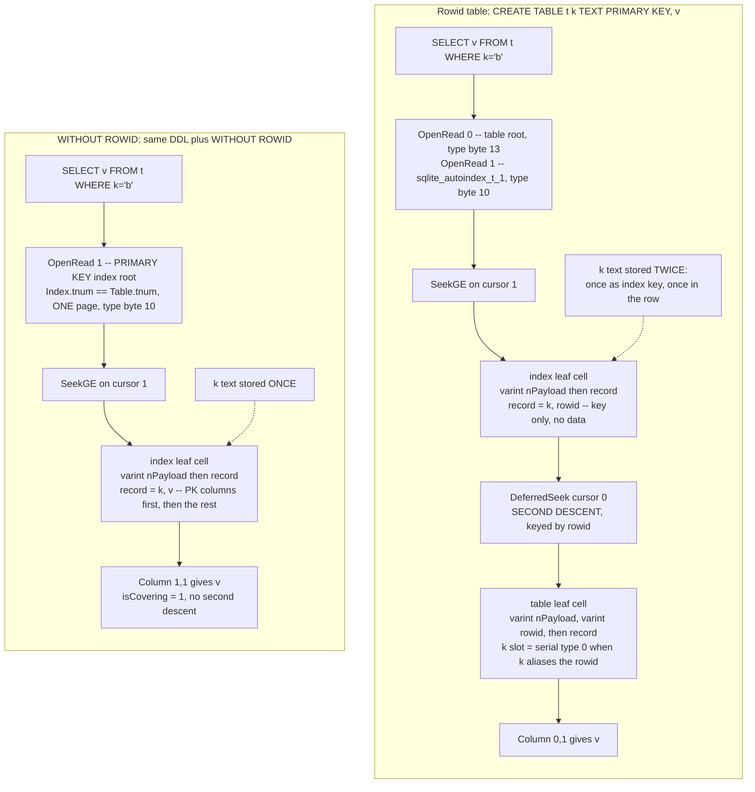
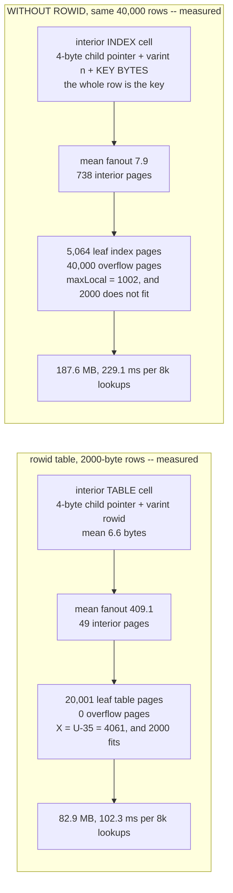

<!--
entry-meta
date: 2026-09-23
type: lesson
track: SQLite
lesson: 08
category: Database Internals
title: Table B-trees — Rowids, INTEGER PRIMARY KEY Aliasing, and WITHOUT ROWID
slug: sqlite-rowid-ipk-without-rowid
-->

# Table B-trees — Rowids, INTEGER PRIMARY KEY Aliasing, and WITHOUT ROWID

**2026-09-23 · SQLite Track · Lesson 08 of 32**

## Where This Fits

- **Previous lesson:** [Lesson 07](../2026-09-22-sqlite-schema-table-rootpages-initone/README.md) established that a schema row's `rootpage` is a location, not an identity, and showed in §2 that a `WITHOUT ROWID` table's row says `type='table'` while its root page's type byte is **10** — a leaf *index* b-tree. It named the consequence and deferred it here. [Lesson 03](../2026-09-18-sqlite-btree-page-header-cell-layouts/README.md) gave the four cell layouts; [Lesson 05](../2026-09-20-sqlite-cell-payload-overflow/README.md) gave `maxLocal`/`maxLeaf` and the overflow chain; [Lesson 02](../2026-09-17-sqlite-varints-serial-types-record-format/README.md) gave the record decoder used throughout.
- **This lesson:** the key. What the 64-bit rowid is and where it physically lives, the four-condition test in `sqlite3AddPrimaryKey()` that decides whether a column *becomes* the rowid, why `INTEGER PRIMARY KEY DESC` and `PRIMARY KEY(x DESC)` disagree (the answer is two lines of grammar, not two lines of C), how `OP_NewRowid` picks a value and what it does at 2^63−1, and the six schema-object edits `convertToWithoutRowidTable()` performs to turn a rowid table into an index b-tree.
- **What it explains retroactively:** Lesson 05's `maxLocal = 1002` versus `maxLeaf = 4061` looks like a footnote until §9, where it is the entire reason a `WITHOUT ROWID` table with 2000-byte rows is 2.26x *larger* and 2.24x *slower* than the rowid table holding the same data. Lesson 03's distinction between table-interior cells (child pointer + rowid) and index-interior cells (child pointer + key) is the measured 409-vs-7.9 fanout gap in §9.
- **Next:** Lesson 09 opens index b-trees proper — key records, sort order, and covering-index lookups. §6 here shows the *shape* of an index record on both table kinds, including the key-suffix suppression rules; Lesson 09 explains how comparison and collation walk it. Lesson 11's `balance()` is what actually splits the pages §9 counts.

Source references are to `sqlite/sqlite` at commit **`30fbf30`** (`src/build.c`, `src/vdbe.c`, `src/insert.c`, `src/parse.y`, `src/sqliteInt.h`), read through a code index this run — the same commit as Lessons 05–07. Measurements are against SQLite **3.45.1** (Python 3.11's bundled library), `page_size = 4096`, `reserved = 0`, matching Lessons 01–07, and cross-checked against **3.53.4** via `apsw` where a version difference is plausible. No behavioural difference between the two was found for anything in this lesson.

---

## 1. The Rowid Is Not in the Record

Lesson 03's table-leaf cell has three parts:

```
varint nPayload | varint rowid | record bytes...
```

The rowid sits in the **cell header**, before the record, and is therefore not a column. That is the whole mechanism, and everything in this lesson follows from it.

> "Except for WITHOUT ROWID tables, all rows within SQLite tables have a 64-bit signed integer key that uniquely identifies the row within its table. This integer is usually called the 'rowid'."

> "Each ordinary SQL table in the database schema is represented on-disk by a table b-tree. Each entry in the table b-tree corresponds to a row of the SQL table. The rowid of the SQL table is the 64-bit signed integer key for each entry in the table b-tree."

**Measured.** Two rows in `CREATE TABLE t(id INTEGER PRIMARY KEY, name TEXT, n INT)`, page 2 read directly with the Lesson 02 decoder:

```
rootpage 2   page type byte 13 (leaf table)   ncell 2

cell@4084: rowid=7  payload_len=10  bytes=04 00 17 01 61 6c 70 68 61 2a
    header: hlen=4, serial types [0, 23, 1]
    decoded: [(0, None), (23, 'alpha'), (1, 42)]

cell@4073: rowid=9  payload_len=9   bytes=04 00 15 01 62 65 74 61 ff
    decoded: [(0, None), (21, 'beta'), (1, -1)]
```

The `id` column is serial type **0** — a NULL, occupying zero bytes of payload. The value 7 appears exactly once in the cell, as the varint rowid. This is normative:

> "When an SQL table includes an INTEGER PRIMARY KEY column (which aliases the rowid) then that column appears in the record as a NULL value. SQLite will always use the table b-tree key rather than the NULL value when referencing the INTEGER PRIMARY KEY column."

So `INTEGER PRIMARY KEY` is not an index and not a constraint implemented by an index. It is a *rename*. `SELECT id` compiles to a read of the b-tree key, which the cursor already holds, and the column costs zero bytes on disk.

The rowid has three built-in spellings — `rowid`, `oid`, `_rowid_` — case-independent, available on every rowid table whether or not a column aliases it.

## 2. The Four-Condition Test

Whether a declared column becomes the rowid is decided in one `if` in `sqlite3AddPrimaryKey()` (`src/build.c` 1934–1938):

```c
  if( nTerm==1
   && pCol
   && pCol->eCType==COLTYPE_INTEGER
   && sortOrder!=SQLITE_SO_DESC
  ){
    ...
    pTab->iPKey = iCol;
    pTab->keyConf = (u8)onError;
    assert( autoInc==0 || autoInc==1 );
    pTab->tabFlags |= autoInc*TF_Autoincrement;
```

Four conditions, each corresponding to a documented rule:

| Condition | Rule it implements |
|---|---|
| `nTerm==1` | single-column primary key only |
| `pCol` | the named column resolved to a real column |
| `pCol->eCType==COLTYPE_INTEGER` | the declared type is *exactly* `INTEGER` |
| `sortOrder!=SQLITE_SO_DESC` | the `DESC` quirk (§3) |

`eCType` is not a string comparison at DDL time. `sqliteInt.h` 2302–2309 interns the six standard type names into small integers:

```c
#define COLTYPE_CUSTOM      0   /* Type appended to zName */
#define COLTYPE_ANY         1
#define COLTYPE_BLOB        2
#define COLTYPE_INT         3
#define COLTYPE_INTEGER     4
#define COLTYPE_REAL        5
#define COLTYPE_TEXT        6
#define SQLITE_N_STDTYPE    6  /* Number of standard types */
```

`INT` and `INTEGER` are *different constants*. That is why the documented rule is as sharp as it is:

> "A PRIMARY KEY column only becomes an integer primary key if the declared type name is exactly 'INTEGER'. Other integer type names like 'INT' or 'BIGINT' or 'SHORT INTEGER' or 'UNSIGNED INTEGER' causes the primary key column to behave as an ordinary table column with integer affinity and a unique index, not as an alias for the rowid."

Note the asymmetry with *affinity*, which this table does not use: `BIGINT` has INTEGER affinity, and by affinity rules is as integer as `INTEGER` is. Affinity governs value coercion; `eCType` governs storage identity. They are separate mechanisms that happen to agree most of the time.

The `else` branches matter too. When the test fails and `AUTOINCREMENT` was requested (1949–1953):

```c
  }else if( autoInc ){
    sqlite3ErrorMsg(pParse, "AUTOINCREMENT is only allowed on an "
       "INTEGER PRIMARY KEY");
```

and otherwise (1954–1957) SQLite falls back to building a real index:

```c
  }else{
    sqlite3CreateIndex(pParse, 0, 0, 0, pList, onError, 0,
                           0, sortOrder, 0, SQLITE_IDXTYPE_PRIMARYKEY);
```

So a failed alias test is not a no-op — it silently costs you a second b-tree.

## 3. Nine Declarations, Measured on Disk

The presence or absence of `sqlite_autoindex_t_1`, and the serial type of column `x` in the record, together settle whether aliasing happened. Same row `(7,'a','b')` inserted into each:

| declaration | extra b-trees | serial type of `x` | page type | alias? |
|---|---|---|---|---|
| `x INTEGER PRIMARY KEY ASC, y, z` | 0 | **0** (NULL) | 13 | **yes** |
| `x INTEGER PRIMARY KEY, y, z` | 0 | **0** | 13 | **yes** |
| `x INTEGER PRIMARY KEY DESC, y, z` | **1** | 1 (int, =7) | 13 | no |
| `x INTEGER, y, z, PRIMARY KEY(x ASC)` | 0 | **0** | 13 | **yes** |
| `x INTEGER, y, z, PRIMARY KEY(x DESC)` | 0 | **0** | 13 | **yes** |
| `x INT PRIMARY KEY, y, z` | **1** | 1 | 13 | no |
| `x BIGINT PRIMARY KEY, y, z` | **1** | 1 | 13 | no |
| `x integer primary key, y, z` | 0 | **0** | 13 | **yes** |
| `x INTEGER PRIMARY KEY, y, z` **WITHOUT ROWID** | 0 | 1 | **10** | no |

Rows 3 and 5 are the documented quirk, and they disagree:

> "The exception mentioned above is that if the declaration of a column with declared type 'INTEGER' includes an 'PRIMARY KEY DESC' clause, it does not become an alias for the rowid and is not classified as an integer primary key. This quirk is not by design. It is due to a bug in early versions of SQLite. But fixing the bug could result in backwards incompatibilities."

### 3.1 Where the bug actually lives

The docs call it a bug without saying where. It is not in `sqlite3AddPrimaryKey()` — that function honours `sortOrder` correctly. It is in the grammar. `src/parse.y` has two productions that both call the same function, and only one of them passes the sort order through:

```
ccons ::= PRIMARY KEY sortorder(Z) onconf(R) autoinc(I).
                                 {sqlite3AddPrimaryKey(pParse,0,R,I,Z);}
...
tcons ::= PRIMARY KEY LP sortlist(X) autoinc(I) RP onconf(R).
                                 {sqlite3AddPrimaryKey(pParse,X,R,I,0);}
```

- The **column-constraint** form (`ccons`) passes `Z`, the parsed `sortorder`. `DESC` reaches the fourth condition and fails it.
- The **table-constraint** form (`tcons`) passes a literal **`0`** (`SQLITE_SO_ASC`) in the `sortOrder` slot, because the per-column sort orders live inside the `sortlist` `X`. The fourth condition can never fail on this path.

That is the entire quirk: one argument position where a constant stands in for a value the parser did have. `PRIMARY KEY(x DESC)` aliases the rowid because the `DESC` never gets to the test — and then `sqlite3AddPrimaryKey()` files the real sort order away in `pParse->iPkSortOrder` (line 1947) for `convertToWithoutRowidTable()` to pick up later. Both branches are reachable, both are tested, and the difference is invisible in the `CREATE TABLE` text unless you know to look at the comma.

Cross-checked on 3.53.4: identical — an autoindex for the `ccons DESC` form and for `INT PRIMARY KEY`, none for the `tcons DESC` form.

### 3.2 What "not an alias" costs

`x INT PRIMARY KEY` gets you, per row:

- the value stored in the record (serial type 1–6, 1–8 bytes) instead of serial type 0 (0 bytes),
- an anonymous rowid in the cell header that nothing references,
- a full second b-tree (`sqlite_autoindex_t_1`) holding `(x, rowid)` for every row,
- a second descent on every lookup by `x` (§7).

One keyword.

## 4. Choosing a Rowid: `OP_NewRowid`

When an `INSERT` supplies no rowid — or supplies NULL for the aliased column — the value comes from `OP_NewRowid` (`src/vdbe.c` 5727–5862). Its own comment states the algorithm:

```c
    /* The next rowid or record number (different terms for the same
    ** thing) is obtained in a two-step algorithm.
    **
    ** First we attempt to find the largest existing rowid and add one
    ** to that.  But if the largest existing rowid is already the maximum
    ** positive integer, we have to fall through to the second
    ** probabilistic algorithm
    **
    ** The second algorithm is to select a rowid at random and see if
    ** it already exists in the table.  If it does not exist, we have
    ** succeeded.  If the random rowid does exist, we select a new one
    ** and try again, up to 100 times.
    */
```

The first step is a single `sqlite3BtreeLast()` — a descent down the rightmost spine, not a scan:

```c
    if( !pC->useRandomRowid ){
      rc = sqlite3BtreeLast(pC->uc.pCursor, &res);
      ...
      if( res ){
        v = 1;   /* IMP: R-61914-48074 */
      }else{
        v = sqlite3BtreeIntegerKey(pC->uc.pCursor);
        if( v>=MAX_ROWID ){
          pC->useRandomRowid = 1;
        }else{
          v++;   /* IMP: R-29538-34987 */
        }
      }
    }
```

Two consequences fall straight out of "largest existing, plus one":

- **It is the largest, not the count.** Insert `(1000,'x')` into an empty table and the next auto rowid is **1001** — measured.
- **Rowids are reused.** Delete the row with the largest rowid and the next insert takes it back. Measured: ids `1,2,3`; `DELETE WHERE id=3`; insert → `1,2,3` again, with the new value in row 3.

> "If you ever delete rows or if you ever create a row with the maximum possible ROWID, then ROWIDs from previously deleted rows might be reused when creating new rows and newly created ROWIDs might not be in strictly ascending order."

`MAX_ROWID` is spelled out defensively (5777–5785), and the comment explaining why is a nice fossil:

```c
#ifdef SQLITE_32BIT_ROWID
#   define MAX_ROWID 0x7fffffff
#else
    /* Some compilers complain about constants of the form 0x7fffffffffffffff.
    ** Others complain about 0x7ffffffffffffffffLL.  The following macro seems
    ** to provide the constant while making all compilers happy.
    */
#   define MAX_ROWID  (i64)( (((u64)0x7fffffff)<<32) | (u64)0xffffffff )
#endif
```

### 4.1 The random path, and the half-range detail

```c
    if( pC->useRandomRowid ){
      assert( pOp->p3==0 );  /* We cannot be in random rowid mode if this is
                             ** an AUTOINCREMENT table. */
      cnt = 0;
      do{
        sqlite3_randomness(sizeof(v), &v);
        v &= (MAX_ROWID>>1); v++;  /* Ensure that v is greater than zero */
      }while(  ((rc = sqlite3BtreeTableMoveto(pC->uc.pCursor, (u64)v,
                                                 0, &res))==SQLITE_OK)
            && (res==0)
            && (++cnt<100));
      if( rc ) goto abort_due_to_error;
      if( res==0 ){
        rc = SQLITE_FULL;   /* IMP: R-38219-53002 */
```

`v &= (MAX_ROWID>>1)` masks to 62 bits, so the random path only ever produces rowids in **the bottom half** of the signed range, `1 .. 2^62`. The upper half is unreachable once you are in this mode. The docs say only "positive candidate ROWIDs at random"; the halving is an implementation detail with a real consequence — it halves the space you are probing for collisions, forever.

**Measured.** Insert one row at 9223372036854775807, then five auto rowids:

```
[2601483179562486928, 4339976030541103267, 2977059043739062081,
 4146305514985583218, 4010820257808850316]
all > 0: True     all <= 2^62: True     strictly ascending: False
```

All five land below 4.62e18 = 2^62, and they are not ordered. Each one costs a full b-tree seek (`sqlite3BtreeTableMoveto`) to test for collision — so a table pinned at `MAX_ROWID` silently converts every insert from one rightmost descent into at least one random-key descent, plus a page split at a random position instead of an append.

### 4.2 `AUTOINCREMENT` is a different opcode argument

`AUTOINCREMENT` does not change `OP_NewRowid`; it populates **P3**:

```
** If P3>0 then P3 is a register in the root frame of this VDBE that holds
** the largest previously generated record number. No new record numbers are
** allowed to be less than this value. When this value reaches its maximum,
** an SQLITE_FULL error is generated. The P3 register is updated with the
** generated record number. This P3 mechanism is used to help implement the
** AUTOINCREMENT feature.
```

and the P3 block (5806–5833) is where the semantics diverge:

```c
      if( pMem->u.i==MAX_ROWID || pC->useRandomRowid ){
        rc = SQLITE_FULL;   /* IMP: R-17817-00630 */
        goto abort_due_to_error;
      }
      if( v<pMem->u.i+1 ){
        v = pMem->u.i + 1;
      }
      pMem->u.i = v;
```

The `|| pC->useRandomRowid` is the load-bearing clause: an `AUTOINCREMENT` table **never** enters the random path. It fails instead.

**Measured**, same starting state (one row at `MAX_ROWID`), one insert:

| table | result |
|---|---|
| `id INTEGER PRIMARY KEY AUTOINCREMENT` | `OperationalError: database or disk is full` (`SQLITE_FULL`) |
| `id INTEGER PRIMARY KEY` | inserted, rowid `1355493973751998879` |

And the monotonic guarantee, measured — ids `1,2,3`, `DELETE WHERE id=3`, insert:

```
ids:             [(1,'a'), (2,'b'), (4,'d')]      <- 3 is not reused
sqlite_sequence: [('t', 4)]
```

The `4` in `sqlite_sequence` is the P3 register's persisted form. Lesson 07 §1 already showed that table appearing unasked-for in `sqlite_schema` the moment an `AUTOINCREMENT` column is created; this is the value it exists to hold.

> "Only ROWID values from previous transactions that were committed are considered. ROWID values that were rolled back are ignored and can be reused."

### 4.3 The rowid is typed, unlike every other column

> "Unlike normal SQLite columns, an integer primary key or rowid column must contain integer values. Integer primary key or rowid columns are not able to hold floating point values, strings, BLOBs, or NULLs."

This is the one place SQLite is statically typed without `STRICT`, and it has to be — the cell header field is a varint, not a serial type.

**Measured**, `INSERT INTO t VALUES(<v>,'v')` on `id INTEGER PRIMARY KEY`:

| value | result |
|---|---|
| `'abc'` | `datatype mismatch` |
| `3.5` | `datatype mismatch` |
| `3.0` | accepted → stored as `(3, 'integer')` |
| `x'00'` | `datatype mismatch` |
| `'42'` | accepted → stored as `(42, 'integer')` |

`3.0` and `'42'` pass because they convert losslessly; `3.5` does not. The doc's phrasing is exactly this test: "a string or real value that cannot be losslessly converted to an integer".

## 5. `convertToWithoutRowidTable()`: Six Edits

A `WITHOUT ROWID` table is not a different storage engine. It is an ordinary table whose schema objects are *rewritten* at the end of parsing, by one static function whose header comment enumerates the work (`src/build.c` 2413–2437):

```c
/*
** This routine runs at the end of parsing a CREATE TABLE statement that
** has a WITHOUT ROWID clause.  The job of this routine is to convert both
** internal schema data structures and the generated VDBE code so that they
** are appropriate for a WITHOUT ROWID table instead of a rowid table.
** Changes include:
**
**     (1)  Set all columns of the PRIMARY KEY schema object to be NOT NULL.
**     (2)  Convert P3 parameter of the OP_CreateBtree from BTREE_INTKEY
**          into BTREE_BLOBKEY.
**     (3)  Bypass the creation of the sqlite_schema table entry
**          for the PRIMARY KEY as the primary key index is now
**          identified by the sqlite_schema table entry of the table itself.
**     (4)  Set the Index.tnum of the PRIMARY KEY Index object in the
**          schema to the rootpage from the main table.
**     (5)  Add all table columns to the PRIMARY KEY Index object
**          so that the PRIMARY KEY is a covering index.  The surplus
**          columns are part of KeyInfo.nAllField and are not used for
**          sorting or lookup or uniqueness checks.
**     (6)  Replace the rowid tail on all automatically generated UNIQUE
**          indices with the PRIMARY KEY columns.
**
** For virtual tables, only (1) is performed.
*/
```

Each one is observable:

| edit | code | what you can see |
|---|---|---|
| (1) NOT NULL on PK columns | 2446–2457, `notNull = OE_Abort` | `PRAGMA table_info` `notnull=1`; a `HaltIfNull` opcode in the insert path (§7) |
| (2) `BTREE_INTKEY` → `BTREE_BLOBKEY` | 2465, `sqlite3VdbeChangeP3` | root page type byte **10** instead of 13 (Lesson 07 §2's `OP_CreateBtree` contract) |
| (3) skip the PK's schema row | 2526–2529, `sqlite3VdbeChangeOpcode(..., OP_Goto)` | no `sqlite_autoindex_*` row for the PK |
| (4) PK `tnum` = table `tnum` | 2532, `pPk->tnum = pTab->tnum` | one root page serving as both table and index |
| (5) PK becomes covering | 2518–2520, `pPk->isCovering = 1` | single `OpenRead` for any query (§7) |
| (6) rowid tail → PK columns | 2537–2560 | index key suffixes in §6 |

Two further details worth having:

**The `Noop`/`Goto` trick.** Edit (3) cannot simply skip emitting code, because at the time `sqlite3CreateIndex()` runs for the PRIMARY KEY, nobody knows yet that the table will be `WITHOUT ROWID` — the clause comes last. So `sqlite3CreateIndex()` pre-plants a placeholder (4513–4519):

```c
      /* Create the rootpage for the index using CreateIndex. But before
      ** doing so, code a Noop instruction and store its address in
      ** Index.tnum. This is required in case this index is actually a
      ** PRIMARY KEY and the table is actually a WITHOUT ROWID table. In
      ** that case the convertToWithoutRowidTable() routine will replace
      ** the Noop with a Goto to jump over the VDBE code generated below. */
      pIndex->tnum = (Pgno)sqlite3VdbeAddOp0(v, OP_Noop);
```

`Index.tnum` temporarily holds a *bytecode address*, not a page number — the same field overloading Lesson 07 relied on for `rootpage`. `sqliteInt.h` 2821–2827 documents the overload and points at this function by name.

**`INTEGER PRIMARY KEY` gets demoted.** If the table declared an integer primary key, edit-time code *unmakes* it (2471–2495): it builds a one-element `ExprList` naming the column, sets `pTab->iPKey = -1`, and calls `sqlite3CreateIndex(..., SQLITE_IDXTYPE_PRIMARYKEY)` to build a real index over it, restoring `pParse->iPkSortOrder` from §3.1. That is the implementation of:

> "The special behaviors associated with 'INTEGER PRIMARY KEY' do not apply on WITHOUT ROWID tables. An 'INTEGER PRIMARY KEY' column in a WITHOUT ROWID table works like an 'INT PRIMARY KEY' column in an ordinary table."

which is why row 9 of §3's table shows serial type **1**, not 0: the value is in the record, because there is no key to hide it in.

**Dedup happens here too** (2500–2515). `isDupColumn()` walks the key columns and drops repeats, implementing the normative "suppression of redundant columns" rule.

## 6. What the Records Actually Look Like

> "The key for each entry in the WITHOUT ROWID b-tree is a record composed of the columns of the PRIMARY KEY followed by all remaining columns of the table. The primary key columns appear in the order that they were declared in the PRIMARY KEY clause and the remaining columns appear in the order they occur in the CREATE TABLE statement."

**Measured.** One row `('Av','Bv','Cv','Dv')` or `('Av','Bv','Cv','Dv','Ev')` per table, every root page decoded directly:

| object | DDL | root | page type | record on disk |
|---|---|---|---|---|
| table `t1` | `t1(a,b,c,d, PRIMARY KEY(c,a)) WITHOUT ROWID` | 2 | 10 | `['Cv','Av','Bv','Dv']` |
| table `t2` | `t2(a,b,c,d, PRIMARY KEY(a,A,a,C)) WITHOUT ROWID` | 3 | 10 | `['Av','Cv','Bv','Dv']` |
| table `ex25` | `ex25(a,b,c,d,e, PRIMARY KEY(d,c,a)) WITHOUT ROWID` | 4 | 10 | `['Dv','Cv','Av','Bv','Ev']` |
| index `ex25ce` | `ON ex25(c,e)` | 5 | 10 | `['Cv','Ev','Dv','Av']` |
| index `ex25acde` | `ON ex25(a,c,d,e)` | 6 | 10 | `['Av','Cv','Dv','Ev']` |
| index `ex25ae` | `ON ex25(a COLLATE nocase, e)` | 7 | 10 | `['Av','Ev','Dv','Cv','Av']` |
| table `r` | `r(id INTEGER PRIMARY KEY, v)` | 8 | **13** | `[None,'Vv']`, rowid 7 |
| index `ri` | `ON r(id, v)` | 9 | 10 | `[7,'Vv',7]` |

Line by line:

- **`t1`** — declared `a,b,c,d`, stored `c,a,b,d`. PK columns first *in PRIMARY KEY order*, then the rest in declaration order.
- **`t2`** — `PRIMARY KEY(a,A,a,C)` collapses to `(a,c)`, giving `a,c,b,d`. Identical to `PRIMARY KEY(a,c)`. That is `isDupColumn()` from §5, on disk, case-insensitively.
- **`ex25ce`** — indexed `(c,e)`; the table key is `(d,c,a)`; the stored record is `c,e,d,a`. The `c` is **absent from the suffix** because it already appears as an indexed column with a matching collation.
- **`ex25acde`** — the indexed columns cover the whole primary key, so the suffix vanishes entirely: `a,c,d,e`.
- **`ex25ae`** — `a` appears **twice**: once with `nocase` collation as an indexed column, once with `binary` collation in the key suffix. Different collating sequence, so no suppression. The docs give the reason: without the repeat, two rows differing only in the case of `a` would collapse to one index entry and break the one-to-one table↔index correspondence.
- **`ri`** — a rowid-table index on `(id, v)` where `id` *is* the rowid, and the record is `[7,'Vv',7]`. The rowid is stored twice.

> "The suppression of redundant columns in the key suffix of an index entry only occurs in WITHOUT ROWID tables. In an ordinary rowid table, the index entry always ends with the rowid even if the INTEGER PRIMARY KEY column is one of the columns being indexed."

So the suppression optimisation exists only on the table kind most people don't use.

## 7. The Bytecode, Both Ways

`CREATE TABLE r(k TEXT PRIMARY KEY, v)` and the same DDL with `WITHOUT ROWID`. `EXPLAIN INSERT INTO <t> VALUES('c',3)`:

```
rowid table r                          WITHOUT ROWID w
---------------------------------      ---------------------------------
 1 OpenWrite 0  2   (table root)        1 OpenWrite 1  2   k(1,)
 2 OpenWrite 1  3   k(2,,)              2 String8   0  2   'c'
 3 String8   0  2   'c'                 3 Integer   3  3
 4 Integer   3  3                       4 Null      0  1
 5 NewRowid  0  1                       5 HaltIfNull 1299 2 2  w.k     <- edit (1)
 6 Affinity  2  1   B                   6 Affinity  2  1   B
 7 SCopy     2  5                       7 SCopy     2  5
 8 IntCopy   1  6                       8 SCopy     3  6
 9 MakeRecord 5 2 4                     9 MakeRecord 5 2 4
10 NoConflict 1 12 5                   10 NoConflict 1 12 5
11 Halt 1555 2      r.k                11 Halt 1555 2      w.k
12 MakeRecord 2 2 7                    12 Integer   0  8
13 IdxInsert 1  4 5   p5=2             13 Insert    1  4 8  w   p5=64
14 Insert    0  7 1   r                14 IdxInsert 1  4 5  1   p5=17
```

Read across:

- **Two cursors vs one.** The rowid table opens the table b-tree *and* `sqlite_autoindex_r_1`. The `WITHOUT ROWID` table opens one cursor, on the single b-tree that is both.
- **`NewRowid` vs `Null`.** Address 5 on the left picks a key; address 4 on the right writes a NULL into the same register, because there is no rowid to generate, and `HaltIfNull` immediately enforces the NOT NULL that edit (1) installed. Error code 1299 is `SQLITE_CONSTRAINT_NOTNULL`.
- **Two writes vs one.** The rowid table does `IdxInsert` into the index *and* `Insert` into the table — the data goes to disk twice, the key text twice.
- **The `WITHOUT ROWID` `Insert` at address 13 does not write.** `p5=64` is `OPFLAG_ISNOOP` (`sqliteInt.h` 4117). It comes from `codeWithoutRowidPreupdate()` (`src/insert.c` 2774–2785):

```c
  Vdbe *v = pParse->pVdbe;
  int r = sqlite3GetTempReg(pParse);
  assert( !HasRowid(pTab) );
  assert( 0==(pParse->db->mDbFlags & DBFLAG_Vacuum) || CORRUPT_DB );
  sqlite3VdbeAddOp2(v, OP_Integer, 0, r);
  sqlite3VdbeAddOp4(v, OP_Insert, iCur, regData, r, (char*)pTab, P4_TABLE);
  sqlite3VdbeChangeP5(v, OPFLAG_ISNOOP);
```

and `vdbe.c` 5950 short-circuits it: `if( pOp->p5 & OPFLAG_ISNOOP ) break;`. The entire opcode exists to fire the pre-update hook with a **fabricated rowid of 0**, because that hook's signature is rowid-shaped and a `WITHOUT ROWID` table has no rowid to give it. It is compiled in only under `SQLITE_ENABLE_PREUPDATE_HOOK` — which Python 3.11's bundled 3.45.1 does have (`PRAGMA compile_options` → `ENABLE_PREUPDATE_HOOK`), which is why it appears above. **Verified:** after two inserts, `count(*)` is 2 and the root page has exactly 2 cells. The no-op writes nothing.

### 7.1 Reads: the second descent

`EXPLAIN SELECT v FROM <t> WHERE k='a'`:

```
rowid table r                          WITHOUT ROWID w
 1 OpenRead 0 2      (table)            1 OpenRead 1 4   k(1,)
 2 OpenRead 1 3      k(2,,)             2 String8  0 1   'a'
 3 String8  0 1      'a'                3 SeekGE   1 7 1
 4 SeekGE   1 9 1                       4 IdxGT    1 7 1
 5 IdxGT    1 9 1                       5 Column   1 1 2     <- from the index itself
 6 DeferredSeek 1 0 0    <- second descent
 7 Column   0 1 2
```

```
PLAN (r): SEARCH r USING INDEX sqlite_autoindex_r_1 (k=?)
PLAN (w): SEARCH w USING PRIMARY KEY (k=?)
```

`DeferredSeek` is the second b-tree descent, by rowid, to fetch `v`. The `WITHOUT ROWID` plan reads `v` straight out of the index entry, because edit (5) made the PK index covering.

**Measured**, opcode census across four queries:

| query | `OpenRead` | `DeferredSeek` |
|---|---|---|
| `SELECT k FROM r WHERE k>'a'` | 1 | 0 |
| `SELECT v FROM r WHERE k>'a'` | **2** | **1** |
| `SELECT k FROM w WHERE k>'a'` | 1 | 0 |
| `SELECT v FROM w WHERE k>'a'` | **1** | **0** |

A rowid table already avoids the second descent when the query is covered by the index. `WITHOUT ROWID` extends that to *every* query, because all columns are in the key.

## 8. The Two Storage Shapes



## 9. Where the Advantage Reverses — and Why

The docs make two quantitative claims and one threshold:

> "can use about half the amount of disk space" · "can operate nearly twice as fast"

> "the average size of each row in the table should be less than about 1/20th the size of a database page. ... For a 4 KiB page size, the average row size should be less than about 200 bytes."

### 9.1 The case they are written for

The documented `wordcount` shape: 200,000 unique lowercase words (4–12 chars) with an integer count. Same data, same page size, both table kinds. 20,000 point lookups by key.

| | file size | pages | b-trees | insert | 20k lookups |
|---|---|---|---|---|---|
| rowid + implicit UNIQUE index | 7,655,424 B | 1869 | 2 | 375.2 ms | 270.8 ms |
| `WITHOUT ROWID` | 3,641,344 B | 889 | 1 | 265.3 ms | 185.9 ms |
| **ratio (WOR / rowid)** | **0.476** | 0.476 | | 0.707 | **0.687** |

The space claim lands exactly: **2.10x smaller**. The speed claim is softer than advertised — **1.45x faster** lookups and **1.41x faster** inserts, not "nearly twice". Worth naming honestly: the halving of disk space is a structural certainty (one copy of the key instead of two, one b-tree instead of two); the speed figure depends on cache residency and key length, and here both databases fit comfortably in page cache, which removes most of the I/O advantage and leaves only the saved descent.

`PRAGMA index_info(wordcount)` returns 0 rows for the rowid table and 1 row for the `WITHOUT ROWID` table — the documented detection trick, and a direct consequence of edit (4): the PK index exists as a schema object but shares the table's root page.

### 9.2 The row-size sweep

Same test, 40,000 rows, key `k` fixed at 11 bytes, payload `v` varied:

| payload | rowid file | WOR file | size ratio | rowid 8k lookups | WOR 8k lookups | time ratio |
|---:|---:|---:|---:|---:|---:|---:|
| 16 B | 2,207,744 | 1,437,696 | **0.651** | 77.2 ms | 70.3 ms | 0.911 |
| 64 B | 4,210,688 | 3,706,880 | **0.880** | 83.0 ms | 75.6 ms | 0.911 |
| 200 B | 9,940,992 | 10,350,592 | 1.041 | 88.0 ms | 85.6 ms | 0.973 |
| 600 B | 28,192,768 | 32,149,504 | 1.140 | 96.1 ms | 98.1 ms | 1.021 |
| 2000 B | 82,927,616 | **187,609,088** | **2.262** | 102.3 ms | **229.1 ms** | **2.238** |

The size crossover sits at **200 bytes** — the documented 1/20th-of-a-4KiB-page threshold, hit on the nose. Past it the advantage does not merely fade, it inverts hard: at 2000 bytes the `WITHOUT ROWID` table is 2.26x larger and 2.24x slower.

### 9.3 The mechanism, from Lessons 03 and 05

The docs attribute the reversal to "B*-Tree leaf-only storage vs. ordinary B-Tree intermediate node storage". That is the right shape of answer but it is not the whole reason, and both halves are measurable. Page-type census of the 2000-byte databases:

```
rowid:          20,246 pages = 20,001 leaf table + 49 interior table + 193 leaf index + 3 interior index
                                0 overflow pages
WITHOUT ROWID:  45,803 pages =  5,064 leaf index + 738 interior index + 40,000 overflow pages
```

**Half one — fanout.** Lesson 03's interior-cell layouts differ: a table-interior cell is a 4-byte child pointer plus a varint rowid; an index-interior cell is a 4-byte child pointer plus a varint length plus **the key bytes**.

```
rowid:          interior TABLE pages: 49,  cells/page mean 408.1  -> mean fanout 409.1
WITHOUT ROWID:  interior INDEX pages: 738, cells/page mean   6.9  -> mean fanout   7.9
```

A **52x** fanout collapse, purely because the key got big. Rowid tables are immune: the rowid is 1–9 bytes no matter how wide the row is, so a rowid table's interior fanout is essentially constant in row size. That is the real content of "the rowid is not in the record" — it keeps the *navigational* structure independent of the *data*.

**Half two — overflow.** Lesson 05's thresholds, for `usable = 4096`:

```
table leaf  X = U-35                    = 4061
index    maxLocal = ((U-12)*64/255)-23  = 1002
         minLocal = ((U-12)*32/255)-23  =  489

2000-byte payload:  table leaf overflow?  2000 > 4061  -> NO
                    index key overflow?   2000 > 1002  -> YES
```

Every single row of the `WITHOUT ROWID` table spills — 40,000 rows, 40,000 overflow pages — while the rowid table stores all 40,000 rows entirely in-page. The rowid table's `X` is four times the index b-tree's `maxLocal`, and a `WITHOUT ROWID` table's *row* has to clear the index threshold because the row **is** the key.



So the operative rule is sharper than "small rows": a `WITHOUT ROWID` table's PK-first record must stay under `maxLocal` ≈ 1002 bytes on a 4 KiB page or it overflows on every row, and well under it or the interior fanout collapses. The documented 1/20th-page guidance is a conservative restatement of the fanout half of that.

## Hands-On

Everything below runs against stock `sqlite3` or Python's bundled library. No build flags needed.

### 1. Prove the rowid is not a column (5 minutes)

```bash
rm -f ipk.db
sqlite3 ipk.db <<'SQL'
PRAGMA page_size=4096;
CREATE TABLE t(id INTEGER PRIMARY KEY, name TEXT, n INT);
INSERT INTO t VALUES(7,'alpha',42);
SELECT rootpage FROM sqlite_schema WHERE name='t';
SQL
# root page is 2, so bytes 4096..8191; dump the tail where cells live
xxd -s 8096 -l 96 ipk.db
```

**What to look for:** at the end of the page, the bytes `0a 07 04 00 17 01 61 6c 70 68 61 2a`. Read them as Lesson 03's table-leaf cell:

```
0a                  varint nPayload = 10
07                  varint rowid    = 7          <- the key, in the cell header
04                  record header length = 4
00 17 01            serial types: 0 (NULL), 23 (text, 5 bytes), 1 (int8)
61 6c 70 68 61      'alpha'
2a                  42
```

**Serial type 0 is the `id` column** — zero payload bytes. Now search the whole page for the byte `07`: it occurs once, as the rowid varint. The value 7 is stored exactly once, and not in the column that names it.

**What it proves:** `INTEGER PRIMARY KEY` costs zero payload bytes and creates zero b-trees. Contrast by re-running with `id INT PRIMARY KEY` — `sqlite_schema` gains an `sqlite_autoindex_t_1` row and the record's first serial type becomes `01` with the value inline.

### 2. Find the grammar bug yourself (5 minutes)

```bash
for ddl in \
  "x INTEGER PRIMARY KEY DESC, y" \
  "x INTEGER, y, PRIMARY KEY(x DESC)" \
  "x INTEGER PRIMARY KEY ASC, y" \
  "x INT PRIMARY KEY, y" ; do
  rm -f q.db
  sqlite3 q.db "CREATE TABLE t($ddl);" \
    ".mode list" \
    "SELECT '$ddl' || '  ->  autoindexes: ' || count(*) FROM sqlite_schema WHERE type='index';"
done
```

**What to look for:** rows 1 and 4 report 1 autoindex; rows 2 and 3 report 0. Then read `src/parse.y`: the `ccons` production passes the parsed `sortorder` into `sqlite3AddPrimaryKey()`; the `tcons` production passes a literal `0`.

**What it proves:** the "quirk" is a dropped argument in the grammar, not a decision in the C. It also tells you which form to write when you want the alias and a descending scan: the table-constraint form.

### 3. Watch the random-rowid mode engage (3 minutes)

```bash
rm -f max.db
sqlite3 max.db <<'SQL'
CREATE TABLE t(id INTEGER PRIMARY KEY, v);
INSERT INTO t VALUES(9223372036854775807,'top');
INSERT INTO t(v) VALUES('a');
INSERT INTO t(v) VALUES('b');
INSERT INTO t(v) VALUES('c');
SELECT id FROM t WHERE v IS NOT 'top';
SELECT 'all below 2^62: ' || (max(id) < 4611686018427387904) FROM t WHERE v IS NOT 'top';
SQL
```

**What to look for:** three unordered rowids, all below 2^62 — never above. Then repeat with `AUTOINCREMENT` on the table and watch the first auto-insert fail with `database or disk is full`.

**What it proves:** `v &= (MAX_ROWID>>1)` in `OP_NewRowid` confines the random path to the bottom half of the range, and the `|| pC->useRandomRowid` clause in the P3 block makes `AUTOINCREMENT` refuse rather than degrade. One table can be in a state where plain inserts silently cost a random-key seek each and `AUTOINCREMENT` inserts are simply impossible.

### 4. Read a `WITHOUT ROWID` record and count the descents (10 minutes)

```bash
rm -f wr.db
sqlite3 wr.db <<'SQL'
PRAGMA page_size=4096;
CREATE TABLE ex25(a,b,c,d,e, PRIMARY KEY(d,c,a)) WITHOUT ROWID;
CREATE INDEX ex25ce   ON ex25(c,e);
CREATE INDEX ex25acde ON ex25(a,c,d,e);
CREATE INDEX ex25ae   ON ex25(a COLLATE nocase, e);
INSERT INTO ex25 VALUES('Av','Bv','Cv','Dv','Ev');
SELECT name, rootpage FROM sqlite_schema;
SQL
xxd -s 4096 -l 64 wr.db      # page 2: the table itself
```

**What to look for:** page 2's first byte is `0a` (10, leaf **index**), not `0d`. In the cell you will find the ASCII in the order `Dv Cv Av Bv Ev` — primary key `(d,c,a)` first, then `b`, then `e`. Dump pages 3–5 and confirm `ex25ce` holds `Cv Ev Dv Av` (the `c` suppressed from the key suffix) and `ex25acde` holds only `Av Cv Dv Ev` (suffix gone entirely).

Then the query side:

```bash
sqlite3 wr.db "EXPLAIN QUERY PLAN SELECT b FROM ex25 WHERE d='Dv' AND c='Cv' AND a='Av';"
```

**What it proves:** `SEARCH ex25 USING PRIMARY KEY` with no second lookup step — edit (5)'s covering index. Compare against the same table declared without `WITHOUT ROWID`, where the plan searches an autoindex and then seeks the table.

### 5. Find your own crossover point (15 minutes)

The 200-byte threshold in §9.2 is for `page_size=4096`. Reproduce it for your page size, then explain the number before you look it up:

```bash
for ps in 1024 4096 16384; do
  echo "page_size=$ps  maxLocal(index) = $(( ((ps-12)*64/255)-23 ))  X(table leaf) = $((ps-35))"
done
```

**What to look for:** run the §9.2 sweep at each page size and check whether the size crossover tracks `page_size/20` (the documented rule of thumb) or `maxLocal` (the overflow threshold) — they are different numbers, and at 4096 they are 205 and 1002. The crossover I measured was at 200 bytes, which is the fanout effect biting long before overflow does.

**What it proves:** the guidance you should carry is not "1/20th of a page". It is that a `WITHOUT ROWID` row is an index key, so it is governed by index-b-tree thresholds, and the fanout penalty arrives roughly an order of magnitude earlier than the overflow penalty.

## Where This Breaks Down

- **`WITHOUT ROWID` inverts past ~200-byte rows, and the inversion is severe.** Measured at `page_size=4096`: 2.26x the file size and 2.24x the lookup time at 2000-byte rows, driven by a 52x interior-fanout collapse (409 → 7.9) and 40,000 overflow pages where the rowid table needed zero. The docs' "1/20th of a page" is a conservative proxy; the real governing numbers are the index b-tree's `maxLocal` (1002 at 4096) and the fanout curve, which bites first.
- **The documented "nearly twice as fast" did not reproduce.** I measured 1.45x on point lookups and 1.41x on bulk insert for the `wordcount` shape, against a documented claim of ~2x. The space claim (2.10x) reproduced exactly. Both databases fit in page cache here; the speed figure is I/O-sensitive and a cold-cache or larger-than-RAM test would likely move it. I did not run one.
- **`INT PRIMARY KEY` silently buys a second b-tree.** No warning, no lint, and the SQL text differs by three letters. Measured in §3: an `sqlite_autoindex_*` appears, the value moves into the record, and every lookup by that column gains a `DeferredSeek`.
- **The `DESC` quirk is permanent and undetectable from the DDL's meaning.** `x INTEGER PRIMARY KEY DESC` and `x INTEGER, PRIMARY KEY(x DESC)` express the same intent and produce different storage. SQLite has documented rather than fixed it, on compatibility grounds.
- **Rowid reuse is the default.** Delete the highest row and the next insert takes its rowid. Any external system that treats a rowid as a durable identifier — a cache key, a foreign reference from outside the database, an audit trail — is wrong by default. `AUTOINCREMENT` fixes it at the cost of an extra `sqlite_sequence` write per insert and a hard `SQLITE_FULL` wall.
- **A table pinned at `MAX_ROWID` degrades silently.** Plain inserts switch to random probing (up to 100 seeks, each a full descent, before `SQLITE_FULL`), lose append locality entirely, and can only ever use the bottom half of the range. Nothing reports that a table is in this mode.
- **`WITHOUT ROWID` removes API surface, not just storage.** Confirmed: `last_insert_rowid()` does not change; `sqlite3_update_hook()` does not fire (verified on 3.53.4 via `apsw` — the hook fired for the rowid table and not for the `WITHOUT ROWID` one); `SELECT rowid FROM w` is `no such column: rowid`; `AUTOINCREMENT` errors at DDL time; a missing PRIMARY KEY errors at DDL time; NULL into a PK column errors at insert time. Incremental blob I/O is documented as unavailable for the same reason — I did not test that one.
- **The pre-update hook still pretends there is a rowid.** `codeWithoutRowidPreupdate()` emits an `OP_Insert` with `OPFLAG_ISNOOP` and a fabricated key of `0` purely so the hook has something rowid-shaped to receive. Any consumer of that hook on a `WITHOUT ROWID` table sees a constant 0, not an identifier.
- **`WITHOUT ROWID` is SQLite-only.** "WITHOUT ROWID is found only in SQLite and is not compatible with any other SQL database engine." Schema portability is a real cost of the optimisation.
- **Not verified here.** I did not exhaust the 100-attempt random-rowid loop to force `SQLITE_FULL` on a non-`AUTOINCREMENT` table (it needs ~2^62 occupied rowids or a hostile key distribution); I did not test incremental blob I/O; I did not test `imposterTable` mode, which `convertToWithoutRowidTable()` branches on twice and which is reachable only through `sqlite3_test_control()`; I did not measure any of §9 with a cold page cache or a database larger than RAM; and I did not investigate `pIdx->bAscKeyBug` (set at `build.c` 2557–2559 with a pointer to ticket `bba7b69f9849b5bf`), which is a second known descending-key bug in this same code path. The `KeyInfo.nAllField` mechanics behind edit (5) are Lesson 09.

## Further Study

- [Clustered Indexes and the WITHOUT ROWID Optimization](https://www.sqlite.org/withoutrowid.html) — the normative restriction list, the `wordcount` worked example, and the "1/20th of a page" guidance, including the advice to leave the decision until the end of product development and measure.
- [SQLite Autoincrement](https://www.sqlite.org/autoinc.html) — the full ROWID-selection contract, the `sqlite_sequence` lifecycle, and the case against `AUTOINCREMENT` in the project's own words.
- [CREATE TABLE — ROWIDs and the INTEGER PRIMARY KEY](https://www.sqlite.org/lang_createtable.html) — the exact aliasing rules, the DESC quirk with its compatibility rationale, and the datatype restrictions on rowid columns.
- [SQLite Database File Format](https://www.sqlite.org/fileformat2.html) — "Representation Of SQL Tables", "Representation of WITHOUT ROWID Tables", and the redundant-column-suppression rules with the `ex25` examples reproduced in §6.
- [SQLite User Forum — Table Btree and Index Btree](https://sqlite.org/forum/info/8cc2c696291c52b8) — discussion of the two b-tree kinds and where the distinction shows up in practice.
- [TIL: SQLite's WITHOUT ROWID](https://benjamincongdon.me/blog/2025/12/05/TIL-SQLites-WITHOUT-ROWID/) — a short practitioner's account of hitting the optimisation in a real schema.
- [sqlite/sqlite — src/vdbe.c](https://github.com/sqlite/sqlite/blob/master/src/vdbe.c) — `OP_NewRowid`, `OP_Insert`, `OP_Delete` and the `OPFLAG_ISNOOP` short-circuits, in the file where every opcode's contract is its own comment.

## Next Steps

1. **Write a schema linter for accidental non-aliases.** Parse every `CREATE TABLE` in a database and flag any single-column PRIMARY KEY whose declared type is an integer-ish name that is not exactly `INTEGER`, plus any `INTEGER PRIMARY KEY DESC` column constraint. Cross-check against `sqlite_schema` for a matching `sqlite_autoindex_*`. §3 says both are invisible in the DDL's meaning and cost a whole b-tree.
2. **Measure §9.2 cold.** Re-run the row-size sweep with the page cache dropped between runs and a database several times RAM. The space crossover is structural and will not move; the *time* crossover should move sharply earlier, because the overflow-chain reads become real I/O. That is the experiment that would settle whether the docs' "nearly twice as fast" is a cold-cache number.
3. **Find the fanout crossover analytically, then verify it.** For a given page size, model interior-index fanout as a function of key length and predict the row size at which a `WITHOUT ROWID` b-tree gains a level over the equivalent rowid table. §9.3 measured 409 vs 7.9 at one point; the curve between them is computable from Lesson 03's cell layouts.
4. **Audit an application for rowid-as-identifier.** Grep for anything that stores, caches, or exports a rowid — including `last_insert_rowid()` return values kept past the transaction. §4 says reuse is the default. Then decide per table whether the fix is `AUTOINCREMENT` or a real key.
5. **Reproduce the `bba7b69f9849b5bf` ticket.** `build.c` 2557–2559 sets `pIdx->bAscKeyBug` when a `WITHOUT ROWID` table's PRIMARY KEY has a descending column and that column lands in another index's key suffix. Construct such a schema, find the query that goes wrong without the flag, and work out what the flag suppresses.
6. Open the index b-trees themselves: key records, comparison and collation, and covering-index lookups. That is Lesson 09.

## Sources

- [SQLite: CREATE TABLE](https://www.sqlite.org/lang_createtable.html) — "Except for WITHOUT ROWID tables, all rows within SQLite tables have a 64-bit signed integer key that uniquely identifies the row within its table. This integer is usually called the 'rowid'"; the `rowid`/`oid`/`_rowid_` aliases; "With one exception noted below, if a rowid table has a primary key that consists of a single column and the declared type of that column is 'INTEGER' in any mixture of upper and lower case, then the column becomes an alias for the rowid"; "A PRIMARY KEY column only becomes an integer primary key if the declared type name is exactly 'INTEGER'. Other integer type names like 'INT' or 'BIGINT' or 'SHORT INTEGER' or 'UNSIGNED INTEGER' causes the primary key column to behave as an ordinary table column with integer affinity and a unique index, not as an alias for the rowid"; the DESC exception and its "This quirk is not by design. It is due to a bug in early versions of SQLite" rationale; the three aliasing examples and the one counter-example reproduced in §3; "Unlike normal SQLite columns, an integer primary key or rowid column must contain integer values… are not able to hold floating point values, strings, BLOBs, or NULLs"; the "cannot be losslessly converted to an integer" datatype-mismatch rule; "The PRIMARY KEY is optional for ordinary tables but is required for WITHOUT ROWID tables"; "The parent key of a foreign key constraint is not allowed to use the rowid."
- [SQLite: Clustered Indexes and the WITHOUT ROWID Optimization](https://www.sqlite.org/withoutrowid.html) — the seven-item restriction list quoted and tested in §5 and *Where This Breaks Down* (PRIMARY KEY required; "The special behaviors associated with 'INTEGER PRIMARY KEY' do not apply on WITHOUT ROWID tables… It is a PRIMARY KEY that has integer affinity"; AUTOINCREMENT rejected; "NOT NULL is enforced on every column of the PRIMARY KEY"; `sqlite3_last_insert_rowid()`, incremental blob I/O and `sqlite3_update_hook()` all unavailable); the two-b-tree vs one-b-tree `wordcount` comparison; "about half the amount of disk space" and "nearly twice as fast"; the row-size guidance ("less than about 1/20th the size of a database page… for a 4 KiB page size, the average row size should be less than about 200 bytes"); the "B*-Tree leaf-only storage vs. ordinary B-Tree intermediate node storage" explanation for large rows; "WITHOUT ROWID is found only in SQLite and is not compatible with any other SQL database engine"; and the `PRAGMA index_info` detection trick.
- [SQLite: Autoincrement](https://www.sqlite.org/autoinc.html) — "The usual algorithm is to give the newly created row a ROWID that is one larger than the largest ROWID in the table prior to the insert. If the table is initially empty, then a ROWID of 1 is used"; "If the largest ROWID is equal to the largest possible integer (9223372036854775807) then the database engine starts picking positive candidate ROWIDs at random until it finds one that is not previously used"; "If no unused ROWID can be found after a reasonable number of attempts, the insert operation fails with an SQLITE_FULL error"; the reuse warning quoted in §4; the AUTOINCREMENT contract including "Only ROWID values from previous transactions that were committed are considered. ROWID values that were rolled back are ignored and can be reused"; the `sqlite_sequence` lifecycle; and "The AUTOINCREMENT keyword imposes extra CPU, memory, disk space, and disk I/O overhead and should be avoided if not strictly needed."
- [SQLite: Database File Format](https://www.sqlite.org/fileformat2.html) — "Representation Of SQL Tables" including "The rowid of the SQL table is the 64-bit signed integer key for each entry in the table b-tree" and "When an SQL table includes an INTEGER PRIMARY KEY column (which aliases the rowid) then that column appears in the record as a NULL value"; "Representation of WITHOUT ROWID Tables" including "A WITHOUT ROWID table uses an index b-tree rather than a table b-tree for storage" and the PK-columns-first key composition rule; the four equivalent `PRIMARY KEY(a,c)` declarations demonstrating redundant-column suppression; "Representation Of SQL Indices" including "The key to an index b-tree is a record composed of the columns that are being indexed followed by the key of the corresponding table row"; the `ex25`/`ex25ce`/`ex25acde`/`ex25ae` worked examples reproduced byte-for-byte in §6; and "The suppression of redundant columns in the key suffix of an index entry only occurs in WITHOUT ROWID tables. In an ordinary rowid table, the index entry always ends with the rowid even if the INTEGER PRIMARY KEY column is one of the columns being indexed."
- [sqlite/sqlite — src/vdbe.c](https://github.com/sqlite/sqlite/blob/master/src/vdbe.c) — read this run at commit `30fbf30` through a code index: the `OP_NewRowid` header comment and its P3/AUTOINCREMENT contract (5727–5741); the two-step algorithm comment and `MAX_ROWID` definition (5761–5785); the `sqlite3BtreeLast()` branch with its `IMP:` markers (5787–5803); the AUTOINCREMENT P3 block including `if( pMem->u.i==MAX_ROWID || pC->useRandomRowid ) rc = SQLITE_FULL` (5805–5834); the random-rowid loop with `v &= (MAX_ROWID>>1)` and the 100-attempt bound (5835–5856); and the `OP_Insert` / `OP_Delete` `OPFLAG_ISNOOP` short-circuits at 5918, 5933, 5950 and 6037–6041, 6117.
- [sqlite/sqlite](https://github.com/sqlite/sqlite) — the remaining source files were read this run at commit `30fbf30` through a code index rather than fetched as web pages, so they are cited by path and line range rather than by URL. `src/build.c`: `sqlite3AddPrimaryKey()` (1880–1963) including the header comment, the four-condition test at 1934–1938, `pParse->iPkSortOrder` at 1947, the "AUTOINCREMENT is only allowed on an INTEGER PRIMARY KEY" branch at 1949–1953, and the `sqlite3CreateIndex(..., SQLITE_IDXTYPE_PRIMARYKEY)` fallback at 1955–1956; `convertToWithoutRowidTable()` (2413–2560) with its six-edit header comment, the NOT NULL loop at 2446–2457, `sqlite3VdbeChangeP3(..., BTREE_BLOBKEY)` at 2465, the `iPKey>=0` demotion path at 2471–2495, the `isDupColumn()` dedup loop at 2500–2515, `pPk->isCovering = 1` at 2518, the `OP_Goto` overwrite at 2526–2529, `pPk->tnum = pTab->tnum` at 2532, the UNIQUE-index suffix rewrite at 2537–2560 and the `bAscKeyBug` flag with its ticket reference at 2557–2559; the `TF_WithoutRowid | TF_NoVisibleRowid` assignment and "PRIMARY KEY missing on table %s" error at 2806–2811; and the `OP_Noop` placeholder comment at 4513–4519. `src/sqliteInt.h`: the `COLTYPE_*` constants (2302–2309), `#define HasRowid(X) (((X)->tabFlags & TF_WithoutRowid)==0)` and `VisibleRowid` (2582–2584), the `Index.tnum` overload comment naming `convertToWithoutRowidTable()` (2821–2829), and the `OPFLAG_*` bit definitions including `OPFLAG_ISNOOP 0x40` (4111–4123). `src/parse.y`: the `ccons ::= PRIMARY KEY sortorder(Z) …` and `tcons ::= PRIMARY KEY LP sortlist(X) …` productions at 414–415 and 467–468, which are the whole of §3.1. `src/insert.c`: `codeWithoutRowidPreupdate()` (2774–2785) and the `OPFLAG_ISNOOP` `OP_Delete` in the conflict-resolution path (2358–2366).

## Takeaways

- **The rowid lives in the cell header, not the record.** That single placement decision is why `INTEGER PRIMARY KEY` costs zero payload bytes and zero b-trees, and why a rowid table's interior fanout stays constant no matter how wide its rows get.
- **Aliasing is decided by a four-condition `if`, and the type test is an interned enum.** `COLTYPE_INT` and `COLTYPE_INTEGER` are different constants, so `INT PRIMARY KEY` is not `INTEGER PRIMARY KEY` — it is a full second b-tree, silently.
- **The documented `DESC` "bug" is one argument in the grammar.** `parse.y` passes the parsed sort order on the column-constraint path and a literal `0` on the table-constraint path, so `PRIMARY KEY(x DESC)` aliases the rowid and `INTEGER PRIMARY KEY DESC` does not. Measured on both 3.45.1 and 3.53.4.
- **`OP_NewRowid` is one rightmost descent, until it isn't.** At `MAX_ROWID` it silently switches to random probing confined to the bottom 2^62 of the range, up to 100 seeks per insert; `AUTOINCREMENT` refuses to enter that mode and returns `SQLITE_FULL` instead.
- **`WITHOUT ROWID` is six schema edits, not a storage engine.** Chief among them: the PRIMARY KEY `Index` object takes over the table's root page, and every column joins the key so `isCovering = 1`. Measured in bytecode: one cursor instead of two, one write instead of two, no `DeferredSeek` on any query.
- **The advantage inverts at about 200 bytes per row on a 4 KiB page, and the docs' threshold is right.** Measured 2.10x smaller and 1.45x faster on small rows; 2.26x *larger* and 2.24x *slower* at 2000-byte rows.
- **The reversal has two measurable halves.** Interior fanout collapsed 409 → 7.9 because index-interior cells carry key bytes, and every row overflowed because 2000 > `maxLocal` (1002) while 2000 < `maxLeaf` (4061). A `WITHOUT ROWID` row is an index key and is governed by index thresholds.
- **`WITHOUT ROWID` removes API surface, and one place still pretends otherwise:** `codeWithoutRowidPreupdate()` emits a no-op `OP_Insert` with a fabricated key of `0` so the rowid-shaped pre-update hook has something to receive.
