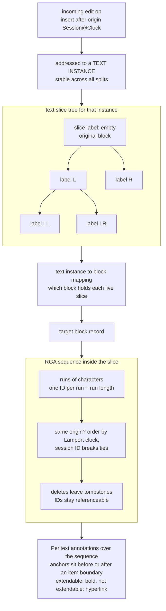

<!--
entry-meta
date: 2026-09-23
type: daily-diff
category: Daily Diff
title: Daily Diff — 2026-09-23
slug: sqlite-rowid-ipk-without-rowid
-->

# Daily Diff — Edition 059, Monday 2026-09-21

**2026-09-23 · Daily Diff Digest**

tdd.cat publishes on a stated two-day settling window, so the newest edition available this morning is **059, dated Monday 2026-09-21** (105 stories). The 2026-09-20 edition was covered in [yesterday's digest](../2026-09-22-sqlite-schema-table-rootpages-initone/daily-diff.md); nothing dated 2026-09-22 or 2026-09-23 has published yet.

## The Edition, Point-Wise

**Systems and infrastructure**

- **Polars 2.0.0rc2** — multi-threaded, SIMD-vectorised DataFrames with larger-than-RAM processing. A release candidate, so the interesting question is what changed at the 2.0 boundary.
- **Blacksmith: 10 million CI jobs/day** — the strongest systems writeup in the edition after the deep-dive pick. They replaced Redis-polling job claim (hosts pull from a FIFO via a Lua script) with "the Assigner", a single elected in-memory scheduler: etcd lease for leader election, every agent holding a long-lived gRPC stream to *every* instance, hot standbys fed identical reports, O(1)-clone copy-on-write B-trees for indexes so placement decisions work on cheap fleet snapshots. Stated budget: 30,000 hosts, ~1M vCPUs, 10,000 placements/sec peak, **100 µs per job**, fleet state under 1 GB. The assigner holds no durable state — the etcd lease is "for liveness, not correctness", and duplicate placements during leader transitions are accepted. The fairness argument is the good part: "fairness across organizations is inherently a global question, so hosts pulling independently from the FIFO can't enforce it."
- **Agner Fog's optimization manuals** — the microarchitecture/instruction-timing reference, resurfacing.
- **Apple M4 SME exploration** — hands-on with the scalable matrix extension.
- **Alcor** — an SVM hypervisor kernel module emulating CPUID and descriptor-table reads per process.
- **Wanix** — a WASM-native Unix environment running x86 programs in the browser.
- **Self-hosting behind CGNAT** — WireGuard tunnel where the homelab dials out; no static IP.

**Databases and data**

- **Notion's CRDT migration** — the deep dive below.
- **SQLBraid** — raw SQL plus TypeScript with explicit result mapping, no query-builder layer.

**Correctness and failure**

- **comma.ai on ML precision bugs** — a BF16 output layer produced predictions too coarse for the control loop; promoting that one layer to FP32 fixed it. A good reminder that quantisation decisions are not uniform across a network.
- **SAML: a fractal of bad design** (Trail of Bits) — XML signature validation as a permanent source of security holes.
- **Linus demands real users before hazard pointers land** — "microbenchmarks are garbage and actively misleading". A kernel-process story that generalises: a patch needs evidence of value on a real workload, not a synthetic win.
- **Jane Street on sequence weighting at scale** — non-monotonic scaling, with a three-stage story where small models benefit, mid-size models degrade, and large models recover robustness.

**LLM serving**

- **vLLM throughput deep dive** — PagedAttention framed as a memory-bandwidth and fragmentation problem rather than a compute one.
- **Prefill vs decode** — prefill is compute-bound, decode is memory-bandwidth-bound; they want different hardware and different batching.
- **Tokenizers v1** — 5.4–8.8x faster decode than the predecessor, 76% linear scaling.

The remainder of the 105 is heavily agent-infrastructure: orchestrators, sandboxes, context-compaction tools, and a large cluster of posts about one small decision model. Thin as engineering reading.

## Deep Dive: Notion Replaced Last-Write-Wins With an RGA Sequence CRDT

Source followed: [How Notion handles concurrent editing with CRDTs](https://www.notion.com/blog/how-notion-handles-concurrent-editing-with-crdts). This log covered [Notion's Postgres sharding](../2026-09-10-notion-postgres-sharding/README.md) on 2026-09-10; this is the layer above it — how a block's *contents* converge, not where the block is stored.

### What was there before

Last-write-wins, per block. Concurrent edits to the same block resolved by timestamp: "whichever came last determined the result… one person's edits would be **completely lost**." Not merged badly — lost. For a document editor that is a correctness bug, and it is the kind that only shows up under concurrency you cannot reproduce on demand.

### The core structure: RGA

They adopted a **Replicated Growable Array**, a sequence CRDT in which every character is "a node with a unique and stable ID". Two mechanisms do the work:

- **Identity.** An ID is `Session@LamportClock`. The blog's own justification for the pair: "the session ID and Lamport clock make the ID unique: two clients may collide on Lamport clock but not on session ID."
- **Ordering.** An insert names an *origin* — the existing item it goes after. Concurrent inserts naming the same origin are ordered by a total rule: "Items that point to the same origin are sorted so the one with the most recent logical timestamp comes first, with session ID used as tie-breaker."

That second rule is the whole convergence argument. Every replica applying the same set of operations, in any order, derives the same sequence, because the comparison is a pure function of the IDs. There is no coordination and no server arbitration in the ordering itself.

Two consequences follow directly:

- **Tombstones.** "A deletion operation marks an item as removed but keeps it around as a 'tombstone.' This is because there may be in-flight or offline operations that depend on the IDs of the deleted characters." You cannot free an ID while anything might still reference it as an origin — and with offline clients, "anything" has no bound. The post does not describe a garbage-collection policy, which is the open question any RGA deployment has to answer eventually.
- **Run-length encoding.** Per-character nodes are unaffordable, so: "assign an ID to a contiguous run of characters from the same session and Lamport clock, and additionally store the run length." Typing a word produces one run, not eight nodes. A deletion or an insertion inside a run splits it.

### Formatting: Peritext anchors

Rich text is not part of the sequence; it is a set of annotations over it, Peritext-style. An annotation's start and end are **anchor points** positioned "right before or right after the boundary of an item". Which side you anchor to is the entire semantics of what happens when someone types at the edge:

- **Bold is extendable** — type at the end of bold text and the new text is bold.
- **A hyperlink is not** — type after a link and you are outside the link.

Same data structure, opposite anchor placement. This is a nice piece of design: a user-visible behavioural difference reduced to a one-bit choice in where a marker sits relative to a boundary.

### The hard part: concurrent block splits

Pressing Enter mid-paragraph splits one block into two. Concurrently, someone else is typing into that paragraph. Their operation names an origin item — and, as Notion puts it, "concurrent edits mean a user's edit could point to an origin that is no longer in the same database record." The CRDT is fine; the *storage addressing* is not, because Notion's operations are routed to blocks and the block a character lives in has just changed.

Three concepts patch the addressing layer rather than the CRDT:

| concept | definition (from the post) | job |
|---|---|---|
| **text slice** | "The text items in a block belong to a text slice, and every block is initialized with an empty text slice." | the unit that actually splits |
| **text instance** | "a conceptual grouping for slices that descended from the same initial slice, with the ID of the block that originated it" | the stable name operations address |
| **search label** | "Every text slice has a search label which uniquely identifies it within a text instance. A text slice starts with an empty label, and every time it is split, we append the label with `L` or `R`." | locate the right slice after N splits |

Operations reference the **text instance**, not the block. A text-instance-to-block mapping resolves the rest. The search label is a binary path: a slice split twice, left then right, is `LR`, and the label set forms the leaves of the split tree — so finding which slice now owns a given position is a walk down a path, not a scan of every block.

### What it changes, and what is not answered

Deployed **July 2025**, processing "millions of CRDT operations every minute" — Notion's claim to "one of the largest CRDT deployments in the world". The substantive shift is that concurrent editing stopped being a data-loss risk and became a merge, which for a document product is a correctness fix rather than a feature.

What the post does not cover, and what I would want before copying the design:

- **Tombstone garbage collection.** Named as necessary, with no policy and no size numbers. In a long-lived document this is the one term that grows without bound.
- **Server role.** The server persists operations and appears to act as a peer, but the reconciliation protocol, snapshotting, and how a cold client catches up are not described.
- **Cost.** No figures for document size overhead, memory per open document, or latency versus the old LWW path. "Millions of operations per minute" is throughput, not overhead.

The transferable idea is the split between the two layers. RGA gives you convergence over a sequence; it says nothing about which *record* a sequence element lives in. Notion's actual novel work — text slices, text instances, search labels — is entirely in the second layer, reconciling a CRDT's stable logical identity with a storage system that keeps moving the physical container. Any team putting a sequence CRDT on top of an existing row-per-block schema hits that same seam.

## Sources

- [The Daily Diff — Monday, September 21, 2026 (edition 059)](https://tdd.cat/2026-09-21/) — the edition digested above; 105 stories.
- [The Daily Diff](https://tdd.cat/) — front page, showing the 2026-09-20 edition as current at fetch time.
- [The Daily Diff — archive](https://tdd.cat/archive) — 59 editions from 2026-07-17 to 2026-09-21, and the stated "2-day settling window" that explains why 2026-09-22 and 2026-09-23 are absent.
- [How Notion handles concurrent editing with CRDTs](https://www.notion.com/blog/how-notion-handles-concurrent-editing-with-crdts) — the deep-dive source; all quoted sentences are from this post.
- [How Blacksmith runs 10 million jobs per day](https://www.blacksmith.sh/blog/how-blacksmith-runs-10-million-jobs-per-day) — the Assigner design, the three failure modes of Redis polling, and the capacity and drain-reservation numbers cited above.
