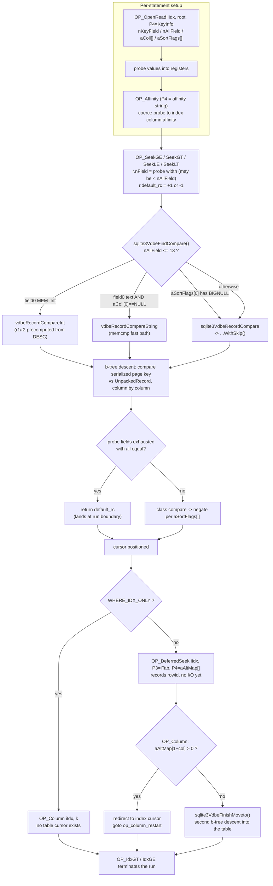

<!--
entry-meta
date: 2026-09-24
type: lesson
track: SQLite
lesson: 09
category: Database Internals
title: Index B-trees — Key Records, Sort Order, and the Covering-Index Bargain
slug: sqlite-index-btrees-sort-order-covering
-->

# Index B-trees — Key Records, Sort Order, and the Covering-Index Bargain

**2026-09-24 · SQLite Track · Lesson 09 of 32**

## Where This Fits

- **Previous lesson:** [Lesson 08](../2026-09-23-sqlite-rowid-ipk-without-rowid/README.md) established that a `WITHOUT ROWID` table *is* an index b-tree, and its §6 measured the **shape** of an index record on both table kinds — indexed columns first, then the table key as a suffix, with the suffix suppressed only on `WITHOUT ROWID` tables and only when the collation matches. It deferred the question of how those records are *ordered*.
- **This lesson:** the ordering. Where `DESC` and `COLLATE` physically live (not in the record — measured byte-for-byte in §1), the `KeyInfo` object that carries them, the asymmetric comparator in `sqlite3VdbeRecordCompareWithSkip()` that never materialises the left-hand key, the `default_rc` trick that turns a short probe into a range seek, and the two bitmasks that decide whether the table b-tree gets opened at all.
- **What it explains retroactively:** Lesson 05's `maxLocal`/`maxLeaf` split and Lesson 08 §9.3's 409-vs-7.9 fanout collapse reappear in §10 as the reason a covering index in this lesson's benchmark is **depth 5 instead of depth 3** and saves only 0.91 page touches per lookup instead of the three it looks like it should.
- **Next:** Lesson 10 takes the cursor itself — `moveToChild`, table and index seeks, and cursor save/restore. This lesson explains *what* the seek compares; Lesson 10 explains *how the cursor walks*. Lesson 11's `balance()` is what keeps the structures here in shape.

Source references are to `sqlite/sqlite` at commit **`4b495f9`** (`src/vdbeaux.c`, `src/vdbe.c`, `src/where.c`, `src/wherecode.c`, `src/build.c`, `src/sqliteInt.h`, `src/vdbeInt.h`), read through a code index this run. Measurements are against SQLite **3.45.1** (Python 3.11's bundled library), `page_size = 4096`, matching Lessons 01–08, and cross-checked against **3.53.4** via `apsw`. No behavioural difference between the two was found for anything in this lesson.

---

## 1. Sort Order and Collation Are Not in the Record

The obvious hypothesis is that a `DESC` index stores its keys some inverted way, or that a `NOCASE` index folds case at write time. Both are wrong. Three indexes, one row, page dumped straight out of the file:

```sql
CREATE TABLE t(a INTEGER PRIMARY KEY, b TEXT, c TEXT COLLATE NOCASE, d BLOB);
CREATE INDEX i_asc  ON t(b ASC);
CREATE INDEX i_desc ON t(b DESC);
CREATE INDEX i_noc  ON t(c);
INSERT INTO t VALUES(7,'Mm','Mm',x'0102');
```

| index | root | page type | last bytes of the page |
|---|---|---|---|
| `i_asc` | 3 | 10 | `06 03 11 01 4d 6d 07` |
| `i_desc` | 4 | 10 | `06 03 11 01 4d 6d 07` |
| `i_noc` | 5 | 10 | `06 03 11 01 4d 6d 07` |

Byte-identical. Decoded with Lesson 02's reader and Lesson 03's index-leaf cell layout:

| bytes | meaning |
|---|---|
| `06` | varint: 6 bytes of key payload (index leaf cells carry no separate data field) |
| `03` | record header size = 3 |
| `11` | serial type 17 → text, length `(17-13)/2 = 2` |
| `01` | serial type 1 → 1-byte signed int |
| `4d 6d` | `"Mm"` — original case preserved under `COLLATE NOCASE` |
| `07` | rowid 7, the table-key suffix from Lesson 08 §6 |

So the on-disk record encoding is a function of the *values* alone. What differs between `i_asc` and `i_desc` is not the bytes of any single entry but the **order the entries are placed in the b-tree** — and that order comes from a comparison function configured at runtime, not from anything stored in the file.

That configuration object is `KeyInfo`.

## 2. `KeyInfo` — Where Direction and Collation Actually Live

`src/sqliteInt.h` 2704–2712:

```c
struct KeyInfo {
  u32 nRef;           /* Number of references to this KeyInfo object */
  u8 enc;             /* Text encoding - one of the SQLITE_UTF* values */
  u16 nKeyField;      /* Number of key columns in the index */
  u16 nAllField;      /* Total columns, including key plus others */
  sqlite3 *db;        /* The database connection */
  u8 *aSortFlags;     /* Sort order for each column. */
  CollSeq *aColl[FLEXARRAY]; /* Collating sequence for each term of the key */
};
```

The header comment at 2694–2697 is the part that matters for indexes:

> "The aSortOrder[] and aColl[] arrays have nAllField slots each. There are nKeyField slots for the columns of an index then extra slots for the rowid or key at the end."

So for `CREATE INDEX i ON t(b)` on a rowid table, `nKeyField = 1` but `nAllField = 2` — the rowid suffix gets its own collation and sort-order slot.

`aSortFlags` holds two bits (`sqliteInt.h` 2729–2730):

```c
#define KEYINFO_ORDER_DESC    0x01    /* DESC sort order */
#define KEYINFO_ORDER_BIGNULL 0x02    /* NULL is larger than any other value */
```

### 2.1 Reading `KeyInfo` out of `EXPLAIN`

`OP_OpenRead` on an index carries the `KeyInfo` as P4, and `sqlite3VdbeDisplayP4()` renders it (`vdbeaux.c` 1935–1944):

```c
for(j=0; j<pKeyInfo->nKeyField; j++){
  CollSeq *pColl = pKeyInfo->aColl[j];
  const char *zColl = pColl ? pColl->zName : "";
  if( strcmp(zColl, "BINARY")==0 ) zColl = "B";
  sqlite3_str_appendf(&x, ",%s%s%s",
         (pKeyInfo->aSortFlags[j] & KEYINFO_ORDER_DESC) ? "-" : "",
         (pKeyInfo->aSortFlags[j] & KEYINFO_ORDER_BIGNULL)? "N." : "",
         zColl);
}
```

Measured, for `CREATE INDEX i_desc ON t(b DESC, c COLLATE NOCASE)`:

```
1 OpenRead  1  5  0  k(3,-,NOCASE,)  2
```

Read it as: 3 fields total; field 0 is `-` (DESC) with an empty collation name; field 1 is `NOCASE`; field 2 (the rowid suffix) is empty. **Empty, not `B`.** `sqlite3KeyInfoOfIndex()` (`build.c` 5748) stores a null `CollSeq*` for the binary collation:

```c
pKey->aColl[i] = zColl==sqlite3StrBINARY ? 0 : sqlite3LocateCollSeq(pParse, zColl);
```

so `pColl ? pColl->zName : ""` yields the empty string and the `"BINARY"` → `"B"` mapping never fires for an ordinary index. A null `aColl[i]` is not "no collation" — it is the fast path, and §3 shows the comparator branching on exactly that null.

### 2.2 The line after that, which forbids `NULLS LAST` on an index

`build.c` 5751:

```c
assert( 0==(pKey->aSortFlags[i] & KEYINFO_ORDER_BIGNULL) );
```

An index's `KeyInfo` may never carry `BIGNULL`. Confirmed at the SQL layer on both 3.45.1 and 3.53.4:

```
ERR  CREATE INDEX z1 ON t(b NULLS LAST)        -> unsupported use of NULLS LAST
ERR  CREATE INDEX z2 ON t(b DESC NULLS FIRST)  -> unsupported use of NULLS FIRST
```

`BIGNULL` exists only for `ORDER BY ... NULLS LAST` (set in `expr.c` 2195–2200) and for the `min()` rewrite in `select.c` 5496–5500. It is a *sorter* flag, not an index flag. The consequence in *Where This Breaks Down*.

## 3. The Comparator Is Asymmetric

`sqlite3VdbeRecordCompareWithSkip()` (`vdbeaux.c` 4705–4931) is the function every index seek and every index insert bottoms out in. Its signature says the whole design:

```c
int sqlite3VdbeRecordCompareWithSkip(
  int nKey1, const void *pKey1,   /* Left key */
  UnpackedRecord *pPKey2,         /* Right key */
  int bSkip                       /* If true, skip the first field */
){
```

The left key is **raw serialized bytes straight from the b-tree page**. The right key is an already-parsed `UnpackedRecord` of `Mem` cells. The function never builds a `Mem` for the left side except transiently for text and real comparisons. It walks the left record's header varints in lockstep with the right side's `Mem` array and dispatches on the *right* operand's type:

```
if( pRhs->flags & (MEM_Int|MEM_IntReal) ){ ... }   /* 4758 */
else if( pRhs->flags & MEM_Real ){ ... }           /* 4782 */
else if( pRhs->flags & MEM_Str  ){ ... }           /* 4811 */
else if( pRhs->flags & MEM_Blob ){ ... }           /* 4844 */
else { /* RHS is null */ ... }                     /* 4872 */
```

Inside each branch the left side is decided by its **serial type number alone**, which is why the storage-class ordering from Lesson 02's serial-type table falls out for free. From the integer branch (4761–4766):

```c
serial_type = aKey1[idx1];
if( serial_type>=10 ){
  rc = serial_type==10 ? -1 : +1;
}else if( serial_type==0 ){
  rc = -1;
```

- serial type 0 is NULL → sorts before an integer, `rc = -1`
- serial types 12+ are blob/text → sort after, `rc = +1`
- types 10 and 11 are reserved, and the code deliberately gives them an arbitrary but total order

That is the documented rule — "NULL values (serial type 0) sort first… Numeric values (serial types 1 through 9) sort after NULLs… Text values… BLOB values sort last" — implemented as integer comparisons on the type byte, with no value decoding at all when the classes differ.

### 3.1 Collation is a pointer test

The string branch, 4827–4839:

```c
}else if( pKeyInfo->aColl[i] ){
  mem1.enc = pKeyInfo->enc;  mem1.db = pKeyInfo->db;
  mem1.flags = MEM_Str;  mem1.z = (char*)&aKey1[d1];
  rc = vdbeCompareMemString(&mem1, pRhs, pKeyInfo->aColl[i], &pPKey2->errCode);
}else{
  int nCmp = MIN(mem1.n, pRhs->n);
  rc = memcmp(&aKey1[d1], pRhs->z, nCmp);
  if( rc==0 ) rc = mem1.n - pRhs->n;
}
```

The `else` branch — `aColl[i] == NULL`, i.e. BINARY — is a bare `memcmp()` directly against the page buffer, with no `Mem` construction, no encoding conversion, no function call. That is the entire cost difference between a BINARY index and a NOCASE index on the comparison path. It also explains the shape of the file format's rule: text ordering is "the order determined by the columns collating function", and BINARY is the case where that function is *absent*.

### 3.2 Where `DESC` is applied: one negation, at the end

4884–4893, after the class comparison has produced a non-zero `rc`:

```c
if( rc!=0 ){
  int sortFlags = pPKey2->pKeyInfo->aSortFlags[i];
  if( sortFlags ){
    if( (sortFlags & KEYINFO_ORDER_BIGNULL)==0
     || ((sortFlags & KEYINFO_ORDER_DESC)
       !=(serial_type==0 || (pRhs->flags&MEM_Null)))
    ){
      rc = -rc;
    }
  }
  ...
  return rc;
}
```

Three cases, all in one condition:

| `aSortFlags[i]` | behaviour |
|---|---|
| `0` (ASC, nulls first) | no negation |
| `DESC` only | `BIGNULL` bit clear → first disjunct true → always negate |
| `DESC`/`ASC` + `BIGNULL` | negate **unless** exactly one of {this column is DESC} / {either side is NULL} holds |

That last line is an XOR written as `!=` between two booleans. It says: under `NULLS LAST`, a comparison that involves a NULL is *not* reversed by the DESC flag, because the NULL's position is being fixed independently of the direction. Everything else is.

This is the whole of `DESC` in SQLite's index machinery — one sign flip against a per-column flag byte. §1's byte-identical pages are the direct corollary.

## 4. Three Comparators, Chosen Once Per Probe

`sqlite3VdbeFindCompare()` (`vdbeaux.c` 5085–5130) picks a specialised comparator before the seek begins, so the per-entry cost during the descent is as low as possible:

```c
assert( p->pKeyInfo->aSortFlags!=0 );
if( p->pKeyInfo->nAllField<=13 ){
  int flags = p->aMem[0].flags;
  if( p->pKeyInfo->aSortFlags[0] ){
    if( p->pKeyInfo->aSortFlags[0] & KEYINFO_ORDER_BIGNULL ){
      return sqlite3VdbeRecordCompare;
    }
    p->r1 = 1;  p->r2 = -1;
  }else{
    p->r1 = -1; p->r2 = 1;
  }
  if( (flags & MEM_Int) ){
    p->u.i = p->aMem[0].u.i;
    return vdbeRecordCompareInt;
  }
  ...
  if( (flags & (MEM_Real|MEM_IntReal|MEM_Null|MEM_Blob))==0
   && sqlite3IsBinary(p->pKeyInfo->aColl[0])
  ){
    p->u.z = p->aMem[0].z;  p->n = p->aMem[0].n;
    return vdbeRecordCompareString;
  }
}
return sqlite3VdbeRecordCompare;
```

Read off the gates:

| gate | why it exists |
|---|---|
| `nAllField <= 13` | bounds the record header to 64 bytes when field 0 is an integer, so the fast comparators can overread safely — the header comment spells out `(12*5 + 1 + 1)` |
| ≥ 74 bytes of padding after every key buffer | the overread budget; the comment is explicit that it is "at least 74 (but not 136)" |
| `aSortFlags[0] & BIGNULL` → bail out | the fast paths encode direction as a fixed `r1`/`r2` pair and cannot express the XOR from §3.2 |
| `aSortFlags[0]` set → `r1=1, r2=-1` | DESC is precomputed into the return constants, not applied as a negation per row |
| field 0 is `MEM_Int` | `vdbeRecordCompareInt` |
| field 0 is text **and** `aColl[0]` is binary | `vdbeRecordCompareString` |

`sqlite3IsBinary(p->pKeyInfo->aColl[0])` is the same null-pointer test from §3.1, promoted to a comparator-selection criterion. A `COLLATE NOCASE` index does not merely pay for `vdbeCompareMemString()` per comparison — it loses the specialised comparator for the whole seek.

The integer comparator's decode loop carries one of the more instructive optimisation comments in the file (`vdbeaux.c` 4956–4966):

> "Rather than handle each width in its own switch case, read 8 bytes and use an arithmetic right shift to drop the unwanted low-order bytes and sign-extend the value. This helps because the switch tends to mispredict when a key column contains integers of varying sizes."

```c
if( (u32)(serial_type-1)<=5 ){
  static const u8 aShift[] = { 0, 56, 48, 40, 32, 16, 0 };
  lhs = ((i64)sqlite3Get8byte(aKey)) >> aShift[serial_type];
```

Serial types 1–6 (1, 2, 3, 4, 6 and 8 bytes) collapse to one 8-byte load and a table-driven arithmetic shift. Branch prediction, not instruction count, is the stated reason.

## 5. `default_rc` — How a Short Probe Becomes a Range Seek

An index on `(b)` over a rowid table has two key fields. A query `WHERE b = 'x'` supplies one. The comparator therefore runs out of right-hand fields before the left-hand record does, and the loop falls out at 4900 (`if( i==pPKey2->nField ) break;`) with `rc == 0`. What gets returned then is `pPKey2->default_rc` — the field `UnpackedRecord` exists to carry (`sqliteInt.h` 2766–2776):

```c
struct UnpackedRecord {
  KeyInfo *pKeyInfo;  /* Comparison info for the index that is unpacked */
  Mem *aMem;          /* Values for columns of the index */
  union { char *z; i64 i; } u;
  int n;
  u16 nField;         /* Number of entries in apMem[] */
  i8 default_rc;      /* Comparison result if keys are equal */
  u8 errCode;
```

`OP_SeekGE` sets it with a bit trick (`vdbe.c` 5084–5095):

```c
/* The next line of code computes as follows, only faster:
**   if( oc==OP_SeekGT || oc==OP_SeekLE ){ r.default_rc = -1; }
**   else{ r.default_rc = +1; }
*/
r.default_rc = ((1 & (oc - OP_SeekLT)) ? -1 : +1);
```

| opcode | `default_rc` | effect on a prefix-equal entry |
|---|---|---|
| `SeekGE`, `SeekLT` | `+1` | "the stored key is greater" → lands *before* the first match |
| `SeekGT`, `SeekLE` | `-1` | "the stored key is lesser" → lands *after* the last match |

So a one-field probe against a two-field index is a **boundary search**, not an equality search: `default_rc` decides which edge of the run of matching entries the cursor stops at. The suffix — rowid, or the `WITHOUT ROWID` primary key from Lesson 08 — is never supplied and never compared, but it is exactly what makes the run of matches more than one entry long.

This is visible in the bytecode. For `SELECT b FROM t WHERE b>'x' AND b<'y'` against `k(2,,)`:

```
1 OpenRead  1  3  0  k(2,,)   0
2 String8   0  1  0  x        0
3 SeekGT    1  9  1  1        0     <- P4=1: probe has ONE field, index has TWO
4 String8   0  1  0  y        0
5 IdxGE     1  9  1  1        0     <- termination test, also one field
6 Column    1  0  2
7 ResultRow 2  1  0
8 Next      1  5  0
```

`SeekGT` P4 is the probe width (1), not the index width (2). The opcode documentation for the `Idx*` family says the same thing from the other direction: "The P4 register values beginning with P3 form an unpacked index key that omits the PRIMARY KEY. Compare this key value against the index that P1 is currently pointing to, **ignoring the PRIMARY KEY or ROWID fields at the end**."

### 5.1 `SeekGE` / `IdxGT` is the equality idiom, and `DESC` does not change it

For `WHERE b = 'x'` SQLite emits a *pair*:

```
4 SeekGE    1  10  1  1
5 IdxGT     1  10  1  1
```

`SeekGE` (default_rc `+1`) lands on the first entry with that prefix; `IdxGT` on the next loop iteration jumps out as soon as the prefix stops matching. `vdbe.c` 5060–5076 asserts the pattern is exact — same P1, P2, P3 and P4 on both — and 5160–5163 shows the reward:

```c
}else if( eqOnly ){
  assert( pOp[1].opcode==OP_IdxLT || pOp[1].opcode==OP_IdxGT );
  pOp++; /* Skip the OP_IdxLt or OP_IdxGT that follows */
}
```

When the cursor carries the `BTREE_SEEK_EQ` hint and the seek found nothing, the `IdxGT` is skipped outright by advancing the program counter.

The measured surprise: the planner chose `i_desc` — `k(3,-,NOCASE,)`, first column `DESC` — for an equality lookup and still emitted `SeekGE`/`IdxGT`, not `SeekLE`/`IdxLT`. **`GE` and `GT` are in comparator space, not value space.** Once `aSortFlags[0]` has its `DESC` bit set, "greater" means "later in the b-tree", and a descending index is scanned front-to-back for an ascending result set by the same opcodes.

## 6. Affinity Is Applied to the Probe, Not to the Index

Before any seek, the probe registers are coerced to the index's column affinities. Measured, on `b TEXT`:

```
### SELECT a FROM t WHERE b=5
  2 Integer   5  1  0
  3 Affinity  1  1  0  B        <- SQLITE_AFF_TEXT
  4 SeekGE    1  9  1  1

### SELECT a FROM t WHERE b='5'
  2 String8   0  1  0  5
  3 SeekGE    1  8  1  1        <- no OP_Affinity; already text
```

`'B'` is `SQLITE_AFF_TEXT` (`sqliteInt.h` 2372 — the affinity constants are literally the ASCII characters `@ A B C D E F`), and `OP_Affinity`'s contract is "P4 is a string that is P2 characters long. The N-th character of the string indicates the column affinity that should be used for the N-th memory cell in the range."

This matters because §3's comparator sorts by storage class *first*. Without the coercion, the integer `5` would be compared against text records and would sort before every one of them — the seek would land at the start of the index and find nothing. Affinity conversion is what makes `WHERE b = 5` and `WHERE b = '5'` agree on a TEXT column.

The `IS NULL` case gets an `OP_Affinity` too, and it is a no-op on a NULL; the seek then relies on serial type 0 sorting first.

### 6.1 Collation is matched, not coerced

Affinity gets converted. Collation does not — a mismatch simply disqualifies the index:

| query | plan |
|---|---|
| `SELECT c FROM t WHERE c='mm'` (`c TEXT COLLATE NOCASE`, index `i_noc`) | `SEARCH t USING COVERING INDEX i_noc (c=?)` |
| `SELECT c FROM t WHERE c='mm' COLLATE BINARY` | `SCAN t USING COVERING INDEX i_noc` |
| `SELECT b FROM t WHERE b='mm' COLLATE NOCASE` (`b` is BINARY) | `SCAN t USING COVERING INDEX i_desc` |

Both mismatches degrade from `SEARCH` to `SCAN`. The index is still read — it is narrower than the table — but the b-tree's ordering is useless for that predicate, so every entry is examined. That is the operational reading of §1: the bytes are the same, so a BINARY-ordered index physically *cannot* answer a NOCASE range, and vice versa.

## 7. Covering Indexes: Two Bitmasks and an Escape Hatch

Whether the table b-tree is opened at all is decided in `whereLoopAddBtree()` (`where.c` 4191–4232):

```c
if( pProbe->isCovering ){
  m = 0;
  pNew->wsFlags = WHERE_IDX_ONLY | WHERE_INDEXED;
}else{
  m = pSrc->colUsed & pProbe->colNotIdxed;
  ...
  if( m==TOPBIT || (pProbe->bHasExpr && !pProbe->bHasVCol && m!=0) ){
    u32 isCov = whereIsCoveringIndex(pWInfo, pProbe, pSrc->iCursor);
```

One `AND` of two 64-bit masks. `colNotIdxed` is built in `build.c` 2397–2411:

```c
static void recomputeColumnsNotIndexed(Index *pIdx){
  Bitmask m = 0;
  for(j=pIdx->nColumn-1; j>=0; j--){
    int x = pIdx->aiColumn[j];
    if( x>=0 && (pTab->aCol[x].colFlags & COLFLAG_VIRTUAL)==0 ){
      if( x<BMS-1 ) m |= MASKBIT(x);
    }
  }
  pIdx->colNotIdxed = ~m;
  assert( (pIdx->colNotIdxed>>63)==1 );  /* See note-20221022-a */
}
```

`BMS` is `sizeof(Bitmask)*8` = 64 (`sqliteInt.h` 1441). So:

- Columns 0–62 each get their own bit.
- Column 63 and everything past it share bit 63, which **can never be cleared** — the assert enforces it.
- Virtual columns are deliberately excluded even when indexed, "because we do not trust the logic in `whereIndexExprTrans()` to be able to find all instances of a reference".

If `m` comes out non-zero the index is not covering — except in the one ambiguous case `m == TOPBIT`, where the only uncovered bit is the shared high bit and the truth is unknown. Then `whereIsCoveringIndex()` (`where.c` 3834–3875) walks the actual select AST and decides precisely. Its first two guards are the interesting ones:

```c
if( pWInfo->pSelect==0 ){
  /* We don't have access to the full query, so we cannot check to see
  ** if pIdx is covering.  Assume it is not. */
  return 0;
}
if( pIdx->bHasExpr==0 ){
  for(i=0; i<pIdx->nColumn; i++){
    if( pIdx->aiColumn[i]>=BMS-1 ) break;
  }
  if( i>=pIdx->nColumn ) return 0;
}
```

Measured on a 70-column table with single-column indexes on `c62`, `c63` and `c64`, all three queries reported `SEARCH w USING COVERING INDEX` — the AST walk rescues the high-column cases that the bitmask alone would give up on. The escape hatch works; the horizon is real but it is papered over for `SELECT`. Statements with no `pSelect` — the `UPDATE`/`DELETE` paths — get the pessimistic answer.

The third return value, `WHERE_EXPRIDX`, is a hedge for expression indexes: "the index is likely a covering index… Score it as a covering index, but still keep the main table open just in case we need it."

### 7.1 What being covering is worth, in the planner's own units

`where.c` 3573–3576:

```c
pNew->rRun = rCostIdx;
if( (pNew->wsFlags & (WHERE_IDX_ONLY|WHERE_IPK|WHERE_EXPRIDX))==0 ){
  pNew->rRun = sqlite3LogEstAdd(pNew->rRun, pNew->nOut + 16);
}
```

A non-covering loop pays an extra cost term of `nOut + 16` LogEst units — one table lookup per output row, priced at `+16`. LogEst is `10*log2(x)`, so `+16` is a factor of `2^1.6 ≈ 3.03`. The planner's flat assumption is that visiting the table b-tree for a row costs about three times what producing the index entry cost. §10 measures what it actually costs.

## 8. `DeferredSeek` and the Alt-Map: Partial Covering

When the index is not covering, SQLite still does not seek the table eagerly. `wherecode.c` 2228–2234:

```c
omitTable = (pLoop->wsFlags & WHERE_IDX_ONLY)!=0
       && (pWInfo->wctrlFlags & (WHERE_OR_SUBCLAUSE|WHERE_RIGHT_JOIN))==0;
if( omitTable ){
  /* pIdx is a covering index.  No need to access the main table. */
}else if( HasRowid(pIdx->pTable) ){
  codeDeferredSeek(pWInfo, pIdx, iCur, iIdxCur);
```

`codeDeferredSeek()`'s header comment (1278–1287) describes a per-column redirect table:

> "P4 is set to an array of integers containing one entry for each column in the table. For each table column, if the column is the i'th column of the index, then the corresponding array entry is set to (i+1). If the column does not appear in the index at all, the array entry is set to 0. The OP_Column opcode can check this array to see if the column it wants is in the index and if it is, it will substitute the index cursor and column number and continue with those new values, rather than seeking the table cursor."

`OP_DeferredSeek` stores the row target and the map without touching the table (`vdbe.c` 6905–6925):

```c
pTabCur->movetoTarget = rowid;
pTabCur->deferredMoveto = 1;
pTabCur->cacheStatus = CACHE_STALE;
pTabCur->ub.aAltMap = pOp->p4.ai;
pTabCur->pAltCursor = pC;
```

and `OP_Column` consumes it (`vdbe.c` 3084–3092):

```c
if( pC->deferredMoveto ){
  u32 iMap;
  if( pC->ub.aAltMap && (iMap = pC->ub.aAltMap[1+p2])>0  ){
    pC = pC->pAltCursor;
    p2 = iMap - 1;
    goto op_column_restart;
  }
  rc = sqlite3VdbeFinishMoveto(pC);
```

The redirect is a goto back to the top of the opcode with a different cursor and column number. Measured, for `SELECT b,d FROM t WHERE b='x'` with `CREATE INDEX i_b ON t(b)`:

```
 6 DeferredSeek  1  0  0
 7 Column        1  0  2      <- b: read from the INDEX cursor (1)
 8 Column        0  2  3      <- d: forces the table seek (cursor 0)
 9 ResultRow     2  2  0
```

If line 8 were removed — `SELECT b` alone — the index would be covering and there would be no `DeferredSeek` at all. With line 8 present, the seek happens but only once line 8 runs, and `b` is still served out of the index. `OP_FinishSeek` (`vdbe.c` 6943) exists to force the pending seek in the cases where a later opcode needs the cursor positioned even though no column was read.

So "covering" is not binary at execution time. There are three tiers:

| tier | table cursor | table descent |
|---|---|---|
| covering (`WHERE_IDX_ONLY`) | never opened | never |
| deferred, all needed columns in index | opened | never performed |
| deferred, some column outside the index | opened | performed on first such `OP_Column` |

## 9. The Path, End to End



## 10. The Covering-Index Bargain, Measured

The claim under test, from the optimizer overview:

> "When doing an indexed lookup of a row, the usual procedure is to do a binary search on the index to find the index entry, then extract the rowid from the index and use that rowid to do a binary search on the original table. Thus a typical indexed lookup involves two binary searches." … "This saves one binary search for each row and can make many queries run twice as fast."

Setup: 200,000 rows, `t(a INTEGER PRIMARY KEY, k TEXT, payload BLOB)` where `payload` is 300 bytes. Two databases, identical data, differing only in the index: `i ON t(k)` versus `i ON t(k,payload)`. 20,000 random point lookups of `SELECT payload FROM t WHERE k=?`, best of three, instrumented with `SQLITE_DBSTATUS_CACHE_HIT` / `CACHE_MISS` via `apsw` on 3.53.4.

**Structure, from `dbstat`:**

| database | object | depth | pages | size |
|---|---|---|---|---|
| `idx(k)` | index `i` | **3** | 1,052 | 4.1 MiB |
| `idx(k)` | table `t` | 3 | 16,710 | 65.3 MiB |
| `idx(k,payload)` | index `i` | **5** | 18,183 | 71.0 MiB |
| `idx(k,payload)` | table `t` | 3 | 16,710 | 65.3 MiB |

**Cost, across three cache sizes:**

| cache | index | µs/lookup | miss/lookup | hit/lookup | **page touches/lookup** |
|---|---|---|---|---|---|
| 1 MiB | `(k)` non-covering | 7.09 | 1.79 | 5.21 | **7.00** |
| 1 MiB | `(k,payload)` covering | 6.99 | 2.15 | 3.94 | **6.09** |
| 39 MiB | `(k)` non-covering | 7.34 | 0.40 | 6.60 | **7.00** |
| 39 MiB | `(k,payload)` covering | 7.01 | 0.44 | 5.65 | **6.09** |
| 195 MiB | `(k)` non-covering | 7.53 | 0.37 | 6.64 | **7.00** |
| 195 MiB | `(k,payload)` covering | 7.49 | 0.37 | 5.71 | **6.09** |

Three things fall out, and none of them is "twice as fast".

1. **Page touches per lookup are cache-independent: exactly 7.00 versus 6.09.** That is the structural number. The covering index eliminated a three-page table descent and bought back two extra index levels, so it saved **0.91 pages**, not 3.
2. **The two extra levels are Lesson 08 §9.3's fanout collapse, again.** An index-interior cell carries the key, and here the key is `(k, payload, rowid)` ≈ 320 bytes. Interior fanout drops from roughly 200 (a 16-byte key) to roughly 12, so 16,667 leaves need five levels instead of three. Putting the payload in the index does not just enlarge the leaves; it enlarges every interior cell on the path to them.
3. **Wall clock is a wash — 1% to 5% — and the file doubled**, 69.4 MiB to 136.3 MiB. At 1 MiB of cache the covering index actually takes *more* cache misses per lookup (2.15 vs 1.79) despite touching fewer pages, because its working set is 17× larger and the resident interior levels no longer fit.

The optimizer overview's "twice as fast" is not wrong; it describes the case where the saved second descent is a real I/O and the added index columns are small enough not to move the index's depth. Both conditions failed here, and the planner's `+16` LogEst (§7.1) — a flat 3× penalty per table visit — is the model that cannot see that failure, because it prices the table lookup without pricing the depth the extra index columns add.

## Hands-On

Everything below runs against Python 3.11's bundled SQLite (3.45.1) with no CLI required.

### 1. Prove that `DESC` and `COLLATE` are not on disk (5 minutes)

```python
import sqlite3, os
p='/tmp/i.db'
os.path.exists(p) and os.remove(p)
c=sqlite3.connect(p); c.execute("PRAGMA page_size=4096")
c.execute("CREATE TABLE t(a INTEGER PRIMARY KEY, b TEXT, c TEXT COLLATE NOCASE)")
for s in ("CREATE INDEX i_asc ON t(b ASC)",
          "CREATE INDEX i_desc ON t(b DESC)",
          "CREATE INDEX i_noc ON t(c)"): c.execute(s)
c.execute("INSERT INTO t VALUES(7,'Mm','Mm')"); c.commit()
roots=dict(c.execute("SELECT name,rootpage FROM sqlite_schema WHERE type='index'"))
c.close(); raw=open(p,'rb').read()
for n,r in roots.items():
    pg=raw[(r-1)*4096:r*4096]
    print(n, "type",pg[0], pg[-8:].hex())
```

**What to look for:** three identical hex tails ending `...4d6d07`. `4d6d` is `"Mm"` with its case intact under `NOCASE`; `07` is the rowid suffix. If the three differed, sort order would be a storage property; it is not.

### 2. Read the `KeyInfo` out of `EXPLAIN` (5 minutes)

```python
c=sqlite3.connect('/tmp/i.db')
c.execute("CREATE INDEX i_mix ON t(b DESC, c COLLATE NOCASE)")
for r in c.execute("EXPLAIN SELECT c FROM t WHERE b='x'"):
    if r[1]=='OpenRead': print(r)
```

**What to look for:** `k(3,-,NOCASE,)`. Count the commas: three fields for a two-column index, because the rowid suffix gets a slot (§2). The leading `-` is `KEYINFO_ORDER_DESC`. The empty third entry is a NULL `CollSeq*`, i.e. the BINARY fast path from §3.1 — not a missing collation.

### 3. Watch `default_rc` in the operand, and the `SeekGE`/`IdxGT` pair (5 minutes)

```python
for q in ("SELECT a FROM t WHERE b='x'",
          "SELECT a FROM t WHERE b>'x' AND b<'y'"):
    print("##",q)
    for r in c.execute("EXPLAIN "+q):
        if r[1] in ('SeekGE','SeekGT','IdxGT','IdxGE','Affinity','OpenRead'): print("  ",r)
```

**What to look for:** P4 on every `Seek*`/`Idx*` is **1**, the probe width, while the `KeyInfo` says 2 or 3 fields. That gap is what `default_rc` fills. Note also that the equality query emits `SeekGE` followed immediately by `IdxGT` on the same operands — the `eqOnly` idiom from §5.1 — and that it stays `GE`/`GT` even when the chosen index is `DESC`.

### 4. Make affinity coercion visible (3 minutes)

```python
for q in ("SELECT a FROM t WHERE b=5", "SELECT a FROM t WHERE b='5'"):
    print("##",q, [r for r in c.execute("EXPLAIN "+q) if r[1]=='Affinity'])
```

**What to look for:** `OP_Affinity` with P4 `'B'` appears only for the integer probe. `'B'` is `SQLITE_AFF_TEXT` = 0x42. Then break it: `SELECT a FROM t WHERE b='mm' COLLATE NOCASE` and check `EXPLAIN QUERY PLAN` — it degrades from `SEARCH` to `SCAN`, because collation is matched rather than coerced (§6.1).

### 5. Reproduce the covering-index bargain (20 minutes)

```python
import apsw, os, time, random
def build(p, cols):
    os.path.exists(p) and os.remove(p)
    c=apsw.Connection(p); cur=c.cursor()
    cur.execute("PRAGMA page_size=4096")
    cur.execute("CREATE TABLE t(a INTEGER PRIMARY KEY, k TEXT, payload BLOB)")
    cur.execute("CREATE INDEX i ON t(%s)"%cols)
    cur.execute("BEGIN")
    cur.executemany("INSERT INTO t VALUES(?,?,?)",
        ((i,'key%07d'%i,('%0300d'%i).encode()) for i in range(200000)))
    cur.execute("COMMIT"); c.close()
random.seed(1)
keys=[('key%07d'%random.randrange(200000),) for _ in range(20000)]
CM,CH=apsw.SQLITE_DBSTATUS_CACHE_MISS, apsw.SQLITE_DBSTATUS_CACHE_HIT
for cols in ("k","k,payload"):
    p='/tmp/y_%s.db'%cols.replace(',','_'); build(p,cols)
    c=apsw.Connection(p); cur=c.cursor(); cur.execute("PRAGMA cache_size=-40000")
    depth={n:max(len(r[0].split('/'))-1 for r in
            cur.execute("SELECT path FROM dbstat WHERE name=?",(n,))) for n in ('i','t')}
    for k in keys[:5000]: cur.execute("SELECT payload FROM t WHERE k=?",k).fetchall()
    c.status(CM,True); c.status(CH,True); t=time.perf_counter()
    for k in keys: cur.execute("SELECT payload FROM t WHERE k=?",k).fetchall()
    dt=time.perf_counter()-t; m=c.status(CM,False)[0]; h=c.status(CH,False)[0]
    print(cols, depth, "%.2fus  touches/lookup %.2f"%(dt/len(keys)*1e6,(m+h)/len(keys)))
```

**What to look for:** `depth` for the covering index is 5, not 3, and touches/lookup drops only from 7.00 to 6.09. The `dbstat` depth is the explanation for the disappointing time; report both or the number is unreadable. (`dbstat` requires `SQLITE_ENABLE_DBSTAT_VTAB`, which `apsw`'s bundled build has and some distro builds do not.)

### 6. Find the covering horizon yourself (10 minutes)

Build a 70-column table with single-column indexes on `c62`, `c63`, `c64`; run `EXPLAIN QUERY PLAN SELECT cNN FROM w WHERE cNN=1` for each. All three say `COVERING INDEX`. Now work out from `recomputeColumnsNotIndexed()` (§7) why the bitmask alone cannot say that for `c63` and `c64`, and find the code path that rescues them. Then ask what happens when the same index is used by a statement with no `pSelect`.

## Where This Breaks Down

- **`NULLS LAST` cannot be indexed.** `build.c` 5751 asserts an index `KeyInfo` never carries `BIGNULL`, and the parser rejects `CREATE INDEX ... NULLS LAST` outright. `ORDER BY x NULLS LAST` on a nullable column therefore cannot be satisfied by a b-tree walk in the general case; it falls to the sorter (Lesson 28). The usual workaround — a two-term `ORDER BY x IS NULL, x` — needs an expression index to be servable by a scan.
- **A `COLLATE` mismatch silently downgrades to a scan**, and `EXPLAIN QUERY PLAN` reports it only by the difference between `SEARCH` and `SCAN`. There is no warning and no error. §6.1 measured both directions.
- **A non-binary collation costs twice.** It loses `vdbeRecordCompareString()` at comparator selection (§4) *and* pays `vdbeCompareMemString()` instead of `memcmp()` per comparison (§3.1). The `NOCASE` penalty is not one function call; it is a different code path for the whole descent.
- **The fast comparators are gated on `nAllField <= 13`.** An index with 13 or more columns counting the key suffix always runs the general comparator, no matter how simple its first column is. The gate exists for a buffer-overread budget ("at least 74 (but not 136) bytes of padding"), not for anything semantic.
- **`colUsed`/`colNotIdxed` see only 63 columns.** Bit 63 is shared by every column from 63 upward and is never cleared. The AST walk in `whereIsCoveringIndex()` rescues the `m == TOPBIT` case for `SELECT`, but it returns 0 unconditionally when `pWInfo->pSelect == 0`, and virtual columns are excluded from `colNotIdxed` even when indexed.
- **The cost model prices a table lookup at a flat `+16` LogEst (≈3×) and does not price index depth.** §10 measured a covering index that added two b-tree levels; the planner has no term for that, so it will prefer a covering index that is structurally worse.
- **A covering index is a second copy of the data.** 69.4 MiB → 136.3 MiB here for one added column. Under cache pressure that inversion is measurable: at 1 MiB of cache, the covering index took *more* misses per lookup than the non-covering one while touching fewer pages.
- **"Covering" at plan time is not "no table descent" at run time.** The `WHERE_EXPRIDX` hedge scores an expression index as covering while still opening the table, and `WHERE_OR_SUBCLAUSE`/`WHERE_RIGHT_JOIN` suppress `omitTable` outright (`wherecode.c` 2229–2230).

## Further Study

- [SQLite Database File Format — Representation Of SQL Indices](https://www.sqlite.org/fileformat2.html) — the normative record-sort-order rules, the index-b-tree cell layouts, and the index overflow thresholds with their "minimum fanout of 4" rationale.
- [The SQLite Query Optimizer Overview](https://www.sqlite.org/optoverview.html) — covering indexes, the two-binary-search model, and the ORDER BY / GROUP BY / DISTINCT index optimisations that this lesson's `KeyInfo` machinery makes possible.
- [The SQLite Bytecode Engine](https://www.sqlite.org/opcode.html) — the operand-level contracts for `SeekGE`, the `Idx*` family, `IdxRowid`, `DeferredSeek`, `Affinity`, `Found`/`NotFound`/`NoConflict`.
- [EXPLAIN QUERY PLAN](https://www.sqlite.org/eqp.html) — how to read `SEARCH` vs `SCAN` vs `USING COVERING INDEX`, which is the only surface signal for most of §6.1 and §7.
- [Subtleties of SQLite Indexes — Evan Schwartz](https://emschwartz.me/subtleties-of-sqlite-indexes/) — a practitioner's catalogue of cases where an index is present but unused.
- [SQLite Index Visualization: Search — mrsuh.com](https://mrsuh.com/articles/2024/sqlite-index-visualization-search/) — rendered b-tree pages for index seeks, useful alongside Hands-On #1.
- [SQLite can use more than one index for a query — Simon Willison](https://til.simonwillison.net/sqlite/multiple-indexes) — the multi-index/OR path, which §8's `WHERE_OR_SUBCLAUSE` exclusion touches.
- [SQLite Forum — SQLite not using covering indices when available](https://www2.sqlite.org/forum/info/b5e64dd5a00ab680b326db3be2281fe4e80ed88d1c628e416bc34d21c9d0456f) — a thread on exactly the bitmask/AST-walk boundary from §7.

## Next Steps

1. **Find the depth crossover for covering indexes.** Model index-interior fanout as a function of total key width at 4 KiB pages, predict the added column width at which the index gains a level, and verify with `dbstat` depths across a sweep. §10 has one point on that curve; the curve itself decides when a covering index is worth building.
2. **Re-run §10 cold.** Drop the OS page cache between runs with a database several times RAM. The 7.00-vs-6.09 touch count will not move; the wall-clock gap should widen sharply in the covering index's favour, which is the regime the "twice as fast" claim describes. That is the experiment that would locate the boundary between the two stories.
3. **Add a depth term to the cost model, on paper.** `where.c` 3574 adds a flat `nOut + 16` for non-covering loops. Work out what a term proportional to `log(index pages)` would do to the choice in §10's benchmark, and whether it would flip any plan in a schema you own.
4. **Audit a real schema for collation mismatches.** For every index on a text column, compare `sqlite_schema`'s `CREATE INDEX` text against the column's declared `COLLATE` and against the collations actually used in the application's queries. §6.1 says a mismatch is invisible except as `SCAN`.
5. **Instrument the comparator selection.** Build SQLite with a counter in each of the three branches of `sqlite3VdbeFindCompare()` and run a real workload. The interesting number is what fraction of seeks fall through to the general comparator, and why — `nAllField > 13`, a non-binary first collation, or a non-integer non-text first column.
6. Open the cursor itself: `moveToChild()`, the table and index seek entry points, and cursor save/restore across writes. That is Lesson 10.

## Sources

- [SQLite: Database File Format](https://www.sqlite.org/fileformat2.html) — "Representation Of SQL Indices", including "The key to an index b-tree is a record composed of the columns that are being indexed followed by the key of the corresponding table row. For ordinary tables, the row key is the rowid, and for WITHOUT ROWID tables the row key is the PRIMARY KEY. Because every row in the table has a unique row key, all keys in an index are unique"; the partial-index one-to-one rule; "In an index on a WITHOUT ROWID table, if a column of the PRIMARY KEY is also a column in the index and has a matching collating sequence, then the indexed column is not repeated in the table-key suffix on the end of the index record"; the record-sort-order rules quoted in §3 in full ("The order of keys in an index b-tree is determined by the sort order of the records that the keys represent. Record comparison progresses column by column… NULL values (serial type 0) sort first… Numeric values (serial types 1 through 9) sort after NULLs and in numeric order… Text values (odd serial types 13 and larger) sort after numeric values in the order determined by the columns collating function… BLOB values (even serial types 12 and larger) sort last and in the order determined by memcmp()"); "SQLite defines three built-in collating functions: BINARY, NOCASE, and RTRIM" and the default/override rules; the index-b-tree leaf and interior cell layouts used to decode §1; and the index overflow threshold formula with "The overflow thresholds are designed to give a minimum fanout of 4 for index b-trees".
- [SQLite: The SQLite Query Optimizer Overview](https://www.sqlite.org/optoverview.html) — "When doing an indexed lookup of a row, the usual procedure is to do a binary search on the index to find the index entry, then extract the rowid from the index and use that rowid to do a binary search on the original table. Thus a typical indexed lookup involves two binary searches"; "If, however, all columns that were to be fetched from the table are already available in the index itself, SQLite will use the values contained in the index and will never look up the original table row. This saves one binary search for each row and can make many queries run twice as fast"; "When an index contains all of the data needed for a query and when the original table never needs to be consulted, we call that index a 'covering index'"; and the ORDER BY / GROUP BY / DISTINCT index-satisfaction rules.
- [SQLite: The SQLite Bytecode Engine](https://www.sqlite.org/opcode.html) — the `IdxGT`/`IdxGE`/`IdxLT`/`IdxLE` contracts quoted in §5 ("The P4 register values beginning with P3 form an unpacked index key that omits the PRIMARY KEY. Compare this key value against the index that P1 is currently pointing to, ignoring the PRIMARY KEY or ROWID fields at the end"); `IdxRowid` ("Write into register P2 an integer which is the last entry in the record at the end of the index key pointed to by cursor P1"); `DeferredSeek` including the full P4-intarray redirect description quoted in §8; `IdxInsert` and its `OPFLAG_APPEND`/`OPFLAG_USESEEKRESULT` hints; `IdxDelete` and its `SQLITE_CORRUPT_INDEX` contract; `Affinity` ("P4 is a string that is P2 characters long. The N-th character of the string indicates the column affinity that should be used for the N-th memory cell in the range"); and `Found`/`NotFound`/`NoConflict` including "If the record identified by P3 and P4 contains any NULL value, jump immediately to P2".
- [sqlite/sqlite](https://github.com/sqlite/sqlite) — all source below was read this run at commit `4b495f91a98381444a4688dcfdc6582e09ee9e56` through a code index rather than fetched as web pages, so it is cited by path and line range. `src/vdbeaux.c`: `sqlite3VdbeRecordCompareWithSkip()` header comment and signature (4690–4718), the `bSkip` header fast-forward (4720–4742), the five RHS-type branches (4758–4882) including the string branch's `aColl[i]`-null `memcmp()` path (4827–4839), the sort-flag negation with its `BIGNULL` XOR (4884–4893), the loop advance and corruption checks (4899–4909), the `default_rc` fallthrough (4916–4920), the `vdbeRecordDecodeInt` arithmetic-shift comment and `aShift[]` table (4956–4975), `sqlite3VdbeFindCompare()` in full (5085–5130), `sqlite3VdbeIdxRowid()` (5140–5160), and the `KeyInfo` P4 rendering loop (1935–1944). `src/vdbe.c`: the `OP_SeekLT/LE/GE/GT` body including the `BTREE_SEEK_EQ`/`eqOnly` assertions (5060–5076), `r.default_rc` (5084–5095), `sqlite3BtreeIndexMoveto` and the post-seek adjustment (5107–5154), and the `pOp++` skip of the paired `IdxGT`/`IdxLT` (5155–5164); `OP_Column`'s `aAltMap` redirect (3084–3092); the `OP_DeferredSeek`/`OP_IdxRowid` shared body (6876–6935) and `OP_FinishSeek` (6937–6950); and the `KEYINFO_ORDER_BIGNULL` inversion in `OP_Compare` (2594–2606). `src/sqliteInt.h`: `BMS` and `MASKBIT` (1438–1446), the `SQLITE_AFF_*` character constants (2370–2377), the `KeyInfo` header comment and struct (2694–2712), `KEYINFO_ORDER_DESC`/`KEYINFO_ORDER_BIGNULL` (2726–2730), and the `UnpackedRecord` comment and struct including `default_rc` and `eqSeen` (2756–2776). `src/build.c`: `recomputeColumnsNotIndexed()` with its `colNotIdxed` header comment and the `assert( (pIdx->colNotIdxed>>63)==1 )` (2378–2411), and `sqlite3KeyInfoOfIndex()`'s `aColl`/`aSortFlags` fill with `assert( 0==(pKey->aSortFlags[i] & KEYINFO_ORDER_BIGNULL) )` (5745–5752). `src/where.c`: the non-covering cost penalty (3566–3577), `whereIsCoveringIndex()` with its three-valued return contract (3811–3875), and the `colUsed & colNotIdxed` decision with the `m==TOPBIT` escape hatch (4191–4232). `src/wherecode.c`: `codeDeferredSeek()`'s header comment describing the P4 intarray (1278–1298) and the `omitTable` / `codeDeferredSeek` / `WITHOUT ROWID` three-way branch (2224–2244). `src/vdbeInt.h`: the `VdbeCursor.ub` union holding `aAltMap` (90–99). `src/expr.c` (2192–2200) and `src/select.c` (5493–5505): the only two places `KEYINFO_ORDER_BIGNULL` is ever set.
- [SQLite: EXPLAIN QUERY PLAN](https://www.sqlite.org/eqp.html) — the `SEARCH`/`SCAN`/`USING COVERING INDEX` output vocabulary used throughout §6.1, §7 and the Hands-On.

## Takeaways

- **Sort order and collation are runtime configuration, not storage.** Three indexes over the same value — ASC, DESC, and `COLLATE NOCASE` — produced byte-identical records. What differs is the `KeyInfo` handed to the comparator, and therefore the order entries are *placed* in the b-tree.
- **`DESC` is one sign flip.** `rc = -rc` against `aSortFlags[i]`, applied after the class comparison. `NULLS LAST` adds an XOR to that condition — and is the one flag an index is forbidden to carry.
- **The comparator never materialises the stored key.** It walks serialized header varints against an `UnpackedRecord` of `Mem` cells and dispatches on the *right* operand's type, with the storage-class ordering falling out of integer comparisons on the serial-type byte.
- **A BINARY collation is a null pointer, and that null is load-bearing twice** — it selects `memcmp()` inside the comparator and it qualifies the seek for `vdbeRecordCompareString()` at comparator-selection time.
- **`default_rc` is how a short probe becomes a boundary search.** `+1` for `SeekGE`/`SeekLT`, `-1` for `SeekGT`/`SeekLE`. P4 on the seek is the probe width, not the index width, and the gap between them is the table-key suffix from Lesson 08.
- **`GE`/`GT` are in comparator space.** A `DESC` index is seeked with `SeekGE`/`IdxGT` exactly like an ASC one, because `aSortFlags` has already redefined "greater".
- **Affinity is coerced onto the probe; collation is not.** `OP_Affinity` with P4 `'B'` rewrites the probe before the seek. A collation mismatch has no coercion available and silently downgrades `SEARCH` to `SCAN`.
- **Covering is decided by `colUsed & colNotIdxed`, with a 63-column horizon and an AST walk for the one ambiguous case.** At run time it is three tiers, not two: no table cursor, a deferred seek never performed, or a deferred seek performed on the first column outside the index.
- **The covering-index bargain is a depth trade, and the planner cannot see the depth.** Measured: 7.00 → 6.09 page touches per lookup, 1–5% wall clock, file size 69.4 → 136.3 MiB, index depth 3 → 5. The saved table descent was almost entirely paid back in extra index levels, for the same reason Lesson 08's `WITHOUT ROWID` advantage inverted — index-interior cells carry the key.
