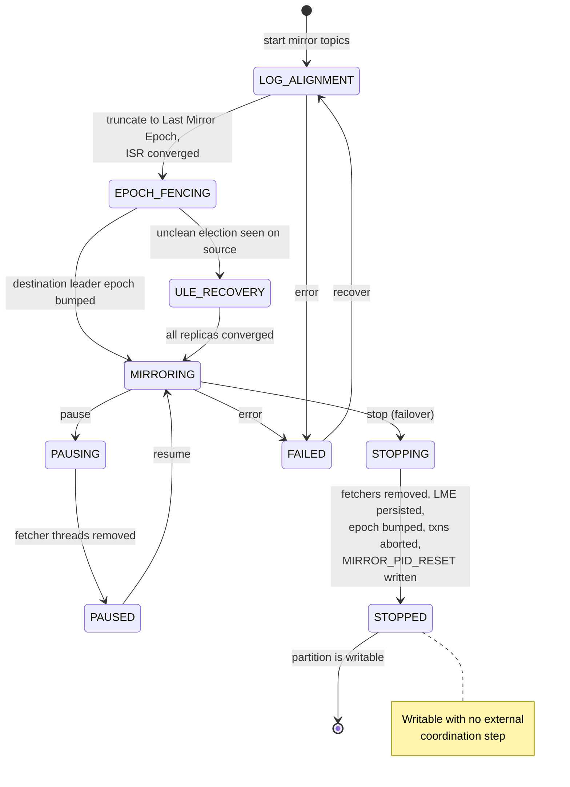

<!--
entry-meta
date: 2026-09-24
type: daily-diff
category: Daily Diff
title: Daily Diff — 2026-09-24
slug: sqlite-index-btrees-sort-order-covering
-->

# Daily Diff — Edition 2026-09-22

**2026-09-24 · Daily Diff Digest**

Covering **[tdd.cat edition 2026-09-22](https://tdd.cat/2026-09-22/)** (Edition 060, 99 stories — 69 featured plus 30 curated). This is the newest edition the archive carries; the 2026-09-21 edition was covered in [yesterday's digest](../2026-09-23-sqlite-rowid-ipk-without-rowid/daily-diff.md), and nothing has published for 09-23 or 09-24 yet — [the archive](https://tdd.cat/archive) states editions ship "with a 2-day settling window so the highest-signal discussions and insights surface."

## The Edition, Point-Wise

**Systems and infrastructure**

- **Kafka native cluster mirroring (KIP-1279)** — cross-cluster replication moves from external Connect workers into the brokers themselves; offsets become identical across clusters. [Red Hat Developer](https://developers.redhat.com/articles/2026/09/22/data-liberation-apache-kafka-native-cluster-mirroring). Deep dive below.
- **Orphaned VMs for zero-downtime host kernel updates** — Google-originated Linux patches letting guests keep running while the host kernel is replaced. [Phoronix](https://www.phoronix.com/news/Orphaned-VMs-Linux-Patches)
- **AMD RDRAND/RDSEED may never return zero** — a claim that the hardware RNG's output range is missing a value, which would be a real problem for anything treating it as uniform. [flatassembler board](https://board.flatassembler.net/topic.php?t=24261)
- **`CatQueue`** — a PostgreSQL-native job queue for Node.js benchmarked against Redis-backed queues, i.e. the recurring "do you actually need a second datastore" argument. [GitHub](https://github.com/karanrajsurya/CatQueue)
- **Cloudflare Worker Previews** — isolated production-like URLs per Git branch. [Cloudflare blog](https://blog.cloudflare.com/worker-previews/)
- **`npunlock`** — custom C kernels on Intel Core Ultra NPUs, bypassing the vendor's graph-level-only programming model. [GitHub](https://github.com/hsfzxjy/npunlock)
- **BigQuery cost work** — partitioning, clustering and materialized views, the usual three levers. [Erathos](https://www.erathos.com/en/blog/bigquery-cost-optimization)

**Languages, correctness, performance**

- **Type punning in C/C++** — strict aliasing, and why `memcpy` and unions are the safe forms. [pwkf.org](https://blog.pwkf.org/2026/09/21/correct-type-punning-in-c.html)
- **Fearless SIMD 1.0** — safe Rust SIMD abstractions without `unsafe` blocks. [Linebender](https://linebender.org/blog/fearless-simd-1-0/)
- **Agentic LLMs optimising Rust** — claimed 2×–20× speedups over existing libraries through iteration. [minimaxir](https://minimaxir.com/2026/09/agentic-iteration/)
- **`pytrace`** — zero-dependency Python SDK for J-Link/J-Trace hardware instruction tracing and coverage. [GitHub](https://github.com/embedder-dev/pytrace)

**AI infrastructure and agents** (the bulk of the edition)

- **JetBrains Air** — a platform for agent-driven development with governance. [JetBrains blog](https://blog.jetbrains.com/blog/2026/09/22/introducing-jetbrains-air/)
- **Meta's Muse LLM filesystem leak** — 6.8 GB exposed through ordinary interaction, including SSH keys. [mouse.dev](https://mouse.dev/blog/muse-runtime-export/)
- **Autonomous agents breaching retailers for $25** — 600,000+ cards claimed. [Gambit Security](https://gambit.security/blog-posts/autonomous-ai-agents-online-retailers-25-a-company)
- **Public benchmark dataset audit** — answer contamination and incomplete tests inflating reported model performance. [Horizon Analytics Labs](https://www.horizonanalyticslabs.com/research/public-benchmark-dataset-audit)
- **Sandboxing, repeatedly** — `Drop` (rootless namespaces + gVisor) [droprun.sh](https://droprun.sh/) and `smolvm` (Firecracker micro-VMs) [Simon Willison](https://simonwillison.net/2026/Aug/19/smolmachines-untrusted-sandbox/).
- **A "Jev" cluster** — as on 09-21, a large fraction of the edition is one small calibrated-decision model and its ecosystem: [MotherDuck's `prompt_jev()`](https://motherduck.com/blog/motherduck-supports-jev/), [JevBench](https://benchmarkheaven.com/jev-models), [`blink`](https://github.com/sqliteai/blink) (a 452 KB C/WASM build, from the SQLite AI org), [agent-memory selection vs a cross-encoder](https://getunblocked.com/blog/jev-in-production-vs-cross-encoder/). Two consecutive editions dominated by one model release is a signal about tdd.cat's ranking as much as about the model.

## Deep Dive: KIP-1279, Cluster Mirroring Inside the Broker

Picked because it is the item in this edition with a real mechanism behind it and a primary design document to read, and because it is the same class of problem this track is working through from the other end: what a log is, what an offset means, and what it costs to make two copies of one agree.

### What it replaces

MirrorMaker 2 has been the standard since Kafka 2.4. It is a Kafka Connect application: it consumes from the source cluster and produces to the destination. Everything awkward about it follows from that.

| dimension | MirrorMaker 2 | KIP-1279 cluster mirroring |
|---|---|---|
| deployment | external Connect workers | embedded in every destination broker |
| compression | decompress, then recompress | original batch bytes pass through |
| offsets | lossy translation via internal topics | **identical** on both clusters |
| consumer failover | query the offset-translation topic | resume at the same offset |

The offset row is the one that changes application code. Because MM2 *produces* records, the destination assigns its own offsets, and the mapping between the two is approximate and stored out of band. KIP-1279's destination brokers instead **fetch** committed records with the ordinary fetch protocol and append the raw bytes to the local log, so the destination "maintains the same offsets as the source, **including gaps left by topic compaction**". Topic IDs are replicated too, so a partition is identifiable across clusters rather than merely similarly named.

### The three components

| component | role |
|---|---|
| `MirrorMetadataManager` | a `MetadataPublisher` on every broker, reacting to KRaft metadata-log changes; holds an Admin client to the source and refreshes source metadata every 60 s by default; syncs topic configs, group offsets and ACLs |
| `ClusterMirrorCoordinator` | the partition state machine, persisted to an internal compacted topic `__mirror_state` (`mirror.state.topic.num.partitions` = 50, `mirror.state.topic.replication.factor` = 3), keyed by `(mirrorName, topicId, partition)` — the same coordinator pattern Kafka already uses for consumer groups and transactions |
| `MirrorFetcherThread` | extends `AbstractFetcherThread`, the same base class as intra-cluster replication; each thread carries its own `NetworkClient` so SASL/SSL contexts stay isolated per mirror |

Reusing `AbstractFetcherThread` is the design's central bet: cross-cluster replication is being defined as *the follower-fetch path pointed at a different cluster*, not as a new subsystem. That is what makes byte-for-byte batch pass-through and offset identity fall out rather than having to be engineered.

### The state machine

Each mirrored partition moves through nine states, fenced by two monotonic counters — a **leader epoch** (which broker is responsible) and a **state epoch** (logical version of the state record itself):

Two details are worth pulling out.

**The destination does not bump its leader epoch during normal replication.** It preserves the source's, maintaining the invariant *destination leader epoch ≥ source leader epoch* to avoid metadata-refresh loops. When the source's epoch catches up, the destination bumps by **10** with a threshold of **3** — buying a window of seven further source elections before the next bump is needed. A batched counter increment standing in for per-election coordination.

**`MIRROR_PID_RESET` is a control record in the log.** On `STOPPING`, before the partition becomes writable, the broker appends a control record that expires every `ProducerStateManager` entry derived from mirrored data. It is processed identically on leaders, on followers, and during log recovery, and is filtered out of consumer fetches the way transaction markers are. Producer-ID state is thereby reset *through the log itself* rather than through a side channel — so replicas and a restarted broker reach the same conclusion by replaying bytes they already have. That is the same discipline as a WAL: if a state transition must survive a crash and be agreed on by several readers, put it in the log.

### Operationally

New CLI `kafka-cluster-mirrors.sh` with `--create / --start / --stop / --pause / --resume / --recover / --delete / --list / --describe`, mirrored by Admin methods (`createClusterMirror`, `startMirrorTopics`, `stopMirrorTopics`, `pauseMirrorTopics`, `resumeMirrorTopics`, `recoverMirrorTopics`, `deleteClusterMirror`, `listClusterMirrors`, `describeClusterMirrors`) and five new inter-broker RPCs: `ReadMirrorStates`, `WriteMirrorStates`, `ReadMirrorOffsets`, `BumpLeaderEpochs`, `DescribeClusterMirrors`. Throttling is `mirror.replication.throttled.rate` (broker) and `mirror.replication.throttled.replicas` (topic); the feature is gated behind a `mirror.version` flag. Source brokers as old as **Kafka 2.1** are supported, using the forward compatibility introduced in 4.0.

Consumer group offsets are synced periodically and clamped into the destination's valid range as `max(destLSO, min(destLEO, sourceLSO))` — belt and braces on top of offset identity, since a lagging destination can legitimately not yet have the offset the source committed.

### What it does not do

The KIP is unusually direct about its limits, and they are the interesting part:

- **Asynchronous, so RPO is non-zero** and equals replication lag at the moment of failure. Synchronous mirroring is deferred to KIP-1360.
- **No exactly-once across clusters.** The mirror fetcher reads with `READ_UNCOMMITTED` isolation.
- **Kafka Streams internal topics are not safe to mirror**: "Cluster mirroring replicates topics asynchronously and independently, so it cannot preserve these transactional boundaries."
- **Tiered storage is incompatible** — a partition with local tiered storage enabled goes to `FAILED`, because truncation is unsupported there. Given that the whole failover path opens with "truncate to Last Mirror Epoch", that is structural, not an oversight.
- **Compaction tombstones past the replication watermark at failover are lost permanently.**
- **Active-active needs distinct topics** to avoid replication loops.
- **Destination configs get overwritten** by the periodic source sync, which will fight any external cluster-management system.
- **Unclean leader elections need explicit opt-in** (`mirror.unclean.leader.election.enable=true`); without it, divergent data may not be detected.

### Why it matters

The pattern worth taking away is the one in the `MIRROR_PID_RESET` record and the `__mirror_state` compacted topic: both push coordination state into logs that the existing replication machinery already makes durable and ordered, instead of inventing a control plane beside them. That is the same move that makes a b-tree's freelist live in the database file, and the same move that makes SQLite's schema cookie a page-1 field rather than an out-of-band signal. Kafka already had an exactly-once-durable, totally-ordered, replicated log; KIP-1279's real content is the decision to express cross-cluster replication entirely in terms of it.

The honest caveat: this is a design document plus a vendor explainer, not a shipped-and-measured feature. The claims about compression pass-through and offset identity are structural and believable; the operational claims — failover latency, the cost of 60-second metadata refresh at scale, how `FAILED`-state recovery behaves under a real partition — are unmeasured here.

## Sources

- [The Daily Diff — edition 2026-09-22](https://tdd.cat/2026-09-22/) — the edition summarised above (99 stories).
- [The Daily Diff — archive](https://tdd.cat/archive) — edition list confirming 2026-09-22 is Edition 060 and the newest published, and the "2-day settling window" note.
- [Data liberation: Apache Kafka's native cluster mirroring — Red Hat Developer](https://developers.redhat.com/articles/2026/09/22/data-liberation-apache-kafka-native-cluster-mirroring) — the MM2 comparison table, the three components, the 60-second metadata refresh default, compression pass-through, the "same offsets as the source, including gaps left by topic compaction" claim, Kafka 2.1 source compatibility, and the asynchronous-RPO limitation.
- [KIP-1279: Cluster Mirroring — Apache Kafka wiki](https://cwiki.apache.org/confluence/display/KAFKA/KIP-1279:+Cluster+Mirroring) — the primary design document: configs, the five new RPCs, the Admin API and `kafka-cluster-mirrors.sh` surface, the `__mirror_state` key structure, the nine-state machine, the leader-epoch bump-by-10/threshold-3 scheme, the offset clamp formula, `MIRROR_PID_RESET`, and the limitations and rejected alternatives.
- [KIP-1279 — Conduktor Kafka Options Explorer](https://kafka-options-explorer.conduktor.io/kip/1279/) — configuration index entry for the KIP.
- [[DISCUSS] KIP-1279: Cluster Mirroring — dev@kafka.apache.org](https://lists.apache.org/thread/vr3nj1smtjtl4qfn5opk7ozjc6jqjjsw) — the design discussion thread.
