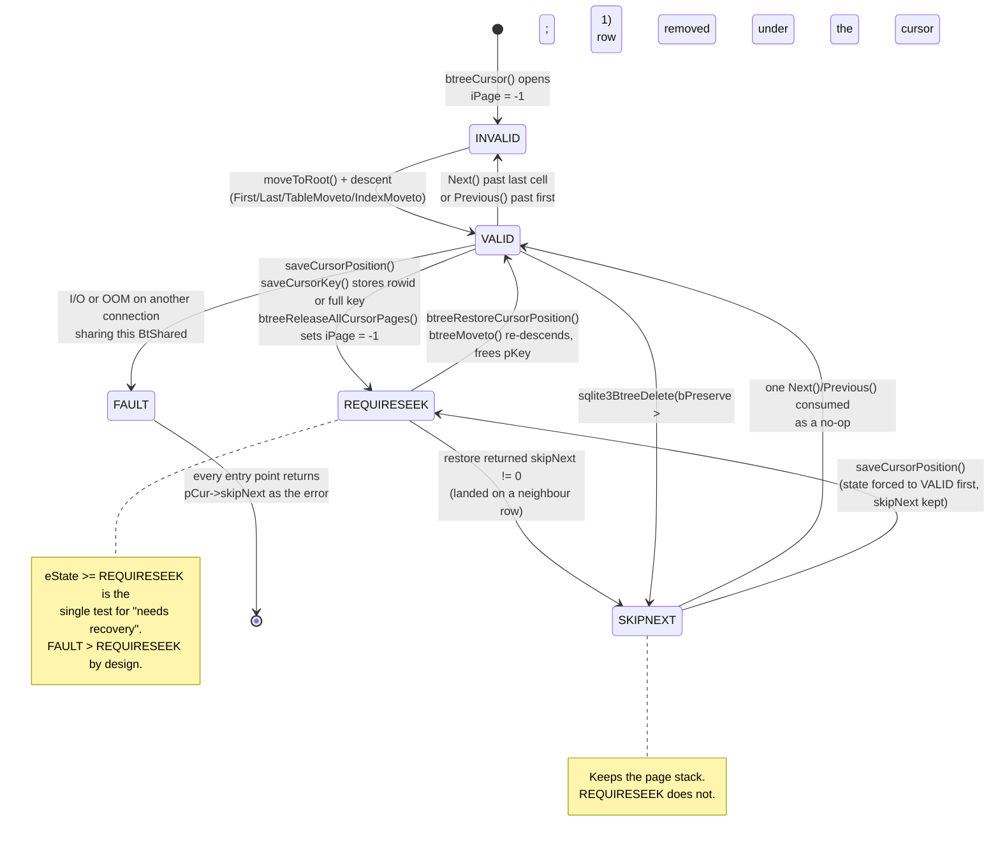
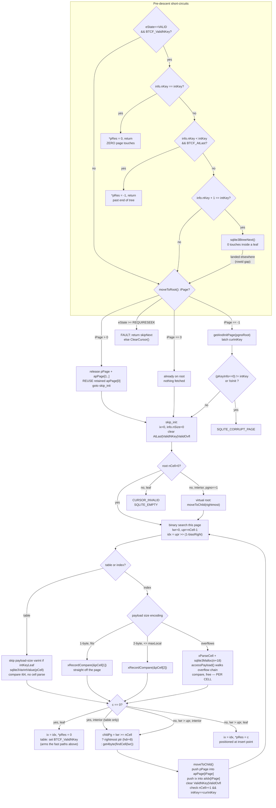

<!--
entry-meta
date: 2026-09-25
type: lesson
track: SQLite
lesson: 10
category: Database Internals
title: BtCursor Navigation — The Page Stack, the Two Movetos, and Save/Restore
slug: sqlite-btcursor-navigation-seek-restore
-->

# BtCursor Navigation — The Page Stack, the Two Movetos, and Save/Restore

**2026-09-25 · SQLite Track · Lesson 10 of 32**

## Where This Fits

- **Previous lesson:** [Lesson 09](../2026-09-24-sqlite-index-btrees-sort-order-covering/README.md) established what an index seek *compares*: `KeyInfo` carrying `aSortFlags`/`aColl`, the asymmetric comparator that never materialises the stored key, `default_rc` turning a short probe into a boundary search, and `sqlite3VdbeFindCompare()` choosing one of three comparators per probe.
- **This lesson:** what *walks*. `BtCursor`'s explicit page stack, the two `Moveto` entry points that drive the descent (they are not symmetric, and §7 measures a 25× gap between them), the five-state cursor machine, and what happens to a cursor when the tree changes underneath it.
- **What it explains retroactively:** Lesson 09 §5.1 found that `BTREE_SEEK_EQ` is passed down to the b-tree as a hint and that `eqOnly` skips the paired `IdxGT`. §9 here finishes that thread: the b-tree layer *stores* the hint and never reads it. The whole `eqOnly` mechanism lives in the VDBE.
- **Next:** Lesson 11 takes `balance()`, `balance_nonroot()` and `balance_deeper()` — the code that restructures pages under a cursor. §8's save/restore machinery is the contract that makes Lesson 11 possible without corrupting live cursors.

Source references are to `sqlite/sqlite` at commit **`4b495f9`** (`src/btree.c`, `src/btreeInt.h`, `src/vdbe.c`, `src/vdbeaux.c`, `src/where.c`, `src/util.c`, `src/sqliteInt.h`), read through a code index this run and cited by path and line range. Measurements are against SQLite **3.53.4** via `apsw` 3.53.4.0 with `page_size = 4096`, cross-checked for bytecode against **3.45.1** (Python 3.11's bundled library) — the same pair as Lessons 08–09. No behavioural difference between the two was found for anything in this lesson.

---

## 1. The Cursor Is an Explicit Page Stack

`btreeInt.h` 531–560. The fields that matter for navigation are the last six:

```c
struct BtCursor {
  u8 eState;                /* One of the CURSOR_XXX constants (see below) */
  u8 curFlags;              /* zero or more BTCF_* flags defined below */
  u8 curPagerFlags;         /* Flags to send to sqlite3PagerGet() */
  u8 hints;                 /* As configured by CursorSetHints() */
  int skipNext;    /* Prev() is noop if negative. Next() is noop if positive.
                   ** Error code if eState==CURSOR_FAULT */
  ...
  CellInfo info;            /* A parse of the cell we are pointing at */
  i64 nKey;                 /* Size of pKey, or last integer key */
  Pgno pgnoRoot;            /* The root page of this tree */
  i8 iPage;                 /* Index of current page in apPage */
  u8 curIntKey;             /* Value of apPage[0]->intKey */
  u16 ix;                   /* Current index for apPage[iPage] */
  u16 aiIdx[BTCURSOR_MAX_DEPTH-1];     /* Current index in apPage[i] */
  struct KeyInfo *pKeyInfo;            /* Arg passed to comparison function */
  MemPage *pPage;                        /* Current page */
  MemPage *apPage[BTCURSOR_MAX_DEPTH-1]; /* Stack of parents of current page */
};
```

Read the representation carefully, because three things about it drive everything else:

| field | role |
|---|---|
| `pPage` / `ix` | the *current* page and the cell index within it — the cursor's actual position |
| `apPage[0..iPage-1]` / `aiIdx[0..iPage-1]` | the ancestors already descended through, and which child pointer was taken at each |
| `iPage` | stack depth; **`-1` means no page is held at all** |

So the current page is deliberately *not* stored in `apPage[iPage]` — it lives in its own field, and `apPage` holds only ancestors. `moveToChild()` is what pushes the old current page into the array. This split is why `apPage` and `aiIdx` are sized `BTCURSOR_MAX_DEPTH-1` rather than `BTCURSOR_MAX_DEPTH`.

`BTCURSOR_MAX_DEPTH` is 20, and the comment at `btreeInt.h` 488–497 derives it rather than asserting it:

> "Maximum depth of an SQLite B-Tree structure. Any B-Tree deeper than this will be declared corrupt. This value is calculated based on a maximum database size of 2^31 pages a minimum fanout of 2 for a root-node and 3 for all other internal nodes. If a tree that appears to be taller than this is encountered, it is assumed that the database is corrupt."

Every page in the stack is a **held pager reference**. A cursor sitting on a leaf of a depth-5 tree is pinning five pages in the page cache. That is the cost side of the stack, and §8 is about the code that gives it up.

### 1.1 The flags that are position-derived cache

`btreeInt.h` 565–571:

```c
#define BTCF_WriteFlag    0x01   /* True if a write cursor */
#define BTCF_ValidNKey    0x02   /* True if info.nKey is valid */
#define BTCF_ValidOvfl    0x04   /* True if aOverflow is valid */
#define BTCF_AtLast       0x08   /* Cursor is pointing to the last entry */
#define BTCF_Incrblob     0x10   /* True if an incremental I/O handle */
#define BTCF_Multiple     0x20   /* Maybe another cursor on the same btree */
#define BTCF_Pinned       0x40   /* Cursor is busy and cannot be moved */
```

Three of these — `ValidNKey`, `ValidOvfl`, `AtLast` — are caches *about the current position*, so any movement must invalidate them. That invalidation is the first thing every move function does, and §5's fast paths are entirely about reading those caches before deciding to move at all.

## 2. `moveToChild()` and `moveToParent()` — Push and Pop

`btree.c` 5486–5513:

```c
static int moveToChild(BtCursor *pCur, u32 newPgno){
  ...
  if( pCur->iPage>=(BTCURSOR_MAX_DEPTH-1) ){
    return SQLITE_CORRUPT_BKPT;
  }
  pCur->info.nSize = 0;
  pCur->curFlags &= ~(BTCF_ValidNKey|BTCF_ValidOvfl);
  pCur->aiIdx[pCur->iPage] = pCur->ix;
  pCur->apPage[pCur->iPage] = pCur->pPage;
  pCur->ix = 0;
  pCur->iPage++;
  rc = getAndInitPage(pCur->pBt, newPgno, &pCur->pPage, pCur->curPagerFlags);
  assert( pCur->pPage!=0 || rc!=SQLITE_OK );
  if( rc==SQLITE_OK
   && (pCur->pPage->nCell<1 || pCur->pPage->intKey!=pCur->curIntKey)
  ){
    releasePage(pCur->pPage);
    rc = SQLITE_CORRUPT_PGNO(newPgno);
  }
  if( rc ){
    pCur->pPage = pCur->apPage[--pCur->iPage];
  }
  return rc;
}
```

Six lines of bookkeeping, then the fetch, then two integrity gates:

- **Depth gate.** `iPage >= 19` is corruption, not an error to grow out of. The stack is fixed-size and the tree is declared corrupt rather than the cursor reallocated.
- **`nCell<1`.** Every page reached by a descent must have at least one cell. An empty non-root page is corruption. (This is why the seek loops below can `assert( pPage->nCell>0 )` without checking.)
- **`intKey != curIntKey`.** `curIntKey` was latched from `apPage[0]` when the root was loaded (§3). A child whose page-type flag disagrees with the root's means an intkey page is parenting a non-intkey page — the function's own header comment calls this out as the reason it can return `SQLITE_CORRUPT`. It is a cheap, per-hop cross-check that a b-tree has not been spliced into another b-tree.
- **Failure unwinds.** `pCur->pPage = pCur->apPage[--pCur->iPage]` restores the previous current page, so a failed descent leaves a *consistent* cursor rather than a half-pushed one.

`moveToParent()` (5545–5563) is the exact inverse, and its one interesting line is how it restores `ix`:

```c
pCur->ix = pCur->aiIdx[pCur->iPage-1];
pLeaf = pCur->pPage;
pCur->pPage = pCur->apPage[--pCur->iPage];
releasePageNotNull(pLeaf);
```

The cursor comes back up pointing *at the cell whose child pointer it descended through* — not past it. For a right-most descent, `aiIdx[]` holds `nCell`, one past the last valid cell index, which the code explicitly tolerates (`testcase( pCur->aiIdx[pCur->iPage-1] > pCur->apPage[pCur->iPage-1]->nCell )`). §4 shows why that out-of-range value is load-bearing for `Next()`.

## 3. `moveToRoot()` — Three Entry Paths and a Retained Root

`btree.c` 5586–5663. The function has three distinct entry conditions, and the difference between them is the single most important performance fact in this lesson.

```c
  if( pCur->iPage>=0 ){
    if( pCur->iPage ){
      releasePageNotNull(pCur->pPage);
      while( --pCur->iPage ){
        releasePageNotNull(pCur->apPage[pCur->iPage]);
      }
      pRoot = pCur->pPage = pCur->apPage[0];
      goto skip_init;
    }
  }else if( pCur->pgnoRoot==0 ){
    pCur->eState = CURSOR_INVALID;
    return SQLITE_EMPTY;
  }else{
    assert( pCur->iPage==(-1) );
    if( pCur->eState>=CURSOR_REQUIRESEEK ){
      if( pCur->eState==CURSOR_FAULT ){
        assert( pCur->skipNext!=SQLITE_OK );
        return pCur->skipNext;
      }
      sqlite3BtreeClearCursor(pCur);
    }
    rc = getAndInitPage(pCur->pBt, pCur->pgnoRoot, &pCur->pPage,
                        pCur->curPagerFlags);
    ...
    pCur->iPage = 0;
    pCur->curIntKey = pCur->pPage->intKey;
  }
```

| entry condition | what happens |
|---|---|
| `iPage > 0` (cursor is somewhere in the tree) | release the current page and every ancestor **except `apPage[0]`**, reuse the retained root, `goto skip_init` |
| `iPage == 0` (already on the root) | fall straight through to `skip_init`; nothing released, nothing fetched |
| `iPage == -1` (no pages held) | fetch the root with `getAndInitPage()` and latch `curIntKey` from it |

**The root page is never released by a re-seek.** `apPage[0]` is retained across every `moveToRoot()` for the life of the cursor. That is why a re-seek into a depth-3 tree costs **two** page fetches, not three — a number §7 measures as a constant 2.003 across four different access patterns.

Two more details:

- **The virtual root.** If the root has no cells but is not a leaf, the tree's real content starts one level down, and the cursor descends immediately (5652–5657). The code requires `pRoot->pgno==1` for this, because the only root that can be cell-less-but-interior is page 1, whose first 100 bytes are the file header from Lesson 01 — leaving too little room for the page to hold cells.
- **The type cross-check, repeated.** 5641: `if( pRoot->isInit==0 || (pCur->pKeyInfo==0)!=pRoot->intKey ) return SQLITE_CORRUPT_PAGE(...)`. The comment says earlier versions assumed this could not fail when the root was already loaded, "But this is not so if the database is corrupted in such a way that page pRoot is linked into a second b-tree table (or the freelist)." A cursor's `pKeyInfo` being NULL or not — Lesson 09's index/table distinction — is checked against the page's own flag byte on every trip to the root.

`skip_init` then resets position state and clears the three position caches:

```c
skip_init:
  pCur->ix = 0;
  pCur->info.nSize = 0;
  pCur->curFlags &= ~(BTCF_AtLast|BTCF_ValidNKey|BTCF_ValidOvfl);
```

## 4. Five States, and `skipNext`'s Four Meanings

`btreeInt.h` 603–607 defines the states, and their *numeric order* is asserted as meaningful in `moveToRoot()` (5591–5593):

```c
assert( CURSOR_INVALID < CURSOR_REQUIRESEEK );
assert( CURSOR_VALID   < CURSOR_REQUIRESEEK );
assert( CURSOR_FAULT   > CURSOR_REQUIRESEEK );
```

so `eState >= CURSOR_REQUIRESEEK` is the single comparison that means "this cursor needs recovery work", and `restoreCursorPosition()` is a macro on exactly that test (932–935).

| state | value | meaning | `skipNext` means |
|---|---|---|---|
| `CURSOR_VALID` | 0 | points at a real entry; payload accessors legal | ignored |
| `CURSOR_INVALID` | 1 | points at nothing (empty tree, or ran off either end) | ignored |
| `CURSOR_SKIPNEXT` | 2 | valid, but the next step must be a no-op | `>0`: `Next()` is a no-op; `<0`: `Previous()` is a no-op |
| `CURSOR_REQUIRESEEK` | 3 | tree changed; position saved in `pKey`/`nKey` | if non-zero, restore lands in `SKIPNEXT` |
| `CURSOR_FAULT` | 4 | unrecoverable error on a *different* connection sharing the `BtShared` cache | holds the error code to return |

`CURSOR_VALID` being **0** is not cosmetic. `sqlite3BtreeCursorHasMoved()` (949–955) exploits it:

```c
int sqlite3BtreeCursorHasMoved(BtCursor *pCur){
  assert( EIGHT_BYTE_ALIGNMENT(pCur)
       || pCur==sqlite3BtreeFakeValidCursor() );
  assert( offsetof(BtCursor, eState)==0 );
  assert( sizeof(pCur->eState)==1 );
  return CURSOR_VALID != *(u8*)pCur;
}
```

A one-byte load from offset zero of the cursor, with asserts pinning both the offset and the size. The check runs on essentially every row of every scan, so it is a dereference and a compare with no field access at all. The companion `sqlite3BtreeFakeValidCursor()` (962–966) returns a pointer to a `static u8 fakeCursor = CURSOR_VALID;` — a one-byte object that answers "no" to this question and must never be passed to any other b-tree entry point.



The distinction the diagram is drawn to make: **`CURSOR_SKIPNEXT` keeps the page stack, `CURSOR_REQUIRESEEK` throws it away.** Both mean "the row you were on may be gone", but only one of them costs a re-descent. §8 shows which operations produce which, and §7 measures the difference at 0.11 versus 4.11 page touches per row.

## 5. `sqlite3BtreeTableMoveto()` — Three Ways To Not Move

`btree.c` 5837–5978. Before any descent, three short-circuits, all gated on the position cache being trustworthy (5853):

```c
  if( pCur->eState==CURSOR_VALID && (pCur->curFlags & BTCF_ValidNKey)!=0 ){
    if( pCur->info.nKey==intKey ){
      *pRes = 0;
      return SQLITE_OK;
    }
    if( pCur->info.nKey<intKey ){
      if( (pCur->curFlags & BTCF_AtLast)!=0 ){
        assert( cursorIsAtLastEntry(pCur) || CORRUPT_DB );
        *pRes = -1;
        return SQLITE_OK;
      }
      /* If the requested key is one more than the previous key, then
      ** try to get there using sqlite3BtreeNext() rather than a full
      ** binary search.  This is an optimization only.  The correct answer
      ** is still obtained without this case, only a little more slowly. */
      if( pCur->info.nKey+1==intKey ){
        *pRes = 0;
        rc = sqlite3BtreeNext(pCur, 0);
        if( rc==SQLITE_OK ){
          getCellInfo(pCur);
          if( pCur->info.nKey==intKey ){
            return SQLITE_OK;
          }
        }else if( rc!=SQLITE_DONE ){
          return rc;
        }
      }
    }
  }
```

| # | condition | result |
|---|---|---|
| 1 | `info.nKey == intKey` | already there; zero work |
| 2 | `info.nKey < intKey` and `BTCF_AtLast` | the target is past the end of the tree; `*pRes = -1`, zero work |
| 3 | `info.nKey + 1 == intKey` | one `sqlite3BtreeNext()` instead of a descent |

Case 3 is the one that matters, and note precisely how narrow it is:

- **Exactly `+1`.** Not "same leaf page", not "nearby". `+2` falls through to a full descent.
- **Ascending only.** The whole block is inside `if( pCur->info.nKey<intKey )`. **There is no `nKey-1 == intKey` case and no `sqlite3BtreePrevious()` counterpart.** Descending consecutive access gets nothing. §7 measures that asymmetry.
- **Speculative.** If `Next()` does not land on `intKey` after all (a gap in the rowids), the code falls through into the descent below. The comment is explicit that this is "an optimization only".

### 5.1 `biasRight`, and who actually sets it

The descent's first probe index (5919–5920):

```c
  assert( biasRight==0 || biasRight==1 );
  idx = upr>>(1-biasRight); /* idx = biasRight ? upr : (lwr+upr)/2; */
```

A branchless pick between "start the binary search at the high end" and "start in the middle". Grepping every caller of `sqlite3BtreeTableMoveto()` in the tree:

| caller | `biasRight` |
|---|---|
| `btreeMoveto()` (restore path), `btree.c` 894 | `bias` — and `btreeRestoreCursorPosition()` passes **0** (918) |
| `sqlite3BtreeInsert()`, `btree.c` 9545 | `(flags & BTREE_APPEND)!=0` |
| `OP_SeekRowid`/`OP_NotExists`, `vdbe.c` 5055 | 0 |
| `OP_NewRowid` probe, `vdbe.c` 5691, 5848 | 0 |
| `sqlite3VdbeFinishMoveto()`, `vdbeaux.c` 3820 | 0 |

So `biasRight=1` is reachable from exactly one place: an insert flagged as an append. Every read path passes 0. The parameter exists for the bulk-load case, where the answer is always "the last cell".

### 5.2 The inner loop reads the key without parsing the cell

5921–5953:

```c
    for(;;){
      i64 nCellKey;
      pCell = findCellPastPtr(pPage, idx);
      if( pPage->intKeyLeaf ){
        while( 0x80 <= *(pCell++) ){
          if( pCell>=pPage->aDataEnd ){
            return SQLITE_CORRUPT_PAGE(pPage);
          }
        }
      }
      nCellKey = sqlite3VarintValue(pCell);
```

For a table **leaf** cell the layout from Lesson 03 is `payload-size varint, rowid varint, payload`; for a table **interior** cell it is `child pointer, rowid varint`. `findCellPastPtr()` (1195–1196) already skips the 4-byte child pointer by indexing off `aDataOfst` instead of `aData`, so the only remaining difference is the leading payload-size varint on leaves — skipped by the `while( 0x80 <= *(pCell++) )` loop, which walks continuation bytes with a bounds check against `aDataEnd` on each step.

Then `sqlite3VarintValue()` (`util.c` 1663–1668):

> "Return the value of a variable-length integer without computing its length. This is an optimization on sqlite3GetVarint() for the cases when the return value of sqlite3GetVarint() is not needed."

No `CellInfo` is filled, no `xParseCell` is called, no payload size is computed. A table-b-tree descent touches exactly the bytes of the rowid varints it compares — Lesson 02's varint format being read at its cheapest possible granularity.

### 5.3 Landing

Exact hit on an **interior** page does not stop the search (5941–5943): `lwr = idx; goto moveto_table_next_layer;`. Because a table b-tree's interior cells carry keys that also exist below, finding the key upstairs still requires descending to the leaf that holds the row. Only `pPage->leaf` returns with `*pRes = 0` and sets `BTCF_ValidNKey` — the flag that arms §5's fast paths for the *next* call.

## 6. `sqlite3BtreeIndexMoveto()` — A Different Bargain

`btree.c` 6068–6299. Same shape, materially different economics.

### 6.1 The only bypass, and how narrow it is

There is no `+1` shortcut — an index key is a record, not an integer, so "one more than" is not defined. What exists instead (6104–6127):

```c
  if( pCur->eState==CURSOR_VALID
   && pCur->pPage->leaf
   && cursorOnLastPage(pCur)
  ){
    int c;
    if( pCur->ix==pCur->pPage->nCell-1
     && (c = indexCellCompare(pCur->pPage,pCur->ix,pIdxKey,xRecordCompare))<=0
     && pIdxKey->errCode==SQLITE_OK
    ){
      *pRes = c;
      return SQLITE_OK;  /* Cursor already pointing at the correct spot */
    }
    if( pCur->iPage>0
     && indexCellCompare(pCur->pPage, 0, pIdxKey, xRecordCompare)<=0
     && pIdxKey->errCode==SQLITE_OK
    ){
      ...
      goto bypass_moveto_root;  /* Start search on the current page */
    }
```

The gate is `cursorOnLastPage()` (6032–6040):

```c
static int cursorOnLastPage(BtCursor *pCur){
  int i;
  for(i=0; i<pCur->iPage; i++){
    MemPage *pPage = pCur->apPage[i];
    if( pCur->aiIdx[i]<pPage->nCell ) return 0;
  }
  return 1;
}
```

This demands that at **every** ancestor level the cursor took the right-most child pointer. Not "the correct leaf" — the *last* leaf of the entire index. So the bypass serves ascending bulk load into an index and essentially nothing else. §7 measures that it is invisible even for a probe stream walking the index's tail in order.

`indexCellCompare()` (5996–6026) is careful to be safely abandonable — its header says "It is always safe to return a positive value as that will cause the optimization to be skipped", and it returns the sentinel `99` whenever the cell overflows the page, so the optimisation never drags in an overflow-chain read.

### 6.2 Three cell-size branches, and the one that allocates

The descent's per-cell work (6175–6230) splits on how the payload-size varint encodes:

| branch | condition | cost |
|---|---|---|
| 1-byte size, fits on page | `nCell <= pPage->max1bytePayload` | `xRecordCompare(nCell, &pCell[1], pIdxKey)` — compares straight against the page buffer |
| 2-byte size, fits on page | `!(pCell[1] & 0x80)` and `nCell <= pPage->maxLocal` | same, from `&pCell[2]` |
| overflows | otherwise | `xParseCell` → `sqlite3Malloc(nCell + 18)` → `accessPayload()` → compare → `sqlite3_free` |

The first two are the Lesson 09 comparator running directly on mapped page bytes. The third reassembles the key through Lesson 05's overflow chain into a heap buffer **per comparison**, which for a depth-*d* index means up to *d* malloc/free pairs and *d* chain walks for one seek. The comment explains the `nOverrun`:

> "If the record is corrupt, the xRecordCompare routine may read up to two varints past the end of the buffer. An extra 18 bytes of padding is allocated at the end of the buffer in case this happens."

That is the same overread budget Lesson 09 §4 found behind `nAllField <= 13`, showing up here as an explicit allocation.

### 6.3 `moveToChild()` is hand-inlined here

6266–6293 duplicates `moveToChild()`'s body verbatim under a comment saying so:

```c
    /* This block is similar to an in-lined version of:
    **
    **    pCur->ix = (u16)lwr;
    **    rc = moveToChild(pCur, chldPg);
    **    if( rc ) break;
    */
```

The table seek at 5971 calls the real function. Only the index path inlines it — the path where each level's comparison is already the expensive part, so the descent loop is the one worth keeping free of call overhead.

## 7. Measured: What the Fast Paths Are Actually Worth

Setup: 200,000-row table `t(a INTEGER PRIMARY KEY, v BLOB)` with 300-byte payloads, `page_size=4096`, `cache_size=-200000` (200 MiB, so the whole database is resident and **every measurement has zero cache misses** — this isolates b-tree work from I/O). Probes are driven by a join, `SELECT count(v) FROM p JOIN t ON t.a=p.k`, so the inner cursor stays open across all 50,000 probes and the fast paths in §5 can actually engage. `dbstat` reports table depth 3. Page touches are `SQLITE_DBSTATUS_CACHE_HIT + CACHE_MISS` per probe.

**Table b-tree, by probe ordering:**

| probe order | page touches / probe | µs / probe |
|---|---|---|
| consecutive ascending (`+1`) | **0.080** | 0.06 |
| ascending, stride 4 | 2.003 | 0.23 |
| ascending, stride 40 | 2.003 | 0.14 |
| random over the whole table | 2.003 | 0.50 |
| consecutive **descending** (`-1`) | 2.003 | 0.16 |

Four things to read off this.

1. **`+1` costs 0.080 page touches; everything else costs 2.003.** A 25× structural difference from the single branch at 5868. The 0.080 is not noise — with 300-byte rows about 13 fit per 4 KiB leaf, and `1/13 = 0.077`. The residual *is* the leaf-boundary crossings: `sqlite3BtreeNext()` stays on the current page until `ix` runs past `nCell`, and only then fetches.
2. **2.003 for a depth-3 tree is 2, not 3, because of §3.** `moveToRoot()` retains `apPage[0]`. The root is never re-fetched; the interior page and the leaf are. The constant is identical across stride 4, stride 40, random, and descending — it is the shape of a re-descent, and nothing about probe ordering changes it.
3. **Stride 4 gets nothing.** Four consecutive probes land on the same leaf page, and SQLite re-descends from the root for each one. There is no "am I already on the right page" test on the table path — the only positional test is exact-equality, `AtLast`, or exactly `+1`.
4. **Descending consecutive access gets nothing.** Same page touches as random. This is the asymmetry from §5 made visible: the fast-path block is inside `if( pCur->info.nKey<intKey )` and has no `Previous()` twin. A reverse-order rowid join pays full price.

Wall clock separates from page touches in an instructive way: stride 4 (0.23 µs) beats random (0.50 µs) at *identical* page touches. That gap is CPU cache and branch behaviour inside the binary search over a hot page, not b-tree work — the kind of difference page-touch counting cannot see, and the reason both numbers are reported.

**Index b-tree, same table plus `CREATE INDEX i ON t(k)` over `'key%07d'` values, index depth 3, probes answered index-only (covering, so no table descent):**

| probe order | page touches / probe | µs / probe |
|---|---|---|
| consecutive ascending | 2.009 | 0.21 |
| random | 2.009 | 0.50 |
| consecutive descending | 2.009 | 0.22 |
| ascending along the index **tail** | 2.001 | 0.25 |

**The index path has no ordering optimisation at all.** 2.009 in every direction, and walking the tail in order — the one access pattern `cursorOnLastPage()` was written for — moves it to 2.001, which is within noise of the others because only the probes actually landing on the final leaf qualify. The asymmetry between the two `Moveto` functions is not a subtlety; it is the difference between 0.080 and 2.009 on the same data.

**Re-seek versus a resident cursor.** 100,000 rows, 200-byte payloads, measuring `DELETE`:

| statement | page touches / deleted row | wall clock |
|---|---|---|
| `DELETE FROM t WHERE a%2=0` (one-pass scan) | **0.112** | 0.033 s |
| `DELETE FROM t WHERE a IN (SELECT a FROM t)` (stride 1) | 2.428 | 0.037 s |
| `DELETE FROM t WHERE a IN (SELECT a FROM t WHERE a%2=0)` (stride 2) | 4.112 | 0.065 s |
| `DELETE FROM t WHERE a IN (SELECT a FROM t WHERE a%10=0)` (stride 10) | 4.558 | 0.036 s |

The bytecode says what the difference is. The one-pass form is `OpenWrite / Rewind / … / Delete / Next` — one cursor, walked once, its page stack never given up. The `IN (SELECT …)` forms materialise rowids into an ephemeral table and then run `OP_NotExists` per row, which is a fresh `sqlite3BtreeTableMoveto()` from the root for every delete:

```
  17 Rewind 2 24 0        <- ephemeral rowid list
  20 SeekRowid 0 23 2
  24 OpenWrite 0 2 0 3
  26 NotExists 0 28 9 1   <- full re-descent, per row
  27 Delete 0 1 0 t
```

Two independent confirmations fall out of that table:

- **Re-seeking per row costs ~37× the page touches of walking a cursor** (4.112 vs 0.112), on a fully cached database, for the same 50,000 deletes and identical results.
- **Stride 1 is measurably cheaper than stride 2** (2.428 vs 4.112) on the *same* code path — the `+1` shortcut firing on the `NotExists` seeks. It does not reach the read-only path's 0.080 because each `Delete` disturbs the cursor and clears `BTCF_ValidNKey`, so the precondition only holds part of the time. Prediction from reading §5, confirmed by measurement, on a path that was not designed for it.

Both `DELETE` forms left exactly the 50,000 odd-numbered rows and zero even-numbered rows. That correctness under mutation is §8's subject.

**Insert ordering**, for completeness — 200,000 rows, same page size:

| load | page touches / row | wall clock | final pages |
|---|---|---|---|
| table, ascending rowid | 2.84 | 0.12 s | 2,947 |
| table, random rowid | 3.26 | 0.25 s | 3,270 |
| table + index, ascending | 5.76 | 0.20 s | 3,999 |
| table + index, random | 6.26 | 0.45 s | 4,292 |

The touch gap is modest, but the **page count** gap is not: random insertion produced 11% more pages for identical data. That is fill factor, not cursor navigation — ascending inserts pack pages full before moving on, random inserts split them half-empty. Wall clock doubles for reasons the touch count barely registers, which is the same lesson as the stride-4 row above: page touches are the structural measure, not the whole cost.

## 8. Save and Restore — Giving Up the Stack

When the tree is about to change, cursors pointing into it must stop holding page references and stop trusting their `ix`. That is `saveCursorPosition()` (766–790):

```c
static int saveCursorPosition(BtCursor *pCur){
  ...
  if( pCur->curFlags & BTCF_Pinned ){
    return SQLITE_CONSTRAINT_PINNED;
  }
  if( pCur->eState==CURSOR_SKIPNEXT ){
    pCur->eState = CURSOR_VALID;
  }else{
    pCur->skipNext = 0;
  }
  rc = saveCursorKey(pCur);
  if( rc==SQLITE_OK ){
    btreeReleaseAllCursorPages(pCur);
    pCur->eState = CURSOR_REQUIRESEEK;
  }
  pCur->curFlags &= ~(BTCF_ValidNKey|BTCF_ValidOvfl|BTCF_AtLast);
  return rc;
}
```

The position is converted from *where* to *what*. `saveCursorKey()` (724–757) does that conversion, and it costs differently per b-tree kind:

| cursor kind | what is saved | cost |
|---|---|---|
| table (`curIntKey`) | `pCur->nKey = sqlite3BtreeIntegerKey(pCur)` — 8 bytes, in the struct | cannot fail |
| index | the **entire key record** into `sqlite3Malloc(nKey + 9 + 8)` via `sqlite3BtreePayload()` | allocation; can return `SQLITE_NOMEM` |

The 17 bytes of slack are the same overread budget again: "it is possible that the `sqlite3VdbeRecordUnpack()` function may overread the buffer by up to the size of 1 varint plus 1 8-byte value when the cursor position is restored." An index cursor's save is a copy of a whole record; a table cursor's save is an integer. This is a real asymmetry in a write-heavy workload with many open cursors, and it is why the incrblob comment at 11532–11534 can assert that `saveAllCursors()` "can only return SQLITE_OK" on a `BTREE_INTKEY` table.

`BTCF_Pinned` → `SQLITE_CONSTRAINT_PINNED` is the escape valve: a cursor can declare itself immovable (`sqlite3BtreeCursorPin()`, 4962), and then an attempted modification fails rather than relocating it.

### 8.1 Who saves, and the `BTCF_Multiple` filter

`saveAllCursors()` (816–826) is called from eight places — `sqlite3BtreeInsert` (9471), `sqlite3BtreeDelete` (9964), `sqlite3BtreeClearTable` (10330), rollback and savepoint-rollback (4561, 4656), incremental vacuum (4211, 4289), root-page relocation (10155), and `sqlite3BtreePutData` (11536). Its structure is an optimisation for the common case:

```c
  for(p=pBt->pCursor; p; p=p->pNext){
    if( p!=pExcept && (0==iRoot || p->pgnoRoot==iRoot) ) break;
  }
  if( p ) return saveCursorsOnList(p, iRoot, pExcept);
  if( pExcept ) pExcept->curFlags &= ~BTCF_Multiple;
  return SQLITE_OK;
```

The scan only *looks*; the work is in `SQLITE_NOINLINE saveCursorsOnList()`, "broken out from its caller to avoid unnecessary stack pointer movement" in the usual case where nothing needs saving. And the insert/delete paths do not even call it unless `pCur->curFlags & BTCF_Multiple` — a flag `btreeCursor()` sets when a second cursor opens on the same b-tree. When the scan finds no such cursor, it clears the flag, so the check is not repeated.

Note what gets saved and what does not: a cursor in `CURSOR_VALID` or `CURSOR_SKIPNEXT` has its position preserved; any other state just gets `btreeReleaseAllCursorPages()` (840–848). There is nothing to preserve for a cursor that was not pointing anywhere.

### 8.2 Restore, and the one-shot rule

`btreeRestoreCursorPosition()` (906–930):

```c
  pCur->eState = CURSOR_INVALID;
  rc = btreeMoveto(pCur, pCur->pKey, pCur->nKey, 0, &skipNext);
  if( rc==SQLITE_OK ){
    sqlite3_free(pCur->pKey);
    pCur->pKey = 0;
    ...
    if( skipNext ) pCur->skipNext = skipNext;
    if( pCur->skipNext && pCur->eState==CURSOR_VALID ){
      pCur->eState = CURSOR_SKIPNEXT;
    }
  }
```

Its header states the constraint: "this call deletes the saved position info stored by `saveCursorPosition()`, so there can be at most one effective `restoreCursorPosition()` call after each `saveCursorPosition()`." The saved key is freed on success, so save/restore is strictly paired.

`btreeMoveto()` (870–897) is the dispatcher that decides which §5/§6 function runs, on the presence of `pKey`: non-NULL means unpack it into an `UnpackedRecord` and call `sqlite3BtreeIndexMoveto()`; NULL means `nKey` is a rowid and `sqlite3BtreeTableMoveto()` applies. It also validates the unpacked width against Lesson 09's `nAllField` (`pIdxKey->nField==0 || pIdxKey->nField>pKeyInfo->nAllField` → `SQLITE_CORRUPT_BKPT`).

The `skipNext` out-parameter is `*pRes` from the seek. If the restore did not land exactly on the saved key — the row was deleted — the cursor is now on a *neighbour*, and `CURSOR_SKIPNEXT` records which direction the next step must not move, so a scan resumes without skipping or repeating a row.

### 8.3 Delete's cheaper path

`sqlite3BtreeDelete()` does not always force a re-seek. 10051–10070:

```c
  if( rc==SQLITE_OK ){
    if( bPreserve>1 ){
      ...
      pCur->eState = CURSOR_SKIPNEXT;
      if( iCellIdx>=pPage->nCell ){
        pCur->skipNext = -1;
        pCur->ix = pPage->nCell-1;
      }else{
        pCur->skipNext = 1;
      }
    }else{
      rc = moveToRoot(pCur);
      if( bPreserve ){
        btreeReleaseAllCursorPages(pCur);
        pCur->eState = CURSOR_REQUIRESEEK;
      }
      if( rc==SQLITE_EMPTY ) rc = SQLITE_OK;
    }
  }
```

Three outcomes by `bPreserve`:

| `bPreserve` | resulting state | page stack |
|---|---|---|
| `>1` | `CURSOR_SKIPNEXT` with `skipNext` = ±1 | **kept** — the cursor stays on the same leaf |
| `1` | `CURSOR_REQUIRESEEK` | released; one re-descent owed |
| `0` | back at the root, `CURSOR_VALID`/`INVALID` | released down to the root |

This is what made §7's one-pass `DELETE` cost 0.112 page touches per row: the scanning cursor is the deleting cursor, `bPreserve>1` applies, and the leaf stays under it. Reaching that state requires the delete to be safe in place, which is why it is guarded by `balance()` having already run and by the assert that the cursor is still at `iCellDepth`.

The `skipNext = -1` branch handles deleting the *last* cell on a page: the cursor is pulled back to `nCell-1` and the next `Previous()` becomes the no-op, because a forward scan from there is already correct.

### 8.4 The VDBE side

The b-tree layer never restores a cursor on its own initiative from above; the VDBE checks and calls down. `sqlite3VdbeHandleMovedCursor()` (`vdbeaux.c` 3838–3847):

```c
int SQLITE_NOINLINE sqlite3VdbeHandleMovedCursor(VdbeCursor *p){
  int isDifferentRow, rc;
  ...
  rc = sqlite3BtreeCursorRestore(p->uc.pCursor, &isDifferentRow);
  p->cacheStatus = CACHE_STALE;
  if( isDifferentRow ) p->nullRow = 1;
  return rc;
}
```

`isDifferentRow` becoming `nullRow` is the semantic the SQL layer exposes: if the row a cursor was on has been deleted, the cursor reads as all-NULL rather than silently reading the neighbour it actually landed on.

Separately, `restoreCursorPosition()` is also called *from inside* `btreeNext()` (6370) — a cursor in `CURSOR_REQUIRESEEK` that is simply stepped will re-seek itself, and if the restore left it in `CURSOR_SKIPNEXT` with `skipNext>0`, `btreeNext()` returns `SQLITE_OK` without moving (6377–6380). That is where the whole mechanism cashes out: the no-op step.

`sqlite3BtreeNext()` itself (6416–6434) is the two-tier design the header comment describes — "optimized for the common case of merely incrementing the cell counter":

```c
int sqlite3BtreeNext(BtCursor *pCur, int flags){
  ...
  pCur->info.nSize = 0;
  pCur->curFlags &= ~(BTCF_ValidNKey|BTCF_ValidOvfl);
  if( pCur->eState!=CURSOR_VALID ) return btreeNext(pCur);
  pPage = pCur->pPage;
  if( (++pCur->ix)>=pPage->nCell ){
    pCur->ix--;
    return btreeNext(pCur);
  }
  if( pPage->leaf ){
    return SQLITE_OK;
  }else{
    return moveToLeftmost(pCur);
  }
}
```

The fast path is an increment, a compare, and a return — and note `pCur->ix--` backing out the increment before delegating, so the slow path sees an unmodified cursor. `btreeNext()` handles the page-boundary case by climbing with `moveToParent()` until it finds an ancestor with cells left (6396–6403), which is exactly why §2's "`aiIdx[]` may hold `nCell`" tolerance matters. The `flags` argument is `UNUSED_PARAMETER` — "Used in COMDB2 but not native SQLite".

## 9. The Hint the B-tree Ignores

Lesson 09 §5.1 left `BTREE_SEEK_EQ` as an open thread: `OP_OpenRead` passes it down, and `eqOnly` skips the paired `IdxGT`. Following it to the bottom:

`sqlite3BtreeCursorHintFlags()` (1047–1050) stores it:

```c
void sqlite3BtreeCursorHintFlags(BtCursor *pCur, unsigned x){
  assert( x==BTREE_SEEK_EQ || x==BTREE_BULKLOAD || x==0 );
  pCur->hints = (u8)x;
}
```

Every read of `pCur->hints` in `btree.c` — all three of them:

| site | use |
|---|---|
| 1049 | the assignment above |
| 9261 | `balance_nonroot(..., pCur->hints&BTREE_BULKLOAD)` |
| 11607 | `sqlite3BtreeCursorHasHint()`, whose comment says "only used from within assert() statements" |

**`BTREE_SEEK_EQ` is never read by the b-tree layer.** It is stored in a byte that only `BTREE_BULKLOAD` is ever consulted for, plus an assert-only accessor. `sqlite3BtreeIndexMoveto()` does not branch on it; the seek is identical whether the hint was set or not.

The mechanism it appears to name lives entirely in the VDBE. `eqOnly` is a local in `OP_SeekGE` and friends, and what it actually gates (`vdbe.c` 5107–5115, 5160–5163) is:

```c
    r.eqSeen = 0;
    rc = sqlite3BtreeIndexMoveto(pC->uc.pCursor, &r, &res);
    ...
    if( eqOnly && r.eqSeen==0 ){
      assert( res!=0 );
      goto seek_not_found;
    }
```

and, after the jump target, skipping the following `IdxGT`/`IdxLT`. The signal it reads is `UnpackedRecord.eqSeen`, set by the *comparator* — `vdbeaux.c` 4923, 5002, 5063 — not by anything the cursor did. Lesson 09's `default_rc` and this `eqSeen` are the two out-parameters of the same short-probe comparison: one says which boundary to land on, the other says whether an exact match existed anywhere along the descent.

Where the hint gets set is its own small finding (`where.c`):

```c
#ifdef SQLITE_ENABLE_CURSOR_HINTS
      if( pLoop->u.btree.pIndex!=0 && (pTab->tabFlags & TF_WithoutRowid)==0 ){
        sqlite3VdbeChangeP5(v, OPFLAG_SEEKEQ|bFordelete);
      }else
#endif
```

that one (7308–7312) is compiled out of default builds — and `SQLITE_ENABLE_CURSOR_HINTS` is not documented on SQLite's [compile-time options page](https://www.sqlite.org/compile.html) at all. The path that does run unconditionally is 7371–7382, and its condition is worth reading as a list of everything that disqualifies a pure equality seek:

```c
        if( (pLoop->wsFlags & WHERE_CONSTRAINT)!=0
         && (pLoop->wsFlags & (WHERE_COLUMN_RANGE|WHERE_SKIPSCAN))==0
         && (pLoop->wsFlags & WHERE_BIGNULL_SORT)==0
         && (pLoop->wsFlags & WHERE_IN_SEEKSCAN)==0
         && (pWInfo->wctrlFlags&WHERE_ORDERBY_MIN)==0
         && pWInfo->eDistinct!=WHERE_DISTINCT_ORDERED
        ){
          sqlite3VdbeChangeP5(v, OPFLAG_SEEKEQ);
        }
```

`WHERE_BIGNULL_SORT` there is Lesson 09 §2.2's `NULLS LAST` flag, excluded for the same reason it cannot be indexed. `WHERE_SKIPSCAN` and `WHERE_IN_SEEKSCAN` are the two planner strategies that deliberately re-seek or step a cursor around, which brings up the one opcode that exists purely to avoid seeks.

### 9.1 `OP_SeekScan`: stepping instead of seeking, by explicit budget

`vdbe.c` 5168–5236. Its documentation states the purpose plainly:

> "This opcode helps to optimize IN operators on a multi-column index where the IN operator is on the later terms of the index by avoiding unnecessary seeks on the btree, substituting steps to the next row of the b-tree instead. A correct answer is obtained if this opcode is omitted or is a no-op."

It sits immediately before an `OP_SeekGE` (`assert( pOp[1].opcode==OP_SeekGE )`), reads that opcode's operands, and calls `sqlite3VdbeIdxKeyCompare()` in a loop bounded by `This.P1` steps. If the target is reached within the budget it jumps past the seek; if not, it falls through and the real seek happens.

This is the generalisation of §5's `+1` shortcut, hoisted to the VDBE and made explicit: *up to N steps are cheaper than one re-descent*. §7 puts a number on the exchange rate — on a fully cached depth-3 table, a re-descent is 2 page touches and a step within a leaf is 0. The b-tree gives the same trade away for free on exactly one pattern (consecutive rowids ascending); everywhere else it has to be requested by the planner with a budget attached.

## 10. The Descent, End to End



## Hands-On

Everything below was run to produce §7's numbers. Python 3.11's bundled SQLite is 3.45.1; `apsw` (`pip install apsw --break-system-packages`) supplies 3.53.4 plus the `status()` counters and `dbstat`.

### 1. Find the `+1` fast path yourself, by ordering alone (10 minutes)

```python
import apsw, os, random, time
CM,CH = apsw.SQLITE_DBSTATUS_CACHE_MISS, apsw.SQLITE_DBSTATUS_CACHE_HIT
N, NP = 200000, 50000
p='/tmp/l10_seek.db'
os.path.exists(p) and os.remove(p)
c=apsw.Connection(p); cur=c.cursor()
cur.execute("PRAGMA page_size=4096"); cur.execute("PRAGMA journal_mode=off")
cur.execute("PRAGMA cache_size=-200000")          # everything resident: zero misses
cur.execute("CREATE TABLE t(a INTEGER PRIMARY KEY, v BLOB)")
cur.execute("BEGIN")
cur.executemany("INSERT INTO t VALUES(?,?)", ((i,b'x'*300) for i in range(1,N+1)))
cur.execute("COMMIT")
print("depth", max(len(r[0].split('/'))-1
      for r in cur.execute("SELECT path FROM dbstat WHERE name='t'")))

def probe(label, keys):
    cur.execute("DROP TABLE IF EXISTS p"); cur.execute("CREATE TABLE p(k INTEGER)")
    cur.execute("BEGIN"); cur.executemany("INSERT INTO p VALUES(?)",((k,) for k in keys))
    cur.execute("COMMIT")
    q="SELECT count(v) FROM p JOIN t ON t.a=p.k"
    for _ in range(2): next(cur.execute(q))          # warm
    c.status(CM,True); c.status(CH,True); t0=time.perf_counter()
    next(cur.execute(q)); dt=time.perf_counter()-t0
    m=c.status(CM,False)[0]; h=c.status(CH,False)[0]
    print("%-30s touches/probe %6.3f  %6.2f us"%(label,(m+h)/NP,dt/NP*1e6))

rnd=random.Random(11)
probe("consecutive ascending (+1)", range(1, NP+1))
probe("ascending, stride 4",        range(1, 4*NP+1, 4))
probe("random",                     [rnd.randrange(1,N+1) for _ in range(NP)])
probe("consecutive DESCENDING",     range(NP,0,-1))
```

**What to look for:** ascending-by-one should come in near **0.08** touches per probe while every other ordering sits at **2.00**. Two observations prove two different claims. That 2.00 is one less than the tree depth — the retained `apPage[0]` from §3; if the root were re-fetched it would be 3.00. And *descending* by one costing the same as random is the §5 asymmetry: there is no `Previous()` twin to the `+1` shortcut. Check `miss` is 0.000 throughout, otherwise you are measuring I/O instead of b-tree work.

### 2. Show the index path has no equivalent (10 minutes)

Same table plus `CREATE INDEX i ON t(k)` over `'key%07d'` values, probing `SELECT count(t.k) FROM p JOIN t ON t.k=p.k` so the query is index-only (Lesson 09 §7 — no table descent to muddy the count). Run ascending, random, descending, and ascending across the last 50,000 keys of the index.

**What to look for:** ~**2.009** in all four cases. Then read `cursorOnLastPage()` (§6.1) and work out why the tail case cannot help: the bypass needs the right-most child pointer at *every* ancestor level, so only probes landing on the index's final leaf qualify — a few dozen out of 50,000.

### 3. Price a re-seek against a resident cursor (10 minutes)

```python
for label,sql in [
  ("one-pass scan",        "DELETE FROM t WHERE a%2=0"),
  ("two-pass, stride 1",   "DELETE FROM t WHERE a IN (SELECT a FROM t)"),
  ("two-pass, stride 2",   "DELETE FROM t WHERE a IN (SELECT a FROM t WHERE a%2=0)"),
]:
    # rebuild the table, then:
    c.status(CM,True); c.status(CH,True)
    cur.execute(sql)
    m=c.status(CM,False)[0]; h=c.status(CH,False)[0]
    # divide by rows actually deleted
```

**What to look for:** roughly **0.11** versus **4.11** touches per deleted row — the `bPreserve>1` → `CURSOR_SKIPNEXT` path keeping its leaf, against `OP_NotExists` re-descending per row. Then check that **stride 1 beats stride 2** (about 2.43 vs 4.11) on the identical code path, which is the `+1` shortcut firing intermittently on the seek side. Confirm with `EXPLAIN` that the `IN (SELECT …)` forms really do emit `OpenEphemeral` + `NotExists` + `Delete`; the plan is the explanation, and without it the numbers are just numbers.

Also verify both statements leave *exactly* the odd rows. Equal results at a 37× cost difference is the point.

### 4. Watch the opcodes that drive the cursor (5 minutes)

```python
import sqlite3
c=sqlite3.connect(':memory:')
c.execute("CREATE TABLE t(a INTEGER PRIMARY KEY, k TEXT, v BLOB)")
c.execute("CREATE INDEX i ON t(k)")
for q in ("SELECT v FROM t WHERE a=7",
          "SELECT v FROM t WHERE k='x'",
          "SELECT v FROM t ORDER BY a DESC",
          "SELECT count(*) FROM t"):
    print("##", q)
    for r in c.execute("EXPLAIN "+q):
        if r[1] in ('OpenRead','SeekRowid','NotExists','SeekGE','IdxGT',
                    'Rewind','Last','Next','Prev','DeferredSeek','Column'):
            print("   ",r[0],r[1],r[2],r[3],r[4],r[5])
```

**What to look for:** which opcode positions the cursor decides which navigation function runs. `SeekRowid`/`NotExists` → `sqlite3BtreeTableMoveto()`; `SeekGE` → `sqlite3BtreeIndexMoveto()`; `Rewind` → `moveToRoot()` + `moveToLeftmost()`; `Last` → `moveToRightmost()`. Note the documented pairing rule — `Next` "is only valid following an SeekGT, SeekGE, or Rewind opcode used to position the cursor" and "is not allowed to follow SeekLT, SeekLE, or Last" — and that `NotExists` "leaves the cursor in a state where it cannot be advanced in either direction", which is the `OP_SeekRowid` stanza's reason for existing separately from a seek you can scan from.

### 5. Derive the depth limit, then find where it bites (10 minutes)

Read `btreeInt.h` 488–497 and reproduce the arithmetic: a maximum of 2^31 pages, minimum fanout 2 at the root and 3 at other internal nodes. Work out the depth that bounds and satisfy yourself that 20 covers it with margin. Then find the two places `BTCURSOR_MAX_DEPTH` is enforced — `moveToChild()` at 5492 and the hand-inlined copy at 6274 — and note that both return `SQLITE_CORRUPT`, not an error you can configure around. Finally: what does a depth-5 index cursor cost in *pinned page-cache pages* while it sits open, and what does that mean for a query holding many cursors at once?

## Where This Breaks Down

- **The `+1` fast path is exactly `+1`, and exactly ascending.** No "same page" test, no `Previous()` counterpart. §7 measured descending consecutive rowid access at full re-descent cost — identical to random. Reverse-ordered rowid joins and `ORDER BY rowid DESC`-driven lookups pay 25× the page touches of the forward case on the same data.
- **Index cursors get no ordering optimisation.** `cursorOnLastPage()` requires the right-most child at every level, so the bypass serves ascending append and nothing else. Measured: 2.009 touches per probe for ascending, random, descending, and tail-ascending alike.
- **An index seek over overflowing keys mallocs per comparison.** Branch 3 of §6.2 allocates `nCell + 18` bytes, walks the overflow chain with `accessPayload()`, compares, and frees — for *each* cell examined, so up to once per tree level per seek. Lesson 09 §10's covering index with a 320-byte key was already paying depth 5; a key past `maxLocal` adds heap traffic to every level of every descent.
- **Saving an index cursor allocates; saving a table cursor does not.** `saveCursorKey()` copies the whole key record for an index cursor and can fail with `SQLITE_NOMEM`. With many cursors open on indexed tables, every insert or delete that trips `BTCF_Multiple` turns into a burst of allocations proportional to key size.
- **`BTCF_Pinned` turns a modification into `SQLITE_CONSTRAINT_PINNED`.** A pinned cursor cannot be saved, so the write fails rather than the cursor moving. This is a correctness mechanism, not a tuning knob, and it surfaces to callers as an error on the *writer*.
- **Save/restore is strictly one-shot.** `btreeRestoreCursorPosition()` frees `pKey`, so a second restore after one save has nothing to seek to. The macro `restoreCursorPosition()` guards this with `eState>=CURSOR_REQUIRESEEK`, and the ordering of the `CURSOR_*` constants is load-bearing for that test — including `CURSOR_FAULT > CURSOR_REQUIRESEEK`, which is what makes a faulted cursor return its stored error instead of attempting a seek.
- **`BTREE_SEEK_EQ` does nothing in the b-tree.** §9: stored in `pCur->hints`, never read except for `BTREE_BULKLOAD` and an assert-only accessor. Reasoning about seek cost from the presence of `OPFLAG_SEEKEQ` in a bytecode dump will mislead — what it actually buys is the skipped `IdxGT` and the early exit on `eqSeen==0`, both in the VDBE.
- **`SQLITE_ENABLE_CURSOR_HINTS` is undocumented.** The `where.c` 7308 path that would set the hint for ordinary rowid-table index scans is behind a compile flag absent from the official compile-time options page. Treat that code as effectively dead in any build you did not configure yourself.
- **Depth 20 is a hard corruption boundary.** Not a tunable. A tree that appears deeper is declared corrupt, and the check lives in two separate copies of `moveToChild()` that must be kept in agreement.
- **The 2.00-touches constant is a cached-database number.** Every measurement here ran with the whole database resident and zero cache misses, deliberately, to isolate b-tree work. On a database larger than cache those same 2 touches become up to 2 real reads, and the 0.08-versus-2.00 gap in §7 widens from 25× in page touches to something much larger in wall clock. §7's wall-clock column already shows the reverse hazard: stride 4 and random have *identical* page touches and a 2× time difference, from CPU cache effects that page counting cannot see. Report both or neither.

## Further Study

- [The Architecture Of SQLite](https://www.sqlite.org/arch.html) — where `btree.c` sits: "An SQLite database is maintained on disk using a B-tree implementation found in the btree.c source file… The interface to the B-tree subsystem and the rest of the SQLite library is defined by the header file btree.h." Worth reading alongside [btree.h](https://sqlite.org/src/file/src/btree.h), which is the whole cursor API in one screen.
- [src/btree.c](https://sqlite.org/src/file/src/btree.c) — the file itself, on SQLite's own fossil browser rather than a mirror.
- [The SQLite Bytecode Engine](https://www.sqlite.org/opcode.html) — the operand-level contracts for [Next](https://www.sqlite.org/opcode.html#Next), [Prev](https://www.sqlite.org/opcode.html#Prev), [Rewind](https://www.sqlite.org/opcode.html#Rewind), [Last](https://www.sqlite.org/opcode.html#Last), [NotExists](https://www.sqlite.org/opcode.html#NotExists) and `SeekScan`, including the directional pairing rules that make a cursor's scan direction a static property of the generated program.
- [The SQLite Query Optimizer Overview](https://www.sqlite.org/optoverview.html) — skip-scan, described as "basically doing a full scan of the index but it optimizes the scan (making it less than 'full') by occasionally skipping ahead to the next candidate value", which is the planner-level version of §9.1's step-instead-of-seek trade.
- [The DBSTAT Virtual Table](https://www.sqlite.org/dbstat.html) — how the depth and page counts in §7 were obtained.
- [SQLite Compile-Time Options](https://www.sqlite.org/compile.html) — useful here mostly for what is *absent*: `SQLITE_ENABLE_CURSOR_HINTS` is not listed. `SQLITE_ENABLE_DBSTAT_VTAB` "enables the dbstat virtual table" and is required for Hands-On #1.
- [SQLite Database File Format](https://www.sqlite.org/fileformat2.html) — the cell layouts the two seek loops parse at minimum cost, and the right-most-pointer field at `hdrOffset+8` that every rightward descent reads.

## Next Steps

1. **Add the missing `-1` case and measure it.** The fast-path block at `btree.c` 5853–5881 has no descending twin. Write one — `info.nKey-1==intKey` → `sqlite3BtreePrevious()`, symmetric with the existing branch — and re-run Hands-On #1's descending case. If it reaches ~0.08 touches per probe, the asymmetry is an omission rather than a considered tradeoff, and the interesting question becomes which real workloads would benefit.
2. **Test whether a "same leaf" test would pay.** §7's stride-4 case re-descends four times per leaf. Prototype a check comparing `intKey` against the current leaf's first and last rowids before falling back to `moveToRoot()`, the table analogue of `indexCellCompare()`'s bypass, and measure it across strides 2, 4, 8, 16. The result tells you whether SQLite is leaving something on the table or whether the extra branch costs more than it saves on the dominant random case.
3. **Re-run §7 cold.** A database several times RAM with the OS page cache dropped between runs. Page touches will not move; the 0.08-versus-2.00 gap should widen dramatically in wall clock. That measurement is what converts this lesson's constants into a rule about physical I/O.
4. **Count re-descents in a real workload.** Build with `SQLITE_DEBUG` and read `pCur->pBtree->nSeek`, incremented at `btree.c` 5884 and 6082 — a per-Btree counter for exactly the two functions in §5 and §6. Compare it against rows returned for your own queries; a ratio near 1.0 per row means every row is paying a descent, and §9.1's `SeekScan` or a plan change may be available.
5. **Audit for pinned-page pressure.** For your widest query, count concurrently open b-tree cursors and multiply by tree depth to get pages pinned in the page cache before any data is read. Compare against `PRAGMA cache_size`. A deep index from Lesson 09 §10 plus a many-way join is the case where this stops being negligible.
6. Open `balance()`: page splits, `balance_nonroot()`, `balance_deeper()`, and how the machinery in §8 keeps live cursors correct while pages move under them. That is Lesson 11.

## Sources

- [The Architecture Of SQLite](https://www.sqlite.org/arch.html) — the B-tree module's place in the stack and the quoted description of `btree.c`/`btree.h`; the source of the [src/btree.c](https://sqlite.org/src/file/src/btree.c) and [src/btree.h](https://sqlite.org/src/file/src/btree.h) links. Confirms this page says nothing about cursors — the cursor API is documented only in the source.
- [The SQLite Bytecode Engine](https://www.sqlite.org/opcode.html) — `Next` ("The Next opcode is only valid following an SeekGT, SeekGE, or Rewind opcode used to position the cursor. Next is not allowed to follow SeekLT, SeekLE, or Last"; "The P1 cursor must be for a real table, not a pseudo-table. P1 must have been opened prior to this opcode or the program will segfault"); `Prev` and its mirror-image rule; `Rewind` ("This opcode leaves the cursor configured to move in forward order… configured to use Next, not Prev") and `Last` (the reverse); and `NotExists` ("If P1 does contain a record with rowid P3 then leave the cursor pointing at that record and fall through to the next instruction"; "This opcode leaves the cursor in a state where it cannot be advanced in either direction").
- [The SQLite Query Optimizer Overview](https://www.sqlite.org/optoverview.html) — the skip-scan definition quoted in Further Study, the IN-constraint index-usability rule ("The initial columns of the index must be used with the = or IN or IS operators. The right-most column that is used can employ inequalities"), and the two-binary-searches cost model that Lesson 09 §10 measured.
- [SQLite Compile-Time Options](https://www.sqlite.org/compile.html) — `SQLITE_ENABLE_DBSTAT_VTAB` ("This option enables the dbstat virtual table"), a passing reference to [SQLITE_DEBUG](https://www.sqlite.org/compile.html#debug), and the absence of any entry for `SQLITE_ENABLE_CURSOR_HINTS`, cited in §9.
- [The DBSTAT Virtual Table](https://www.sqlite.org/dbstat.html) — the `path`-column scheme used to derive b-tree depth in §7.
- [SQLite Database File Format](https://www.sqlite.org/fileformat2.html) — the table-leaf and table-interior cell layouts that §5.2's varint skip depends on, and the right-most pointer at header offset 8 read by every rightward descent.
- [sqlite/sqlite](https://github.com/sqlite/sqlite) — all source below was read this run at commit `4b495f91a98381444a4688dcfdc6582e09ee9e56` through a code index rather than fetched as web pages, so it is cited by path and line range. `src/btreeInt.h`: `CellInfo` (480–486), the `BTCURSOR_MAX_DEPTH` derivation comment and value (488–497), `BT_MAX_LOCAL` (503), the `BtCursor` header comment including the `skipNext`-by-`eState` table and the struct itself (505–560), the `BTCF_*` flags (565–571), and the `CURSOR_*` state comments and constants (573–607). `src/btree.c`: `btreeReleaseAllCursorPages()` (700–709), `saveCursorKey()` with its 17-byte overread comment (711–757), `saveCursorPosition()` including the `BTCF_Pinned` early return (759–790), `saveAllCursors()` and `SQLITE_NOINLINE saveCursorsOnList()` (795–853), `sqlite3BtreeClearCursor()` (858–863), `btreeMoveto()` (865–897), `btreeRestoreCursorPosition()` and the `restoreCursorPosition()` macro (899–935), `sqlite3BtreeCursorHasMoved()`'s one-byte load with its offset/size asserts (937–955), `sqlite3BtreeFakeValidCursor()` (957–966), `sqlite3BtreeCursorRestore()` (968–989), `sqlite3BtreeCursorHintFlags()` (1044–1050), `findCell`/`findCellPastPtr` (1187–1196), `moveToChild()` (5476–5513), `assertParentIndex()` (5515–5535), `moveToParent()` (5537–5563), `moveToRoot()` with its three entry paths, virtual-root handling and corruption cross-check (5565–5663), `moveToLeftmost()` (5665–5685), `moveToRightmost()` and its header comment distinguishing the two (5687–5714), `sqlite3BtreeLast()`'s `BTCF_AtLast` no-op (5801–5812), `sqlite3BtreeTableMoveto()` in full including the three short-circuits, the `biasRight` shift, the varint-skip inner loop and `moveto_table_next_layer` (5814–5978), `indexCellCompare()` with its safe-to-fail contract and `99` sentinel (5980–6026), `cursorOnLastPage()` (6028–6040), `sqlite3BtreeIndexMoveto()` including the two-case bypass, the three cell-size branches with the `nOverrun` comment, and the hand-inlined `moveToChild()` (6042–6299), `sqlite3BtreeEof()` (6309–6315), `sqlite3BtreeRowCountEst()` (6317–6340), the `sqlite3BtreeNext()`/`btreeNext()` two-tier comment and both bodies (6342–6434), the `pCur->hints & BTREE_BULKLOAD` use in `balance_nonroot()` (9261), the `BTCF_Multiple` guards before `saveAllCursors()` in insert (9470–9472) and delete (9963–9966), the delete-time `bPreserve` three-way state choice (10051–10071), `sqlite3BtreeClearTable()`'s save (10330), `sqlite3BtreeCursorPin()`/`Unpin()` (4959–4969), the `sqlite3BtreePutData` save comment asserting an INTKEY save cannot fail (11529–11537), and `sqlite3BtreeCursorHasHint()` with its assert-only comment (11605–11609). `src/vdbe.c`: the `OP_OpenRead`/`OP_ReopenIdx` `OPFLAG_SEEKEQ` documentation and the `sqlite3BtreeCursorHintFlags()` call at `open_cursor_set_hints` (4433–4613), the `OP_Seek*` table branch's `sqlite3BtreeTableMoveto` call (5055–5056), the index branch's `eqSeen` test (5097–5116), the post-seek `Next`/`Previous` adjustment and the `eqOnly` opcode skip (5120–5164), `OP_SeekScan`'s full documentation and body (5168–5300), and the `OP_NewRowid` random-probe loop (5845–5851). `src/vdbeaux.c`: `sqlite3VdbeFinishMoveto()` (3807–3829) and `sqlite3VdbeHandleMovedCursor()` (3831–3847). `src/where.c`: the `SQLITE_ENABLE_CURSOR_HINTS`-gated `OPFLAG_SEEKEQ` path (7304–7315) and the unconditional one with its six disqualifying conditions (7355–7383). `src/util.c`: `sqlite3VarintValue()` and its optimisation comment (1663–1680) and `sqlite3Get4byte()` (1753–1762). `src/sqliteInt.h`: the `OPFLAG_*` value-constraint asserts tying `OPFLAG_SEEKEQ` to `BTREE_SEEK_EQ` (4100–4126) and `UnpackedRecord.eqSeen` with the comment explaining its relationship to `default_rc` (2755–2780).

## Takeaways

- **A `BtCursor` is an explicit stack of held page references**, with the current page in its own field and only ancestors in `apPage[]`. `iPage == -1` means nothing is held; depth 20 is a hard corruption limit derived from a 2^31-page maximum and minimum fanouts of 2 and 3.
- **`moveToRoot()` never releases `apPage[0]`.** A re-seek into a depth-*d* tree costs *d*−1 page fetches, not *d*. §7's 2.003 constant on a depth-3 table is that retention, measured.
- **The two `Moveto` functions are not symmetric, and the gap is 25×.** A table seek for `rowid+1` becomes one `sqlite3BtreeNext()` at 0.080 page touches; every index seek, and every table seek that is not exactly `+1` ascending, pays a full re-descent at ~2.00.
- **`+1` means `+1`.** Stride 4 — four probes into the same leaf — re-descends four times. There is no "already on the right page" test on the table path, and no descending counterpart at all: consecutive *descending* rowid access measured identical to random.
- **Index descents can allocate per comparison.** Keys within `maxLocal` are compared straight off the page buffer; keys that overflow trigger `sqlite3Malloc(nCell+18)` plus an `accessPayload()` chain walk for every cell examined, at every level.
- **Five states, and the numeric order of the constants is load-bearing.** `eState >= CURSOR_REQUIRESEEK` is the one test for "needs recovery", `CURSOR_FAULT` sorts above it so a faulted cursor returns its error instead of seeking, and `CURSOR_VALID == 0` lets `sqlite3BtreeCursorHasMoved()` be a single byte load from offset zero.
- **`CURSOR_SKIPNEXT` keeps the page stack; `CURSOR_REQUIRESEEK` throws it away.** That distinction is worth 0.112 versus 4.112 page touches per deleted row on identical results — a 37× difference between a delete that walks its own cursor and one that re-seeks per row through `OP_NotExists`.
- **Saving a cursor is cheap for tables and allocating for indexes** — a rowid in the struct versus the whole key record copied to the heap with 17 bytes of overread slack.
- **`BTREE_SEEK_EQ` is stored and never read.** The b-tree consults `pCur->hints` only for `BTREE_BULKLOAD`; the equality-seek behaviour it appears to name is `eqOnly` in the VDBE, driven by the comparator's `eqSeen`, and the `where.c` path that sets the hint for rowid tables is behind an undocumented compile flag.
- **`OP_SeekScan` is the `+1` trade made explicit and budgeted**: up to N cursor steps in place of one re-descent, requested by the planner, "A correct answer is obtained if this opcode is omitted or is a no-op."
