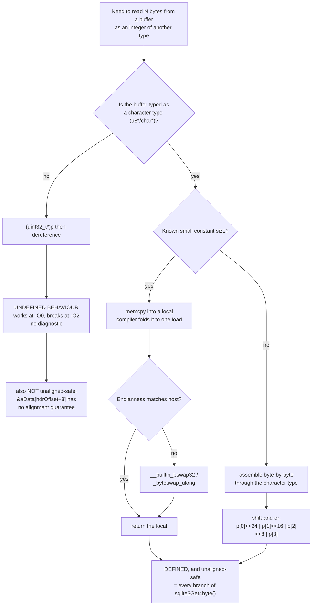

<!--
entry-meta
date: 2026-09-25
type: daily-diff
category: Daily Diff
title: Daily Diff — 2026-09-25
slug: sqlite-btcursor-navigation-seek-restore
-->

# Daily Diff — No New Edition (newest is 2026-09-22)

**2026-09-25 · Daily Diff Digest**

## Status: nothing new has published

Checked this run:

| URL | result |
|---|---|
| [tdd.cat](https://tdd.cat/) | serves **Tuesday, September 22, 2026**, 99 stories |
| [tdd.cat/archive](https://tdd.cat/archive) | newest listed is **Edition 060 · Tue, Sep 22, 2026 · 99 Stories** |
| `https://tdd.cat/2026-09-23/` | **HTTP 404** |
| `https://tdd.cat/2026-09-24/` | **HTTP 404** |

The archive's own note explains why: "Editions are published with a 2-day settling window so the highest-signal discussions and insights surface." Recent cadence from the archive listing — 060 Sep 22, 059 Sep 21, 058 Sep 20, 057 Sep 19, 056 Sep 18 — shows no gap, so this is the settling window rather than a missed publication.

Edition 060 was already covered in full, including its deep dive on KIP-1279 cluster mirroring, in [the 2026-09-24 digest](../2026-09-24-sqlite-index-btrees-sort-order-covering/daily-diff.md). **No items are summarised again here, and none are invented.**

Instead, one item that the 09-24 digest listed but did not analyse gets the deep dive below. It is the most relevant unexamined item in the edition for this track: it is about reading bytes out of a buffer through a type that is not the type they were written as, which is what every line of [today's lesson](README.md) does.

## Deep Dive: Type Punning, Strict Aliasing, and Why `btree.c` Never Casts a Page Pointer

**Item:** *Safe vs Undefined Behavior in C and C++ Type Punning* — [blog.pwkf.org](https://blog.pwkf.org/2026/09/21/correct-type-punning-in-c.html), listed in Edition 060 under languages/correctness.

### The rule

The article states the effective-type rule as:

> "an object shall only be accessed through an lvalue of its effective type, a qualified version of it, or a character type."

The consequence it draws: casting a pointer to an unrelated type and dereferencing it is undefined behaviour in both C and C++, regardless of whether the bytes happen to be laid out as you expect.

| technique | status | note from the article |
|---|---|---|
| `int *p = (int*)&f; i = *p;` | **UB** | the canonical wrong answer |
| `union { float f; uint32_t bits; }` | defined in C | the article's worked example extracts a float's exponent through it |
| `memcpy(&i, &f, sizeof f)` | safe | "compiles to a single instruction" despite looking more expensive |
| access through a character type | safe | the explicit carve-out in the rule above |

The failure mode it reports is the one that makes this a real bug class rather than a pedantry: pointer casts "work fine at `-O0` and silently broke at `-O2`". The compiler is not punishing you — it is inferring that two differently-typed pointers cannot alias, and deleting or reordering code on that basis. Nothing warns, and the tests pass at the optimisation level you debug at.

The article's closing distinction is that C treats types largely as instructions for interpreting memory, while C++ treats them as first-class semantic entities, which gives C++ compilers more latitude. I could not verify from the fetched page which specific standard clauses it cites, nor whether it covers `std::bit_cast` or `std::start_lifetime_as`; the fetched summary did not include them, and I am not going to assert content I did not read.

### Why this is the right item to sit next to Lesson 10

A b-tree page in SQLite is 4096 bytes of file content holding big-endian integers at fixed offsets: a 2-byte cell pointer, a 4-byte child page number, a varint rowid. The tempting implementation of "read the child pointer at header offset 8" is a cast. SQLite never does it.

`src/util.c` 1756–1774, the function every rightward descent in today's lesson calls:

```c
u32 sqlite3Get4byte(const u8 *p){
#if SQLITE_BYTEORDER==4321
  u32 x;
  memcpy(&x,p,4);
  return x;
#elif SQLITE_BYTEORDER==1234 && GCC_VERSION>=4003000
  u32 x;
  memcpy(&x,p,4);
  return __builtin_bswap32(x);
#elif SQLITE_BYTEORDER==1234 && MSVC_VERSION>=1300
  u32 x;
  memcpy(&x,p,4);
  return _byteswap_ulong(x);
#else
  /* Test this limb using -DSQLITE_BYTEORDER=0 */
  testcase( p[0]&0x80 );
  return ((unsigned)p[0]<<24) | (p[1]<<16) | (p[2]<<8) | p[3];
#endif
}
```

Every branch is one of the two techniques the article sanctions, and none is a cast:

- The three fast paths `memcpy` four bytes into a `u32` and byte-swap if needed. This is exactly the article's "compiles to a single instruction" claim being relied on in production — the `memcpy` of a known small constant size is recognised by the compiler and becomes a load, so the defined-behaviour version costs nothing.
- The portable fallback assembles the value byte-by-byte through `u8`, which is the character-type carve-out.
- `sqlite3Put4byte()` (1778–1794) is the exact mirror, and the header comment on both says "unaligned" — another thing a cast would get wrong independently of aliasing, since `&aData[hdrOffset+8]` has no alignment guarantee at all.

So SQLite's byte-level reader is written the way it is for two independent reasons that happen to have the same fix: strict aliasing, and unaligned access. Note also that `aData` is `u8*` throughout — the page buffer is *typed* as a character array from the pager down, so ordinary indexing into it is already inside the rule.

There is one place today's lesson touches where SQLite deliberately reads past what it strictly owns, and it is worth separating from aliasing because they are different rules. Lesson 10 §6.2 and §8 both allocate slack — 18 bytes in `sqlite3BtreeIndexMoveto()`, 17 in `saveCursorKey()` — because the comparator "may read up to two varints past the end of the buffer" on corrupt input. That is a *bounds* problem solved by over-allocating, all of it through `u8`, not an aliasing problem. Lesson 09 §4's "at least 74 (but not 136) bytes of padding" is the same category.



### What it changes

Not much, if you are writing application SQL — this is a rule for people writing the layer below. The practical takeaways:

- **A serialization routine that casts is a latent `-O2` bug**, not a style issue. If you maintain one, the fix is mechanical: `memcpy` into a local of the target type, or index through `unsigned char`. Both are free after optimisation.
- **`-fno-strict-aliasing` is the escape hatch and a real cost.** The article does not discuss it, but it is the standard mitigation for code that cannot be rewritten, and it disables a class of optimisation globally to paper over a handful of lines.
- **`memcpy` looking slow is the misconception that causes the bug.** The whole reason people reach for the cast is the assumption that a copy costs a copy. SQLite's hot path — called on every interior-page descent in Lesson 10 §7's measurements — is built on the opposite assumption, and its performance is not in question.

The honest caveat: this is a secondary-source explainer, and my reading of it came through a page summary rather than the full text. The rule it states and the two safe techniques it names are standard and independently checkable; the specific claims about C-versus-C++ latitude, and any standard-clause citations, I have not verified.

## Sources

- [The Daily Diff](https://tdd.cat/) — serving the Tuesday, September 22, 2026 edition (99 stories) as of this run.
- [The Daily Diff — archive](https://tdd.cat/archive) — the edition list (060 Sep 22 · 059 Sep 21 · 058 Sep 20 · 057 Sep 19 · 056 Sep 18) confirming 060 is newest, and the quoted note: "Editions are published with a 2-day settling window so the highest-signal discussions and insights surface." `https://tdd.cat/2026-09-23/` and `https://tdd.cat/2026-09-24/` both returned HTTP 404 this run and are therefore not linked.
- [Safe vs Undefined Behavior in C and C++ Type Punning](https://blog.pwkf.org/2026/09/21/correct-type-punning-in-c.html) — the deep-dive item: the effective-type rule as quoted, the union and `memcpy` examples, the pointer-cast UB case, the "compiles to a single instruction" note, and the "-O0 works / -O2 silently broke" failure mode.
- [sqlite/sqlite](https://github.com/sqlite/sqlite) — read this run at commit `4b495f91a98381444a4688dcfdc6582e09ee9e56` through a code index: `src/util.c` `sqlite3Get4byte()` (1753–1774) and `sqlite3Put4byte()` (1776–1794), both quoted above.
- [The Daily Diff — stats](https://tdd.cat/stats/) and [arpitbbhayani/the-daily-diff](https://github.com/arpitbbhayani/the-daily-diff) — the publication's own stats page and source repository, surfaced while confirming the edition URL scheme (`https://tdd.cat/YYYY-MM-DD/`, e.g. [2026-08-13](https://tdd.cat/2026-08-13/)).
