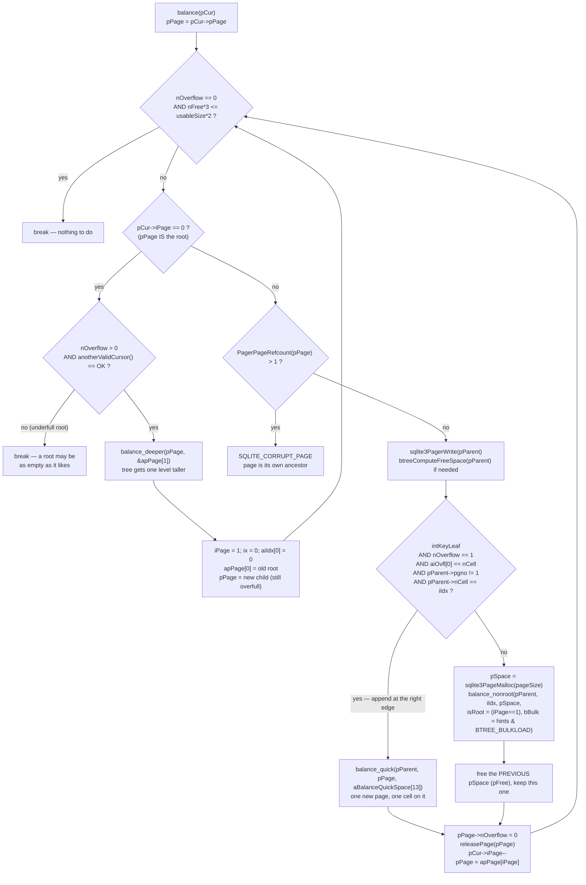
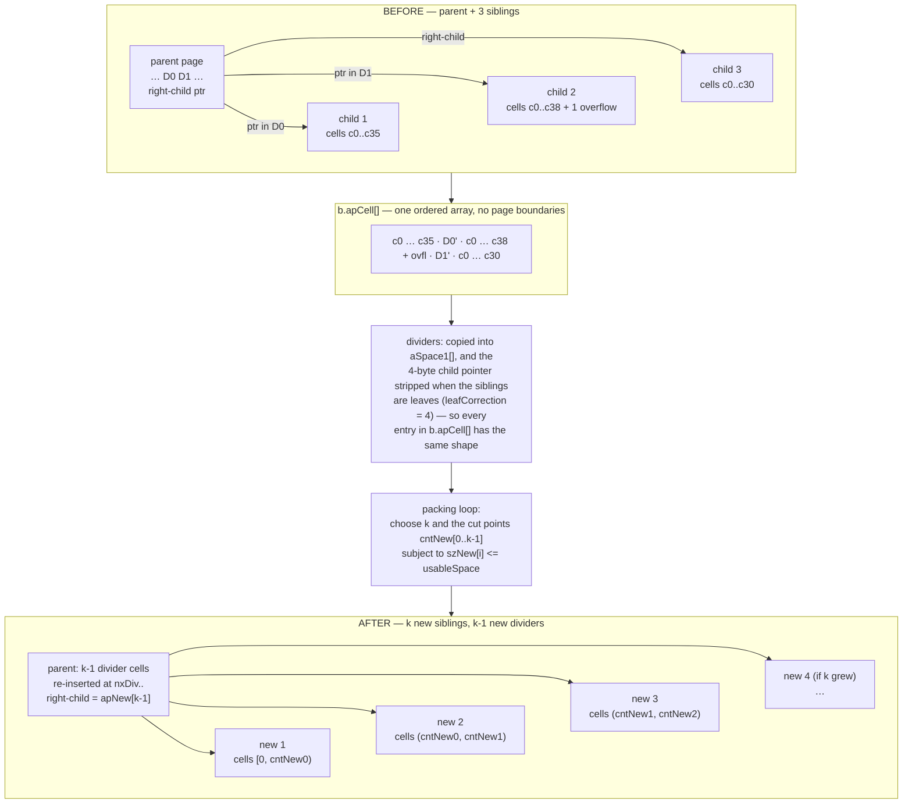

<!--
entry-meta
date: 2026-09-26
type: lesson
track: SQLite
lesson: 11
category: Database Internals
title: Insertion and Page Splits — balance(), balance_quick(), balance_deeper() and balance_nonroot()
slug: sqlite-balance-page-splits
-->

# Insertion and Page Splits — `balance()`, `balance_quick()`, `balance_deeper()` and `balance_nonroot()`

**2026-09-26 · SQLite Track · Lesson 11 of 32**

## Where This Fits

- **Previous lesson:** [Lesson 10](../2026-09-25-sqlite-btcursor-navigation-seek-restore/README.md) established the `BtCursor` page stack (`pPage`/`ix` plus `apPage[]`/`aiIdx[]`, `iPage == -1` for empty), the five cursor states, and the save/restore contract: `saveAllCursors()` runs before a write that can move cells, `CURSOR_SKIPNEXT` keeps the stack, `CURSOR_REQUIRESEEK` throws it away. That contract exists for exactly one reason, and this lesson is it.
- **This lesson:** what happens after `insertCellFast()` cannot fit a cell on a page. The overflow cell, the two-condition test in `balance()`, the do-while loop that walks the cursor stack upward, and the three sub-algorithms it dispatches to — including the ~700-line `balance_nonroot()`, which is where the actual redistribution happens.
- **What it explains retroactively:** Lesson 04's freeblock and defragmentation machinery, and Lesson 06's `allocateBtreePage()`/`freePage2()`, are almost entirely *consumed by this code path*. `defragmentPage()` has one caller that matters here (§8.5); `allocateBtreePage()` is called from all three balance routines. Lesson 10 §8.1's `BTCF_Multiple` filter guards the `saveAllCursors()` call at `btree.c` 9470–9472 that precedes this whole machine.
- **Next:** Lesson 12 takes deletion, underflow and the sibling rebalance on the delete side. §11 here establishes the one rule that lesson depends on — the 2/3 free-space test — and measures what it costs.

Source references are to `sqlite/sqlite` at commit **`4b495f9`** (`src/btree.c`, `src/btree.h`, `src/build.c`, `src/insert.c`, `src/sqliteInt.h`, `src/vdbe.c`), read through a code index this run and cited by path and line range. Measurements are against SQLite **3.53.4** via `apsw` 3.53.4.0, `page_size = 4096`, `journal_mode = delete`, `auto_vacuum = none`, 50,000 rows of a 100-byte blob unless stated otherwise — the same tooling as Lessons 08–10.

---

## 1. The Trigger: An Overflow Cell Is Not a Page Split

Nothing in SQLite decides "this page is full, split it". The b-tree layer does something stranger, and it is the key to reading this code: **it inserts the cell anyway, into a side array, and leaves the page in an illegal state.**

Lesson 03 introduced `MemPage.apOvfl[]` and `aiOvfl[]` as part of the page representation. Here is what they are actually for. From `insertCell()`'s path, when the cell does not fit:

- the cell is *not* written into `aData[]`
- a pointer to it is stored in `pPage->apOvfl[k]`, with its logical index in `pPage->aiOvfl[k]`
- `pPage->nOverflow` is incremented

The page now claims to hold `nCell + nOverflow` cells while only `nCell` of them exist on disk. That state is legal in memory and illegal on disk, and every code path that can create it is obliged to clear it before the statement finishes. The [official b-tree module document](https://sqlite.org/btreemodule.html) states the obligation directly:

> "If an insert, replace or delete entry operation creates one or more overflow cells, the b-tree structure is rearranged so that all cells are stored within the body of a b-tree node page before the operation is considered complete."

`sqlite3BtreeInsert()` discharges it at 9712–9737:

```c
  if( pPage->nOverflow ){
    assert( rc==SQLITE_OK );
    pCur->curFlags &= ~(BTCF_ValidNKey|BTCF_ValidOvfl);
    rc = balance(pCur);

    /* Must make sure nOverflow is reset to zero even if the balance()
    ** fails. Internal data structure corruption will result otherwise.
    ** Also, set the cursor state to invalid. ... */
    pCur->pPage->nOverflow = 0;
    pCur->eState = CURSOR_INVALID;
```

Three things to take from this:

| observation | consequence |
|---|---|
| `balance()` is called **only** when `nOverflow` is set | an insert that fits is a `memcpy` and a cell-pointer shuffle; it never enters this file's most complex function |
| `nOverflow` is forcibly zeroed **even on failure** | the in-memory page is brought back to a legal shape at all costs; the *database* is left to the rollback journal |
| the cursor is invalidated | this is the other half of Lesson 10 §8 — after a balance the stack is meaningless, so `BTREE_SAVEPOSITION` re-copies the key and sets `CURSOR_REQUIRESEEK` (9723–9736) |

The `assert( pCur->iPage<0 || pCur->pPage->nOverflow==0 )` at 9738 is the invariant, checked on the way out.

### 1.1 The insert that never balances

Worth naming because it is the common case for `UPDATE`. At 9660–9679, when the new cell is the same size as the one it replaces:

```c
      /* Overwrite the old cell with the new if they are the same size.
      ** We could also try to do this if the old cell is smaller, then add
      ** the leftover space to the free list.  But experiments show that
      ** doing that is no faster then skipping this optimization and just
      ** calling dropCell() and insertCell(). */
```

Same size → `memcpy(oldCell, newCell, szNew)` and return. No free-space arithmetic, no `balance()`, nothing below this section runs. The comment is a small gift: someone tried the obvious generalization (reuse a *larger* hole and free the remainder) and measured it as not worth the code.

---

## 2. `balance()` — Two Conditions and a Walk Up the Stack

`btree.c` 9162–9291. The whole function is a `do { ... } while( rc==SQLITE_OK )` loop over the cursor's page stack, from the leaf toward the root. Each iteration either breaks or fixes one level and moves up.

The loop head is the test that decides whether there is anything to do at all (9174–9180):

```c
    if( NEVER(pPage->nFree<0) && btreeComputeFreeSpace(pPage) ) break;
    if( pPage->nOverflow==0 && pPage->nFree*3<=(int)pCur->pBt->usableSize*2 ){
      /* No rebalance required as long as:
      **   (1) There are no overflow cells
      **   (2) The amount of free space on the page is less than 2/3rds of
      **       the total usable space on the page. */
      break;
    }
```

Two independent reasons to be here, and they are the two directions a page can go wrong:

- **overfull** — `nOverflow > 0`. Comes from insert.
- **underfull** — free space exceeds 2/3 of the page. Comes from delete. `nFree*3 <= usableSize*2` is the integer-arithmetic spelling of "free ≤ ⅔ usable"; its negation is the underfull condition. §11 measures exactly what this threshold does to a delete-heavy workload.

Note the asymmetry that follows from this single test: a page that is 1% full is underfull and gets fixed; a page that is 34% full is not, and stays that way forever. SQLite has no minimum fill factor in the textbook sense (no "at least half full" invariant). It has one threshold, and it is 2/3 *free*, not 1/2 *full*.

### 2.1 The three-way dispatch

Once past the test, the structure is:



Three details in that picture are worth stating explicitly:

- **`balance_deeper` does not terminate the loop.** It installs a new child, rewrites the cursor stack so `pPage` is that child, and falls back into the same test — which is guaranteed to fail again, because the child inherited the overflow cells (`assert( pCur->pPage->nOverflow )` at 9197). Growing the tree and fixing the overfull page are two separate iterations.
- **An underfull root breaks out.** The `else{ break; }` at 9199–9201 means the root-page branch only ever fires for overflow. A root with two cells in it is a legal root.
- **`pSpace` is freed one iteration late.** `balance_nonroot()` may push overflow cells into the *parent*, whose contents may still point into the `pSpace` buffer from the previous call. So `balance()` keeps `pFree` alive across one iteration and releases it on the next (9259–9273), with a final `sqlite3PageFree(pFree)` at 9287–9289. This is a lifetime rule enforced by comment, not by the type system.

### 2.2 `anotherValidCursor()` — a corruption check hiding in a hot path

9139–9150. Before deepening the root, `balance()` scans the entire cursor list for another `CURSOR_VALID` cursor sitting on the same `MemPage`:

```c
static int anotherValidCursor(BtCursor *pCur){
  BtCursor *pOther;
  for(pOther=pCur->pBt->pCursor; pOther; pOther=pOther->pNext){
    if( pOther!=pCur
     && pOther->eState==CURSOR_VALID
     && pOther->pPage==pCur->pPage
    ){
      return SQLITE_CORRUPT_PAGE(pCur->pPage);
    }
  }
  return SQLITE_OK;
}
```

The header comment explains the scenario it defends against: a corrupt schema where two SQL tables name the *same* root page, an insert on one firing a BEFORE trigger that inserts into the other, and the resulting rebalance changing content under the first cursor. It is not a general safety net — it runs only on the root-deepening path, and only because that path is where the damage would be unrecoverable.

---

## 3. `balance_deeper()` — The Only Way the Tree Gets Taller

`btree.c` 9081–9126. This is the shortest of the three and the easiest to hold in your head. The [b-tree module document](https://sqlite.org/btreemodule.html) describes it as: the algorithm "creates a new page and copies the entire contents of the overfull root page to it. The root page is then zeroed and the new page installed as its only child."

```c
  rc = sqlite3PagerWrite(pRoot->pDbPage);
  if( rc==SQLITE_OK ){
    rc = allocateBtreePage(pBt,&pChild,&pgnoChild,pRoot->pgno,0);
    copyNodeContent(pRoot, pChild, &rc);
    if( ISAUTOVACUUM(pBt) ){
      ptrmapPut(pBt, pgnoChild, PTRMAP_BTREE, pRoot->pgno, &rc);
    }
```

then, at 9113–9122:

```c
  /* Copy the overflow cells from pRoot to pChild */
  memcpy(pChild->aiOvfl, pRoot->aiOvfl, pRoot->nOverflow*sizeof(pRoot->aiOvfl[0]));
  memcpy(pChild->apOvfl, pRoot->apOvfl, pRoot->nOverflow*sizeof(pRoot->apOvfl[0]));
  pChild->nOverflow = pRoot->nOverflow;

  /* Zero the contents of pRoot. Then install pChild as the right-child. */
  zeroPage(pRoot, pChild->aData[0] & ~PTF_LEAF);
  put4byte(&pRoot->aData[pRoot->hdrOffset+8], pgnoChild);
```

Why the root is special, in one line: **a b-tree's root page number is stored in `sqlite_schema` and in every open cursor** (Lesson 07). It cannot move. So when the root must split, SQLite moves *everything else* instead — the root's content goes to a fresh page and the root becomes an interior page with zero cells and one right-child pointer.

Three specifics:

- `copyNodeContent()` (8195–8235) copies only the cell-content region and the header+pointer array, then re-runs `btreeInitPage()` on the destination and, under auto-vacuum, `setChildPtrmaps()`. Its own comment (8191–8193) says "The performance of this function is not critical. It is only used by the balance_shallower() and balance_deeper() procedures, neither of which are called often under normal circumstances."
- `iToHdr = ((pTo->pgno==1) ? 100 : 0)` at 8201 — the 100-byte database header from Lesson 01 is still the special case that every page-copy routine has to know about.
- `zeroPage(pRoot, pChild->aData[0] & ~PTF_LEAF)` derives the new root's type from the child's flag byte with `PTF_LEAF` cleared. A leaf root becomes an interior page of the same key-type; the flag byte arithmetic from Lesson 03 is doing real work here.

### 3.1 Measured: the exact insert that deepens the tree

With 100-byte payloads into `CREATE TABLE t(k INTEGER PRIMARY KEY, v BLOB)`, inserting `k = 1, 2, 3, …` and reading `dbstat` after every single insert:

| event | at row | page_count after |
|---|---|---|
| root splits — `balance_deeper` fires, tree becomes root + leaves | **38** | 4 |
| second interior level appears | **18,649** | 509 |

And the state immediately after row 38 (`dbstat` over `main`):

| pageno | pagetype | ncell | payload | unused | path |
|---|---|---|---|---|---|
| 2 | internal | 1 | 0 | 4077 | `/` |
| 3 | leaf | 37 | 3848 | 92 | `/000/` |
| 4 | leaf | 1 | 104 | 3980 | `/001/` |

Read that row-4 line carefully: **one cell, 3,980 bytes unused.** A textbook split of 38 cells would have produced two pages of 19. This is `balance_quick` (§4), which ran on the *second* iteration of the `balance()` do-loop, immediately after `balance_deeper` created page 3. One insert produced two sub-algorithm calls and two new pages.

The root page's bytes make the structure unambiguous. Page 2, first 12 bytes plus its single cell:

```
page 2 header: 05 00 00 00 01 0f fb 00 00 00 00 04
               ^^ type 0x05 = interior table
                        ^^^^^ ncell = 1
                              ^^^^^ cell content area starts at 4091
                                    ^^^^^^^^^^^ right-most child = page 4
cell @ 4091:   00 00 00 03 25
               ^^^^^^^^^^^ left child = page 3
                           ^^ varint 0x25 = 37  (largest key on page 3)
```

Five bytes. That is what an interior table cell is (Lesson 03): a 4-byte child pointer and a varint key, nothing else. The divider key 37 is the largest rowid on the left child, and rowid 38 lives alone on page 4.

---

## 4. `balance_quick()` — The Append Optimization, and What It Is Worth

`btree.c` 8039–8133, compiled in unless `SQLITE_OMIT_QUICKBALANCE`. Its header comment states the bet plainly (8016–8027):

> "This version of balance() handles the common special case where a new entry is being inserted on the extreme right-end of the tree... Instead of trying to balance the 3 right-most leaf pages, just add a new page to the right-hand side and put the one new entry in that page. This leaves the right side of the tree somewhat unbalanced. But odds are that we will be inserting new entries at the end soon afterwards so the nearly empty page will quickly fill up. On average."

### 4.1 The five conditions

From `balance()` 9217–9222 — all five must hold:

| condition | meaning | why |
|---|---|---|
| `pPage->intKeyLeaf` | leaf of a table b-tree (rowid) | the divider it builds is a 4-byte pgno + rowid varint; only a table b-tree has that cell shape |
| `pPage->nOverflow == 1` | exactly one cell did not fit | it only has `aBalanceQuickSpace[13]` and handles one |
| `pPage->aiOvfl[0] == pPage->nCell` | the overflow cell sorts **after** every cell on the page | it is an append, not an insert |
| `pParent->pgno != 1` | parent is not page 1 | page 1 carries the 100-byte file header, so its geometry differs |
| `pParent->nCell == iIdx` | this page is the parent's right-most child | the new page becomes the new right-most child; the parent's right-pointer is simply overwritten |

Together they say: *the new row is the largest in the whole tree.* Which is what an `INTEGER PRIMARY KEY` with no explicit value does on every insert, and what `AUTOINCREMENT` guarantees.

### 4.2 What it does

```c
    rc = allocateBtreePage(pBt, &pNew, &pgnoNew, 0, 0);
    ...
    zeroPage(pNew, PTF_INTKEY|PTF_LEAFDATA|PTF_LEAF);
    b.nCell = 1;  b.pRef = pPage;  b.apCell = &pCell;  b.szCell = &szCell;
    b.apEnd[0] = pPage->aDataEnd;  b.ixNx[0] = 2;  b.ixNx[NB*2-1] = 0x7fffffff;
    rc = rebuildPage(&b, 0, 1, pNew);
```

A one-element `CellArray` (§6) and a `rebuildPage()` call. Then the divider, built by two hand-rolled varint loops at 8113–8117:

```c
    pCell = findCell(pPage, pPage->nCell-1);
    pStop = &pCell[9];
    while( (*(pCell++)&0x80) && pCell<pStop );     /* skip the payload-length varint */
    pStop = &pCell[9];
    while( ((*(pOut++) = *(pCell++))&0x80) && pCell<pStop ); /* copy the rowid varint */
```

This is the same varint-skip shape as Lesson 10 §5.2's seek loop and Lesson 02's decoder, here used to lift the largest key off the *old* page without parsing a cell. The `&pCell[9]` stops are the 9-byte varint ceiling from Lesson 02, used as a bound rather than a length. Result: 4 bytes of page number plus at most 9 of varint — hence `aBalanceQuickSpace[13]` in `balance()`.

Then `insertCell(pParent, pParent->nCell, …)` appends the divider, and `put4byte(&pParent->aData[pParent->hdrOffset+8], pgnoNew)` makes the new page the right-most child. If that `insertCell` overflows the parent, `balance()`'s next iteration handles it with the general algorithm — which is why `aBalanceQuickSpace[]` lives in `balance()`'s frame and is asserted to be used at most once per call (9231–9237).

### 4.3 Measured: what `balance_quick` is actually worth

The honest way to price it is to run identical ascending inserts down a path where it *cannot* fire. `WITHOUT ROWID` gives exactly that: an index b-tree, so `intKeyLeaf` is false and condition 1 fails, while everything else about the workload is unchanged. 50,000 rows, same 100-byte payload, same key sequence:

| table | order | leaf pages | mean leaf fill | page_count |
|---|---|---|---|---|
| rowid | ascending | 1,352 | **99.21%** | 1,357 |
| `WITHOUT ROWID` | ascending | 1,471 | **88.26%** | 1,520 |
| rowid | descending | 2,629 | **51.12%** | 2,640 |
| `WITHOUT ROWID` | descending | 2,629 | **48.30%** | 2,775 |
| rowid | random (seed 7) | 1,510 | 88.85% | 1,516 |
| `WITHOUT ROWID` | random (seed 7) | 1,473 | 88.14% | 1,522 |

Four results worth separating:

1. **`balance_quick` is worth ~11 points of fill on an ascending load** — 99.21% against 88.26% on the same data. The general algorithm, even when fed perfectly ordered inserts, leaves a tenth of every page empty; `balance_quick` leaves 0.8%.
2. **Descending insertion is the disaster case: 51.12% fill, 2,640 pages against 1,357** — the same 50,000 rows in 1.95× the file. Every insert lands at the *left* edge, `balance_quick` never fires, and the general algorithm splits pages whose left halves are then never touched again. "Newest first with a descending key" is a real schema pattern and this is its price.
3. **Random insertion is much better than the textbook says.** The classic steady-state fill for a random-insert B-tree is ln 2 ≈ 69%. SQLite measures 88.85%. The reason is §5: it redistributes over *three* siblings, not two, so a split is a 2→3 or 3→4 event that leaves each participant around 2/3 to 3/4 full, and the neighbours keep absorbing subsequent inserts.
4. **`WITHOUT ROWID` ascending and random land within 0.12 points of each other** (88.26% vs 88.14%). Without `balance_quick`, insert order stops mattering for space. That is a clean demonstration that the entire ascending-insert advantage in SQLite comes from this one optimization — not from locality, not from the packing loop.

---

## 5. `balance_nonroot()`, Part 1: Choosing the Siblings

`btree.c` 8277–9059. Roughly 780 lines, one function, five distinct phases. Its own header comment (8237–8276) is the best short description that exists, and the first paragraph is the algorithm's whole premise:

> "This routine redistributes cells on the iParentIdx'th child of pParent (hereafter "the page") and up to 2 siblings so that all pages have about the same amount of free space... The number of siblings of the page might be increased or decreased by one or two in an effort to keep pages nearly full but not over full."

### 5.1 `NN` and `NB`

`btree.c` 7534–7552:

```c
/*
** The following parameters determine how many adjacent pages get involved
** in a balancing operation.  NN is the number of neighbors on either side
** of the page that participate in the balancing operation.  NB is the
** total number of pages that participate, including the target page and
** NN neighbors on either side.
**
** The minimum value of NN is 1 (of course).  Increasing NN above 1
** (to 2 or 3) gives a modest improvement in SELECT and DELETE performance
** in exchange for a larger degradation in INSERT and UPDATE performance.
** The value of NN appears to give the best results overall.
**
** (Later:) The description above makes it seem as if these values are
** tunable - as if you could change them and recompile and it would all work.
** But that is unlikely.  NB has been 3 since the inception of SQLite and
** we have never tested any other value.
*/
#define NN 1             /* Number of neighbors on either side of pPage */
#define NB 3             /* (NN*2+1): Total pages involved in the balance */
```

The "(Later:)" note is the interesting half. `NB == 3` reads like a tuning knob and is documented as one, then explicitly retracted: the code below has `apOld[NB]`, `apNew[NB+2]`, `apDiv[NB-1]`, `b.apEnd[NB*2]`, `b.ixNx[NB*2]`, and a `memcmp(abDone, "\01\01\01\01\01", nNew)` assertion at 8984 with the literal five bytes written out. **Three in, up to five out** is baked into the array shapes.

### 5.2 Picking the window

8343–8357:

```c
  i = pParent->nOverflow + pParent->nCell;
  if( i<2 ){
    nxDiv = 0;
  }else{
    assert( bBulk==0 || bBulk==1 );
    if( iParentIdx==0 ){                
      nxDiv = 0;
    }else if( iParentIdx==i ){
      nxDiv = i-2+bBulk;
    }else{
      nxDiv = iParentIdx-1;
    }
    i = 2-bBulk;
  }
  nOld = i+1;
```

`nxDiv` is the index of the first divider cell in the parent that will be consumed; `nOld` is how many children participate. In the ordinary case (`bBulk == 0`, page somewhere in the middle) that is `nxDiv = iParentIdx-1` and `nOld = 3` — the page and one neighbour each side. At the left edge, `nxDiv = 0` and the window is the page plus its two right-hand neighbours. At the right edge, `nxDiv = i-2` and it is the page plus its two left-hand neighbours. This matches the [b-tree module document](https://sqlite.org/btreemodule.html): "If the parent page has three or fewer child pages, then all child pages are deemed to be sibling pages."

`bBulk` shifts both: `i = 2-bBulk` makes `nOld = 2` instead of 3, and at the right edge `nxDiv = i-2+bBulk` moves the window one to the right. Under bulk load the algorithm deliberately looks at *fewer* siblings. §10 measures why.

### 5.3 Dropping the dividers on the way in

The loop at 8364–8417 does three things per sibling, walking right-to-left: fetch and initialize the child page, accumulate `nMaxCells`, and **remove the divider cell from the parent**:

```c
      apDiv[i] = findCell(pParent, i+nxDiv-pParent->nOverflow);
      pgno = get4byte(apDiv[i]);
      szNew[i] = pParent->xCellSize(pParent, apDiv[i]);
      /* Drop the cell from the parent page. apDiv[i] still points to
      ** the cell within the parent, even though it has been dropped.
      ** This is safe because dropping a cell only overwrites the first
      ** four bytes of it ... */
      dropCell(pParent, i+nxDiv-pParent->nOverflow, szNew[i], &rc);
```

This is the reason `balance_nonroot()` never has to think about overflow cells in the parent: they have already been consumed by the time the real work starts (8338–8341). The comment records a genuinely hairy dependency — `apDiv[i]` remains a live pointer into a *freed* region of the parent page, valid because `dropCell()`'s freeblock bookkeeping (Lesson 04) only clobbers the first four bytes, which the code does not need.

Except under secure delete, where `dropCell()` zeroes the whole cell. Hence 8404–8414:

```c
      if( pBt->btsFlags & BTS_FAST_SECURE ){
        int iOff;
        iOff = SQLITE_PTR_TO_INT(apDiv[i]) - SQLITE_PTR_TO_INT(pParent->aData);
        if( (iOff+szNew[i])<=(int)pBt->usableSize ){
          memcpy(&aOvflSpace[iOff], apDiv[i], szNew[i]);
          apDiv[i] = &aOvflSpace[apDiv[i]-pParent->aData];
        }
      }
```

The divider is copied into `aOvflSpace[]` **at the same offset it occupied in the page**, so the pointer arithmetic downstream is unchanged. A shadow page, used for one pointer.

### 5.4 The scratch allocation

8419–8439:

```c
  nMaxCells = (nMaxCells + 3)&~3;   /* multiple of 4 for 8-byte alignment */
  szScratch =
       nMaxCells*sizeof(u8*)                       /* b.apCell */
     + nMaxCells*sizeof(u16)                       /* b.szCell */
     + pBt->pageSize;                              /* aSpace1 */
  assert( szScratch<=7*(int)pBt->pageSize );
  b.apCell = sqlite3StackAllocRaw(0, szScratch );
```

One allocation, carved into three arrays. `nMaxCells` is `Σ(child nCell) + 3×ArraySize(apOvfl)` — an upper bound, not a count. The `≤ 7 × pageSize` assertion is the reason this can be a stack-ish allocation at all: for a 4 KiB page the worst case is ~28 KiB, and `sqlite3StackAllocRaw` serves it from the scratch allocator or the heap.

---

## 6. `balance_nonroot()`, Part 2: Flattening Everything Into One Array

This is the conceptual heart. Up to three child pages and the two divider cells between them are dissolved into **one flat, ordered array of cells** with no page boundaries at all. `CellArray` (7617–7625):

```c
struct CellArray {
  int nCell;              /* Number of cells in apCell[] */
  MemPage *pRef;          /* Reference page */
  u8 **apCell;            /* All cells begin balanced */
  u16 *szCell;            /* Local size of all cells in apCell[] */
  u8 *apEnd[NB*2];        /* MemPage.aDataEnd values */
  int ixNx[NB*2];         /* Index of at which we move to the next apEnd[] */
};
```

The [b-tree module document](https://sqlite.org/btreemodule.html) describes the ordering: "The list is arranged so that it contains: The cells from the left-most sibling page, in order, followed by the divider cell from the parent page that contains the pointer to the left-most sibling."



### 6.1 `leafCorrection` and `leafData` — making the cells alike

8457–8459:

```c
  b.pRef = apOld[0];
  leafCorrection = b.pRef->leaf*4;
  leafData = b.pRef->intKeyLeaf;
```

Two flags that shape everything after:

| variable | value | what it means |
|---|---|---|
| `leafCorrection` | 4 if siblings are leaves, else 0 | how many bytes of child pointer to strip off a divider cell so it matches the leaf cells around it |
| `leafData` | 1 if siblings are table-b-tree leaves | *dividers carry no payload* — a table interior cell is just pgno+rowid, so the divider is **regenerated** from the largest key rather than moved |

The gather loop at 8522–8553 does the stripping:

```c
      b.apCell[b.nCell] = pTemp+leafCorrection;
      b.szCell[b.nCell] = b.szCell[b.nCell] - leafCorrection;
      if( !pOld->leaf ){
        /* The right pointer of the child page pOld becomes the left
        ** pointer of the divider cell */
        memcpy(b.apCell[b.nCell], &pOld->aData[8], 4);
      }else{
        while( b.szCell[b.nCell]<4 ){
          /* Do not allow any cells smaller than 4 bytes. If a smaller cell
          ** does exist, pad it with 0x00 bytes. */
          aSpace1[iSpace1++] = 0x00;
          b.szCell[b.nCell]++;
        }
      }
```

Two things fall out of this:

- **For interior siblings, the demoted divider inherits the old child's right-pointer.** A divider cell moving *down* a level needs a left child, and the only correct value is the right-most pointer of the page it used to sit above. Four bytes, copied from `aData[8]`.
- **The 4-byte minimum-cell rule is enforced by padding with zeroes.** Lesson 03's minimum cell size shows up as a `while` loop appending `0x00`. The `assert( b.szCell[b.nCell]==3 || CORRUPT_DB )` next to it says this only ever adds one byte in practice.

For `leafData` trees the dividers are skipped in the gather entirely (`if( i<nOld-1 && !leafData )` at 8522) and manufactured later, at 8877–8888:

```c
    }else if( leafData ){
      /* If the tree is a leaf-data tree, and the siblings are leaves,
      ** then there is no divider cell in b.apCell[]. Instead, the divider
      ** cell consists of the integer key for the right-most cell of
      ** the sibling-page assembled above only. */
      CellInfo info;
      j--;
      pNew->xParseCell(pNew, b.apCell[j], &info);
      pCell = pTemp;
      sz = 4 + sqlite3PutVarint(&pCell[4], info.nKey);
      pTemp = 0;
    }
```

So a rowid table's divider cells never move between levels — they are rebuilt from the key of whatever cell ends up last on the left page. This is the structural reason rowid tables tolerate rebalancing so much better than index b-trees, where the whole divider record has to be carried around.

### 6.2 `apEnd[]`/`ixNx[]` — a bounds checker for a flat array over five buffers

The array's entries point into up to five different buffers: three child pages, the parent, and `aSpace1[]`. Nothing about a `u8*` says which. `ixNx[]` (documented at 7596–7615) records the index at which the relevant end-pointer changes:

> `ixNx[0]` = Number of cells in Child-1.
> `ixNx[1]` = Number of cells in Child-1 plus 1 for first divider.
> `ixNx[2]` = Number of cells in Child-1 and Child-2 + 1 for 1st divider.
> …

and the consumer is the overrun check before each divider is re-inserted, at 8910–8916:

```c
    assert( b.ixNx[NB*2-1]>j );
    for(k=0; b.ixNx[k]<=j; k++){}
    pSrcEnd = b.apEnd[k];
    if( SQLITE_OVERFLOW(pSrcEnd, pCell, pCell+sz) ){
      rc = SQLITE_CORRUPT_BKPT;
      goto balance_cleanup;
    }
```

`b.ixNx[NB*2-1] = 0x7fffffff` is set at 8314, before anything else, purely so that linear scan is guaranteed to terminate. This is the same defensive posture as Lesson 09's comparator: a corrupt page can make a cell's computed size run past the end of its own buffer, so the code checks rather than trusting the size it just read.

### 6.3 Cell sizes are computed lazily

7631–7661. `szCell[]` is memset to zero for the whole range (8494) and filled on demand:

```c
static u16 cachedCellSize(CellArray *p, int N){
  assert( N>=0 && N<p->nCell );
  if( p->szCell[N] ) return p->szCell[N];
  return computeCellSize(p, N);
}
```

with `computeCellSize()` marked `SQLITE_NOINLINE` so the cached path inlines to a load and a branch. This matters because the packing loop (§7) probes sizes near the cut points repeatedly and never needs the sizes of cells in the middle of a page. `populateCellCache()` (7631–7646) is the bulk version, called only from `editPage()`'s failure path before falling back to a full rebuild.

---

## 7. `balance_nonroot()`, Part 3: Deciding How Many Pages, and Where the Cuts Go

Two loops, 8573–8678. The first decides `k` (the number of new siblings) and a first cut; the second fixes the fact that the first one is biased.

### 7.1 Initial sizing

```c
  usableSpace = pBt->usableSize - 12 + leafCorrection;
```

Note what this is: usable page bytes minus the **12-byte interior page header**, plus 4 back if the siblings are leaves (an 8-byte header). One expression covering both header sizes from Lesson 03, via the same `leafCorrection` that stripped the child pointers.

`szNew[i]` starts as the space each old page currently uses (`usableSpace - p->nFree`) plus `2 + cellsize` for each of its overflow cells (8586–8589). Then, per page (8593–8634):

```c
    while( szNew[i]>usableSpace ){
      if( i+1>=k ){
        k = i+2;
        if( k>NB+2 ){ rc = SQLITE_CORRUPT_BKPT; goto balance_cleanup; }
        szNew[k-1] = 0;
        cntNew[k-1] = b.nCell;
      }
      sz = 2 + cachedCellSize(&b, cntNew[i]-1);
      szNew[i] -= sz;
      ...
      szNew[i+1] += sz;
      cntNew[i]--;
    }
    while( cntNew[i]<b.nCell ){
      sz = 2 + cachedCellSize(&b, cntNew[i]);
      if( szNew[i]+sz>usableSpace ) break;
      szNew[i] += sz;
      cntNew[i]++;
      ...
    }
```

Overflow pushes cells right one at a time, creating a new page when it runs out (that is the **split**, and it is three lines); underflow pulls cells left until the next one would not fit. The `+2` on every size is the cell-pointer-array entry, which is the detail that makes this arithmetic exact rather than approximate. `k > NB+2` — more than five output pages — is treated as corruption, not as a case to handle.

### 7.2 The rightward readjustment, which is not an optimization

8636–8678, and the comment is unusually direct:

```c
  /*
  ** The packing computed by the previous block is biased toward the siblings
  ** on the left side (siblings with smaller keys). The left siblings are
  ** always nearly full, while the right-most sibling might be nearly empty.
  ** The next block of code attempts to adjust the packing of siblings to
  ** get a better balance.
  **
  ** This adjustment is more than an optimization.  The packing above might
  ** be so out of balance as to be illegal.  For example, the right-most
  ** sibling might be completely empty.  This adjustment is not optional.
  */
  for(i=k-1; i>0; i--){
    ...
    do{
      szR = cachedCellSize(&b, r);
      szD = b.szCell[d];
      if( szRight!=0
       && (bBulk || szRight+szD+2 > szLeft-(szR+(i==k-1?0:2)))){
        break;
      }
      szRight += szD + 2;
      szLeft -= szR + 2;
      cntNew[i-1] = r;
      r--;  d--;
    }while( r>=0 );
```

Walking right to left, it moves cells from each left sibling into its right neighbour while the right stays smaller than the left. The loop condition is where `bBulk` does its second piece of work: **under bulk load, `bBulk ||` short-circuits the test and the loop breaks on the first iteration** — unless `szRight == 0`, the illegal case, which still gets fixed. So bulk mode keeps the left-biased "fill pages to the brim, start a new one" packing, and normal mode evens them out.

The `(i==k-1?0:2)` term is a small correctness detail: for every page except the right-most, one of the cells being counted becomes a divider in the parent rather than staying on the page, so its 2-byte pointer entry does not count.

---

## 8. `balance_nonroot()`, Part 4: Writing It Back Without Reading Freed Bytes

Everything so far has been arithmetic over pointers. Now pages get overwritten, and the ordering constraints are severe because `b.apCell[]` still points into the very pages about to be rewritten.

### 8.1 Allocate, reusing old pages first

8694–8728. For `i < nOld`, `apNew[i] = apOld[i]` — the old page is reused in place (and `apOld[i]` is nulled so cleanup does not double-release it). Only when `k > nOld` is `allocateBtreePage()` called, with `pgno` as a placement hint — or `1` under bulk load, which asks the allocator for the lowest available page rather than one near its neighbours.

The `sqlite3PagerPageRefcount(pNew->pDbPage)!=1+(i==(iParentIdx-nxDiv))` check at 8705 is a cheap corruption test: exactly one of the reused pages — the one the cursor is on — is allowed an extra reference.

### 8.2 The page-number sort

8730–8770:

```c
  /*
  ** Reassign page numbers so that the new pages are in ascending order.
  ** This helps to keep entries in the disk file in order so that a scan
  ** of the table is closer to a linear scan through the file. ...
  ** An O(N*N) sort algorithm is used, but since N is never more than NB+2
  ** (5), that is not a performance concern.
  **
  ** When NB==3, this one optimization makes the database about 25% faster
  ** for large insertions and deletions.
  */
```

The mechanism is `sqlite3PagerRekey()` — three calls per swap, through a temporary page number `(PENDING_BYTE/pBt->pageSize)+1`, because the pager's page table cannot hold two pages with the same number even briefly. The pages' *contents* have not been written yet; only their identities are being permuted, so that after the write, left-to-right key order matches ascending page number **within this group of up to five pages**.

It does not, and cannot, fix global order. Measured on the 50,000-row random-insert database, walking the leaves in key order (`dbstat.path` order) and looking at their page numbers:

| database | leaves | adjacent steps that move *backward* in the file |
|---|---|---|
| sequential insert | 1,352 | **0** |
| random insert (seed 7) | 1,509 | **506 (33.5%)** |

So a full table scan of the randomly-built database seeks backward on a third of its page transitions. The sort keeps each balance group tidy; it cannot undo the history of where pages were allocated.

### 8.3 Dividers back into the parent

8861–8920, one per boundary. For interior siblings, the cell at the cut point is *promoted*: its 4-byte child pointer goes into the new page's right-pointer slot (`memcpy(&pNew->aData[8], pCell, 4)`), and the cell itself, restored by `pCell -= 4`, becomes the divider. For `leafData` trees the divider is synthesized from the key (§6.1). Then `insertCell(pParent, nxDiv+i, …)`.

The obscure case at 8889–8905 is worth reading once:

```c
      /* Obscure case for non-leaf-data trees: If the cell at pCell was
      ** previously stored on a leaf node, and its reported size was 4
      ** bytes, then it may actually be smaller than this ...
      ** This can only happen for b-trees used to evaluate "IN (SELECT ...)"
      ** and WITHOUT ROWID tables with exactly one column which is the
      ** primary key. */
      if( b.szCell[j]==4 ){
        assert(leafCorrection==4);
        sz = pParent->xCellSize(pParent, pCell);
      }
```

That is the 4-byte minimum from §6.1 coming back around: a cell padded up to 4 bytes on a leaf must be re-measured before it is written to an interior page, where the minimum does not apply the same way.

### 8.4 The two-pass write order

8922–8981. The constraint (8926–8932):

> "(1) If cells are moving left (from apNew[iPg] to apNew[iPg-1]) then it is not safe to update page apNew[iPg] until after the left-hand sibling apNew[iPg-1] has been updated.
> (2) If cells are moving right (from apNew[iPg] to apNew[iPg+1]) then it is not safe to update page apNew[iPg] until after the right-hand sibling apNew[iPg+1] has been updated."

and the loop that satisfies it:

```c
  for(i=1-nNew; i<nNew; i++){
    int iPg = i<0 ? -i : i;
    if( abDone[iPg] ) continue;         /* Skip pages already processed */
    if( i>=0                            /* On the upwards pass, or... */
     || cntOld[iPg-1]>=cntNew[iPg-1]    /* Condition (1) is true */
    ){
      ...
      rc = editPage(apNew[iPg], iOld, iNew, nNewCell, &b);
      abDone[iPg]++;
      apNew[iPg]->nFree = usableSpace-szNew[iPg];
```

`i` runs from `-(nNew-1)` up to `nNew-1`, and `iPg = |i|`, so the index sweeps **down from `nNew-1` to 0 and back up to `nNew-1`** — two passes over the pages in one loop, with `abDone[]` preventing double work. On the downward pass only condition (1) needs testing; on the upward pass both hold by construction. The `assert( memcmp(abDone, "\01\01\01\01\01", nNew)==0 )` at 8984 confirms every page was written exactly once.

### 8.5 `editPage()` versus `rebuildPage()`

7905–8012. `editPage()` is the incremental path: free the cells falling off each end with `pageFreeArray()`, `memmove` the cell-pointer array, insert the new ones with `pageInsertArray()`, add the overflow cells at their recorded indices, and fix `nCell` and the content-area offset in the header. It reuses whatever is already in the right place — which, for a page that is keeping most of its cells, is most of them.

When it cannot (any of several `goto editpage_fail` paths), 8007–8011:

```c
 editpage_fail:
  /* Unable to edit this page. Rebuild it from scratch instead. */
  if( nNew<1 ) return SQLITE_CORRUPT_BKPT;
  populateCellCache(pCArray, iNew, nNew);
  return rebuildPage(pCArray, iNew, nNew, pPg);
```

`rebuildPage()` (7676 onward) copies the page's content region to `sqlite3PagerTempSpace()` first, then writes every cell back from the array. Correct always, slower always. Note `editPage()` leaves `pPg->nFree` invalid on purpose (7902–7903) — the caller sets it from `usableSpace - szNew[iPg]`, a number the packing loop already knows, instead of recomputing it from the page.

### 8.6 Balance-shallower, hiding inside balance_nonroot

8989–9014. Not a separate function despite having its own name in the documentation:

```c
  if( isRoot && pParent->nCell==0 && pParent->hdrOffset<=apNew[0]->nFree ){
    /* The root page of the b-tree now contains no cells. ... This is
    ** described as the "balance-shallower" sub-algorithm in some
    ** documentation.
    **
    ** It is critical that the child page be defragmented before being
    ** copied into the parent, because if the parent is page 1 then it will
    ** by smaller than the child due to the database header, and so all the
    ** free space needs to be up front. */
    rc = defragmentPage(apNew[0], -1);
    ...
    copyNodeContent(apNew[0], pParent, &rc);
    freePage(apNew[0], &rc);
  }
```

The exact inverse of `balance_deeper()`, and the one place `defragmentPage()` (Lesson 04) is called from the balance path. The reason given is precise and easy to miss: page 1's usable area is 100 bytes shorter than every other page's, so a child that fits in 4,096 bytes might not fit into page 1 unless its free space has first been gathered into a single run at the front.

Everything not reused is released at 9029–9033 (`freePage()` for `i` in `[nNew, nOld)`), and `balance_cleanup:` (9049–9058) frees the scratch and releases every page reference on both arrays, error or not.

---

## 9. Measured: What Balancing Costs at Write Time

Space was §4.3. This is time — or rather, page writes, which is the honest proxy. `SQLITE_DBSTATUS_CACHE_WRITE` counts dirty pages written out of the cache. 50,000 rows, one transaction, same data, only insert order differs:

| order | page cache | pages written | final page_count | writes per page |
|---|---|---|---|---|
| ascending | 2 MiB (default) | 1,357 | 1,357 | **1.00** |
| random (seed 7) | 2 MiB (default) | 23,515 | 1,516 | **15.51** |
| ascending | 200 MiB | 1,357 | 1,357 | **1.00** |
| random (seed 7) | 200 MiB | **1,516** | 1,516 | **1.00** |

The fourth row is the one that matters, and it corrects the conclusion the second row invites. **The 15.5× is not balancing.** Give the cache room to hold the whole tree and random insertion writes each page exactly once, same as sequential. What the default configuration measures is *cache spill*: `PRAGMA cache_size = -2000` is 2 MiB ≈ 500 pages of 4 KiB, the tree is 1,516 pages, and random inserts dirty pages all over it, so pages are evicted and re-dirtied repeatedly inside a single transaction. Sequential insertion touches only the right edge, so its working set is a handful of pages regardless of cache size.

So the real cost of random insertion splits into two effects that are usually conflated:

- **A space cost that no cache fixes** — 88.85% fill vs 99.21%, and 33.5% of leaf transitions running backward in the file (§8.2). Both are properties of the finished database.
- **A write cost that is really a cache-sizing problem** — 15.5× at 2 MiB, 1.0× at 200 MiB. If you are bulk-loading out of order, raising `cache_size` for the duration is the fix, and it is a one-line fix.

It is worth being explicit about what was *not* measured here: SQLite compiles the `TRACE(("BALANCE: ..."))` statements at 8688 and 9026 only under `SQLITE_DEBUG`, and the stock `apsw` wheel is not a debug build, so there is no direct count of `balance_nonroot()` calls in any of these numbers. Everything above is inferred from page-level observation (`dbstat`, `page_count`, `freelist_count`, `SQLITE_DBSTATUS_CACHE_WRITE`) and from reading the code, not from instrumenting the balance routines. A debug build with `TRACE` enabled would settle the call counts directly; that is §"Next Steps" item 1.

---

## 10. `BTREE_BULKLOAD` — The Hint That Changes the Packing

Lesson 10 §9 found that the other cursor hint, `BTREE_SEEK_EQ`, is stored and never read by the b-tree layer. This one is the opposite: it is read exactly once, in the call that matters.

`btree.h` 203–212:

```c
** The BTREE_BULKLOAD flag is set on index cursors when the index is going
** to be filled with content that is already in sorted order.
...
#define BTREE_BULKLOAD 0x00000001  /* Used to full index in sorted order */
```

and `btree.h` 191–194 notes it is "the only hint used by standard SQLite" — the others exist for extensions that reuse SQLite's parser with their own storage engine.

The path from SQL to the flag:

| step | location |
|---|---|
| `CREATE INDEX`/`REINDEX` refill emits `OP_OpenWrite` with `P5 = OPFLAG_BULKCSR` | `build.c` 3903–3906 |
| `INSERT INTO … SELECT` / `VACUUM` index transfer does the same | `insert.c` 3409–3412 |
| `OP_OpenWrite` passes `p5 & (OPFLAG_BULKCSR\|OPFLAG_SEEKEQ)` to the cursor | `vdbe.c` 4604–4611 |
| `sqlite3BtreeCursorHintFlags()` stores it in `pCur->hints` | `btree.c` 1044–1050 |
| `balance()` forwards `pCur->hints & BTREE_BULKLOAD` as `bBulk` | `btree.c` 9260–9261 |
| `bBulk` narrows the sibling window and disables the rightward readjustment | `btree.c` 8347–8356, 8662–8665 |

`OPFLAG_BULKCSR == BTREE_BULKLOAD == 0x01` is asserted at `sqliteInt.h` 4100–4103 and again at `vdbe.c` 4605, so the VDBE flag can be passed straight through without translation.

### 10.1 Measured

50,000 rows, a 30-character text column, random values, index on that column. Two runs differing only in *when* the index exists:

| how the index was built | index pages | mean leaf fill | db page_count |
|---|---|---|---|
| `CREATE INDEX` after the rows were inserted (bulk, sorted) | **474** | **99.27%** | 955 |
| index created first, maintained per-insert | **520** | **90.50%** | 1,001 |

A 9.7% smaller index for identical content, because the sorter feeds it in order and `bBulk` tells `balance_nonroot()` to fill each page to the brim rather than even out the siblings. This is the measurable reason behind the standard advice to create indexes after a bulk load — the usual justification is "avoids per-row index maintenance", which is true and is about time; this is the part that is about space, and it persists after the load finishes.

---

## 11. The Other Direction: Why Deleting Rows Frees Almost Nothing

The 2/3 rule from §2 also gates the delete path, and `sqlite3BtreeDelete()` short-circuits on it explicitly (10033–10039):

```c
  assert( pCur->pPage->nFree>=0 );
  if( pCur->pPage->nFree*3<=(int)pCur->pBt->usableSize*2 ){
    /* Optimization: If the free space is less than 2/3rds of the page,
    ** then balance() will always be a no-op.  No need to invoke it. */
    rc = SQLITE_OK;
  }else{
    rc = balance(pCur);
  }
```

For a 4,096-byte page that threshold is **2,730 bytes free**. A page must lose more than two thirds of its content before SQLite will consider merging it with a neighbour.

Measured, on the 50,000-row ascending-built table (1,352 leaves at 99.21%):

| state | leaves | mean leaf fill | mean unused bytes | page_count | freelist_count |
|---|---|---|---|---|---|
| after load | 1,352 | 99.21% | 32.2 | 1,357 | 0 |
| after `DELETE FROM t WHERE k%2=0` (half the rows, evenly spread) | 1,351 | **49.74%** | **2,058.6** | 1,357 | **1** |
| after `VACUUM` | 676 | 99.21% | 32.2 | 680 | — |

Half the rows are gone and the database has returned exactly **one** page. Average free space per leaf is 2,058.6 bytes — comfortably under the 2,730-byte trigger, so `balance()` is never called for any of them. The file is twice the size it needs to be and will stay that way until `VACUUM`, which rebuilds it to 680 pages.

Push the deletion further and the machinery does engage: deleting down to ~10% of rows on the same table left `freelist_count = 1,190` with `page_count` still 1,357 — the pages are recycled internally but the file does not shrink, which is the Lesson 06 freelist behaving exactly as described.

The design trade is legible: a lower threshold would reclaim space sooner and make every delete more likely to trigger a three-page rebalance, doubling or tripling the write set of a `DELETE`. SQLite picks cheap deletes and a file that does not shrink. Lesson 12 takes the rebalance itself.

---

## Hands-On

All of these use only the `sqlite3` CLI and SQL, except where noted. `dbstat` requires a build with `SQLITE_ENABLE_DBSTAT_VTAB` (the stock CLI and the `apsw` wheels have it; check with `PRAGMA compile_options;`).

### 1. Watch `balance_deeper` and `balance_quick` fire on one insert (10 minutes)

```sql
.open /tmp/split.db
PRAGMA page_size=4096;  PRAGMA auto_vacuum=none;
CREATE TABLE t(k INTEGER PRIMARY KEY, v BLOB);
WITH RECURSIVE n(i) AS (SELECT 1 UNION ALL SELECT i+1 FROM n WHERE i<37)
INSERT INTO t SELECT i, randomblob(100) FROM n;
SELECT pageno, pagetype, ncell, unused, path FROM dbstat('main') WHERE name='t';
-- one row: pageno 2, 'leaf', 37 cells. The root IS the leaf.

INSERT INTO t VALUES(38, randomblob(100));
SELECT pageno, pagetype, ncell, unused, path FROM dbstat('main') WHERE name='t';
```

**What to look for:** three rows now — an `internal` root with `ncell = 1`, a leaf with 37 cells, and a leaf with **exactly 1 cell and ~3,980 bytes unused**. The lopsided second leaf is the proof: a generic split would have given you 19 and 19. You are looking at `balance_deeper()` followed by `balance_quick()` in the same `balance()` call. (Payload size shifts the exact row number; 100-byte blobs put it at 38.)

### 2. Read the divider cell out of the file with `hexdump` (10 minutes)

```sh
hexdump -C -s 4096 -n 16 /tmp/split.db      # first 16 bytes of page 2
hexdump -C -s 8183 -n 8  /tmp/split.db      # the single cell, at cellptr offset 4091
```

**What to look for:** page 2 starts `05 00 00 00 01 0f fb 00 00 00 00 04` — `0x05` interior-table, `ncell = 1`, content area at `0x0ffb = 4091`, right-child `= 4`. At file offset 4096+4091 = 8187 you get `00 00 00 03 25`: child page 3, varint `0x25` = key 37. Five bytes is an entire interior table cell. If you change the payload size and rerun, the key varint grows to two bytes past 127 and the cell becomes six.

### 3. Price `balance_quick` by taking it away (10 minutes)

```sql
-- identical data, identical order; the only difference is WITHOUT ROWID
CREATE TABLE a(k INTEGER PRIMARY KEY, v BLOB);
CREATE TABLE b(k INTEGER PRIMARY KEY, v BLOB) WITHOUT ROWID;
WITH RECURSIVE n(i) AS (SELECT 1 UNION ALL SELECT i+1 FROM n WHERE i<50000)
INSERT INTO a SELECT i, randomblob(100) FROM n;
WITH RECURSIVE n(i) AS (SELECT 1 UNION ALL SELECT i+1 FROM n WHERE i<50000)
INSERT INTO b SELECT i, randomblob(100) FROM n;

SELECT name, count(*) AS leaves, round(avg(4096.0-unused)/4096*100, 2) AS pct_full
FROM dbstat('main') WHERE pagetype='leaf' AND name IN ('a','b') GROUP BY name;
```

**What to look for:** ~99.2% for `a`, ~88.3% for `b`. Both were loaded in perfect ascending order; only `a` is a rowid table, so only `a` satisfies `pPage->intKeyLeaf` and reaches `balance_quick()`. The 11-point gap is one `if` in `balance()`.

### 4. Make the descending-insert pathology visible (5 minutes)

Rerun exercise 3 with `SELECT 50000-i` instead of `i`. Expect ~51% fill and roughly double the page count. Then think about which of your tables has a `DESC`-ordered natural key.

### 5. Find the 2/3 threshold empirically (10 minutes)

```sql
DELETE FROM a WHERE k%2=0;
PRAGMA page_count;  PRAGMA freelist_count;
SELECT round(avg(unused),1) FROM dbstat('main') WHERE name='a' AND pagetype='leaf';
```

**What to look for:** `freelist_count` of about 1, `page_count` unchanged, average unused around 2,058 bytes. Now compute `4096*2/3 = 2730` and note you are below it. Delete a further slice (`DELETE FROM a WHERE k%10<>1`) and watch `freelist_count` jump into the thousands while `page_count` stays put — pages recycled, file not shrunk. `VACUUM` collapses it.

### 6. Prove the write amplification is cache, not balancing (10 minutes)

Build the same table with shuffled keys twice, once at the default `cache_size` and once at `PRAGMA cache_size=-200000`, and compare `SQLITE_DBSTATUS_CACHE_WRITE` (via `apsw`'s `Connection.status()`, or `sqlite3_db_status()` from C).

**What to look for:** ~23,500 writes versus ~1,516 for the same 1,516-page result. The balancing work is identical in both runs; everything above 1.0 writes per page was eviction. This is the exercise that stops you from blaming the b-tree for a cache-size setting.

---

## Where This Breaks Down

- **No minimum fill factor.** The only underfull test is 2/3 *free*. Pages between 34% and 66% full are invisible to the rebalancer forever. §11 measured the result: delete half the rows evenly and the file does not shrink at all.
- **`balance_quick` is a bet, and descending inserts lose it.** 51% fill and 1.95× the pages for a table whose keys arrive in decreasing order. There is no mirror-image optimization for the left edge — `aiOvfl[0] == pPage->nCell` is explicitly the right-end test, and the asymmetry is deliberate, matching the equally one-sided `+1` fast path in Lesson 10 §5.
- **Three-page rebalancing is a write-amplification choice.** `NN 1`'s own comment says raising it helps SELECT and DELETE "in exchange for a larger degradation in INSERT and UPDATE performance" — then withdraws the offer: "NB has been 3 since the inception of SQLite and we have never tested any other value." It is a constant, not a knob.
- **Failure is not recoverable in place.** From the header comment at 8261–8263: "If this routine fails for any reason, it might leave the database in a corrupted state. So if this routine fails, the database should be rolled back." The atomicity you get is entirely the pager's (Lessons 15–17), not this layer's.
- **The scratch buffers are real memory, per balance.** `sqlite3StackAllocRaw` of up to `7 × pageSize`, plus a full page from `sqlite3PageMalloc()` for `aOvflSpace` on every `balance_nonroot()` call in the loop, held one iteration longer than it is used. At 64 KiB pages that is a 448 KiB scratch allocation and 64 KiB of overflow space per level.
- **Five output pages is a hard ceiling.** `k > NB+2` returns `SQLITE_CORRUPT_BKPT` (8598). Not "split again" — corrupt. The invariant that makes this safe is the maximum cell size on an interior page being under ¼ of the page (8269–8272), which Lesson 05's `maxLocal` computation exists to guarantee.
- **Cursor invalidation is the user-visible cost.** Every balance sets `CURSOR_INVALID`, and under `BTREE_SAVEPOSITION` an index cursor `sqlite3Malloc`s a copy of its key to re-seek with (9723–9736). Lesson 10 §8.3 measured what re-seeking per row costs: 4.112 page touches against 0.112.

## Further Study

- [SQLite B-Tree Module](https://sqlite.org/btreemodule.html) — the official design document for this layer, which names all four sub-algorithms (balance-deeper, balance-shallower, balance-quick, balance-siblings) and describes the cell-list construction independently of the C code. Read it beside `btree.c`; the vocabulary differs from the function names in exactly one place (balance-siblings is `balance_nonroot`).
- [The Most Complicated Algorithm I've Ever Written: SQLite B-Tree Balancing](https://www.youtube.com/watch?v=CWI6sDEdBLM) — a talk on implementing this algorithm from the outside, surfaced while searching for independent descriptions of `balance_nonroot`.
- [SQLite B-Tree — Table vs Index, Cells, Overflow Pages, Splits](https://systeminternals.dev/sqlite/btree/) — secondary walkthrough of the page structures this lesson rearranges; useful as a cross-check on the cell layouts from Lessons 03 and 05.
- [Database Internals Ch. 4 — Implementing B-Trees](https://noahtigner.com/articles/database-internals-chapter-4/) — the generic treatment (rebalancing, right-biased splits, sibling merges) that SQLite's choices can be read against; the divergences are the interesting part.
- [src/btree.c at sqlite.org](https://sqlite.org/src/file/src/btree.c) — the canonical copy, linked from [The Architecture Of SQLite](https://www.sqlite.org/arch.html).

## Next Steps

1. **Build SQLite with `-DSQLITE_DEBUG` and turn on the b-tree trace.** `TRACE(("BALANCE: old: …"))` at 8688 and `TRACE(("BALANCE: finished: old=%u new=%u cells=%u"))` at 9026 print the actual `nOld`/`nNew`/`b.nCell` for every call. That converts every inference in §9 into a direct count: how many balances a 50,000-row load performs, how often `k` exceeds `nOld`, how often 3 pages become 4.
2. **Measure the `NN` claim.** Patch `NN` to 2 (`NB` 5) and enlarge the affected arrays, then rerun §4.3 and §10.1. The comment predicts better SELECT/DELETE and worse INSERT/UPDATE; nobody has published numbers because nobody ships it.
3. **Find the payload size that maximises waste.** Fill percentage is a step function of cell size: with a cell just over ⅓ of a page, three cells no longer fit and pages sit at ~67%. Sweep `randomblob(n)` for n in 900…1400 and plot mean leaf fill.
4. **Instrument `editPage()`'s fallback rate.** Count how often `editpage_fail` sends a page to `rebuildPage()` under each insert order — the incremental path is the optimization, and its hit rate is unmeasured here.
5. **Repeat §11 with `auto_vacuum=incremental`** and see how much of the "file never shrinks" result survives; that is Lesson 13's subject and this is the measurement that motivates it.

## Sources

- [SQLite B-Tree Module](https://sqlite.org/btreemodule.html) — the official b-tree design document, read this run. Quoted: the overflow-cell obligation ("If an insert, replace or delete entry operation creates one or more overflow cells, the b-tree structure is rearranged so that all cells are stored within the body of a b-tree node page before the operation is considered complete"); the four sub-algorithm names; balance-deeper ("creates a new page and copies the entire contents of the overfull root page to it. The root page is then zeroed and the new page installed as its only child"); balance-siblings ("redistribute[s] the b-tree cells currently stored on a overfull or underfull page and up to two sibling pages", "If the parent page has three or fewer child pages, then all child pages are deemed to be sibling pages"); the cell-list ordering ("The cells from the left-most sibling page, in order, followed by the divider cell from the parent page that contains the pointer to the left-most sibling"); and "Arrange the new sibling pages from left to right in ascending page number order". The document does **not** state the overfull/underfull thresholds numerically — those come from the source.
- [The Architecture Of SQLite](https://www.sqlite.org/arch.html) — the b-tree module's role ("An SQLite database is maintained on disk using a B-tree implementation found in the btree.c source file. Separate B-trees are used for each table and each index in the database."), the fixed-size page model ("The B-tree module requests information from the disk in fixed-size pages. The default page_size is 4096 bytes but can be any power of two between 512 and 65536 bytes."), and the division of labour with the pager that Lessons 14–18 pick up. Source of the [src/btree.c](https://sqlite.org/src/file/src/btree.c), [file format](https://www.sqlite.org/fileformat2.html), [page_size pragma](https://www.sqlite.org/pragma.html#pragma_page_size), [pager.c](https://sqlite.org/src/file/src/pager.c) and [pcache.c](https://sqlite.org/src/file/src/pcache.c) links used above.
- [sqlite/sqlite](https://github.com/sqlite/sqlite) — all source below was read this run at commit `4b495f9` through a code index rather than fetched as web pages, so it is cited by path and line range. `src/btree.c`: the `NN`/`NB` comment and defines (7534–7552), the `CellArray` `ixNx[]` documentation (7596–7615) and struct (7617–7625), `populateCellCache()` (7631–7646), `computeCellSize()` (7651–7656) and `cachedCellSize()` (7657–7661), `rebuildPage()` (7676–), `pageInsertArray()` (7769–), `pageFreeArray()` (7835–), `editPage()` including the `nFree`-invalid note and the `editpage_fail` fallback (7900–8012), the `balance_quick()` header comment and body including the two varint loops and the 13-byte `pSpace` requirement (8015–8134), `copyNodeContent()` with its `iToHdr = (pgno==1) ? 100 : 0` and its "performance is not critical" note (8178–8235), the `balance_nonroot()` header comment (8237–8276), signature and locals (8277–8314), sibling-window selection and divider-dropping including the `BTS_FAST_SECURE` copy (8332–8417), the scratch allocation and its `≤ 7*pageSize` assertion (8419–8439), the cell-gathering loop with `leafCorrection`/`leafData`, the overflow-cell "NOTE 1" invariant and the 4-byte padding loop (8441–8554), the sizing and packing loops (8556–8634), the "more than an optimization" readjustment loop with its `bBulk` short-circuit (8636–8678), page allocation and reuse (8694–8728), the page-number sort with its "about 25% faster" comment and `sqlite3PagerRekey()` triple (8730–8770), the right-child fixups (8785–8801), the auto-vacuum ptrmap loop (8803–8859), divider re-insertion including the `leafData` synthesis and the 4-byte obscure case and the `ixNx`/`SQLITE_OVERFLOW` bound check (8861–8920), the two-pass `editPage()` ordering comment and loop with `abDone` (8922–8984), balance-shallower with its `defragmentPage()` requirement (8989–9014), freeing unused old pages (9029–9033), `balance_cleanup` (9046–9058), `balance_deeper()` (9062–9126), `anotherValidCursor()` (9128–9150), `balance()` in full — the dispatch comment, the two-condition test, the root/refcount/quick/nonroot branches, the `pSpace`/`pFree` lifetime and the upward walk (9152–9291), `sqlite3BtreeCursorHintFlags()` (1044–1050), the same-size overwrite optimization in `sqlite3BtreeInsert()` (9660–9679), the `balance()` call and cursor invalidation on insert (9692–9738), and the 2/3 short-circuit before `balance()` in `sqlite3BtreeDelete()` (10033–10048). `src/btree.h`: the hint documentation including "BTREE_HINT_FLAGS with BTREE_BULKLOAD is the only hint used by standard SQLite" (187–213). `src/sqliteInt.h`: the `OPFLAG_BULKCSR == BTREE_BULKLOAD` value constraint (4100–4103) and the `OPFLAG_*` defines (4118–4124). `src/build.c`: `OPFLAG_BULKCSR` on the `CREATE INDEX` refill cursor (3903–3906). `src/insert.c`: the same on the index-transfer path (3409–3412). `src/vdbe.c`: `open_cursor_set_hints` passing the flags through (4602–4611).

## Takeaways

- **SQLite does not split a page when it is full. It inserts the cell anyway**, into `apOvfl[]`, leaving a page that is legal in memory and illegal on disk — and then `balance()` is obliged to fix it before the statement completes. `nOverflow` is force-zeroed even when balancing fails.
- **`balance()` is a loop up the cursor stack, not a recursive descent.** One `do`-while, fixing one level per iteration, guarded by a single two-part test: overfull (`nOverflow > 0`) or underfull (`nFree*3 > usableSize*2`). Everything else is dispatch.
- **The root page's number is immutable, so `balance_deeper()` moves the contents instead.** The root's cells go to a new child and the root becomes an empty interior page with one right-pointer. It does not fix the overflow — the next loop iteration does.
- **`balance_quick()` is worth 11 points of page fill, measured.** 99.21% vs 88.26% on the same ascending data, isolated by running it through a `WITHOUT ROWID` table where its `intKeyLeaf` precondition fails. Without it, insert order stops mattering for space at all (88.26% ascending vs 88.14% random).
- **Descending insertion is the pathology: 51.12% fill and 1.95× the pages.** There is no left-edge counterpart to `balance_quick`, by design.
- **Random insertion fills to 88.85%, not the textbook 69%** — because balancing redistributes across three siblings and can produce up to five, so splits are 2→3 events, not 2→2.
- **`balance_nonroot()` dissolves up to three pages and two dividers into one flat cell array, then re-cuts it.** Divider cells are stripped of their 4-byte child pointer for leaf siblings (`leafCorrection`), regenerated from the largest key for rowid tables (`leafData`), and bounds-checked against five different source buffers through `apEnd[]`/`ixNx[]`.
- **The rightward readjustment is labelled "more than an optimization"** because the initial left-biased packing can leave the right-most sibling empty, which is illegal, not merely untidy. `bBulk` disables it — which is the whole mechanism behind `CREATE INDEX` producing a 9.7% smaller index (99.27% vs 90.50% fill) than the same index maintained per-insert.
- **Pages are renumbered so a balance group sits in ascending file order**, worth "about 25% faster for large insertions and deletions" per the source comment — but it is local to five pages. A randomly-built table still moves backward in the file on 33.5% of its leaf transitions.
- **The 15.5× write amplification of random inserts is cache spill, not balancing.** At a 200 MiB cache the same workload writes each page exactly once. Measure before blaming the b-tree.
- **There is no minimum fill factor.** Delete half the rows evenly and you get 49.74% full pages, one freed page, and a file that stays exactly as large as it was until `VACUUM`.
