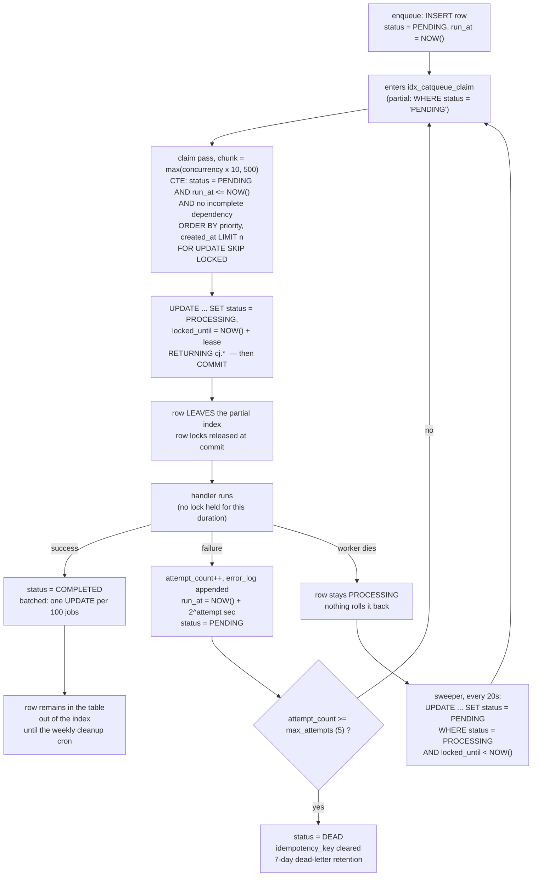

<!--
entry-meta
date: 2026-09-26
type: daily-diff
category: Daily Diff
title: Daily Diff — 2026-09-26
slug: sqlite-balance-page-splits
-->

# Daily Diff — Still No New Edition (newest is 2026-09-22)

**2026-09-26 · Daily Diff Digest**

## Status: nothing has published since Edition 060

Checked this run:

| URL | result |
|---|---|
| [tdd.cat](https://tdd.cat/) | serves **Tuesday, September 22, 2026**, 99 stories |
| [tdd.cat/archive](https://tdd.cat/archive) | newest listed is **Tue, Sep 22, 2026**; 60 editions total, from Fri, Jul 17, 2026 |
| `https://tdd.cat/2026-09-23/` | **HTTP 404** |
| `https://tdd.cat/2026-09-26/` | **HTTP 404** |

The archive repeats its own explanation: editions carry "a 2-day settling window so the highest-signal discussions and insights surface." That window does not account for four days, so either the cadence has paused or publication is running behind. **No items are invented here, and the four days 2026-09-23 through 2026-09-26 have no edition to summarise.**

Edition 060 has already been covered twice in this log — in full, with a deep dive on KIP-1279 Kafka cluster mirroring, in [the 2026-09-24 digest](../2026-09-24-sqlite-index-btrees-sort-order-covering/daily-diff.md), and a second deep dive on C type punning in [the 2026-09-25 digest](../2026-09-25-sqlite-btcursor-navigation-seek-restore/daily-diff.md). Rather than summarise it a third time, one more unexamined item from that edition gets the deep dive, chosen because it is the closest thing in the edition to [today's lesson](README.md): a queue built directly on a B-tree-backed database.

## Deep Dive: CatQueue — A Job Queue as a Table, and Where the B-Tree Bill Arrives

**Item:** *CatQueue eliminates Redis dependency for Node.js job queuing using PostgreSQL* — [github.com/karanrajsurya/CatQueue](https://github.com/karanrajsurya/CatQueue), listed in Edition 060.

Read this run: the README, `migrations/001_init.sql`, `src/inQueueProcesses.ts` and `src/delayedProcesses.ts`, at commit `cd664fd` through a code index.

### The claim query, in full

This is the whole product in one statement (`src/inQueueProcesses.ts` 14–39):

```sql
WITH target_jobs AS (
  SELECT cj.id
  FROM catqueue_jobs cj
  WHERE cj.status = 'PENDING'
    AND cj.run_at <= NOW()
    AND cj.job_name = ANY($3::text[])
    AND NOT EXISTS (
      SELECT 1 FROM job_dependencies jd
      JOIN catqueue_jobs dep ON dep.id = jd.depends_on
      WHERE jd.job_id = cj.id AND dep.status != 'COMPLETED'
    )
  ORDER BY cj.priority ASC, cj.created_at ASC
  LIMIT $4
  FOR UPDATE SKIP LOCKED
)
UPDATE catqueue_jobs cj
SET worker_id = $1, status = 'PROCESSING',
    locked_until = NOW() + ($2 * INTERVAL '1 second')
FROM target_jobs t WHERE cj.id = t.id
RETURNING cj.*;
```

### What actually provides mutual exclusion

The headline is `FOR UPDATE SKIP LOCKED`, and the README's comparison table puts it opposite "Redis SETNX". That framing undersells what is going on, and reading the code makes the real design visible:

- The CTE takes row locks and the outer `UPDATE` sets `status = 'PROCESSING'` — **then the statement commits.** The row locks are gone within milliseconds.
- So `SKIP LOCKED` is not what stops two workers running the same job for the job's whole duration. It only resolves collisions *during the claim itself*, a sub-millisecond race between concurrent claim statements. Without it those statements would serialise on the same hot rows; with it, worker B walks past worker A's in-flight rows instead of blocking.
- The actual lease for the job's lifetime is two ordinary columns: `status = 'PROCESSING'` (which removes the row from the claim predicate) and `locked_until` (which lets it come back).
- Crash recovery is therefore not transactional at all. `src/delayedProcesses.ts` 148–158 runs on a 20-second timer:

```sql
UPDATE catqueue_jobs
SET status = 'PENDING', locked_until = NULL, worker_id = NULL
WHERE status = 'PROCESSING' AND locked_until < NOW()
```

That is a visibility-timeout sweeper, the same shape as SQS's, and it is what makes the whole thing at-least-once rather than at-most-once. The lock is a lease in a column; the database's locking primitive is used only for the handoff.

### The index is the interesting decision

`migrations/001_init.sql` 27:

```sql
CREATE INDEX IF NOT EXISTS idx_catqueue_claim
  ON catqueue_jobs (run_at, priority ASC, created_at ASC)
  WHERE status = 'PENDING';
```

A **partial** index, and for a queue table that is the right instinct. A completed job's row stays in the table forever (until the weekly cleanup cron), but the moment `status` moves off `'PENDING'` the row leaves this index entirely. The index stays proportional to the *backlog*, not to the history. A plain index on the same columns would grow with every job ever enqueued and would be the first thing to bloat.

Two observations about it, offered as observations rather than verdicts — there is no PostgreSQL instance in this run, so nothing below was checked with `EXPLAIN`:

1. **The column order fights the query.** The leading column `run_at` is used as a range predicate (`run_at <= NOW()`), and the ordering the query wants is `priority, created_at`. A B-tree index whose leading column is range-scanned cannot also hand back rows ordered by the columns after it, so the matching set has to be sorted before `LIMIT` can apply. An index on `(priority, created_at) WHERE status = 'PENDING'`, with `run_at` as a filter, would instead let the scan stop as soon as `LIMIT` is satisfied. Which is faster depends on how much of the backlog is future-dated — worth an `EXPLAIN (ANALYZE, BUFFERS)` on a realistic backlog before changing anything.
2. **The dependency check is a correlated `NOT EXISTS` evaluated before `LIMIT`.** It is supported by `idx_job_deps_job_id`, so it is an index probe per candidate, not a scan — but it runs against candidates the planner is still filtering, and `job_dependencies` rows are never deleted except by `ON DELETE CASCADE`.

### Where this meets today's lesson

A queue table is the single most hostile access pattern a B-tree has: rows are inserted at one end of the key space, consumed and deleted from the other, and the interesting set — the backlog — is a moving window over a key range that grows forever.

Today's lesson measured what that costs in SQLite, where the whole mechanism is visible in 800 lines:

- **Inserting at the wrong end is a 2× file.** Descending-key inserts measured 51.12% leaf fill and 2,640 pages against 1,357 for the same rows ascending, because `balance_quick()` only fires at the right edge.
- **Deleting does not reclaim.** Deleting half the rows, evenly spread, left pages 49.74% full, returned exactly one page to the freelist, and did not shrink the file — because SQLite's only underfull test is "more than 2/3 of the page free", and a half-empty page is not.

PostgreSQL's storage layer is different in every particular — heap tuples rather than in-page cells, `VACUUM` rather than a page-level rebalance, index entries that die with their heap tuple — so those numbers do not transfer, and I did not measure the Postgres equivalents this run. What does transfer is the shape of the problem, and CatQueue's partial index is a direct answer to it: **keep the index over the live set, not the history.** That is the same instinct as `WHERE status = 'PENDING'` appearing in the index definition rather than only in the query.



### What it changes

- **"Postgres instead of Redis" is now a defensible default for moderate throughput.** The README's own single-run numbers put sequential add at 22,056 ops/sec against BullMQ's 22,643, and processing at 10,538 against 10,383 — parity, not a win, and the bulk-add path loses badly to pg-boss (66,138 vs 106,799). Parity is the point: one fewer system to operate is worth a lot when it costs nothing in throughput.
- **Treat those numbers as the author does.** The README's own "Known gaps" section says "Processing throughput has shown up to ~5.6x run-to-run variance. Not yet root-caused" and "Sequential Stress benchmark number is unverified since the last harness fix — re-run before citing it." A project that documents this is more trustworthy than one with rounder numbers, and the honest reading is that the benchmarks show *no disqualifying gap*, not a measured victory.
- **The pattern is portable even if the library is not.** Partial index over the live set, lease in a column, sweeper for the crashed-worker case, `SKIP LOCKED` only for the claim handoff. Those four decisions are the queue; the TypeScript around them is packaging.
- **Two flagged gaps to read before adopting:** the README lists `GraphProcess.ts` as "correct but unused — not called from `processNextBatch`", and a schema trigger referencing a nonexistent `'WAITING'` status ("dormant, never fires"). The `catqueue_status` enum in the migration does define `'CYCLIC'` but no `'WAITING'`, which is consistent with that note.

## Sources

- [The Daily Diff](https://tdd.cat/) — serving the Tuesday, September 22, 2026 edition (99 stories) as of this run.
- [The Daily Diff — archive](https://tdd.cat/archive) — the edition list (newest Tue, Sep 22, 2026; 60 editions from Fri, Jul 17, 2026) and the quoted 2-day settling-window note. `https://tdd.cat/2026-09-23/` and `https://tdd.cat/2026-09-26/` both returned HTTP 404 this run and are therefore not linked.
- [karanrajsurya/CatQueue](https://github.com/karanrajsurya/CatQueue) — the deep-dive item. README read via fetch (the comparison table including "Atomic job locking | `SELECT FOR UPDATE SKIP LOCKED`", the chunked-prefetch description "claims a chunk via `SELECT ... FOR UPDATE SKIP LOCKED` (sized `max(concurrency × 10, 500)`)… batches successful completions into one `UPDATE` per 100 jobs", the retry schedule, the benchmark table, and the "Known gaps" items quoted above); source read through a code index at commit `cd664fd`: `migrations/001_init.sql` 1–29 (the `catqueue_status` enum, the `catqueue_jobs` and `job_dependencies` tables, and all three indexes including the partial `idx_catqueue_claim`), `src/inQueueProcesses.ts` 4–41 (`claimRunnableJobs`, quoted in full) and 103–115 (the failure-path `UPDATE`), and `src/delayedProcesses.ts` 148–158 (`recoverStuckJobs`, quoted in full).
- Measurements referenced from [today's lesson](README.md) are SQLite 3.53.4 via `apsw` 3.53.4.0, made in this run.
