<!--
entry-meta
date: 2026-09-27
type: lesson
track: SQLite
lesson: 12
category: Database Internals
title: Deletion, Underflow, and Rebalancing — sqlite3BtreeDelete(), dropCell(), and the 2/3 Rule
slug: sqlite-delete-underflow-rebalance
-->

# Deletion, Underflow, and Rebalancing — `sqlite3BtreeDelete()`, `dropCell()`, and the 2/3 Rule

**2026-09-27 · SQLite Track · Lesson 12 of 32**

## Where This Fits

- **Previous lesson:** [Lesson 11](../2026-09-26-sqlite-balance-page-splits/README.md) took the insert side of `balance()`: the overflow cell in `apOvfl[]`, the two-condition test, and the three sub-algorithms — `balance_deeper()`, `balance_quick()`, `balance_nonroot()`. Its §11 established the one fact this lesson has to explain: deleting rows frees almost nothing.
- **This lesson:** the delete path, end to end. `sqlite3BtreeDelete()` is only ~200 lines, but it reaches into four mechanisms from earlier lessons and it is the *only* caller that can shrink the tree. The centre of it is a single inequality — `nFree*3 > usableSize*2` — and this lesson measures exactly where that inequality puts the cliff, and what falls off each side of it.
- **What it corrects retroactively:** Lesson 10 §8.1 described `saveAllCursors()` and the `CURSOR_SKIPNEXT`/`CURSOR_REQUIRESEEK` split as an insert-side contract. It is mostly a *delete*-side contract — `bPreserve` (§3) is where the choice between those two states is actually made. And Lesson 08's table/index distinction turns out to decide which half of `sqlite3BtreeDelete()` can even run (§4).
- **Next:** Lesson 13 is auto-vacuum — ptrmap pages, page relocation, `incremental_vacuum`. That lesson is the answer to the question this one ends on: every measurement below leaves the file exactly as large as it started.

Source references are to `sqlite/sqlite` at commit **`2acb2ea`** (`src/btree.c`, `src/delete.c`, `src/vdbe.c`), read through a code index this run and cited by path and line range. Measurements are against SQLite **3.53.4** via `apsw` 3.53.4.0, `page_size = 4096`, `journal_mode = delete` (except where WAL is used to count page writes), `auto_vacuum = none`, rows of a 100-byte blob unless stated otherwise — the same tooling as Lessons 08–11.

---

## 1. The Shape of the Path

`sqlite3BtreeDelete(BtCursor *pCur, u8 flags)` (`btree.c` 9873) deletes **the cell the cursor is already sitting on**. It does not search. Everything about which row dies was decided by the seek in Lesson 10; this function's whole job is to remove one cell and then repair whatever that broke.

It runs six phases, and each one is a mechanism from an earlier lesson:

| Phase | What it does | Lesson it draws on |
|---|---|---|
| 1. Validate + `bPreserve` | Restore cursor if stale; decide how the cursor will survive | 10 (cursor states) |
| 2. Interior-node case | If the cell is on an interior page, walk to the predecessor leaf | 09 (index b-trees) |
| 3. `BTREE_CLEAR_CELL` | Free the cell's overflow chain | 05 (overflow), 06 (freelist) |
| 4. `dropCell` | Remove the cell from the page, make a freeblock | 03 (cell array), 04 (freeblocks) |
| 5. Promote predecessor | Move a leaf cell up into the interior node | 03 (cell layouts) |
| 6. The 2/3 test → `balance()` | Rebalance, merge, possibly shrink the tree | 11 (balance) |

Only phase 6 can return a page to the freelist, and phase 6 is skipped most of the time. That is the whole story of why databases don't shrink, and §9 measures it.

Two flags come in. `BTREE_SAVEPOSITION` says the caller wants the cursor usable afterwards. `BTREE_AUXDELETE` is documented at `btree.c` 9865–9872 as marking all but one of the deletes belonging to a single row-and-its-indexes — and the header comment is blunt that SQLite itself ignores it:

> The BTREE_AUXDELETE bit is a hint that is not used by this implementation, but which might be used by alternative storage engines.

It exists for the `sqlite3_btree`-replacement world (Berkeley DB's old SQLite layer, `libsql`, etc.), not for anything in this tree.

---

## 2. Phase 1 — The Cell Must Already Be Under the Cursor

The opening asserts (`btree.c` 9884–9890) are a summary of every invariant Lessons 07–11 established: the cursor owns the `BtShared` mutex, a write transaction is open, the b-tree is not read-only, `BTCF_WriteFlag` is set, and the shared-cache table lock is held.

Then the cursor gets revived if it was parked (`btree.c` 9891–9899):

```c
if( pCur->eState!=CURSOR_VALID ){
  if( pCur->eState>=CURSOR_REQUIRESEEK ){
    rc = btreeRestoreCursorPosition(pCur);
    ...
  }else{
    return SQLITE_CORRUPT_PGNO(pCur->pgnoRoot);
  }
}
```

`CURSOR_REQUIRESEEK` and above can be restored by re-seeking the saved key; `CURSOR_INVALID` and `CURSOR_FAULT` cannot, and a delete attempted on one of those is reported as corruption rather than as a usage error.

Three corruption checks follow, and they are worth reading as a set because they are checking *the page*, not the request:

- `pPage->nCell<=iCellIdx` — the cursor index points past the end of the page (`9905`).
- `pPage->nFree<0 && btreeComputeFreeSpace(pPage)` — the lazy free-space computation from Lesson 04, forced now because `dropCell` will need `nFree` to be valid (`9909`).
- `pCell < &pPage->aCellIdx[pPage->nCell]` — the cell's content offset points *into the cell pointer array*, which means the page's own pointers are inconsistent (`9912`).

---

## 3. Phase 1b — `bPreserve`, Where the Cursor's Fate Is Decided

This is the part Lesson 10 described from the wrong side. The comment at `btree.c` 9926–9930 defines a three-valued variable:

```
**    bPreserve==0         Not necessary to save the cursor position
**    bPreserve==1         Use CURSOR_REQUIRESEEK to save the cursor position
**    bPreserve==2         Cursor won't move.  Set CURSOR_SKIPNEXT.
```

And the test that picks between 1 and 2 (`btree.c` 9932–9946):

```c
bPreserve = (flags & BTREE_SAVEPOSITION)!=0;
if( bPreserve ){
  if( !pPage->leaf
   || (pPage->nFree+pPage->xCellSize(pPage,pCell)+2) >
                                                 (int)(pBt->usableSize*2/3)
   || pPage->nCell==1  /* See dbfuzz001.test for a test case */
  ){
    rc = saveCursorKey(pCur);
    if( rc ) return rc;
  }else{
    bPreserve = 2;
  }
}
```

Read the middle condition carefully. It is **the 2/3 test evaluated in advance** — `nFree` plus the space this cell is about to release plus its 2-byte pointer, against `usableSize*2/3`. The function is predicting whether phase 6 will rebalance, because the answer determines which cursor-preservation strategy is even legal:

- **Rebalance expected** → cells are about to move between pages, so the page stack is worthless. Save the *key* (`saveCursorKey`), leave `CURSOR_REQUIRESEEK`, and re-seek later.
- **No rebalance** → the page will not move, so keep the stack and set `CURSOR_SKIPNEXT`, which is far cheaper than a re-seek.

The `pPage->nCell==1` clause is a bug fix with a test case named in the comment: a page down to its last cell is a case the arithmetic alone does not catch.

This is also the cheapest possible demonstration that the 2/3 constant is load-bearing rather than incidental — it is consulted *twice* per delete, once here to choose a cursor strategy and once at the end to decide whether to call `balance()` at all.

---

## 4. Phase 2 — The Interior-Node Case, and Who Can Actually Reach It

If the cell being deleted is on an interior page, the row cannot simply vanish: the interior cell is a *separator*, and removing it would orphan its left child. SQLite's answer (`btree.c` 9948–9959):

```c
if( !pPage->leaf ){
  rc = sqlite3BtreePrevious(pCur, 0);
  assert( rc!=SQLITE_DONE );
  if( rc ) return rc;
}
```

The comment explains the choice of predecessor over successor:

> The 'previous' entry is used for this instead of the 'next' entry, as the previous entry is always a part of the sub-tree headed by the child page of the cell being deleted. This makes balancing the tree following the delete operation easier.

The predecessor is the right-most entry of the left child's subtree, so promoting it keeps the separator inside the same child pointer and no pointer has to be rewritten.

The promotion itself happens after the drop (`btree.c` 9988–10015). The interesting line is the copy:

```c
pCell = findCell(pLeaf, pLeaf->nCell-1);
nCell = pLeaf->xCellSize(pLeaf, pCell);
pTmp  = pBt->pTmpSpace;
rc = sqlite3PagerWrite(pLeaf->pDbPage);
if( rc==SQLITE_OK ){
  rc = insertCell(pPage, iCellIdx, pCell-4, nCell+4, pTmp, n);
}
dropCell(pLeaf, pLeaf->nCell-1, nCell, &rc);
```

`pCell-4` and `nCell+4` are the `leafCorrection` of Lesson 11 §6.1 running backwards: a leaf cell has no 4-byte child pointer, an interior cell must have one, so the copy starts 4 bytes *before* the cell and those 4 bytes are then overwritten with the child page number `n`. The child number itself is picked at `9998–10002` — the page one level below the deleted cell's depth, or the cursor's current page if the descent was only one level.

### 4.1 The asymmetry: rowid tables can never reach this branch

This branch reads as if it applies to every b-tree. It does not, and the reason is in the seek code from Lesson 10.

**`sqlite3BtreeTableMoveto()`** — on an exact key match at a non-leaf page (`btree.c` 5938–5950):

```c
}else{
  assert( nCellKey==intKey );
  pCur->ix = (u16)idx;
  if( !pPage->leaf ){
    lwr = idx;
    goto moveto_table_next_layer;     /* keep descending */
  }else{
    ...
    *pRes = 0;
    return SQLITE_OK;
  }
}
```

**`sqlite3BtreeIndexMoveto()`** — the same situation (`btree.c` 6239–6245):

```c
}else{
  assert( c==0 );
  *pRes = 0;
  rc = SQLITE_OK;
  pCur->ix = (u16)idx;
  if( pIdxKey->errCode ) rc = SQLITE_CORRUPT_BKPT;
  goto moveto_index_finish;           /* stop here, leaf or not */
}
```

A table b-tree **keeps descending** on an exact match; an index b-tree **stops where it is**. The reason is Lesson 08: in a rowid table the interior cell holds a key and a child pointer and *no payload* — the row's data is only ever in a leaf, so the divider key is a pure separator that may name a rowid that no longer exists. In an index b-tree (an index, or a `WITHOUT ROWID` table's primary key) the interior cell carries the whole key record, so the entry in the interior page **is** the row.

**Therefore the `if(!pPage->leaf)` half of `sqlite3BtreeDelete()` is unreachable for rowid tables.** It exists for indexes and `WITHOUT ROWID` tables.

Measured, on a rowid table with 400 rows of 600-byte blobs — root page 2, dividers `(child 3, key 6), (child 4, key 12), …`:

```
>>> DELETE FROM t WHERE id=6      (id 6 IS a divider key in the root)
divider[0] key 6 -> 6             (unchanged)
rows with id<6 still present: 5
```

The divider keeps naming rowid 6 after rowid 6 is gone. It is a separator, and a stale separator is perfectly legal.

The same experiment on a `WITHOUT ROWID` table — 400 rows keyed `key000001`…`key000400`, root page 2 with one divider:

```
root page 2 dividers (child_pgno, key stored IN the interior cell):
    (61, 'key000196')

>>> DELETE FROM k WHERE key='key000196'   (this key lives in the ROOT)
root page 2 dividers now:
    (61, 'key000195')

  divider[0] key: key000196 -> key000195
  that replacement key is the PREDECESSOR, pulled up out of leaf page 61
  rows remaining: 399
  is 'key000195' still returned by a query?   True
```

`key000195` was promoted out of leaf page 61 into the root, and it is still a live row returned by `SELECT`. That single byte-level diff is the whole of `btree.c` 9955 + 10003–10013 made visible.

---

## 5. Phase 3 — Freeing the Overflow Chain

Before the cell can be dropped, its overflow pages must go back to the freelist. `BTREE_CLEAR_CELL` (`btree.c` 7085–7091) is a macro specifically so the common case inlines:

```c
#define BTREE_CLEAR_CELL(rc, pPage, pCell, sInfo)   \
  pPage->xParseCell(pPage, pCell, &sInfo);          \
  if( sInfo.nLocal!=sInfo.nPayload ){               \
    rc = clearCellOverflow(pPage, pCell, &sInfo);   \
  }else{                                            \
    rc = SQLITE_OK;                                 \
  }
```

`nLocal != nPayload` is Lesson 05's overflow test. When there is no overflow — the overwhelming majority of cells — this costs one `xParseCell` and a comparison, and `clearCellOverflow` is `SQLITE_NOINLINE` (`btree.c` 7011) to keep it out of the hot path's instruction cache.

`clearCellOverflow()` itself walks the chain (`btree.c` 7030–7075). Two details are worth pulling out:

**The chain length is computed, not walked to find its end** (`7034`):

```c
ovflPageSize = pBt->usableSize - 4;
nOvfl = (pInfo->nPayload - pInfo->nLocal + ovflPageSize - 1)/ovflPageSize;
```

`while( nOvfl-- )` then runs a known number of times, and `getOverflowPage()` is called only when `nOvfl` is still non-zero — the last page's `next` pointer is never read, because it is known to be the last.

**A refcount check that is really a corruption check** (`7052–7065`): if the page object already exists in cache with a refcount other than 1, the code returns `SQLITE_CORRUPT_BKPT` rather than freeing it. The comment says why this matters *before* the free rather than after:

> It is helpful to detect this before calling freePage2(), as freePage2() may zero the page contents if secure-delete mode is enabled. If this 'overflow' page happens to be a page that the caller is iterating through or using in some other way, this can be problematic.

Measured, with one 1,000,000-byte blob in a fresh database:

```
after inserting one 1,000,000-byte blob: page_count=246  freelist=0
predicted overflow pages ~ (1000000 - local)/(usableSize-4) = 243.4
after DELETE:            page_count=246  freelist=244
file bytes still        = 1007616
```

244 pages freed — 243 overflow pages plus the leaf that held the cell — against 243.4 predicted by the formula at line 7034. The file is still 1,007,616 bytes.

---

## 6. Phase 4 — `dropCell`, and the Two Paths Out

`dropCell()` (`btree.c` 7299–7341) is short and has one branch that matters:

```c
rc = freeSpace(pPage, pc, sz);
...
pPage->nCell--;
if( pPage->nCell==0 ){
  memset(&data[hdr+1], 0, 4);
  data[hdr+7] = 0;
  put2byte(&data[hdr+5], pPage->pBt->usableSize);
  pPage->nFree = pPage->pBt->usableSize - pPage->hdrOffset
                     - pPage->childPtrSize - 8;
}else{
  memmove(ptr, ptr+2, 2*(pPage->nCell - idx));
  put2byte(&data[hdr+3], pPage->nCell);
  pPage->nFree += 2;
}
```

The normal path calls `freeSpace()` — Lesson 04's freeblock-chain insert, with its coalescing of adjacent freeblocks and its `nFrag` accounting — then `memmove`s the tail of the cell pointer array down by one slot and adds the 2 recovered pointer bytes to `nFree`.

The `nCell==0` path throws all of that away. When the last cell leaves a page, there is no point maintaining a freeblock chain describing an empty page, so the header is reset directly: freeblock offset (`hdr+1`) and cell count (`hdr+3`) zeroed, fragmented-bytes counter (`hdr+7`) zeroed, content-area start (`hdr+5`) set back to `usableSize`, and `nFree` recomputed from geometry. The page is now byte-identical to a freshly zeroed page of its type. It is **not** freed here — it still belongs to its parent. Freeing is phase 6's business.

Note what `dropCell` does *not* do: it does not touch the cell's bytes. The record is still sitting in the page's content area, now covered by a freeblock. That is exactly the "deleted content is not erased" that the [VACUUM documentation](https://www.sqlite.org/lang_vacuum.html) warns about, and why `secure_delete` exists.

---

## 7. Phase 6 — The 2/3 Test

After the drop (and the promotion, if any), the function reaches the test everything has been building to (`btree.c` 10032–10040):

```c
assert( pCur->pPage->nOverflow==0 );
assert( pCur->pPage->nFree>=0 );
if( pCur->pPage->nFree*3<=(int)pCur->pBt->usableSize*2 ){
  /* Optimization: If the free space is less than 2/3rds of the page,
  ** then balance() will always be a no-op.  No need to invoke it. */
  rc = SQLITE_OK;
}else{
  rc = balance(pCur);
}
```

This is the same predicate `balance()` itself applies at `btree.c` 9175 — the short-circuit just avoids the call. From Lesson 11:

```c
if( pPage->nOverflow==0 && pPage->nFree*3<=(int)pCur->pBt->usableSize*2 ){
  /* No rebalance required ... */
  break;
}
```

**SQLite has no minimum fill factor.** A textbook B-tree keeps every node at least half full and merges siblings when a node underflows. SQLite's only underflow condition is "more than two-thirds of this page is free" — which is to say, less than one-third full. Everything between 33% and 100% full is left exactly as it is.

Then a second `balance()` may run (`btree.c` 10041–10049):

```c
if( rc==SQLITE_OK && pCur->iPage>iCellDepth ){
  releasePageNotNull(pCur->pPage);
  pCur->iPage--;
  while( pCur->iPage>iCellDepth ){
    releasePage(pCur->apPage[pCur->iPage--]);
  }
  pCur->pPage = pCur->apPage[pCur->iPage];
  rc = balance(pCur);
}
```

This is the interior-node case again. After a promotion, *two* pages can be in trouble: the leaf that gave up its last cell may be underfull, and the interior node that received a possibly-larger cell may be overfull. The leaf is balanced first; if that balance walked up far enough to fix the interior node too, `pCur->iPage` will already have come down to `iCellDepth` and the `if` is false. Otherwise the cursor is walked back up and balanced again. The comment at `10022–10031` says this explicitly.

---

## 8. What `balance_nonroot()` Does on the Delete Side

Lesson 11 read `balance_nonroot()` as a splitter. The same ~700 lines run for deletes, and the only thing that changes is arithmetic: the flat cell array is *smaller* than what the sibling pages held, so the packing loop produces fewer pages than it consumed.

Two consequences that only appear on the delete side:

**Surplus pages are freed** (`btree.c` 9029–9033):

```c
/* Free any old pages that were not reused as new pages.
*/
for(i=nNew; i<nOld; i++){
  freePage(apOld[i], &rc);
}
```

`nOld` is up to 3 siblings; `nNew` can be 1. This loop is the *only* place in the b-tree layer where an interior or leaf page returns to the freelist as a result of a row delete.

**balance-shallower** (`btree.c` 8989–9014) — the tree gets shorter:

```c
if( isRoot && pParent->nCell==0 && pParent->hdrOffset<=apNew[0]->nFree ){
  /* ... This is described as the "balance-shallower"
  ** sub-algorithm in some documentation.
  ...
  ** It is critical that the child page be defragmented before being
  ** copied into the parent, because if the parent is page 1 then it will
  ** by smaller than the child due to the database header, and so all the
  ** free space needs to be up front.
  */
  rc = defragmentPage(apNew[0], -1);
  copyNodeContent(apNew[0], pParent, &rc);
  freePage(apNew[0], &rc);
}
```

This is the mirror of `balance_deeper()` from Lesson 11 §3, and it exists for the same reason: **the root page's number is immutable**, so the tree cannot be made shorter by promoting a child — the child's contents must be copied *into* the root and the child freed. The `hdrOffset<=apNew[0]->nFree` guard is the page-1 problem: the root of the first table is page 1, which has 100 fewer usable bytes because of the database header, so the child's contents only fit if the child has at least 100 bytes free. `defragmentPage()` is mandatory here (and this is the caller Lesson 04 §8.5 was pointing at) because the copy needs all the free space in one run at the front.

---

## 9. Measured: The Reclamation Cliff

The 2/3 rule predicts a sharp discontinuity, not a gradient. Here it is.

Geometry first, so the prediction is not hand-waved. 24,000 rows of a 100-byte blob, `page_size=4096`:

```
a full leaf: ncell=37  unused=92  pgsize=4096
bytes per cell incl. 2-byte pointer = (4096-8-92)/37 = 108.00
balance fires when nFree > usableSize*2/3 = 2730
=> max cells that still leave nFree > 2730: 12.57 cells  (34.0% of a full page)
=> a page must lose more than 66.0% of its cells before balance() is called
```

Now delete `k` rows out of every 12, evenly spread, so every leaf page loses the same fraction:

| removed | leaf pages | leaf fill % | pages freed | levels |
|---:|---:|---:|---:|---:|
| 8.3% | 649 | 90.66 | 0 | 3 |
| 16.7% | 649 | 82.44 | 0 | 3 |
| 25.0% | 649 | 74.21 | 0 | 3 |
| 33.3% | 649 | 65.99 | 0 | 3 |
| 41.7% | 649 | 57.76 | 0 | 3 |
| 50.0% | 648 | 49.62 | 1 | 3 |
| 58.3% | 648 | 41.38 | 1 | 3 |
| **66.7%** | **270** | **79.27** | **381** | **2** |
| 75.0% | 200 | 80.26 | 451 | 2 |
| 83.3% | 131 | 81.68 | 520 | 2 |
| 91.7% | 67 | 79.86 | 584 | 2 |

The predicted threshold was "more than 66.0% of a page's cells". The observed cliff is between 58.3% and 66.7% — the sweep's resolution is 8.3 percentage points and the prediction lands inside the one interval where the behaviour changes. `37 × 5/12 = 15.4` cells leaves `nFree ≈ 2394`, below 2730, no balance. `37 × 4/12 = 12.3` cells leaves `nFree ≈ 2735`, just over 2730, and balance fires.

Three things to take from that table:

1. **Up to 58.3% deleted, the page count does not move at all.** Fill drops linearly, 649 pages stay 649 pages, one page is returned to the freelist in the whole database.
2. **Across the cliff, deleting *more* leaves the file *tidier*.** 66.7% removed gives 79.27% fill; 58.3% removed gives 41.38%. Once `balance_nonroot()` runs it repacks three siblings into one or two well-filled pages, so the post-delete fill jumps back up to roughly where insertion leaves it.
3. **The tree gets shorter at the cliff**, not gradually — 3 levels to 2, via balance-shallower.

At the 50,000-row scale, and comparing deletion *patterns* rather than fractions:

| scenario | leaf pages | leaf fill % | pages freed | levels | file bytes |
|---|---:|---:|---:|---:|---:|
| baseline (50,000 rows) | 1352 | 99.21 | 0 | 3 | 5,558,272 |
| delete every 2nd row (50%, spread) | 1351 | 49.74 | 1 | 3 | 5,558,272 |
| delete contiguous first half (50%) | 677 | 99.37 | 676 | 3 | 5,558,272 |
| delete 2/3, spread (`id%3!=0`) | 564 | 79.31 | 788 | 3 | 5,558,272 |
| delete 90%, spread | 166 | 80.84 | 1189 | 2 | 5,558,272 |
| delete 99%, spread | 17 | 78.95 | 1338 | 2 | 5,558,272 |
| `DELETE FROM t WHERE id>0` | 1 | 0.20 | 1355 | 1 | 5,558,272 |

**The two 50% rows are the lesson.** Same number of rows deleted; 1 page reclaimed versus 676. Deleting a contiguous range empties whole pages, and an empty page trivially satisfies `nFree > 2730`. Deleting an evenly-spread half takes every page to almost exactly half full — the worst possible place to be, because it is the maximum amount of dead space that the 2/3 rule will not touch.

And the last column never changes. **Not one of these operations made the file smaller.**

---

## 10. Measured: Freeing a Page Is Cheaper Than Dirtying One

Counting WAL frames gives an exact count of distinct pages written by a statement (one frame per page per commit, with a cache large enough to prevent spill):

| operation (24,000 rows) | pages written |
|---|---:|
| delete 1 row (leaf, no balance) | 2 |
| delete 50% evenly (no reclaim) | 652 |
| delete 2/3 evenly (balances, frees 381 pages) | 277 |
| `DELETE FROM t` (truncate optimization) | 4 |

Row 3 is the surprising one: the delete that frees 381 pages writes **less than half** as many pages as the delete that frees 1. Deleting more rows, and doing more structural work, wrote fewer pages.

The mechanism is in `freePage2()` (`btree.c` 6962–6969):

```c
rc = sqlite3PagerWrite(pTrunk->pDbPage);
if( rc==SQLITE_OK ){
  put4byte(&pTrunk->aData[4], nLeaf+1);
  put4byte(&pTrunk->aData[8+nLeaf*4], iPage);
  if( pPage && (pBt->btsFlags & BTS_SECURE_DELETE)==0 ){
    sqlite3PagerDontWrite(pPage->pDbPage);
  }
  rc = btreeSetHasContent(pBt, iPage);
}
```

`sqlite3PagerDontWrite()` **cancels a pending write**. A page that was dirtied by the delete and then freed is un-dirtied: its new content is irrelevant, because the freelist trunk now records the page number and nothing will read the page's bytes before it is reallocated. Freeing a page costs 4 bytes in a trunk page, not a 4 KiB page write. (With `secure_delete` on, the `if` fails, the page is zeroed at `6905`, and the saving disappears — that is the real cost of `secure_delete`.)

The 50%-spread delete gets no such discount. It dirties all 649 leaves plus the interior pages and frees almost nothing, so it pays full price for every page: 652 writes.

---

## 11. The Truncate Optimization

`DELETE FROM t` with no `WHERE` and no `RETURNING`, on a table with no triggers, does not visit rows at all. From `delete.c` 459–494:

```c
#ifndef SQLITE_OMIT_TRUNCATE_OPTIMIZATION
  /* Special case: A DELETE without a WHERE clause deletes everything.
  ** It is easier just to erase the whole table.
  ...
  ** The "rcauth==SQLITE_OK" terms is the
  ** IMPLEMENTATION-OF: R-17228-37124 If the action code is SQLITE_DELETE and
  ** the callback returns SQLITE_IGNORE then the DELETE operation proceeds but
  ** the truncate optimization is disabled and all rows are deleted
  ** individually.
```

and the codegen, which emits one `OP_Clear` per b-tree — the table and each of its indexes (`delete.c` 485–492):

```c
for(pIdx=pTab->pIndex; pIdx; pIdx=pIdx->pNext){
  if( IsPrimaryKeyIndex(pIdx) && !HasRowid(pTab) ){
    sqlite3VdbeAddOp3(v, OP_Clear, pIdx->tnum, iDb, memCnt ? memCnt : -1);
  }else{
    sqlite3VdbeAddOp2(v, OP_Clear, pIdx->tnum, iDb);
  }
}
```

The [official documentation](https://www.sqlite.org/lang_delete.html) states the conditions and both ways to defeat it — `SQLITE_OMIT_TRUNCATE_OPTIMIZATION` at compile time, or an authorizer returning `SQLITE_IGNORE` for `SQLITE_DELETE` at runtime.

The bytecode difference, on a 10-row table:

```
delete from t                  5 ops: Init Clear Halt Transaction Goto
delete from t where id>0      11 ops: Init Null OpenWrite SeekGT Rowid Delete Next Halt Transaction Integer Goto
```

`OP_Clear` lands in `clearDatabasePage()` (`btree.c` 10252–10310), a post-order recursion that frees every page of the tree:

```c
for(i=0; i<pPage->nCell; i++){
  pCell = findCell(pPage, i);
  if( !pPage->leaf ){
    rc = clearDatabasePage(pBt, get4byte(pCell), (freePageFlag+2)|1, pnChange);
    ...
  }
  BTREE_CLEAR_CELL(rc, pPage, pCell, info);
  ...
}
if( !pPage->leaf ){
  rc = clearDatabasePage(pBt, get4byte(&pPage->aData[hdr+8]), (freePageFlag+2)|1, pnChange);
  ...
}
...
if( (freePageFlag&1)!=0 ){
  freePage(pPage, &rc);
}else if( (rc = sqlite3PagerWrite(pPage->pDbPage))==0 ){
  zeroPage(pPage, pPage->aData[hdr] | PTF_LEAF);
}
```

Note the recursion-depth trick in `freePageFlag`: bit 0 says "free this page", bits 1–31 are the depth, incremented by `+2` on each descent — so one `int` carries a flag and a stack-overflow guard against a corrupt file with a cyclic page graph (`btree.c` 10244–10250). The root page itself is passed `freePageFlag=0`, so it is `zeroPage`d and kept: "After this routine returns, the root page is empty, but still exists" (`btree.c` 10313–10315).

Measured on 50,000 rows:

| | time | pages freed | page_count |
|---|---:|---:|---:|
| `DELETE FROM t` (no WHERE) | 2.1 ms | 1355 | 1357 |
| `DELETE FROM t WHERE id>0` | 20.8 ms | 1355 | 1357 |

Same end state, **10× the time** for the row-by-row version. And the page-write counts from §10 explain it — 4 writes against a full traversal's worth. Which four?

```
WAL frame page numbers: [1, 2, 3, 1021]
freelist_count = 1355   page_count = 1357
trunk capacity = usableSize/4 - 8 = 1016 leaves per trunk
```

- **page 1** — the freelist head (offset 32) and free-page count (offset 36) in the database header.
- **page 2** — the table's root, zeroed by `clearDatabasePage`'s `else` branch.
- **pages 3 and 1021** — the two freelist trunk pages. 1355 free pages = 2 trunks + 1353 leaves, and a trunk holds at most `usableSize/4 - 8 = 1016` leaf entries.

That 1016 is the backwards-compatibility reserve documented in both the source (`btree.c` 6942–6960) and the [file format spec](https://www.sqlite.org/fileformat2.html):

> newer versions of SQLite still avoid using the last six entries in the freelist trunk page array in order that database files created by newer versions of SQLite can be read by older versions of SQLite.

So `DELETE FROM t` on a 5.5 MB table is **four page writes**. It still *reads* every page — `clearDatabasePage` has to visit each cell to find child pointers and overflow chains — but it writes almost nothing. That asymmetry is the whole optimization.

---

## 12. Cursor State on the Way Out

The tail of the function (`btree.c` 10051–10071) cashes in the `bPreserve` decision from §3:

```c
if( bPreserve>1 ){
  pCur->eState = CURSOR_SKIPNEXT;
  if( iCellIdx>=pPage->nCell ){
    pCur->skipNext = -1;
    pCur->ix = pPage->nCell-1;
  }else{
    pCur->skipNext = 1;
  }
}else{
  rc = moveToRoot(pCur);
  if( bPreserve ){
    btreeReleaseAllCursorPages(pCur);
    pCur->eState = CURSOR_REQUIRESEEK;
  }
  if( rc==SQLITE_EMPTY ) rc = SQLITE_OK;
}
```

The `skipNext` sign is the detail Lesson 10 left open. Deleting a cell shifts every later cell down one index, so the cursor's `ix` now points at what *was* the next row:

- **Deleted cell was not the last** (`iCellIdx < nCell`): `skipNext = 1`. A subsequent `BtreeNext()` must not advance, because the cursor is already on the successor.
- **Deleted cell was the last** (`iCellIdx >= nCell`): `ix` is clamped to `nCell-1` and `skipNext = -1`, so a subsequent `BtreePrev()` does not advance either.

This is what makes `DELETE` inside a `WHERE`-driven scan work without a re-seek per row — and §3's 2/3 pre-test is what decides how often that cheap path is available. In the 50%-spread delete of §9, *no* row triggered a rebalance, so every one of those 12,000 deletes took the `CURSOR_SKIPNEXT` path.

```mermaid
flowchart TD
    START["sqlite3BtreeDelete(pCur, flags)"] --> VALID{"eState == CURSOR_VALID ?"}
    VALID -->|"REQUIRESEEK or above"| RESTORE["btreeRestoreCursorPosition()"]
    VALID -->|"INVALID / FAULT"| CORRUPT["return SQLITE_CORRUPT_PGNO"]
    VALID -->|yes| CHK
    RESTORE --> CHK["3 corruption checks<br/>nCell, nFree, cell-vs-aCellIdx<br/>(btree.c 9905-9914)"]

    CHK --> BP{"BTREE_SAVEPOSITION set ?"}
    BP -->|no| BP0["bPreserve = 0"]
    BP -->|yes| BPT{"!leaf<br/>OR nFree + cellSize + 2 &gt; usableSize*2/3<br/>OR nCell == 1"}
    BPT -->|yes — rebalance predicted| BP1["saveCursorKey()<br/>bPreserve = 1"]
    BPT -->|no| BP2["bPreserve = 2"]

    BP0 --> LEAF
    BP1 --> LEAF
    BP2 --> LEAF

    LEAF{"is the cell on a LEAF page ?"}
    LEAF -->|"no — index b-tree only<br/>(table seek never stops here)"| PREV["sqlite3BtreePrevious()<br/>descend to predecessor leaf"]
    LEAF -->|yes| SAVE
    PREV --> SAVE["saveAllCursors() if BTCF_Multiple<br/>invalidateIncrblobCursors()"]

    SAVE --> CLEAR["BTREE_CLEAR_CELL<br/>nLocal != nPayload ? clearCellOverflow()<br/>freePage2() per overflow page"]
    CLEAR --> DROP["dropCell(pPage, iCellIdx, nSize)"]
    DROP --> DROPB{"nCell == 0 after drop ?"}
    DROPB -->|yes| RESET["reset page header:<br/>freeblock=0, nCell=0, nFrag=0<br/>content start = usableSize"]
    DROPB -->|no| FREESP["freeSpace(): new freeblock,<br/>memmove cell-pointer tail, nFree += 2"]

    RESET --> PROMO
    FREESP --> PROMO

    PROMO{"was the cell on an interior page ?"}
    PROMO -->|yes| MOVE["copy leaf's last cell UP:<br/>insertCell(pPage, iCellIdx, pCell-4, nCell+4, pTmp, n)<br/>then dropCell(pLeaf, nCell-1)"]
    PROMO -->|no| TEST
    MOVE --> TEST

    TEST{"nFree*3 &gt; usableSize*2 ?<br/>(more than 2/3 of the page free)"}
    TEST -->|"no — the common case"| SKIPB["skip balance() entirely<br/>page stays underfull forever"]
    TEST -->|yes| BAL["balance()"]

    BAL --> BNR["balance_nonroot():<br/>up to 3 siblings -&gt; flat cell array -&gt; fewer pages<br/>surplus old pages freePage()'d (9031-9033)"]
    BNR --> SHAL{"isRoot AND parent has 0 cells<br/>AND child fits ?"}
    SHAL -->|yes| SHALLOW["balance-shallower:<br/>defragmentPage(child)<br/>copyNodeContent(child -&gt; root)<br/>freePage(child) — TREE GETS SHORTER"]
    SHAL -->|no| UP

    SHALLOW --> UP["walk up cursor stack, repeat"]
    SKIPB --> SECOND
    UP --> SECOND

    SECOND{"pCur-&gt;iPage &gt; iCellDepth ?<br/>(promotion left the interior node unbalanced)"}
    SECOND -->|yes| BAL2["release pages back to iCellDepth<br/>balance() a second time"]
    SECOND -->|no| OUT
    BAL2 --> OUT

    OUT{"bPreserve"}
    OUT -->|2| SKIPNEXT["CURSOR_SKIPNEXT<br/>skipNext = +1, or -1 if the cell was last"]
    OUT -->|1| REQ["moveToRoot() + btreeReleaseAllCursorPages()<br/>CURSOR_REQUIRESEEK"]
    OUT -->|0| ROOT["moveToRoot()"]

    FREEP["freePage2(): sqlite3PagerDontWrite(pPage)<br/>— a freed page is NEVER written<br/>unless secure_delete is on"]
    CLEAR -.-> FREEP
    BNR -.-> FREEP
    SHALLOW -.-> FREEP
```



---

## Hands-On

All of these use SQLite 3.53.4 and a 4 KiB page size. `apsw` is convenient but the `sqlite3` CLI works for everything except the frame counting.

### 1. Find the 2/3 cliff yourself (10 minutes)

```sql
PRAGMA page_size=4096; PRAGMA auto_vacuum=none;
CREATE TABLE t(id INTEGER PRIMARY KEY, v BLOB);
WITH RECURSIVE c(i) AS (SELECT 1 UNION ALL SELECT i+1 FROM c WHERE i<24000)
INSERT INTO t SELECT i, randomblob(100) FROM c;

SELECT count(*) AS leaves,
       round(100.0*(1-sum(unused)*1.0/sum(pgsize)),2) AS fill_pct
  FROM dbstat WHERE name='t' AND pagetype='leaf';
PRAGMA freelist_count;

DELETE FROM t WHERE (id%12) < 5;   -- 41.7% removed
-- re-run the two queries above, then on a fresh copy try (id%12) < 8
```

**What to look for:** at `<5` and `<7` the leaf count does not move and `freelist_count` stays at 0 or 1. At `<8` the leaf count collapses and `freelist_count` jumps into the hundreds. **This proves** that reclamation in SQLite is a threshold, not a gradient, and that the threshold is a property of the page (2/3 free), not of the table.

### 2. Two ways to delete half a table (10 minutes)

Run the same 24,000-row setup twice:

```sql
DELETE FROM t WHERE id%2=0;       -- evenly spread
-- versus
DELETE FROM t WHERE id<=12000;    -- contiguous
```

Compare `count(*) FROM dbstat WHERE pagetype='leaf'` and `PRAGMA freelist_count` for each.

**What to look for:** identical row counts deleted, wildly different reclamation (1 page vs ~676 at the 50k scale). **This proves** that *where* you delete matters more than *how much* — and it is the reason a "delete old rows" job on a time-ordered table behaves completely differently from a "delete cancelled rows" job.

### 3. Watch a freed page never get written (10 minutes)

```sql
PRAGMA journal_mode=wal;
PRAGMA cache_size=-200000;        -- big enough that nothing spills
PRAGMA wal_checkpoint(truncate);
DELETE FROM t;                    -- truncate optimization
```

Then, in a shell, `ls -l yourdb-wal` and compute `(size - 32) / (4096 + 24)` for the frame count. Or dump the page numbers — each frame header starts with a 4-byte big-endian page number at offset `32 + i*(4096+24)`:

```bash
python3 -c "
import struct,sys
d=open('yourdb-wal','rb').read(); off=32; PS=4096
while off+24+PS<=len(d):
    print(struct.unpack('>I',d[off:off+4])[0]); off+=24+PS"
```

**What to look for:** four page numbers — 1, the table root, and two freelist trunks. **This proves** that `sqlite3PagerDontWrite()` at `btree.c` 6967 is doing real work: 1,355 pages changed state without 1,355 page writes. Now set `PRAGMA secure_delete=ON` and repeat — the frame count explodes, because the `if` at 6966 no longer fires and every freed page is zeroed and written.

### 4. See the predecessor promoted into an interior cell (10 minutes)

Build a `WITHOUT ROWID` table big enough for 3 levels (400 rows of 600-byte blobs is plenty), find the root's interior cells, and dump them before and after deleting the divider key. The parser is short — an interior index cell is `[4-byte child pgno][payload-size varint][record]`, and the record's first column is a text serial type `(len*2)+13`:

```python
off   = struct.unpack(">H", pg[hdr+12+2*i : hdr+14+2*i])[0]
child = struct.unpack(">I", pg[off:off+4])[0]
# then varint payload size, then record header size byte, then serial type
```

**What to look for:** the divider key changes from `key000196` to `key000195`, and `key000195` is still returned by `SELECT`. **This proves** the promotion at `btree.c` 10003–10013 — and contrasts with the same experiment on a rowid table, where the divider does *not* change, because the table seek never leaves the cursor on an interior page.

### 5. Price the truncate optimization (5 minutes)

```sql
.timer on
DELETE FROM t;               -- one run
DELETE FROM t WHERE id>0;    -- fresh copy
```

Then `EXPLAIN` both.

**What to look for:** `OP_Clear` versus an `OpenWrite`/`SeekGT`/`Delete`/`Next` loop, and roughly 10× in wall time, with identical `freelist_count` afterwards. **This proves** the two statements are semantically equal and operationally nothing alike — and that adding a harmless-looking `WHERE id>0` to a cleanup script costs an order of magnitude.

### 6. Confirm the file never shrinks (5 minutes)

After any of the above: `ls -l` the database, then `VACUUM`, then `ls -l` again.

**What to look for:** the byte count is unchanged by every `DELETE`, including `DELETE FROM t`, and only `VACUUM` moves it. **This proves** the b-tree layer has no concept of truncating the file — that belongs to the pager and to auto-vacuum, which is Lesson 13.

---

## Where This Breaks Down

- **There is no minimum fill factor, so a delete-heavy table has an unbounded worst case.** A workload that deletes an evenly-spread half of its rows leaves every page ~50% full and reclaims essentially nothing — measured at 49.74% fill and 1 freed page out of 1,352. The 2/3 rule is a deliberate trade: SQLite accepts up to ~67% waste per page in exchange for never merging siblings on a normal delete. For a mostly-append workload this is free; for a queue table it is the dominant cost.
- **Free space is reusable but not *portable*.** Those 1,351 half-empty pages will happily absorb new rows — but only rows whose keys fall in those pages' key ranges. Delete half your 2024 rows and insert 2026 rows, and the freed space is in the wrong part of the key space to help. The freelist only recovers *whole* pages.
- **`DELETE FROM t` is O(n) reads even though it is O(1)-ish writes.** `clearDatabasePage()` must visit every cell of every page to find child pointers and overflow chains. On a large table that is a full scan of the file, and it holds a write transaction the whole time. It is fast relative to the alternative, not fast absolutely. `DROP TABLE` + `CREATE TABLE` avoids the traversal, at the cost of a schema change and a schema-cookie bump.
- **`secure_delete` deletes the §10 optimization along with the data.** Every freed page becomes a zeroed 4 KiB write. On the `DELETE FROM t` case that turns 4 page writes into ~1,357. This is the correct behaviour and it is usually worth it — just know that the cost is not "a bit slower", it is a different order of magnitude.
- **The predecessor promotion can *grow* a page.** For an index b-tree, the cell moved up from the leaf may be larger than the divider it replaces (keys are variable length), so a delete can leave an interior node overfull and trigger a split. A delete that causes a page split is not a contradiction; it is `btree.c` 10041–10049 doing its job.
- **`nFree` is computed lazily and the delete path forces it.** `btreeComputeFreeSpace()` walks the freeblock chain. On a page with a long, fragmented freeblock chain — exactly what repeated deletes produce — that walk is not free, and it happens once per delete on a page whose `nFree` was invalidated.
- **None of this shrinks the file.** Every measurement in §9 ends at 5,558,272 bytes. Reclaimed pages go on the freelist and are reused by later inserts; the file only contracts under `VACUUM` (which needs [up to twice the database size in free disk space](https://www.sqlite.org/lang_vacuum.html)) or `auto_vacuum`. That is Lesson 13.

---

## Further Study

- [SQLite B-Tree Module](https://sqlite.org/btreemodule.html) — the project's own overview of the layer; useful as a map before re-reading `btree.c`.
- [SQLite Internals: Pages & B-trees](https://fly.io/blog/sqlite-internals-btree/) — Ben Johnson's walkthrough of the page structures, a gentler companion to Lessons 03–05.
- [DIY an on-disk B+ Tree](https://www.hailelagi.com/writing/diy-b-tree/) — implementing the delete/merge side yourself is the fastest way to appreciate why SQLite skips sibling merges.
- [PostgreSQL nbtree page-deletion patch and README](https://www.postgresql.org/message-id/attachment/87936/fix-btree-page-deletion-2.patch) — the contrast case: Postgres *does* delete and recycle index pages, with a half-dead state and an xid-based recycling interlock. Reading it next to §7 makes clear what SQLite bought by refusing to merge.
- [Database Internals Ch. 4 — Implementing B-Trees](https://noahtigner.com/articles/database-internals-chapter-4/) — notes on the textbook rebalancing algorithms that SQLite deliberately does not implement.

## Next Steps

1. **Instrument the cliff on your own schema.** Take a real table, snapshot `dbstat` fill and `freelist_count`, run your actual deletion pattern, and re-snapshot. The useful number is not "how many rows did I delete" but "did any page cross 2/3 free".
2. **Write a `page_fill` health query** and put it in monitoring: `SELECT name, count(*) pages, round(100.0*(1-sum(unused)*1.0/sum(pgsize)),2) fill FROM dbstat GROUP BY name ORDER BY pages DESC`. A table sitting below ~50% fill with a large page count is a `VACUUM` candidate; a table at 80%+ is not.
3. **Test `secure_delete` cost before enabling it**, using the §10 frame-counting method, on your largest delete transaction rather than on a toy table.
4. **Audit cleanup scripts for accidental `WHERE` clauses.** `DELETE FROM t WHERE 1`, `WHERE id>0`, and `WHERE id IS NOT NULL` all defeat the truncate optimization for a 10× penalty.
5. **Read `sqlite3BtreeClearTableOfCursor()` and `btreeDropTable()`** (`btree.c` after 10345) and work out why `DROP TABLE` on an auto-vacuum database has to relocate a root page — that is the bridge into Lesson 13.
6. **Prepare for Lesson 13** by turning on `PRAGMA auto_vacuum=full` on a copy of the §9 test database and re-running the "delete every 2nd row" scenario. The fill percentage should be unchanged and the file size should not be. Predict which before you run it.

## Sources

- [SQLite: DELETE](https://www.sqlite.org/lang_delete.html) — fetched this run. The truncate-optimization conditions ("When the WHERE clause and RETURNING clause are both omitted from a DELETE statement and the table being deleted has no triggers…"), the `SQLITE_OMIT_TRUNCATE_OPTIMIZATION` compile-time switch, the `sqlite3_set_authorizer()` / `SQLITE_IGNORE` runtime escape, and the pre-3.6.5 `sqlite3_changes()` note.
- [SQLite Database File Format](https://www.sqlite.org/fileformat2.html) — fetched this run. The freelist trunk page layout (next-trunk pointer, leaf count `L`, leaf page numbers at indexes 2..L+1), the header fields at offsets 32 and 36, the quoted note on avoiding "the last six entries in the freelist trunk page array", and the freeblock chain format used by `freeSpace()`.
- [SQLite: VACUUM](https://www.sqlite.org/lang_vacuum.html) — fetched this run. Why deletes leave "free" pages, why content is "not usually erased but rather the space used to hold the content is marked as being available for reuse", the copy-to-temp-file mechanism, and the "as much as twice the size of the original database file" free-space requirement.
- [sqlite/sqlite](https://github.com/sqlite/sqlite) — source read this run at commit `2acb2ea` through a code index rather than fetched as web pages, so it is cited by path and line range. `src/btree.c`: `freePage2()` including the page-1 free-count increment, the `BTS_SECURE_DELETE` zeroing, the trunk-capacity test `nLeaf < usableSize/4 - 8` with its backwards-compatibility comment, and the `sqlite3PagerDontWrite()` call (6868–6974); `clearCellOverflow()` with its computed chain length and refcount corruption check (7011–7077); the `BTREE_CLEAR_CELL` macro (7079–7091); `dropCell()` including the `nCell==0` header reset (7291–7341); `sqlite3BtreeTableMoveto()`'s exact-match descent at `moveto_table_next_layer` (5900–5973); `sqlite3BtreeIndexMoveto()`'s exact-match early return at `moveto_index_finish` (6235–6299); the balance-shallower block with its `defragmentPage()` requirement and page-1 comment (8983–9014); the surplus-page `freePage()` loop (9029–9033); `balance()`'s two-condition test (9162–9240); and `sqlite3BtreeDelete()` in full — the `BTREE_AUXDELETE` header comment, the cursor-restore and corruption checks, the `bPreserve` three-way decision, the `sqlite3BtreePrevious()` descent, `saveAllCursors()`, the clear/drop pair, the predecessor promotion with its `pCell-4`/`nCell+4` child-pointer synthesis, the 2/3 short-circuit, the second `balance()` call, and the `CURSOR_SKIPNEXT`/`CURSOR_REQUIRESEEK` exit (9856–10073); `clearDatabasePage()` with its `freePageFlag` depth encoding and root `zeroPage` (10244–10343). `src/delete.c`: the truncate-optimization block and its `OP_Clear` codegen for the table and each index (449–494). `src/vdbe.c`: the `OP_Delete` header comment (6048–6068).
- Measurements are original to this run: SQLite 3.53.4 via `apsw` 3.53.4.0 in this session's container, `page_size=4096`, `auto_vacuum=none`, `journal_mode=delete` except for the WAL frame counts, rows of a 100-byte blob except where stated. Page-fill and level figures come from the `dbstat` virtual table; write counts from WAL frame headers with `cache_size=-200000` to prevent cache spill.

## Takeaways

- **`sqlite3BtreeDelete()` deletes the cell under the cursor and nothing else.** All the searching happened in Lesson 10's seek; this function's only job is removing one cell and repairing the damage, in six phases that each borrow a mechanism from an earlier lesson.
- **The 2/3 test is consulted twice per delete** — once up front to decide whether the cursor can survive as `CURSOR_SKIPNEXT` instead of `CURSOR_REQUIRESEEK`, and once at the end to decide whether to call `balance()` at all. It is the single constant that governs the entire delete side.
- **SQLite has no minimum fill factor.** A page is only underfull when more than two-thirds of it is free. Measured on 37-cell leaves: a page must lose **more than 66.0%** of its cells before `balance()` is even called, and the observed cliff sits exactly in the predicted interval.
- **Reclamation is a cliff, not a gradient.** 58.3% of rows deleted → 1 page freed, 41.38% fill. 66.7% deleted → 381 pages freed, 79.27% fill, and the tree drops a level. Deleting *more* can leave the file *tidier*.
- **Deletion pattern dominates deletion volume.** The same 50% of rows: contiguous frees 676 pages, evenly spread frees 1.
- **Freeing a page is cheaper than dirtying one.** `freePage2()` calls `sqlite3PagerDontWrite()` on the page it frees, so a delete that reclaimed 381 pages wrote 277 pages while a delete that reclaimed 1 wrote 652. `secure_delete` removes this discount entirely.
- **`DELETE FROM t` on a 5.5 MB table is four page writes** — page 1, the zeroed root, and two freelist trunks (1,355 free pages = 2 trunks + 1,353 leaves, at 1,016 leaf slots per trunk). It is 10× faster than `DELETE FROM t WHERE id>0`, which is byte-for-byte equivalent at the end.
- **The interior-node promotion path is unreachable for rowid tables.** The table seek descends past an exact match (`btree.c` 5941–5943); the index seek stops on it (6239–6245). In a rowid table an interior key is a separator that may name a deleted row; in a `WITHOUT ROWID` table it is a live row — measured as `key000196 → key000195`, promoted out of leaf page 61 and still returned by `SELECT`.
- **Only `balance_nonroot()`'s surplus loop and balance-shallower return b-tree pages to the freelist.** Everything else the delete path does is in-page bookkeeping.
- **Nothing here shrinks the file.** Every scenario ended at 5,558,272 bytes. Reclaimed pages are reused, not returned to the filesystem — which is Lesson 13's subject.
