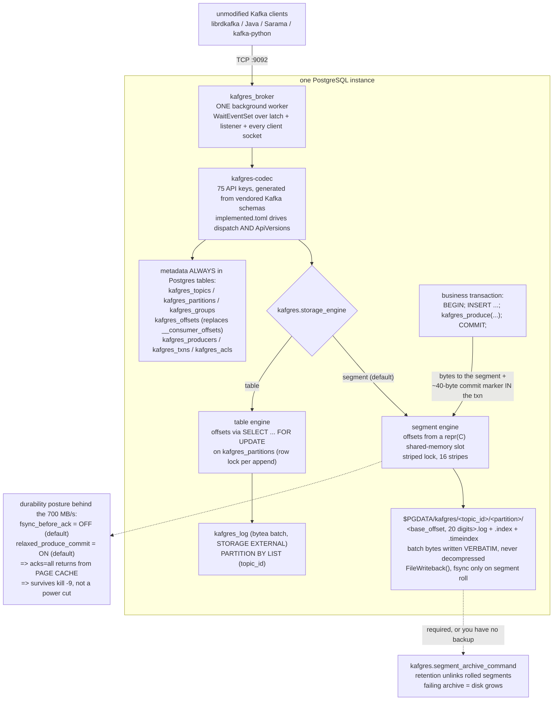

<!--
entry-meta
date: 2026-09-27
type: daily-diff
category: Daily Diff
title: Daily Diff — 2026-09-27
slug: sqlite-delete-underflow-rebalance
-->

# Daily Diff — No Edition Today; Covering the New 2026-09-25 Edition

**2026-09-27 · Daily Diff Digest**

## Status: there is no 2026-09-27 edition, but the feed has moved

Checked this run:

| URL | result |
|---|---|
| [tdd.cat](https://tdd.cat/) | serves **Friday, September 25, 2026**, 92 stories |
| [tdd.cat/archive](https://tdd.cat/archive) | still lists **Tue, Sep 22, 2026** as newest, 60 editions total |

Two things follow. **There is no edition dated 2026-09-27** — today is a Sunday and the site's own note says editions carry "a 2-day settling window so the highest-signal discussions and insights surface," so nothing is expected yet. No items below are invented.

But the feed is **no longer stuck**. The last four digests in this log reported the newest edition as 2026-09-22; the homepage now serves 2026-09-25. The archive page disagreeing with the homepage is worth flagging as an observation rather than a conclusion — either the archive is cached or it is generated on a different schedule. The homepage is the one serving actual content, so this digest uses it.

**The 2026-09-25 edition has not been covered in this log before**, so this is a real digest rather than a placeholder.

---

## The 2026-09-25 edition, point-wise

92 stories. The recognisable clusters:

**Databases and storage** — the part this log cares about

- **Kafgres** appears twice: a Kafka broker embedded in PostgreSQL, and a follow-up claiming ~700 MB/s. Deep dive below.
- **Amazon S3's disk-based design creates architectural limitations** — argues S3's "tens of milliseconds latency" forces complex caching layers onto everything built on it.
- **VGI enables DuckDB functions to reuse cached data with HTTP rules** — HTTP-style caching semantics pushed into DuckDB table functions.
- **RapidsMPF** — out-of-core shuffling at a claimed 1.8 TiB/s without OOM.
- **Achieving one-copy data transfer from S3 to GPU** — 13 Gbit/s S3→GPU pipeline.

**Testing and correctness** — an unusually strong showing

- **Finding bugs you did not think to test for** (Firezone) — sans-IO design plus deterministic simulation plus fuzzing.
- **Generative testing reveals tricky bugs that evade unit tests** (matklad) — custom fuzzers, treating fuzzer failures as fuzzer bugs.
- **Mutation testing validates distributed system safety tests** (Antithesis) — agents infer properties, then validate the tests by injecting bugs.
- **speccheck** and **VeriTile** (Lean 4 proofs for Triton kernels) round this out.

**Systems and language runtimes**

- **Go 1.27 introduces platform-independent SIMD APIs**; a companion survey on **the state of SIMD in Rust**.
- **Omnibin** — a FUSE filesystem making every Nixpkgs binary available without installing anything.
- **Systemd NvPCRs** — extending TPM capabilities via non-volatile memory.
- **git-bug** — distributed bug tracking riding Git's own replication.

**Security**

- **A signature validation flaw** reportedly exposing on the order of 17 trillion Microsoft records via authentication bypass.
- **AI agents decompiling Call of Duty: Modern Warfare 2** — 7,000 commits, 34% of functions.

**Agents and inference infrastructure** dominate by count — roughly half the edition — covering KV-cache economics, agent identity and isolation, runtime monitor evasion rates, and serving-cost analyses. Notable mainly as a measure of where the discussion volume currently sits.

---

## Deep Dive: Kafgres — a Kafka broker inside Postgres, and what "700 MB/s" actually measured

**Items:** *Kafgres embeds Kafka into Postgres to retain ecosystem benefits* and *Kafgres achieves 700 MB/s Kafka throughput on Postgres* — [rynr.dev/blog/kafgres/](https://rynr.dev/blog/kafgres/) and [rynr.dev/blog/700mbskafgres/](https://rynr.dev/blog/700mbskafgres/).

Both posts were fetched this run. The source repository is [github.com/RayElg/kafgres](https://github.com/RayElg/kafgres) — Rust, Elastic License 2.0, created 2026-09-04. All file and line references below are at commit `0016853` (tag `0.2.0`), read through a code index.

One fidelity caveat up front: the blog posts were read through a fetch-and-extract layer, not as raw HTML, so blog wording below is reported as substance rather than as character-exact quotation. Repository content is exact.

### It is a real broker, not a proxy

There is no JVM, no Kafka process, nothing forwarded upstream. The layering:

- **Wire protocol** — a standalone Rust crate, `kafgres-codec`, with no Postgres dependency. Kafka's own message-definition JSON schemas are vendored at a pinned tag (`codec/schemas/`, `codec/KAFKA_VERSION`) and a generator emits the encoders/decoders. `codec/implemented.toml` declares which API keys are served, and **the same declaration generates both the dispatch table and the ApiVersions response** — so what the broker advertises cannot drift from what it implements. Per `docs/conformance.md`, it serves all 75 API keys the reference broker serves, omitting only the two telemetry keys stock Kafka 4.x also doesn't offer without a metrics reporter.
- **Process model** — port 9092 is served by **a single Postgres background worker**, `kafgres_broker`, not a pool. Companions: `kafgres_cdc`, `kafgres_archiver`, `kafgres_follower`. All register with `RecoveryFinished`, so they run on the primary only.
- **Cluster model** — clients see exactly one node. Every partition reports `leader=node, replicas=[node], isr=[node]`. No controller, no quorum, no reassignment. `min.insync.replicas` is 1, and **`acks=all` behaves as `acks=1`** from the client's side. The docs state this plainly rather than burying it.

### Two storage engines, and the interesting one isn't tables

The `table` engine keeps the log in Postgres rows (`extension/src/init020.rs:11-27`):

```sql
CREATE TABLE IF NOT EXISTS kafgres_log (
    topic_id oid NOT NULL, partition int NOT NULL,
    base_offset bigint NOT NULL, last_offset bigint NOT NULL,
    batch bytea NOT NULL, append_ts bigint NOT NULL, ...
    PRIMARY KEY (topic_id, partition, base_offset)
) PARTITION BY LIST (topic_id)
```

with `ALTER TABLE ... ALTER COLUMN batch SET STORAGE EXTERNAL` (`init020.rs:33`), because producer batches arrive already compressed and there is no point letting TOAST retry pglz on them. Offsets come from `SELECT next_offset FROM kafgres_partitions ... FOR UPDATE` (`storage/table.rs:290-300`), so producers serialise on a row lock. `docs/architecture.md` is candid about the cost: a 1 MB batch is "roughly 525 TOAST chunks with their index entries, WAL for all of it, a dead tuple per batch for autovacuum to clean, and a row lock held per append."

The **`segment` engine is the default** and is what the throughput number is about. It abandons tables for the log entirely:

- Log files live under `$PGDATA/kafgres` as `<topic_id>/<partition>/<base_offset padded to 20 digits>.log` plus `.index`/`.timeindex` siblings — **Kafka's own on-disk naming convention** (`storage/segment.rs:19-62`).
- Offsets are assigned from a `#[repr(C)]` shared-memory slot (`segment.rs:78-103`), not a table, under a striped lock (`kafgres.segment_lock_stripes`, default 16).
- The producer's batch bytes are written **verbatim** — `RawBatch` is documented at `storage/mod.rs:80` as "Opaque, byte-verbatim record batch as received from a producer: never decompressed."
- File I/O goes through Postgres's own virtual file descriptor layer and hands written ranges to `pg_sys::FileWriteback()` (`segment.rs:458-470`) to keep the dirty-page backlog down — explicitly documented as making no durability promise.

A sharp consequence: on the default engine `kafgres_partitions.next_offset` reads 0 and is meaningless, and the docs warn that queries reading it "report an empty log against a log that is not." The engine-independent accessor is `kafgres_partition_offsets('topic')`.

Metadata stays in ordinary Postgres tables on both engines — `kafgres_topics`, `kafgres_partitions`, `kafgres_groups`, `kafgres_offsets`, `kafgres_producers`, `kafgres_txns`, `kafgres_acls`. **`kafgres_offsets` replaces `__consumer_offsets`, and no synthetic `__consumer_offsets` topic is exposed** — a deliberate choice, documented, because a fake empty topic would make lag tools conclude that groups had committed nothing.

### The actual point: `kafgres_produce()`

The throughput is not the interesting claim. This is: `kafgres_produce()` appends to the segment file and writes a ~40-byte commit marker **inside the caller's transaction**. Records become visible when that transaction commits; on rollback the bytes are orphaned in the segment and `read_committed` consumers skip them through the aborted-transaction path. That deletes the outbox table, Debezium, and the Connect cluster from the architecture, and closes the dual-write window — while unmodified Kafka clients keep working. It is segment-engine only; the table engine returns `NotImplemented`.

### What the 700 MB/s actually measured

The post's only results table:

| change | 1 KiB | 256 KiB |
|---|---:|---:|
| `main`, before any of it | 118.8 | 113.3 |
| + cached SPI plans | 139.9 | 135.6 |
| + relaxed commit (and other tweaks) | 169.7 | 197.3 |
| + socket readiness | **597.3** | **703.4** |

**The headline pairs two different runs.** 703.4 MB/s is the 256 KiB column; ~600k events/s is the 1 KiB column (597.3 MB/s ÷ 1 KiB). At 256 KiB, 703.4 MB/s is roughly 2,750 events/sec. The two numbers in "~700 MB/s, and 600k evt/s" are not the same configuration. The repo's own 0.2.0 commit message corroborates the arithmetic: "segment engine 174k -> 575k rec/s (avg latency 180 ms -> 0.7 ms)".

**It is a page-cache number.** Two defaults, both verifiable in source:

- `kafgres.fsync_before_ack` defaults to **off** (`extension/src/lib.rs:79`). Its own help text says that without it the log is fsynced only when a segment rolls, so `acks=all` returns "while the records are still in the page cache: they survive kill -9 but not a power cut."
- `kafgres.relaxed_produce_commit` defaults to **on** (`lib.rs:77`). Its help text says the cost is that after an OS or power failure the idempotent-producer window may be missing its newest entries, so a retried batch "can land twice — at-least-once instead of exactly-once across an unclean shutdown."

The author documents all of this in the GUC help text and in `tests/integration/test_crash_recovery.py:13-16`, which states the boundary honestly: `acks=1` here means "in the page cache", not "fsynced", "exactly as it does in Kafka with its default flush settings." That comparison is fair. The gap is that the durability posture doesn't appear next to the headline number in the post.

**What was not stated** across three extraction passes: acks setting, producer/connection/partition counts, `linger.ms`/`batch.size`/compression, run duration, warm-up, variance, or whether consumers ran concurrently. Everything indicates a **produce-only** measurement — Fetch throughput is never measured, and there is a literal `TODO: cache the per-Fetch read_dir` at `segment.rs:1285`. **There is no benchmark harness in the repository**, and `docs/conformance.md` states that throughput and latency are "not part of this suite." The result is not independently reproducible from public code.

**The MSK comparison ($7,357/mo for 3× `kafka.m5.8xlarge` vs ~$180/mo) is one unreplicated node against a three-node replicated cluster.** The author concedes the replication gap, but the cost framing lands first.

### The finding that generalises

Most of the ~5.9× was not storage. Cached SPI plans (`extension/src/plan.rs`, using `SPI_keepplan`) came from profiling that showed ~40.7% of time in parse/analyze/plan. But the single biggest change — roughly 3.5× of the total — was replacing a 5 ms tick-driven poll loop with a Postgres `WaitEventSet` over the latch, postmaster death, the listener and every client socket (`extension/src/server/readiness.rs`). The ceiling was the event loop, not Postgres and not the disk.

And the disclosure attached to it is the best thing in either post: the benchmark harness had been **hiding** the bottleneck. From the 0.2.0 commit message — "strace on the worker under a direct producer showed 69% of wall time in `epoll_wait`. docker-proxy hid it — its goroutines re-drive both sockets during the sleep — which is why the harness numbers, taken through a published port, never showed it and a direct connection ran at a third of them."



### What it changes

- **"Postgres as a Kafka log is too slow to be serious" is no longer the easy objection.** On one Hetzner auction box the default engine is fast enough that the remaining argument is about replication and operations, not storage throughput.
- **The transactional produce is the feature.** Removing the outbox/Debezium/Connect triad and the dual-write window is worth more to most teams than the throughput headline, and it is the thing plain Kafka cannot do.
- **Read the two posts in order and note the first is superseded.** The earlier post quotes 30k–70k msg/s on 2017-era hardware and explicitly positions kafgres as *not* for "systems requiring 100k+ msg/s." Three weeks and one release later the claim is 600k. That is a real 0.1.0→0.2.0 improvement plus much better hardware — but don't cite the first post's framing as current.
- **The conformance discipline is the credible part.** Four client libraries driven against both kafgres and `apache/kafka:4.3.1` in CI on every commit, with every intended deviation catalogued and a stated policy that a reference-diff failure gets a documented entry rather than a normalizer in the test. That is stronger than most projects making this class of claim.
- **Adopt only with the flagged gaps in hand**, all of which the author documents himself: single node, no partition reassignment, HA is Postgres HA with client redirection left to VIP/HAProxy/Patroni; `segment_archive_command` is mandatory or there is no backup; a `log_directory` outside `$PGDATA` is not carried by `pg_basebackup`; quotas report `throttle_time_ms` but do not actually mute; Kafka Connect, Streams and Schema Registry are out of scope by design.

### One connection to today's lesson

Today's lesson measured what a B-tree costs when it is used as a log — SQLite's delete path reclaims nothing until a page crosses two-thirds free, so a queue-shaped table accumulates half-empty pages indefinitely. Kafgres's default engine is the other answer to the same problem: **stop using the database's page structures for the log at all.** The table engine — log in rows, `bytea` batches, TOAST chunks, a dead tuple per append for autovacuum — is the version that pays the storage-engine bill, and it is precisely the one the author measured as slower and made non-default. The metadata, which is small, mutable and wants transactions and indexes, stays in tables. That split is the whole design.

## Sources

- [The Daily Diff](https://tdd.cat/) — serving the Friday, September 25, 2026 edition (92 stories) as of this run; all item titles and one-line summaries above come from it.
- [The Daily Diff — archive](https://tdd.cat/archive) — still listing Tue, Sep 22, 2026 as newest (60 editions) as of this run, and the source of the quoted 2-day settling-window note. No edition dated 2026-09-26 or 2026-09-27 exists.
- [rynr.dev — Kafgres embeds Kafka into Postgres](https://rynr.dev/blog/kafgres/) — fetched this run. The original introduction, the 30k–70k msg/s figures on 2017-era i7 hardware, and the "not for systems requiring 100k+ msg/s" positioning.
- [rynr.dev — 700 MB/s of Kafka throughput, on Postgres](https://rynr.dev/blog/700mbskafgres/) — fetched this run. The four-row optimization table, the i9 / PLP-NVMe / Hetzner-auction hardware description, the drive's ~1911 MB/s and ~68K/s fsync figures and the sub-600 fsyncs/s observation, the docker-proxy methodology disclosure, and the MSK cost comparison. Read through a fetch-and-extract layer, so reported as substance rather than character-exact quotation.
- [github.com/RayElg/kafgres](https://github.com/RayElg/kafgres) — source read this run at commit `0016853` (tag `0.2.0`) through a code index and the GitHub API, cited by path and line range: `README.md`, `docs/architecture.md`, `docs/configuration.md`, `docs/conformance.md` (all read in full); `extension/src/lib.rs` 71–87 and 434–453 (the `fsync_before_ack` and `relaxed_produce_commit` GUC defaults and their help text); `extension/src/plan.rs` 1–13 (`SPI_keepplan`); `extension/src/storage/mod.rs` 1–120 and 207–309 (the `RawBatch` "byte-verbatim" doc comment, `check_engine_data()`, the table engine's `NotImplemented("transactional produce")`); `extension/src/storage/segment.rs` 19–62, 78–103, 448–470, 1069–1089, 1236–1255, 1285 (layout, the shared-memory `Slot`, `FileWriteback`, the verbatim append path, the `read_dir` TODO); `extension/src/storage/table.rs` 280–300 (`FOR UPDATE` offset assignment); `extension/src/server/readiness.rs` (the `WaitEventSet` change); `extension/src/init020.rs` 1–48 and `init050.rs` (the `kafgres_log` schema and `STORAGE EXTERNAL`); `tests/integration/test_crash_recovery.py` 13–16 (the explicit non-assertion about unacked records); and the 0.2.0 commit message on `0016853` (the 174k→575k rec/s figures and the `epoll_wait`/docker-proxy analysis). No benchmark harness or load generator exists in the repository.
