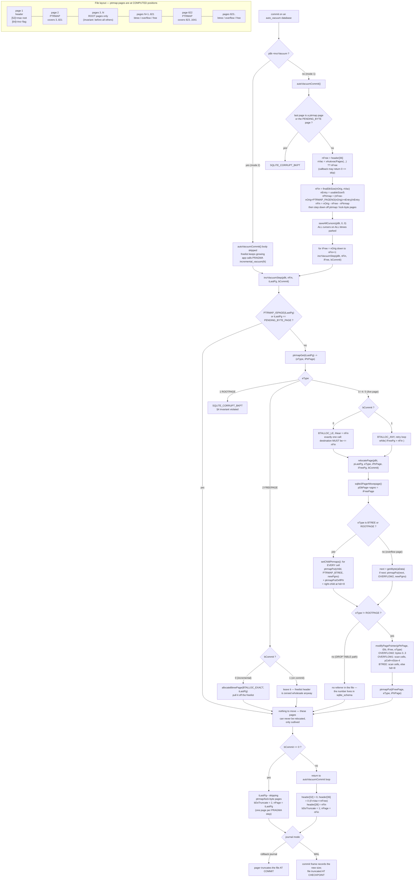

<!--
entry-meta
date: 2026-09-28
type: lesson
track: SQLite
lesson: 13
category: Database Internals
title: Auto-Vacuum — Pointer-Map Pages, relocatePage(), and the Arithmetic of finalDbSize()
slug: sqlite-autovacuum-ptrmap-page-relocation
-->

# Auto-Vacuum — Pointer-Map Pages, `relocatePage()`, and the Arithmetic of `finalDbSize()`

**2026-09-28 · SQLite Track · Lesson 13 of 33**

## Where This Fits

- **Previous lesson:** [Lesson 12](../2026-09-27-sqlite-delete-underflow-rebalance/README.md) took the delete path apart and ended on one stubborn measurement: every scenario — 50% deleted, 90% deleted, `DELETE FROM t` — left the file at exactly 5,558,272 bytes. `freePage2()` puts pages on the freelist and `sqlite3PagerDontWrite()` makes that nearly free, but nothing in the b-tree layer can hand a page back to the filesystem.
- **This lesson:** the mechanism that can. Auto-vacuum truncates the file at commit, and to do that it must *move* live pages down into the holes. Moving a page means finding whoever points at it — and a b-tree only has parent→child pointers. The pointer map is the child→parent index that makes the move possible, and it is the reason auto-vacuum is a file-format decision rather than a runtime option.
- **What it sharpens:** auto-vacuum sits strictly **downstream** of Lesson 12's 2/3 rule. It truncates the freelist; it does not create freelist entries. Lesson 12's worst case — an evenly spread 50% delete that reclaimed 1 page out of 1,352 — is measured below with `auto_vacuum=full` on, and the file does not shrink by a single byte. The 2/3 rule still decides everything; auto-vacuum only decides what happens to pages that already crossed it.
- **Next:** Lesson 14 opens Part II with the page cache (`pcache.c`, `pcache1.c`). `sqlite3PagerMovepage()`, which does the actual work of relocation in §7 below, is a pager-layer call this lesson uses as a black box; Lesson 14 and 15 open it.

Source references are to `sqlite/sqlite` at commit **`2acb2ea`** (`src/btree.c`, `src/btreeInt.h`, `src/os.h`), read through a code index this run and cited by path and line range. Measurements are against SQLite **3.53.4** via `apsw` 3.53.4.0, `page_size = 4096`, `reserved_bytes = 0` (so `usableSize = 4096`), rows of a 100-byte blob unless stated — the same tooling as Lessons 08–12. Journal mode is `delete` where file sizes are quoted and `wal` where page writes are counted.

---

## 1. Why a Reverse Index Has to Exist

Truncating the file means the live pages must occupy the *first* N page slots. Pages above N have to move down. And moving page 600 to page 300 is not a memcpy: whoever holds the number 600 has to be rewritten to hold 300.

Everything established in Lessons 03–11 points the wrong way:

| Pointer | Lives in | Points |
|---|---|---|
| Interior cell's 4-byte child pointer | interior b-tree page | parent → child |
| Right-most child pointer (`hdr+8`) | interior b-tree page | parent → child |
| Overflow pointer (last 4 bytes of a cell) | b-tree page | cell → first overflow page |
| Overflow chain `next` (first 4 bytes) | overflow page | page → next page |
| `sqlite_schema.rootpage` | page 1's b-tree | schema → root |

Given a page number, there is no way to find its referrer except to scan every page in the file. For a 10,000-page database that is a 10,000-page scan per relocation, and a truncation moves thousands of pages. It is quadratic and it is not an option.

So SQLite keeps an explicit reverse index. `btreeInt.h` 634–646:

> The pointer map is a lookup table that identifies the parent page for each child page in the database file. The parent page is the page that contains a pointer to the child. Every page in the database contains 0 or 1 parent pages. […] The purpose of the pointer map is to facility moving pages from one position in the file to another as part of autovacuum. When a page is moved, the pointer in its parent must be updated to point to the new location. The pointer map is used to locate the parent page quickly.

That index is not a separate file and not a b-tree. It is a fixed, computable set of pages interleaved into the database at regular intervals — which is exactly why the mode cannot be turned on later without rewriting the whole file.

---

## 2. Ptrmap Geometry: A Computed Address, Not a Lookup

There is no directory of ptrmap pages. Given a page number you *compute* which ptrmap page holds its entry, in constant time (`btree.c` 1063–1075):

```c
static Pgno ptrmapPageno(BtShared *pBt, Pgno pgno){
  int nPagesPerMapPage;
  Pgno iPtrMap, ret;
  assert( sqlite3_mutex_held(pBt->mutex) );
  if( pgno<2 ) return 0;
  nPagesPerMapPage = (pBt->usableSize/5)+1;
  iPtrMap = (pgno-2)/nPagesPerMapPage;
  ret = (iPtrMap*nPagesPerMapPage) + 2;
  if( ret==PENDING_BYTE_PAGE(pBt) ){
    ret++;
  }
  return ret;
}
```

Three macros sit on top of it (`btreeInt.h` 629–631):

```c
#define PTRMAP_PAGENO(pBt, pgno) ptrmapPageno(pBt, pgno)
#define PTRMAP_PTROFFSET(pgptrmap, pgno) (5*(pgno-pgptrmap-1))
#define PTRMAP_ISPAGE(pBt, pgno) (PTRMAP_PAGENO((pBt),(pgno))==(pgno))
```

`PTRMAP_ISPAGE` is the trick worth noticing: `ptrmapPageno()` of a ptrmap page returns that page itself, so "is this a ptrmap page" is the same computation as "which ptrmap page covers this one". No table, no flag byte, no header field — a ptrmap page is identified purely by its page number satisfying a fixpoint.

Measured geometry at `usableSize = 4096`:

```
J = usableSize/5      = 819 entries per ptrmap page
stride = J+1          = 820
first 5 ptrmap pages  = [2, 822, 1642, 2462, 3282]
page 2 covers         = pages 3 .. 821      (offset 5*(pgno-3) <= usableSize-5)

  ptrmapPageno(    3) =     2   is_ptrmap=False
  ptrmapPageno(  821) =     2   is_ptrmap=False
  ptrmapPageno(  822) =   822   is_ptrmap=True
  ptrmapPageno(  823) =   822   is_ptrmap=False
  ptrmapPageno( 1641) =   822   is_ptrmap=False
  ptrmapPageno( 1642) =  1642   is_ptrmap=True
```

And confirmed against a real 2,716-page database built with `auto_vacuum=full`:

```
baseline page_count=2716  ptrmap pages present = [2, 822, 1642, 2462]
```

The [file format spec](https://www.sqlite.org/fileformat2.html) states the same layout from the outside: "In a database with ptrmap pages, the first ptrmap page is page 2", the first covers "pages 3 through J+2, inclusive", the second is page `J+3`, and so on.

**Space overhead is 1 page in 820, or 0.122%.** That is not the cost of auto-vacuum. §11 finds the real cost somewhere else entirely.

### 2.1 The lock-byte exception, and the one page size where it fires

`PENDING_BYTE` is "the first byte past the 1GB boundary" (`os.h` 152–163), i.e. `0x40000000`, and `PENDING_BYTE_PAGE(pBt) = (PENDING_BYTE/pageSize)+1` (`btreeInt.h` 612). That page is never used for data. The spec's exception:

> Except, if the byte-lock page happens to fall on the same page number as a ptrmap page, then the ptrmap is moved to the following page for that one case.

which is the `if( ret==PENDING_BYTE_PAGE(pBt) ) ret++;` at line 1071. Sweeping every legal page size shows it is not a hypothetical — it fires for exactly one of them:

| page_size | PENDING_BYTE_PAGE | raw ptrmap slot | collision |
|---:|---:|---:|:---:|
| 512 | 2,097,153 | 2,097,082 | no |
| **1024** | **1,048,577** | **1,048,577** | **yes** |
| 2048 | 524,289 | 523,982 | no |
| 4096 | 262,145 | 261,582 | no |
| 8192 | 131,073 | 129,483 | no |
| 16384 | 65,537 | 62,265 | no |
| 32768 | 32,769 | 26,218 | no |
| 65536 | 16,385 | 13,110 | no |

`page_size=1024` — the historical default, and the one the `btreeInt.h` comment at 617 uses as its example ("often 1024") — lands the 1,048,577th page exactly on a ptrmap stride boundary, so in a 1 GB `page_size=1024` auto-vacuum database the ptrmap page moves to 1,048,578. One `ret++` protects a case that only exists for one page size past one gigabyte. That is the shape of a lot of code in `btree.c`.

### 2.2 The two header fields

From the spec, and both verified by reading the raw file:

- **offset 52** — "The page number of the largest root b-tree page when in auto-vacuum or incremental-vacuum modes, or zero otherwise." Non-zero at 52 *is* the statement that ptrmap pages exist.
- **offset 64** — "True (non-zero) for incremental-vacuum mode. False (zero) otherwise." Meaningful only when 52 is non-zero.

```
header[52] largest root b-tree page = 5
header[64] incremental-vacuum flag  = 0
sqlite_schema rootpages: {'t': 3, 'u': 4, 'ti': 5}
```

Offset 52 is not just a flag — it is the high-water mark of the root pages, which §4 shows is load-bearing.

---

## 3. The Five Entry Types, Decoded From a Real File

Each entry is 5 bytes: a 1-byte type and a 4-byte big-endian page number, whose meaning depends on the type (`btreeInt.h` 647–668):

| Code | Name | Page number field |
|---:|---|---|
| 1 | `PTRMAP_ROOTPAGE` | unused (zero) |
| 2 | `PTRMAP_FREEPAGE` | unused (zero) |
| 3 | `PTRMAP_OVERFLOW1` | the b-tree page holding the cell that overflowed |
| 4 | `PTRMAP_OVERFLOW2` | the **previous** page in the overflow chain |
| 5 | `PTRMAP_BTREE` | the parent b-tree page |

Built with two tables, one index, a 30,000-byte blob and 400 ordinary rows, then decoded straight out of the file at `(ptrmap-1)*4096 + 5*(pgno-ptrmap-1)`:

```
 pgno  type            parent
     2  <ptrmap page itself, has no entry>
     3  1 ROOTPAGE        0        <- table t
     4  1 ROOTPAGE        0        <- table u
     5  1 ROOTPAGE        0        <- index ti
     6  3 OVERFLOW1      31
     7  4 OVERFLOW2       6
     8  4 OVERFLOW2       7
     9  4 OVERFLOW2       8
    10  4 OVERFLOW2       9
    ...
    14  3 OVERFLOW1      21
    15  4 OVERFLOW2      14
    42  5 BTREE           3
    43  5 BTREE           3
```

Two things fall out of that dump that no prose explanation makes as clear:

**`OVERFLOW2` entries are a linked list written backwards.** Page 7's entry says "6", page 8's says "7". Lesson 05's chain is `6 → 7 → 8 → …` in the pages themselves; the ptrmap stores `6 ← 7 ← 8 ← …`. Relocating page 8 means rewriting the forward pointer in page 7, and the ptrmap is how you know it is page 7 you need.

**There are two chain heads, not one.** `OVERFLOW1` appears at pages 6 and 14:

```
OVERFLOW1 pages (chain heads): [6, 14]
  -> parent (btree page holding the cell): [31, 21]
first 6 OVERFLOW2 pages and their 'previous page in chain': [(7,6),(8,7),(9,8),(10,9),(11,10),(12,11)]
```

One chain belongs to the table cell holding the 30,000-byte blob; the other belongs to the *index* entry on that blob — Lesson 09's index key record contains the whole indexed value, so an index on a large column overflows too. Also note that page 6's parent is page **31**: the chain head is allocated long before the b-tree page that will end up holding its cell, because `balance()` (Lesson 11) moved the cell after the overflow pages already existed. The ptrmap tracks the current truth, not allocation order.

---

## 4. The Invariant That Makes Root Pages Immovable

The spec states a constraint that has nothing to do with the pointer map's format and everything to do with making relocation tractable:

> In any database file that contains ptrmap pages, all b-tree root pages must come before any non-root b-tree page, cell payload overflow page, or freelist page. This restriction ensures that a root page will never be moved during an auto-vacuum or incremental-vacuum.

The reason it must hold: a root page's number is stored in `sqlite_schema.rootpage`, which Lesson 07 established is read at schema load and cached in the `Table` objects of every connection. Moving a root means a schema change and a cookie bump for every connection. Auto-vacuum must never need to do that, so roots are herded to the front of the file and the vacuum never reaches them.

`incrVacuumStep()` enforces it as a hard corruption check rather than a special case (`btree.c` 4088–4090):

```c
if( eType==PTRMAP_ROOTPAGE ){
  return SQLITE_CORRUPT_BKPT;
}
```

Verified on the same database:

```
ptrmap ROOTPAGE entries: [3, 4, 5]
max root page = 5   min non-root/overflow/free page = 6   invariant holds = True
```

### 4.1 Maintaining it costs a relocation on every `CREATE TABLE`

The invariant is not free. A new root must go at `header[52] + 1`, and in a database with any data that slot is already occupied. `sqlite3BtreeCreateTable()` therefore asks for that exact page and moves whatever is there (`btree.c` 10131–10197):

```c
rc = allocateBtreePage(pBt, &pPageMove, &pgnoMove, pgnoRoot, BTALLOC_EXACT);
...
if( pgnoMove!=pgnoRoot ){
  ...
  rc = ptrmapGet(pBt, pgnoRoot, &eType, &iPtrPage);
  if( eType==PTRMAP_ROOTPAGE || eType==PTRMAP_FREEPAGE ){
    rc = SQLITE_CORRUPT_PGNO(pgnoRoot);
  }
  ...
  rc = relocatePage(pBt, pRoot, eType, iPtrPage, pgnoMove, 0);
```

`BTALLOC_EXACT` (§7.1) says "give me page `pgnoRoot` specifically if it is on the freelist". If it is not, the page is live and must be evicted. Watch it happen, on a 58-page auto-vacuum database:

```
before CREATE TABLE: page_count=58 header[52]=3
   page 3: ROOTPAGE parent=0
   page 4: BTREE    parent=3      <- a live leaf of table t
   page 5: BTREE    parent=3
   page 6: BTREE    parent=3

after  CREATE TABLE u: page_count=59 header[52]=4  new rootpage=4
   page 3: ROOTPAGE parent=0
   page 4: ROOTPAGE parent=0      <- now u's root
   page 5: BTREE    parent=3
   page 6: BTREE    parent=3
   ptrmap entries that changed: [4]
   entries that are new (pages appended): [59]
```

Page 4 was a leaf of `t`; it is now `u`'s root; the file grew by one page and the evicted leaf is at 59. `header[52]` went 3 → 4. So in auto-vacuum mode **`CREATE TABLE` and `CREATE INDEX` are page-relocating operations**, and `DROP TABLE` is too — `btree.c` 10418–10424 relocates the largest root down into the gap so that `header[52]` can be decremented:

```c
rc = relocatePage(pBt, pMove, PTRMAP_ROOTPAGE, 0, iTable, 0);
```

This is the one caller that passes `PTRMAP_ROOTPAGE` to `relocatePage()` deliberately, and §7 shows the branch that exists for it.

---

## 5. `ptrmapPut()` and `ptrmapGet()`

`ptrmapPut()` (`btree.c` 1087–1137) is 50 lines, and three of its details matter.

**It refuses to write a page that is already a b-tree page** (1111–1117):

```c
if( ((char*)sqlite3PagerGetExtra(pDbPage))[0]!=0 ){
  /* The first byte of the extra data is the MemPage.isInit byte.
  ** If that byte is set, it means this page is also being used
  ** as a btree page. */
  *pRC = SQLITE_CORRUPT_BKPT;
  goto ptrmap_exit;
}
```

A corrupt `header[52]`, or a page size that disagrees with the file, can make `ptrmapPageno()` compute a page that is actually a b-tree page. Writing 5 bytes of type-and-parent into a live b-tree page would destroy it silently. The `isInit` byte in the pager's per-page extra data is checked first — an aliasing test, not a value test.

**It skips the write when nothing changed** (1126–1133):

```c
if( eType!=pPtrmap[offset] || get4byte(&pPtrmap[offset+1])!=parent ){
  TRACE(("PTRMAP_UPDATE: %u->(%u,%u)\n", key, eType, parent));
  *pRC= rc = sqlite3PagerWrite(pDbPage);
  if( rc==SQLITE_OK ){
    pPtrmap[offset] = eType;
    put4byte(&pPtrmap[offset+1], parent);
  }
}
```

`sqlite3PagerWrite()` is what dirties a page and journals it. Guarding it with a comparison matters because `setChildPtrmaps()` (§6) calls `ptrmapPut` for *every child and every overflow pointer* on a relocated page, and most of those entries are already correct. This is why the insert-side overhead measured in §11 is one page write per commit rather than one per allocation.

**`ptrmapGet()` validates the type on the way out** (`btree.c` 1173):

```c
if( *pEType<1 || *pEType>5 ) return SQLITE_CORRUPT_PGNO(iPtrmap);
```

A zero byte — an all-zero page that should have been a ptrmap page — is corruption, not "no entry". There is no representation for "this page has no parent" other than the page not being covered by the map at all.

And when auto-vacuum is compiled out, all three collapse to nothing (`btree.c` 1177–1181):

```c
#else /* if defined SQLITE_OMIT_AUTOVACUUM */
  #define ptrmapPut(w,x,y,z,rc)
  #define ptrmapGet(w,x,y,z) SQLITE_OK
  #define ptrmapPutOvflPtr(x, y, z, rc)
#endif
```

`ptrmapPut(...)` expanding to nothing is why the calls are sprinkled through `btree.c` with an `int*` error argument instead of a return value — the call sites have to survive textual deletion.

---

## 6. Fixing Pointers in Both Directions

Relocating page X requires three separate repairs, and each has its own function.

**Downward, from X to its children** — `setChildPtrmaps()` (`btree.c` 3865–3894). X's own page number changed, so every entry that names X as *parent* is now wrong:

```c
for(i=0; i<nCell; i++){
  u8 *pCell = findCell(pPage, i);
  ptrmapPutOvflPtr(pPage, pPage, pCell, &rc);
  if( !pPage->leaf ){
    Pgno childPgno = get4byte(pCell);
    ptrmapPut(pBt, childPgno, PTRMAP_BTREE, pgno, &rc);
  }
}
if( !pPage->leaf ){
  Pgno childPgno = get4byte(&pPage->aData[pPage->hdrOffset+8]);
  ptrmapPut(pBt, childPgno, PTRMAP_BTREE, pgno, &rc);
}
```

Note that this is **O(cells on the page)** ptrmap writes, and the right-most child pointer at `hdr+8` is handled separately because it is not in any cell — the same asymmetry Lessons 03 and 11 kept running into.

**Upward, in the referrer's actual bytes** — `modifyPagePointer()` (`btree.c` 3910–3962). The ptrmap told us *which* page points at X; this rewrites the pointer itself, and the code for each type is exactly the inverse of the table in §1:

```c
if( eType==PTRMAP_OVERFLOW2 ){
  /* The pointer is always the first 4 bytes of the page in this case.  */
  if( get4byte(pPage->aData)!=iFrom ){
    return SQLITE_CORRUPT_PAGE(pPage);
  }
  put4byte(pPage->aData, iTo);
}else{
  ...
  for(i=0; i<nCell; i++){
    u8 *pCell = findCell(pPage, i);
    if( eType==PTRMAP_OVERFLOW1 ){
      CellInfo info;
      pPage->xParseCell(pPage, pCell, &info);
      if( info.nLocal<info.nPayload ){
        ...
        if( iFrom==get4byte(pCell+info.nSize-4) ){
          put4byte(pCell+info.nSize-4, iTo);
          break;
        }
      }
    }else{
      ...
      if( get4byte(pCell)==iFrom ){
        put4byte(pCell, iTo);
        break;
      }
    }
  }
  if( i==nCell ){
    if( eType!=PTRMAP_BTREE ||
        get4byte(&pPage->aData[pPage->hdrOffset+8])!=iFrom ){
      return SQLITE_CORRUPT_PAGE(pPage);
    }
    put4byte(&pPage->aData[pPage->hdrOffset+8], iTo);
  }
}
```

`OVERFLOW2` is the cheap case — offset 0, one comparison. `OVERFLOW1` is the expensive one: it must `xParseCell` every cell on the page to find the one whose `nSize-4` offset holds `iFrom`, because Lesson 05 put the overflow pointer at the *end* of the cell, at a position that depends on the cell's payload length. There is no index into it. And falling off the end of the loop is not an error by itself — for `PTRMAP_BTREE` it means the pointer is the right-most child at `hdr+8`.

**Sideways, the map entry for the new location** — done by the caller, next.

---

## 7. `relocatePage()`

`btree.c` 3974–4046 assembles the three repairs, and the structure is worth reading as a whole because the ordering is not arbitrary:

```c
static int relocatePage(
  BtShared *pBt,           /* Btree */
  MemPage *pDbPage,        /* Open page to move */
  u8 eType,                /* Pointer map 'type' entry for pDbPage */
  Pgno iPtrPage,           /* Pointer map 'page-no' entry for pDbPage */
  Pgno iFreePage,          /* The location to move pDbPage to */
  int isCommit             /* isCommit flag passed to sqlite3PagerMovepage */
){
  ...
  if( iDbPage<3 ) return SQLITE_CORRUPT_BKPT;

  rc = sqlite3PagerMovepage(pPager, pDbPage->pDbPage, iFreePage, isCommit);
  if( rc!=SQLITE_OK ) return rc;
  pDbPage->pgno = iFreePage;

  if( eType==PTRMAP_BTREE || eType==PTRMAP_ROOTPAGE ){
    rc = setChildPtrmaps(pDbPage);
    if( rc!=SQLITE_OK ) return rc;
  }else{
    Pgno nextOvfl = get4byte(pDbPage->aData);
    if( nextOvfl!=0 ){
      ptrmapPut(pBt, nextOvfl, PTRMAP_OVERFLOW2, iFreePage, &rc);
      if( rc!=SQLITE_OK ) return rc;
    }
  }

  if( eType!=PTRMAP_ROOTPAGE ){
    rc = btreeGetPage(pBt, iPtrPage, &pPtrPage, 0);
    ...
    rc = modifyPagePointer(pPtrPage, iDbPage, iFreePage, eType);
    releasePage(pPtrPage);
    if( rc==SQLITE_OK ){
      ptrmapPut(pBt, iFreePage, eType, iPtrPage, &rc);
    }
  }
  return rc;
}
```

Four observations:

- **`iDbPage<3` is corruption, not a no-op.** Page 1 is the header and page 2 is the first ptrmap page. Neither can ever move, so a request to move one means the caller computed a bad page number.
- **The overflow branch only fixes the *next* page's entry.** An overflow page has at most one outgoing pointer (its `next`, in bytes 0–3), and the entry that must change is the *next* page's `OVERFLOW2` parent. Compare that to the b-tree branch's full `setChildPtrmaps()` walk: an overflow page relocation is one ptrmap write, a b-tree page relocation is one per child.
- **`if( eType!=PTRMAP_ROOTPAGE )` is the `DROP TABLE` branch from §4.1.** A root page has no referrer *in the file* — its number lives in `sqlite_schema` — so there is no pointer to rewrite and no new map entry to write. `sqlite3BtreeDropTable()` updates the schema itself.
- **`isCommit` is a durability hint, not a mode flag.** The header comment (3969–3972): "The isCommit flag indicates that there is no need to remember that the journal needs to be sync()ed before database page pDbPage->pgno can be written to. The caller has already promised not to write to that page." During an on-commit vacuum the pages above `nFin` are about to be truncated away, so nobody will write them and the extra sync ordering constraint can be dropped. During an incremental vacuum the file stays live, so it cannot.

---

## 8. `incrVacuumStep()` — One Page Per Call

`incrVacuumStep(pBt, nFin, iLastPg, bCommit)` (`btree.c` 4068–4162) has one job, stated in its own comment: "this function attempts to re-organize the database so that the last page of the file currently in use is no longer in use."

It opens by skipping the pages that can never be moved (4075):

```c
if( !PTRMAP_ISPAGE(pBt, iLastPg) && iLastPg!=PENDING_BYTE_PAGE(pBt) ){
```

A ptrmap page's location is a function of its page number, so it cannot be relocated — it can only cease to exist when the file shrinks past it. Same for the lock-byte page. Both are simply stepped over.

Then three cases for what `iLastPg` actually is:

| `ptrmapGet` says | Action |
|---|---|
| `PTRMAP_ROOTPAGE` | `SQLITE_CORRUPT_BKPT` — §4's invariant was violated |
| `PTRMAP_FREEPAGE` | already dead. Pull it off the freelist with `BTALLOC_EXACT` (or, if `bCommit`, do not bother) |
| anything else | live. Find a free page below, `relocatePage()` into it |

### 8.1 `bCommit` changes the allocation strategy, not the algorithm

```c
u8 eMode = BTALLOC_ANY;
Pgno iNear = 0;
...
/* If bCommit is zero, this loop runs exactly once and page pLastPg
** is swapped with the first free page pulled off the free list.
**
** On the other hand, if bCommit is greater than zero, then keep
** looping until a free-page located within the first nFin pages
** of the file is found.
*/
if( bCommit==0 ){
  eMode = BTALLOC_LE;
  iNear = nFin;
}
do {
  MemPage *pFreePg;
  Pgno dbSize = btreePagecount(pBt);
  rc = allocateBtreePage(pBt, &pFreePg, &iFreePg, iNear, eMode);
  ...
  if( iFreePg>dbSize ){
    releasePage(pLastPg);
    return SQLITE_CORRUPT_BKPT;
  }
}while( bCommit && iFreePg>nFin );
assert( iFreePg<iLastPg );
```

- **Incremental (`bCommit==0`)**: `BTALLOC_LE` with `iNear = nFin` asks the allocator for a page *at or below* the final size. One call, one relocation, then the file shrinks by one page. It must get the destination right first time because there is no second pass.
- **On-commit (`bCommit!=0`)**: `BTALLOC_ANY` and a retry loop. Any free page will do; if the one returned is above `nFin` it is simply discarded from the freelist and the loop asks again. Cheaper per call, and the wasted allocations do not matter because the whole region above `nFin` is about to disappear.

And the tail, which only runs in incremental mode (4154–4160):

```c
if( bCommit==0 ){
  do {
    iLastPg--;
  }while( iLastPg==PENDING_BYTE_PAGE(pBt) || PTRMAP_ISPAGE(pBt, iLastPg) );
  pBt->bDoTruncate = 1;
  pBt->nPage = iLastPg;
}
```

The decrement loop skips backwards over ptrmap and lock-byte pages, which is how a ptrmap page gets reclaimed: never relocated, just stepped past once the last data page it covered is gone. `bDoTruncate` is the flag the pager reads at commit.

### 8.2 `BTALLOC_LE` inside the allocator

Lesson 06 read `allocateBtreePage()` with `nearby=0`. The vacuum path uses two modes Lesson 06 skipped (`btree.c` 59–61):

```c
#define BTALLOC_ANY   0           /* Allocate any page */
#define BTALLOC_EXACT 1           /* Allocate exact page if possible */
#define BTALLOC_LE    2           /* Allocate any page <= the parameter */
```

`BTALLOC_EXACT` checks the pointer map *before* searching, so it does not walk the freelist for a page that is not on it (`btree.c` 6583–6596):

```c
if( eMode==BTALLOC_EXACT ){
  if( nearby<=mxPage ){
    u8 eType;
    assert( nearby>0 );
    assert( pBt->autoVacuum );
    rc = ptrmapGet(pBt, nearby, &eType, 0);
    if( rc ) return rc;
    if( eType==PTRMAP_FREEPAGE ){
      searchList = 1;
    }
  }
}else if( eMode==BTALLOC_LE ){
  searchList = 1;
}
```

That is the pointer map being used as a *membership test on the freelist* — an application of the reverse index with nothing to do with relocation. `BTALLOC_LE` always searches, and the leaf-selection loop picks the first entry satisfying the bound rather than the closest (6728–6735):

```c
if( eMode==BTALLOC_LE ){
  for(i=0; i<k; i++){
    iPage = get4byte(&aData[8+i*4]);
    if( iPage<=nearby ){
      closest = i;
      break;
    }
  }
}
```

There is also a quiet cost on the *file-extension* path (`btree.c` 6806, 6813–6830). Two things change when auto-vacuum is on:

```c
int bNoContent = (0==IfNotOmitAV(pBt->bDoTruncate))? PAGER_GET_NOCONTENT:0;
...
if( pBt->autoVacuum && PTRMAP_ISPAGE(pBt, pBt->nPage) ){
  /* If *pPgno refers to a pointer-map page, allocate two new pages
  ** at the end of the file instead of one. The first allocated page
  ** becomes a new pointer-map page, the second is used by the caller.
  */
```

The first is subtle and worth the comment it carries (6790–6805): once an incremental-vacuum step has run in this transaction, a page past the end of the *image* may still hold content needed for rollback, so the no-content optimization has to be switched off for the rest of the transaction. The second is the ptrmap page being born — growth past page 821 silently allocates two pages, and the new one is `sqlite3PagerWrite`n so it is zeroed on disk rather than left as whatever the filesystem had.

---

## 9. `finalDbSize()` — Predicting the Truncation Point

Before moving anything, SQLite computes where the file will end up (`btree.c` 4169–4185):

```c
static Pgno finalDbSize(BtShared *pBt, Pgno nOrig, Pgno nFree){
  int nEntry;                     /* Number of entries on one ptrmap page */
  Pgno nPtrmap;                   /* Number of PtrMap pages to be freed */
  Pgno nFin;                      /* Return value */

  nEntry = pBt->usableSize/5;
  nPtrmap = (nFree-nOrig+PTRMAP_PAGENO(pBt, nOrig)+nEntry)/nEntry;
  nFin = nOrig - nFree - nPtrmap;
  if( nOrig>PENDING_BYTE_PAGE(pBt) && nFin<PENDING_BYTE_PAGE(pBt) ){
    nFin--;
  }
  while( PTRMAP_ISPAGE(pBt, nFin) || nFin==PENDING_BYTE_PAGE(pBt) ){
    nFin--;
  }
  return nFin;
}
```

Read the `nPtrmap` line carefully: `nFree-nOrig` is negative, and adding `PTRMAP_PAGENO(pBt,nOrig)` — the page number of the last ptrmap page in use — recovers how many ptrmap pages fall inside the region that survives. It is unsigned integer arithmetic that relies on wrapping being irrelevant because the final quotient is small. The two loops at the end then walk `nFin` down off any page that cannot be the last page of a file.

Reimplemented in Python and checked against three databases, using `auto_vacuum=incremental` so the pre-truncation `page_count` and `freelist_count` are both observable:

| rows | delete | nOrig | nFree | nPtrmap | predicted nFin | observed `page_count` | match |
|---:|---|---:|---:|---:|---:|---:|:---:|
| 24,000 | `id%3!=0` | 654 | 381 | 0 | **273** | **273** | yes |
| 100,000 | `id%3!=0` | 2716 | 1578 | 2 | **1136** | **1136** | yes |
| 100,000 | `id<=66000` | 2716 | 1787 | 2 | **927** | **927** | yes |

Exact, all three. And the middle row shows the ptrmap pages themselves being reclaimed:

```
ptrmap pages before = [2, 822, 1642, 2462]   after = [2, 822]
```

`nPtrmap = 2` predicted that 1642 and 2462 would go, and they did — not by relocation (§8's skip makes that impossible) but by the file ending below them.

---

## 10. `autoVacuumCommit()` — The Loop, and the Escape Hatch

`btree.c` 4232–4311 runs before `sqlite3PagerCommitPhaseOne` on every commit of an auto-vacuum database. The body reduces to:

```c
nOrig = btreePagecount(pBt);
if( PTRMAP_ISPAGE(pBt, nOrig) || nOrig==PENDING_BYTE_PAGE(pBt) ){
  /* It is not possible to create a database for which the final page
  ** is either a pointer-map page or the pending-byte page. */
  return SQLITE_CORRUPT_BKPT;
}
nFree = get4byte(&pBt->pPage1->aData[36]);
...
nFin = finalDbSize(pBt, nOrig, nVac);
if( nFin>nOrig ) return SQLITE_CORRUPT_BKPT;
if( nFin<nOrig ){
  rc = saveAllCursors(pBt, 0, 0);
}
for(iFree=nOrig; iFree>nFin && rc==SQLITE_OK; iFree--){
  rc = incrVacuumStep(pBt, nFin, iFree, nVac==nFree);
}
if( (rc==SQLITE_DONE || rc==SQLITE_OK) && nFree>0 ){
  rc = sqlite3PagerWrite(pBt->pPage1->pDbPage);
  if( nVac==nFree ){
    put4byte(&pBt->pPage1->aData[32], 0);
    put4byte(&pBt->pPage1->aData[36], 0);
  }
  put4byte(&pBt->pPage1->aData[28], nFin);
  pBt->bDoTruncate = 1;
  pBt->nPage = nFin;
}
if( rc!=SQLITE_OK ){
  sqlite3PagerRollback(pPager);
}
```

- **The whole thing is guarded by `if( !pBt->incrVacuum )`** (4247). `auto_vacuum=incremental` shares every mechanism above and just never calls this loop.
- **`saveAllCursors(pBt, 0, 0)`** is Lesson 10's machinery with both filter arguments zero — *every* cursor on *every* b-tree is parked, because relocation invalidates page numbers everywhere, not just in the tree being modified. Lesson 12's `bPreserve` distinction does not exist here; there is no cheap path.
- **The freelist header is zeroed wholesale** — offsets 32 (freelist head) and 36 (count) both to 0 — but only when `nVac==nFree`, i.e. only when the entire freelist is being consumed.
- **Failure rolls the whole transaction back**, not just the vacuum. A relocation that fails halfway has left pointers inconsistent, so there is nothing to salvage.

### 10.1 `sqlite3_autovacuum_pages()`

`nVac` is where the escape hatch lives (4265–4285): if a callback is registered, it decides how many pages to reclaim this commit.

```c
if( db->xAutovacPages ){
  ...
  nVac = db->xAutovacPages(
    db->pAutovacPagesArg, db->aDb[iDb].zDbSName, nOrig, nFree, pBt->pageSize
  );
  if( nVac>nFree ) nVac = nFree;
  if( nVac==0 ) return SQLITE_OK;
}else{
  nVac = nFree;
}
```

[The documented interface](https://sqlite.org/c3ref/autovacuum_pages.html) is:

```c
int sqlite3_autovacuum_pages(
  sqlite3 *db,
  unsigned int(*)(void*,const char*,unsigned int,unsigned int,unsigned int),
  void*,
  void(*)(void*)
);
```

The callback receives the schema name, the file size in pages, the free-page count and the page size, and returns how many pages to free — zero to skip this commit entirely, anything `>= nFree` to do the lot. The docs are emphatic that "The callback is not reentrant" and must do nothing but arithmetic on its arguments, on pain of "segmentation faults and database corruption". This is the knob for the §11 problem: bounding how much relocation any single commit is allowed to do, without giving up truncation entirely.

---

## 11. Measured: Does the File Actually Shrink?

24,000 rows of a 100-byte blob, `journal_mode=delete`, so the truncation is visible in the file immediately.

| mode | operation | page_count | freelist | leaves | fill % | file bytes |
|---|---|---:|---:|---:|---:|---:|
| none | baseline | 653 | 0 | 649 | 98.89 | 2,674,688 |
| none | after `DELETE … id%3!=0` | 653 | 381 | 270 | 79.27 | 2,674,688 |
| full | baseline | 654 | 0 | 649 | 98.89 | 2,678,784 |
| full | after `DELETE … id%3!=0` | **273** | **0** | 270 | 79.27 | **1,118,208** |
| incremental | baseline | 654 | 0 | 649 | 98.89 | 2,678,784 |
| incremental | after `DELETE … id%3!=0` | 654 | 381 | 270 | 79.27 | 2,678,784 |
| incremental | + `PRAGMA incremental_vacuum` | **273** | **0** | 270 | 79.27 | **1,118,208** |

Lesson 12's cliffhanger resolved: 2,674,688 → 1,118,208 bytes, a 2.39× reduction, at commit, with no `VACUUM`. `full` and `incremental` reach byte-identical end states; the only difference is *when*.

### 11.1 Auto-vacuum does not rescue Lesson 12's worst case

| mode | operation | page_count | freelist | leaves | fill % | file bytes |
|---|---|---:|---:|---:|---:|---:|
| none | after `DELETE … id%2=0` | 653 | 1 | 648 | 49.62 | 2,674,688 |
| full | after `DELETE … id%2=0` | 653 | **0** | 648 | 49.62 | **2,674,688** |

**Not one byte.** Half the rows are gone, every leaf is 49.62% full, and `auto_vacuum=full` reclaims nothing — because Lesson 12's 2/3 test never fired, so no page ever reached the freelist, so there is nothing for the vacuum to truncate. `nFree` is 0, `finalDbSize` returns `nOrig`, the loop body never executes.

This is the single most important thing to take from this lesson. **Auto-vacuum is a freelist-truncating mechanism, not a space-recovering one.** The 2/3 rule from Lesson 12 is still the gate, and it is upstream. If your deletion pattern leaves pages half full, auto-vacuum changes nothing at all, and the documentation says as much: auto-vacuum "does not compact partially filled pages of the database as VACUUM does" ([VACUUM docs](https://www.sqlite.org/lang_vacuum.html)).

### 11.2 Pages written, counted as WAL frames

Same method as Lesson 12 §10 — `journal_mode=wal`, `cache_size=-300000` so nothing spills, one frame per distinct page per commit.

| mode | operation | frames | pages freed | page_count after |
|---|---|---:|---:|---:|
| none | `DELETE … id%3!=0` | 276 | 381 | 653 |
| none | `DELETE … id%2=0` | 651 | 1 | 653 |
| none | `DELETE FROM t` | 3 | 651 | 653 |
| full | `DELETE … id%3!=0` | **273** | 0 | **273** |
| full | `DELETE … id%2=0` | 651 | 0 | 653 |
| full | `DELETE FROM t` | **3** | 0 | **3** |
| incremental | `DELETE … id%3!=0` | 277 | 381 | 654 |
| incremental | `DELETE … id%2=0` | 652 | 1 | 654 |
| incremental | `DELETE FROM t` | 4 | 651 | 654 |

Two results here are the opposite of the received wisdom that auto-vacuum is expensive:

**`full` wrote 273 frames where `none` wrote 276, and ended with a file less than half the size.** The relocation work is real, but it is paid for out of the same budget: `none` dirties the pages it frees (freeblock bookkeeping, cell-pointer `memmove`s) and keeps them; `full` relocates the survivors and then throws the tail away, and `sqlite3PagerDontWrite()` from Lesson 12 §10 means the discarded pages are never written.

**`DELETE FROM t` under `auto_vacuum=full` is three page writes and a 3-page file.** The frame page numbers:

```
total frames: 3  page numbers: [1, 2, 3]
page_count now: 3  freelist: 0
```

Page 1 (header), page 2 (the ptrmap page), page 3 (the zeroed table root). A 2.7 MB database collapses to 12,288 bytes for the cost of three page writes, because `OP_Clear` freed every page (Lesson 12 §11), `finalDbSize` found `nFin=3`, and every page between 4 and 654 was already `PTRMAP_FREEPAGE` — so `incrVacuumStep` relocated *nothing* and the file was simply cut off.

### 11.3 The asymmetry that actually matters: which end of the file died

The relocation cost is not a function of how much you deleted. It is a function of *where the survivors are*.

| mode | delete pattern | frames | page_count | commit ms |
|---|---|---:|---:|---:|
| none | 2/3 spread (`id%3!=0`) | 276 | 653 | 5.4 |
| none | 2/3 contiguous LOW (`id<=16000`) | 438 | 653 | 6.7 |
| none | 2/3 contiguous HIGH (`id>8000`) | 251 | 653 | 4.8 |
| full | 2/3 spread | 273 | 273 | 6.9 |
| full | 2/3 contiguous LOW (`id<=16000`) | 220 | 220 | 6.2 |
| full | 2/3 contiguous HIGH (`id>8000`) | **5** | **220** | **3.2** |

`DELETE … id>8000` deletes the *newest* two-thirds of a rowid-ordered table. Those rows live in the high pages, so the freed pages are already at the end of the file and `incrVacuumStep` finds `PTRMAP_FREEPAGE` at every `iLastPg` and relocates nothing. **Five page writes, and the file goes from 654 pages to 220.**

`DELETE … id<=16000` deletes the *oldest* two-thirds. Now the holes are at the front and every surviving page must be moved down: 220 frames — still fewer than `auto_vacuum=none`'s 438 for the same statement, but 44× the other direction.

The operational reading: **a retention job that deletes the oldest rows from a time-ordered table is the expensive shape for auto-vacuum, and the one everybody actually writes.** `sqlite3_autovacuum_pages()` exists for exactly this: cap the pages reclaimed per commit so a single retention delete does not turn into a several-thousand-page relocation inside one write transaction.

### 11.4 Commit latency, `journal_mode=delete`

| mode | `DELETE … id%3!=0` commit | page_count | file bytes |
|---|---:|---:|---:|
| none | 10.5 ms | 653 | 2,674,688 |
| full | 11.1 ms | 273 | 1,118,208 |
| incremental | 8.4 ms | 273 | 1,118,208 (after a separate 4.4 ms `incremental_vacuum`) |

0.6 ms of extra commit latency for a 2.39× smaller file, on this workload. `incremental` splits the same work into an 8.4 ms commit plus 4.4 ms the application schedules itself — which is the entire point of the mode: the total is slightly higher, but none of it is inside the commit that a user is waiting on.

### 11.5 The insert side is nearly free

| mode | insert 24,000 rows | frames | page_count | time |
|---|---|---:|---:|---:|
| none | | 653 | 653 | 22.7 ms |
| full | | 654 | 654 | 22.7 ms |
| incremental | | 654 | 654 | 22.4 ms |

One extra frame — the single ptrmap page — and no measurable time difference. At 100,000 rows, re-inserting 40,000 rows after a 2/3 delete: `none` 1,120 frames / 2,712 pages, `full` 1,122 frames / 2,250 pages. Two extra frames.

The `ptrmapPut` "skip the write if nothing changed" guard from §5 is why. Sequential appends touch one ptrmap page, which is dirtied once and written once per commit regardless of how many entries change on it. **The ptrmap's cost is not write amplification on the insert path.** It is the relocation work at commit, plus the `setChildPtrmaps()` CPU per relocated interior page, plus the fact that you cannot turn the mode on later without a full `VACUUM`.

---

## 12. Measured: Fragmentation, and Where the Docs Are and Aren't Right

The [pragma docs](https://www.sqlite.org/pragma.html#pragma_auto_vacuum) warn that "Moving pages around can actually make fragmentation worse", and [the VACUUM page](https://www.sqlite.org/lang_vacuum.html) that "using auto_vacuum can lead to extra database file fragmentation". Measured on table `t`'s leaf chain in b-tree order — backward jumps, adjacency, and mean `|Δpgno|` between logically consecutive leaves:

| mode | state | leaves | backward jumps | back % | adjacent % | mean \|Δpgno\| |
|---|---|---:|---:|---:|---:|---:|
| none | baseline | 649 | 0 | 0.00 | 99.85 | 1.0 |
| none | after `DELETE … id%3!=0` | 270 | 0 | 0.00 | 0.37 | 2.4 |
| none | + 8,000 new rows | 487 | **214** | **44.03** | 0.41 | 5.3 |
| full | baseline | 649 | 0 | 0.00 | 99.85 | 1.0 |
| full | after `DELETE … id%3!=0` | 270 | 2 | 0.74 | 16.73 | **4.0** |
| full | + 8,000 new rows | 487 | 2 | **0.41** | **53.50** | 3.2 |

The documented effect is visible and it is the `mean |Δpgno|` column: immediately after the delete, `full`'s leaf chain has a mean jump of 4.0 against `none`'s 2.4, and picks up 2 backward jumps. Relocation moves the *last* page into the *first available* hole, which packs the file densely while scrambling logical order.

But the next row inverts it. Once 8,000 rows are inserted, `auto_vacuum=none` is at **44.03% backward jumps** and `full` at **0.41%**. The reason is the freelist: under `none` those 381 freed pages are scattered through the file and get reused in freelist order, which has no relationship to key order. Under `full` the freelist is empty, so new pages are appended at the end of a compact file, in order.

So on this workload — append-ordered rowids, delete, then insert again — **auto-vacuum ended up substantially less fragmented, not more.** Both things are true: the relocation step degrades locality, and it also removes the scattered freelist that degrades locality worse on every subsequent insert. Which dominates depends on the workload, and I measured one. A random-key workload, or one that deletes and re-inserts in the same key range, will not behave like this. What is not in doubt is the thing both documents actually say: auto-vacuum does not repack partially filled pages, so `fill %` is identical in every row of §11's table whether the mode is on or off.

---

## 13. `incremental_vacuum` Granularity, and the WAL Deferral

`PRAGMA incremental_vacuum(N)` removes up to N pages; with no argument, or an argument below 1, it clears the whole freelist ([pragma docs](https://www.sqlite.org/pragma.html#pragma_auto_vacuum)). Each step is one `incrVacuumStep` call with `bCommit=0`, and the file shrinks by exactly one page per step:

```
after delete:              page_count=654 freelist=381 file=2,678,784
  incremental_vacuum(  1) -> page_count= 653 freelist= 380 file=2,674,688
  incremental_vacuum(  1) -> page_count= 652 freelist= 379 file=2,670,592
  incremental_vacuum(  5) -> page_count= 647 freelist= 374 file=2,650,112
  incremental_vacuum( 50) -> page_count= 597 freelist= 324 file=2,445,312
  incremental_vacuum()     -> page_count= 273 freelist=   0 file=1,118,208
```

Perfectly linear, 4,096 bytes per page, and it lands on the same 273 that `finalDbSize` predicted. This is the mode to use when a retention delete would otherwise relocate thousands of pages inside one commit: delete now, reclaim 50 pages at a time later.

**In WAL mode the truncation is deferred to the checkpoint.** The b-tree layer sets `bDoTruncate` and `page_count` drops at commit, but the database file cannot be truncated while readers may still be using the old frames:

```
before delete: page_count=654 db file=2,678,784
after commit:  page_count=220 db file=2,678,784  wal=20,632
after ckpt:    page_count=220 db file=  901,120
```

`page_count` says 220 immediately; `ls` says 2,678,784 until `wal_checkpoint`. A monitoring check that watches file size rather than `page_count * page_size` will conclude auto-vacuum is not working on every WAL database it looks at.

---

## 14. `integrity_check` Validates the Map

The pointer map is redundant data, and redundant data can disagree with the truth. `PRAGMA integrity_check` cross-checks every entry as it walks the trees — `checkPtrmap()` (`btree.c` 10740–10750) is called from `checkTreePage` for each child and overflow page, and from `sqlite3BtreeIntegrityCheck` for each root (11303–11307):

```c
#ifndef SQLITE_OMIT_AUTOVACUUM
  if( pBt->autoVacuum && aRoot[i]>1 && !bPartial ){
    checkPtrmap(&sCheck, aRoot[i], PTRMAP_ROOTPAGE, 0);
  }
#endif
```

Corrupting one 5-byte entry by hand — the entry for page 7 on ptrmap page 2, at file offset `4096 + 5*(7-2-1) = 4116`:

```
clean: ok

entry for page 7 was (type 5 BTREE, parent 3) -> forced parent 999
    *** in database main ***
Tree 3 page 3 right child: Bad ptr map entry key=7 expected=(5,3) got=(5,999)

entry for page 7 forced to type 2 FREEPAGE:
    *** in database main ***
Tree 3 page 3 right child: Bad ptr map entry key=7 expected=(5,3) got=(2,0)
```

The error message reports both the expected and found `(type, parent)` pairs, and — note — the database still *reads* perfectly. Nothing consults the pointer map on a query path. A database with a corrupt ptrmap serves every `SELECT` correctly right up until a commit tries to relocate a page using it, at which point `modifyPagePointer()` follows the bad parent, fails its `get4byte(...)!=iFrom` check, and returns `SQLITE_CORRUPT_PAGE`. This is a latent-corruption class that only exists in auto-vacuum mode, and `integrity_check` is the only thing that finds it early.

---

## 15. The Mode Is a File Property

Measured, confirming the documented rules exactly:

```
start auto_vacuum = 0
after PRAGMA auto_vacuum=full (no VACUUM): 0   header[52] = 0
after VACUUM:                              1   header[52] = 3   page_count = 31
after PRAGMA auto_vacuum=2 + VACUUM:           header[52] = 3   header[64] = 1
full<->incremental with NO vacuum:             header[64] = 0   (connection reports 1)
```

- `PRAGMA auto_vacuum=full` on a database that already has tables is **silently ignored** — the pragma still reports 0 and `header[52]` stays 0. It sets an intention that only `VACUUM` acts on.
- `VACUUM` rewrites the file, inserts ptrmap pages, and sets `header[52]` to the largest root page (3 here).
- Switching between `full` and `incremental` needs no `VACUUM`, and the header bit at offset 64 is updated in place — "The database connection can be changed between full and incremental autovacuum mode at any time."

Which makes the practical rule blunt: **decide this at `CREATE TABLE` time or pay for a full rewrite with 2× the database size in free disk space.** Retrofitting auto-vacuum onto a 200 GB SQLite database is a 400 GB operation.

---



---

## Hands-On

SQLite 3.53.4, `page_size=4096`, `reserved_bytes=0`. `apsw` is convenient for the frame counting; the `sqlite3` CLI does everything else.

### 1. Find the ptrmap pages and decode one (15 minutes)

```sql
PRAGMA page_size=4096;
PRAGMA auto_vacuum=full;      -- MUST come before any CREATE TABLE
CREATE TABLE t(id INTEGER PRIMARY KEY, v BLOB);
CREATE TABLE u(a,b);
CREATE INDEX ti ON t(v);
INSERT INTO t VALUES(1, randomblob(30000));
WITH RECURSIVE c(i) AS (SELECT 2 UNION ALL SELECT i+1 FROM c WHERE i<400)
INSERT INTO t SELECT i, randomblob(100) FROM c;
SELECT name, rootpage FROM sqlite_schema;
```

Then decode from the file. The entry for page `p` is at `(ptrmap-1)*4096 + 5*(p-ptrmap-1)` where `ptrmap = ((p-2)//820)*820 + 2`:

```python
import struct
PS=4096
def pm(p): return ((p-2)//(PS//5+1))*(PS//5+1)+2
d=open("yourdb","rb").read()
print("header[52] =", struct.unpack(">I", d[52:56])[0],
      " header[64] =", struct.unpack(">I", d[64:68])[0])
N={1:"ROOTPAGE",2:"FREEPAGE",3:"OVERFLOW1",4:"OVERFLOW2",5:"BTREE"}
for p in range(3, 20):
    if pm(p)==p: continue
    o=(pm(p)-1)*PS + 5*(p-pm(p)-1)
    print(p, N.get(d[o],'?'), struct.unpack(">I", d[o+1:o+5])[0])
```

**What to look for:** types 1,1,1 for the three root pages, then a `3 OVERFLOW1` followed by a run of `4 OVERFLOW2` whose parent is always the *previous* page. **This proves** the map is a child→parent index and that overflow chains are stored in it backwards — and you should find *two* `OVERFLOW1` heads, because the index on a 30,000-byte blob overflows too.

### 2. Watch `CREATE TABLE` evict a live page (10 minutes)

Build a small auto-vacuum database with 2,000 rows, dump the ptrmap entries for pages 3–6, then `CREATE TABLE u(a,b)` and dump them again.

**What to look for:** the page at `header[52]+1` changes from `5 BTREE parent=3` to `1 ROOTPAGE parent=0`, `header[52]` increments, `page_count` grows by one, and a new entry appears at the end of the file. **This proves** `btree.c` 10137's `BTALLOC_EXACT` request and the `relocatePage()` call at 10176 — the root-before-non-root invariant is maintained by evicting whatever holds the slot, which means DDL in auto-vacuum mode moves data pages.

### 3. Prove auto-vacuum cannot rescue a half-empty table (10 minutes)

Two 24,000-row databases, one `auto_vacuum=none`, one `full`. Run `DELETE FROM t WHERE id%2=0` on both, then compare `PRAGMA page_count`, `PRAGMA freelist_count` and `ls -l`.

**What to look for:** identical results — 653 pages, 49.62% fill, 2,674,688 bytes, and a freelist of 0 or 1. Now repeat with `DELETE FROM t WHERE id%3!=0` and watch `full` drop to 273 pages. **This proves** that auto-vacuum is downstream of Lesson 12's 2/3 rule: it truncates a freelist, it cannot create one.

### 4. The LOW/HIGH relocation asymmetry (15 minutes)

On `auto_vacuum=full` in WAL mode with a large cache, run each of these on a fresh 24,000-row copy and count WAL frames with `(filesize-32)/(4096+24)`:

```sql
DELETE FROM t WHERE id > 8000;    -- newest 2/3: freed pages already at EOF
DELETE FROM t WHERE id <= 16000;  -- oldest 2/3: survivors must all move down
```

**What to look for:** 5 frames versus 220, for the same number of rows deleted and the same final `page_count`. **This proves** that relocation cost is determined by where the dead pages sit in the file, not by how many there are — and that the retention job everyone writes (`DELETE WHERE ts < cutoff` on a time-ordered table) is the expensive direction.

### 5. Step the incremental vacuum and check `finalDbSize` yourself (10 minutes)

```sql
PRAGMA auto_vacuum=incremental;    -- before CREATE TABLE
-- ... build 24,000 rows ...
DELETE FROM t WHERE id%3!=0;
PRAGMA page_count;  PRAGMA freelist_count;    -- nOrig and nFree
PRAGMA incremental_vacuum(1);  PRAGMA page_count;
PRAGMA incremental_vacuum(50); PRAGMA page_count;
PRAGMA incremental_vacuum;     PRAGMA page_count;
```

Predict the final value before the last call:

```python
nEntry = 4096//5
nPtrmap = (nFree - nOrig + pm(nOrig) + nEntry)//nEntry
nFin = nOrig - nFree - nPtrmap
while pm(nFin)==nFin: nFin -= 1
```

**What to look for:** exactly one page per unit of N, and your `nFin` equal to the final `page_count`. At 100,000 rows the `nPtrmap` term becomes 2 and ptrmap pages 1642 and 2462 disappear from the file. **This proves** `btree.c` 4169–4185 — and that ptrmap pages are reclaimed by being outlived, never relocated.

### 6. Corrupt one ptrmap entry (10 minutes)

On a closed auto-vacuum database, overwrite the 4 parent bytes of one entry with a bogus page number, reopen, and run `PRAGMA integrity_check`. Then run some `SELECT`s.

**What to look for:** `Bad ptr map entry key=7 expected=(5,3) got=(5,999)` from `integrity_check`, and **every query still returning correct results**. **This proves** that nothing on the read path consults the pointer map. The corruption is latent until a commit tries to relocate that page, which is why `integrity_check` matters more on an auto-vacuum database than on a plain one.

---

## Where This Breaks Down

- **Auto-vacuum cannot fix low page fill, which is the failure mode you actually hit.** Measured: 24,000 rows, delete every second one, `auto_vacuum=full` → 653 pages, 49.62% fill, file byte-identical to `auto_vacuum=none`. Auto-vacuum truncates the freelist; Lesson 12's 2/3 rule decides whether anything ever reaches the freelist. Only `VACUUM` repacks pages, and the docs say so plainly.
- **The mode is a file-format property, decided at `CREATE TABLE` time.** `PRAGMA auto_vacuum=full` on a populated database is silently ignored — `header[52]` stays 0 and the pragma keeps reporting 0. Enabling it later means `VACUUM`, which needs "as much as twice the size of the original database file […] in free disk space". On a large database that is the difference between a config change and a maintenance window.
- **Deleting the oldest rows is the expensive direction, by 44×.** 5 WAL frames to delete the newest two-thirds, 220 to delete the oldest two-thirds, for the same row count and the same final size. Every retention job is the second shape. `sqlite3_autovacuum_pages()` is the mitigation, and it must be written as pure arithmetic — the docs warn that calling any SQLite function from it risks "segmentation faults and database corruption".
- **The relocation happens inside the commit, holding an EXCLUSIVE lock.** A commit that must move 2,000 pages is a commit no other writer can proceed past. `auto_vacuum=incremental` is the answer, but it is opt-in work: nothing reclaims space unless the application calls the pragma, and an application that forgets has a database that grows like `auto_vacuum=none` while paying the ptrmap costs.
- **Relocation scrambles logical page order.** The last page goes into the first available hole, so the leaf chain's mean `|Δpgno|` went from 2.4 (`none`) to 4.0 (`full`) immediately after a 2/3 delete. Measured on the workload here it more than paid that back — 0.41% backward jumps versus 44.03% after re-inserting, because there is no scattered freelist to reuse — but that is one access pattern, append-ordered and re-appended. A random-key or delete-and-refill-in-place workload has no reason to behave the same way, and the documented warning that auto-vacuum "can lead to extra database file fragmentation" is about the mechanism, not about my workload.
- **`CREATE TABLE`, `CREATE INDEX` and `DROP TABLE` all relocate pages.** Maintaining "all root pages before any non-root page" means every new root evicts whoever holds its slot, and every dropped table pulls the largest root down. DDL in auto-vacuum mode is not metadata-only.
- **Every cursor on every b-tree is parked at an auto-vacuum commit.** `saveAllCursors(pBt, 0, 0)` with both filters zero. Lesson 12's cheap `CURSOR_SKIPNEXT` path does not exist here: relocation can renumber any page in the file, so every open cursor becomes `CURSOR_REQUIRESEEK` and pays a re-seek.
- **A corrupt pointer map is invisible until it is used.** Nothing on the query path reads it. A bad entry serves correct results indefinitely and then fails a relocation with `SQLITE_CORRUPT_PAGE` mid-commit. `PRAGMA integrity_check` is the only early detection, and its ptrmap checks are skipped when `bPartial` is set (`btree.c` 11304), i.e. by `PRAGMA integrity_check` on a single named table.
- **In WAL mode the file does not shrink at commit.** `page_count` drops immediately, the file only shrinks at checkpoint. Any alerting built on file size rather than `page_count * page_size` will misread every WAL database.
- **Unverified here:** I did not measure auto-vacuum under concurrent writers, nor the pathological case where `finalDbSize`'s unsigned arithmetic meets a file spanning the `PENDING_BYTE` page (over 1 GB at `page_size=4096`) — the `nFin--` at `btree.c` 4177–4179 exists for that and I have no measurement of it. The `page_size=1024` lock-byte collision in §2.1 is arithmetic from the source, not an observation on a 1 GB file.

---

## Further Study

- [SQLite Pointer Maps pages](http://forensicsfromthesausagefactory.blogspot.com/2011/05/sqlite-pointer-maps-pages.html) — ptrmap pages read from the forensic side: what a recovered ptrmap page tells you about deleted content and file history. A completely different use of the same 5 bytes.
- [Autovacuum Compaction Amount Callback](https://sqlite.org/c3ref/autovacuum_pages.html) — worth reading in full before using it; the reentrancy constraints are stricter than most SQLite callbacks.
- [SQLite User Forum: Auto-vacuuming and concurrency](https://sqlite.org/forum/info/6453c201a2837d33167310bea792ac10000a515ccff7dc0a57b6f97dbab7f278) — the interaction between on-commit relocation and concurrent access, discussed by the people who wrote it.
- [src/vacuum.c](https://sqlite.org/src/file/src/vacuum.c) — the *other* vacuum: how `VACUUM` and `VACUUM INTO` copy a database, and why that path can change `auto_vacuum` mode when the incremental one cannot.
- [Importance of SQLite Pointer Map Pages](https://sqliteviewer.com/blog/pointer-map-pages/) — a short outside-in summary, useful as a cross-check on §2's geometry.
- [SQLite performance tuning](https://phiresky.github.io/blog/2020/sqlite-performance-tuning/) — practical settings work that touches page size and vacuum behaviour; read it against §11's numbers rather than instead of them.

## Next Steps

1. **Check whether your databases are even in auto-vacuum mode**, and stop guessing: `PRAGMA auto_vacuum` reports the connection's view, but `header[52]` in the file is the truth. `xxd -s 52 -l 4 yourdb` settles it.
2. **Classify your deletion patterns by direction before enabling `full`.** If your cleanup deletes the oldest rows from a rowid- or time-ordered table, you are in the 220-frame case, not the 5-frame case. Measure it with the §11.3 method on a copy.
3. **If you enable auto-vacuum on anything latency-sensitive, use `incremental` and schedule `PRAGMA incremental_vacuum(N)`** with an N you have measured, rather than `full` with an unbounded relocation inside a user-facing commit.
4. **Write the `sqlite3_autovacuum_pages()` callback if you must use `full`** — three lines of arithmetic capping `nVac` at a few hundred pages, nothing else.
5. **Add ptrmap validation to whatever periodic integrity job you run.** Full `PRAGMA integrity_check` only; a per-table check sets `bPartial` and skips the ptrmap entirely.
6. **Fix monitoring that reads file size on WAL databases** — use `page_count * page_size`, and track the gap between that and the on-disk size as a checkpoint-lag signal.
7. **Prepare for Lesson 14** by reading `sqlite3PagerMovepage()` in `src/pager.c`. §7 used it as a black box; it is where "page 600 is now page 300" actually happens to a cached page, and it is the bridge into the page cache.

## Sources

- [SQLite Database File Format](https://www.sqlite.org/fileformat2.html) — fetched this run. The purpose of ptrmap pages ("linkage information in the opposite direction, from child to parent"), the rule that they "must exist in any database file which has a non-zero largest root b-tree page value at offset 52", the J=U/5 geometry with the first ptrmap page at page 2 covering pages 3 through J+2 and the second at J+3, the lock-byte exception ("then the ptrmap is moved to the following page for that one case"), the 5-byte entry format, the five type codes and their page-number meanings, the header fields at offsets 52 and 64 and their consistency rule, and the root-before-non-root restriction ("This restriction ensures that a root page will never be moved during an auto-vacuum or incremental-vacuum").
- [PRAGMA auto_vacuum / PRAGMA incremental_vacuum](https://www.sqlite.org/pragma.html#pragma_auto_vacuum) — fetched this run. The three modes, "Auto-vacuum only truncates freelist pages; it does not defragment the database or repack individual database pages like VACUUM does. Moving pages around can actually make fragmentation worse", the rule that auto-vacuum must be enabled before any table is created, that full↔incremental can be changed at any time while none↔full/incremental needs `VACUUM`, and the `incremental_vacuum(N)` semantics including that an omitted or sub-1 N clears the entire freelist.
- [SQLite: VACUUM](https://www.sqlite.org/lang_vacuum.html) — fetched this run. "using auto_vacuum can lead to extra database file fragmentation. And auto_vacuum does not compact partially filled pages of the database as VACUUM does", the contiguity and forensic-cleanup properties that only `VACUUM` provides, and the "as much as twice the size of the original database file is required in free disk space" requirement.
- [Autovacuum Compaction Amount Callback](https://sqlite.org/c3ref/autovacuum_pages.html) — fetched this run. The `sqlite3_autovacuum_pages()` signature, the callback's five arguments, the return-value semantics (zero prevents autovacuum, `>= nFree` does all of it), "The callback is invoked prior to each autovacuum of the database file", the per-attached-database invocation, and the non-reentrancy warning.
- `sqlite/sqlite` at commit **`2acb2ea`** — source read this run through a code index rather than fetched as web pages, so it is cited by path and line range. `src/btreeInt.h`: `PENDING_BYTE_PAGE` (612), the `PTRMAP_PAGENO` / `PTRMAP_PTROFFSET` / `PTRMAP_ISPAGE` macros with their fixpoint comment (614–631), the pointer-map design comment (633–663), and the `PTRMAP_*` type constants (664–668). `src/os.h`: the `PENDING_BYTE` definition and the "first byte past the 1GB boundary" comment (152–166). `src/btree.c`: the `BTALLOC_ANY`/`BTALLOC_EXACT`/`BTALLOC_LE` constants (56–61); `ptrmapPageno()` with the `PENDING_BYTE_PAGE` bump (1053–1075); `ptrmapPut()` including the `MemPage.isInit` aliasing check and the write-only-if-changed guard (1077–1137); `ptrmapGet()` with its 1..5 type validation (1139–1175); the `SQLITE_OMIT_AUTOVACUUM` no-op macros (1177–1181); `setChildPtrmaps()` (3865–3894); `modifyPagePointer()` with its per-type pointer arithmetic (3896–3962); `relocatePage()` in full, including the `isCommit` comment, the `iDbPage<3` check, and the `eType!=PTRMAP_ROOTPAGE` branch (3965–4046); `incrVacuumStep()` including the ptrmap/lock-byte skip, the three `eType` cases, the `bCommit` allocation-mode split with its comment, and the truncation tail (4048–4162); `finalDbSize()` (4164–4185); `sqlite3BtreeIncrVacuum()` (4187–4226); `autoVacuumCommit()` including the `xAutovacPages` callback block, the `saveAllCursors(pBt,0,0)` call, the relocation loop and the header-32/36/28 updates (4228–4311); `allocateBtreePage()`'s `BTALLOC_EXACT` ptrmap membership test and `BTALLOC_LE` searchList/leaf-selection logic (6534–6760) and its file-extension path with the `bNoContent` comment and the double allocation for a new ptrmap page (6790–6844); `sqlite3BtreeCreateTable()`'s `BTALLOC_EXACT` root allocation and `relocatePage()` call (10131–10197); `sqlite3BtreeDropTable()`'s `relocatePage(..., PTRMAP_ROOTPAGE, ...)` (10416–10432); `checkPtrmap()` (10734–10750); and the `checkPtrmap` call for each root in `sqlite3BtreeIntegrityCheck()` (11297–11313).
- Measurements are original to this run: SQLite 3.53.4 via `apsw` 3.53.4.0 in this session's container, `page_size=4096`, `reserved_bytes=0`, rows of a 100-byte blob except where stated. File sizes are from `journal_mode=delete`; page-write counts are WAL frame counts at `cache_size=-300000` or lower to prevent cache spill; fill and leaf-chain figures come from the `dbstat` virtual table; ptrmap entries, header fields and the corruption test were read from and written to the raw database file with Python `struct`.

## Takeaways

- **The pointer map exists because a b-tree only has parent→child pointers.** To truncate a file you must move pages, and to move a page you must find its referrer. The map is a computed-address reverse index: one 5-byte entry per page, `type` plus parent page number, at `(ptrmap-1)*usableSize + 5*(pgno-ptrmap-1)`.
- **A ptrmap page is identified by a fixpoint, not a flag.** `PTRMAP_ISPAGE(pgno)` is `ptrmapPageno(pgno)==pgno`. At `usableSize=4096` they sit at pages 2, 822, 1642, 2462 — a stride of 820 for 819 entries, or 0.122% space overhead.
- **`page_size=1024` is the one page size where the lock-byte page collides with a ptrmap slot** — page 1,048,577 exactly — which is what the single `ret++` at `btree.c` 1071 is for.
- **Auto-vacuum is downstream of Lesson 12's 2/3 rule and cannot substitute for it.** Measured: delete every second row of a 24,000-row table with `auto_vacuum=full` and the file does not shrink by one byte, because no page ever reached the freelist. It truncates a freelist; it does not create one, and it never repacks a partially filled page.
- **When pages *do* reach the freelist, it works exactly as advertised.** 2,674,688 → 1,118,208 bytes at commit, no `VACUUM`, and `finalDbSize()`'s arithmetic predicted the final `page_count` exactly in all three databases I checked (273, 1136, 927), including the `nPtrmap=2` term that removed ptrmap pages 1642 and 2462.
- **Auto-vacuum was not more expensive in page writes — it was cheaper.** 273 frames versus 276 for the same delete, and `DELETE FROM t` collapsed a 2.7 MB database to 12,288 bytes in **three** page writes (pages 1, 2 and 3), because every page was already `PTRMAP_FREEPAGE` and nothing had to move.
- **The real cost is directional: 5 frames to delete the newest two-thirds, 220 to delete the oldest two-thirds.** The freed pages have to be at the end of the file for truncation to be free. Retention jobs delete from the other end.
- **Root pages are immovable by construction.** "All root pages before any non-root page" is maintained by making `CREATE TABLE` evict whatever sits at `header[52]+1` — measured as page 4 going from `BTREE parent=3` to `ROOTPAGE`, with the displaced leaf appended at page 59. So DDL relocates data pages, and `incrVacuumStep` treats a `PTRMAP_ROOTPAGE` at the end of the file as corruption rather than as work.
- **Relocating one page is three repairs**: `setChildPtrmaps()` for everything it points at, `modifyPagePointer()` for the referrer's actual bytes, and one `ptrmapPut` for the new location. Only `DROP TABLE`'s root relocation skips the middle one, because a root's number lives in `sqlite_schema`, not in another page.
- **`incremental` and `full` share all of this and differ only in scheduling** — `autoVacuumCommit()` is skipped entirely when `incrVacuum` is set. One `incremental_vacuum` step is exactly one page, perfectly linear, and `sqlite3_autovacuum_pages()` is the equivalent bound for `full`.
- **The map is redundant, so it can lie, and nothing on the read path would notice.** A hand-corrupted entry serves every `SELECT` correctly and reports `Bad ptr map entry key=7 expected=(5,3) got=(5,999)` only under `PRAGMA integrity_check` — which skips ptrmap checks when run against a single table.
- **The mode is a file property.** `PRAGMA auto_vacuum=full` on a populated database is silently ignored; only `VACUUM` writes the ptrmap pages and sets `header[52]`. Decide at schema-creation time, or budget 2× the database size in free disk to change your mind.
