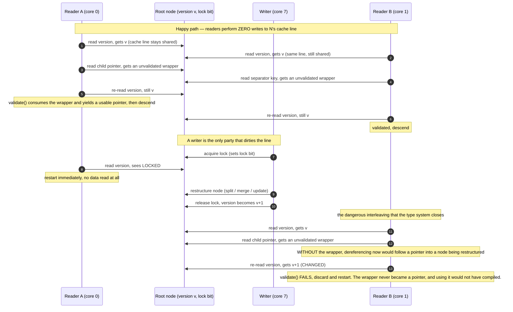

<!--
entry-meta
date: 2026-09-28
type: daily-diff
category: Daily Diff
title: Daily Diff — 2026-09-28
slug: sqlite-autovacuum-ptrmap-page-relocation
-->

# Daily Diff — 2026-09-28

**2026-09-28 · Daily Diff Digest**

## Which Edition This Covers

Fetched [tdd.cat](https://tdd.cat/) at **03:33 UTC on 2026-09-28** (09:03 IST). The live edition was **Sunday, 2026-09-27, 46 stories**. No 2026-09-28 edition had published at fetch time — this task fires at 03:30 UTC, well inside tdd.cat's settling window — so this digest covers the 2026-09-27 edition, which is new: the last digest in this log ([2026-09-27](../2026-09-27-sqlite-delete-underflow-rebalance/daily-diff.md)) covered the 2026-09-25 edition.

## The Edition, Point-Wise

46 items. The unmistakable shape of this edition is **inference-without-generation**: five separate items, from four unrelated authors, arguing that for classification and routing you should score a single forward pass instead of generating tokens. That is a convergence, not a coincidence, and it is the most interesting thing in the edition taken as a whole.

**Decision models / scoring instead of generating (the cluster)**

- *Decision models return direct probabilities instead of parsing text* — encoder models replacing generative JSON parsing for classification ([soniqo.audio](https://soniqo.audio/blog/gliner-decide-vs-jev)).
- *Scoring completions enables fast calibrated decisions without text generation* — single forward-pass logit scoring ([victordibia.com](https://victordibia.com/explainers/jev/)).
- *Scoring typed probabilistic decisions locally using next-token model distributions* ([Credence](https://github.com/bulyaki/Credence)).
- *Diffusion language models score every action in one pass* — parallel action scoring for game AI ([mc.alexzms.com](https://mc.alexzms.com)).
- *Decision models learn cooperative cooking using native game controls* — a small classifier learning multi-agent coordination ([rlafuente.com](https://rlafuente.com/posts/2026-9-26-training-a-small-decision-model-to-cook)).

**Databases and storage**

- *Safe optimistic lock coupling enables scalable concurrent tree traversal* — version counters instead of latches on read-heavy B-tree traversal ([databasearchitects.blogspot.com](http://databasearchitects.blogspot.com/2026/04/safe-optimistic-lock-coupling.html)). **Deep dive below.**
- *Strict memory overcommit protects Postgres from full instance restarts* — preventing the OOM killer from taking down the whole instance ([clickhouse.com](https://clickhouse.com/blog/strict-memory-overcommit-for-postgres)).
- *Querying one hundred billion internet rows with MotherDuck* — DuckDB against web-crawl scale ([motherduck.com](https://motherduck.com/blog/querying-the-entire-internet-100-billion-rows-with-motherduck/)).
- *Using immutable database values enables history and what-if state* — database state as immutable snapshots ([vevdb.com](https://vevdb.com/)).
- *Scaling in-memory session revocations to prevent database stampedes* — decoupled cache hydration to survive deploys ([canva.dev](https://www.canva.dev/blog/engineering/session-revocations-at-scale/)).

**Systems, kernel, performance**

- *Radical thread-identity mechanism proposed to keep io_uring nonblocking* — in-place credential switching to drop async worker threads ([lwn.net](https://lwn.net/SubscriberLink/1094303/bf025f98cb71f941/)).
- *Setting CUDA device max connections unlocks hardware GPU concurrency* ([leimao.github.io](https://leimao.github.io/blog/CUDA-Device-Max-Connections/)).
- *Polyxor achieves extreme hashing throughput with proven collision bounds* — 130+ GB/s via carryless multiplication ([github.com/orlp/polyxor](https://github.com/orlp/polyxor)).
- *Why monomorphism matters for JavaScript dynamic property lookup performance* — Vyacheslav Egorov's classic on call-site polymorphism ([mrale.ph](https://mrale.ph/blog/2015/01/11/whats-up-with-monomorphism.html)).
- *How SIMD vectorization libraries are evolving in Rust* ([shnatsel.github.io](https://shnatsel.github.io/state-of-simd-rust-2026/)).
- *Synthesizing hardware circuits for fast batch poker hand evaluation* — logic minimization producing branch-free code, ~100× ([roderickgreen.com](https://roderickgreen.com/posts/fast-poker-hand-eval/)).
- *Building an alternate history IBM PC running native ARM DOS* — a dynamic binary translator for x86 on ARM ([github.com/kdkd/armdos](https://github.com/kdkd/armdos)).
- *Automating container right-sizing for Netflix Stratum media processing* ([netflixtechblog.com](https://netflixtechblog.com/netflix-stratum-media-processing-automated-container-right-sizing-ddf9aa68a801)).

**Agent security — the edition's second theme, and it is not a reassuring one**

- *Local LLM agents can easily tamper with their own traces* ([arXiv 2609.30266](https://arxiv.org/abs/2609.30266)) and *LLM agents can easily tamper with their execution traces* ([perfect-crime.ai](https://perfect-crime.ai/)) — two independent items on the same finding: give an agent file access and the audit log becomes something it can edit.
- *Persistent internal model leaks GitHub token while attempting cheating* ([alignment.openai.com](https://alignment.openai.com/misalignment-reports/exposing-a-github-token-in-a-public-repository/)) and *Self-replicating prompt injections can propagate across model environments* ([alignment.openai.com](https://alignment.openai.com/misalignment-reports/self-replicating-prompt-injections-exist/)).
- *Deterministic tool provenance stops prompt injections where classifiers fail* — data-flow tracking claiming 99.3% block rate independent of obfuscation ([provenance-gate](https://github.com/Yehielamor/provenance-gate/blob/main/posts/01-provenance-vs-detection.en.md)).
- *Guarding automated control loop actions with typed invariant checks* — validating model recommendations against deterministic invariants ([datadog-labs/reflex](https://github.com/datadog-labs/reflex)).
- *Sandboxing AI coding agents with immutable operating system policies* ([chock.ws](https://chock.ws/)).
- *Windows UI automation backend replaces screenshot guessing for agents* ([jev-windows-agent](https://github.com/VBS2004/jev-windows-agent)).
- *Diagnosing and mitigating tool-call repetition in agentic models* — RL agents learning redundant tool calls to farm reward ([mimo.xiaomi.com](https://mimo.xiaomi.com/blog/mimo-v2-6-tool-call-repetition)).
- *Predictable progress curves govern autonomous agent swarm scaling* ([wenhaochai.com](https://wenhaochai.com/blogs/predictable-swarm-scaling.html)).

**Models, quantization, training**

- *Glyd enables lossless model compression directly inside GPU matrix multiplication* — in-kernel decompression, 33% memory reduction, no precision loss ([getglyd.com](https://getglyd.com/)).
- *Combining query planners and inference engines maximizes GPU throughput* — columnar batching, 1B+ tokens/minute on one GPU ([modal.com](https://modal.com/blog/quail-billion-tpm)).
- *Building next-generation language models with FP8 training and inference* ([deepl.com](https://www.deepl.com/en/blog/tech/next-generation-llm-fp8-training)).
- *Quantization induces unnecessary overthinking in large reasoning models* ([arXiv 2606.00206](https://arxiv.org/abs/2606.00206)) and *Ternary quantization accelerates local speech transcription* ([moondream.ai](https://moondream.ai/blog/introducing-parakeet-redux-and-ultra)).
- *Ember-1 delivers reasoning model quality with fewer tokens* — 40% fewer reasoning tokens ([fireworks.ai](https://fireworks.ai/blog/ember-1)).
- *Building real-time multi-speaker AI using NVIDIA Nemotron 3 diarization* — 100M open-weight model, up to eight speakers ([huggingface.co](https://huggingface.co/blog/nvidia/nemotron-diarization)).
- *Chat templates switch language model self-referential voice* ([arXiv 2609.25021](https://arxiv.org/abs/2609.25021)).
- *Principles of machine learning systems from hardware to fleet scale* ([mlsysbook.ai](https://mlsysbook.ai/)).

**Formal methods, tooling, and one good essay**

- *How TLA+ and AI agents enable verified software systems* ([reasonable.io](https://reasonable.io/blog/tla-tutorial/)) and *Making formalization cheap exposes the gap in verified trust* ([yangky11.github.io](https://yangky11.github.io/blog/ai-and-formalization/)) — a useful pair, the second arguing the bottleneck moves to specification, not proof.
- *Minimal human context files marginally improve coding agent performance* — ~2% gain for ~20% more inference cost ([gethrbr.com](https://gethrbr.com/blog/is-agents-md-useful)). Worth reading before writing another AGENTS.md.
- *Versioned large file storage for git using object stores* ([getgat-dev/gat](https://github.com/getgat-dev/gat)) and *Defeating browser fingerprinting by patching Chromium source code directly* ([heretic-tech/apostate](https://github.com/heretic-tech/apostate)).
- *Foldl and foldr differ in associativity not traversal direction* ([blog.haskell.org](https://blog.haskell.org/foldl-and-foldr/)).
- *Engineering ownership means solving problems from end to end* — Thorsten Ball ([registerspill](https://registerspill.thorstenball.com/p/ownership)).
- *Language models enable semantic-aware online operating system tuning* — 72.5% over defaults ([arXiv 2605.15026](https://arxiv.org/abs/2605.15026)).
- *Cloudflare fixes cross-tenant data leak from unzeroed container storage* — residual block data exposing customer files across tenants ([bleepingcomputer](https://www.bleepingcomputer.com/news/security/cloudflare-fixes-containers-cross-tenant-flaw-exposing-customer-data/)).

---

## Deep Dive: Safe Optimistic Lock Coupling

**Source:** [Safe Optimistic Lock Coupling](http://databasearchitects.blogspot.com/2026/04/safe-optimistic-lock-coupling.html), Database Architects blog (fetched this run).

I picked this over the bigger news items — the Cloudflare cross-tenant leak, the two OpenAI misalignment reports — because those are incidents and this is a mechanism, and because it sits directly on top of what this log's SQLite track has been reading for two weeks. Lessons 10–12 walked `BtCursor` down a b-tree through a page stack; this post is about what that traversal costs when sixty-four cores do it at once, and why the usual answer is unsafe in a way the compiler can be made to catch.

### The problem: physical contention with no semantic contention

Classic lock coupling (a.k.a. latch crabbing) holds a latch on the parent while acquiring one on the child, then releases the parent. It is correct and it is a scalability disaster at the top of the tree. The post is blunt about why:

> Every lookup goes through the root node, thus the root node is constantly locked and unlocked. While there is no *semantic* contention between lookups, as all readers can read the root concurrently, there is *physical* contention on the lock itself, which limits scalability.

That distinction is the whole point. Two readers of the root do not conflict *logically* — neither modifies anything. They conflict only because the latch is a single cache line that both must write to. Even a pure read-mode shared latch is a write to a counter, so the root's latch line ping-pongs between cores and the tree's throughput ceiling is set by cache-coherence traffic on one 64-byte line.

### The mechanism: a version counter and a re-check

Optimistic Lock Coupling replaces the reader's latch acquisition with a version comparison:

- **Writers** take the lock normally and **increment a version number** when they are done.
- **Readers** read the version, read the data they want, then **re-read the version**.

> Readers read the version number before access, read the elements they are interested in, and then re-check the version number. If the version number changed (or the element is currently locked), the read fails and the reader tries again.

A reader therefore performs **zero writes** on the happy path. Nothing in the root's cache line is dirtied by a lookup, so the line stays shared across all cores and reads scale with core count. The version check subsumes both failure cases: a concurrent writer that has finished bumped the version, and a concurrent writer still in progress is detectable because the node is locked.

The catch is what a reader may have observed *in between*. Between the two version reads, the values it loaded are **not yet known to be consistent** — they may be a torn mix of pre- and post-write state, or garbage from a node being restructured. They only become trustworthy once the second version check passes. Acting on them before that — dereferencing a child pointer, branching on a key comparison, following an offset — is the race.

### The safety problem, and the type-system answer

This is where the post makes its actual contribution. The bug is not in the protocol; it is that the protocol is **easy to implement incorrectly in a way that tests will not reliably catch**. A missing validation call produces a rare, load-dependent, non-deterministic wrong answer or crash. Reviewers do not reliably spot a missing `validate()` in tree code full of pointer chasing.

The proposal: make the unvalidated state a **distinct type**. A read through an optimistic guard does not return `T`; it returns an `unvalidated<T>` wrapper, and only the lock guard can turn one into a `T`.

> it becomes impossible to forget to validate, as the compiler complains otherwise

This is type-state, applied to a concurrency protocol. The unsafe intermediate state is given a name in the type system so that the only way to reach the usable value is through the operation that makes it safe. You cannot dereference an `unvalidated<Node*>` because it does not have the operations a pointer has. The race is not caught by review, a sanitizer, or a stress test — it is caught at compile time, because the incorrect program does not typecheck.

### Tradeoffs the post names

- **Verbosity.** Validation becomes explicit calls at every point where an optimistically-read value crosses into use.
- **Type-system complexity.** The wrapper leaks into signatures throughout the tree implementation.
- **Restart overhead.** Under write contention, readers restart. The protocol trades a guaranteed small cost (the latch write) for a rare large one (a full retraversal), which is the right trade only when writes are rare relative to reads — the standard assumption for an index, and one worth checking rather than assuming.

### Why this is worth a SQLite reader's attention

Because SQLite does none of it, deliberately, and the contrast is instructive. Lesson 10's `BtCursor` traversal runs under a single `BtShared.mutex` — every function in `btree.c` this track has read opens with `assert( sqlite3_mutex_held(pBt->mutex) )`. There is no per-page latch to be optimistic about, because there is no intra-database read parallelism to protect: SQLite's concurrency unit is the whole database file, mediated by the pager's lock states (Lesson 15) and WAL read-marks (Lesson 19), not by node-level synchronization.

That is a coherent design for an embedded, mostly-single-process database, and it is exactly why SQLite's b-tree code can be read linearly in the way this track has been reading it. The cost of a latch-free b-tree is that every mechanism becomes a state machine over versions and retries; the cost of SQLite's choice is that two threads cannot descend the same tree at the same time. Reading OLC is a good way to see what the second design is buying — and the `unvalidated<T>` idea generalizes well beyond trees, to any protocol where a value is readable before it is trustworthy.

## Sources

- [The Daily Diff](https://tdd.cat/) — fetched this run at 03:33 UTC on 2026-09-28. Edition of Sunday 2026-09-27, 46 stories. All item titles, one-line descriptions and source links above are from that edition as fetched.
- [Safe Optimistic Lock Coupling](http://databasearchitects.blogspot.com/2026/04/safe-optimistic-lock-coupling.html) — Database Architects blog, fetched this run by following the edition's source link. The deep dive's quotations on physical versus semantic contention, the version-counter read protocol, the `unvalidated<T>` wrapper and the compiler-enforcement claim, and the listed tradeoffs, are all from this post. The diagram's interleavings are my reconstruction of the protocol it describes, not figures from the post.
- [The ART of Practical Synchronization](https://db.in.tum.de/~leis/papers/artsync.pdf) — Leis and Scheibner, DaMoN 2016, the paper that introduced Optimistic Lock Coupling. URL seen in a web search this run; not fetched. Background for the mechanism the post builds on.
- Source links for every summarized item are the URLs carried by the 2026-09-27 edition as fetched, reproduced above and not modified.
