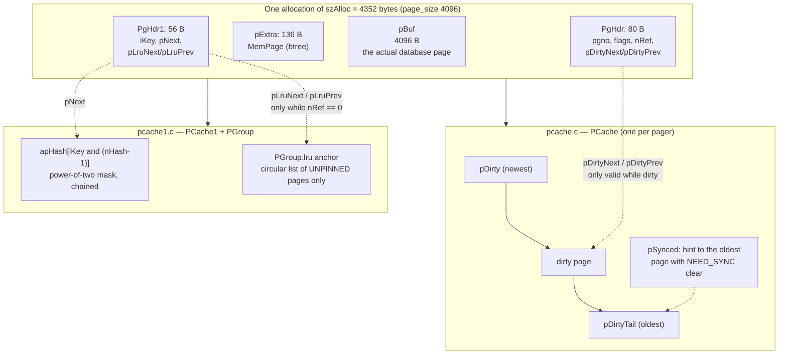
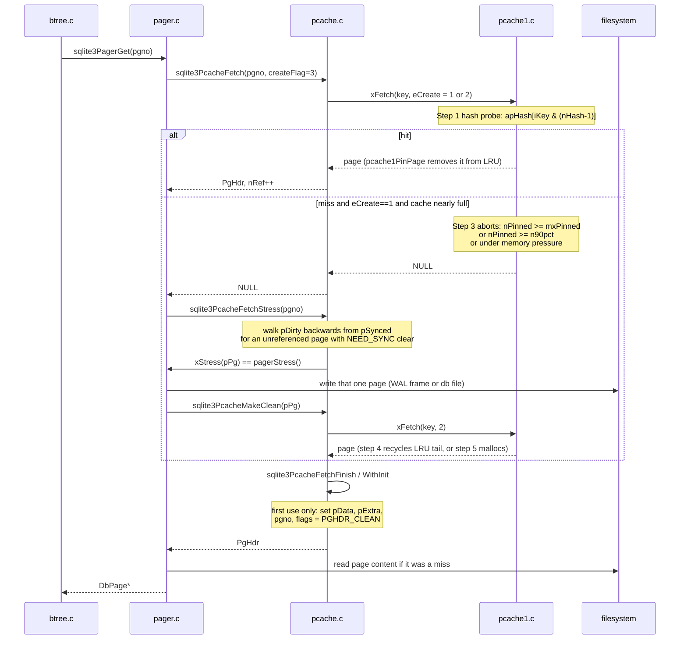

<!--
entry-meta
date: 2026-09-29
type: lesson
track: SQLite
lesson: 14
category: Database Internals
title: The Page Cache — PgHdr, pcache1's LRU, and Why the Dirty List Is Sorted Twice
slug: sqlite-page-cache-pghdr-dirty-lists
-->

# The Page Cache — `PgHdr`, pcache1's LRU, and Why the Dirty List Is Sorted Twice

**2026-09-29 · SQLite Track · Lesson 14 of 33**

## Where This Fits

- **Previous lesson:** [Lesson 13](../2026-09-28-sqlite-autovacuum-ptrmap-page-relocation/README.md) closed Part I. It used `sqlite3PagerMovepage()` as a black box to relocate a page during auto-vacuum, and it ended on the observation that the ptrmap is a *redundant* index — every repair it drives is a write to a page that some layer below has to hold in memory first.
- **This lesson opens Part II** with the layer that holds them. Every `MemPage` that Lessons 03–13 manipulated is a pointer into a buffer owned by the page cache, and every `sqlite3PagerWrite()` that made those manipulations legal did nothing more dramatic than move one node between two linked lists.
- **What it adds:** the two-header layout (`PgHdr` above, `PgHdr1` below, one `malloc` for both plus the data), the pluggable `sqlite3_pcache_methods2` seam between them, the PGroup LRU that decides what gets evicted, the dirty list that decides what gets written, and the `xStress` callback that fires when those two requirements collide mid-transaction.
- **Next:** Lesson 15 takes the pager's five lock states. This lesson stops at the moment `xStress` calls into `pagerStress()`; Lesson 15 explains why that call is legal in `WRITER_CACHEMOD` and forbidden during rollback.

Source references are to `sqlite/sqlite` read through a code index during this run and cited by file and line range; the index served commits **`2acb2ea`** and **`86876d2`** of `master` over the course of the run, with no differences in the regions quoted. Measurements are against SQLite **3.53.4** via `apsw` 3.53.4.0 on x86-64 Linux, `page_size = 4096`, `reserved_bytes = 0`, rows of a 4000-byte blob so that each row occupies its own leaf page unless stated otherwise — the same tooling as Lessons 08–13.

---

## 1. One Page Is Three Structs and One `malloc`

A cached page is described by three structures stacked in a single allocation. Only the middle one is public.

| Struct | Defined in | Owner | Role |
|---|---|---|---|
| `PgHdr1` | `src/pcache1.c:117-127` | pcache1 (the implementation) | hash chain, LRU links, the key |
| `sqlite3_pcache_page` | public API | the interface between them | just `pBuf` and `pExtra` |
| `PgHdr` | `src/pcache.h:26-49` | pcache.c (the wrapper) | dirty links, refcount, flags, `pgno` |

`PgHdr1` embeds `sqlite3_pcache_page` as its first member ("Base class. Must be first. pBuf & pExtra", `pcache1.c:118`), and `PgHdr` is carved out of the `pExtra` region that the upper layer asked for. The allocation size is computed once, in `pcache1Create`:

```c
pCache->szAlloc = szPage + szExtra + ROUND8(sizeof(PgHdr1));   /* pcache1.c:791 */
```

where `szExtra` is not the caller's number — `sqlite3PcacheSetPageSize()` inflates it on the way down:

```c
pNew = sqlite3GlobalConfig.pcache2.xCreate(
            szPage, pCache->szExtra + ROUND8(sizeof(PgHdr)),
            pCache->bPurgeable
);                                                              /* pcache.c:363-366 */
```

So one cache line is `page data + btree's MemPage + PgHdr + PgHdr1`, and the b-tree's `MemPage` — the struct Lesson 03 decoded — is *inside the page cache allocation*, not beside it. That is why `sqlite3BtreeOpen` passes `sizeof(MemPage)` as the pager's extra size (`btree.c:2713`).

**Measured.** On this build, `szAlloc` is exactly **4352 bytes** for a 4096-byte page. Holding cache size at a fixed page count and reading `SQLITE_DBSTATUS_CACHE_USED`:

| `cache_size` | `CACHE_USED` (bytes) | implied |
|---|---|---|
| 100 | 436,008 | |
| 500 | 2,176,808 | +1,740,800 over 400 pages = **4352 B/page** |
| 1000 | 4,352,808 | +2,176,000 over 500 pages = **4352 B/page** |

The fit is `CACHE_USED = 4352·n + 808`, exact at all three points. `4352 = 4096 + 136 + ROUND8(sizeof(PgHdr)) + ROUND8(sizeof(PgHdr1))`, and §8 pins the 136 down independently.

`PgHdr` carries a visibility fence in the middle of the struct — everything from `nRef` down is "private to pcache.c and should not be accessed by other modules" (`pcache.h:40-41`), which is why `pCache` is hoisted up above the line "for efficiency" even though it is private in spirit.

The flag byte is the whole state machine:

```c
#define PGHDR_CLEAN           0x001  /* Page not on the PCache.pDirty list */
#define PGHDR_DIRTY           0x002  /* Page is on the PCache.pDirty list */
#define PGHDR_WRITEABLE       0x004  /* Journaled and ready to modify */
#define PGHDR_NEED_SYNC       0x008  /* Fsync the rollback journal before
                                     ** writing this page to the database */
#define PGHDR_DONT_WRITE      0x010  /* Do not write content to disk */
#define PGHDR_MMAP            0x020  /* This is an mmap page object */
#define PGHDR_WAL_APPEND      0x040  /* Appended to wal file */
                                                  /* pcache.h:52-60 */
```

`PGHDR_DONT_WRITE` is the flag Lesson 12 met as `sqlite3PagerDontWrite()` — the reason freeing a page during a delete costs nearly nothing. It lives here, not in the pager.



The same 4352 bytes are threaded onto three different lists by three different sets of pointers, and each set is only meaningful in one state: `pDirtyNext`/`pDirtyPrev` are explicitly "undefined if the PgHdr object is not dirty" (`pcache.h:47-48`), and `pLruPrev` "is only valid if pLruNext!=0" (`pcache1.c:126`).

---

## 2. The Seam: `sqlite3_pcache_methods2`

`pcache.c` never touches a hash table or an LRU list. It calls twelve function pointers:

```c
struct sqlite3_pcache_methods2 {
  int iVersion;
  void *pArg;
  int (*xInit)(void*);
  void (*xShutdown)(void*);
  sqlite3_pcache *(*xCreate)(int szPage, int szExtra, int bPurgeable);
  void (*xCachesize)(sqlite3_pcache*, int nCachesize);
  int (*xPagecount)(sqlite3_pcache*);
  sqlite3_pcache_page *(*xFetch)(sqlite3_pcache*, unsigned key, int createFlag);
  void (*xUnpin)(sqlite3_pcache*, sqlite3_pcache_page*, int discard);
  void (*xRekey)(sqlite3_pcache*, sqlite3_pcache_page*,
                 unsigned oldKey, unsigned newKey);
  void (*xTruncate)(sqlite3_pcache*, unsigned iLimit);
  void (*xDestroy)(sqlite3_pcache*);
  void (*xShrink)(sqlite3_pcache*);
};
```

Three of these map directly onto operations from Part I:

- **`xRekey`** is Lesson 13's page relocation. `sqlite3PcacheMove()` calls it (`pcache.c:679`) and the docs require that "if the cache previously contains an entry associated with newKey, it must be discarded" — which is why `sqlite3PcacheMove` first fetches the destination page number with `createFlag==0` and drops it if present (`pcache.c:670-678`).
- **`xTruncate`** is auto-vacuum's file shrink: "discard all existing cache entries with page numbers (keys) greater than or equal to the value of the iLimit parameter".
- **`xUnpin`** with `discard` set is `sqlite3PcacheDrop()`.

The contract that matters most is `xFetch`'s `createFlag`, which is three-valued:

| `createFlag` | Documented obligation |
|---|---|
| 0 | "Do not allocate a new page. Return NULL." |
| 1 | "Allocate ... if it is easy and convenient ... Otherwise return NULL." |
| 2 | "Make every effort to allocate a new page. Only return NULL if ... effectively impossible." |

That middle value is the whole design. It lets the cache say *"I could give you a page, but it would cost a disk write"* — and hand the decision back up to a layer that knows how to do the write.

---

## 3. The Fetch Path Is Deliberately Three Functions

The upper layer only ever passes 0 or 3 — not 1:

```c
assert( createFlag==3 || createFlag==0 );
assert( pCache->eCreate==((pCache->bPurgeable && pCache->pDirty) ? 1 : 2) );
...
eCreate = createFlag & pCache->eCreate;                      /* pcache.c:413-423 */
```

`3 & eCreate` passes `PCache.eCreate` straight through; `0 & anything` is 0. `eCreate` is a cached predicate, maintained incrementally by the dirty-list code so that `sqlite3PcacheFetch` never has to test it:

- set to **2** when the dirty list becomes empty (`pcache.c:226-229`)
- set to **1** when the first page joins the dirty list, if the cache is purgeable (`pcache.c:240-243`)

So the meaning is: *if there is nothing dirty, there is nothing to spill, so allocating hard is free of consequences — ask for 2.* If something is dirty, ask for 1, and be prepared to be refused.

The refusal path is a second call, and the initialization is a third:



The split is explicitly a calling-convention optimization, not a layering decision: the routines "are split this way for performance reasons. When separated they can both (usually) operate without having to push values to the stack on entry and pop them back off on exit" (`pcache.c:398-401`). Initialization is split off again into `pcacheFetchFinishWithInit()` for the same reason — it runs only on a page's first use, and zeroes exactly the first 8 bytes of `pExtra` (`pcache.c:514`).

---

## 4. pcache1: A Masked Hash Table and a Circular LRU

Step 1 of the fetch is four lines, and the comment explains the one trick:

```c
/* Step 1: Search the hash table for an existing entry.  nHash is always
** a power of two when the cache is in use (see pcache1ResizeHash()), so
** the modulo reduces to a mask, avoiding a hardware divide. */
assert( pCache->nHash>0 && (pCache->nHash & (pCache->nHash-1))==0 );
pPage = pCache->apHash[iKey & (pCache->nHash-1u)];
while( pPage && pPage->iKey!=iKey ){ pPage = pPage->pNext; }
                                                   /* pcache1.c:1013-1018 */
```

There is no hash function. The key *is* the page number, and page numbers are dense, so masking is already a perfect distribution. The table starts at 256 slots and doubles whenever `nPage >= nHash` (`pcache1.c:544-546`, `pcache1.c:898`), keeping the load factor under 1.

Eviction candidates live on the **PGroup** LRU, not on any per-cache list:

```c
struct PGroup {
  sqlite3_mutex *mutex;          /* MUTEX_STATIC_LRU or NULL */
  unsigned int nMaxPage;         /* Sum of nMax for purgeable caches */
  unsigned int nMinPage;         /* Sum of nMin for purgeable caches */
  unsigned int mxPinned;         /* nMaxpage + 10 - nMinPage */
  unsigned int nPurgeable;       /* Number of purgeable pages allocated */
  PgHdr1 lru;                    /* The beginning and end of the LRU list */
};                                                 /* pcache1.c:158-165 */
```

Three details are load-bearing:

1. **The list head is a `PgHdr1`, not a pointer.** `PGroup.lru` is a real page header with `isAnchor = 1`, spliced into the circular list, so insertion and removal need no null checks. Every loop that walks it terminates on `isAnchor` rather than on `NULL` (`pcache1.c:627-629`).
2. **Only unpinned pages are on it.** `pcache1Unpin()` is what puts a page there, and it is reached only when `PgHdr.nRef` hits zero *and* the page is clean (`pcache.c:554-556`). A dirty page with no references is deliberately *not* eligible — it goes to the front of the dirty list instead (`pcache.c:558`).
3. **Group scope is a build-time choice.** With `SQLITE_ENABLE_MEMORY_MANAGEMENT`, one global PGroup serves every connection and pages can be robbed across caches under `SQLITE_MUTEX_STATIC_LRU`; otherwise each cache gets its own PGroup and runs mutex-free (`pcache1.c:148-157`, `pcache1.c:248-256`). The faster default trades recycling efficiency for the absence of a lock.

`pcache1Unpin` also decides between *keep* and *destroy* on the spot:

```c
if( reuseUnlikely || pGroup->nPurgeable>pGroup->nMaxPage ){
  pcache1RemoveFromHash(pPage, 1);
}else{
  /* Add the page to the PGroup LRU list. */
  ...
  pCache->nRecyclable++;
}                                                  /* pcache1.c:1102-1111 */
```

So over-quota pages are freed immediately rather than parked, and `xUnpin(..., discard=1)` bypasses the LRU entirely.

The admission test at step 3 is where `createFlag==1` actually gets refused:

```c
nPinned = pCache->nPage - pCache->nRecyclable;
if( createFlag==1 && (
      nPinned>=pGroup->mxPinned
   || nPinned>=pCache->n90pct
   || (pcache1UnderMemoryPressure(pCache) && pCache->nRecyclable<nPinned)
)){
  return 0;
}                                                  /* pcache1.c:887-896 */
```

`n90pct` is `nMax*9/10` (`pcache1.c:830`) — a cache will start pushing back at 90% of its configured size, not at 100%. `mxPinned` is `nMaxPage + 10 - nMinPage`, and `nMin` is fixed at 10 per purgeable cache (`pcache1.c:795-797`): a group-wide guarantee that ten pages per cache can always be pinned regardless of what the LRU looks like.

---

## 5. The Dirty List Is Ordered by Recency, Not by Page Number

`PCache.pDirty` is a doubly linked list maintained in **LRU order** — "p was added to the list more recently than p->pDirtyNext", with `pDirty` newest and `pDirtyTail` oldest (`pcache.c:26-30`). Exactly one function edits it, with a three-valued verb:

```c
#define PCACHE_DIRTYLIST_REMOVE   1    /* Remove pPage from dirty list */
#define PCACHE_DIRTYLIST_ADD      2    /* Add pPage to the dirty list */
#define PCACHE_DIRTYLIST_FRONT    3    /* Move pPage to the front of the list */
                                                   /* pcache.c:184-187 */
```

`FRONT` is `REMOVE|ADD`, and the callers are exactly what you would expect:

| Caller | Op | Why |
|---|---|---|
| `sqlite3PcacheMakeDirty` | ADD | first write to the page, flips `PGHDR_CLEAN`→`PGHDR_DIRTY` by XOR (`pcache.c:599`) |
| `sqlite3PcacheRelease`, when the page is dirty | FRONT | refcount hit zero — re-age it so it is evicted last |
| `sqlite3PcacheMakeClean` | REMOVE | it has been written out |
| `sqlite3PcacheMove`, if `DIRTY` and `NEED_SYNC` | FRONT | relocation must not make a sync-pending page the eviction candidate |
| `sqlite3PcacheDrop` | REMOVE | page is going away entirely |

`pSynced` is a cursor, not an invariant. It "almost always" points at the oldest dirty page with `PGHDR_NEED_SYNC` clear, or at something older (`pcache.c:32-39`), and the spill search starts there and walks *backwards*:

```c
for(pPg=pCache->pSynced;
    pPg && (pPg->nRef || (pPg->flags&PGHDR_NEED_SYNC));
    pPg=pPg->pDirtyPrev
);
pCache->pSynced = pPg;
if( !pPg ){
  for(pPg=pCache->pDirtyTail; pPg && pPg->nRef; pPg=pPg->pDirtyPrev);
}                                                  /* pcache.c:463-470 */
```

Two passes, in priority order: *first* a page that costs no journal fsync, *then* any unreferenced dirty page at all. The comment concedes the hint can go stale and shrugs: "This is Ok, as pSynced is just an optimization."

---

## 6. Spilling: When the Cache Asks the Pager for Help

`sqlite3PcacheFetchStress` bails out instantly if `eCreate==2` (nothing is dirty, so the earlier `xFetch` already tried its hardest), then checks the spill threshold — which is a *different* number from the cache size:

```c
if( pCache->eCreate==2 ) return 0;
if( sqlite3PcachePagecount(pCache)>pCache->szSpill ){   /* pcache.c:451-453 */
```

`szSpill` defaults to 1 (`pcache.c:350`), so in practice this is always true and the real gate is the `xFetch` refusal above it. `PRAGMA cache_spill=N` raises it:

```c
int sqlite3PcacheSetSpillsize(PCache *p, int mxPage){
  ...
  if( mxPage<0 ){
    mxPage = (int)((-1024*(i64)mxPage)/(p->szPage+p->szExtra));
  }
  p->szSpill = mxPage;
  res = numberOfCachePages(p);
  if( res<p->szSpill ) res = p->szSpill;
  return res;                                      /* pcache.c:875-886 */
```

Note the return value: querying `PRAGMA cache_spill` with no argument returns `max(numberOfCachePages(p), szSpill)`. Because `szSpill` starts at 1, **`PRAGMA cache_spill` is a direct readout of the effective cache page count** — the single most useful undocumented-feeling fact in this lesson, and §8 uses it.

The callback itself is `pagerStress()` (`pager.c:4663`), wired in at `sqlite3PagerOpen` and passed as `0` for in-memory databases (`pager.c:5088-5089`) — which is why a `:memory:` database can never spill and simply grows until malloc fails. Its body is short:

```c
pPager->aStat[PAGER_STAT_SPILL]++;
pPg->pDirty = 0;
if( pagerUseWal(pPager) ){
  rc = subjournalPageIfRequired(pPg);
  if( rc==SQLITE_OK ){
    rc = pagerWalFrames(pPager, pPg, 0, 0);
  }
}else{
  if( pPg->flags&PGHDR_NEED_SYNC || pPager->eState==PAGER_WRITER_CACHEMOD ){
    rc = syncJournal(pPager, 1);
  }
  if( rc==SQLITE_OK ){
    rc = pager_write_pagelist(pPager, pPg);
  }
}
if( rc==SQLITE_OK ){
  sqlite3PcacheMakeClean(pPg);
}                                                  /* pager.c:4697-4732 */
```

`pPg->pDirty = 0` is the tell: this writes **one page**, as a singleton list. In rollback mode the write goes into the *database file itself*, mid-transaction, uncommitted — which is exactly why the journal must be synced first.

Three guards can veto it (`pager.c:4690-4695`): `SPILLFLAG_OFF` (user asked, via `PRAGMA cache_spill=off`), `SPILLFLAG_ROLLBACK` (a rollback is in progress and the journal is being read), and `SPILLFLAG_NOSYNC`, which permits the write but forbids the journal sync — set when the filesystem sector size exceeds the page size, to stop a sync from landing between two pages that share a sector.

---

## 7. The Commit Flush Is Sorted; The Spill Is Not

At commit, the pager does not walk `pDirty`. It calls `sqlite3PcacheDirtyList()`, which relinks the list through the transient `pDirty` field and merge-sorts it by page number:

```c
PgHdr *sqlite3PcacheDirtyList(PCache *pCache){
  PgHdr *p;
  for(p=pCache->pDirty; p; p=p->pDirtyNext){
    p->pDirty = p->pDirtyNext;
  }
  return pcacheSortDirtyList(pCache->pDirty);      /* pcache.c:818-824 */
}
```

The sort is a bottom-up binary merge with a fixed bucket array — no allocation, no recursion:

```c
#define N_SORT_BUCKET  32
static PgHdr *pcacheSortDirtyList(PgHdr *pIn){
  PgHdr *a[N_SORT_BUCKET], *p;
  ...
  for(i=0; ALWAYS(i<N_SORT_BUCKET-1); i++){
    if( a[i]==0 ){ a[i] = p; break; }
    else{ p = pcacheMergeDirtyList(a[i], p); a[i] = 0; }
  }                                                /* pcache.c:782-813 */
```

Bucket `i` holds a sorted run of exactly 2^i pages; each new page cascades upward until it finds an empty slot, and a final pass merges all buckets. 32 buckets because "there cannot be more than 2^31 distinct pages in a database ... One extra bucket is added to catch overflow in case something ever changes to make the previous sentence incorrect" (`pcache.c:777-781`). `pcacheMergeDirtyList` explicitly does not repair `pDirtyPrev` — the doubly linked structure is sacrificed for the duration of the flush and rebuilt as pages are marked clean.

**This is directly visible in a WAL file.** 1200 rows of a 4000-byte blob (one row per leaf page), checkpointed to truncate the WAL, then 120 rows updated in randomized rowid order inside one transaction:

```
update order (rowids, first 20): [927, 1147, 954, 926, 1041, 389, 379, 1049, 975, 382, ...]

cache_size = -200000  (no spilling)
  frames: 120
  WAL page numbers, first 20: [3, 4, 12, 22, 25, 33, 34, 37, 43, 63, 64, 76, 88, 89, 110, 124, 125, 132, 139, 146]
  strictly ascending? True
  commit frame at index: 119
```

Scrambled in, sorted out. Now the same transaction with a cache too small to hold it:

```
cache_size = 50
  CACHE_SPILL during txn: 78      frames: 120
  WAL page numbers, first 20: [535, 600, 383, 475, 304, 464, 386, 269, 148, 1094, 441, 608, 64, 888, 261, 32, 569, 303, 176, 542]
  strictly ascending overall? False
  last 42 frames ascending? True
```

Exactly 78 frames arrive in LRU eviction order — one per `pagerStress()` call, each its own singleton write — and the remaining 42 arrive as one sorted run at commit. The sort is not a property of the WAL; it is a property of the *batch*, and spilling destroys the batch.

---

## 8. What `PRAGMA cache_size` Actually Computes

```c
static int numberOfCachePages(PCache *p){
  if( p->szCache>=0 ){
    return p->szCache;
  }else{
    i64 n;
    n = ((-1024*(i64)p->szCache)/(p->szPage+p->szExtra));
    if( n>1000000000 ) n = 1000000000;
    return (int)n;
  }
}                                                  /* pcache.c:277-292 */
```

Two things people get wrong about this:

- The divisor is `szPage + szExtra`, **not** `szAlloc`. It ignores `ROUND8(sizeof(PgHdr))` and `ROUND8(sizeof(PgHdr1))` — so a negative `cache_size` under-counts real memory by about 3%.
- `p->szExtra` here is the *pager's* extra size (`ROUND8(sizeof(MemPage))`), not the inflated value handed to `xCreate`. The two `szExtra` fields, in `PCache` and `PCache1`, differ by `ROUND8(sizeof(PgHdr))`.

**Deriving `szExtra` from the outside.** `PRAGMA cache_spill` returns `numberOfCachePages()`, so:

| `cache_size` | `PRAGMA cache_spill` returns | `floor(-1024·N / 4232)` |
|---|---|---|
| −2000 | 483 | 483 |
| −100000 | 24196 | 24196 |
| 100 | 100 | (positive path) |

Solving `floor(4096000/x) = 967`, `floor(2048000/x) = 483` and `floor(512000/x) = 120` (the last two also confirmed by direct residency measurement below) bounds `x ∈ (4231.4, 4236.8]`. Since the pager applies `ROUND8` to `nExtra`, `x` must be a multiple of 8, leaving **`x = 4232`, so `szExtra = 136 = ROUND8(sizeof(MemPage))`** on this build. Default `-2000` therefore buys 483 pages, not 500 and certainly not 2000.

**Residency, measured directly** by binary-searching the largest prefix of a 1505-page table whose second scan produces zero cache misses:

| `cache_size` | fully cached leaf pages | `numberOfCachePages()` | difference |
|---|---|---|---|
| 1000 | 994 | 1000 | 6 |
| 500 | 495 | 500 | 5 |
| 300 | 295 | 300 | 5 |
| 100 | 95 | 100 | 5 |
| 50 | 45 | 50 | 5 |
| 10 | 5 | 10 | 5 |
| 1 | 0 | 1 | 1 |
| −500 | 115 | 120 | 5 |
| −1000 | 236 | 241 | 5 |
| −2000 | 478 | 483 | 5 |
| −4000 | 961 | 967 | 6 |

The constant 5–6 page gap is page 1 plus the interior pages of the table b-tree, which the scan keeps resident. And `cache_size=1` does *not* yield 10 resident pages: `nMin` is a group-wide accounting reservation, not a floor on residency.

**`-N` is kibibytes, not pages**, which the same measurement makes obvious — the count halves each time the page size doubles, against a constant 136-byte `szExtra`:

| `page_size` | fully cached pages | `floor(2048000/(page_size+136))` |
|---|---|---|
| 4096 | 477 | 483 |
| 8192 | 241 | 245 |
| 16384 | 119 | 123 |

---

## Hands-On

Environment: `pip install apsw` (3.53.4.0 here). Every snippet below is what produced the numbers above.

### A. Read the effective cache size without guessing

```python
import apsw
d = apsw.Connection("x.db")
d.execute("pragma page_size=4096").get
d.execute("pragma cache_size=-2000").get
print(d.execute("pragma cache_spill").get)   # -> 483
d.execute("pragma cache_size=-100000").get
print(d.execute("pragma cache_spill").get)   # -> 24196
```

**What to look for:** the returned number is `numberOfCachePages()` straight out of `pcache.c:884`. Divide `-1024*N` by it and you recover `szPage + szExtra` for your build — a value that is otherwise only visible in a debugger. If you get something other than 4232 at a 4096-byte page size, your `sizeof(MemPage)` differs (32-bit build, or different compile-time options), and every `-N` cache budget on that build is a different number of pages than on mine.

> Caveat that cost me a run: APSW executes multi-statement strings lazily. `d.execute("pragma a=1; pragma b=2")` may run only the first statement unless the cursor is consumed. Issue pragmas one per `execute(...).get`, and *read them back*. My first spill measurement silently used the default cache size for every configuration and produced three identical rows.

### B. Find the LRU cliff

```python
def scan(cs, K, passes=3):
    d = apsw.Connection("e2.db")           # 1505 pages, one row per page
    d.execute(f"pragma cache_size={cs}").get
    out, prev = [], 0
    for _ in range(passes):
        list(d.execute("select sum(length(b)) from t where a<=?", (K,)))
        m = d.status(apsw.SQLITE_DBSTATUS_CACHE_MISS)[0]
        out.append(m - prev); prev = m
    d.close(); return out
```

```
cache_size=500  (495 leaf pages stay resident)
 pages scanned  misses pass1   pass2   pass3
           490           494       0       0
           495           499       0       0
           496           500     497     497
           500           504     501     501
           600           605     602     602
```

**What to look for:** the discontinuity between 495 and 496. One page over the line and the hit rate falls from 100% to roughly 0% — and *stays* there on every subsequent pass. This is the textbook LRU/sequential-scan pathology, and it proves the replacement policy is plain LRU with no scan resistance: by the time the scan wraps to page 1, page 1 is the page that was just evicted.

### C. Watch a transaction spill into the database file

```python
d.execute("begin")
for i in range(1, 4001):
    d.execute("insert into t values(?,?)", (i, b'x'*4000))
print(os.path.getsize(DB),                                  # db size MID-transaction
      d.status(apsw.SQLITE_DBSTATUS_CACHE_USED)[0],
      d.status(apsw.SQLITE_DBSTATUS_CACHE_SPILL)[0])
d.execute("commit")
```

Rollback-journal mode, ~4005 pages dirtied in one transaction:

| `cache_size` | `cache_spill` | db bytes **mid-transaction** | `CACHE_USED` | `CACHE_SPILL` |
|---|---|---|---|---|
| −2000 | on | 14,671,872 | 2,102,824 | 3577 |
| 100 | on | 16,072,704 | 436,008 | 3947 |
| −100000 | on | 8,192 | 17,461,032 | 0 |
| −2000 | `off` | 8,192 | 17,461,032 | 0 |
| −2000 | 10000 | 8,192 | 17,461,032 | 0 |

**What to look for:** row 1 — the database file is 14 MB while the transaction is still open and could still be rolled back. Those are uncommitted pages sitting in the live database file, recoverable only from the journal. Rows 3–5 are the same workload with no spill at all, and the memory moves to `CACHE_USED` instead: 17.4 MB of RAM against an 8 KB file. `cache_spill=off` and a `cache_spill` threshold above the transaction's page count are two different mechanisms with the same effect here — the former sets `SPILLFLAG_OFF` in `doNotSpill`, the latter raises `szSpill`.

### D. See the merge sort in the WAL

```python
raw = open(DB + "-wal", "rb").read()
off, pg = 32, []
while off + 24 + 4096 <= len(raw):
    p, dbsz = struct.unpack(">II", raw[off:off+8])
    pg.append((p, dbsz)); off += 24 + 4096
```

**What to look for:** with a large cache, the page numbers are strictly ascending and only the final frame has a non-zero `dbsize` field (the commit marker). Shrink `cache_size` until `CACHE_SPILL` is non-zero and the head of the WAL becomes scattered while the tail stays sorted. The length of the sorted tail equals `frames − CACHE_SPILL` exactly — 42 and 120 − 78 in the run above. That one arithmetic identity is the clearest proof available from outside the process that spilled pages and committed pages travel by different code paths.

---

## Where This Breaks Down

- **The replacement policy is LRU, full stop.** Experiment B shows the cliff is one page wide. Any scan larger than the cache gets zero reuse — not degraded reuse. SQLite has no scan-resistant policy (no ARC, no 2Q, no sequential-flood protection), and `pcache1` has no hook to add one short of replacing the whole module via `SQLITE_CONFIG_PCACHE2`.
- **`cache_size` is per connection, and nothing sums it.** Ten connections at the default `-2000` is ~21 MB of page cache (`4352 × 483 × 10`), and unless the build enables `SQLITE_ENABLE_MEMORY_MANAGEMENT` they are ten independent PGroups that cannot lend each other a page. The global `nMaxPage` accounting exists only within a group.
- **Spilling makes a transaction's cost non-linear and its rollback expensive.** Below the threshold, an aborted transaction is a journal delete. Above it, 3577 pages have already been written into the database file and must be copied back. The threshold is invisible to the application; it moves when the page size or the row size changes.
- **A negative `cache_size` is a promise the cache does not keep.** It budgets `szPage + szExtra` per page and actually allocates `szAlloc` — 4232 versus 4352 here, a 2.8% undercount — and it covers *only* page content. Schema memory, statement memory, lookaside and the WAL index are all outside it. `SQLITE_DBSTATUS_CACHE_USED` is the number to watch, not the pragma.
- **`pSynced` is allowed to be wrong**, and when the LRU-oldest sync-free page happens to be referenced, the spill search silently degrades to a full backward walk of the dirty list. On a large dirty list under memory pressure this is O(n) per fetch.
- **In-memory databases cannot spill at all.** `sqlite3PagerOpen` passes `xStress = 0` for them (`pager.c:5088-5089`). There is no back-pressure valve; a `:memory:` database under a large transaction grows until the allocator fails.
- **The `xRekey` contract makes relocation a two-step dance.** Lesson 13's page moves cannot simply rename a key: the destination key must be evicted first, and `sqlite3PcacheMove` has to fetch it with `createFlag==0` and `sqlite3PcacheDrop` it, temporarily incrementing `nRefSum` to satisfy `Drop`'s `nRef==1` assertion (`pcache.c:670-678`).

---

## Further Study

- [Application Defined Page Cache](https://sqlite.org/c3ref/pcache_methods2.html) — the full `sqlite3_pcache_methods2` contract, including the obligations a replacement implementation must honour.
- [Custom Page Cache Object](https://www.sqlite.org/c3ref/pcache.html) — the opaque `sqlite3_pcache` handle the methods operate on.
- [Status Parameters for database connections](https://sqlite.org/c3ref/c_dbstatus_options.html) and [Database Connection Status](https://sqlite.org/c3ref/db_status.html) — the counters used throughout the Hands-On section.
- [`src/status.c`](https://github.com/sqlite/sqlite/blob/master/src/status.c) — how `CACHE_HIT`, `CACHE_MISS` and `CACHE_SPILL` are actually incremented, if you want to know precisely what each counter includes.
- [PRAGMA cache_size / cache_spill / shrink_memory](https://sqlite.org/pragma.html#pragma_cache_size) — the documented surface of everything measured here.
- [C/C++ Interface For SQLite Version 3](https://sqlite.org/capi3ref.html) — for `sqlite3_release_memory`, `sqlite3_soft_heap_limit64` and the `SQLITE_CONFIG_PAGECACHE` mechanism that `pcache1InitBulk` consumes.

## Next Steps

1. Reproduce the `szExtra` derivation on a 32-bit build and on a build with `SQLITE_ENABLE_MEMORY_MANAGEMENT`, and check whether `PRAGMA cache_spill` still divides by 4232.
2. Instrument the spill path in your own workload: log `SQLITE_DBSTATUS_CACHE_SPILL` per transaction and find the page-count threshold at which your write transactions start writing uncommitted data to the database file.
3. Build SQLite with `SQLITE_LOG_CACHE_SPILL` and compare its `sqlite3_log` output ("spill page %d making room for %d - cache used: %d/%d", `pager.c` via `pcache.c:473-479`) against the `CACHE_SPILL` counter.
4. Write a minimal `sqlite3_pcache_methods2` implementation that logs every `xFetch`/`xUnpin` and otherwise delegates to the built-in one, and register it with `SQLITE_CONFIG_PCACHE2` — the cheapest way to get a full access trace without a debugger.
5. Repeat Experiment D against a rollback-journal database by parsing the journal instead of the WAL, and confirm the spilled pages appear in the journal in the same unsorted order.

## Sources

- [Application Defined Page Cache — `sqlite3_pcache_methods2`](https://sqlite.org/c3ref/pcache_methods2.html)
- [PRAGMA Statements — `cache_size`, `cache_spill`, `shrink_memory`](https://sqlite.org/pragma.html#pragma_cache_size)
- [Status Parameters for database connections — `SQLITE_DBSTATUS_CACHE_*`](https://sqlite.org/c3ref/c_dbstatus_options.html)
- [Database Connection Status — `sqlite3_db_status()`](https://sqlite.org/c3ref/db_status.html)
- [Custom Page Cache Object](https://www.sqlite.org/c3ref/pcache.html)
- [`sqlite/sqlite` — `src/status.c`](https://github.com/sqlite/sqlite/blob/master/src/status.c)
- [C/C++ Interface For SQLite Version 3](https://sqlite.org/capi3ref.html)
- Source read by file and line range through a code index during this run: `src/pcache.h` (1-191), `src/pcache.c` (14-936), `src/pcache1.c` (107-1130), `src/pager.c` (308-5099), `src/btree.c` (2709-2717, 11617-11621).

## Takeaways

- **A cached page is one allocation carrying four things**: the page data, the b-tree's `MemPage`, `PgHdr`, and `PgHdr1`. Measured at 4352 bytes for a 4096-byte page, with `CACHE_USED = 4352·n + 808` exact across three cache sizes.
- **`createFlag==1` exists so the cache can refuse.** The whole spill mechanism is one three-valued flag plus a cached `eCreate` predicate that the dirty-list code maintains incrementally, so the hot fetch path never tests it.
- **Only clean, unreferenced pages reach the LRU.** A dirty page with `nRef==0` goes to the *front* of the dirty list instead — it is the last thing the cache wants to evict, because evicting it costs a write.
- **The dirty list is in recency order and gets merge-sorted into page order at commit** by a 32-bucket bottom-up sort that allocates nothing. Visible from outside: 120 scrambled updates produced 120 strictly ascending WAL frames.
- **Spilling destroys that batching.** `pagerStress` sets `pPg->pDirty = 0` and writes one page. With `cache_size=50` the same 120 updates produced 78 scattered frames followed by a 42-frame sorted run — `frames − CACHE_SPILL` exactly.
- **In rollback mode a spill writes uncommitted pages into the live database file.** Measured: 14.6 MB of database file during a transaction that had not committed and whose 8 KB starting size was still the durable truth.
- **`PRAGMA cache_spill` is a free readout of `numberOfCachePages()`**, and from it the build's `szPage + szExtra` falls out: 4232 here, so the default `-2000` is 483 pages, not 2000.
- **The policy is unadorned LRU and the cliff is one page wide.** 495 pages scanned: zero misses forever. 496: ~497 misses on every single pass.
