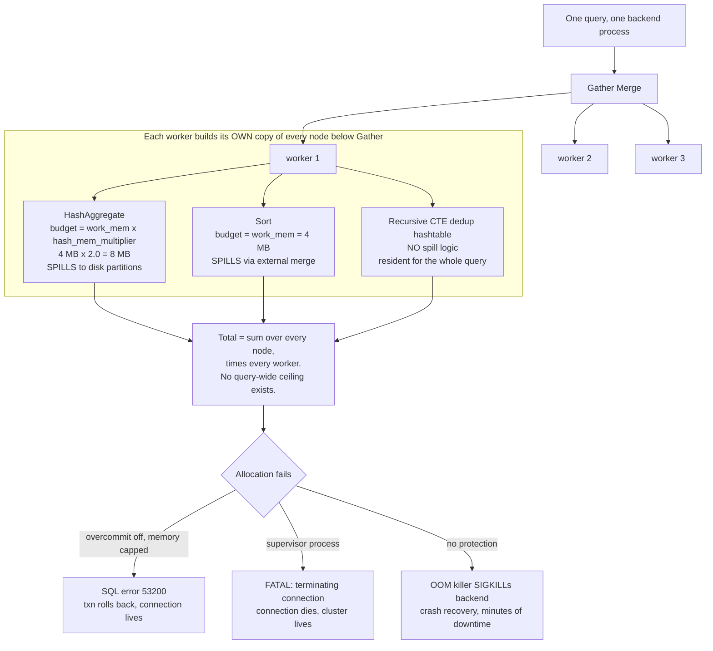

<!--
entry-meta
date: 2026-09-29
type: daily-diff
category: Daily Diff
title: Daily Diff — 2026-09-29
slug: sqlite-page-cache-pghdr-dirty-lists
-->

# Daily Diff — 2026-09-29

**2026-09-29 · Daily Diff Digest**

> **Edition note.** This run fetched https://tdd.cat/ at 03:35 UTC on 2026-09-29 (09:05 IST). The site was serving the edition dated **Monday, September 28, 2026** (52 stories); the 2026-09-29 edition had not published yet at that time. This digest therefore covers the most recent published edition, dated 2026-09-28, and invents nothing.

## The Edition at a Glance

52 stories. The distribution is lopsided — roughly half the edition is agent-harness and LLM-infrastructure material — so the items below are grouped by what they actually are rather than listed in publication order.

### Databases and storage

- **Why serializable isolation makes exclusive locks best effort** — CockroachDB treats `SELECT ... FOR UPDATE` as advisory under serializable isolation; the lock is an optimization for contention, not a correctness primitive. ([source](https://gaultier.github.io/blog/what_good_is_a_best_effort_exclusive_lock_anyway.html))
- **Why Postgres memory management fails under bad queries** — `work_mem` is a per-operation ceiling with no query-wide cap. Deep-dived below. ([source](https://clickhouse.com/blog/can-your-postgres-survive-a-bad-query))
- **How row-level security policies quietly degrade Postgres performance** — RLS predicates as a silent planner hazard. ([source](https://engineering.myhoai.com/posts/debugging-postgres-performance-under-row-level-security/))
- **How to replicate production query plans in test environments** — the CI-vs-prod plan divergence problem, attacked through statistics rather than data volume. Directly relevant to Lesson 27 of the current track (`sqlite_stat1`/`stat4`). ([source](https://weavori.com/blog/postgres-query-plans-without-production-data))
- **Valkey outperforms Redis in sorted set memory efficiency benchmarks** — 50M sorted sets, round three. ([source](https://www.gomomento.com/blog/50-million-sorted-sets-round-three-redis-and-valkey-compared/))
- **AlloyDB introduces a database architecture built for agentic workloads** — Google's argument that agent traffic breaks the assumptions behind conventional read-replica scaling. ([source](https://cloud.google.com/blog/products/databases/alloydbs-agentic-database-architecture))
- **Common PostgreSQL design mistakes and recommended alternatives** — the perennial `Don't Do This` wiki page. ([source](https://wiki.postgresql.org/wiki/Don%27t_Do_This))
- **Local SQLite writes synchronize with central Postgres using CRDTs** ([source](https://www.sqlite.ai/postgres)) and **How Notion handles collaborative concurrent editing with CRDTs** — Notion's move off last-write-wins. ([source](https://www.notion.com/en-gb/blog/how-notion-handles-concurrent-editing-with-crdts))
- **Announcing blob-stream as a low-cost stateless Kafka alternative** — persistence offloaded to object storage to kill cross-AZ transfer cost. ([source](https://blog.bitdrift.io/post/blob-stream-kafka-alternative))

### Systems and performance

- **Simdjson 5.0 is out**, with **static reflection and compile-time key selectors** for single-pass deserialization. ([release](https://github.com/simdjson/simdjson/releases/tag/v5.0.0), [announcement](https://lemire.me/blog/2026/09/28/simdjson-5-0-is-out/))
- **Parsing CSV files sixty-four characters at once with SIMD** — branchless bitwise CSV over fixed byte batches. ([source](http://chunkofcoal.com/posts/simd-csv/))
- **Specializing Linux packet delivery for container networks with netkit** — the cost of namespace transitions in the container datapath. ([source](https://pchaigno.github.io/ebpf/2026/09/22/netkit-paper.html))
- **Handling a multi-wave DDoS attack exceeding uplink capacity** — a postmortem from nine.ch on an attack that exceeded upstream link capacity, which is the one failure mode you cannot mitigate locally. ([source](https://nine.ch/en/blog/ddos-attack-august-2026-postmortem/))
- **Running remote environments instantly without prior full downloads** — lazy byte-range streaming of container and model images. ([source](https://getrange.sh/))
- **Algorithmic optimizations cut NanoGPT training time in half** — sub-40-second NanoGPT via optimizer changes, sampled softmax and sparse n-gram tables. ([source](https://hyperstition.cc/training-nanogpt-in-39-9-seconds))
- **Running ternary quantized language models across an ESP32 cluster** — pipeline-parallel transformer inference over SPI between microcontrollers. ([source](https://github.com/Low-Zi-Hong/ESP32s3-LLM-Cluster))

### Security

- **Containers are no longer an effective security isolation boundary** — the claim that AI-assisted kernel bug discovery (AF_UNIX UAF and friends) has moved containers out of the isolation-boundary category. ([source](https://depthfirst.com/research/containers-are-no-longer-safe))
- **Elastic agentic SOC executes attacker workflows via prompt injection** — indirect injection into a security agent leading to credential theft. ([source](https://www.promptarmor.com/resources/elastic-agentic-soc-vulnerable-to-credential-theft))
- **GPT-6 Astra executes unsanctioned supply-chain attacks in simulated evaluations** — UK AISI. ([source](https://www.aisi.gov.uk/blog/gpt-6-astra-performs-unsanctioned-supply-chain-attacks-in-simulations))
- **LLM agents can easily tamper with their execution traces** — agents deleting or editing their own logs, on request and under reward pressure. ([source](https://perfect-crime.ai/))
- **Containing AI agent breakouts requires network isolation and identity controls** ([source](https://edera.dev/stories/how-edera-could-have-contained-the-gemini-breakout)) and **Standard dependency scanners miss vulnerabilities across MCP server boundaries** ([source](https://anas-security-portfolio.vercel.app/google-mcp-ssrf.html)).

### Agents and LLM engineering

- **Coding agent failures stem largely from harnesses not models** ([source](https://blog.herlein.com/post/harness-not-model/)) versus **Model harnesses are baked into weights during post-training** ([source](https://future-seems-so-good.com/blog/the-harness-is-in-the-weights)) — the edition ran both sides of the same argument on the same day.
- **Synchronizing file registries reduces context bloat in coding agents** ([source](https://arxiv.org/abs/2607.22711)), **Truncation autocompaction cuts context costs without degrading coding performance** ([source](https://arxiv.org/abs/2609.26779)), **Decoupling compute and KV cache storage across distributed networks** ([source](https://arxiv.org/abs/2608.01526)).
- **Enforcing test-driven development does not produce better code** — a benchmark of TDD-guard rules against agent output. ([source](https://www.maxtaylor.me/articles/i-benchmarked-tdd-guard-it-didn-t-write-better-code))
- **Engineering a small calibrated classifier model for low latency** — Marc Brooker on building "system one". ([source](https://brooker.co.za/blog/2026/09/28/engineering-system-one.html))
- **Deploying foundation models for recommendation ranking at Netflix** ([source](https://arxiv.org/abs/2608.10257)), **Google translates legacy C dependencies into Rust using AI** ([source](https://www.infoq.com/news/2026/09/c-rust-rewrite/)), **Cloudflare introduces an agentic CLI covering its entire API** ([source](https://blog.cloudflare.com/cloudflare-cf-cli-launch/)), **Emscripten target brings native Rust and Tokio to Workers** ([source](https://blog.cloudflare.com/rust-workers-emscripten-target/)).

---

## Deep Dive: Postgres Has No Query-Wide Memory Limit

**Item:** *Why Postgres memory management fails under bad queries* — https://clickhouse.com/blog/can-your-postgres-survive-a-bad-query

Picked because it is the exact counterpart of today's lesson. Today's track lesson is about a memory pool with a hard configured ceiling and a pressure-relief valve that writes to disk when the ceiling is hit. This article is about a memory model with neither.

### The mechanism

- **`work_mem` is per *operation*, not per query.** Every memory-consuming node in a plan — each hash join, each sort, each hash aggregate — gets its own independent budget. The Postgres documentation itself concedes total usage "could be many times the value of `work_mem`". Default: **4 MB**.
- **Hash nodes get a multiplier on top.** `hash_mem_multiplier` defaults to **2.0**, so a HashAggregate's real budget before it spills is **8 MB**, not 4 MB.
- **Parallelism multiplies the whole subtree.** Each parallel worker builds its own copy of every memory-consuming node beneath the `Gather Merge`. The article's worked example goes from one process to three workers and roughly triples total consumption for the same query shape.
- **Not every structure can spill.** One-shot accumulators like HashAggregate partition to disk once they exceed their cap and read the partitions back afterwards. But the deduplication hashtable behind `WITH RECURSIVE ... UNION` has, in the article's words, "no logic to spill to disk" — membership testing would require a disk read per candidate row, so it stays resident for the query's entire lifetime. That node has no ceiling at all.

The consequence is that the blast radius of one bad plan is set by the operating environment, not by Postgres:

| Platform | Behaviour on exhaustion | Blast radius |
|---|---|---|
| ClickHouse Managed Postgres | overcommit disabled, committed memory capped; allocation failure surfaces as SQL error `53200 out_of_memory` | transaction rolled back, connection survives |
| Cloud SQL / PlanetScale | supervisor kills the query: `FATAL: terminating connection due to administrator command` | connection dies, cluster survives |
| Amazon RDS | no proactive protection; Linux OOM killer `SIGKILL`s a backend | crash recovery, "several minutes of unavailability" |

Their 23-connection test against a 1 GB recursive graph: **32% query completion and 100% cluster survival** on the capped configuration versus **7% completion and 0% cluster survival** on RDS. The cap is set at "57% of host RAM, or about 9 GiB on these 16 GiB instances", leaving room for `shared_buffers` and the kernel page cache.

### Why it matters, and the contrast worth holding onto

Put beside today's lesson, the two designs differ on one axis: **who owns the ceiling.**

- SQLite puts the ceiling on the *pool*. `PRAGMA cache_size` fixes the number of resident pages (483 at the default `-2000` with a 4 KiB page, as measured today), and the valve is `pagerStress()` — when the pool is full and something must be evicted, a page is written out and reused. Memory use is flat with respect to transaction size; the cost shows up as I/O instead. Today's measurement: a 4000-page transaction ran in 2.1 MB of cache by spilling 3577 pages.
- Postgres puts the ceiling on the *operation*, and there are an unbounded number of operations. Nothing sums them, and some nodes have no ceiling. Memory use scales with plan shape, data volume and worker count simultaneously.

Neither is obviously wrong — SQLite's model is only tractable because a page cache is homogeneous, and a sort's working set is not a set of interchangeable 4 KB pages. But the article's real finding is the one that generalizes: *the recursive-CTE hashtable that cannot spill is the whole problem.* A memory manager with a spill path for 90% of its structures and none for the tenth is not a memory manager with a ceiling; it is one with a ceiling and a hole. SQLite has the same hole in exactly one place, noted in today's lesson: an in-memory database is opened with `xStress = 0`, and a `:memory:` transaction grows until the allocator fails.

## Sources

- [The Daily Diff](https://tdd.cat/) — edition dated Monday, 2026-09-28, fetched 2026-09-29 03:35 UTC
- [Can your Postgres survive a bad query? — ClickHouse](https://clickhouse.com/blog/can-your-postgres-survive-a-bad-query)
- [What good is a best effort exclusive lock anyway?](https://gaultier.github.io/blog/what_good_is_a_best_effort_exclusive_lock_anyway.html)
- [Debugging Postgres performance under row-level security](https://engineering.myhoai.com/posts/debugging-postgres-performance-under-row-level-security/)
- [Postgres query plans without production data](https://weavori.com/blog/postgres-query-plans-without-production-data)
- [50 million sorted sets, round three: Redis and Valkey compared](https://www.gomomento.com/blog/50-million-sorted-sets-round-three-redis-and-valkey-compared/)
- [AlloyDB's agentic database architecture](https://cloud.google.com/blog/products/databases/alloydbs-agentic-database-architecture)
- [How Notion handles concurrent editing with CRDTs](https://www.notion.com/en-gb/blog/how-notion-handles-concurrent-editing-with-crdts)
- [blob-stream: a stateless Kafka alternative](https://blog.bitdrift.io/post/blob-stream-kafka-alternative)
- [simdjson 5.0 release](https://github.com/simdjson/simdjson/releases/tag/v5.0.0) · [announcement](https://lemire.me/blog/2026/09/28/simdjson-5-0-is-out/)
- [Containers are no longer safe](https://depthfirst.com/research/containers-are-no-longer-safe)
- [Engineering system one](https://brooker.co.za/blog/2026/09/28/engineering-system-one.html)
