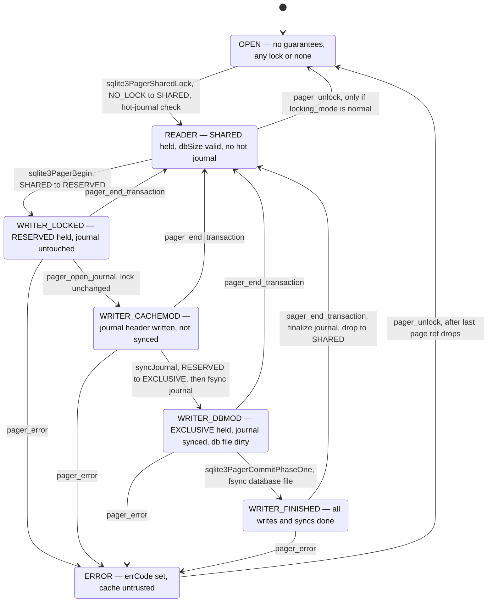

<!--
entry-meta
date: 2026-09-30
type: lesson
track: SQLite
lesson: 15
category: Database Internals
title: The Pager State Machine — Seven States, Three Locks, and the PENDING Byte Nobody Records
slug: sqlite-pager-state-machine-lock-states
-->

# The Pager State Machine — Seven States, Three Locks, and the PENDING Byte Nobody Records

**2026-09-30 · SQLite Track · Lesson 15 of 33**

## Where This Fits

- **Previous lesson:** [Lesson 14](../2026-09-29-sqlite-page-cache-pghdr-dirty-lists/README.md) took the page cache apart and stopped at the moment `xStress` calls `pagerStress()`. It showed that a spill in rollback mode writes uncommitted pages into the live database file, and left one promise open: *why that call is legal in `WRITER_CACHEMOD` and forbidden during rollback.*
- **This lesson pays that promise** and supplies the coordinate system the rest of Part II needs. `Pager.eState` and `Pager.eLock` are two independent variables, and almost every assertion in `pager.c` is a statement about their product.
- **What it adds:** the seven pager states (the syllabus says five lock states; there are five *lock levels* and seven *pager states*, and the pager can only name four of the five levels); `assert_pager_state()` as an executable invariant table; the exact function that performs each transition; the PENDING byte, which exists in the file but never in `Pager.eLock`; the busy-handler table and the one upgrade it deliberately refuses to retry; and the measured consequence of Lesson 14's spilling — a mid-transaction `EXCLUSIVE` lock.
- **Next:** Lesson 16 takes the rollback journal's file format and the commit sequence byte by byte. This lesson establishes *when* the journal is opened, synced, and finalized, and treats its contents as opaque; Lesson 16 opens it.

Source references are to `sqlite/sqlite` read through a code index during this run, cited by file and line range; the index served commit **`1059bc8`** of `master`. Measurements are on x86-64 Linux (kernel 6.18) against SQLite **3.53.4** via `apsw` 3.53.4.0, `page_size = 4096`, `journal_mode = delete` unless stated — the same tooling as Lessons 08–14. The build reports `ENABLE_SETLK_TIMEOUT` in `PRAGMA compile_options`, which matters in §7.

---

## 1. Seven Pager States, and Why the Count Is Not Five

`Pager.eState` has seven legal values, not five:

```c
#define PAGER_OPEN                  0
#define PAGER_READER                1
#define PAGER_WRITER_LOCKED         2
#define PAGER_WRITER_CACHEMOD       3
#define PAGER_WRITER_DBMOD          4
#define PAGER_WRITER_FINISHED       5
#define PAGER_ERROR                 6
                                          /* pager.c:351-357 */
```

The header comment above them is one of the most precise pieces of prose in the codebase — "A pager may be in any one of the seven states shown in the following state diagram" (`pager.c:135-136`). Each state is a *guarantee list*, not a label:

| `eState` | What is guaranteed | Lock floor (rollback mode) |
|---|---|---|
| `OPEN` | Nothing. "the file may or may not be locked and the database size is unknown" (`pager.c:174-176`); `dbSize`, `dbOrigSize`, `dbFileSize` untrustworthy | any, or none |
| `READER` | `dbSize` trustworthy; **"it is guaranteed that there is no hot-journal in the file-system"** (`pager.c:203-204`) | `SHARED` |
| `WRITER_LOCKED` | write txn open; `dbSize == dbOrigSize == dbFileSize == dbHintSize`; "Nothing (not even the first header) has been written to the journal" (`pager.c:233`) | `RESERVED` |
| `WRITER_CACHEMOD` | journal open, first header written **but not synced**; cache modified; db file untouched | `RESERVED` |
| `WRITER_DBMOD` | db file modified; journal header "written and synced to disk" | `EXCLUSIVE` |
| `WRITER_FINISHED` | everything written and synced; "not possible to modify the database further" | `EXCLUSIVE` |
| `ERROR` | `errCode != SQLITE_OK`; ≥1 outstanding page reference; not an in-memory pager | any |

Two structural facts fall straight out of the table:

- **WAL connections use only the first four states.** "A pager is never in WRITER_DBMOD or WRITER_FINISHED state if the connection is open in WAL mode" (`pager.c:340-342`), enforced by `assert( !pagerUseWal(pPager) )` in both cases (`pager.c:944`, `pager.c:957`). The reason given in `sqlite3PagerBegin` is savepoint rollback: in `DBMOD`/`FINISHED` the savepoint code "may copy data from the sub-journal into the database file as well as into the page cache. Which would be incorrect in WAL mode" (`pager.c:6029-6032`).
- **The state boundary between `CACHEMOD` and `DBMOD` is exactly the journal sync**, and the lock floor jumps from `RESERVED` to `EXCLUSIVE` across it. That single step is the whole of §8.

`ERROR` is the state most people never think about. It exists because an I/O error during *rollback* leaves the cache possibly inconsistent with the file, and returning to `READER` then would let a later reader report corruption or, worse, "upgrade to writers [and] inadvertently corrupt the database file" (`pager.c:293-296`). There are exactly three doors into it (`pager.c:309-320`): a failed rollback, a failed journal finalize in `CommitPhaseTwo`, and a failed write inside `pagerStress()`. The third one is required specifically because a spill can be triggered by a *read-only* statement inside a transaction, where "the b-tree layer would not automatically attempt a rollback" (`pager.c:325-330`). That is Lesson 14's spill path, wired into the error model.

---

## 2. Five Lock Levels, of Which the Pager Requests Three

The lock levels are VFS-layer constants, not pager constants:

```c
#define NO_LOCK         0
#define SHARED_LOCK     1
#define RESERVED_LOCK   2
#define PENDING_LOCK    3
#define EXCLUSIVE_LOCK  4
                                          /* os.h:98-102 */
```

and `os.h` states the restriction plainly: **"PENDING_LOCK may not be passed directly to sqlite3OsLock(). Instead, a process that requests an EXCLUSIVE lock may actually obtain a PENDING lock"** (`os.h:93-96`).

The pager enforces this twice over. `pagerLockDb()` — the *only* place `Pager.eLock` is raised — asserts the level is one of three:

```c
static int pagerLockDb(Pager *pPager, int eLock){
  int rc = SQLITE_OK;

  assert( eLock==SHARED_LOCK || eLock==RESERVED_LOCK || eLock==EXCLUSIVE_LOCK );
  if( pPager->eLock<eLock || pPager->eLock==UNKNOWN_LOCK ){
    rc = pPager->noLock ? SQLITE_OK : sqlite3OsLock(pPager->fd, eLock);
    if( rc==SQLITE_OK && (pPager->eLock!=UNKNOWN_LOCK||eLock==EXCLUSIVE_LOCK) ){
      pPager->eLock = (u8)eLock;
                                          /* pager.c:1161-1171 */
```

and `assert_pager_state()` asserts the variable never holds it:

```c
assert( p->eLock!=PENDING_LOCK );         /* pager.c:895 */
```

So `Pager.eLock` ranges over `NO_LOCK`, `SHARED_LOCK`, `RESERVED_LOCK`, `EXCLUSIVE_LOCK`, and one synthetic sixth value:

```c
#define UNKNOWN_LOCK                (EXCLUSIVE_LOCK+1)   /* pager.c:407 */
```

`UNKNOWN_LOCK` is a correctness patch with a specific attack in mind. Locks are updated conservatively — "eLock is always updated when unlocking the file, and only updated when locking the file if the VFS call is successful", so it "may be set to a less exclusive (lower) value than the lock that is actually held at the system level, but it is never set to a more exclusive value" (`pager.c:368-373`). That is harmless everywhere except one place: if `xUnlock` fails while leaving `ERROR`, the pager may still hold `EXCLUSIVE` without knowing. Then `xCheckReservedLock()`, defined as returning true "if there is a RESERVED lock held by this process or any others", returns true *because of this process's own lock* — "a hot-journal may be mistaken for a journal being created by an active transaction in another process, causing SQLite to read from the database without rolling it back" (`pager.c:387-393`). `UNKNOWN_LOCK` makes that case skip hot-journal detection entirely and assume a hot journal exists.

**PENDING is therefore a state the file can be in that the pager has no name for.** §6 observes it from outside the process.

---

## 3. What the Five Levels Actually Are: Byte Ranges

The locks are POSIX advisory record locks on three regions past the 1 GB mark:

```c
#ifdef SQLITE_OMIT_WSD
# define PENDING_BYTE     (0x40000000)
#else
# define PENDING_BYTE      sqlite3PendingByte
#endif
#define RESERVED_BYTE     (PENDING_BYTE+1)
#define SHARED_FIRST      (PENDING_BYTE+2)
#define SHARED_SIZE       510
                                          /* os.h:159-166 */
```

so on a default build: **PENDING = 1073741824, RESERVED = 1073741825, SHARED = 1073741826 … 1073742335** (510 bytes). The region is deliberately past 1 GB so that it almost never overlaps real data; the one page that *does* collide is `PENDING_BYTE_PAGE(pBt)` — `((PENDING_BYTE/pageSize)+1)` (`btreeInt.h:612`) — the never-used lock-byte page Lesson 13 met in the ptrmap arithmetic.

`unixLock()` maps levels onto these bytes as follows (`os_unix.c:1973-2057`):

| Requested | POSIX operation |
|---|---|
| `SHARED` | `F_RDLCK` on PENDING (temporary) → `F_RDLCK` on SHARED range → **unlock PENDING** |
| `RESERVED` | `F_WRLCK` on RESERVED byte (SHARED range read-lock retained) |
| `EXCLUSIVE` from `RESERVED` | `F_WRLCK` on PENDING byte → `F_WRLCK` on the whole SHARED range |

The temporary read-lock on the PENDING byte in the `SHARED` path is the entire anti-starvation mechanism, and it is easy to miss: a new reader must momentarily read-lock the same byte a waiting writer write-locks, so *a writer waiting for EXCLUSIVE blocks new readers without blocking existing ones.* The comment says only "A PENDING lock is needed before acquiring a SHARED lock and before acquiring an EXCLUSIVE lock. For the SHARED lock, the PENDING will be released" (`os_unix.c:1969-1971`).

Three assertions in `unixLock` restate the protocol as code (`os_unix.c:1934-1936`):

```c
assert( pFile->eFileLock!=NO_LOCK || eFileLock==SHARED_LOCK );
assert( eFileLock!=PENDING_LOCK );
assert( eFileLock!=RESERVED_LOCK || pFile->eFileLock==SHARED_LOCK );
```

— never jump from unlocked past SHARED; never ask for PENDING; always hold SHARED before asking for RESERVED.

**Measured.** `/proc/locks` exposes these ranges directly. One process holding each state, decoded (`major:minor` are hex in `/proc/locks`, the inode is decimal — an easy way to get a decoder silently returning nothing):

| Holder's `eState` | SQL that produced it | `/proc/locks` rows for the db inode |
|---|---|---|
| `READER` | `BEGIN; SELECT …` | `READ [1073741826 .. 1073742335]` |
| `WRITER_LOCKED` | `BEGIN IMMEDIATE` | `WRITE [1073741825 .. 1073741825]` + `READ [1073741826 .. 1073742335]` |
| `WRITER_CACHEMOD` | `BEGIN IMMEDIATE; UPDATE …` | **identical to `WRITER_LOCKED`** |
| `EXCLUSIVE` | `BEGIN EXCLUSIVE` | `WRITE [1073741824 .. 1073742335]` |

Two things worth stopping on:

1. **`WRITER_LOCKED` and `WRITER_CACHEMOD` are indistinguishable from outside the process.** The pager's state machine is strictly finer-grained than the file's lock state; the `CACHEMOD` transition is about the *journal*, not about locks.
2. **The `EXCLUSIVE` row is one 512-byte range, not three.** The kernel merged the PENDING byte, the RESERVED byte, and the 510-byte SHARED range into a single contiguous `F_WRLCK` — adjacent same-type POSIX locks coalesce. Note also that the PENDING byte is *not* released on the way to `EXCLUSIVE`: only the `SHARED` acquisition path drops it (`os_unix.c:2010-2014`).

---

## 4. `assert_pager_state()` Is the Invariant Table, Written Out

`assert_pager_state()` (`pager.c:847-976`) is the specification. A few of its clauses are worth quoting because they encode facts you would otherwise have to infer:

```c
/* Regardless of the current state, a temp-file connection always behaves
** as if it has an exclusive lock on the database file. It never updates
** the change-counter field, so the changeCountDone flag is always set. */
assert( p->tempFile==0 || p->eLock==EXCLUSIVE_LOCK );
assert( p->tempFile==0 || pPager->changeCountDone );
...
assert( pPager->changeCountDone==0 || pPager->eLock>=RESERVED_LOCK );
assert( p->eLock!=PENDING_LOCK );
                                          /* pager.c:860-895 */
```

and per state:

| `eState` | Its clauses (condensed from `pager.c:897-973`) |
|---|---|
| `OPEN` | `!MEMDB`; `errCode==SQLITE_OK`; pcache refcount 0 unless temp file |
| `READER` | `eLock!=UNKNOWN_LOCK`; `eLock>=SHARED_LOCK` |
| `WRITER_LOCKED` | `eLock>=RESERVED_LOCK` if not WAL; `dbSize==dbOrigSize==dbFileSize==dbHintSize`; `setSuper==0` |
| `WRITER_CACHEMOD` | `eLock>=RESERVED_LOCK` if not WAL; journal open (or mode OFF/WAL); `dbOrigSize==dbFileSize==dbHintSize` |
| `WRITER_DBMOD` | `eLock==EXCLUSIVE_LOCK`; `!pagerUseWal`; `dbOrigSize<=dbHintSize` |
| `WRITER_FINISHED` | `eLock==EXCLUSIVE_LOCK`; `!pagerUseWal` |
| `ERROR` | `errCode!=SQLITE_OK`; **pcache refcount > 0** unless temp file |

The `MEMDB` block (`pager.c:881-889`) proves the claim Lesson 14 made about `:memory:` databases having no back-pressure valve: an in-memory pager asserts `!isOpen(p->fd)`, `noSync`, and — the operative line — `p->eState != PAGER_ERROR && p->eState != PAGER_OPEN`. "Since this means an in-memory pager performs no IO at all, it cannot encounter either SQLITE_IOERR or SQLITE_FULL during rollback."

The `ERROR` refcount clause is the exit condition: "There must be at least one outstanding reference to the pager if in ERROR state. Otherwise the pager should have already dropped back to OPEN state." Recovery is not an action; it is the last page reference being released.

---

## 5. The Transitions, and the Function That Performs Each



The transition list is given verbatim at `pager.c:159-169`. Three of the edges deserve their code:

**`READER` → `WRITER_LOCKED`** is where the asymmetry between `BEGIN` and `BEGIN EXCLUSIVE` lives:

```c
/* Obtain a RESERVED lock on the database file. If the exFlag parameter
** is true, then immediately upgrade this to an EXCLUSIVE lock. The
** busy-handler callback can be used when upgrading to the EXCLUSIVE
** lock, but not when obtaining the RESERVED lock. */
rc = pagerLockDb(pPager, RESERVED_LOCK);
if( rc==SQLITE_OK && exFlag ){
  rc = pager_wait_on_lock(pPager, EXCLUSIVE_LOCK);
}
                                          /* pager.c:6013-6021 */
```

Note `pagerLockDb` (no retry) for `RESERVED` versus `pager_wait_on_lock` (retry loop) for `EXCLUSIVE`. That distinction is §7.

**`WRITER_CACHEMOD` → `WRITER_DBMOD`** happens inside `syncJournal`, and the lock escalation is its *first* act, before any I/O:

```c
static int syncJournal(Pager *pPager, int newHdr){
  assert( pPager->eState==PAGER_WRITER_CACHEMOD
       || pPager->eState==PAGER_WRITER_DBMOD );
  assert( !pagerUseWal(pPager) );

  rc = sqlite3PagerExclusiveLock(pPager);
  if( rc!=SQLITE_OK ) return rc;
  ...
  sqlite3PcacheClearSyncFlags(pPager->pPCache);
  pPager->eState = PAGER_WRITER_DBMOD;
                                          /* pager.c:4340-4446 */
```

This is the answer to Lesson 14's open question. `pagerStress()` calls `syncJournal(pPager, 1)` when the page has `PGHDR_NEED_SYNC` **or** the pager is in `WRITER_CACHEMOD` (`pager.c:4714-4718`). So a spill does not merely write a page — it drags the pager across the `CACHEMOD`→`DBMOD` boundary, which means taking an `EXCLUSIVE` lock. §8 measures it.

**`OPEN` → `READER`** carries the subtlest rule in the file. When a hot journal is found, the pager goes `SHARED` → `EXCLUSIVE` and deliberately does **not** stop at `RESERVED`:

```c
/* Get an EXCLUSIVE lock on the database file. At this point it is
** important that a RESERVED lock is not obtained on the way to the
** EXCLUSIVE lock. If it were, another process might open the
** database file, detect the RESERVED lock, and conclude that the
** database is safe to read while this process is still rolling the
** hot-journal back. */
rc = pagerLockDb(pPager, EXCLUSIVE_LOCK);
                                          /* pager.c:5355-5370 */
```

Because the intermediate `RESERVED` is skipped, a competing process reaches the same code and fails its own `EXCLUSIVE` attempt instead of reading a half-rolled-back file. Note this is one of the two `EXCLUSIVE` acquisitions in the codebase that is *not* preceded by `RESERVED` — and it is why `unixLock`'s PENDING step is conditioned on `pFile->eFileLock==RESERVED_LOCK` (`os_unix.c:1976`) rather than on the target level.

---

## 6. PENDING, Observed

The claim from §2 — that PENDING exists in the file but never in `Pager.eLock` — is directly observable. Three processes:

- **R1** opens a deferred read transaction and holds `SHARED` for 4 s.
- **W** does `BEGIN IMMEDIATE; UPDATE …` (now `WRITER_CACHEMOD`, `eLock == RESERVED_LOCK`), then `COMMIT`, which needs `EXCLUSIVE`. With `busy_timeout=6000` it blocks.
- **R2** then tries to start a brand-new read transaction with `busy_timeout=0`.

```
--- locks while W is blocked mid-escalation ---
  pid=634     WRITE [1073741824 .. 1073741825]  PENDING+RESERVED (kernel-merged)
  pid=632     READ  [1073741826 .. 1073742335]  SHARED range (all 510)
  pid=634     READ  [1073741826 .. 1073742335]  SHARED range (all 510)

  NEW READER: SQLITE_BUSY  after   0.000s
  WRITER: committed        after   4.036s
```

Everything in §2 and §3 is in those four lines:

- W holds the **PENDING byte** write-locked. Its `Pager.eLock` is still `RESERVED_LOCK` — the pager has no variable that can say what the file says.
- W also still holds its own `SHARED` read-lock, which is exactly why it cannot get `EXCLUSIVE` in a single step and why the kernel shows two rows for the same pid.
- R2 is refused **instantly**, not after a timeout, because its `F_RDLCK` on the PENDING byte conflicts with W's `F_WRLCK`. New readers are shut out; R1, already holding SHARED, is untouched.
- W commits 4.036 s in, the moment R1 releases — the PENDING lock is not a failure, it is a *queue position*, and this is the mechanism that stops a stream of readers from starving a writer forever.

---

## 7. The Busy Handler Is Not Invoked for the Upgrade You Care About

`pager.c` documents exactly which lock transitions may invoke the busy handler:

```
**   NO_LOCK       -> SHARED_LOCK      | Yes
**   SHARED_LOCK   -> RESERVED_LOCK    | No
**   SHARED_LOCK   -> EXCLUSIVE_LOCK   | No
**   RESERVED_LOCK -> EXCLUSIVE_LOCK   | Yes
                                          /* pager.c:3767-3771 */
```

and `pager_wait_on_lock` asserts it can only ever be called for those two "Yes" rows:

```c
static int pager_wait_on_lock(Pager *pPager, int locktype){
  assert( (pPager->eLock>=locktype)
       || (pPager->eLock==NO_LOCK && locktype==SHARED_LOCK)
       || (pPager->eLock==RESERVED_LOCK && locktype==EXCLUSIVE_LOCK)
  );
  do {
    rc = pagerLockDb(pPager, locktype);
  }while( rc==SQLITE_BUSY && pPager->xBusyHandler(pPager->pBusyHandlerArg) );
                                          /* pager.c:4000-4016 */
```

Taken alone this reads as "`busy_timeout` does nothing for `SHARED`→`RESERVED`". **That inference is wrong, and measuring it is how you find out.** `btree.c` has its own retry loop wrapping `sqlite3PagerBegin`, with one extra condition:

```c
}while( (rc&0xFF)==SQLITE_BUSY && pBt->inTransaction==TRANS_NONE &&
        btreeInvokeBusyHandler(pBt) );
                                          /* btree.c:3770-3771 */
```

`pBt->inTransaction==TRANS_NONE` is the whole story. The busy handler *is* applied to `SHARED`→`RESERVED`, but only when this connection has no transaction open yet. Measured against a holder sitting in `WRITER_LOCKED` for 2 s, writer `busy_timeout=4000`, three trials each:

| Writer's situation | Result |
|---|---|
| No transaction open; `BEGIN IMMEDIATE` | `OK` after 2.033 s / 2.034 s / 2.034 s |
| Already inside `BEGIN` holding `SHARED`; first `UPDATE` | **`SQLITE_BUSY` after 0.000 s** (all three trials) |

The second row is the deadlock the condition exists to prevent: retrying would mean waiting for a writer who needs my `SHARED` lock to go away, while I wait holding it. SQLite refuses rather than sleeping into a guaranteed timeout. This is the real content of the advice "use `BEGIN IMMEDIATE` if the transaction will write" — not a performance hint but the difference between a retryable `SQLITE_BUSY` and an unretryable one.

**What this run could not distinguish:** this build has `ENABLE_SETLK_TIMEOUT` compiled in, so a blocking VFS lock with a kernel-side timeout may be doing the waiting in row 1 instead of the busy-handler loop (`btree.c:3763-3768` breaks out of the loop on `SQLITE_BUSY_TIMEOUT` specifically so the handler is *not* invoked). The observable asymmetry is identical either way, but the attribution of row 1's 2.03 s to `btreeInvokeBusyHandler` rather than to `F_SETLKW` is not something I verified from outside the process.

---

## 8. Spilling Takes an EXCLUSIVE Lock in the Middle of Your Transaction

This is Lesson 14's spill, priced in concurrency rather than bytes. Identical workload — 1200 inserts of a 4000-byte blob inside one `BEGIN IMMEDIATE`, `journal_mode=delete` — sampled halfway through:

| `cache_size` | `CACHE_SPILL` at sample | db bytes mid-txn | `/proc/locks` mid-transaction |
|---|---|---|---|
| `50` | 1163 | 4,763,648 | `WRITE [1073741824 .. 1073742335]` — **full EXCLUSIVE** |
| `-200000` | 0 | 8,192 | `WRITE [1073741825]` + `READ [1073741826 .. 1073742335]` — RESERVED |

The chain is: cache full → `xFetch(createFlag=1)` refused → `sqlite3PcacheFetchStress` → `pagerStress()` → `syncJournal(pPager, 1)` → `sqlite3PagerExclusiveLock()` → `pager_wait_on_lock(EXCLUSIVE_LOCK)`. Once taken, the lock is held for the remainder of the transaction, because nothing downgrades a lock mid-transaction.

The operational consequence is larger than the one Lesson 14 reported:

- **With a large cache**, a long write transaction holds `RESERVED`. Readers are unaffected for the entire transaction; only the commit window excludes them.
- **With a small cache**, the *first spill* converts the transaction into a full reader-blocking `EXCLUSIVE` hold. A 30-second bulk insert becomes 30 seconds of `SQLITE_BUSY` for every reader in the system.

Nothing in the API reports this. `CACHE_SPILL` is the only signal, and it is a counter about memory, not about locking. A rollback-mode writer whose `cache_size` is slightly too small for its transactions will look, from the outside, exactly like a writer holding `BEGIN EXCLUSIVE` — which is why the memory accounting of Lesson 14 turns out to be a *concurrency* setting.

---

## 9. WAL Mode Removes the Bottom Half of the Machine

Same write transaction, `journal_mode=wal`, sampled mid-transaction:

```
--- WAL mode, mid-write-txn: locks on the DATABASE file ---
  pid=659     READ  [1073741826 .. 1073742335]  SHARED range (all 510)
--- WAL mode, mid-write-txn: locks on the -shm file ---
  pid=659     WRITE [120 .. 120]      WAL WRITE lock
  pid=659     READ  [124 .. 124]      read-mark slot 1
  pid=659     READ  [128 .. 128]      deadman switch
```

The database file never rises above `SHARED`; all write exclusion moves into the `-shm` file, whose offsets `os_unix.c:690-700` decodes as `PENDING_BYTE`-relative for the db and 120/121/122 = WAL WRITE/CKPT/RECOVER, 123+*i* = read-marks, 128 = deadman switch. This is consistent with §1: `WalBeginWriteTransaction()` replaces the `RESERVED` acquisition (`pager.c:6011`), and `WRITER_DBMOD`/`WRITER_FINISHED` are unreachable. Lessons 18–20 open the `-shm` file properly; the point here is only that the `EXCLUSIVE` escalation of §8 **cannot happen in WAL mode** — spilling in WAL mode appends frames (`pagerWalFrames`) and takes no database-file lock at all.

---

## 10. Hot Journal: the `OPEN` → `READER` Recovery Path, End to End

The `READER` guarantee "there is no hot-journal in the file-system" is established, not assumed. Killing a spilling writer with `SIGKILL` mid-transaction and then opening the database with a fresh connection:

```
  killing the writer with SIGKILL mid-transaction
  -rw-r--r-- 1 root root 1675264 h.db
  -rw-r--r-- 1 root root    9728 h.db-journal
  journal present before recovery: True  (9728 bytes)
  db size before recovery: 1675264
  rows visible after recovery: 0
  journal present after recovery: False
  db size after recovery: 8192
  integrity_check: ok
```

1.67 MB of uncommitted spilled pages were sitting in the live database file — §8's `EXCLUSIVE` hold and Lesson 14's mid-transaction file growth, both visible in one `ls`. The next connection's `sqlite3PagerSharedLock` found the journal via `hasHotJournal()` (`pager.c:5344`), took `EXCLUSIVE` while skipping `RESERVED`, ran `pagerSyncHotJournal()` then `pager_playback()`, set `eState = PAGER_OPEN` (`pager.c:5414-5420`), and only then proceeded to `READER`. The recovering connection never announced itself: the rollback happened inside the first `Connection` call, before any query ran.

---

## Hands-On

Environment: `pip install apsw` (3.53.4.0 here), Linux for `/proc/locks`.

### A. A lock decoder you can trust

```python
import os
PENDING  = 0x40000000
RESERVED = PENDING+1
SHFIRST  = PENDING+2
SHLAST   = SHFIRST+510-1

def decode(path):
    st = os.stat(path)
    want = (os.major(st.st_dev), os.minor(st.st_dev), st.st_ino)
    for ln in open("/proc/locks"):
        f = ln.split()
        if len(f) < 8: continue
        p = f[5].split(':')
        # major:minor are HEX, the inode is DECIMAL
        if (int(p[0],16), int(p[1],16), int(p[2])) != want: continue
        a = int(f[6]); b = a if f[7]=="EOF" else int(f[7])
        name = ("PENDING byte"            if (a,b)==(PENDING,PENDING)   else
                "RESERVED byte"           if (a,b)==(RESERVED,RESERVED) else
                "SHARED range (all 510)"  if (a,b)==(SHFIRST,SHLAST)    else
                "PENDING+RESERVED merged" if (a,b)==(PENDING,RESERVED)  else
                "EXCLUSIVE (merged)"      if (a,b)==(PENDING,SHLAST)    else "?")
        print(f"  pid={f[4]:<7} {f[3]:<5} [{a} .. {b}]  {name}")
```

**What to look for:** the mixed radix in `/proc/locks` field 6. Parsing the inode as hex yields an empty result set and looks exactly like "the kernel doesn't show SQLite's locks" — it cost me a debugging round. Run the holder in a **separate process**: two connections in one process are mediated by `unixInodeInfo` and the kernel only sees one lock, because POSIX record locks are per-process.

### B. Walk a transaction up the lock ladder

Hold each state in a subprocess (remembering that APSW executes lazily — `c.execute("begin").get`, or the statement silently never runs) and dump the locks:

```python
c.execute("begin").get; c.execute("select count(*) from t").get   # READER
c.execute("begin immediate").get                                  # WRITER_LOCKED
c.execute("begin immediate").get; c.execute("update t set b=zeroblob(200) where a=1").get  # CACHEMOD
c.execute("begin exclusive").get                                  # EXCLUSIVE
```

**What to look for:** `WRITER_LOCKED` and `WRITER_CACHEMOD` produce byte-identical output. That is the proof that `eState` and `eLock` are independent variables — the journal-header write that defines `CACHEMOD` is invisible at the lock layer. And `BEGIN EXCLUSIVE` shows *one* 512-byte range, not three: the kernel coalesced PENDING+RESERVED+SHARED, and PENDING was never dropped.

### C. Reproduce the unretryable `SQLITE_BUSY`

```python
c = apsw.Connection(db); c.setbusytimeout(4000)
# variant 1: no transaction open
c.execute("begin immediate").get
# variant 2: already holding SHARED
c.execute("begin").get; c.execute("select count(*) from t").get
c.execute("update t set b=zeroblob(300) where a=1").get
```

against another process holding `BEGIN IMMEDIATE`.

**What to look for:** variant 1 waits out the holder and succeeds; variant 2 raises `BusyError` in **under a millisecond** with a 4-second timeout configured. Time it — the number is the evidence. If you only read `pager.c:3767-3771` you would predict variant 1 fails too; if you only read `btree.c:3770` you would predict both succeed. The measurement is what pins down which loop is in charge.

### D. Catch the mid-transaction `EXCLUSIVE`

Start a `BEGIN IMMEDIATE` bulk insert with `pragma cache_size=50`, pause halfway, and dump locks from another process; repeat with `cache_size=-200000`.

**What to look for:** the small-cache run holds a full `EXCLUSIVE` range while the transaction is still open, and `os.path.getsize(db)` mid-transaction is megabytes rather than 8192. Then run the same thing under `journal_mode=wal` and watch the database file never leave `SHARED`. This is the single most useful diagnostic in the lesson: it tells you whether your writers are reader-friendly, and the answer depends on `cache_size`, not on your SQL.

### E. Manufacture and observe a hot journal

`kill -9` the spilling writer from D, then `ls -l` the directory before opening the database again.

**What to look for:** the `-journal` file, and a database file *larger* than its committed size. Then open a connection and do nothing but `select count(*)`: the journal is gone, the file is back to its pre-transaction size, and `PRAGMA integrity_check` says `ok`. You never asked for recovery — `sqlite3PagerSharedLock` did it on the way to `READER`.

---

## Where This Breaks Down

- **Rollback mode has no reader/writer concurrency at commit, by construction.** `WRITER_DBMOD` requires `EXCLUSIVE`, so every commit that touches the database file excludes every reader for the duration of the write plus fsync. This is not a tuning problem; it is the file format's locking protocol. WAL exists because of it.
- **`cache_size` is a concurrency setting in rollback mode, and nothing says so.** §8: one spill escalates to `EXCLUSIVE` for the rest of the transaction. The threshold is invisible, and it moves when page size or row size changes.
- **`busy_timeout` does not help the case people hit most.** A connection that opened a deferred `BEGIN`, read something, and then writes gets `SQLITE_BUSY` with zero retries (§7). Applications that wrap everything in `BEGIN` and rely on `busy_timeout` are relying on a mechanism that is switched off for them.
- **`Pager.eLock` can lag the real lock, deliberately.** It is "never set to a more exclusive value" than reality (`pager.c:372-373`), which means redundant `xLock` calls and locks held longer than needed are accepted as the price of never over-claiming. The one case where lagging is unsafe needed a whole extra pseudo-state, `UNKNOWN_LOCK`, plus a rule that hot-journal detection must be skipped when it is set.
- **PENDING is unrepresentable in the pager**, so the pager cannot report "I am queued for the write lock" — only `SQLITE_BUSY`. From the application's side a writer waiting behind a long-running reader and a writer contending with another writer are the same error code.
- **Hot-journal recovery serializes on `EXCLUSIVE` and is silent.** A crash leaves the next reader — any reader, including a read-only query — paying the full rollback cost, while holding a lock that excludes everyone. A read-only *connection* cannot even do it: `SQLITE_READONLY_ROLLBACK` (`pager.c:5350-5352`).
- **`ERROR` state persists while page references are outstanding.** A connection that hits an I/O error during rollback stays unusable until every statement is reset and every page reference dropped; the recovery trigger is refcount, not time or retry.
- **Locks are advisory POSIX record locks**, which means every classic caveat applies: they are per-process (hence `unixInodeInfo`), they are silently broken by many network filesystems, and a `close()` on *any* fd for the file in the process drops all of them. Lesson 18 takes this apart properly.

---

## Further Study

- [SQLite File Locking And Concurrency](https://sqlite.org/lockingv3.html) — the normative description of the five levels, and the conditions that make a journal hot.
- [Atomic Commit In SQLite](https://sqlite.org/atomiccommit.html) — the twelve-step commit sequence mapped onto the state machine above, plus the sector-size and super-journal rules that Lessons 16–17 need.
- [`src/os.h`](https://github.com/sqlite/sqlite/blob/master/src/os.h) — the lock-level constants and the `PENDING_BYTE` commentary, including the warning that changing it "results in a subtly incompatible file format".
- [`src/pager.c`](https://github.com/sqlite/sqlite/blob/master/src/pager.c) — the 200-line state-machine comment at the top is worth reading in full; it is the design document.
- [`src/os_unix.c`](https://github.com/sqlite/sqlite/blob/master/src/os_unix.c) — `unixLock`/`unixUnlock`, and the lock-string decoder near line 600 that names every byte offset used by both the db and `-shm` files.
- [PRAGMA locking_mode](https://sqlite.org/pragma.html#pragma_locking_mode) — the documented surface of the `exclusiveMode` behaviour that keeps a pager in `READER` after its read transaction closes.

## Next Steps

1. Instrument a real workload for the §8 escalation: sample `/proc/locks` at 10 Hz while your writers run, and count how often a `WRITE` range starting at `PENDING_BYTE` is held for longer than a commit should take. Every such sample is a spill-induced `EXCLUSIVE`.
2. Audit the codebase for deferred `BEGIN` followed by a write, and convert those to `BEGIN IMMEDIATE`. Experiment C is the regression test: assert that the busy timeout is actually honoured.
3. Build SQLite with `SQLITE_DEBUG` and call `print_pager_state()` (`pager.c:992`) from a debugger at a breakpoint in `pagerStress()` to see `eState`, `eLock`, `journalOff` and `journalHdr` together — the one place the two state variables are printed side by side.
4. Repeat Experiment D on a build *without* `ENABLE_SETLK_TIMEOUT` and re-time §7's row 1, to settle whether the 2.03 s wait is the busy-handler loop or a blocking `F_SETLKW`.
5. Run Experiment B against a database on a network filesystem and compare `/proc/locks` output; the absence of rows is how advisory-lock breakage presents, and it is the failure mode behind most "SQLite corrupted my database on NFS" reports.

## Sources

- [SQLite File Locking And Concurrency](https://sqlite.org/lockingv3.html)
- [Atomic Commit In SQLite](https://sqlite.org/atomiccommit.html)
- [`sqlite/sqlite` — `src/os.h`](https://github.com/sqlite/sqlite/blob/master/src/os.h)
- [`sqlite/sqlite` — `src/pager.c`](https://github.com/sqlite/sqlite/blob/master/src/pager.c)
- [`sqlite/sqlite` — `src/os_unix.c`](https://github.com/sqlite/sqlite/blob/master/src/os_unix.c)
- [`sqlite/sqlite` — `src/btree.c`](https://github.com/sqlite/sqlite/blob/master/src/btree.c)
- [PRAGMA Statements](https://sqlite.org/pragma.html#pragma_locking_mode)
- Source read by file and line range through a code index during this run at commit `1059bc8`: `src/pager.c` (130-420, 826-1020, 1151-1171, 3767-3787, 3990-4016, 4330-4470, 5324-5440, 5984-6060, 6485-6499, 7239-7243), `src/os.h` (87-172), `src/os_unix.c` (600-700, 1900-2060, 2223-2238), `src/btree.c` (2531-2539, 2714-2724, 3762-3776), `src/btreeInt.h` (602-612).

## Takeaways

- **Seven states, five lock levels, four namable locks.** `Pager.eState` has seven values; the VFS has five lock levels; `Pager.eLock` can hold four of them plus `UNKNOWN_LOCK`, and `assert( p->eLock!=PENDING_LOCK )` at `pager.c:895` makes the omission explicit. PENDING is a state the *file* can be in that the pager cannot name.
- **`eState` is finer-grained than the file's lock.** Measured: `WRITER_LOCKED` and `WRITER_CACHEMOD` produce byte-identical `/proc/locks` output. The `CACHEMOD` transition is about the journal, not about locking.
- **The `CACHEMOD`→`DBMOD` boundary *is* the `RESERVED`→`EXCLUSIVE` escalation**, because `syncJournal` calls `sqlite3PagerExclusiveLock()` as its first statement. Everything below that line in the state diagram requires `EXCLUSIVE`.
- **Cache spilling escalates to EXCLUSIVE mid-transaction.** Measured: `cache_size=50` produced a full `WRITE [1073741824..1073742335]` hold with the transaction still open and 4.7 MB of uncommitted data in the database file; `cache_size=-200000` held only `RESERVED`. In rollback mode, `cache_size` is a concurrency setting.
- **`busy_timeout` is silently inert for a write that follows a read in the same transaction.** Measured: `SQLITE_BUSY` in 0.000 s with a 4000 ms timeout, three trials, because `btree.c:3770` retries only when `pBt->inTransaction==TRANS_NONE`. `BEGIN IMMEDIATE` is a correctness choice, not a performance one.
- **The PENDING byte is a queue ticket, not an error.** Measured: a blocked writer held `WRITE [PENDING..RESERVED]`, a brand-new reader was refused in 0.000 s, the pre-existing reader was untouched, and the writer committed 4.036 s later the instant that reader left.
- **Hot-journal recovery goes `SHARED`→`EXCLUSIVE` and deliberately skips `RESERVED`**, so a competing process cannot mistake the recovering connection for an ordinary active writer and read a half-rolled-back file.
- **WAL mode deletes the bottom half of the machine.** Measured: a WAL write transaction never raised the database file above `SHARED`; `WRITER_DBMOD` and `WRITER_FINISHED` are unreachable and §8's escalation cannot occur.
