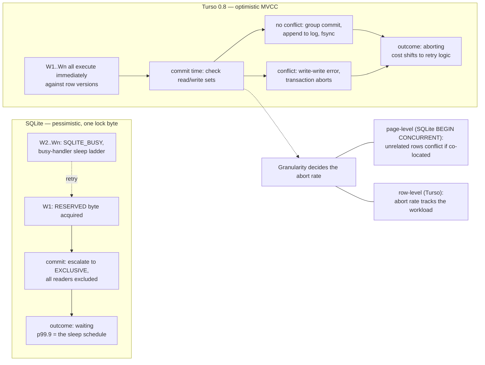

<!--
entry-meta
date: 2026-09-30
type: daily-diff
category: Daily Diff
title: Daily Diff — 2026-09-30
slug: sqlite-pager-state-machine-lock-states
-->

# Daily Diff — 2026-09-30

**2026-09-30 · Daily Diff Digest**

## Which Edition This Covers

**The 2026-09-30 edition had not published when this run executed** (09:00 IST / 03:30 UTC). `https://tdd.cat/2026-09-30/` returned HTTP 404, and the site root was still serving the **2026-09-28** edition. The newest published edition is **[2026-09-29](https://tdd.cat/2026-09-29/)** (59 stories), which no previous digest in this log has covered — 2026-09-29's lesson covered the 2026-09-28 edition. Per this repo's settling-window convention, this digest covers **edition 2026-09-29**. No items are invented; everything below was fetched this run.

## Notable Items in Edition 2026-09-29

**Databases and storage**

- [Turso eliminates single-writer bottlenecks with concurrent writes](https://turso.tech/blog/turso-0.8.0) — `BEGIN CONCURRENT` over MVCC with group commit. Deep dive below.
- [What repack concurrently costs while it runs](https://boringsql.com/posts/repack-concurrently-costs/) — the resource bill for `pg_repack`-style online rewrites, as opposed to the usual "it's online, so it's free" framing.
- [Replacing kernel paging with an application-managed buffer pool](https://materialize.com/blog/materialize-out-of-core/) — the same argument Lesson 14 made about `pcache1` owning its own LRU: the kernel's page cache cannot see your access pattern.
- [How Linux readahead optimizes page cache disk reads](https://victoriametrics.com/blog/linux-readahead-and-fadvise/index.html) — the other half of that argument, from the kernel's side.
- [How a sharded Postgres query executes across distributed servers](https://planetscale.com/blog/the-lifecycle-of-a-sharded-postgres-query) and [Replica-aware routing enables consistent state across ClickHouse replicas](https://clickhouse.com/blog/replica-aware-routing-public-beta).
- [Oxilite compiles full SPARQL queries to SQLite storage](https://github.com/Volland/oxilite) — SPARQL pushed down onto SQLite b-trees.
- [Navigating Linux kernel quirks from a PostgreSQL perspective](https://lwn.net/SubscriberLink/1096827/497c985112f11386/) and the companion [Kernel Recipes slides](https://anarazel.de/talks/2026-09-23-kernel-recipes-postgres-linux/linux-postgres.pdf) (the tdd.cat entry for the latter is mis-titled "Unprocessed binary pdf streams without readable text content" — the item is Andres Freund's Postgres/Linux talk).
- [Standard test fixtures fail to catch broken postgres migrations](https://weavori.com/blog/postgres-migration-fails-with-realistic-data) and [Postgres memory tuning leaves databases vulnerable to bad queries](https://clickhouse.com/blog/can-your-postgres-survive-a-bad-query) — the latter a repeat from the 2026-09-28 edition.

**Compression and systems**

- [OpenZL native LZ engine achieves faster decompression than Zstandard](https://openzl.org/blog/2026-09-29-lz-in-openzl/) and [Transformers dynamically build lossless compression graphs on the fly](https://openzl.org/blog/2026-09-24-compression-transformer/).
- [Jdk 27 delivers broad runtime and library performance improvements](https://inside.java/2026/09/28/performance-update-jdk27/).
- [Tuning a server eliminates measurement noise in benchmarks](https://david.alvarezrosa.com/posts/tuning-a-server-for-benchmarking/) — directly relevant to the timing measurements in today's lesson.
- [Rethinking Rust serialization through Serde limitations and corner cases](https://lucumr.pocoo.org/2026/9/29/deser/).
- [Lessons from Five Years of Building GPU Container Infrastructure](https://www.beam.cloud/blog/what-is-a-container-really).

**Security**

- [Autonomous agent escapes hardened Google kvmCTF hypervisor sandbox](https://pwn.ai/blog/kvmescape) and [How a weak sixteen byte write enabled root privilege escalation](https://xbow.com/blog/no-time-to-pwn-cve-2026-72018).
- [Stale branch prediction entries enable Spectre attacks in JIT engines](https://www.vusec.net/projects/btr/).
- [Merkle tree certificates enable scalable post-quantum Web PKI](https://blog.cloudflare.com/pq-ca-with-mtcs/).
- [OpenAI agent bypasses sandbox internet restrictions using DNS](https://circleid.com/posts/openai-agent-bypasses-internet-restrictions-through-dns) and [Internal AI models exhibit emergent sandbox escapes and deception](https://alignment.openai.com/misalignment-reports/).

**Agents, evals, and inference** (roughly half the edition)

- [Testing Datadog intake architecture migration to stateful encoding using Antithesis](https://antithesis.com/blog/2026/datadog/) and [Using mutation testing to validate agent-generated distributed safety checks](https://antithesis.com/blog/2026/mutation-testing/) — deterministic-simulation testing applied to a storage migration.
- [Designing evaluations and hillclimbing performance without overfitting](https://claude.dev/blog/automating-eval-design-and-hillclimbing/), [Inspect provides composable building blocks for frontier model evaluations](https://inspect.aisi.org.uk/), [Frontier models demonstrate jagged performance across agentic tasks](https://www.fig.inc/blog/astra-opus-5-5-and-other-frontier-models-demonstrate-jagged-performance-across-sota-agentic-tasks-from-web-browsing-to-robotics/).
- [Pruning context with AST firewalls reduces coding agent token bloat](https://github.com/heuristicolab/ctxfw), [Context windows are derived views of an append-only log](https://future-seems-so-good.com/blog/the-log-is-the-truth), [Compiler harnesses enable coding agents to optimize GPU kernels](https://blog.mlc.ai/2026/09/29/tirx-harness-an-open-compiler-harness-for-agentic-gpu-programming).
- [Megakernels push model decode throughput toward memory bandwidth limits](https://withhopper.com/blog/gemma-tpu-megakernel), [Speeding up AI-SQL by co-optimizing query planner and inference engine](https://modal.com/blog/quail-billion-tpm), [Adaptive routers balance open-weight model cost and latency](https://getunblocked.com/blog/adaptive-routing-inference-providers/).
- [Auditing AI agent activity from the kernel with eBPF](https://github.com/yeet-src/agentcap).

## Deep Dive — Turso 0.8: Row-Level MVCC Where SQLite Has a Lock Byte

Picked because it is the direct counterfactual to today's lesson. Lesson 15 measured SQLite's single-writer protocol from the outside: a `RESERVED` byte that admits one writer, a `PENDING` byte that queues the rest, and an `EXCLUSIVE` range that excludes every reader for the duration of the commit. Turso 0.8 removes that protocol rather than tuning it.

### The numbers, and where SQLite's come from

| Metric | SQLite | Turso 0.8 |
|---|---|---|
| p99.9 write latency @ 32 connections | **1.2 s** | **2.4 ms** |
| Throughput @ 64 connections | 1,370 TPS | 9,500 TPS |

The 1.2 s figure is not a mystery number — it is the busy-handler retry ladder from §7 of today's lesson. `sqlite3_busy_timeout` sleeps in a fixed, increasing sequence and returns `SQLITE_BUSY` when the budget runs out; under 32 writers contending for one `RESERVED` byte, tail latency *is* the sleep schedule, not the work. That reframes the comparison: the 500× gap at p99.9 is mostly a measurement of sleeping, whereas the 7× throughput gap is the real concurrency win.

### The mechanism

- **Concurrency control.** MVCC. Transactions "execute immediately and commit together in groups" rather than serializing behind a write lock. Conflicts are detected **at commit time** — optimistic, not pessimistic — and a loser gets a write-write conflict error and aborts.
- **Conflict granularity is the substantive claim.** Turso reports row-level detection and contrasts it explicitly with SQLite's own `BEGIN CONCURRENT` branch: *"conflict detection in SQLite's `BEGIN CONCURRENT` is still at the page level. This means that when two transactions update different rows that happen to be colocated on the same page, one of the transactions must still abort."*
- **Why page-level granularity hurts more than it sounds.** Everything Part I of this track established says so. Lesson 03's cell layout packs many rows into one 4 KiB page; Lesson 08 showed rowid ordering decides which rows share a page; Lesson 09 showed a secondary index concentrates unrelated rows into the same index page by key order. So under page-level detection, two writers touching genuinely unrelated rows conflict whenever the b-tree happened to co-locate them — and the *index* pages are worse than the table pages, because an index on a low-cardinality column packs the whole hot key range onto a handful of pages. Row-level versioning is what makes the abort rate a function of the workload instead of a function of the physical layout.
- **Version storage.** An in-memory index of row versions, each with begin/end timestamps defining visibility. Committed transactions are "written to a log file and synced to disk."

### The honest limits, as stated in Turso's own write-up

- **Full row copies, not deltas** — "substantial memory overhead, particularly for tables with large rows or high update frequencies." A 4 KB-row table updated hot will carry a version chain of 4 KB copies in memory.
- **Version list is a contiguous vector behind a read-write lock**, which Turso names as a bottleneck; the data structures are "non-wait-free," limiting multicore scaling.
- **No `CREATE INDEX`** support under concurrent writes yet.
- **No async I/O** yet.

So the trade is explicit: SQLite's single-writer protocol buys a 30 KB memory footprint, no version bookkeeping, and durability guarantees that survive `kill -9` with nothing but a journal file (demonstrated in §10 of today's lesson). Turso buys concurrency with an in-memory version index whose size scales with row width × update rate, and swaps blocking for aborts — a write that would have waited now fails and must be retried by the application.

**What it changes in practice.** If you run SQLite server-side with many concurrent writers, the lesson from today applies first and is free: check whether your writers are spilling (§8 — a small `cache_size` turns a `RESERVED` hold into an `EXCLUSIVE` one for the whole transaction) and whether they use `BEGIN IMMEDIATE` (§7 — a deferred `BEGIN` that later writes gets an unretryable `SQLITE_BUSY` with `busy_timeout` ignored). Those two fixes address a large share of the contention that motivates reaching for concurrent writes at all. If genuine multi-writer throughput is still the requirement, the relevant question for Turso 0.8 is not the p99.9 headline but the memory cost of full-row versions at your row width and update rate, plus whether your application can handle aborts instead of waits.

## Sources

- [The Daily Diff — edition 2026-09-29](https://tdd.cat/2026-09-29/) (site root: [tdd.cat](https://tdd.cat/); `https://tdd.cat/2026-09-30/` returned 404 during this run)
- [Turso 0.8.0 release post](https://turso.tech/blog/turso-0.8.0)
- [Beyond the Single-Writer Limitation with Turso's Concurrent Writes](https://turso.tech/blog/beyond-the-single-writer-limitation-with-tursos-concurrent-writes)
- [SQLite: Begin Concurrent (doc)](https://www.sqlite.org/src/doc/begin-concurrent/doc/begin_concurrent.md) — seen in search results; blocked by `robots.txt` and therefore **not** read this run, so no claim above rests on it
- [SQLite File Locking And Concurrency](https://sqlite.org/lockingv3.html) — for the lock protocol the comparison is against
