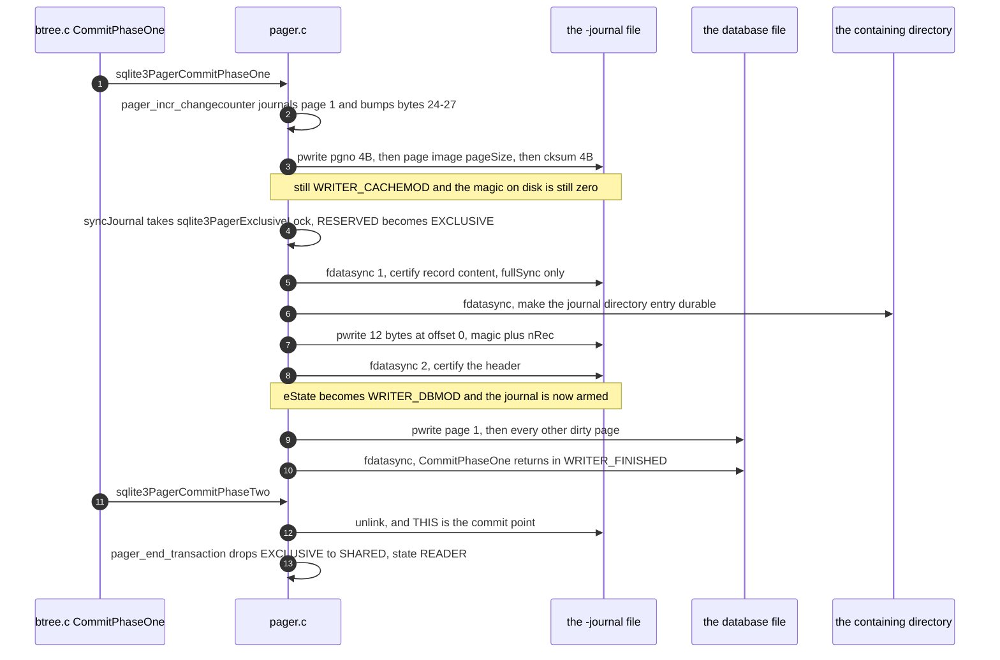
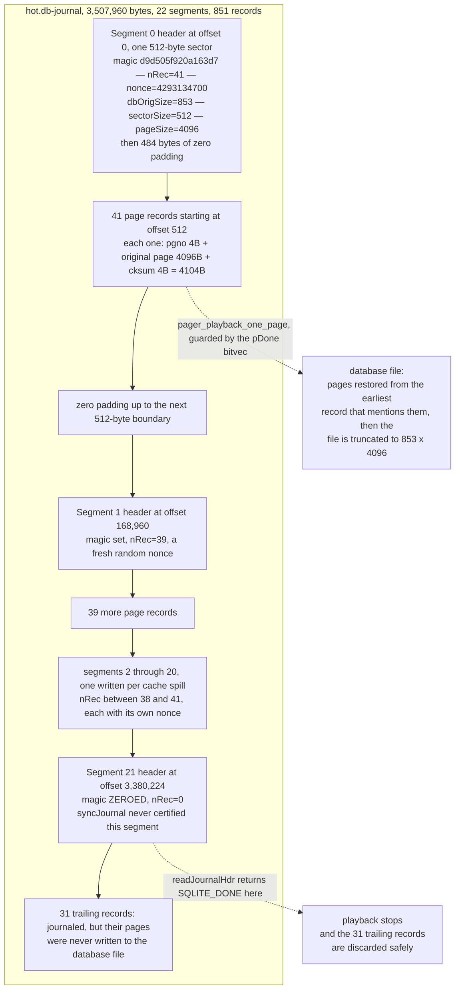

<!--
entry-meta
date: 2026-10-01
type: lesson
track: SQLite
lesson: 16
category: Database Internals
title: The Rollback Journal — Why the Magic Number Is Written Last
slug: sqlite-rollback-journal-atomic-commit
-->

# The Rollback Journal — Why the Magic Number Is Written Last

**2026-10-01 · SQLite Track · Lesson 16 of 33**

## Where This Fits

- **Previous lesson:** [Lesson 15](../../09/2026-09-30-sqlite-pager-state-machine-lock-states/README.md) built the coordinate system — seven `Pager.eState` values against five VFS lock levels — and established *when* the journal is opened, synced and finalized. It treated the journal's contents as opaque and named `syncJournal()` as the function that carries the pager from `WRITER_CACHEMOD` to `WRITER_DBMOD`.
- **This lesson opens the file.** The 28-byte header, the 512-byte sector padding, the page-record stride, the checksum formula, and the twelve bytes that `syncJournal()` writes back to offset 0.
- **What it adds:** a measured finding that no SQLite document states plainly — *the journal's magic number is not written when the journal is created.* The first twelve bytes stay zero until the moment before the database file is touched, which makes the magic number a durable flag meaning "the database file may now be dirty". Also: why one journal file contains many headers, why an append-only transaction journals almost nothing, and the exact syscall sequence of a commit at each `synchronous` level.
- **Next:** Lesson 17 takes hot-journal detection and super-journals. This lesson produces a hot journal and measures the rollback; Lesson 17 owns `hasHotJournal()`'s five conditions, the `SQLITE_READONLY_ROLLBACK` path, and multi-database commit.

Source references are to `sqlite/sqlite` read through a code index during this run, cited by file and line; the index served commit **`1f7010d`** of the default branch. Measurements are on x86-64 Linux (kernel 6.18) against SQLite **3.45.1** through Python's `sqlite3` module, `page_size = 4096`, `journal_mode = delete`, `synchronous = FULL` (the library default here reported `2`) unless stated. Syscall traces are `strace -f -y`. Note the version change from Lessons 08–15, which used APSW 3.53.4 — the journal format is unchanged across that gap (it has not changed since 3.5.8), but the `-y` fd-path annotation is what makes §7 readable, so the tooling moved.

---

## 1. The Header, Field by Field

`writeJournalHdr()` carries its own specification:

```
** The format for the journal header is as follows:
** - 8 bytes: Magic identifying journal format.
** - 4 bytes: Number of records in journal, or -1 no-sync mode is on.
** - 4 bytes: Random number used for page hash.
** - 4 bytes: Initial database page count.
** - 4 bytes: Sector size used by the process that wrote this journal.
** - 4 bytes: Database page size.
**
** Followed by (JOURNAL_HDR_SZ - 28) bytes of unused space.
                                          /* pager.c:1476-1484 */
```

The magic is a fixed eight-byte constant:

```c
static const unsigned char aJournalMagic[] = {
  0xd9, 0xd5, 0x05, 0xf9, 0x20, 0xa1, 0x63, 0xd7,
};
                                          /* pager.c:757-759 */
```

and the two size macros that govern the whole layout are one line each:

```c
#define JOURNAL_PG_SZ(pPager)  ((pPager->pageSize) + 8)   /* pager.c:765 */
#define JOURNAL_HDR_SZ(pPager) (pPager->sectorSize)       /* pager.c:771 */
```

So the file is: one sector of header, then a run of `pageSize + 8` byte records, then possibly another sector of header, and so on. Each record is laid down by three separate writes (`pager.c:6078-6083`):

| Offset in record | Size | Field |
|---|---|---|
| 0 | 4 | page number, big-endian (`write32bits`) |
| 4 | `pageSize` | the page's content **before** this transaction |
| `pageSize+4` | 4 | checksum |

followed by `pPager->journalOff += 8 + pPager->pageSize; pPager->nRec++;` (`pager.c:6092-6093`).

**Measured.** A 29-page database, one row updated, journal read while the transaction is still open:

```
journal size: 4616
magic:      0000000000000000      <-- note
nRec:       0
cksumInit:  1190438778
dbOrigSize: 29
sectorSize: 512
pageSize:   4096
first record: pgno=3 at offset 512
record stride: 4104  =>  (4616 - 512) / 4104 = 1.0
```

`sectorSize` is 512 rather than the 4096 the kernel reports for this filesystem, because `setSectorSize()` clamps it:

```c
if( pPager->tempFile
 || (sqlite3OsDeviceCharacteristics(pPager->fd) &
            SQLITE_IOCAP_POWERSAFE_OVERWRITE)!=0
){
  pPager->sectorSize = 512;
                                          /* pager.c:2802-2809 */
```

The comment explains the reasoning precisely: `sectorSize` exists "to define the 'blast radius' of bytes that might change if a crash occurs while writing to a single byte in that range. But with POWERSAFE_OVERWRITE, the blast radius is zero … so we minimize the sector size. For backwards compatibility of the rollback journal file format, we cannot reduce the effective sector size below 512" (`pager.c:2790-2798`). `SQLITE_POWERSAFE_OVERWRITE` has been the unix default since 3.7.10, so **512 is what you will almost always measure**, regardless of the hardware.

---

## 2. The Magic Number Is Written Last

That `magic: 0000000000000000` above is the most important measurement in this lesson, and it is a deliberate branch:

```c
if( pPager->noSync || (pPager->journalMode==PAGER_JOURNALMODE_MEMORY)
 || (sqlite3OsDeviceCharacteristics(pPager->fd)&SQLITE_IOCAP_SAFE_APPEND)
){
  memcpy(zHeader, aJournalMagic, sizeof(aJournalMagic));
  put32bits(&zHeader[sizeof(aJournalMagic)], 0xffffffff);
}else{
  memset(zHeader, 0, sizeof(aJournalMagic)+4);
}
                                          /* pager.c:1532-1539 */
```

The `else` branch zeroes **twelve** bytes — the magic *and* the record count. Everything after byte 12 is written immediately: a fresh random nonce (`sqlite3_randomness(sizeof(pPager->cksumInit), …)`, `pager.c:1544-1546`), then `dbOrigSize`, `sectorSize` and `pageSize` at offsets 16, 20, 24 (`pager.c:1565-1573`).

The first twelve bytes are filled in later, by `syncJournal()`, after the content is durable:

```c
/* Write the nRec value into the journal file header. If in
** full-synchronous mode, sync the journal first. This ensures that
** all data has really hit the disk before nRec is updated to mark
** it as a candidate for rollback. */
if( pPager->fullSync && 0==(iDc&SQLITE_IOCAP_SEQUENTIAL) ){
  rc = sqlite3OsSync(pPager->jfd, pPager->syncFlags);
  if( rc!=SQLITE_OK ) return rc;
}
rc = sqlite3OsWrite(
    pPager->jfd, zHeader, sizeof(zHeader), pPager->journalHdr
);
                                          /* pager.c:4398-4418 */
```

**Measured, the write is exactly 12 bytes at offset 0** (§7 has the full trace):

```
pwrite64(4<...db-journal>, "\331\325\5\371 \241c\327\0\0\0\2", 12, 0) = 12
                            d9 d5 05 f9 20 a1 63 d7  nRec = 2
```

This gives a clean invariant that follows from the code but that I have not seen stated in the documentation — so take it as an inference backed by measurement rather than a quote:

> Outside the three cases in the `if` above, **a valid magic number on disk means `syncJournal()` has run**, which means the pager reached `WRITER_DBMOD`, which means the database file may already contain uncommitted pages. A zeroed magic means the journal's content was never certified and the database file was never touched.

Both halves are directly observable. Same 799-row insert transaction, sampled mid-transaction, two cache sizes:

| `cache_size` | journal magic at offset 0 | database file size mid-txn |
|---|---|---|
| `-200000` (no spill) | `000000000000000000000000` | 1,646,592 — **unchanged** |
| `50` (spills) | `d9d505f920a163d7` + `nRec=2` | 4,759,552 — **grew by 3.1 MB** |

So the recovery rule that `readJournalHdr()` implements —

```c
if( memcmp(aMagic, aJournalMagic, sizeof(aMagic))!=0 ){
  return SQLITE_DONE;
}
                                          /* pager.c:1660-1662 */
```

— is not merely a corruption check. Returning `SQLITE_DONE` on a zeroed magic is *correct* in the ordinary case, because a journal that never got its magic describes a database file that never got modified. There is nothing to roll back.

The three exceptions matter. `synchronous=OFF` sets `noSync`, so the magic goes down immediately with `nRec = 0xffffffff`:

```
first 28 bytes: d9d505f920a163d7 ffffffff 1360fd69 00000192 00000200 00001000
                magic            nRec=-1  nonce    402 pg   512      4096
```

`0xffffffff` means "ignore the count, compute it from the file size" (`pager.c:2850-2854`), which is exactly the thing the count exists to prevent: "if a power failure occurred while the journal was being written, it could be the case that the size of the journal file had already been increased but the extra entries had not yet made it safely to disk. In such a case, the value of nRec computed from the file size would be too large" (`pager.c:2843-2848`). With `synchronous=OFF` you are opting into that risk; the comment is blunt that this is for temporary tables, where "we don't care".

---

## 3. The Checksum Samples 1 Byte in 200

```c
static u32 pager_cksum(Pager *pPager, const u8 *aData){
  u32 cksum = pPager->cksumInit;         /* Checksum value to return */
  int i = pPager->pageSize-200;          /* Loop counter */
  while( i>0 ){
    cksum += aData[i];
    i -= 200;
  }
  return cksum;
}
                                          /* pager.c:2289-2297 */
```

For a 4096-byte page that is 20 bytes sampled out of 4096 — offsets 3896, 3696, … 96 — summed into a 32-bit value seeded with the per-header nonce. It is not a hash, and the header comment does not pretend otherwise: "this 'checksum' scheme, though fast and simple, catches the mostly likely kind of corruption", which is that "one end or the other of the record will be changed. It is much less likely that the two ends of the journal record will be correct and the middle be corrupt" (`pager.c:2283-2288`).

The nonce is the part that actually does safety work, and the reason is specific: "garbage data that appears at the end of a journal is likely data that was once in other files that have now been deleted. If the garbage data came from an obsolete journal file, the checksums might be correct. But by initializing the checksum to random value which is different for every journal, we minimize that risk" (`pager.c:749-755`).

**Measured.** Reimplementing the formula in Python against a live journal:

```
first record pgno: 3   stored cksum: 1190438968   computed: 1190438968   match: True
   (cksumInit 1190438778 + 190 = the 20 sampled bytes summed to 190)
```

A nonce per *header*, not per journal — §5 shows ten headers in one file with ten different nonces. During playback the checksum is only enforced for the main journal and only for non-savepoint records:

```c
if( isMainJrnl ){
  rc = read32bits(jfd, (*pOffset)-4, &cksum);
  if( rc ) return rc;
  if( !isSavepnt && pager_cksum(pPager, (u8*)aData)!=cksum ){
    return SQLITE_DONE;
  }
}
                                          /* pager.c:2393-2399 */
```

`SQLITE_DONE` again — a bad checksum truncates the rollback at that record rather than failing it. "If the file opened as the journal file is not a well-formed journal file then all pages up to the first corrupted page are rolled back (or no pages if the journal header is corrupted). The journal file is then deleted and SQLITE_OK returned, just as if no corruption had been encountered" (`pager.c:2856-2860`).

---

## 4. 512 Bytes of Header for 4096 Bytes of Data

`JOURNAL_HDR_SZ` is the sector size, so the 28 bytes of real header cost a full 512-byte sector. And `writeJournalHdr` writes all 512 bytes rather than leaving a hole:

```c
for(nWrite=0; rc==SQLITE_OK&&nWrite<JOURNAL_HDR_SZ(pPager); nWrite+=nHeader){
  rc = sqlite3OsWrite(pPager->jfd, zHeader, nHeader, pPager->journalOff);
  pPager->journalOff += nHeader;
}
                                          /* pager.c:1600-1605 */
```

with the rationale given above it: writing only 28 bytes and skipping ahead "can be significantly slower than contiguously writing data to the file, even if that means explicitly writing data to the block of (JOURNAL_HDR_SZ - 28) bytes that will not be used" (`pager.c:1583-1593`). The loop exists because `zHeader` is `pPager->pTmpSpace`, only `pageSize` bytes, so a sector larger than a page needs several writes.

**Measured** — the journal cost of changing one row, by page size, sampled mid-transaction:

| `page_size` | journal bytes | breakdown |
|---|---|---|
| 512 | 1,032 | 512 header + 1 × 520 |
| 4096 | 4,616 | 512 header + 1 × 4,104 |
| 65536 | 66,056 | 512 header + 1 × 65,544 |

By commit the 4096 case reaches **8,720 bytes** — a second record appears, for page 1, because the change counter (§8) is itself a page write that must be journaled first. So a one-row `UPDATE` writes roughly 8.7 KB of journal plus 8 KB of database plus four `fdatasync` calls. That is the floor of rollback-mode write amplification, and it is why `page_size` tuning cuts both ways: bigger pages mean fewer records but a much larger minimum.

---

## 5. One Journal, Many Headers

`journalHdrOffset()` rounds the current offset up to the next sector boundary:

```c
static i64 journalHdrOffset(Pager *pPager){
  i64 offset = 0;
  i64 c = pPager->journalOff;
  if( c ){
    offset = ((c-1)/JOURNAL_HDR_SZ(pPager) + 1) * JOURNAL_HDR_SZ(pPager);
  }
  assert( offset%JOURNAL_HDR_SZ(pPager)==0 );
                                          /* pager.c:1403-1409 */
```

and a new header is appended whenever `syncJournal()` is called with `newHdr` set — which is what a cache spill does (Lesson 14's `pagerStress()` → Lesson 15's `syncJournal(pPager, 1)`):

```c
pPager->journalHdr = pPager->journalOff;
if( newHdr && 0==(iDc&SQLITE_IOCAP_SAFE_APPEND) ){
  pPager->nRec = 0;
  rc = writeJournalHdr(pPager);
  if( rc!=SQLITE_OK ) return rc;
}
                                          /* pager.c:4430-4435 */
```

**Measured.** `UPDATE t SET b=zeroblob(3000)` across 400 rows of an 853-page database with `cache_size=50`, journal walked mid-transaction:

```
journal size: 1,644,128   headers found: 10
  header@0        magic=yes  nRec=43  dbOrig=402  nonce=2464266148
  header@177152   magic=yes  nRec=43  dbOrig=402  nonce=1899009558
  header@354304   magic=yes  nRec=43  dbOrig=402  nonce=3947490975
  header@531456   magic=yes  nRec=43  dbOrig=402  nonce=2945120645
  header@708608   magic=yes  nRec=43  dbOrig=402  nonce=2860872592
  header@885760   magic=yes  nRec=43  dbOrig=402  nonce=1845213579
  header@1062912  magic=yes  nRec=43  dbOrig=402  nonce=70630115
  header@1240064  magic=yes  nRec=43  dbOrig=402  nonce=820125124
  header@1417216  magic=yes  nRec=43  dbOrig=402  nonce=2257234538
  header@1594368  magic=ZEROED  nRec=0  -> 12 records fill the remaining 49,248 bytes
total records: 9*43 + 12 = 399
```

Five things to read off this:

1. **Header spacing is the rounding rule, arithmetically.** `512 + 43 × 4104 = 176,984`; the next 512-multiple is `177,152`. Every subsequent header sits at that stride.
2. **43 is the spill batch size** at `cache_size=50`. It is not a journal parameter at all — it is the page cache's threshold, leaking into the file format.
3. **Each header carries its own nonce**, because `writeJournalHdr` re-rolls `cksumInit` every time. A record's checksum is only verifiable against the header that preceded it, which is why `readJournalHdr` resets `pPager->cksumInit` as it walks (`pager.c:1670`).
4. **`dbOrigSize` is identical in all ten** — it is a property of the transaction, not of the segment. It is the truncate target: "4 byte integer which is the number of pages to truncate the database to during a rollback" (`pager.c:2827-2828`). Measured on the hot journal in §10: `dbOrigSize = 853`, `853 × 4096 = 3,493,888` = the committed file size, exactly.
5. **The last header is zeroed and its 12 records are unreachable.** Playback walks headers until one fails the magic test, so those 12 records are discarded. That is safe for precisely the reason in §2: they were journaled but never spilled, so the database file still holds their originals.

The no-spill control makes the same point from the other side: same workload, `cache_size=-200000`, journal is **8,720 bytes with no magic anywhere** and the database file is untouched.

---

## 6. What Actually Gets Journaled

That control run is worth a second look. 799 inserts of 3 KB blobs — several megabytes of new data — produced a journal with **two** page records. The reason is the `dbOrigSize` boundary: a page that did not exist when the transaction began needs no original content saved, so `pager_write()` journals a page only if it is at or below `dbOrigSize`. The symmetry appears again in `pager_write_pagelist`, which skips a page when "the page number is greater than Pager.dbSize, or the PGHDR_DONT_WRITE flag is set" (`pager.c:4471-4472`), and in playback, which ignores records for pages past the end:

```c
if( pgno==0 || pgno==PAGER_SJ_PGNO(pPager) ){
  assert( !isSavepnt );
  return SQLITE_DONE;
}
if( pgno>(Pgno)pPager->dbSize || sqlite3BitvecTest(pDone, pgno) ){
  return SQLITE_OK;
}
                                          /* pager.c:2386-2392 */
```

`pgno==0` and the lock-byte page (`PAGER_SJ_PGNO`, the `PENDING_BYTE_PAGE` of Lesson 13 and Lesson 15 §3) are rejected outright; the `pDone` bitvec makes replay idempotent so a page appearing in several segments is restored only from its earliest record.

Two consequences that are easy to get backwards:

- **Append-heavy transactions are cheap in the journal and expensive nowhere else.** The journal tracks *pre-existing pages modified*, not bytes written. Bulk loading into a fresh table journals the b-tree interior pages and page 1, and that is roughly all.
- **In-place updates are the opposite.** The 400-row `UPDATE` above journaled 399 pages — 1.6 MB of journal to rewrite 1.6 MB of table, 1:1 write amplification before the database file is touched at all.

---

## 7. The Commit, Syscall by Syscall



**Measured**, `synchronous=FULL`, one row updated in a 13-page database, paths shortened:

```
pwrite64(4<s_full.db-journal>, "\0\0\0\1", 4, 4616)                       = 4
pwrite64(4<s_full.db-journal>, "SQLite format 3\0\20\0\1\1\0@  \0\0\0\311"..., 4096, 4620)
pwrite64(4<s_full.db-journal>, "q7\335\247", 4, 8716)                     = 4
fdatasync(4<s_full.db-journal>)                                           = 0
fdatasync(5</...the directory...>)                                        = 0
pwrite64(4<s_full.db-journal>, "\331\325\5\371 \241c\327\0\0\0\2", 12, 0) = 12
fdatasync(4<s_full.db-journal>)                                           = 0
pwrite64(3<s_full.db>, "SQLite format 3\0\20\0\1\1\0@  \0\0\0\312"..., 4096, 0)
pwrite64(3<s_full.db>, "\r\0\0\0\23\0?\0\0?\0171\16b\r\223"..., 4096, 8192)
fdatasync(3<s_full.db>)                                                   = 0
unlink("s_full.db-journal")                                               = 0
```

Everything in §1–§5 is in those eleven lines. The record at offset 4616 is `512 + 4104` — the *second* record, and its payload begins `SQLite format 3`, so it is page 1, journaled during commit by the change-counter increment. The twelve-byte write at offset 0 is the magic plus `nRec=2`. And the two page-1 images differ in one place: `\0\0\0\311` in the journal versus `\0\0\0\312` in the database — octal 311 and 312, decimal **201 and 202**. The journal holds the old change counter; the database gets the new one.

Lowering `synchronous` removes syncs from exactly the places the code says it should. Counting every sync between `COMMIT` and its return, with the target named:

| `synchronous` | journal content | directory | journal header | database | directory after `unlink` | total |
|---|---|---|---|---|---|---|
| `OFF` | — | — | — | — | — | **0** |
| `NORMAL` | ✓ *(covers both content and header — the 12-byte write happens before it)* | ✓ | — | ✓ | — | **3** |
| `FULL` | ✓ | ✓ | ✓ | ✓ | — | **4** |
| `EXTRA` | ✓ | ✓ | ✓ | ✓ | ✓ | **5** |

`FULL` versus `NORMAL` is the `if( pPager->fullSync && … )` at `pager.c:4409`, and nothing else. The documentation's description of the risk is narrow and matches: under `NORMAL` there is "a very small (though non-zero) chance that a power failure at just the wrong time could corrupt the database in journal_mode=DELETE on an older filesystem" — the window being that `nRec` can reach the platter before the records it counts. `EXTRA` is defined as "like FULL with the addition that the directory containing a rollback journal is synced after that journal is unlinked to commit a transaction in DELETE mode", and that is precisely the one extra line measured.

The directory sync under `NORMAL` and `FULL` is not the `EXTRA` one — it comes earlier, riding along with the first journal sync, and it is what makes the journal's *existence* durable before the database is modified. Without it a crash could leave a modified database and no journal in the directory.

---

## 8. The Change Counter Is Why Page 1 Is Always Journaled

Bytes 24–27 of the database header are the file change counter; bytes 92–95 are the version-valid-for number. Incrementing the counter means writing page 1, which means journaling page 1, which is the second record in every trace above.

**Measured** on a 52-page database:

```
after setup:   change_counter=51  version_valid_for=51
mid-txn:       change_counter=51  version_valid_for=51   <- on-disk header untouched
after commit:  change_counter=52  version_valid_for=52
after commit2: change_counter=53  version_valid_for=53
```

Three things follow:

- The on-disk counter does **not** move during the transaction (when nothing spills). It is bumped inside `CommitPhaseOne`, immediately before the database writes.
- `version_valid_for` tracks the counter in lockstep here, which is what lets a connection decide whether its cached schema and `dbFileVers[]` are still valid — the mechanism Lesson 07 used for schema reloads and Lesson 15 saw as `Pager.dbFileVers[]` being refreshed when page 1 is written (`pager.c:4475-4477`).
- **A hot journal can exist with an unincremented counter.** §10 measures exactly that. So "the counter changed" is not a reliable crash indicator; the journal's existence is.

---

## 9. Finalization: Three Ways to Disarm a Journal

Deleting the journal is the commit, but deletion is not the only way to make a journal non-hot. Traced, same one-row commit, three journal modes:

```
journal_mode=delete
    unlink("t_delete.db-journal") = 0

journal_mode=persist
    pwrite64(4<t_persist.db-journal>, "\0\0\0\0\0\0...\0" (28 zero bytes), 28, 0) = 28
    fdatasync(4<t_persist.db-journal>) = 0
    ...file remains, 8720 bytes, first 28 bytes zero

journal_mode=truncate
    ftruncate(4<t_truncate.db-journal>, 0) = 0
    fdatasync(4<t_truncate.db-journal>) = 0
    ...file remains, size 0
```

All three work because all three destroy the magic number, and §2 explains why that is sufficient. `PERSIST` zeroes 28 bytes — not 12 — so the nonce, `dbOrigSize`, `sectorSize` and `pageSize` go too; the docs describe it as "the header of the journal is overwritten with zeros". `TRUNCATE` leaves a zero-length file, which `readJournalHdr` rejects before reading anything:

```c
pPager->journalOff = journalHdrOffset(pPager);
if( pPager->journalOff+JOURNAL_HDR_SZ(pPager) > journalSize ){
  return SQLITE_DONE;
}
                                          /* pager.c:1644-1647 */
```

The tradeoff is the directory. `DELETE` modifies the directory on every commit (and must sync it); `TRUNCATE` and `PERSIST` never do, which is why they are faster on filesystems with expensive metadata operations and why `EXTRA`'s post-`unlink` directory sync only exists for `DELETE`.

---

## 10. Playback, Measured

Producing a genuine hot journal: a child process runs a spilling `UPDATE` against an 853-page database (400 rows of 3 KB blobs plus an index on the blob column) and is killed with `SIGKILL` mid-transaction.

```
committed db: 3,493,888   pages: 853   change counter: 402   md5: 84c7db858574
mid-txn:      journal 3,507,960   db 3,588,096   grew +94,208
```

Walking the dead journal segment by segment, following the format exactly — read `nRec`, skip that many records, round up to the next sector:

```
  seg  0 @         0  magic=YES     nRec=41  nonce=4293134700  dbOrig=853
  seg  1 @    168960  magic=YES     nRec=39  nonce=2637492854  dbOrig=853
  seg  2 @    329728  magic=YES     nRec=40  nonce=2083721002  dbOrig=853
  seg  3 @    494592  magic=YES     nRec=38  nonce=1756067878  dbOrig=853
  ...  segments 4 through 19, nRec between 38 and 40, each with a fresh nonce  ...
  seg 20 @   3223552  magic=YES     nRec=38  nonce=3587673832  dbOrig=853
  seg 21 @   3380224  magic=ZEROED  nRec=0   nonce=3074272683  dbOrig=853
                       -> 31 records fill the 127,224 trailing bytes

  segments: 22   records: 851   bytes consumed: 3,507,960   file size: 3,507,960   tail: 0
```

The walk consumes the file exactly, with no bytes left over — which is the strongest available evidence that the format description in §1 is complete and correctly understood. Then:

```
header0: nRec=41 nonce=4293134700 dbOrigSize=853 sector=512 pageSize=4096
dbOrigSize * pageSize = 3,493,888  ==  committed size 3,493,888 : True
change counter on disk after the kill: 402  (was 402)

after recovery: journal exists=False  size=3,493,888  md5=84c7db858574
                identical to pre-transaction file=True  integrity_check=ok  0.014s
```

What each line proves:

- **94,208 bytes of uncommitted pages were sitting in the live database file.** The transaction spilled 21 times; every spill ran `syncJournal` and wrote a magic number, so the journal is armed and the database is dirty — §2's invariant in its unhappy direction.
- **21 segments carry a valid magic and the 22nd does not.** Playback walks forward until `readJournalHdr` fails the magic test, so the 31 records after segment 21's header are discarded. They were journaled but never spilled, so the database file still holds their originals. The zeroed header is the barrier between "originals recorded, database possibly modified" and "originals recorded, database definitely untouched".
- **`nRec` is not constant — 38, 39, 40, 41.** The batch is whatever the page cache happened to be holding when `pagerStress()` fired, so the segment stride varies too (`512 + nRec×4104`, rounded up to 512). A parser that assumes a fixed stride works on §5's uniform case and breaks here.
- **`dbOrigSize × pageSize` is the committed size to the byte.** Rollback does not merely restore pages, it truncates: a transaction that grew the file leaves the growth behind, and `dbOrigSize` is how playback knows where to cut.
- **The change counter never moved** — 402 before the kill, 402 after — because `CommitPhaseOne` never ran. §8's warning, measured.
- **The md5 is bit-identical to the pre-transaction file.** This is the only honest check. A naive row count can mislead: in this dataset one row's original value genuinely equals `zeroblob(3000)` (the row where `i % 251 == 0`), so a "how many rows have the new value" probe returns 1 even after a perfect rollback. The digest is what proves the restoration.
- **14 ms, and nothing asked for it.** Recovery happened inside the first `connect()`/`SELECT`, via `sqlite3PagerSharedLock` → `hasHotJournal()` → `pager_playback()` — the `OPEN` → `READER` path of Lesson 15 §10.

### On-disk layout of that journal



---

## Hands-On

Python's stdlib `sqlite3` is enough; use `isolation_level=None` and explicit `BEGIN` so you control the transaction. `strace` for §7.

### A. Read a live journal header

```python
import sqlite3, os, struct, binascii
DB="a.db"
c=sqlite3.connect(DB, isolation_level=None)
c.execute("pragma page_size=4096"); c.execute("pragma journal_mode=delete")
c.execute("create table t(a integer primary key, b blob)")
c.executemany("insert into t values(?,?)", [(i, bytes([i%251])*200) for i in range(1,501)])
c.execute("begin immediate")
c.execute("update t set b=zeroblob(200) where a=1")

raw = open(DB+"-journal","rb").read()
nRec,nonce,dbOrig,sect,psz = struct.unpack(">IIIII", raw[8:28])
print("magic:", binascii.hexlify(raw[:8]).decode())
print(f"nRec={nRec} nonce={nonce} dbOrigSize={dbOrig} sector={sect} pageSize={psz}")
```

**What to look for:** `magic: 0000000000000000` and `nRec=0`, while every field past byte 12 is populated. That single line is §2. Then re-run with `pragma synchronous=off` before the `BEGIN` and watch the magic and `0xffffffff` appear immediately — you have just toggled the `pager.c:1532` branch from the outside.

### B. Verify the checksum formula

```python
def cksum(init, data, psz):
    s, i = init, psz-200
    while i > 0:
        s = (s + data[i]) & 0xffffffff
        i -= 200
    return s

pgno   = struct.unpack(">I", raw[sect:sect+4])[0]
data   = raw[sect+4 : sect+4+psz]
stored = struct.unpack(">I", raw[sect+4+psz : sect+8+psz])[0]
print(pgno, stored, cksum(nonce, data, psz), stored == cksum(nonce, data, psz))
```

**What to look for:** `True`. Then change the loop to `i -= 199` and watch it fail — the proof that the stride is a literal 200 and that only ~0.5% of each page is covered. Flip a byte at an unsampled offset (say `data[100]`) and the checksum still matches: that is the real limit of the scheme, not a bug.

### C. Make a journal grow extra headers

```python
c.execute("pragma cache_size=50")
c.execute("begin immediate")
c.execute("update t set b=zeroblob(3000)")       # in-place, so everything is journaled
raw = open(DB+"-journal","rb").read()
MAGIC = bytes([0xd9,0xd5,0x05,0xf9,0x20,0xa1,0x63,0xd7])
offs = [o for o in range(0, len(raw)-8, 512) if raw[o:o+8]==MAGIC]
for o in offs:
    print(o, struct.unpack(">II", raw[o+8:o+16]))   # nRec, nonce
```

**What to look for:** several headers, each with the same `nRec` and a *different* nonce, spaced by `ceil((512 + nRec*4104)/512)*512`. Then scan the tail: the final header has a zeroed magic. Repeat with `pragma cache_size=-200000` and you get one zero-magic header and nothing else — the contrast is the whole of §5 and §6. Use `UPDATE`, not `INSERT`: an append-only transaction journals almost nothing, which is §6's point and also the easiest way to accidentally conclude the journal is tiny.

### D. Trace the commit

```
strace -f -y -e trace=pwrite64,fsync,fdatasync,ftruncate,unlink python3 commit.py
```

with `commit.py` doing one `UPDATE` and `COMMIT`, run once per `synchronous` level.

**What to look for:** the 12-byte `pwrite` at offset 0 carrying `\331\325\5\371 \241c\327` — and *where* it sits relative to the `fdatasync` calls. Under `FULL` it is sandwiched between two journal syncs; under `NORMAL` both writes are covered by one sync. Count the syncs and name their targets with `-y`; without it the directory sync is an anonymous fd and the table in §7 is unreproducible. Then switch `journal_mode` to `persist` and `truncate` and watch `unlink` become a 28-byte zero write or an `ftruncate(0)`.

### E. Manufacture a hot journal and prove the rollback

`md5sum` the database, start a spilling `UPDATE` in a child process, `kill -9` it, then:

```
ls -l *.db *.db-journal      # database LARGER than its committed size
md5sum *.db                  # differs from the original
python3 -c "import sqlite3;sqlite3.connect('hot.db').execute('select 1')"
ls -l; md5sum *.db           # journal gone, size and digest restored
```

**What to look for:** `md5sum`, not row counts. A row count can match by coincidence (it did in §10). Also read `dbOrigSize` out of the dead journal and multiply by the page size — it will equal the pre-crash file size exactly, which is how you convince yourself that rollback truncates as well as restores.

---

## Where This Breaks Down

- **1:1 write amplification on in-place updates, minimum.** Every pre-existing page you modify is copied in full to the journal before the database is touched, so a transaction that rewrites 1.6 MB of table writes 1.6 MB of journal first (measured, §5). WAL inverts this — it writes the *new* page once — which is the single biggest reason WAL is faster for update-heavy work.
- **The minimum transaction is expensive.** Measured: one row changed costs 8,720 journal bytes, two database page writes and four `fdatasync` calls at `synchronous=FULL`. Raising `page_size` to reduce record count raises that floor proportionally (66 KB at `page_size=65536`).
- **The checksum covers 20 bytes of a 4096-byte page.** It catches truncated and garbage-tailed records, which is what it was designed for, and will cheerfully accept a record whose middle has been rewritten. It is not an integrity check on your data, and `PRAGMA integrity_check` after a recovery is checking the b-tree, not the journal.
- **`synchronous=NORMAL` in rollback mode has a real, narrow window**, not a theoretical one: it removes the sync that guarantees record content reaches the platter before `nRec` does. The nonce and the checksum are what stand between that window and silent corruption — which is exactly why both exist.
- **`nRec = 0xffffffff` discards the protection entirely.** `synchronous=OFF` and `journal_mode=MEMORY` both take this path, and the count is then derived from the file size — the quantity the header field was added to avoid trusting.
- **The spill batch size leaks into the file.** 43 records per segment at `cache_size=50` is a page-cache number appearing in an on-disk structure. Nothing in the format or the API says so, and it changes when you change `cache_size`, `page_size` or row width.
- **A crash leaves the cost with the next reader.** Recovery is synchronous, holds `EXCLUSIVE` (Lesson 15 §10), and is triggered by whoever opens the file next — including a read-only query. 14 ms here for a 3.5 MB journal; it scales with journal size.
- **The journal is part of the database.** Copying a database file without its `-journal` produces a file that will never be rolled back: the docs state that "if the previous write transaction failed, then it is important that any rollback journal (the -journal file) or write-ahead log (the *-wal file) be copied together with the database file itself" (§1.2 of *How To Corrupt*), and that "if the hot journal files are moved, deleted, or renamed after a crash or power failure, then automatic recovery will not work and the database may go corrupt" (§1.3). Backup tooling that globs `*.db` is a corruption generator.
- **Two names for one file means two journals.** "If two or more processes open the database using different names, then they will use different rollback journals and WAL files" (§2.6) — symlinks, hardlinks and bind mounts all qualify.
- **Everything above assumes the commit point is atomic.** `unlink()` returning is the commit, and that rests on the filesystem not leaving a partially deleted file behind. SQLite says as much and has no defense: "There is nothing SQLite can do to defend against these kinds of problems."

## Further Study

- [Atomic Commit In SQLite](https://sqlite.org/atomiccommit.html) — the canonical twelve-step narration of §7, plus §9's "Things That Can Go Wrong", including the observation that an IDE controller "lies and says that data has reached oxide while it is still held only in the volatile control cache".
- [How To Corrupt An SQLite Database File](https://sqlite.org/howtocorrupt.html) — §1.2, §1.3, §1.4 and §2.6 are all rollback-journal failure modes; read them before writing backup tooling.
- [SQLite Database File Format — The Rollback Journal](https://sqlite.org/fileformat2.html) — the normative field table, and the only place the checksum algorithm is specified as prose.
- [PRAGMA Statements](https://sqlite.org/pragma.html) — `journal_mode` and `synchronous`, including the exact definition of `EXTRA` that §7 measures.
- [`src/pager.c`](https://github.com/sqlite/sqlite/blob/master/src/pager.c) — the format comment at `pager_playback` (lines 2815–2871) is a second, independent specification of the file layout, written for the reader rather than the writer; comparing it to the one above `writeJournalHdr` is instructive.
- [SQLite File Locking And Concurrency](https://sqlite.org/lockingv3.html) — the conditions that make a journal hot, which Lesson 17 takes apart.

## Next Steps

1. Write a standalone journal parser — header walk, nonce tracking, checksum verification, record decode — and run it against journals captured from your own application. It is 60 lines and it is the only way to see your real spill behaviour.
2. Measure journal bytes per transaction in production. Instrument `os.path.getsize(db + "-journal")` just before `COMMIT`, or watch the file from outside. Compare against the bytes your SQL actually changed; the ratio tells you whether to move to WAL.
3. Re-run Experiment D on a filesystem without `POWERSAFE_OVERWRITE` (an older ext4 mount, or build with `SQLITE_POWERSAFE_OVERWRITE=0`) and check whether `sectorSize` in the header rises to 4096. If it does, re-measure the one-row journal cost: the header alone becomes 4 KB.
4. Diff the two independent format specifications in `pager.c` — the one at lines 1476–1484 and the one at 2815–2871 — against the published file-format page, and note which one mentions the truncate semantics of `dbOrigSize`. Only one does.
5. Build with `SQLITE_DEBUG` and enable `IOTRACE` to capture the `JHDR`/`JOUT`/`JSYNC` events (`pager.c:1601`, `6085`, `4411`). That gives the §7 sequence from inside the library, with page numbers, and can be cross-checked against `strace`.
6. Test your backup path by killing a writer mid-transaction, copying only the `.db` file to a new directory, and opening the copy. Confirm it comes up with uncommitted pages. Then do it again with the `-journal` alongside.

## Sources

- [Atomic Commit In SQLite](https://sqlite.org/atomiccommit.html)
- [SQLite Database File Format](https://sqlite.org/fileformat2.html)
- [How To Corrupt An SQLite Database File](https://sqlite.org/howtocorrupt.html)
- [PRAGMA Statements](https://sqlite.org/pragma.html)
- [SQLite File Locking And Concurrency](https://sqlite.org/lockingv3.html)
- [`sqlite/sqlite` — `src/pager.c`](https://github.com/sqlite/sqlite/blob/master/src/pager.c)
- Source read by file and line range through a code index during this run at commit `1f7010d`: `src/pager.c` (745-772, 1340-1420, 1471-1608, 1627-1700, 2279-2300, 2330-2400, 2789-2872, 4395-4500, 6050-6135).
- Measurements taken during this run: SQLite 3.45.1 via Python `sqlite3`, x86-64 Linux 6.18, `page_size=4096`, `sectorSize=512`, `strace -f -y`.

## Takeaways

- **The journal's magic number is written last, and that is load-bearing.** Measured: the first twelve bytes are zero for the whole of `WRITER_CACHEMOD`, and `syncJournal()` fills them with a single 12-byte `pwrite` at offset 0 immediately before the database file is written. A valid magic on disk therefore means the database may already be dirty; a zeroed one means it was never touched. `readJournalHdr`'s `SQLITE_DONE` on a bad magic is correctness, not just validation.
- **`nRec` exists because file size lies after a crash.** The count is written with the magic, after the records are durable. `0xffffffff` means "derive it from the file size" and is selected by `synchronous=OFF`, `journal_mode=MEMORY`, or a `SAFE_APPEND` device.
- **One journal file holds many segments, one per cache spill.** Measured: 10 headers, 43 records each, at a 177,152-byte stride that is exactly `ceil((512 + 43×4104)/512)×512` — and a different random nonce in every header, because a record's checksum is only meaningful against the header that preceded it.
- **The last header is always zeroed, and its records are deliberately unreachable.** Playback stops at the first bad magic; the trailing records describe pages the database file never received.
- **`dbOrigSize` is a truncate instruction.** Measured on a hot journal: `853 × 4096 = 3,493,888` = the committed file size to the byte, and the post-recovery md5 matched the pre-transaction file exactly.
- **The checksum samples one byte in 200**, seeded with a per-header nonce whose real job is to make stale garbage from a deleted journal fail to validate. Verified by reimplementing it; 20 bytes of a 4096-byte page are covered.
- **What gets journaled is pre-existing pages modified, not bytes written.** Measured: 799 blob inserts journaled 2 pages; a 400-row in-place `UPDATE` journaled 399. Appends are nearly free; updates are 1:1.
- **`synchronous` is a count of `fdatasync` calls, and you can count them.** Measured per commit: OFF 0, NORMAL 3, FULL 4, EXTRA 5 — the `FULL`/`NORMAL` difference being the single `if( pPager->fullSync … )` at `pager.c:4409`, and `EXTRA`'s extra call being a directory sync after `unlink`.
- **All three journal modes commit by destroying the magic**: `unlink` (DELETE), 28 zero bytes (PERSIST), `ftruncate(0)` (TRUNCATE). Measured in the trace; the choice is about directory metadata cost, not safety.
- **A hot journal can exist with an unincremented change counter.** Measured: 402 before the kill, 402 after, because `CommitPhaseOne` never ran. The journal's existence is the crash signal; bytes 24–27 are not.
