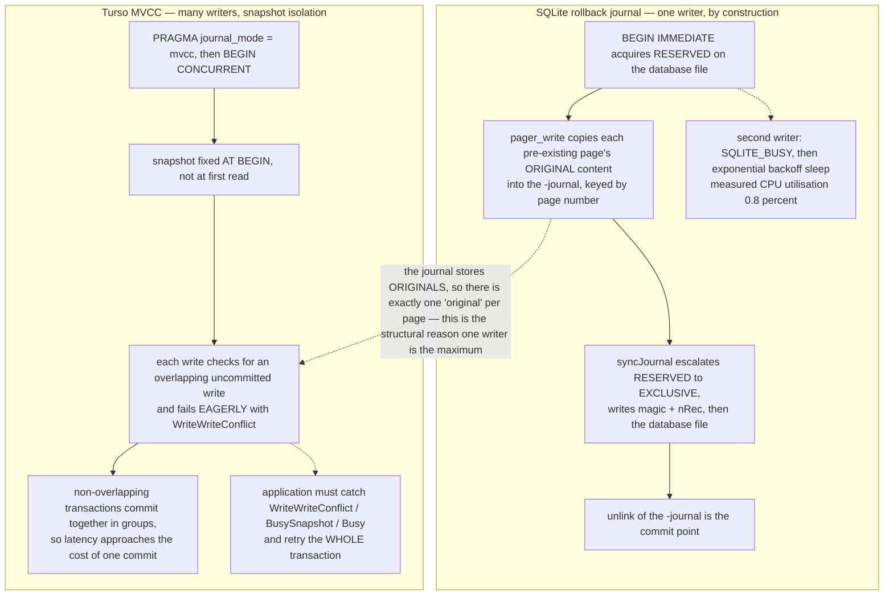

<!--
entry-meta
date: 2026-10-01
type: daily-diff
category: Daily Diff
title: Daily Diff — 2026-10-01
slug: sqlite-rollback-journal-atomic-commit
edition: 2026-09-29 (no newer edition published)
-->

# Daily Diff — 2026-10-01

**2026-10-01 · Daily Diff Digest**

## Edition status

**There is no 2026-10-01 edition of The Daily Diff at the time of this run** (03:35 UTC / 09:05 IST). Fetching https://tdd.cat/ served **Edition 066, Tuesday, September 29, 2026 (59 stories)**, and https://tdd.cat/archive/ confirms it is the newest: the archive's top three are 066 (Sep 29), 065 (Sep 28) and 064 (Sep 27). There is no Sep 30 and no Oct 1 edition.

So this digest covers **Edition 066 (2026-09-29)** — the latest published edition — and says so rather than inventing an Oct 1 edition or skipping the day.

---

## The edition, point-wise

59 stories. Grouped by what they actually are:

**Storage and database internals** — the part this log cares about

- **Turso 0.8.0 ships concurrent writes**, claiming p99.9 transaction latency of 2.4 ms against SQLite's 1.2 s. Deep-dive below.
- **`REPACK CONCURRENTLY` costs in PostgreSQL 19** — the new native online table rewrite is not free; the post measures what it costs *while it runs*, which is the number people skip.
- **Materialize replaces kernel paging with an application-managed buffer pool** — out-of-core execution tuned to NVMe's read/write bandwidth asymmetry. The recurring argument that a database knows its own access pattern better than the page cache does.
- **Replica-aware routing in ClickHouse (public beta)** — HTTP headers pin a session to the replica holding its temporary tables. A correctness fix dressed as a routing feature.
- **Postgres memory tuning leaves you exposed to one bad query** — per-operation limits (`work_mem` and friends) multiply by operation count, so a single query can still exhaust RAM.
- **The lifecycle of a sharded Postgres query** (PlanetScale) — planning and multiplexing across shards, end to end.
- **Tenant-id-first composite indexes** for multi-tenant Postgres — column order as the defence against tenant skew.
- **Two Postgres-meets-Linux-kernel talks** — an LWN subscriber article and Andres Freund's Kernel Recipes slides on I/O subsystem interaction.
- **Linux readahead and `fadvise`** — how the kernel's readahead heuristics actually fire, which is the other half of the previous two items.
- **OpenZL's native LZ engine** claims roughly double Zstandard's decompression throughput via a modular codec graph.
- **Oxilite compiles SPARQL to SQLite storage** — graph queries lowered onto a relational engine for edge deployment.

**Testing and verification**

- **Antithesis × Datadog**: deterministic simulation testing used to validate a stateful intake-pipeline migration.
- **Mutation testing to validate agent-generated safety checks** — inject synthetic bugs, see whether the generated invariants catch them. The right way to grade a generated assertion.
- **Standard test fixtures miss broken Postgres migrations** — hand-crafted fixture data dodges the constraint violations real data produces.
- **Tuning a server for benchmarking** — CPU isolation and frequency locking for repeatable microbenchmarks.

**Security**

- Merkle tree certificates for post-quantum Web PKI (Cloudflare), a 16-byte write escalated to root (CVE-2026-72018), stale branch-prediction entries enabling Spectre in JIT engines, and an autonomous agent escaping Google's kvmCTF hypervisor sandbox with a 14,338-line kernel exploit.

**Agents, inference and infrastructure** — the bulk of the edition

- Context pruning via AST firewalls, eBPF-based agent auditing, GPU kernel optimization harnesses, adaptive inference routing, megakernels, sparse-attention co-adaptation, eval design, and several "small local model calibrated to match a vendor classifier" posts. Volume is high; signal density is lower than the storage cluster above.

---

## Deep dive: Turso 0.8.0's concurrent writes

Picked because it attacks exactly the constraint today's track lesson dissects. [Lesson 16](README.md) shows why rollback-journal SQLite can have only one writer: the commit path escalates to an `EXCLUSIVE` lock on the database file, and the journal records *original* page content, so two concurrent writers would need two incompatible notions of "original".

### What the release claims

Following the item's source link to the release post:

- `PRAGMA journal_mode = 'mvcc'` enables it; transactions then start with **`BEGIN CONCURRENT`** instead of `BEGIN`.
- Benchmarked at 1,000 transactions/second Poisson arrival, 32 connections: **p99.9 of 2.4 ms for Turso versus 1.2 s for SQLite** — roughly 500×.
- Throughput at 64 connections, 100 rows per transaction on **disjoint keys**: **9,500 TPS versus 1,370 TPS**, roughly 7×.
- Hardware: 12-core/24-thread Ryzen 9 3900XT, 64 GB RAM, Kingston NV3 1 TB NVMe, XFS, Linux 7.2. Both engines at `PRAGMA synchronous = FULL`, compared against SQLite 3.50.2 at commit `fd41c07dc`.
- CPU utilisation at 32 connections: Turso 72%, SQLite **0.8%**.

That 0.8% is the most informative number in the post, and it is not a throughput claim. SQLite's writers are not CPU-bound and they are not I/O-bound either — they are *asleep*. The lock sits idle while a loser backs off, so the tail latency is the backoff schedule rather than any real work. The release post names this directly: blocked transactions "employ exponentially increasing sleep intervals while waiting, causing the lock to remain idle". Lesson 15 §7 measured the adjacent pathology from the other side — a deferred `BEGIN` that later writes gets `SQLITE_BUSY` with **zero** retries, so `busy_timeout` never even engages.

### What the post does not say, and the source does

The release post and the docs both stop at "one will receive a conflict error and must roll back and retry". Neither states the isolation level or when conflicts are detected. The repository does, in a comment at the top of the MVCC test suite (`tursodatabase/turso`, commit `33c1036`, `core/mvcc/database/hermitage_tests.rs:16-28`):

```
// Turso MVCC implements snapshot isolation with eager write-write conflict detection:
//
//   - Snapshot is taken at BEGIN (not at first read like FoundationDB)
//   - Write-write conflicts are detected immediately at write time (WriteWriteConflict),
//     NOT deferred to commit (like FoundationDB)
//   - Transactions never see uncommitted changes from other active transactions (no dirty reads)
//   - Isolation level: snapshot isolation (prevents G0, G1a, G1b, G1c, OTV, PMP, P4, G-single)
//   - Does NOT prevent G2-item (write skew) or G2 (anti-dependency cycles) — those require serializable
```

Four consequences that change how you would use this:

1. **Snapshot isolation, not serializable.** Write skew is permitted. The classic failure — two transactions each read a condition, each write a different row, and the invariant they jointly depended on breaks — is live. SQLite in rollback or WAL mode gives you serializable execution by brute force (one writer), so **moving from SQLite to `BEGIN CONCURRENT` is an isolation downgrade**, not a free speedup. The test suite is adapted from the Hermitage suite and is explicit that Turso sits where Postgres `REPEATABLE READ` sits, not where FoundationDB does.
2. **Conflicts are eager, at write time.** `LimboError::WriteWriteConflict` (`core/error.rs:106-107`, rendered as `"Write-write conflict"`) is raised by the write itself, not by `COMMIT`. Cheaper than FoundationDB's commit-time check — you stop doing work the moment you are doomed — but it means the error can surface from any statement, and your retry loop has to wrap the whole transaction rather than just the commit.
3. **The retryable set is wider than one error.** The engine's own retry sites match on three: `WriteWriteConflict`, `BusySnapshot`, and `Conflict(_)` (`core/connection.rs:464-471`), and the multiprocess tests additionally treat plain `Busy` as retryable with a 2 ms sleep (`core/multiprocess_tests.rs:2631-2636`). The docs' JavaScript and Python examples just string-match on `"conflict"` or `"busy"`, which is a fair summary of that mess but a poor thing to put in application code.
4. **Disjoint keys are doing real work in the benchmark.** "100 rows per transaction on disjoint keys" is the no-conflict case by construction. The 7× figure is the ceiling, not a workload average — a contended workload pays retries, and nothing published says how the retry cost scales.

### Where the designs actually diverge



The link at the bottom is the real point. A rollback journal is single-writer not because of a lock policy that could be relaxed, but because the file records *the* pre-transaction content of each page. There is one such content per page, so there can be one transaction defining it. WAL loosens this by versioning page images in a log; MVCC loosens it further by versioning rows and accepting that two transactions can be correct simultaneously — at the cost of serializability, which is the part the benchmark numbers do not price.

### Worth checking before believing it

- The comparison is against **SQLite 3.50.2**, in rollback or WAL mode — the post does not say which, and WAL versus DELETE changes SQLite's write path substantially (Lesson 15 §9 measured a WAL writer never raising the database file above `SHARED`). A `journal_mode=wal` baseline with `busy_timeout` set and `BEGIN IMMEDIATE` used correctly would be the honest comparison, and 0.8% CPU suggests the baseline was waiting, not working.
- Snapshot isolation under contention has no published retry-cost curve here.
- The isolation level is documented in a test-file comment, not in the product documentation. That gap is itself the finding: if you adopt `BEGIN CONCURRENT`, you are adopting semantics that the docs do not state.

---

## Sources

Edition and archive:

- [The Daily Diff](https://tdd.cat/) — served Edition 066, Tuesday, September 29, 2026
- [The Daily Diff — archive](https://tdd.cat/archive/) — confirms 066 (Sep 29) is the newest; no Sep 30 or Oct 1 edition
- [Edition 066 permalink](https://tdd.cat/2026-09-29/)

Deep-dive item and the sources followed from it:

- [Turso 0.8.0 — concurrent writes](https://turso.tech/blog/turso-0.8.0) (the item's source link)
- [Concurrent Writes — Turso docs](https://docs.turso.tech/tursodb/concurrent-writes)
- [Transactions — Turso SQL reference](https://docs.turso.tech/sql-reference/statements/transactions)
- [Beyond the Single-Writer Limitation with Turso's Concurrent Writes](https://turso.tech/blog/beyond-the-single-writer-limitation-with-tursos-concurrent-writes)
- [SQLite Concurrent Writes Are Here: Early Preview on Turso Cloud](https://turso.tech/blog/concurrent-writes-on-turso-cloud)
- [`tursodatabase/turso` — `docs/manual.md`](https://github.com/tursodatabase/turso/blob/main/docs/manual.md)
- [`tursodatabase/turso` — `examples/python/concurrent_writes.py`](https://github.com/tursodatabase/turso/blob/main/examples/python/concurrent_writes.py)
- `tursodatabase/turso` read by file and line through a code index during this run at commit `33c1036`: `core/mvcc/database/hermitage_tests.rs` (13-31), `core/error.rs` (101-113), `core/connection.rs` (459-471, 4113-4125), `cli/mvcc_repl.rs` (135-146), `core/multiprocess_tests.rs` (2625-2642, 2814-2842)

Other items referenced in the summary, as linked by the edition:

- [What `repack concurrently` costs while it runs](https://boringsql.com/posts/repack-concurrently-costs/)
- [Replacing kernel paging with an application-managed buffer pool](https://materialize.com/blog/materialize-out-of-core/)
- [Replica-aware routing in ClickHouse](https://clickhouse.com/blog/replica-aware-routing-public-beta)
- [Can your Postgres survive a bad query?](https://clickhouse.com/blog/can-your-postgres-survive-a-bad-query)
- [The lifecycle of a sharded Postgres query](https://planetscale.com/blog/the-lifecycle-of-a-sharded-postgres-query)
- [Navigating Linux kernel quirks from a PostgreSQL perspective (LWN)](https://lwn.net/SubscriberLink/1096827/497c985112f11386/)
- [PostgreSQL and Linux — Kernel Recipes 2026 slides](https://anarazel.de/talks/2026-09-23-kernel-recipes-postgres-linux/linux-postgres.pdf)
- [How Linux readahead optimizes page cache disk reads](https://victoriametrics.com/blog/linux-readahead-and-fadvise/index.html)
- [LZ in OpenZL](https://openzl.org/blog/2026-09-29-lz-in-openzl/)
- [Merkle tree certificates for post-quantum Web PKI](https://blog.cloudflare.com/pq-ca-with-mtcs/)
- [Tenant-id-first composite indexes for multi-tenant Postgres](https://now-next.nl/en/insights/multi-tenant-postgresql-indexes-tenant-id-first/)
- [Oxilite — SPARQL on SQLite storage](https://github.com/Volland/oxilite)
- [Testing Datadog's intake migration with Antithesis](https://antithesis.com/blog/2026/datadog/)
- [Mutation testing for agent-generated safety checks](https://antithesis.com/blog/2026/mutation-testing/)
- [Standard test fixtures fail to catch broken Postgres migrations](https://weavori.com/blog/postgres-migration-fails-with-realistic-data)
- [Tuning a server for benchmarking](https://david.alvarezrosa.com/posts/tuning-a-server-for-benchmarking/)
