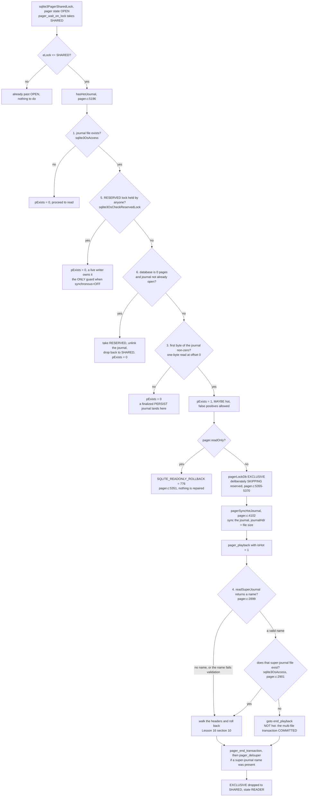
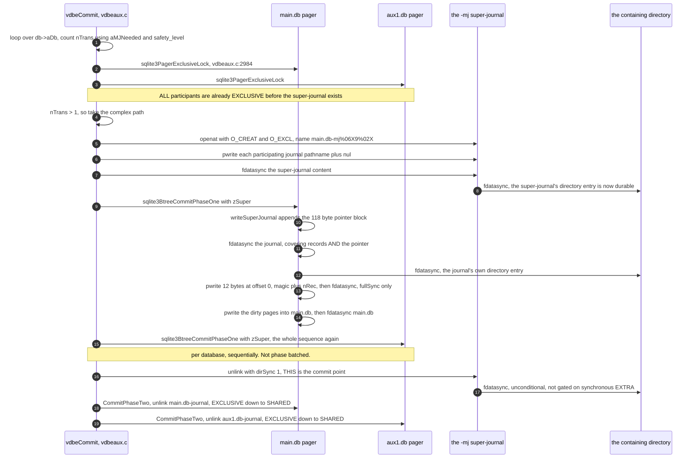
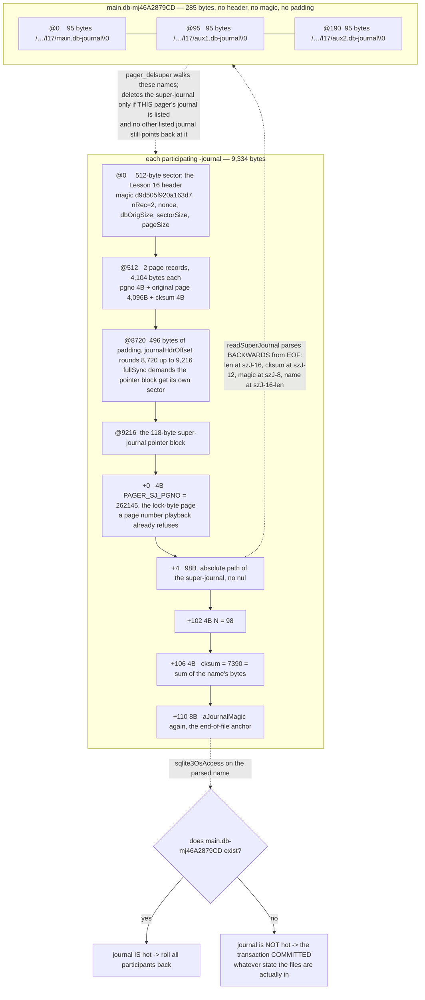

<!--
entry-meta
date: 2026-10-02
type: lesson
track: SQLite
lesson: 17
category: Database Internals
title: Hot Journals and the Super-Journal — A 285-Byte File Decides Whether Three Databases Commit
slug: sqlite-hot-journals-super-journal-recovery
-->

# Hot Journals and the Super-Journal — A 285-Byte File Decides Whether Three Databases Commit

**2026-10-02 · SQLite Track · Lesson 17 of 33**

## Where This Fits

- **Previous lesson:** [Lesson 16](../2026-10-01-sqlite-rollback-journal-atomic-commit/README.md) opened the journal file: the 28-byte header in a 512-byte sector, the `pageSize + 8` record stride, the one-byte-in-200 checksum, and the measured finding that `syncJournal()` writes the magic number *last*, in a single 12-byte `pwrite` at offset 0. It produced a hot journal with `SIGKILL` and measured the rollback end to end.
- **This lesson asks the question Lesson 16 left open:** given a journal file on disk, how does SQLite *decide* whether to roll it back — and what changes when one transaction spans several database files?
- **What it adds:** `hasHotJournal()`'s conditions measured one at a time (including the one case where the RESERVED-lock check is the only thing standing between a reader and a live writer's transaction); `SQLITE_READONLY_ROLLBACK`; and the super-journal — its name format, its contents, the 118-byte pointer block appended to every participating journal, and the `aMJNeeded[]` matrix that silently turns multi-file atomicity *off*. Two crash experiments show a byte-identical set of seven files committing or rolling back depending only on whether a 285-byte file exists, and a third shows that losing that file after a crash produces a **torn** transaction that `PRAGMA integrity_check` cannot see.
- **Next:** Lesson 18 takes the VFS proper — the `sqlite3_vfs` / `sqlite3_io_methods` dispatch tables, `unixInodeInfo` and intra-process lock emulation, the alternative locking styles in `os_unix.c`, `xCheckReservedLock`'s `UNKNOWN_LOCK` interaction, and `BATCH_ATOMIC`. This lesson uses `sqlite3OsCheckReservedLock()` as a black box; Lesson 18 opens it.

Source references are to `sqlite/sqlite` read by file and line through a code index during this run; the index served commit **`fde3a84d`** of the default branch. Measurements are on x86-64 Linux (kernel 6.18) against SQLite **3.45.1** through Python's `sqlite3` module, `page_size = 4096`, `journal_mode = delete`, `synchronous = FULL` unless stated — the same bench as Lesson 16. Syscall traces are `strace -f -y`. Two crash points are hit exactly rather than approximately, using small `LD_PRELOAD` shims that `_exit(9)` on a chosen syscall; the shims are in [Hands-On](#hands-on).

---

## 1. "Hot" Is Not a Property of the Journal File

Lesson 16 established that a journal with a zeroed magic describes a database that was never modified. That is the *sufficient* condition for ignoring a journal. The full decision is split across two functions, and they do not agree on what they check.

`hasHotJournal()` carries an unusually candid header comment:

```
** This routine does not check if there is a super-journal filename
** at the end of the file. If there is, and that super-journal file
** does not exist, then the journal file is not really hot. In this
** case this routine will return a false-positive. The pager_playback()
** routine will discover that the journal file is not really hot and
** will not roll it back.
                                          /* pager.c:5183-5188 */
```

So the canonical five-condition list in the documentation is not the implementation of one function. Side by side:

| # | [`lockingv3.html` §4.0](https://www.sqlite.org/lockingv3.html) says a journal is hot if… | Where the code actually tests it |
|---|---|---|
| 1 | "It exists" | `sqlite3OsAccess(…, SQLITE_ACCESS_EXISTS, &exists)` — `pager.c:5212` |
| 2 | "Its size is greater than 512 bytes" | **Not here.** `hasHotJournal` reads *one byte* at offset 0 and tests `first!=0` (`pager.c:5259-5267`). The size test is `readJournalHdr`'s `journalOff + JOURNAL_HDR_SZ > journalSize → SQLITE_DONE` (Lesson 16 §9) |
| 3 | "The journal header is non-zero and well-formed" | Split: byte 0 here, the full magic compare in `readJournalHdr` (`pager.c:1660-1662`) |
| 4 | "Its super-journal exists or the super-journal name is an empty string" | **Not here**, by design — `pager_playback` does it: `readSuperJournal` then `sqlite3OsAccess`, and `if( rc!=SQLITE_OK \|\| !res ) goto end_playback;` (`pager.c:2894-2905`) |
| 5 | "There is no RESERVED lock on the corresponding database file" | `sqlite3OsCheckReservedLock(pPager->fd, &locked)` — `pager.c:5225` |

There is also a sixth test that appears in no document, and it runs *before* the byte-0 check:

```c
if( nPage==0 && !jrnlOpen ){
  sqlite3BeginBenignMalloc();
  if( pagerLockDb(pPager, RESERVED_LOCK)==SQLITE_OK ){
    sqlite3OsDelete(pVfs, pPager->zJournal, 0);
    if( !pPager->exclusiveMode ) pagerUnlockDb(pPager, SHARED_LOCK);
  }
  sqlite3EndBenignMalloc();
}else{
                                          /* pager.c:5240-5247 */
```

with the reasoning given above it: a zero-page database beside a journal means "either (1) the journal is a remnant from a prior database with the same name where the database file but not the journal was deleted, or (2) the initial transaction that populates a new database is being rolled back" (`pager.c:5232-5239`). Either way the journal is garbage, so it is deleted rather than played.

### Measured, one condition at a time

**Condition 3 — existence is not hotness.** `journal_mode=persist`, one clean commit, then open the database again:

```
  p.db-journal exists, size=8720
  first 28 bytes = 00000000000000000000000000000000000000000000000000000000
  byte0 = 0  ->  hasHotJournal sets *pExists = 0
  after open: journal still there = True   db md5 unchanged = True
```

Lesson 16 §9 showed `PERSIST` finalizes by zeroing 28 bytes. This is the consumer of that: the file survives every commit for the life of the connection and is skipped on the strength of a single byte.

**Condition 6 — `nPage==0`.** A real armed journal placed beside a database file truncated to zero length:

```
  before: z.db size=0   journal size=4616   byte0=217
  query  : select count(*) from sqlite_master -> (0,)
  after  : z.db size=0   journal exists=False
```

The journal was deleted, not played back — and note this happens on a *read*. A `SELECT` against an empty file performed a `RESERVED` lock acquisition and an `unlink`.

**Condition 5 — the only guard that matters, in exactly one case.** For a `synchronous=FULL` writer, condition 3 already protects a live transaction: the magic is zero until `syncJournal()` runs, and by then the writer holds `EXCLUSIVE`, so no second connection can even reach `SHARED`. But Lesson 16 §2 showed `synchronous=OFF` takes the other branch of `pager.c:1532-1539` and writes the magic *immediately*, with `nRec = 0xffffffff`. That journal is byte-0-nonzero while the writer holds only `RESERVED`:

```
  journal byte0=217  magic_ok=True  nRec=0xffffffff  size=4616
  -> condition 3 PASSES on a live writer's journal.
  concurrent reader sees length(b)=200 (the old value); journal still present=True
  after the writer's COMMIT: length(b)=77
```

`217` is `0xd9`, the first byte of `aJournalMagic[]`. Without `sqlite3OsCheckReservedLock()` that reader would have taken `EXCLUSIVE` and rolled back a transaction that was still running. This is the one configuration where condition 5 is load-bearing rather than belt-and-braces — and it is a configuration people choose for speed.

### The race the code accepts

`sqlite3OsAccess()` and `sqlite3OsCheckReservedLock()` are two syscalls with a gap between them, and the comment says so:

```
** Race condition here:  Another process might have been holding the
** the RESERVED lock and have a journal open at the sqlite3OsAccess()
** call above, but then delete the journal and drop the lock before
** we get to the following sqlite3OsCheckReservedLock() call.  If that
** is the case, this routine might think there is a hot journal when
** in fact there is none.  This results in a false-positive which will
** be dealt with by the playback routine.  Ticket #3883.
                                          /* pager.c:5217-5223 */
```

`SQLITE_CANTOPEN` on the journal is treated the same way — "assume that the journal is hot. This might be a false positive. But if it is, then the automatic journal playback and recovery mechanism will deal with it under an EXCLUSIVE lock where we do not need to worry so much with race conditions" (`pager.c:5269-5277`). The design is deliberate: **`hasHotJournal()` is allowed to be wrong in the safe direction, and all precision is deferred to a path that holds `EXCLUSIVE`.**



---

## 2. Why Rollback Skips RESERVED on the Way to EXCLUSIVE

Lesson 15 established `NO_LOCK → SHARED → RESERVED → PENDING → EXCLUSIVE` as the escalation path for a writer. Recovery deliberately breaks it:

```
** Get an EXCLUSIVE lock on the database file. At this point it is
** important that a RESERVED lock is not obtained on the way to the
** EXCLUSIVE lock. If it were, another process might open the
** database file, detect the RESERVED lock, and conclude that the
** database is safe to read while this process is still rolling the
** hot-journal back.
                                          /* pager.c:5355-5360 */
```

The documentation says the same thing in one parenthetical — "Acquire a PENDING lock then an EXCLUSIVE lock on the database file. (Note: Do not acquire a RESERVED lock because that would make other processes think the journal was no longer hot.)" (`lockingv3.html` §4.1 step 3).

This is condition 5 eating its own tail. `RESERVED` means "a writer is live, leave its journal alone"; a recoverer taking `RESERVED` would publish exactly that lie about a database that is mid-repair. The consequence is stated plainly: "any other process attempting to access the database file will get to this point in the code and fail to obtain its own EXCLUSIVE lock" (`pager.c:5362-5365`) — concurrent recoverers collide on the lock rather than on the file, which is where you want a collision.

---

## 3. `pagerSyncHotJournal()` — Sync Someone Else's Journal Before Trusting It

Between taking `EXCLUSIVE` and playing the journal there is one more step, four lines long:

```c
static int pagerSyncHotJournal(Pager *pPager){
  int rc = SQLITE_OK;
  if( !pPager->noSync ){
    rc = sqlite3OsSync(pPager->jfd, SQLITE_SYNC_NORMAL);
  }
  if( rc==SQLITE_OK ){
    rc = sqlite3OsFileSize(pPager->jfd, &pPager->journalHdr);
  }
  return rc;
}
                                          /* pager.c:4102-4111 */
```

Two distinct jobs in those lines:

- **The sync**, whose rationale is "if a power-failure occurs during the rollback, the process that attempts rollback following system recovery sees the same journal content as this process" (`pager.c:4094-4097`). The crashed writer may have left journal bytes in page cache that were never flushed. Rollback is not idempotent across *different* views of the journal, so the recoverer first makes its own view durable, then plays it.
- **`journalHdr = file size`**, which the header comment describes as telling "the `pager_playback()` routine … that the entire journal file has been synced" (`pager.c:4090-4092`). `journalHdr` is normally the offset of the current header; here it is overloaded as a high-water mark meaning "everything below this is durable".

### `isHot` is a one-bit distinction with three consequences

`pager_playback(Pager*, int isHot)` is reached two ways: from recovery with `isHot = !pPager->tempFile` (`pager.c:5418`), and from an in-process rollback with `isHot = 0`. The flag does three things:

| Where | Code | Effect when `isHot` |
|---|---|---|
| Cache reset | `needPagerReset = isHot;` — `pager.c:2907` | The page cache is discarded before the first page is restored. A recoverer's cache may hold pages read from a database that the journal is about to rewrite; an in-process rollback's cache is already consistent with its own writes |
| Header parsing | `readJournalHdr(pPager, isHot, szJ, &nRec, &mxPg)` — `pager.c:2919` | Governs whether the journal's own `sectorSize` and `pageSize` are adopted, since a foreign process may have written it with different values. `setSectorSize(pPager)` at `pager.c:3058` undoes that afterwards |
| Logging | `if( isHot && nPlayback ){ sqlite3_log(SQLITE_NOTICE_RECOVER_ROLLBACK, "recovered %d pages from %s", …); }` — `pager.c:3048-3051` | The only externally visible signal that a crash recovery happened at all. Nothing in the SQL API reports it |

There is also a subtle repair after any playback:

```c
pPager->changeCountDone = pPager->tempFile;
                                          /* pager.c:3029 */
```

because rollback may have reverted the change counter Lesson 16 §8 measured, and "if this happens in exclusive mode, then subsequent transactions performed by the connection will not update the change-counter at all. This may lead to cache inconsistency problems for other processes" (`pager.c:3020-3027`).

---

## 4. `SQLITE_READONLY_ROLLBACK` — A Crashed Database Is Not Readable

Recovery is a write. A read-only pager therefore cannot perform it, and SQLite does not degrade gracefully:

```c
if( bHotJournal ){
  if( pPager->readOnly ){
    rc = SQLITE_READONLY_ROLLBACK;
    goto failed;
  }
                                          /* pager.c:5349-5353 */
```

```c
#define SQLITE_READONLY_ROLLBACK       (SQLITE_READONLY | (3<<8))
                                          /* sqlite.h.in:558 */
```

**Measured.** A spilling writer killed with `SIGKILL` against a 2.5 MB database, leaving a 2,510,464-byte armed journal, then opened `mode=ro`:

```
  hot journal: size=2510464 byte0=217 magic_ok=True
  db grew: 2514944 -> 3289088;  md5 now differs: True
  read-only open FAILED: OperationalError: attempt to write a readonly database
      code=776  name=SQLITE_READONLY_ROLLBACK      (8 | (3<<8) = 776)
  journal still present after the failed read-only open: True
  read-write open recovers: integrity=ok  md5 restored: True  journal gone: True
```

The error *message* is `attempt to write a readonly database` — generic, and misleading if you only look at the primary code `SQLITE_READONLY` (8). The extended code is the whole diagnosis. Three operational consequences:

- A database on genuinely read-only media that crashed before being made read-only is **permanently unreadable** by SQLite. There is no "read it anyway, ignoring the journal" mode.
- `mode=ro` in a URI, a read-only bind mount, or a container with a read-only volume all land here. A monitoring sidecar that opens the application's database read-only will start failing the moment the application crashes mid-transaction — and will keep failing until some read-write connection repairs it.
- Because the first read-write opener pays the recovery cost synchronously under `EXCLUSIVE`, the repair is also a latency spike attributed to whichever innocent query arrived first.

---

## 5. The Super-Journal's Name Is a Security Boundary

Multi-file commit begins in `vdbeCommit()`, not in the pager. The name is generated there:

```c
zSuper = sqlite3MPrintf(db, "%.4c%s%.16c", 0,zMainFile,0);
if( zSuper==0 ) return SQLITE_NOMEM_BKPT;
zSuper += 4;
do {
  u32 iRandom;
  if( retryCount ){
    if( retryCount>100 ){
      sqlite3_log(SQLITE_FULL, "MJ delete: %s", zSuper);
      sqlite3OsDelete(pVfs, zSuper, 0);
      break;
    }else if( retryCount==1 ){
      sqlite3_log(SQLITE_FULL, "MJ collide: %s", zSuper);
    }
  }
  retryCount++;
  sqlite3_randomness(sizeof(iRandom), &iRandom);
  sqlite3_snprintf(13, &zSuper[nMainFile], "-mj%06X9%02X",
                           (iRandom>>8)&0xffffff, iRandom&0xff);
  /* The antipenultimate character of the super-journal name must
  ** be "9" to avoid name collisions when using 8+3 filenames. */
  assert( zSuper[sqlite3Strlen30(zSuper)-3]=='9' );
  sqlite3FileSuffix3(zMainFile, zSuper);
  rc = sqlite3OsAccess(pVfs, zSuper, SQLITE_ACCESS_EXISTS, &res);
}while( rc==SQLITE_OK && res );
                                          /* vdbeaux.c:3056-3079 */
```

Points worth extracting:

- **The four leading zero bytes** (`"%.4c"` then `zSuper += 4`) are a sentinel prefix, matched by `freeSuperJournal()`'s `sqlite3_free(&zSuper[-4])` (`pager.c:1277-1281`) and by the assertion `assert( memcmp(&zSuper[-4], "\0\0\0\0", 4)==0 )` before deletion (`pager.c:3044`). The pointer you pass around is four bytes into its own allocation.
- **The format is `-mj%06X9%02X`** — 12 characters, with a literal `'9'` wedged between the two random fields. The `assert` names why: the antipenultimate character must be `9` for 8.3 filename safety.
- **Collisions are handled by `O_EXCL` plus retry.** The open is `SQLITE_OPEN_READWRITE|SQLITE_OPEN_CREATE|SQLITE_OPEN_EXCLUSIVE|SQLITE_OPEN_SUPER_JOURNAL` (`vdbeaux.c:3082-3085`), observed in the trace as `O_RDWR|O_CREAT|O_EXCL|O_NOFOLLOW|O_CLOEXEC`. After 100 collisions it logs `SQLITE_FULL` and *deletes* the colliding name — a real giving-up path.

The matching validator is what makes the name a boundary rather than a convention:

```c
static int pagerIsSuperJrnlName(const char *zSuper){
  const int nSuper = sqlite3Strlen30(zSuper);
  int ii;
  ...
  if( nSuper<12 ) return 0;
  if( memcmp(&zSuper[nSuper-12], "-mj", 3) ) return 0;
  if( zSuper[nSuper-3]!='9' ) return 0;
  for(ii=nSuper-9; ii<nSuper; ii++){
    if( sqlite3Isxdigit(zSuper[ii])==0 ) return 0;
  }
  return 1;
}
                                          /* pager.c:1298-1316 */
```

and `pager_delsuper()` states the threat model directly: "Check if this looks like a real super-journal name. If it does not, return SQLITE_OK without attempting to delete it. **This is to limit the degree to which a crafted journal file can be used to cause SQLite to delete arbitrary files.**" (`pager.c:2594-2604`). Recovery reads a *filename* out of an untrusted file and then `unlink()`s it — the name grammar is the only thing between that and arbitrary file deletion.

**Measured name:** `main.db-mj46A2879CD` — the main database's full path plus 12 characters.

---

## 6. The Super-Journal Contains Journal Names, Not Database Names

The two SQLite documents disagree. [`tempfiles.html`](https://www.sqlite.org/tempfiles.html) says the super-journal "Contains the names of all attached auxiliary databases that were changed during the transaction." [`atomiccommit.html`](https://www.sqlite.org/atomiccommit.html) §5.2 says it "contains the full pathnames of rollback journals for every database that is participating in the transaction."

The code settles it:

```c
char const *zFile = sqlite3BtreeGetJournalname(pBt);
if( zFile==0 ){
  continue;  /* Ignore TEMP and :memory: databases */
}
assert( zFile[0]!=0 );
rc = sqlite3OsWrite(pSuperJrnl, zFile, sqlite3Strlen30(zFile)+1,offset);
offset += sqlite3Strlen30(zFile)+1;
                                          /* vdbeaux.c:3101-3107 */
```

`GetJournalname`, written with its nul. **Measured**, three databases in one transaction:

```
super-journal: main.db-mj46A2879CD   size 285
   @   0 len= 95 (incl nul)  /…/l17/main.db-journal
   @  95 len= 95 (incl nul)  /…/l17/aux1.db-journal
   @ 190 len= 95 (incl nul)  /…/l17/aux2.db-journal
   bytes accounted for: 285 of 285
```

No header, no magic, no length prefix, no padding: a bare concatenation of nul-terminated absolute paths, sized exactly. `atomiccommit.html` is right; `tempfiles.html` is wrong. This matters for anything that reads these files — the paths are *journal* paths, so a tool that strips `-mj…` to find participants is also responsible for stripping `-journal`.

`pager_delsuper()` is the only consumer, and it is a careful one:

```c
zJournal = zSuperJournal;
while( (zJournal-zSuperJournal)<nSuperJournal ){
  if( strcmp(zJournal, pPager->zJournal)==0 ){
    bSeen = 1;
  }else{
    ...
    rc = readSuperJournal(pJournal, 1+(u64)pVfs->mxPathname, &zSuperPtr);
    ...
    c = zSuperPtr!=0 && strcmp(zSuperPtr, zSuper)==0;
    freeSuperJournal(zSuperPtr);
    if( c ){
      /* We have a match. Do not delete the super-journal file. */
      goto delsuper_out;
    }
  }
  zJournal += (sqlite3Strlen30(zJournal)+1);
}
sqlite3OsClose(pSuper);
if( bSeen ){
  rc = sqlite3OsDelete(pVfs, zSuper, 0);
}
                                          /* pager.c:2642-2693 */
```

Two guards: the super-journal is deleted only if it listed *this* pager's own journal (`bSeen`), and only if no other listed journal still points back at it. So the recovery of a three-database transaction deletes the super-journal exactly once, on the last participant to be repaired — and never on behalf of a database that merely happens to share a directory.

---

## 7. The 118-Byte Pointer Block, and Why It Masquerades as a Page Record

The super-journal's name is appended to every participating journal by `writeSuperJournal()`, which carries its own format specification:

```
**   + 4 bytes: PAGER_SJ_PGNO.
**   + N bytes: super-journal filename in utf-8.
**   + 4 bytes: N (length of super-journal name in bytes, no nul-terminator).
**   + 4 bytes: super-journal name checksum.
**   + 8 bytes: aJournalMagic[].
**
** The super-journal page checksum is the sum of the bytes in the super-journal
** name, where each byte is interpreted as a signed 8-bit integer.
                                          /* pager.c:1740-1747 */
```

Three design choices are packed into that layout:

1. **It leads with `PAGER_SJ_PGNO`**, the page number of the lock-byte page. Lesson 16 §6 showed playback rejects exactly that page number:

   ```c
   if( pgno==0 || pgno==PAGER_SJ_PGNO(pPager) ){
     assert( !isSavepnt );
     return SQLITE_DONE;
   }
                                          /* pager.c:2386-2389 */
   ```

   So the block is shaped like a page record for a page that can never legitimately appear in a journal. A record walker that knows nothing about super-journals stops cleanly when it reaches it. **Measured:** `0x00040001` = `262145` = `0x40000000 / 4096 + 1`, and the same `1073741824` appears as `l_start` in the `fcntl` locks in the trace — the `PENDING_BYTE` of Lesson 15 §3, in page coordinates.

2. **The length and checksum come *after* the name**, so the block is parsed backwards from the end of the file. `readSuperJournal` reads `len` at `szJ-16`, `cksum` at `szJ-12`, the magic at `szJ-8`, and only then the name at `szJ-16-len` (`pager.c:1347-1364`). That is why "the super-journal name must be the last thing written to a journal file" (`pager.c:1734-1736`) — the file's end is the anchor.

3. **`fullSync` sector-aligns the block first:**

   ```c
   if( pPager->fullSync ){
     pPager->journalOff = journalHdrOffset(pPager);
   }
                                          /* pager.c:1781-1783 */
   ```

   "in case the previous page written to the journal has already been synced" — the block must not share a sector with already-durable data whose blast radius would include it.

And a hazard specific to `PERSIST`, handled by truncation:

```
** If the pager is in persistent-journal mode, then the physical
** journal-file may extend past the end of the super-journal name
** and 8 bytes of magic data just written to the file. This is
** dangerous because the code to rollback a hot-journal file
** will not be able to find the super-journal name …
** Easiest thing to do in this scenario is to truncate the journal
** file to the required size.
                                          /* pager.c:1800-1814 */
```

A stale tail would move the end-of-file anchor and hide the pointer. In `PERSIST` mode a multi-file commit therefore *shrinks* the journal file, which is otherwise the one mode that never truncates.

### Measured, from a journal captured at the commit point

```
main.db-journal  size=9334
   block offset      = 9216    sector-aligned (9216 % 512 == 0)
   PAGER_SJ_PGNO     = 262145  == PENDING_BYTE/pageSize + 1 = 262145
   N                 = 98
   name              = /…/l17/main.db-mj46A2879CD
   cksum stored      = 7390 (0x1cde)
   sum of name bytes = 7390    match=True
   trailing magic    = d9d505f920a163d7   ok=True
   block size        = 4 + 98 + 4 + 4 + 8 = 118 ; 9216 + 118 = 9334 == file size: True
```

All three journals carry the identical 118-byte block with the identical name and checksum. `9216` is `journalHdrOffset(8720)` — Lesson 16 measured `8720` as the journal size of a one-row commit after page 1 is journaled, and `8720` rounds up to `9216`, so 496 bytes of the journal are padding that exists purely to keep the pointer block in a sector of its own.

`readSuperJournal`'s validation gate is six conditions, and every failure path produces the *same* result:

```c
if( rc!=SQLITE_OK                        /* Couldn't read the name */
 || !pagerIsSuperJrnlName(zOut)          /* Name is not valid */
 || cksum                                /* checksum is incorrect */
 || memcmp(aMagic, aJournalMagic, 8)!=0  /* Bad magic number */
){
  /* If any validity checks fail, that means the super-journal filename
  ** is corrupted, so rollback. */
  freeSuperJournal(zOut);
  zOut = 0;
}
                                          /* pager.c:1371-1381 */
```

`zOut = 0` means "there is no super-journal name", which means the journal is unconditionally hot, which means **roll back**. A corrupt pointer fails toward rollback, never toward commit. The checksum here is a plain byte sum — much weaker than the page checksum of Lesson 16 §3 — but its job is only to catch a name that does not match its own length field, and `pagerIsSuperJrnlName` catches the structured cases.

---

## 8. The Multi-File Commit, Syscall by Syscall



**Measured**, three databases, `synchronous=FULL`, one row changed in each, paths shortened:

```
openat(AT_FDCWD<D>, "D/main.db-mj32DCB59A1", O_RDWR|O_CREAT|O_EXCL|O_NOFOLLOW|O_CLOEXEC, 0644) = 9
pwrite64(9<D/main.db-mj32DCB59A1>, "/tmp/…", 95,   0) = 95
pwrite64(9<D/main.db-mj32DCB59A1>, "/tmp/…", 95,  95) = 95
pwrite64(9<D/main.db-mj32DCB59A1>, "/tmp/…", 95, 190) = 95
fdatasync(9<D/main.db-mj32DCB59A1>)                   = 0
fdatasync(10<D>)                                      = 0
pwrite64(6<D/main.db-journal>, "\0\0\0\1", 4, 4616)   = 4          <- page 1, change counter
pwrite64(6<D/main.db-journal>, "SQLite format 3\0…\0\0\0\311", 4096, 4620)
pwrite64(6<D/main.db-journal>, "\315\3\321\25", 4, 8716)
pwrite64(6<D/main.db-journal>, "\0\4\0\1", 4, 9216)   = 4          <- PAGER_SJ_PGNO = 262145
pwrite64(6<D/main.db-journal>, "/tmp/…", 98, 9220)    = 98         <- the super-journal name
pwrite64(6<D/main.db-journal>, "\0\0\0b", 4, 9318)    = 4          <- N = 98
pwrite64(6<D/main.db-journal>, "\0\0\34\340", 4, 9322)= 4          <- cksum
pwrite64(6<D/main.db-journal>, "\331\325\5\371 \241c\327", 8, 9326)= 8
fdatasync(6<D/main.db-journal>)                       = 0
fdatasync(10<D>)                                      = 0
pwrite64(6<D/main.db-journal>, "\331\325\5\371 \241c\327\0\0\0\2", 12, 0) = 12
fdatasync(6<D/main.db-journal>)                       = 0
pwrite64(3<D/main.db>, "SQLite format 3\0…\0\0\0\312", 4096, 0)
pwrite64(3<D/main.db>, "\r\0\0\0\23\0\243…", 4096, 8192)
fdatasync(3<D/main.db>)                               = 0
…  the identical 10-line sequence for aux1.db, then for aux2.db  …
unlink("D/main.db-mj32DCB59A1")                       = 0          <- the commit point
fdatasync(9<D>)                                       = 0
unlink("D/main.db-journal")                           = 0
unlink("D/aux1.db-journal")                           = 0
unlink("D/aux2.db-journal")                           = 0
```

Everything from §5–§7 is visible there, including the 12-byte magic write from Lesson 16 §2 landing *after* the pointer block — the super-journal name is part of the content the first sync certifies, and the magic still goes last.

### Two places the implementation does not match `atomiccommit.html`

**(a) Locking order.** `atomiccommit.html` §5.1 describes the state as "each database has a reserved lock" with the exclusive locks taken later in §5.4. The trace shows all three databases escalated to `EXCLUSIVE` *before* the super-journal was created, which is what the code does — `sqlite3PagerExclusiveLock(pPager)` sits in the same `nTrans`-counting loop at `vdbeaux.c:2984`. [`lockingv3.html`](https://www.sqlite.org/lockingv3.html) §5.0 step 1 agrees with the code: "Make sure all individual database files have an EXCLUSIVE lock and a valid journal." The two documents conflict; the code and the trace side with `lockingv3.html`.

**(b) Phase batching.** `atomiccommit.html` §5.3 and §5.4 read as phases — write the name into every journal, flush them all, *then* write all the database files. The implementation loops `sqlite3BtreeCommitPhaseOne(pBt, zSuper)` once per database (`vdbeaux.c:3139-3144`), and each call runs the whole journal-sync-then-database-write sequence for that one database before the next begins. The trace shows `main.db` fully written and synced before `aux1.db-journal` receives its pointer block at all. The end state is identical and the correctness argument is unaffected — nothing is committed until the super-journal is unlinked — but the intermediate states differ from the narrative, and §10 exploits exactly that difference.

### The sync budget

| `synchronous` | super-journal created? | syncs per 3-database commit | what is dropped |
|---|---|---|---|
| `OFF` | **no** | 0 | everything, including atomicity across files |
| `NORMAL` | yes | 12 | the 3 journal-header syncs |
| `FULL` | yes | **15** | — |
| `EXTRA` | yes | 18 | — (adds 3 directory syncs, one after each journal `unlink`) |

Lesson 16 measured 4 syncs for a single-database `FULL` commit, so three independent commits would cost 12. The super-journal adds **3**: its own content sync, its directory sync, and the directory sync after its deletion. For 15 syncs you get cross-file atomicity, which is cheap.

One asymmetry worth naming: the directory sync after `unlink`ing the super-journal happens at `NORMAL` and `FULL`, not only at `EXTRA`. It comes from `sqlite3OsDelete(pVfs, zSuper, 1)` at `vdbeaux.c:3156` — `dirSync` hard-coded to 1, with the comment "Delete the super-journal file. This commits the transaction. After doing this the directory is synced again before any individual transaction files are deleted" (`vdbeaux.c:3152-3155`). So **a multi-file transaction's commit point is durable by construction, while a single-file `DELETE`-mode commit point is only durable at `synchronous=EXTRA`.** The more complex path is the safer one.

---

## 9. `aMJNeeded[]` — Atomicity You Can Turn Off Without Noticing

Whether a super-journal is created at all is decided by a six-entry table:

```c
/* Whether or not a database might need a super-journal depends upon
** its journal mode (among other things).  This matrix determines which
** journal modes use a super-journal and which do not */
static const u8 aMJNeeded[] = {
  /* DELETE   */  1,
  /* PERSIST   */ 1,
  /* OFF       */ 0,
  /* TRUNCATE  */ 1,
  /* MEMORY    */ 0,
  /* WAL       */ 0
};
Pager *pPager;   /* Pager associated with pBt */
needXcommit = 1;
sqlite3BtreeEnter(pBt);
pPager = sqlite3BtreePager(pBt);
if( db->aDb[i].safety_level!=PAGER_SYNCHRONOUS_OFF
 && aMJNeeded[sqlite3PagerGetJournalMode(pPager)]
 && sqlite3PagerIsMemdb(pPager)==0
){
  assert( i!=1 );
  nTrans++;
}
                                          /* vdbeaux.c:2962-2983 */
```

and then `if( … || nTrans<=1 )` takes the simple, non-atomic path (`vdbeaux.c:3009-3011`). So a database is counted only if it is *not* `synchronous=OFF`, *not* in journal mode `OFF`/`MEMORY`/`WAL`, and *not* a memdb. Two qualifying databases are needed for a super-journal.

**Measured** — the matrix reproduced from outside the library, by polling for a `-mj*` file during each commit:

| participants | super-journal created |
|---|---|
| `delete` + `delete`, both `synchronous=FULL` | **yes** — `m.db-mjDDE48D9F2` |
| `delete` + `persist` | **yes** |
| `delete` + `truncate` | **yes** |
| `delete` + `wal` | **no** |
| `delete` + `memory` | **no** |
| `delete` + `off` (journal mode) | **no** |
| `delete` + `delete`, aux at `synchronous=OFF` | **no** |
| `delete` + `delete`, both at `synchronous=OFF` | **no** |

Six of eight configurations are reasonable-looking and three of them silently remove cross-file atomicity. The WAL row is the dangerous one, because WAL is the recommended journal mode: **the moment one participant in an `ATTACH` transaction is in WAL mode, `COMMIT` across those two files stops being atomic.** The documentation states the condition in [`tempfiles.html`](https://www.sqlite.org/tempfiles.html) — a super-journal needs at least two databases where "`PRAGMA journal_mode` is not OFF, MEMORY, or WAL" — but says nothing about what you lose, and no error, warning or log line is emitted.

### A torn transaction, measured

`delete` + `wal`, crash intercepted at the `unlink` of `m.db-journal` (the rollback-mode database's commit point), no super-journal in play:

```
[killj] intercepted unlink(/…/m.db-journal) -> _exit(9)
remaining files: m.db  m.db-journal  x.db  x.db-shm  x.db-wal

  main (journal_mode=delete): length(b) for a=1 = 200   (200=old, 77=new)
  x    (journal_mode=wal)   : length(b) for a=1 = 77    (200=old, 77=new)
```

One half of the transaction committed and the other half rolled back. Both files pass `PRAGMA integrity_check`. The same crash point with both databases in `delete` mode leaves both at `77`, because by then the super-journal had already been unlinked and the transaction was committed.

---

## 10. Seven Identical Files, Two Opposite Outcomes

This is the experiment the whole lesson exists for. Three databases in one transaction; the process is killed at the *instant* of `unlink()` on the super-journal, using an `LD_PRELOAD` shim that intercepts `unlink` for any path containing `-mj` and calls `_exit(9)`.

State left on disk:

```
  53248  aux1.db        9334  aux1.db-journal
  53248  aux2.db        9334  aux2.db-journal
  53248  main.db        9334  main.db-journal
    285  main.db-mj46A2879CD
```

All three databases are fully written and synced. All three journals are armed (valid magic, `nRec=2`) and carry the 118-byte pointer block. Then the *same* seven files were given to a fresh connection twice, differing only in whether the 285-byte super-journal was present:

```
pre-transaction md5 of all three databases: 07fcbf84f20e

=== BRANCH A — super-journal PRESENT (crash just before the commit point) ===
  main.db: md5=07fcbf84f20e  rows-with-new-value=0  integrity=ok
  aux1.db: md5=07fcbf84f20e  rows-with-new-value=0  integrity=ok
  aux2.db: md5=07fcbf84f20e  rows-with-new-value=0  integrity=ok
  files after : ['aux1.db', 'aux2.db', 'main.db']

=== BRANCH B — super-journal DELETED (crash just after the commit point) ===
  main.db: md5=78c2991d16a3  rows-with-new-value=5  integrity=ok
  aux1.db: md5=78c2991d16a3  rows-with-new-value=5  integrity=ok
  aux2.db: md5=78c2991d16a3  rows-with-new-value=5  integrity=ok
  files after : ['aux1.db', 'aux2.db', 'main.db']
```

Byte-identical inputs, opposite outcomes. Branch A rolled all three databases back to their pre-transaction digests; branch B accepted all three as committed. The deciding input is the `sqlite3OsAccess()` call at `pager.c:2901`, and nothing else. Note also that branch A cleaned up everything — the three journals *and* the super-journal, via `pager_delsuper()` on the last participant repaired (§6).

### The same mechanism as a hazard

The pointer block records an **absolute path**. If the super-journal becomes unreachable after a crash for any reason other than the commit — the directory was moved, a tmp-cleaner ran, the database was copied elsewhere, a container restarted with a different mount path — then `sqlite3OsAccess()` reports it absent and every journal is declared not-hot. The pending transaction is **accepted as committed**, in whatever state the crash left it.

**Measured.** Same three-database commit, but intercepted one step earlier: a shim resolves each `fdatasync` fd through `/proc/self/fd` and exits after `main.db` itself is synced, so `main.db` is committed-on-disk while `aux1`/`aux2` have not yet been touched:

```
[killsync] main.db synced -> _exit(9) (aux1/aux2 not yet committed)

  main.db-journal: size=9334  magic_armed=True   carries_super_journal_name=True
  aux1.db-journal: size=4616  magic_armed=False  carries_super_journal_name=False
  aux2.db-journal: size=4616  magic_armed=False  carries_super_journal_name=False

=== C1: super-journal PRESENT (correct recovery) ===
  main.db: md5=07fcbf84f20e  rows-with-new-value=0  integrity=ok
  aux1.db: md5=07fcbf84f20e  rows-with-new-value=0  integrity=ok
  aux2.db: md5=07fcbf84f20e  rows-with-new-value=0  integrity=ok

=== C2: same crash, super-journal LOST ===
  main.db: md5=78c2991d16a3  rows-with-new-value=5  integrity=ok   <- COMMITTED
  aux1.db: md5=07fcbf84f20e  rows-with-new-value=0  integrity=ok   <- NOT committed
  aux2.db: md5=07fcbf84f20e  rows-with-new-value=0  integrity=ok   <- NOT committed
```

C2 is a torn transaction created purely by the absence of a 285-byte file. Every database passes `integrity_check`, because nothing is structurally corrupt — the b-trees are all valid, they just disagree about whether a transaction happened. This is the precise mechanism behind [`howtocorrupt.html`](https://www.sqlite.org/howtocorrupt.html) §1.3's warning that "if the hot journal files are moved, deleted, or renamed after a crash or power failure, then automatic recovery will not work and the database may go corrupt", extended to the multi-file case: here the file that must not move is not a journal at all, and it lives beside the *main* database rather than beside the database it protects.

Note the asymmetry in `magic_armed` above: `aux1`/`aux2` journals at 4616 bytes with a zeroed magic are exactly Lesson 16 §2's "originals recorded, database definitely untouched" state. They are left behind as cold journals even in branch C1, where they survive the recovery (`files after` still lists them) because they are not hot and nobody owns them. A cold journal beside a consistent database is harmless but confusing, and it is what a crashed multi-file commit leaves for the participants that never got started.

### On-disk layout of the whole structure



---

## Hands-On

Everything below runs with Python's stdlib `sqlite3`, `gcc`, and `strace`. Use `isolation_level=None` with explicit `BEGIN` so you control the transaction.

### A. Build the two crash shims

Precision matters here: `SIGKILL` from outside lands at a random point, and the whole lesson is about two adjacent points.

```c
/* killmj.c — exit at the exact instant of the multi-file commit point */
#define _GNU_SOURCE
#include <dlfcn.h>
#include <string.h>
#include <unistd.h>
#include <stdio.h>
int unlink(const char *p){
  if(strstr(p,"-mj")){ fprintf(stderr,"[killmj] %s\n",p); _exit(9); }
  int (*real)(const char*) = dlsym(RTLD_NEXT,"unlink");
  return real(p);
}
```

```c
/* killsync.c — exit once main.db itself is durable, before the other
   participants' CommitPhaseOne runs. Resolve the fd to a path first. */
#define _GNU_SOURCE
#include <dlfcn.h>
#include <string.h>
#include <unistd.h>
#include <stdio.h>
static int ends_with(const char*s,const char*t){size_t a=strlen(s),b=strlen(t);return a>=b&&!strcmp(s+a-b,t);}
int fdatasync(int fd){
  int (*real)(int) = dlsym(RTLD_NEXT,"fdatasync");
  char p[64], buf[4096]; int n;
  snprintf(p,sizeof p,"/proc/self/fd/%d",fd);
  n = readlink(p, buf, sizeof buf - 1);
  if(n>0){ buf[n]=0; if(ends_with(buf,"/main.db")){ int r=real(fd); _exit(9); return r; } }
  return real(fd);
}
```

```
gcc -shared -fPIC -o killmj.so   killmj.c   -ldl
gcc -shared -fPIC -o killsync.so killsync.c -ldl
```

**What to look for:** `killmj.so` must not match the per-database journals, so test `strstr(p,"-mj")` against `main.db-journal` — it does not match, which is why the shim stops at the commit point and not at the cleanup that follows it.

### B. The two-branch experiment

```python
import sqlite3
c = sqlite3.connect("main.db", isolation_level=None)
c.execute("attach 'aux1.db' as a1"); c.execute("attach 'aux2.db' as a2")
for p in ("main","a1","a2"): c.execute(f"pragma {p}.synchronous=FULL")
c.execute("begin")
c.execute("update t set b=zeroblob(77) where a<=5")
c.execute("update a1.t set b=zeroblob(77) where a<=5")
c.execute("update a2.t set b=zeroblob(77) where a<=5")
c.execute("commit")
```

```
md5sum main.db aux1.db aux2.db > before.md5
LD_PRELOAD=./killmj.so python3 mcommit.py        # exits 9 at the commit point
mkdir snap && cp -a *.db *-journal main.db-mj* snap/

# BRANCH A: leave everything, open each database, then md5sum again
# BRANCH B: cp -af snap/. . ; rm -f main.db-mj* ; open each database, md5sum
```

**What to look for:** `md5sum`, not row counts — and the fact that the *journals* are byte-identical between the branches. The temptation is to assume the journals differ; they do not. If you want to be certain, `cmp` them. Then check `ls` afterwards: branch A removed the super-journal too, which is `pager_delsuper()` running.

### C. Parse the pointer block yourself

```python
import struct, os
MAGIC = bytes([0xd9,0xd5,0x05,0xf9,0x20,0xa1,0x63,0xd7])
j = open("snap/main.db-journal","rb").read(); s = len(j)
ln,  = struct.unpack(">I", j[s-16:s-12])
ck,  = struct.unpack(">I", j[s-12:s-8])
name = j[s-16-ln:s-16]
sj,  = struct.unpack(">I", j[s-16-ln-4:s-16-ln])
start = s-16-ln-4
print("block @", start, "sector aligned:", start % 512 == 0)
print("PAGER_SJ_PGNO:", sj, "expected:", 0x40000000 // 4096 + 1)
print("N:", ln, "name:", name.decode())
print("cksum:", ck, "sum of bytes:", sum(name) & 0xffffffff, "match:", ck == sum(name) & 0xffffffff)
print("magic:", j[s-8:] == MAGIC, "| block size:", 4+ln+16, "| ends at EOF:", start+4+ln+16 == s)
```

**What to look for:** `PAGER_SJ_PGNO` equal to `PENDING_BYTE / page_size + 1`, and the block ending exactly at EOF. Then change `page_size` to 512 and 65536 and recompute: `PAGER_SJ_PGNO` moves to `2097153` and `16385`, because the lock byte is at a fixed *byte* offset. A parser that hard-codes `262145` works only at 4 KB pages.

### D. Reproduce `aMJNeeded[]` from outside

Poll for `main.db-mj*` from a thread while a two-database transaction commits, and sweep the aux database's `journal_mode` and `synchronous`:

```python
import glob, threading, time
found = []
def watch():
    end = time.monotonic() + 3
    while time.monotonic() < end and not found:
        g = glob.glob("m.db-mj*")
        if g: found.append(g[0]); return
        time.sleep(0.0001)
```

**What to look for:** the six-row matrix at `vdbeaux.c:2965-2972`, exactly. The WAL row is the one to sit with: it is the recommended journal mode, and it silently drops you onto the `nTrans<=1` path. Then switch the *aux* database's `synchronous` to `OFF` with both in `delete` mode and watch the super-journal disappear anyway — one `safety_level` is enough.

### E. `SQLITE_READONLY_ROLLBACK`

Make a genuine hot journal (a spilling `UPDATE` in a child process, `SIGKILL`ed — Lesson 16 §10's recipe), then:

```python
try:
    ro = sqlite3.connect("ro.db?mode=ro", uri=True)
    ro.execute("select count(*) from t").fetchone()
except sqlite3.Error as e:
    print(e, e.sqlite_errorcode, e.sqlite_errorname)   # -> 776 SQLITE_READONLY_ROLLBACK
```

**What to look for:** `776`, not the primary code `8`. Then confirm the journal is still present and the database still oversized — the read-only open changed nothing. Open read-write and watch the digest snap back. If you build tooling that opens databases read-only, this is the failure you will see in production, and the generic message `attempt to write a readonly database` will send you looking for a permissions bug that does not exist.

### F. Count the syncs

```
strace -f -y -e trace=fsync,fdatasync,unlink python3 mcommit.py 2>&1 | grep -E 'sync|unlink'
```

once per `synchronous` level.

**What to look for:** 0 / 12 / 15 / 18, and the `-y` fd annotations — without them the directory syncs are anonymous and the table in §8 is unreproducible. Note which `fdatasync` follows `unlink` of the `-mj` file and confirm it appears at `NORMAL` too, not only at `EXTRA`. Then look at the `OFF` run and notice there is no `-mj` file at all: you have turned off cross-file atomicity, not just durability.

---

## Where This Breaks Down

- **A crashed database is unreadable to a read-only connection, full stop.** `SQLITE_READONLY_ROLLBACK` (776) has no override. Read-only replicas, read-only mounts, and sidecars that open with `mode=ro` all fail until some read-write process repairs the file, and the error text points at permissions rather than at recovery.
- **One WAL participant removes multi-file atomicity.** Measured in §9: `delete` + `wal` produces no super-journal and a crash at the wrong moment tears the transaction. There is no warning, no log line, and no `PRAGMA` that reports whether a given `COMMIT` will be atomic. `synchronous=OFF` on *any* participant does the same, as does `journal_mode=OFF` or `MEMORY`, or a `:memory:` main database.
- **`nTrans<=1` is counted per statement, not per schema.** A transaction that happens to modify only one qualifying database takes the simple path even in a connection with six `ATTACH`ed files. Atomicity therefore depends on which rows your transaction touched, which is not a property you can test for once at startup.
- **The super-journal's path is absolute and lives beside the *main* database.** Move the directory, run a tmp-cleaner, restart a container with a different mount point, or copy the database set elsewhere after a crash, and the existence check fails — converting a pending transaction into a committed one. §10's C2 measured the resulting torn state, and every file passed `integrity_check`. Backup and restore tooling must treat `*-mj*` as part of the database, and `atomiccommit.html` is explicit that the main database's *directory* has to be writable for the whole scheme to work.
- **`integrity_check` cannot see any of this.** It validates b-tree structure within one file. Atomicity across files has no verifier, so a torn multi-file commit is invisible to every check SQLite ships.
- **Recovery reads a filename out of an untrusted file and `unlink()`s it.** `pagerIsSuperJrnlName()` plus the byte-sum checksum is the entire defense, and the code says so (`pager.c:2594-2604`). The grammar is narrow — `-mj` at offset −12, `'9'` at −3, hex digits after — but it is a grammar, not a capability check, and it will accept any path that matches.
- **`hasHotJournal()` is designed to produce false positives.** Ticket #3883's race and the `SQLITE_CANTOPEN` branch both resolve toward "assume hot". That is the right default, but it means a reader can be dragged into taking an `EXCLUSIVE` lock on a database that needs no repair, and under `locking_mode=EXCLUSIVE` it will not give that lock back.
- **`synchronous=OFF` makes a live writer's journal look hot.** Measured in §1: the magic is on disk while only `RESERVED` is held, so `sqlite3OsCheckReservedLock()` is the single mechanism preventing a concurrent reader from rolling back a running transaction. On any VFS where reserved-lock detection is weak or emulated — the alternative locking styles of Lesson 18 — that combination deserves real suspicion.
- **The commit point is still `unlink()`.** Lesson 16's caveat applies unchanged and now covers three files instead of one: the atomicity of the whole multi-database transaction rests on a single directory operation being all-or-nothing.
- **`PERSIST` mode truncates after all.** §7's `sqlite3OsTruncate(pPager->jfd, pPager->journalOff)` fires on every multi-file commit, so the one journal mode chosen specifically to avoid changing file size does change it here.

## Further Study

- [SQLite File Locking And Concurrency](https://www.sqlite.org/lockingv3.html) — §4.0 is the canonical five-condition hot-journal list and §5.0 the multi-file sequence. §4.1 step 3 carries the one-line justification for skipping `RESERVED`. Where it conflicts with `atomiccommit.html`, this is the document the code agrees with.
- [Atomic Commit In SQLite](https://www.sqlite.org/atomiccommit.html) — §4 (rollback) and §5 (multi-file commit) narrate the whole protocol, including the optimization note that the super-journal "is omitted" when settings already compromise power-loss integrity. Read §5.3's double-flush requirement against the trace in §8.
- [SQLite Temporary Files Used By SQLite](https://www.sqlite.org/tempfiles.html) — the authoritative list of *when* each temp file exists, including the statement journal that Lesson 29 will take. Its description of the super-journal's contents is wrong; §6 shows why.
- [How To Corrupt An SQLite Database File](https://www.sqlite.org/howtocorrupt.html) — §1.3 and §1.4 on deleting and mispairing hot journals. The list in §1.4 ("swapping journal files between two different databases", "copying a database file without also copying its journal") is a checklist for reviewing backup scripts.
- `src/vdbeaux.c` around `vdbeCommit()` — the multi-file protocol lives in the VDBE layer, not the pager, which is why `aMJNeeded[]` is a VDBE concern. Reading `vdbeCommit()` straight through is the fastest way to see that the pager never knows how many databases are participating.
- [SQLite: Begin Concurrent](https://www.sqlite.org/src/doc/begin-concurrent/doc/begin_concurrent.md) and the [Begin Concurrent Report](https://sqlite.org/src/doc/begin-concurrent-report/doc/begin_concurrent_report.md) — the upstream branch that relaxes the single-writer constraint this commit protocol enforces. Relevant background for Lessons 19–20, and for today's Daily Diff.
- [WAL3 mode — RFC for Concurrent Writes](https://sqlite.org/forum/info/b4f56f0e62d99a497c8c0b479fe5b106822ecba3be5cebeb7223c54732961ad4?t=h) — a forum thread on where the WAL format may go next.

## Next Steps

1. Audit every `ATTACH` in your application against the `aMJNeeded[]` matrix. For each pair of databases that a single transaction can modify, record the journal mode and `synchronous` level of both and decide whether you are actually getting atomicity. The experiment in Hands-On D is the check; run it against your real `PRAGMA` settings rather than reasoning about them.
2. Add `*-mj*` to whatever globs your backup, restore, and container-image tooling uses, alongside `-journal`, `-wal` and `-shm`. Then test the restore path by capturing the §10 crash state and restoring it to a *different absolute path* — if the transaction comes back committed when it should have rolled back, your tooling has the C2 bug.
3. Install an `sqlite3_config(SQLITE_CONFIG_LOG, …)` handler and alert on `SQLITE_NOTICE_RECOVER_ROLLBACK`. It is the only signal that a crash recovery happened (`pager.c:3048-3051`), it reports the page count and journal name, and nothing in the SQL API surfaces it. Add `SQLITE_FULL` with the `MJ collide` / `MJ delete` text while you are there.
4. Find every place your code opens a database with `mode=ro` or on read-only media and decide what it should do on extended code 776. Retrying will not help; the correct response is either to obtain write access or to report the database as needing repair.
5. Write a super-journal-aware recovery inspector: given a directory, parse every `-journal` tail, extract the super-journal names, and report which transactions are pending versus committed. That is the forensic tool the SQLite CLI does not provide, and §10's Branch A and Branch B states are its test fixtures.
6. Repeat the §10 experiment with four and five attached databases and confirm that `pager_delsuper()` deletes the super-journal exactly once. The two guards in `pager.c:2642-2693` are the interesting part; construct the case where one listed journal still points back at the super-journal and check that the file survives.
7. Build with `SQLITE_DEBUG` and instrument `hasHotJournal()` to log which condition short-circuited. Then run your application's crash tests and see which conditions actually fire in practice — the prediction worth testing is that condition 3 does nearly all the work and condition 5 almost never fires unless something is at `synchronous=OFF`.

## Sources

- [SQLite File Locking And Concurrency](https://www.sqlite.org/lockingv3.html) — §4.0 hot-journal conditions, §4.1 step 3, §5.0 multi-file commit sequence
- [Atomic Commit In SQLite](https://www.sqlite.org/atomiccommit.html) — §4 rollback, §5 multi-file commit and the super-journal
- [SQLite Temporary Files Used By SQLite](https://www.sqlite.org/tempfiles.html) — rollback journal, super-journal and statement journal lifecycles
- [How To Corrupt An SQLite Database File](https://www.sqlite.org/howtocorrupt.html) — §1.3, §1.4
- [SQLite: Begin Concurrent](https://www.sqlite.org/src/doc/begin-concurrent/doc/begin_concurrent.md)
- [SQLite: Begin Concurrent Report](https://sqlite.org/src/doc/begin-concurrent-report/doc/begin_concurrent_report.md)
- [SQLite User Forum — WAL3 mode, RFC for Concurrent Writes](https://sqlite.org/forum/info/b4f56f0e62d99a497c8c0b479fe5b106822ecba3be5cebeb7223c54732961ad4?t=h)
- `sqlite/sqlite` read by file and line range through a code index during this run at commit `fde3a84d`: `src/pager.c` (1265-1316, 1318-1386, 1388-1410, 1725-1816, 2570-2704, 2875-2935, 3010-3060, 4090-4111, 5180-5300, 5330-5470), `src/vdbeaux.c` (2918-2995, 2995-3100, 3098-3170), `src/sqlite.h.in` (556-561)
- Measurements taken during this run: SQLite 3.45.1 via Python `sqlite3`, x86-64 Linux 6.18, `page_size=4096`, `sectorSize=512`, `strace -f -y`, and two `LD_PRELOAD` shims (`killmj.so`, `killsync.so`) reproduced in full in Hands-On A

## Takeaways

- **"Hot" is a decision spread across two functions, and only one of them can be trusted.** `hasHotJournal()` checks existence, the RESERVED lock, a zero-page shortcut and *one byte*; it is explicitly allowed to return false positives, and the super-journal test it skips is done later by `pager_playback()` under an `EXCLUSIVE` lock. Precision is deliberately deferred to where races do not matter.
- **Recovery skips `RESERVED` on purpose.** `PENDING` then `EXCLUSIVE`, because `RESERVED` is the very signal that tells other processes a journal is not hot. Taking it mid-repair would advertise a lie.
- **The one case where the RESERVED check is load-bearing is `synchronous=OFF`.** Measured: the magic goes to disk at journal creation while only `RESERVED` is held, so condition 3 passes on a live writer's journal and `sqlite3OsCheckReservedLock()` is all that stops a reader from rolling back a running transaction.
- **A crashed database is unreadable read-only.** Extended code `776` = `SQLITE_READONLY | (3<<8)`, message `attempt to write a readonly database`. Measured: the journal is untouched, the oversized database stays oversized, and only a read-write open repairs it.
- **The super-journal contains journal pathnames, not database pathnames.** Measured: 285 bytes, three nul-terminated absolute paths to `-journal` files, no header and no padding. `atomiccommit.html` is right and `tempfiles.html` is wrong.
- **The pointer block in each journal masquerades as a record for the lock-byte page.** `PAGER_SJ_PGNO` = `PENDING_BYTE/pageSize + 1` = 262145 at 4 KB pages — a page number that playback already refuses — followed by the name, its length, a byte-sum checksum, and the journal magic as an end-of-file anchor. 118 bytes, sector-aligned under `fullSync`, parsed backwards from EOF.
- **Every validation failure in `readSuperJournal()` means "roll back".** A corrupt or unparseable pointer yields `zOut = 0`, which makes the journal unconditionally hot. The failure direction is always toward undoing work, never toward accepting it.
- **All participants are `EXCLUSIVE` before the super-journal exists, and each database is committed to completely before the next is started.** Measured in the trace, and both facts contradict the phase-by-phase narrative in `atomiccommit.html` §5.1–5.4 while matching `lockingv3.html` §5.0.
- **A three-database `FULL` commit costs 15 `fdatasync` calls versus 12 for three independent commits.** Atomicity across files costs three syncs. And the super-journal's `unlink` is directory-synced unconditionally, so the multi-file commit point is more durable than a single-file one, which needs `synchronous=EXTRA`.
- **`aMJNeeded[]` turns atomicity off silently.** Measured: `WAL`, `MEMORY`, `OFF` journal modes and `synchronous=OFF` on *any* participant drop you to the `nTrans<=1` path, with no warning. A `delete` + `wal` transaction killed at the wrong instant tore in half, with both files passing `integrity_check`.
- **A 285-byte file decides the outcome.** Measured: seven byte-identical files rolled all three databases back when the super-journal was present and committed all three when it was absent. The deciding input is one `sqlite3OsAccess()` call.
- **Losing that file after a crash manufactures a torn transaction.** Measured: with the super-journal gone, `main.db` came up committed while `aux1.db` and `aux2.db` did not, and every file reported `integrity=ok`. Atomicity across files has no verifier, so this failure is invisible to everything SQLite ships.
