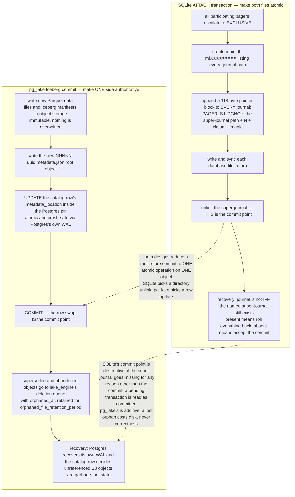

<!--
entry-meta
date: 2026-10-02
type: daily-diff
category: Daily Diff
title: Daily Diff — 2026-10-02
slug: sqlite-hot-journals-super-journal-recovery
edition: 2026-10-01 (Edition 068; no 2026-10-02 edition published yet)
-->

# Daily Diff — 2026-10-02

**2026-10-02 · Daily Diff Digest**

## Edition status

**There is no 2026-10-02 edition of The Daily Diff at the time of this run** (03:35 UTC / 09:05 IST). Two things worth recording about how the site behaved:

- Fetching https://tdd.cat/ served the *stale* **Edition 066, Tuesday, September 29, 2026** — the same edition yesterday's digest covered.
- https://tdd.cat/archive/ disagrees with the homepage and lists two newer editions: **068 — Thu, Oct 1, 2026** and **067 — Wed, Sep 30, 2026**. There is no edition for Oct 2.

So the homepage lags the archive by two days. This digest covers **Edition 068 (2026-10-01, 64 stories)**, the newest published edition, fetched directly at https://tdd.cat/2026-10-01/. Edition 067 (2026-09-30) was never covered by this log and is noted here as a gap rather than backfilled.

---

## Edition 068, point-wise

64 stories. The agent-infrastructure share is higher than usual; the database and systems cluster is smaller but denser.

**Databases and storage** — the part this log cares about

- **Snowflake open-sources `pg_lake`** — PostgreSQL extensions that make Postgres itself the Iceberg catalog, with DuckDB doing the scanning. Deep-dive below.
- **Amazon Aurora PostgreSQL embeds DuckDB** to query Iceberg and Parquet in a data lake directly, no ETL. The same architectural move as `pg_lake`, from a managed-service vendor, in the same edition. That coincidence is the real story.
- **Turbopuffer stops keying on the ANN address** — the vector index demoted to just another secondary index. Documents were keyed `(ClusterId, LocalId)`, i.e. by their position in a SPANN/SPFresh hierarchical clustering, which caused storage amplification for multi-vector documents and write amplification when SPFresh rebalancing cascaded full-document moves. Block sizes were pinned at roughly 100–200 documents; their full-text path, using fixed 256-document blocks, got indexes "10x smaller" and queries "up to 20x faster". Explicitly "day zero of perf grinding" — the architecture is announced, not yet measured.
- **Spanner Omni goes GA** — Spanner deployable on-premises and multi-cloud.
- **Postgres `DELETE` can scale** — concrete strategies for high-throughput row deletion.
- **ParadeDB matches PlanetScale's TIN full-text search** by optimizing BM25 ranking.
- **A chess engine inside DuckDB**, built from recursive CTEs and vectorized execution. Third DuckDB item in one edition.
- **Multitable** — a hash table holding 0.99 physical load factor at roughly 2× SwissTable's throughput.
- **Workers KV Instant** — Cloudflare's Quicksilver backing sub-millisecond global KV reads.

**Compilers, runtimes and performance**

- Parsing compressed JSON at 40 GB/s with SIMD plus streaming decompression; GHC Core on Truffle/GraalVM; a Rust port of the TypeScript type checker claiming 3.47× and 60% less memory; a self-hosting C17 compiler written as a literate ARM64 assembly program; zero-copy in-place byte-slice number parsing; content-addressed compiler caching across worktrees.
- Two CPython language-summit posts — generational/incremental GC, and memory snapshots trading cold-start speed against hash-randomization entropy — plus Tachyon, the Python 3.15 sampling profiler, and Datadog's async-aware profiler. `JEP 545` on ZGC startup and warmup, and image-based immutable Linux deployment with TPM2.

**Security**

Privilege escalation from `SELECT` to sysadmin through SQL Server Copilot; Trident taking first place on a HackerOne VDP leaderboard autonomously.

**Agents and inference** — the bulk of the edition

Deterministic harnesses for eleven production coding agents, Firecracker microVM snapshots for sandboxing, trace compilation into deterministic workflows, bounded-loop termination guarantees, several "single forward pass typed decision" models, KV-cache sharing and eviction policy work, roofline-based cost estimation for LLM SQL predicates, and eBPF event filtering for distributed agents. Volume high, mechanism density lower than the storage cluster.

---

## Deep dive: `pg_lake`, and the one-pointer commit

Picked because two independent items in this edition — `pg_lake` and Aurora's DuckDB embedding — are the same architectural bet, and because the atomicity problem `pg_lake` has to solve is precisely the one [today's lesson](README.md) dissects in SQLite, solved the opposite way.

### What the announcement says, and what it leaves out

The [Snowflake engineering post](https://www.snowflake.com/en/blog/engineering/pg-lake-postgres-lakehouse-integration/) is thin on mechanism. It states two table shapes — "a new Iceberg table type where Postgres itself acts as the catalog", and foreign tables via `CREATE FOREIGN TABLE hits () SERVER pg_lake` — plus `COPY` into Iceberg with "full Postgres transaction semantics". DuckDB is not mentioned at all in the announcement.

The repository is where the architecture lives. Reading `Snowflake-Labs/pg_lake` at commit `74626e92`:

- **`pgduck_server` is a separate process, not an in-process extension.** Its own description: "A separate multi-threaded process that implements the PostgreSQL wire protocol and delegates computation to DuckDB's columnar execution engine" (`CLAUDE.md:9`). It listens on **port 5332**, with a Unix socket in `/tmp` by default, and you can `psql` into it directly for debugging (`CLAUDE.md:69-70`). Flags include `--memory_limit`, `--cache_dir` and `--init_file_path`.
- **Postgres talks to DuckDB over the Postgres wire protocol.** That is the integration seam: no FFI, no shared address space, no linked DuckDB library inside the backend. The isolation story is a process boundary and the cost is a wire round-trip per delegated scan.
- **The extensions form a dependency tree**, not a monolith (`CLAUDE.md:143-167`):

  ```
  pg_lake_table (FDW for querying data lake files)
    └── pg_lake_iceberg (Iceberg v2 protocol implementation)
          └── pg_lake_engine (common module; depends on Apache Avro)
  pg_lake_copy
    └── pg_lake_engine
  ```

  with `pg_lake_engine` described as the common module, `pg_lake_iceberg` as a "Full Iceberg v2 protocol implementation with transactional support", and `pg_lake_table` as the FDW over Parquet/CSV/JSON/Iceberg. The Avro dependency is there because Iceberg manifest files are Avro.
- **Users connect only to PostgreSQL.** "The pg_lake extensions transparently delegate data scanning and computation to pgduck_server (running DuckDB) when appropriate, while maintaining full transactional guarantees" (`CLAUDE.md:11`). "When appropriate" is doing load-bearing work there and the repo does not define it.

### Where the transactional guarantee actually comes from

This is the part worth the attention, because it is the same problem as today's lesson. An Iceberg table is a tree of immutable files in object storage whose root is a `metadata.json`; committing means publishing a new root. A Postgres transaction that writes Parquet files to S3 and then commits a catalog change spans two storage systems with no shared commit protocol — the identical shape to SQLite's `ATTACH` transaction spanning two database files.

SQLite's answer, per the lesson, is the super-journal: make the two files genuinely atomic by introducing a third file whose `unlink()` is the commit point, and arrange for every participant to roll back if that file still exists. `pg_lake`'s answer is the other one available: **make one side authoritative and garbage-collect the other.**

- The catalog pointer is a row. `select catalog_name, table_namespace, table_name, metadata_location from iceberg_tables` returns rows like `postgres | public | measurements | s3://testbucket/iceberg/postgres/public/measurements/metadata/00003-6403833e-….metadata.json` (`docs/iceberg-tables.md:575-581`). Swapping which `metadata.json` is live is an ordinary Postgres row update — atomic, MVCC-visible, crash-safe by Postgres's own WAL.
- The object store is therefore allowed to accumulate garbage, and there is explicit machinery for it. `pg_lake_engine` ships a deletion queue with an `orphaned_at timestamptz` column (`pg_lake_engine--3.0.sql:110-115`) and `InsertDeletionQueueRecord*` entry points (`include/pg_lake/cleanup/deletion_queue.h:56-60`), retained for `lake_engine.orphaned_file_retention_period`. Enqueueing a `metadata.json` is resolved into the concrete files it references: the queue "resolves the metadata.json into the files it references, enqueues those as direct rows, and convert[s] the metadata.json row into a direct deletion row" (`src/cleanup/deletion_queue.c:158-159, 297-310`).
- The retention window is also a feature. The docs suggest simulating a table-level restore by creating an external Iceberg table from a dereferenced `metadata.json`, selecting it out of the deletion queue `where table_name = 'iceberg'::regclass and orphaned_at < now() - interval '3 days' and path like '%.metadata.json'` (`docs/iceberg-tables.md:880-889`). Garbage that has not yet been collected is your time-travel window.
- The scheme has a hard boundary: pg_lake "writes only to tables it created itself". Tables already in an external REST catalog are attached `read_only`, because "writing would mean taking over a table's metadata, field-id mappings and file inventory from whatever produced them, which pg_lake does not do" (`docs/iceberg-tables.md:534-544`).

### The two shapes of multi-store atomicity



The asymmetry at the bottom is the interesting part, and today's lesson measured the SQLite side of it. SQLite's commit point is the *absence* of a file, so absence caused by anything else — a moved directory, a tmp-cleaner, a restore to a different path — is indistinguishable from a commit. The lesson's §10 produced exactly that: `main.db` came back committed while two attached databases did not, every file reporting `integrity_check = ok`. `pg_lake`'s commit point is the *presence* of a value in a row that Postgres already protects, and its failure mode is an orphaned S3 object — wasted money, not a torn transaction. That is the better trade whenever you have a real transactional store to lean on, and SQLite does not: there is no third party to be authoritative, which is why the super-journal has to exist at all.

### Worth checking before believing it

- **"When appropriate" is undefined.** Neither the post nor the repo README states which operators are pushed to `pgduck_server` and which stay in Postgres, or what happens when a query mixes heap tables and Iceberg tables. The predicate-pushdown and join-placement rules are the whole performance story and they are not written down in what I read.
- **A wire-protocol hop per scan is not free.** The architecture buys isolation with a process boundary; nothing in the material quantifies the cost, and the announcement carries no benchmark numbers at all.
- **Transactional guarantees across the boundary are asserted, not specified.** "Full Postgres transaction semantics" is claimed for `COPY` into Iceberg. What a crash between the S3 writes and the catalog commit leaves behind is inferable from the deletion queue's existence but is not documented as a guarantee.
- **External writers cannot write pg_lake-created tables.** The `iceberg_tables` view is shaped to match the Iceberg JDBC/SQL catalog drivers so Spark and others can *read* the latest snapshot, but "External drivers cannot yet write to Iceberg tables created via `pg_lake`" (`docs/iceberg-tables.md:587`). Treat the Postgres-as-catalog claim as read-mostly interop for now.

---

## Sources

Edition and archive:

- [The Daily Diff](https://tdd.cat/) — served the stale Edition 066 (2026-09-29) at fetch time
- [The Daily Diff — archive](https://tdd.cat/archive/) — lists 068 (Oct 1) and 067 (Sep 30) as newer; no Oct 2 edition
- [Edition 068, Thursday 2026-10-01](https://tdd.cat/2026-10-01/) — the edition covered here, 64 stories
- [Edition 067, Wednesday 2026-09-30](https://tdd.cat/2026-09-30/) — never covered by this log

Deep-dive item and the sources followed from it:

- [Snowflake open sources pg_lake](https://www.snowflake.com/en/blog/engineering/pg-lake-postgres-lakehouse-integration/) (the item's source link)
- [`Snowflake-Labs/pg_lake`](https://github.com/Snowflake-Labs/pg_lake)
- [`Snowflake-Labs/pg_lake` — `docs/building-from-source.md`](https://github.com/Snowflake-Labs/pg_lake/blob/main/docs/building-from-source.md)
- [pg_lake in the Pigsty extension catalog](https://pigsty.io/ext/e/pg_lake/)
- [Postgres Meets the Lakehouse: pg_lake, pg_duckdb, and When Postgres Is Enough](https://datalakehousehub.com/blog/postgres-meets-the-lakehouse/)
- [Snowflake Open Sources pg_lake (BigGo)](https://biggo.com/news/202511050113_Postgres_Iceberg_Data_Lake_Extension)
- `Snowflake-Labs/pg_lake` read by file and line through a code index during this run at commit `74626e92`: `CLAUDE.md` (9-11, 61-70, 143-167), `Makefile` (2-3), `docs/iceberg-tables.md` (522-544, 571-587, 759-763, 880-889), `docs/file-formats-reference.md` (38, 162-168), `pg_lake_engine/pg_lake_engine--3.0.sql` (110-115), `pg_lake_engine/include/pg_lake/cleanup/deletion_queue.h` (56-60), `pg_lake_engine/src/cleanup/deletion_queue.c` (19, 158-159, 297-310), `duckdb_pglake/src/fs/caching_file_system.cpp` (210-226)

Other items referenced in the summary, as linked by Edition 068:

- [Amazon Aurora PostgreSQL now supports direct querying of Iceberg and Parquet](https://aws.amazon.com/blogs/aws/amazon-aurora-postgresql-now-supports-direct-querying-of-apache-iceberg-and-parquet-data-in-your-data-lake/)
- [Turbopuffer — RIP vector database](https://turbopuffer.com/blog/rip-vector-database)
- [Spanner Omni is now GA](https://cloud.google.com/blog/products/databases/spanner-omni-deploy-anywhere-version-of-spanner-is-now-ga)
- [Scaling deletions in Postgres](https://www.dbos.dev/blog/scaling-deletions-in-postgres)
- [ParadeDB — opening a closed TIN](https://www.paradedb.com/blog/opening-a-closed-tin)
- [quack-mate — a chess engine in DuckDB SQL](https://swingbit.github.io/quack-mate/)
- [Multitable — high load factor hash tables](https://arxiv.org/abs/2609.39233)
- [Workers KV Instant](https://blog.cloudflare.com/workers-kv-instant/)
- [Parsing compressed JSON at 40 GB/s](https://lemire.me/blog/2026/10/01/parsing-compressed-json-at-40-gb-s/)
- [Turbo Haskell — GHC Core on the JVM](https://comonad.com/reader/2026/turbo-haskell/)
- [`tsrs` — Rust port of the TypeScript type checker](https://github.com/maschwenk/tsrs)
- [`kcc` — a self-hosting C17 compiler in literate ARM64 assembly](https://github.com/LiterateDrivenDevelopment/kcc)
- [Eight bytes are already a number](https://blog.sebastiansastre.co/posts/eight-bytes-are-already-a-number/)
- [`kache` — content-addressed compiler cache](https://github.com/kunobi-ninja/kache)
- [Language Summit 2026 — garbage collection: generational, incremental, both?](https://blog.python.org/2026/09/language-summit-2026-garbage-collection-generational-incremental-both/)
- [Language Summit 2026 — memory snapshots](https://blog.python.org/2026/09/language-summit-2026-memory-snapshots/)
- [Getting to know Tachyon](https://grahamdumpleton.me/posts/2026/10/getting-to-know-tachyon/)
- [Building an async-aware Python profiler at Datadog](https://www.datadoghq.com/blog/engineering/async-python-profiler/)
- [JEP 545 — ZGC startup and warmup](https://openjdk.org/jeps/545)
- [Fitting everything together — image-based Linux](https://0pointer.net/blog/fitting-everything-together.html)
- [From SELECT to sysadmin via SQL Copilot](https://embracethered.com/blog/posts/2026/from-select-to-sysadmin-sql-copilot-bluehat-asia/)
- [Trident on the HackerOne VDP leaderboard](https://layer8.jp/en/blog/hackerone-vdp-2026-q3-first-place)
- [Production coding agent runtimes rely on custom deterministic harnesses](https://arxiv.org/abs/2609.00006)
- [`engrams` — Firecracker microVM snapshots for agent isolation](https://github.com/cortexapps/engrams)
- [Estimating AI filter latency with the roofline model](https://fsdatalab.github.io/blog/ai-filter-cost-estimates/)
- [Bounded loops for agent harness termination](https://arxiv.org/abs/2609.27871)
