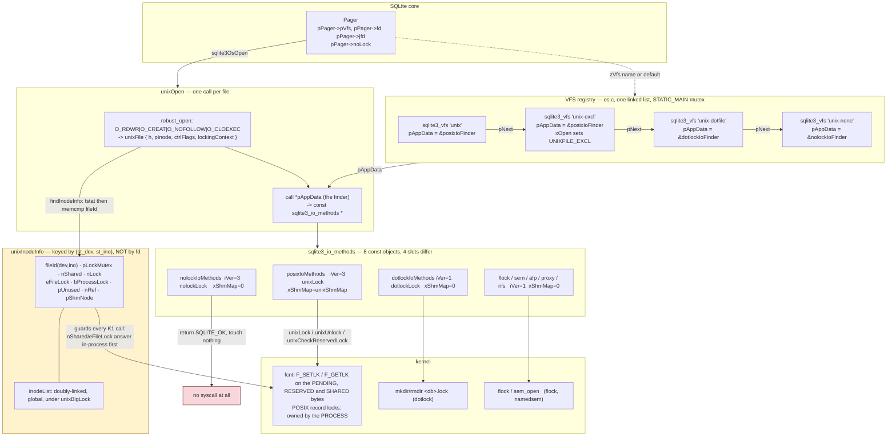

<!--
entry-meta
date: 2026-10-03
type: lesson
track: SQLite
lesson: 18
category: Database Internals
title: The VFS — Two Dispatch Tables, Five Locking Styles, and the File Descriptor That Outlives Its Connection
slug: sqlite-vfs-locking-styles-inode-emulation
-->

# The VFS — Two Dispatch Tables, Five Locking Styles, and the File Descriptor That Outlives Its Connection

**2026-10-03 · SQLite Track · Lesson 18 of 33**

## Where This Fits

- **Previous lesson:** [Lesson 17](../2026-10-02-sqlite-hot-journals-super-journal-recovery/README.md) decided whether a journal is hot, and used `sqlite3OsCheckReservedLock()` as a black box — condition 5 of `hasHotJournal()`, with a known race around it. It also measured the super-journal protocol in `vdbeCommit()`.
- **Lesson 15** established the five lock levels and the byte offsets they occupy (`PENDING_BYTE`, `RESERVED_BYTE`, `SHARED_FIRST`/`SHARED_SIZE`). **This lesson does not re-teach those offsets.** It opens the box underneath them.
- **What this lesson adds:** the two dispatch tables (`sqlite3_vfs`, `sqlite3_io_methods`) and how `os_unix.c` generates eight variants of the second one from one macro; why `sqlite3_vfs_register()` makes the default VFS appear *first* and everything else appear in reverse order; the `iVersion`/`xShmMap` pair that silently decides whether WAL is available, and the one-line ordering inside `sqlite3PagerWalSupported()` that is observable from SQL; `unixInodeInfo` and the intra-process lock emulation that exists because POSIX record locks are owned by the *process*, not the descriptor; the five alternative locking styles and what each actually does at the syscall level; `xSectorSize`/`xDeviceCharacteristics` and why the number the VFS reports is not the number the pager uses; and the lock-byte page as the b-tree sees it.
- **Next:** Lessons 19–20 take WAL in depth — frame append, the wal-index hash tables and read-marks, and checkpointing. This lesson supplies the `xShmMap`/`xShmLock`/`xShmBarrier`/`xShmUnmap` slots they depend on and shows which VFSes leave them null; it does not touch the `-shm` file's contents.

Source references are to `sqlite/sqlite` read by file and line through a code index during this run at commit `fde3a84d`. Measurements are against the **system `libsqlite3` 3.45.1** on x86-64 Linux 6.18 — a release, not trunk. Where the two disagree, §9 says so rather than papering over it.

---

## 1. Two Tables, Not One

The OS interface is two structs, and keeping them distinct is the whole key to reading `os_unix.c`.

| | `sqlite3_vfs` | `sqlite3_io_methods` |
|---|---|---|
| Scope | the filesystem — one per *named* VFS | one *open file* |
| Reached via | `sqlite3_vfs_find(name)`, registry linked list | `sqlite3_file.pMethods`, set by `xOpen` |
| Current `iVersion` | 3 | 3 |
| Methods | `xOpen`, `xDelete`, `xAccess`, `xFullPathname`, `xDl*`, `xRandomness`, `xSleep`, `xCurrentTime`, `xGetLastError` (v1); `xCurrentTimeInt64` (v2); `xSetSystemCall`, `xGetSystemCall`, `xNextSystemCall` (v3) | `xClose`, `xRead`, `xWrite`, `xTruncate`, `xSync`, `xFileSize`, `xLock`, `xUnlock`, `xCheckReservedLock`, `xFileControl`, `xSectorSize`, `xDeviceCharacteristics` (v1); `xShmMap`, `xShmLock`, `xShmBarrier`, `xShmUnmap` (v2); `xFetch`, `xUnfetch` (v3) |
| In unix | **one** object per VFS name, from `UNIXVFS()` | **eight** objects, from `IOMETHODS()` |

The asymmetry in the last row is the design. Every unix VFS shares the same `sqlite3_vfs` method set — `os_unix.c:8465-8488` is a single macro and every entry in it is an unconditional `unix*` function:

```c
#define UNIXVFS(VFSNAME, FINDER) {                        \
  3,                    /* iVersion */                    \
  sizeof(unixFile),     /* szOsFile */                    \
  MAX_PATHNAME,         /* mxPathname */                  \
  0,                    /* pNext */                       \
  VFSNAME,              /* zName */                       \
  (void*)&FINDER,       /* pAppData */                    \
  unixOpen,             /* xOpen */                       \
  unixDelete,           /* xDelete */                     \
  unixAccess,           /* xAccess */                     \
  ...
```

`pAppData` is the only field that varies, and it holds a **finder function pointer**, not data. `unixOpen` calls it to choose which `sqlite3_io_methods` this particular file gets. So "picking a locking style" is: pick a `FINDER`, which picks a `METHOD`, which differs from the others in exactly four slots.

Those four slots are the arguments to `IOMETHODS` (`os_unix.c:5808-5835`). Everything else is shared:

```c
#define IOMETHODS(FINDER,METHOD,VERSION,CLOSE,LOCK,UNLOCK,CKLOCK,SHMMAP)     \
static const sqlite3_io_methods METHOD = {                                   \
   VERSION,                    /* iVersion */                                \
   CLOSE,                      /* xClose */                                  \
   unixRead,                   /* xRead */                                   \
   unixWrite,                  /* xWrite */                                  \
   unixTruncate,               /* xTruncate */                               \
   unixSync,                   /* xSync */                                   \
   unixFileSize,               /* xFileSize */                               \
   LOCK,                       /* xLock */                                   \
   UNLOCK,                     /* xUnlock */                                 \
   CKLOCK,                     /* xCheckReservedLock */                      \
   unixFileControl,            /* xFileControl */                            \
   unixSectorSize,             /* xSectorSize */                            \
   unixDeviceCharacteristics,  /* xDeviceCapabilities */                     \
   SHMMAP,                     /* xShmMap */                                 \
   ...
```

Read that list once and the locking-style question collapses: **`xRead`, `xWrite`, `xSync`, `xTruncate`, `xFileSize`, `xSectorSize` and `xDeviceCharacteristics` are identical across every locking style on unix.** A locking style can only change how you lock, how you close, and whether shared memory exists. It cannot change how bytes move.

The eight instantiations, with the locking method and `iVersion` each one gets:

| `FINDER` | `METHOD` | `iVersion` | `xLock` | `SHMMAP` | Built when |
|---|---|---|---|---|---|
| `posixIoFinder` | `posixIoMethods` | 3 | `unixLock` | `unixShmMap` | always |
| `nolockIoFinder` | `nolockIoMethods` | **3** | `nolockLock` | **`0`** | always |
| `dotlockIoFinder` | `dotlockIoMethods` | **1** | `dotlockLock` | `0` | always |
| `flockIoFinder` | `flockIoMethods` | 1 | `flockLock` | `0` | `SQLITE_ENABLE_LOCKING_STYLE` |
| `semIoFinder` | `semIoMethods` | 1 | `semXLock` | `0` | `OS_VXWORKS` |
| `afpIoFinder` | `afpIoMethods` | 1 | `afpLock` | `0` | `__APPLE__` + locking style |
| `proxyIoFinder` | `proxyIoMethods` | 1 | `proxyLock` | `0` | `__APPLE__` + locking style |
| `nfsIoFinder` | `nfsIoMethods` | 1 | `unixLock` | `0` | `__APPLE__` + locking style |

`nolockIoMethods` is the one worth staring at: `iVersion` **3** but `xShmMap` **`0`** (`os_unix.c:5852-5861`). The version number advertises that the v2 and v3 slots *exist*; it says nothing about whether they are populated. §4 turns that into an observable behaviour.

---

## 2. The Registry, and Why the Default Is First

`aVfs[]` (`os_unix.c:8497-8522`) is registered in source order, with the first entry as default. Measured on this build:

```
== registered VFS chain (sqlite3_vfs.pNext) ==
  unix           iVersion=3 szOsFile=120  mxPathname=512   <- default
  memdb          iVersion=3 szOsFile=120  mxPathname=1024
  unix-excl      iVersion=3 szOsFile=120  mxPathname=512
  unix-dotfile   iVersion=3 szOsFile=120  mxPathname=512
  unix-none      iVersion=3 szOsFile=120  mxPathname=512
```

Two things to read off this.

**The order is not registration order, and not its reverse either.** `aVfs[]` lists `unix`, `unix-none`, `unix-dotfile`, `unix-excl`. The chain shows `unix`, then `memdb`, then `unix-excl`, `unix-dotfile`, `unix-none` — the default first, and the rest in *reverse* order behind it. That falls directly out of `sqlite3_vfs_register()` (`os.c:408-431`):

```c
vfsUnlink(pVfs);
if( makeDflt || vfsList==0 ){
  pVfs->pNext = vfsList;
  vfsList = pVfs;
}else{
  pVfs->pNext = vfsList->pNext;
  vfsList->pNext = pVfs;
}
```

A non-default VFS is inserted **after the head**, not at it. The head is therefore sticky: whatever is default stays reachable as `sqlite3_vfs_find(0)` no matter how many VFSes register later. `vfsList` is a plain singly-linked list with no mutex of its own beyond `SQLITE_MUTEX_STATIC_MAIN`, and `sqlite3_vfs_unregister()` is just `vfsUnlink()` — it does not check whether any open `sqlite3_file` still points into that VFS's methods. Unregistering a VFS that has open files is a dangling-pointer bug you author yourself.

**`szOsFile=120` and `mxPathname=512`.** `szOsFile` is `sizeof(unixFile)` — the core allocates that many bytes and `xOpen` constructs a `unixFile` in them. That is the subclassing mechanism: `sqlite3_file` is a one-field struct (`pMethods`) and every VFS extends it. `memdb` reports the same 120 because it wraps the unix file object. `mxPathname=512` is `MAX_PATHNAME`; the core sizes `xFullPathname` buffers at `mxPathname+1`.

`PRAGMA` cannot show you this list. `sqlite3_vfs_find(0)` and the `pNext` walk is the only way, which is why the Hands-On section starts there.

---

## 3. The Structure, End to End



The highlighted box is the part that does not appear in `sqlite3.h` at all. `unixInodeInfo` is purely an `os_unix.c` invention, and §5 and §6 are about why it has to exist.

---

## 4. The WAL Gate: `iVersion`, `xShmMap`, and an Ordering You Can Observe

`sqlite3PagerWalSupported()` is three lines (`pager.c:7625-7629`):

```c
int sqlite3PagerWalSupported(Pager *pPager){
  const sqlite3_io_methods *pMethods = pPager->fd->pMethods;
  if( pPager->noLock ) return 0;
  return pPager->exclusiveMode || (pMethods->iVersion>=2 && pMethods->xShmMap);
}
```

`sqlite3PagerOpenWal()` returns `SQLITE_CANTOPEN` when it returns 0 (`pager.c:7720`). That is the entire reason `PRAGMA journal_mode=WAL` can fail.

Note the shape of the expression. `noLock` is tested **first and unconditionally**. `exclusiveMode` is tested **before** the methods test, so exclusive locking mode short-circuits the `iVersion`/`xShmMap` requirement entirely — the comment above `pagerOpenWal()` explains why that is sound: "If the pager is already in exclusive-mode, the WAL module will use heap-memory for the wal-index instead of the VFS shared-memory implementation" (`pager.c:7663-7666`). No `-shm` file, no `xShmMap`, so no requirement.

Both of those orderings are visible from SQL. Measured, with `PRAGMA journal_mode=WAL` on a fresh database:

| VFS / URI | `locking_mode` | result | why |
|---|---|---|---|
| `unix` | normal | `wal` | `iVersion=3`, `xShmMap=unixShmMap` |
| `unix-excl` | normal | `wal` | same methods object as `unix` |
| `unix-dotfile` | normal | **`delete`** | `iVersion=1` fails `iVersion>=2` |
| `unix-none` | normal | **`delete`** | `iVersion=3` passes, but `xShmMap==0` |
| `unix-dotfile` | **exclusive** | **`wal`** | `exclusiveMode` short-circuits the methods test |
| `unix-none` | **exclusive** | **`wal`** | same |
| `file:x.db?nolock=1` | normal | `delete` | `pPager->noLock` |
| `file:x.db?nolock=1` | **exclusive** | **`delete`** | `noLock` is tested *before* `exclusiveMode` |

The last two rows are the interesting ones, and they are the reason this is worth measuring rather than reading. `?nolock=1` and `unix-none` produce identical locking behaviour — no locks at all — but they are *not* interchangeable: `nolock=1` sets a `Pager` field (`pager.c:5049`, `pPager->noLock = sqlite3_uri_boolean(..., "nolock", 0)`) that gates WAL ahead of `exclusiveMode`, while `unix-none` only swaps the methods object, which `exclusiveMode` is allowed to bypass. **You can have WAL on `unix-none` and you cannot have WAL on `?nolock=1`, no matter what locking mode you ask for.** Two spellings of "don't lock", one of which is strictly more restrictive, and nothing in the documentation I read says so.

Also note what *did not* happen: none of the failing cases returned an error. `PRAGMA journal_mode=WAL` returned the string `delete` with `SQLITE_OK`. The pragma reports the mode that is now in effect, and a failed switch leaves the old mode in effect. Any code that sets WAL and does not read back the returned row is running in rollback mode and does not know it.

`pPager->noLock` is also set unconditionally for temp files (`pager.c:5070`), alongside `eState = PAGER_READER` and `eLock = EXCLUSIVE_LOCK` — a temp-file pager pretends it already owns everything, which is why `pagerLockDb`/`pagerUnlockDb` become no-ops through the same `noLock` branch (`pager.c:1141`, `1166`).

---

## 5. `unixInodeInfo`: The Lock Belongs to the Inode, Not the Descriptor

POSIX record locks have two properties that make them nearly unusable as-is for a library that may be opened several times inside one process:

1. **Locks are owned by the process.** Two descriptors in the same process do not contend. A second `fcntl(F_SETLK)` on the same bytes from the same process *succeeds* and replaces the first.
2. **Closing *any* descriptor on an inode releases *all* of that process's locks on it.** Not just that descriptor's locks. All of them.

Property 1 means the kernel cannot arbitrate between two `sqlite3*` handles in one process. Property 2 means a well-behaved connection closing cleanly can silently unlock a different connection's live transaction.

`unixInodeInfo` (`os_unix.c:1323-1342`) is the fix for both:

```c
struct unixInodeInfo {
  struct unixFileId fileId;       /* The lookup key */
  sqlite3_mutex *pLockMutex;      /* Hold this mutex for... */
  int nShared;                      /* Number of SHARED locks held */
  int nLock;                        /* Number of outstanding file locks */
  unsigned char eFileLock;          /* One of SHARED_LOCK, RESERVED_LOCK etc. */
  unsigned char bProcessLock;       /* An exclusive process lock is held */
  UnixUnusedFd *pUnused;            /* Unused file descriptors to close */
  int nRef;                       /* Number of pointers to this structure */
  unixShmNode *pShmNode;          /* Shared memory associated with this inode */
  unixInodeInfo *pNext;           /* List of all unixInodeInfo objects */
  unixInodeInfo *pPrev;           /*    .... doubly linked */
  ...
};
```

- The key is `struct unixFileId { dev_t dev; u64 ino; }` (`os_unix.c:1282-1287`) — `st_dev` and `st_ino` from `fstat`, not the pathname. Two different paths that are hard links to the same file get the *same* `unixInodeInfo`; the same path reopened after a rename does not follow the name.
- `findInodeInfo()` (`os_unix.c:1527-1618`) `fstat`s the descriptor, builds the key, and does a **linear `memcmp` walk of the global `inodeList`** under `unixBigLock`, allocating and prepending a new node on a miss, or bumping `nRef` on a hit. Linear in the number of distinct inodes this process has open through SQLite — fine for tens, a consideration if you open thousands of databases in one process.
- The mutex rules are documented at `os_unix.c:1306-1321` and matter: the locking fields need only `pLockMutex`; `fileId` and `pLockMutex` are immutable while `nRef>0` and need no mutex; everything else needs the global `unixBigLock`. Lock ordering is `unixBigLock` **before** `pLockMutex`, never the reverse.
- `nShared` and `eFileLock` are the in-process arbitration. `unixCheckReservedLock()` (§7) consults `pInode->eFileLock` *before* it asks the kernel anything, precisely because property 1 means the kernel would lie.

The `#ifdef __APPLE__` block inside `findInodeInfo()` (`os_unix.c:1552-1578`) is a good reminder of what this layer absorbs: on an msdos filesystem on macOS, a zero-length file reports the wrong inode number, so SQLite writes a single byte — `'S'`, chosen because it is the first byte of `SQLite format 3\0`, so a race with another thread that already wrote the header does no damage — then `fsync`s and re-`fstat`s. A one-byte write to work around a filesystem bug, in the function that computes a hash key.

---

## 6. The Descriptor That Outlives Its Connection

Property 2 above is handled by deferral. `unixClose()` (`os_unix.c:2341-2371`):

```c
unixUnlock(id, NO_LOCK);
...
sqlite3_mutex_enter(pInode->pLockMutex);
if( pInode->nLock ){
  /* If there are outstanding locks, do not actually close the file just
  ** yet because that would clear those locks.  Instead, add the file
  ** descriptor to pInode->pUnused list.  It will be automatically closed
  ** when the last lock is cleared.
  */
  setPendingFd(pFile);
}
sqlite3_mutex_leave(pInode->pLockMutex);
releaseInodeInfo(pFile);
```

`setPendingFd()` (`os_unix.c:2101-2109`) pushes a pre-allocated `UnixUnusedFd { int fd; int flags; UnixUnusedFd *pNext; }` onto `pInode->pUnused` and sets `pFile->h = -1`. `closePendingFds()` (`os_unix.c:1471-1482`) drains the list and is called from `releaseInodeInfo()` when `nRef` hits 0 (`os_unix.c:1499`) and from the unlock path when the last lock goes. The `UnixUnusedFd` is **pre-allocated at open time** (`unixFile.pPreallocatedUnused`, `os_unix.c:266`) because `setPendingFd` must not be able to fail — there is no way to report "I could not defer this close" that does not corrupt someone else's transaction.

This is directly observable. Two connections in one process, `A` holding `RESERVED` via `BEGIN IMMEDIATE`, with a separate forked process probing `RESERVED_BYTE` to get an honest answer:

```
raw: F_SETLK on fd1          -> 0
raw: child sees lock held?    -> YES
raw: opened a 2nd fd (4) to the same inode
raw: after close(fd2), held?  -> no            <-- property 2, in 4 lines of C

sqlite: A holds RESERVED      -> child sees HELD
sqlite: opened conn B to the same inode (fd count now 2)
sqlite: after close(B), child sees HELD        <-- deferral working
sqlite: A's COMMIT rc=0 (ok)
```

And the deferral is visible in the syscall stream. With marker syscalls between steps:

```
access("MARK-open-B")
openat(... "df.db", O_RDWR|O_CREAT|O_NOFOLLOW|O_CLOEXEC) = 5     <- conn B's fd
access("MARK-close-B")                                            <- sqlite3_close(b) runs here
access("MARK-A-commit")
close(5)                                                          <- B's fd closed HERE, inside A's COMMIT
access("MARK-close-A")
close(3)                                                          <- A's own fd
```

`sqlite3_close(b)` returned `SQLITE_OK` while descriptor 5 was still open. It stayed open across an entire transaction and was reaped during `A`'s `COMMIT`, when `A`'s lock count reached zero. **`sqlite3_close()` is not a promise that the descriptor is gone.** If you are counting open descriptors against `RLIMIT_NOFILE`, or watching for unlinked-but-open files, or wondering why a file you deleted still holds disk space, this is why.

Note also `O_CLOEXEC` in that `openat`, and `robust_open`'s refusal to accept descriptors 0–2. Both are deliberate: a database descriptor must not leak across `exec`, and must not be able to land on stdin/stdout/stderr where unrelated code would write to it.

---

## 7. `xCheckReservedLock`, Opened

Lesson 17 used `sqlite3OsCheckReservedLock()` as condition 5 of `hasHotJournal()` and left it closed. The posix implementation (`os_unix.c:1677-1716`) is short and every line is load-bearing:

```c
assert( pFile->eFileLock<=SHARED_LOCK );
sqlite3_mutex_enter(pFile->pInode->pLockMutex);

/* Check if a thread in this process holds such a lock */
if( pFile->pInode->eFileLock>SHARED_LOCK ){
  reserved = 1;
}

/* Otherwise see if some other process holds it. */
if( !reserved && !pFile->pInode->bProcessLock ){
  struct flock lock;
  lock.l_whence = SEEK_SET;
  lock.l_start = RESERVED_BYTE;
  lock.l_len = 1;
  lock.l_type = F_WRLCK;
  if( osFcntl(pFile->h, F_GETLK, &lock) ){
    rc = SQLITE_IOERR_CHECKRESERVEDLOCK;
    storeLastErrno(pFile, errno);
  } else if( lock.l_type!=F_UNLCK ){
    reserved = 1;
  }
}
```

- **The in-process check comes first and is not optional.** `F_GETLK` reports *other processes'* locks only; a process's own locks always come back `F_UNLCK`. Without the `pInode->eFileLock` test, a connection would conclude that its sibling in the same process holds nothing.
- **`F_GETLK`, not `F_SETLK`.** It asks whether the lock *would* block, and takes nothing. There is no state change and no cleanup path.
- **`bProcessLock` skips the kernel call entirely.** Under `unix-excl` this process already holds the whole `SHARED_FIRST`..`SHARED_FIRST+SHARED_SIZE` range exclusively, so no other process can hold `RESERVED_BYTE`; asking would be a wasted syscall. See §8.
- **`l_len = 1`.** A one-byte probe. `RESERVED_BYTE` is a single byte and the lock on it is a pure signal, never protecting data.
- The whole thing runs with `pFile->eFileLock<=SHARED_LOCK` asserted — you only ever ask this question as a reader deciding whether it is safe to proceed, which is exactly the `hasHotJournal()` use.

`nolockCheckReservedLock()` (`os_unix.c:2393-2397`) is the degenerate case: `*pResOut = 0; return SQLITE_OK;`. It unconditionally reports "nobody holds RESERVED". Run that through lesson 17's condition 5 and the consequence is concrete: on `unix-none`, a reader that finds a journal with a valid magic number will treat a *live writer's* journal as hot and roll it back. The no-op locking style is not merely "no mutual exclusion"; it actively feeds a wrong answer into the recovery decision.

**`UNKNOWN_LOCK` is not a VFS concept.** It is `#define UNKNOWN_LOCK (EXCLUSIVE_LOCK+1)` in `pager.c:407`, a *pager* state meaning "a failed unlock left me not knowing what the OS thinks I hold". The comment at `pager.c:396-406` spells out the interaction with this section: while `eLock==UNKNOWN_LOCK`, the `OPEN`→`SHARED` transition **omits the hot-journal check entirely and assumes a hot journal exists**, taking `EXCLUSIVE` before rolling back. `pagerUnlockDb()` refuses to overwrite it (`pager.c:1142`) and `pagerLockDb()` only clears it on a successful `xLock(EXCLUSIVE)` (`pager.c:1167`). So `xCheckReservedLock` is not consulted at all in that state — the pager has decided it cannot trust any answer, including an honest one. The VFS never sees `UNKNOWN_LOCK`; it is 5 in a pager field whose values the VFS's four lock levels only partly cover.

---

## 8. Five Ways to Lock a File

### `unix-excl` — one `fcntl`, for the whole process, forever

`unixFileLock()` (`os_unix.c:1802-1833`) has a special branch:

```c
if( (pFile->ctrlFlags & (UNIXFILE_EXCL|UNIXFILE_RDONLY))==UNIXFILE_EXCL ){
  if( pInode->bProcessLock==0 ){
    struct flock lock;
    lock.l_whence = SEEK_SET;
    lock.l_start = SHARED_FIRST;
    lock.l_len = SHARED_SIZE;
    lock.l_type = F_WRLCK;
    rc = osSetPosixAdvisoryLock(pFile->h, &lock, pFile);
    if( rc<0 ) return rc;
    pInode->bProcessLock = 1;
    pInode->nLock++;
  }else{
    rc = 0;
  }
}
```

Every subsequent lock operation returns 0 without touching the kernel; arbitration moves entirely into `unixInodeInfo`. Measured over three `BEGIN IMMEDIATE`/`INSERT`/`COMMIT` cycles in `journal_mode=delete`:

| VFS | `fcntl` lock calls | breakdown |
|---|---|---|
| `unix` | **40** | 14 `F_RDLCK`, 12 `F_WRLCK`, 14 `F_UNLCK` |
| `unix-excl` | **1** | 1 `F_WRLCK` |

And that single call is exactly what the code says it is:

```
fcntl(3, F_SETLK, {l_type=F_WRLCK, l_whence=SEEK_SET, l_start=1073741826, l_len=510}) = 0
```

`1073741826` = `0x40000002` = `PENDING_BYTE+2` = `SHARED_FIRST`; `l_len=510` = `SHARED_SIZE`. One `F_WRLCK` over the shared-byte range, taken once, never released until the inode goes away. Note it is `F_WRLCK` over the *shared* range, not over `PENDING_BYTE` — it does not need to exclude itself from `PENDING`/`RESERVED`, only to make the range unavailable to any other process.

13 lock syscalls per transaction down to zero is the real reason `unix-excl` exists. The `UNIXFILE_RDONLY` exclusion in the condition is also worth noting: a read-only `unix-excl` open falls through to the normal path, because taking a write lock on a file you opened read-only would fail. That is why the assert on the next line is commented out — `pInode->nLock` genuinely can be non-zero there.

### `unix-dotfile` — `mkdir`, not a dot-file

Despite the name and the `#define DOTLOCK_SUFFIX ".lock"` (`os_unix.c:2443`), `dotlockLock()` calls `osMkdir(zLockFile, 0777)` (`os_unix.c:2513`) and `dotlockUnlock()` calls `osRmdir()` (`os_unix.c:2567`). The lock is a **directory**, because `mkdir` is the atomic test-and-create primitive that works on filesystems where `O_EXCL` and advisory locking do not. Measured, over three transactions:

```
mkdir(".../dl.db.lock", 0777) = 0
rmdir(".../dl.db.lock")       = 0
mkdir(".../dl.db.lock", 0777) = 0
rmdir(".../dl.db.lock")       = 0
mkdir(".../dl.db.lock", 0777) = 0
rmdir(".../dl.db.lock")       = 0
```

with **zero** `F_SETLK` calls, and `ls` during an open write transaction showing:

```
-rw-r--r--  8192  dl.db
-rw-r--r--  4616  dl.db-journal
drwxr-xr-x  4096  dl.db.lock          <-- a directory
```

Two consequences. First, there is exactly **one** lock, so the five levels collapse: a reader and a writer are indistinguishable and cannot coexist. Second, `EEXIST` is the only failure signal (`os_unix.c:2517`), and a `.lock` directory left behind by a process that died is indistinguishable from one held by a live process. A stale dotlock requires manual `rmdir`; nothing reaps it. That is a strictly worse failure mode than a stale `-journal`, which lesson 17 showed is self-healing.

### `unix-none` — nothing at all

`nolockLock`/`nolockUnlock` return `SQLITE_OK` without inspecting their arguments (`os_unix.c:2398-2401`). The header comment (`os_unix.c:2379-2391`) states the intended use — read-only media, or an application with its own external mutual exclusion — and the hazard: "there is a serious risk of database corruption if this locking mode is used in situations where multiple database connections are accessing the same database file at the same time and one or more of those connections are writing." Combine that with §7's observation that `nolockCheckReservedLock` lies to the recovery logic, and `unix-none` is for genuinely read-only data or for a single writer you control, and nothing else.

### `flock`, `namedsem`, `afp`, `proxy`, `nfs`

All `iVersion` 1, all `xShmMap=0`, all conditionally compiled. `flockIoMethods` requires `SQLITE_ENABLE_LOCKING_STYLE` and uses BSD `flock()` — whole-file, two levels, and (unlike POSIX record locks) owned by the open file description rather than the process. `semIoMethods` is VxWorks-only and uses a named POSIX semaphore, with `sem_t *pSem` and `aSemName[MAX_PATHNAME+2]` carried in `unixInodeInfo` itself (`os_unix.c:1338-1341`). `afpIoMethods`, `proxyIoMethods` and `nfsIoMethods` are `__APPLE__`-only; `nfsIoFinder` is the telling one — it uses `unixLock` but a *different* `nfsUnlock` (`os_unix.c:5940-5946`), i.e. only unlocking needed special handling on NFS.

### `autolockIoFinder` — the only finder that actually decides

Everywhere except Apple, `FINDER##Impl` is generated by the macro and returns a constant. On macOS with locking styles enabled, `unix` maps to `autolockIoFinderImpl` (`os_unix.c:5960-6012`), which does real work: `statfs()` the path, return `nolockIoMethods` immediately if `MNT_RDONLY`, then look the filesystem type up in a five-entry table —

```c
{ "hfs",    &posixIoMethods },
{ "ufs",    &posixIoMethods },
{ "afpfs",  &afpIoMethods },
{ "smbfs",  &afpIoMethods },
{ "webdav", &nolockIoMethods },
```

— and on a miss, probe with `fcntl(F_GETLK)`: if the probe works, `nfsIoMethods` for `nfs` or `posixIoMethods` otherwise; if it fails, fall back to `dotlockIoMethods`. A `statfs` and sometimes an `fcntl` on every file open, to decide which of eight constant structs to use. `webdav` → no locking is a quiet statement about WebDAV.

---

## 9. `xSectorSize` and `xDeviceCharacteristics`: The VFS's Answer Is Not the Pager's

Both methods are shared by every locking style and both funnel into `setDeviceCharacteristics()`, which memoizes on `pFd->sectorSize==0` (`os_unix.c:4353-4375`). On Linux the non-QNX version is almost entirely static:

```c
if( pFd->sectorSize==0 ){
#if defined(__linux__) && defined(SQLITE_ENABLE_BATCH_ATOMIC_WRITE)
  res = osIoctl(pFd->h, F2FS_IOC_GET_FEATURES, &f);
  if( res==0 && (f & F2FS_FEATURE_ATOMIC_WRITE) ){
    pFd->deviceCharacteristics = SQLITE_IOCAP_BATCH_ATOMIC;
  }
#endif
  if( pFd->ctrlFlags & UNIXFILE_PSOW ){
    pFd->deviceCharacteristics |= SQLITE_IOCAP_POWERSAFE_OVERWRITE;
  }
  pFd->deviceCharacteristics |= SQLITE_IOCAP_SUBPAGE_READ;
  pFd->sectorSize = SQLITE_DEFAULT_SECTOR_SIZE;
}
```

**There is no query of the actual device.** `sectorSize` is the compile-time `SQLITE_DEFAULT_SECTOR_SIZE`. The only runtime probe is a single F2FS ioctl, and only when `SQLITE_ENABLE_BATCH_ATOMIC_WRITE` was defined at build time. Every `SQLITE_IOCAP_ATOMIC*` flag, `SAFE_APPEND` and `SEQUENTIAL` are left **unset on Linux** — the QNX variant (`os_unix.c:4379-4400`) is the one that sets `ATOMIC4K|SAFE_APPEND|SEQUENTIAL`, and only for `tmp` and `etfs` filesystems. So lesson 16's `nRec=0xffffffff` `SAFE_APPEND` path and its `SEQUENTIAL` sync elisions are **dead code on ordinary Linux**, reachable only via a custom VFS or `SQLITE_FCNTL`.

Measured on ext4-backed storage here:

```
xSectorSize() = 4096
dc = 0x00001000 : POWERSAFE_OVERWRITE
```

Two honest notes:

- `SQLITE_IOCAP_SUBPAGE_READ` (0x8000) is set unconditionally in the trunk source above but is **absent from the measured `dc`**, because 3.45.1 predates it. The source and the measurement disagree, and the source is newer; do not read `0x1000` as the trunk answer.
- `POWERSAFE_OVERWRITE` being set is a *build default*, not a device property. `UNIXFILE_PSOW` comes from `SQLITE_POWERSAFE_OVERWRITE`, which defaults on. Nobody asked the SSD.

**Now the part that matters.** The VFS reports 4096. The pager does not use 4096. `setSectorSize()` (`pager.c:2802-2805`) overrides it:

```c
if( pPager->tempFile
 || (sqlite3OsDeviceCharacteristics(pPager->fd) &
            SQLITE_IOCAP_POWERSAFE_OVERWRITE)!=0
){
```

— and takes 512 in that branch, which is exactly the `sectorSize=512` lesson 16 measured while reading the journal header. And `sqlite3SectorSize()` (`pager.c:2765-2771`) clamps the VFS's answer into `[512, MAX_SECTOR_SIZE]` regardless. So `xSectorSize()` is advice, twice filtered: clamped, then discarded entirely when `POWERSAFE_OVERWRITE` is set. The journal header layout lesson 16 dissected was determined by the *flag*, not by the size.

**`BATCH_ATOMIC`** is the one IOCAP flag with real consequences, and it is the only one left for this lesson (lesson 16's note assigned `SAFE_APPEND`, `SEQUENTIAL` and `POWERSAFE_OVERWRITE` to itself). It means the filesystem can commit a batch of writes atomically — F2FS's atomic-write ioctls. When set:

- `assert_pager_state`'s journal assertions accept a missing journal (`pager.c:949`, `961`, `2115`) — the pager is allowed to be in `WRITER_DBMOD` with **no journal file at all**.
- The atomic-write check returns -1 for "use batch atomic" (`pager.c:1207-1211`).
- `extraSync` is forced on, as if `synchronous=EXTRA` (`pager.c:3683-3688`) — the directory sync becomes unconditional.
- The commit path (`pager.c:6585-6712`) brackets the page writes in `SQLITE_FCNTL_BEGIN_ATOMIC_WRITE`, with `bBatch` requiring `zSuper==0` (no multi-file transaction), `!noSync`, and an **in-memory** journal. The fcntl maps to `osIoctl(pFile->h, F2FS_IOC_START_ATOMIC_WRITE)` (`os_unix.c:4145-4146`).

So on F2FS with the right build flags, SQLite deletes the rollback journal from the commit protocol and lets the filesystem provide atomicity. The condition `zSuper==0` is the tell: this optimization and lesson 17's super-journal are mutually exclusive, which is one more row in the same table as `aMJNeeded[]` — atomicity mechanisms that silently exclude each other.

---

## 10. The Lock-Byte Page, as the B-Tree Sees It

Lesson 15 covered the byte offsets. This is the *page*: the locking bytes live at file offset `PENDING_BYTE` = `0x40000000` (1 GiB), which on a database with 4 KiB pages falls inside page 262145. The b-tree reserves it and never uses it (`btreeInt.h:609-612`):

```c
/*
** The database page the PENDING_BYTE occupies. This page is never used.
*/
#define PENDING_BYTE_PAGE(pBt)  ((Pgno)((PENDING_BYTE/((pBt)->pageSize))+1))
```

The number of places that have to know about it is the real content here. `btree.c` alone skips it in allocation (`6811`, `6829`, `6835`, `6846`), in root-page selection (`10128-10130`, `10445-10452`), in ptrmap arithmetic (`1071-1073`, `1098`), in auto-vacuum truncation (`4075`, `4157`, `4177-4182`, `4255`) — the same auto-vacuum machinery lesson 13 covered — in overflow-page asserts (`7240`), and in `integrity_check`, where it is explicitly marked referenced so it is not reported as a leak (`11263-11264`). `backup.c` skips it on both source and destination (`254`, `265`, `419`, `479`, `507`, `519`). `pager.c` refuses to fetch it (`5644-5647`, returning `SQLITE_CORRUPT_BKPT`), refuses to journal it (`2386`, `6063`, `6242`), and adjusts truncation around it (`6727`).

That spread is the cost of putting lock bytes inside the file's address space, and it is paid in *every* layer, not just the one that locks.

It is also directly observable, because `sqlite3_test_control(SQLITE_TESTCTRL_PENDING_BYTE, n)` relocates `PENDING_BYTE` — which is how SQLite's own test suite reaches this code without building a 1 GiB file. Setting it to `0x2000` with `page_size=1024` puts the lock-byte page at `0x2000/1024 + 1 = 9`:

```
PENDING_BYTE: 0x40000000 -> 0x00002000
expected PENDING_BYTE_PAGE = 9
page_count = 205

file size = 209920 bytes = 205 pages
  page  6: type=0x0d nonzero_bytes= 810
  page  7: type=0x0d nonzero_bytes= 811
  page  8: type=0x0d nonzero_bytes= 811
  page  9: type=0x00 nonzero_bytes=   0 <-- LOCK-BYTE PAGE
  page 10: type=0x0d nonzero_bytes= 807
  page 11: type=0x0d nonzero_bytes= 810
  page 12: type=0x0d nonzero_bytes= 808
```

Pages 6, 7, 8, 10, 11, 12 are all `0x0d` table leaves. Page 9 is **1024 bytes of zero** inside a file that the b-tree grew straight past it. Not a free-list page — lesson 6's free list never sees it — just a hole in the page-number space. On a real database that hole is at page 262145 and costs one page, which is why nobody notices.

And this is also where lesson 17's `PAGER_SJ_PGNO` comes from: `pager.c:1789` writes the super-journal pointer block with `PAGER_SJ_PGNO(pPager)` as its page number, and `pager_playback_one_page` rejects that page number outright (`pager.c:2386`). The pointer block is safe to append to a journal precisely *because* the lock-byte page can never legitimately appear in one.

---

## 11. `aSyscall[]` — The VFS Has Its Own VFS

`sqlite3_vfs` v3's three methods (`xSetSystemCall`, `xGetSystemCall`, `xNextSystemCall`) exist because `os_unix.c` does not call libc directly. It calls through a table (`os_unix.c:423-427`):

```c
static struct unix_syscall {
  const char *zName;            /* Name of the system call */
  sqlite3_syscall_ptr pCurrent; /* Current value of the system call */
  sqlite3_syscall_ptr pDefault; /* Default value */
} aSyscall[] = {
  { "open",         (sqlite3_syscall_ptr)posixOpen,  0  },
#define osOpen      ((int(*)(const char*,int,int))aSyscall[0].pCurrent)
```

Every `osOpen`, `osFcntl`, `osMkdir`, `osRmdir`, `osIoctl` in this lesson is a macro indexing that table, with a `#define` adjacent to each entry so the index and the name cannot drift. The entries are conditionally compiled — `ioctl` only appears under `__linux__ && SQLITE_ENABLE_BATCH_ATOMIC_WRITE` (`os_unix.c:584-586`). `sqlite3_os_init`'s double-check of the array's construction cites ticket `bb3a86e890c8e96ab` (`os_unix.c:8525-8526`), which is what happens when a table is indexed by hand.

The point is fault injection: SQLite's tests replace `fcntl` with one that returns `EINTR`, `write` with one that returns short, `fstat` with one that fails, without `LD_PRELOAD` or a custom VFS. It is also the reason `SimulateIOError()` appears at the top of `unixCheckReservedLock` — the error paths in this file are tested, not merely written.

---

## Hands-On

Everything below was run on x86-64 Linux 6.18 against system `libsqlite3` 3.45.1 (`apt install libsqlite3-dev`). The CLI cannot do most of it — `PRAGMA` has no view of the VFS registry or the io_methods table — so these are small C programs.

### A. Walk the VFS registry and read the io_methods table

```c
/* probe.c — gcc -O1 -o probe probe.c -lsqlite3 ;  ./probe t.db [vfsname] */
#include <sqlite3.h>
#include <stdio.h>

static void dcprint(int dc){
  struct { int f; const char *n; } a[] = {
    {0x0001,"ATOMIC"},{0x0002,"ATOMIC512"},{0x0004,"ATOMIC1K"},{0x0008,"ATOMIC2K"},
    {0x0010,"ATOMIC4K"},{0x0020,"ATOMIC8K"},{0x0040,"ATOMIC16K"},{0x0080,"ATOMIC32K"},
    {0x0100,"ATOMIC64K"},{0x0200,"SAFE_APPEND"},{0x0400,"SEQUENTIAL"},
    {0x0800,"UNDELETABLE_WHEN_OPEN"},{0x1000,"POWERSAFE_OVERWRITE"},
    {0x2000,"IMMUTABLE"},{0x4000,"BATCH_ATOMIC"},{0x8000,"SUBPAGE_READ"},{0,0}};
  printf("  dc = 0x%08x :", dc);
  if(!dc) printf(" (none)");
  for(int i=0;a[i].n;i++) if(dc&a[i].f) printf(" %s",a[i].n);
  printf("\n");
}

int main(int argc, char **argv){
  for(sqlite3_vfs *v = sqlite3_vfs_find(0); v; v = v->pNext)
    printf("  %-14s iVersion=%d szOsFile=%-4d mxPathname=%d%s\n",
      v->zName, v->iVersion, v->szOsFile, v->mxPathname,
      v==sqlite3_vfs_find(0) ? "   <- default" : "");

  sqlite3 *db;
  sqlite3_open_v2(argv[1], &db, SQLITE_OPEN_READWRITE|SQLITE_OPEN_CREATE,
                  argc>2 ? argv[2] : 0);
  sqlite3_exec(db,"PRAGMA page_size=4096;CREATE TABLE IF NOT EXISTS t(x);"
                  "INSERT INTO t VALUES(randomblob(100));",0,0,0);

  char *vn=0; sqlite3_file_control(db,"main",SQLITE_FCNTL_VFSNAME,&vn);
  printf("\n  VFSNAME = %s\n", vn?vn:"(null)"); sqlite3_free(vn);

  sqlite3_file *fp=0;
  sqlite3_file_control(db,"main",SQLITE_FCNTL_FILE_POINTER,&fp);
  if(fp && fp->pMethods){
    printf("  io_methods iVersion = %d\n", fp->pMethods->iVersion);
    printf("  xSectorSize()       = %d\n", fp->pMethods->xSectorSize(fp));
    dcprint(fp->pMethods->xDeviceCharacteristics(fp));
    int res=-1, r2 = fp->pMethods->xCheckReservedLock(fp,&res);
    printf("  xCheckReservedLock  -> rc=%d reserved=%d\n", r2, res);
  }
  sqlite3_close(db);
  return 0;
}
```

```bash
./probe t.db
for v in unix-excl unix-dotfile unix-none; do ./probe d_$v.db $v; done
```

**What to look for.** The chain order — default first, the rest in reverse registration order (§2). Then the `iVersion` column across the four runs: `unix` 3, `unix-excl` 3, **`unix-dotfile` 1**, `unix-none` 3. That one `1` is the `IOMETHODS` `VERSION` argument reaching you through two levels of indirection, and §B turns it into behaviour. `szOsFile=120` is `sizeof(unixFile)` — the number the core allocates on your behalf. Note `sqlite3_vfs.iVersion` is 3 for *all* of them: the two version numbers are independent and only the io_methods one gates WAL.

### B. Make `sqlite3PagerWalSupported()` show you its line ordering

```c
/* wal2.c — gcc -O1 -w -o wal2 wal2.c -lsqlite3
   usage: ./wal2 <db> <0|1 exclusive> <vfs or empty string>            */
#include <sqlite3.h>
#include <stdio.h>
static const char* one(sqlite3*db,const char*sql){
  static char buf[64]; sqlite3_stmt*s; 
  if(sqlite3_prepare_v2(db,sql,-1,&s,0)==SQLITE_OK && sqlite3_step(s)==SQLITE_ROW)
    snprintf(buf,sizeof buf,"%s",sqlite3_column_text(s,0));
  else snprintf(buf,sizeof buf,"ERR:%s",sqlite3_errmsg(db));
  sqlite3_finalize(s); return buf;
}
int main(int argc,char**argv){
  sqlite3*db;
  sqlite3_open_v2(argv[1],&db,
    SQLITE_OPEN_READWRITE|SQLITE_OPEN_CREATE|SQLITE_OPEN_URI,
    argv[3][0]?argv[3]:0);
  sqlite3_exec(db,"CREATE TABLE IF NOT EXISTS t(x)",0,0,0);
  if(argv[2][0]=='1')
    printf("  locking_mode -> %s\n", one(db,"PRAGMA locking_mode=EXCLUSIVE"));
  printf("  journal_mode -> %s\n", one(db,"PRAGMA journal_mode=WAL"));
  sqlite3_close(db); return 0;
}
```

```bash
for v in unix unix-excl unix-dotfile unix-none; do
  for lm in 0 1; do rm -f x.db*; echo "-- $v exclusive=$lm"; ./wal2 x.db $lm $v; done
done
rm -f n1.db*; ./wal2 "file:n1.db?nolock=1" 0 ""
rm -f n2.db*; ./wal2 "file:n2.db?nolock=1" 1 ""
```

**What to look for.** Reproduce the table in §4. The two findings worth the exercise: (1) `unix-dotfile` and `unix-none` go from `delete` to **`wal`** the moment you set `locking_mode=EXCLUSIVE`, proving `exclusiveMode` is evaluated *before* the `iVersion>=2 && xShmMap` test and that the wal-index can live in heap memory; (2) `?nolock=1` stays `delete` **even with** `locking_mode=EXCLUSIVE`, proving `noLock` is evaluated before both. Reading the three lines of `sqlite3PagerWalSupported()` tells you the condition; only this experiment tells you the *order* is load-bearing. Also note every failure is silent — rc is `SQLITE_OK` and the pragma just reports `delete`.

### C. The POSIX close hazard, and the descriptor that survives it

```c
/* hazard.c — gcc -O1 -w -o hazard hazard.c -lsqlite3 */
#define _GNU_SOURCE
#include <sqlite3.h>
#include <stdio.h>
#include <fcntl.h>
#include <unistd.h>
#include <sys/wait.h>
#define PB 1073741824L
#define RESERVED_BYTE (PB+1)

/* Only a SEPARATE PROCESS can honestly answer "is this locked?" */
static int probe_from_child(const char *path){
  pid_t p = fork(); int st;
  if(p==0){
    int fd = open(path, O_RDWR);
    struct flock l = {.l_type=F_WRLCK,.l_whence=SEEK_SET,
                      .l_start=RESERVED_BYTE,.l_len=1};
    if(fcntl(fd, F_SETLK, &l)==0){ l.l_type=F_UNLCK; fcntl(fd,F_SETLK,&l); _exit(0); }
    _exit(1);                        /* could not take it => still held */
  }
  waitpid(p,&st,0); return WEXITSTATUS(st);
}

int main(void){
  /* Part 1: raw POSIX. Two fds, one process. */
  int fd1 = open("haz.bin", O_RDWR|O_CREAT, 0644);
  ftruncate(fd1, PB+8);
  struct flock l = {.l_type=F_WRLCK,.l_whence=SEEK_SET,
                    .l_start=RESERVED_BYTE,.l_len=1};
  printf("raw: F_SETLK on fd1         -> %d\n", fcntl(fd1,F_SETLK,&l));
  printf("raw: child sees held?       -> %s\n", probe_from_child("haz.bin")?"YES":"no");
  int fd2 = open("haz.bin", O_RDWR);
  close(fd2);                                     /* <-- the hazard */
  printf("raw: after close(fd2) held? -> %s\n", probe_from_child("haz.bin")?"YES":"no");
  close(fd1);

  /* Part 2: SQLite, identical shape. */
  sqlite3 *a=0,*b=0; unlink("haz.db");
  sqlite3_open("haz.db",&a);
  sqlite3_exec(a,"PRAGMA journal_mode=delete;CREATE TABLE t(x);",0,0,0);
  sqlite3_exec(a,"BEGIN IMMEDIATE; INSERT INTO t VALUES(1);",0,0,0);
  printf("\nsqlite: A holds RESERVED    -> child sees %s\n",
         probe_from_child("haz.db")?"HELD":"free");
  sqlite3_open("haz.db",&b);
  sqlite3_exec(b,"SELECT count(*) FROM t",0,0,0);
  sqlite3_close(b);
  printf("sqlite: after close(B)      -> child sees %s\n",
         probe_from_child("haz.db")?"HELD":"free");
  char *e=0; int rc=sqlite3_exec(a,"COMMIT",0,0,&e);
  printf("sqlite: A's COMMIT rc=%d (%s)\n", rc, rc?e:"ok");
  sqlite3_close(a); return 0;
}
```

**What to look for.** Part 1 must print `YES`, then `no` — four lines of correct-looking C destroying a lock by closing an unrelated descriptor. Part 2 must print `HELD`, `HELD`, `rc=0`. The *difference between the two halves is the entire justification for `unixInodeInfo`*, and if you have ever written a file-locking layer, Part 1 is the bug you had.

Then watch the deferral directly. Put marker syscalls between the steps so `strace` interleaves them:

```c
static void mark(const char*m){ access(m, F_OK); }   /* always ENOENT; shows in strace */
```

```bash
strace -e trace=openat,close,access -o dtr.txt ./defer
grep -E 'MARK-|df\.db"|close\([0-9]+\)' dtr.txt
```

**What to look for.** `openat(...) = 5` for connection B, then `MARK-close-B` with **no** `close(5)` after it, then `close(5)` appearing *after* `MARK-A-commit`. `sqlite3_close()` returned `SQLITE_OK` while the descriptor stayed open across a whole transaction. That proves `setPendingFd()` ran instead of `close()`, and it is the observation to remember next time a descriptor count or an unlinked-file disk-space mystery does not add up.

### D. Count the lock syscalls each style makes

```bash
# three BEGIN IMMEDIATE / INSERT / COMMIT cycles, journal_mode=delete
for v in unix unix-excl; do
  rm -f y_$v.db*
  strace -f -e trace=fcntl -o tr_$v.txt ./txn y_$v.db $v
  echo "$v: $(grep -c fcntl tr_$v.txt) fcntl calls"
done
grep F_SETLK tr_unix-excl.txt          # should be exactly one line
```

**What to look for.** 40 versus 1. Then read that single line: `l_start=1073741826` is `0x40000002` = `SHARED_FIRST`, `l_len=510` = `SHARED_SIZE`, `l_type=F_WRLCK`. That is `unixFileLock`'s `UNIXFILE_EXCL` branch, taken once and never released. If you run a single-process service against a SQLite file, this measurement is the argument for `unix-excl`: ~13 syscalls per transaction become zero, with arbitration between your own connections still fully correct via `unixInodeInfo`.

For the dotlock style, trace the directory operations instead:

```bash
strace -e trace=mkdir,rmdir,fcntl -o dltr.txt ./dl
grep -E 'mkdir|rmdir' dltr.txt
grep -c F_SETLK dltr.txt               # 0
```

**What to look for.** One `mkdir`/`rmdir` pair per transaction, zero advisory locks, and — if you `ls -l` while a transaction is open — `db.lock` listed as `drwxr-xr-x`. The "dotfile" is a directory. Kill the process mid-transaction and the directory stays; nothing will ever remove it for you. Compare that to lesson 17's hot `-journal`, which the next connection repairs automatically.

### E. Put the lock-byte page somewhere you can see it

```c
/* pb.c — gcc -O1 -w -o pb pb.c -lsqlite3 */
#include <sqlite3.h>
#include <stdio.h>
#define SQLITE_TESTCTRL_PENDING_BYTE 11
int main(int argc,char**argv){
  unsigned newpb = 0x2000;
  printf("PENDING_BYTE: 0x%08x -> 0x%08x\n",
         sqlite3_test_control(SQLITE_TESTCTRL_PENDING_BYTE, newpb), newpb);
  sqlite3 *db; sqlite3_open(argv[1], &db);
  sqlite3_exec(db,"PRAGMA page_size=1024;PRAGMA journal_mode=delete;"
                  "CREATE TABLE t(a,b);",0,0,0);
  printf("expected PENDING_BYTE_PAGE = %u\n", newpb/1024 + 1);
  sqlite3_exec(db,"BEGIN;",0,0,0);
  for(int i=0;i<200;i++)
    sqlite3_exec(db,"INSERT INTO t VALUES(randomblob(400),randomblob(400))",0,0,0);
  sqlite3_exec(db,"COMMIT;",0,0,0);
  sqlite3_close(db); return 0;
}
```

```bash
rm -f pb.db*; ./pb pb.db
python3 - <<'PY'
d=open('pb.db','rb').read(); ps=1024
print("file:",len(d),"bytes =",len(d)//ps,"pages")
for p in range(6,13):
    pg=d[(p-1)*ps:p*ps]
    print(f"  page {p:2d}: type=0x{pg[0]:02x} nonzero={sum(1 for b in pg if b):4d}")
PY
```

**What to look for.** Page 9 is `type=0x00 nonzero=0` while its neighbours are `0x0d` table leaves. The b-tree allocated around it. This is the clean way to exercise the `PENDING_BYTE_PAGE` branches in `btree.c`, `pager.c` and `backup.c` without building a 1 GiB file, and it is exactly how SQLite's own test suite reaches them. **Do not ship a database created this way** — its page numbering assumes a non-default `PENDING_BYTE` and a normal build will read page 9 as corrupt.

### F. Confirm that `xFetch` never maps the file writable

```bash
strace -e trace=mmap,pread64,pwrite64 -o mmtr.txt ./mm mm.db
grep 'MAP_SHARED' mmtr.txt
printf "pread64=%s pwrite64=%s\n" $(grep -c pread64 mmtr.txt) $(grep -c pwrite64 mmtr.txt)
```

**What to look for.** Exactly one `MAP_SHARED` mapping of the database, and its protection:

```
mmap(NULL, 2056192, PROT_READ, MAP_SHARED, 3, 0) = 0x7f63f9e07000
pread64=12  pwrite64=527
```

`PROT_READ`, not `PROT_READ|PROT_WRITE`. The mapping covers exactly the current file length (2056192 = 502 × 4096). Reads come from it — `pread64` collapses to the 12 bootstrap reads before the mapping existed — while **every** write is still a `pwrite64` through `xWrite`, including the page appended after the mapping was established. `PRAGMA mmap_size` also defaults to **0**: `xFetch` is present in the methods table and unused until you ask for it. This is the measurement behind today's Daily Diff deep-dive, where a CIDR paper names SQLite's approach as "user space copy-on-write" — the mapping is read-only *by construction*, so the OS has no dirty mapped page it could write back at the wrong moment.

---

## Where This Breaks Down

- **The whole layer rests on POSIX advisory locks, which `lockingv3.html` itself says are "known to be buggy or even unimplemented on many NFS implementations," with the recommendation "not [to] use SQLite for files on a network filesystem."** `autolockIoFinder` and `nfsIoMethods` are mitigations on one OS. On Linux you get `posixIoMethods` on an NFS mount with no probe and no warning.
- **`findInodeInfo()` keys on `(st_dev, st_ino)`, so correctness depends on the filesystem reporting those honestly and stably.** The `__APPLE__`/msdos workaround is the known case. Any filesystem that recycles inode numbers while a file is open, or reports them inconsistently across mounts, breaks the in-process arbitration silently — two connections would get *different* `unixInodeInfo` objects for the same file and stop seeing each other.
- **The inode list is a linear search under a global mutex.** Opening thousands of distinct databases in one process makes every `xOpen` walk a long list while holding `unixBigLock`.
- **`unix-excl` trades away multi-process access entirely, and does so irrevocably for the lifetime of the inode object.** The single `F_WRLCK` is never downgraded. Any second process gets `SQLITE_BUSY` forever — not after a timeout, not after a checkpoint. It is the right default only when you genuinely own the file.
- **`unix-dotfile` collapses five lock levels into one and has no stale-lock recovery.** Readers exclude readers. A crashed process leaves a `.lock` directory that no amount of restarting will clear. Lesson 17's hot-journal protocol is self-healing; this is not.
- **`unix-none` corrupts data and also lies to the recovery logic.** `nolockCheckReservedLock` always reports "no RESERVED", which turns lesson 17's condition 5 from a safety check into a false negative: a reader can roll back a live writer's journal.
- **`xSectorSize` and `xDeviceCharacteristics` on Linux are compile-time constants plus one F2FS ioctl.** Nothing is measured from the device. Every `SQLITE_IOCAP_ATOMIC*`, `SAFE_APPEND` and `SEQUENTIAL` flag is unset, so the journal-format optimizations lesson 16 found in the source are unreachable on ordinary Linux. And the pager discards the sector size anyway when `POWERSAFE_OVERWRITE` is set — which it is, by build default, with no reference to your hardware.
- **Putting lock bytes inside the file's address space costs a reserved page and leaks `PENDING_BYTE_PAGE` into `btree.c`, `pager.c` and `backup.c` at roughly two dozen sites.** Any new code that walks pages must know about it. `integrity_check` has to mark it referenced so it is not reported as a leak — the verifier needs a special case for a page the design can never use.
- **A VFS is a global, mutable, unsynchronized-against-open-files registry.** `sqlite3_vfs_unregister()` does not check for live `sqlite3_file` objects pointing into it, and a non-default registration is inserted after the head, so "register a shim as default, then unregister it" does not restore the original order.
- **`sqlite3_io_methods.iVersion` describes the struct, not the implementation.** `nolockIoMethods` is version 3 with a null `xShmMap`. Any code that treats `iVersion>=2` as "shared memory available" is wrong, which is exactly why `sqlite3PagerWalSupported()` tests both.

## Further Study

- [The SQLite OS Interface or "VFS"](https://www.sqlite.org/vfs.html) — the orientation document for the three objects, and the place that introduces VFS *shims* (`vfstrace` logging every method call before delegating). Writing a shim is the fastest way to see §3's dispatch happen.
- [`sqlite3_io_methods`](https://www.sqlite.org/c3ref/io_methods.html) — the authoritative per-method contract, including which lock-level transitions `xLock`/`xUnlock` are allowed to be asked for and the full `SQLITE_IOCAP_*` list. Read it next to the `IOMETHODS` macro.
- [`sqlite3_vfs`](https://www.sqlite.org/c3ref/vfs.html) — the struct field by field, and the `xOpen` flags (`SQLITE_OPEN_MAIN_DB`, `MAIN_JOURNAL`, `WAL`, `SUPER_JOURNAL`, `SUBJOURNAL`, `DELETEONCLOSE`, `EXCLUSIVE`). The object-type flag is how a VFS tells a database apart from a journal, which is what makes per-file-type policy possible.
- [SQLite File Locking And Concurrency](https://www.sqlite.org/lockingv3.html) — the OS interface layer section states the split this lesson relies on: the OS layer tracks all five lock states, the pager only four. Also the NFS warning quoted above.
- `src/os_unix.c` read straight through once, specifically the section banners (`/***** Begin/End of the posix advisory lock implementation *****/` and its siblings). The file is organized as one locking implementation per section with a header comment stating that style's assumptions and hazards; those comments are the best available documentation of why five styles exist.
- `sqlite3_test_control(SQLITE_TESTCTRL_PENDING_BYTE, …)` and the rest of `SQLITE_TESTCTRL_*`. §E is one use; the family is how SQLite's own suite reaches code that production builds cannot.

## Next Steps

1. Build the `vfstrace` shim against your own application and log one real transaction end to end. You now know what every method in the log means; the value is seeing the *ratio* — how many `xLock`/`xUnlock` pairs, `xSync` calls and `xAccess` probes your workload actually costs per commit. Compare against §D's 40-calls-per-three-transactions baseline.
2. Decide whether your process should be on `unix-excl`. The test is: does any other process ever open this file, including backup tooling, the CLI, and a monitoring sidecar? If not, measure the syscall delta on your real workload with §D's method before and after, and confirm your own multi-connection code still gets `SQLITE_BUSY` correctly.
3. Audit every place your code calls `sqlite3_close()` and assumes the descriptor is released. §C shows it is not, when another connection on the same inode holds a lock. If you pool connections, or close a connection in order to delete or replace the file, verify the behaviour you depend on rather than the behaviour the API name implies.
4. Add a startup assertion that `PRAGMA journal_mode` returns what you asked for. §B shows the silent-failure mode: `journal_mode=WAL` returning `delete` with `SQLITE_OK`. Any deployment that might land on a network mount, a read-only mount, a non-default VFS, or a URI with `nolock=1` can be running in rollback mode without a single log line.
5. Write a counting VFS shim that wraps `xLock`/`xUnlock`/`xCheckReservedLock` and exports the counts as metrics. Lock-call volume is a direct proxy for contention, and nothing in SQLite's own statistics (`sqlite3_db_status`, `sqlite3_status`) exposes it.
6. Check whether your build defines `SQLITE_ENABLE_BATCH_ATOMIC_WRITE`, and if you are on F2FS, measure a commit with and without it. §9's commit path shows the journal disappearing from the protocol entirely; confirm that with `strace` rather than trusting the flag. Note the `zSuper==0` condition — it will not engage for `ATTACH` transactions.
7. Re-run §E with `page_size` 512, 4096 and 65536 and confirm `PENDING_BYTE_PAGE` moves as `PENDING_BYTE/pageSize + 1`. Then grow a database past the relocated page under `auto_vacuum=FULL` and verify the ptrmap arithmetic from lesson 13 still skips it. That is the interaction most likely to be wrong in anything that reimplements the file format.

## Sources

- [The SQLite OS Interface or "VFS"](https://www.sqlite.org/vfs.html) — the three objects, VFS registration, `sqlite3_vfs_register()` with `makeDflt`, selecting a VFS via `sqlite3_open_v2()` or `vfs=` URI, and VFS shims
- [`sqlite3_io_methods`](https://www.sqlite.org/c3ref/io_methods.html) — all 18 methods by `iVersion`, the five `SQLITE_LOCK_*` constants, and the full `SQLITE_IOCAP_*` list including `BATCH_ATOMIC` and `SUBPAGE_READ`
- [`sqlite3_vfs`](https://www.sqlite.org/c3ref/vfs.html) — full struct definition, `szOsFile`/`mxPathname` semantics, `xOpen` object-type and `DELETEONCLOSE`/`EXCLUSIVE` flags, `xAccess` flags, and the v2/v3 additions
- [SQLite File Locking And Concurrency](https://www.sqlite.org/lockingv3.html) — the OS interface layer tracking five lock states against the pager's four; the POSIX-advisory-locks-on-NFS warning and the "do not use SQLite on a network filesystem" recommendation
- `sqlite/sqlite` read by file and line range through a code index during this run at commit `fde3a84d`: `src/os_unix.c` (423-427, 236-250, 256-276, 521-528, 584-586, 1282-1287, 1300-1365, 1471-1482, 1485-1512, 1527-1618, 1660-1716, 1780-1840, 2099-2109, 2341-2400, 2443-2456, 2492-2520, 2542-2571, 4144-4157, 4330-4400, 4461-4482, 5031, 5136-5138, 5800-5950, 5952-6016, 6128-6207, 8460-8526), `src/os.c` (355-447), `src/pager.c` (396-407, 472, 627-634, 906-964, 1017, 1129-1173, 1187-1212, 1531-1537, 1787-1793, 1914-1946, 2113-2119, 2384-2390, 2764-2771, 2801-2806, 3390-3401, 3682-3689, 4353-4358, 5018-5074, 5204-5210, 5330-5395, 5495-5506, 5631-5648, 6061-6064, 6240-6246, 6583-6731, 7622-7733), `src/btreeInt.h` (592-614), `src/btree.c` (1071-1073, 1098, 4075, 4157, 4177-4182, 4255, 5062, 6811-6846, 7240, 10128-10130, 10445-10452, 11263-11264), `src/backup.c` (254, 265, 419, 479, 507, 519)
- Measurements taken during this run: system `libsqlite3` 3.45.1 (`libsqlite3-dev` 3.45.1-1ubuntu2.8), x86-64 Linux 6.18, ext4, `page_size=4096` unless stated, `gcc -O1`, `strace -f`, and the five C programs reproduced in full in Hands-On A–F

## Takeaways

- **The OS interface is two independent dispatch tables with two independent version numbers.** `sqlite3_vfs` is per-filesystem and is version 3 for every unix VFS; `sqlite3_io_methods` is per-open-file and ranges from 1 to 3 depending on locking style. Only the second one gates WAL.
- **A locking style can change only four slots:** `xClose`, `xLock`, `xUnlock`, `xCheckReservedLock`, plus whether `xShmMap` exists. `xRead`, `xWrite`, `xSync`, `xTruncate`, `xSectorSize` and `xDeviceCharacteristics` are shared by all eight variants. "Pick a locking style" means "pick a finder function stored in `pAppData`".
- **`iVersion` describes the struct, not the implementation.** Measured: `nolockIoMethods` is version 3 with `xShmMap == 0`, which is why `sqlite3PagerWalSupported()` must test both.
- **The ordering inside `sqlite3PagerWalSupported()` is observable from SQL.** Measured: `locking_mode=EXCLUSIVE` makes WAL work on `unix-dotfile` and `unix-none` (heap wal-index, no `xShmMap` needed) but **cannot** make it work with `?nolock=1`, because `noLock` is tested first. Two spellings of "don't lock" with different consequences.
- **A failed `PRAGMA journal_mode=WAL` is silent.** It returns `delete` with `SQLITE_OK`. Code that sets WAL without reading back the row can be running in rollback mode and never know.
- **POSIX record locks are owned by the process, and closing any descriptor on an inode drops all of that process's locks on it.** `unixInodeInfo`, keyed on `(st_dev, st_ino)` and *not* on the path or the fd, exists for both problems. Measured: four lines of raw C destroy a lock this way; the same shape in SQLite does not.
- **`sqlite3_close()` does not necessarily close the descriptor.** Measured: connection B's fd 5 stayed open across `sqlite3_close(b)` and an entire transaction, and was reaped inside connection A's `COMMIT`. `setPendingFd()` defers it onto `pInode->pUnused` whenever `nLock>0`, using a `UnixUnusedFd` pre-allocated at open time so the deferral cannot fail.
- **`xCheckReservedLock` consults the inode before the kernel, and uses `F_GETLK`, not `F_SETLK`.** It must, because `F_GETLK` never reports your own process's locks. `nolockCheckReservedLock` returns a flat 0, which turns lesson 17's hot-journal condition 5 into a false negative on `unix-none`.
- **`UNKNOWN_LOCK` is a pager state, not a VFS one.** `EXCLUSIVE_LOCK+1` in `pager.c:407`. While set, the hot-journal check is skipped entirely and a hot journal is *assumed* — `xCheckReservedLock` is not called at all.
- **`unix-excl` costs exactly one `fcntl` for the whole process.** Measured: 40 lock syscalls on `unix` versus **1** on `unix-excl` for three transactions, and that one call is `F_WRLCK` over `l_start=0x40000002` (`SHARED_FIRST`) `l_len=510` (`SHARED_SIZE`), taken once and never released.
- **`unix-dotfile` locks with `mkdir`, not a file.** Measured: `mkdir`/`rmdir` of a `db.lock` **directory**, zero advisory locks, five lock levels collapsed to one, and no stale-lock recovery whatsoever.
- **`xSectorSize` on Linux is a compile-time constant, and the pager throws it away.** Measured: the VFS reports 4096; `setSectorSize()` substitutes 512 because `POWERSAFE_OVERWRITE` is set — which it is by build default, with no reference to the device. Every `ATOMIC*`, `SAFE_APPEND` and `SEQUENTIAL` flag is unset on ordinary Linux, so the journal-format optimizations in lesson 16 are unreachable there.
- **`BATCH_ATOMIC` is the one IOCAP flag that removes machinery rather than tuning it.** With it, the pager may commit with no journal file at all, forces `extraSync` on, and brackets the writes in `SQLITE_FCNTL_BEGIN_ATOMIC_WRITE` → `F2FS_IOC_START_ATOMIC_WRITE` — but only when `zSuper==0`, so it is mutually exclusive with lesson 17's super-journal.
- **The lock-byte page is a real hole in the page-number space.** Measured with `SQLITE_TESTCTRL_PENDING_BYTE`: page 9 came back 1024 zero bytes between `0x0d` leaves. `PENDING_BYTE_PAGE` has to be special-cased at roughly two dozen sites across `btree.c`, `pager.c` and `backup.c`, including in `integrity_check`, which marks it referenced so it is not reported as a leak. It is also why lesson 17's `PAGER_SJ_PGNO` pointer block is safe to append to a journal.
- **`os_unix.c` never calls libc directly.** Every syscall goes through `aSyscall[]` with a `#define` beside each entry, which is what `sqlite3_vfs` v3's `xSetSystemCall`/`xGetSystemCall`/`xNextSystemCall` exist to manipulate. The error paths in this file are tested, not merely written.
