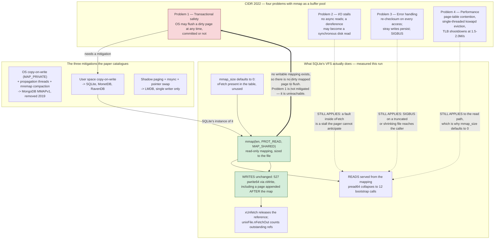

<!--
entry-meta
date: 2026-10-03
type: daily-diff
category: Daily Diff
title: Daily Diff — 2026-10-03
slug: sqlite-vfs-locking-styles-inode-emulation
edition: 2026-09-30 (Edition 067; no 2026-10-03 edition exists, and 068 was covered yesterday)
-->

# Daily Diff — 2026-10-03

**2026-10-03 · Daily Diff Digest**

## Edition status

**There is no 2026-10-03 edition of The Daily Diff, and there cannot be one yet.** Verified this run (03:45 UTC / 09:15 IST):

- https://tdd.cat/2026-10-03/ returns **HTTP 404**.
- https://tdd.cat/archive still tops out at **Edition 068 — Thu, Oct 1, 2026**. 68 editions, from Edition 001 (Fri, Jul 17, 2026) to 068.
- The archive page states the reason outright: *"Editions are published with a 2-day settling window so the highest-signal discussions and insights surface."* So Oct 3 is structurally two days away from being publishable, and the gap yesterday's digest treated as a lag is the site's documented design.
- One thing did change since yesterday: the **homepage has caught up to the archive**. https://tdd.cat/ now serves Edition 068 (Oct 1, 64 stories), where yesterday it served the stale Edition 066 (Sep 29). The homepage-vs-archive disagreement recorded in [yesterday's digest](../2026-10-02-sqlite-hot-journals-super-journal-recovery/daily-diff.md) has resolved itself.

Edition 068 is therefore the newest edition — and [yesterday's digest](../2026-10-02-sqlite-hot-journals-super-journal-recovery/daily-diff.md) already covered it in full, with `pg_lake` as its deep-dive. Re-covering it would be duplication.

So this digest covers **Edition 067 — Wednesday, 2026-09-30, 70 stories**, fetched at https://tdd.cat/2026-09-30/. That is the one edition yesterday's digest explicitly recorded as a gap: *"Edition 067 (2026-09-30) was never covered by this log and is noted here as a gap rather than backfilled."* It is now backfilled, and the log has continuous coverage from 066 through 068.

**One caveat on completeness.** The fetch of the Sep 30 page returned clean headline/description/source-link triples for items 1–65. Items 66–70 came back with placeholder sources (`[Continuation of item 65]`, `[Implicit from coverage]`) rather than URLs. Those five are not summarized below and no links are claimed for them — the page reports 70 stories and only 65 were verifiably retrieved.

---

## Edition 067, point-wise

70 stories. Markedly heavier on database internals than Edition 068 was, which is why it is worth having.

**Storage and query engines** — the part this log cares about

- **"Why mmap fails as a database buffer pool replacement"** — the item links the CIDR 2022 paper. Deep-dive below; it names SQLite directly and lands on exactly the VFS method pair today's lesson covers.
- **Aurora PostgreSQL + DuckDB appears *twice* in this edition** (the AWS what's-new post and the AWS blog post), then again in Edition 068. Three appearances across two days for one launch.
- **Turbopuffer's "RIP vector database" also appears twice here** (items 15 and 22), then again in 068. Edition 067 and 068 overlap more than the edition numbering suggests — if you read 068 yesterday you have already seen roughly a quarter of 067's storage cluster.
- **Tigris moved background task queues off FoundationDB onto Kafka** to eliminate contention. The generalizable claim: a transactional KV store is the wrong substrate for high-volume ephemeral work items, because every enqueue is a write that MVCC must version and later collect.
- **"Understanding the shape of the join ordering search space"** — also listed twice (items 41 and 63). Dynamic programming over factorial/Catalan-sized spaces. This is lesson 26's subject (`WhereLoop` objects and the path solver) and is worth bookmarking for that day rather than spending here.
- **PostgreSQL 19's `REPACK CONCURRENTLY` has measurable runtime costs** — memory pressure and vacuum backlog. Directly adjacent to lesson 33 (`VACUUM`/`VACUUM INTO`), which will have to answer the same question for SQLite's whole-file rewrite.
- **Upgrading a 56 TB database with ~90 seconds of disruption** by splitting hot control-plane state from cold history. The mechanism is schema partitioning, not a database feature.
- **ClickHouse on why C++ memory safety conflicts with Postgres extensions** — bridging C++ destructors with Postgres `setjmp`/`longjmp` needs strict exception barriers. The same class of problem as SQLite's error handling across the VFS boundary: an abort mechanism from one language model crossing into another's resource discipline.
- **Learning Postgres internals by writing extensions in Zig**, and **ClickHouse's `pg_clickhouse` adding foreign-server-level encoding validation** to stop silent corruption across database bridges.
- **Databases evaluating multi-query agent workloads in one pass**, and **an AI-SQL engine** (`quail`, listed twice — the lab blog and the Modal post) co-designing query planning with LLM batch scheduling for billion-token-per-minute throughput.
- **`radsort`** — parallel radix sort in O(√n) auxiliary space.

**Kernel, compilers, runtimes**

`bpf_fault` for handling page faults in eBPF programs (ACM DL) — notable *next to* the mmap paper, since custom fault handling is one of the paper's wished-for escape hatches. An eBPF StatsD exporter that reads metrics from the kernel with no listening socket. Firecracker microVMs replacing JS isolates at Netlify for ~5× latency. GHC Core on Truffle/GraalVM and OpenZL's LZ engine both reappear from 068. An open-sourced EDG C/C++ front end. Immutable image distribution with dumb servers and smart clients.

**Formal methods**

Hillel Wayne on what TLA+ can and cannot check — strong on safety properties, unable to express hyperproperties or probabilistic guarantees. Worth reading against SQLite's own test strategy, which lesson 32 takes.

**Security**

An OpenSSL advisory: DTLS retransmission mishandling leaking heap memory during suspended writes (CVE-2026-84782). Copilot Cowork's AI gateway hijacked to bypass sandboxing and exfiltrate files. Two papers on extracting memorized credentials from commercial models under output-only access.

**Agents and inference** — again the bulk of the edition

Meta's Rust broker orchestrating pre-warmed Chromium VM pools; Cloudflare re-architecting containers for sub-second agent sandboxes; prompt-cache-reuse request structuring claiming 99%+ hit ratios; decoupled DiLoCo removing lock-step barriers; pretraining on volunteer GitHub Actions runners; a 397B model across 20 consumer GPUs peer-to-peer; 2.1-bit ASR quantization to 164 MB and Conformer-CTC on an ESP32-S3 at 3.7% WER in 14 MB; self-hosted E2B; several agent audit/telemetry tools.

---

## Deep dive: the mmap paper, and the one thing SQLite got right

Picked because the item's source is a primary research paper rather than an announcement, because the paper **names SQLite by name** as one of three systems using a particular mitigation, and because the mechanism it argues about is `xFetch`/`xUnfetch` — the two `iVersion`-3 methods in the `sqlite3_io_methods` table that [today's lesson](README.md) enumerates. The paper and the lesson meet at one `mmap()` call, which this run measured.

### What the paper actually argues

Crotty, Leis and Pavlo, *Are You Sure You Want to Use MMAP in Your Database Management System?*, CIDR 2022. The landing page carries only the abstract; the argument is in the PDF, and the four problems are these.

**1. Transactional safety.** The root cause in one sentence: *"the OS can flush a dirty page to secondary storage at any time, irrespective of whether the writing transaction has committed."* A writable mapping hands the kernel unilateral authority over your durability ordering. Everything a DBMS does to guarantee that a page reaches disk only after its log record is void if `kswapd` can write that page out whenever it likes. The paper catalogues three mitigations:

- *OS copy-on-write* — `MAP_PRIVATE` for a private workspace, plus background threads to propagate committed changes and periodic `mremap` compaction. MongoDB's MMAPv1 did this.
- *User space copy-on-write* — copy affected pages into user-space buffers before modifying them. The paper names **SQLite, MonetDB and RavenDB** here.
- *Shadow paging* — LMDB: separate primary and shadow copies, `msync`, then a pointer swap. Constrains you to a single writer.

**2. I/O stalls.** *"mmap does not support asynchronous reads,"* and *"accessing any page could result in an unexpected I/O stall because the DBMS cannot know whether the page is in memory."* A pointer dereference becomes a synchronous disk read with no way to issue it in the background. `mlock` is bounded by OS memory limits; `madvise` hints are advisory and may be ignored; a prefetch thread reintroduces the complexity mmap was supposed to remove.

**3. Error handling.** Three distinct problems. Checksums must be re-validated *on every page access* because the OS may have silently evicted and re-read the page. A stray pointer write in a memory-unsafe language reaches persistent storage with nothing in between. And *"any code that interacts with mmap-backed memory can now produce a `SIGBUS`"* — a signal handler as a database error path.

**4. Performance.** Three bottlenecks: page-table contention across threads; **single-threaded eviction**, because Linux evicts through one `kswapd`, which becomes CPU-bound; and TLB shootdowns, where *"issuing inter-processor interrupts to synchronize remote TLBs can take thousands of cycles."* None is fixable from user space.

### The numbers, which are the part that settles it

Setup (§4): AMD EPYC 7713, 64 cores / 128 threads, 512 GB RAM with 100 GB available to the page cache, 10 × 3.8 TB Samsung PM1733 SSDs (7000 MB/s read, 3800 MB/s write), Linux 5.11, `fio` 3.25 with `O_DIRECT` as the baseline. Crucially: **read-only workloads only** — the best possible case for mmap, since problem 1 does not even arise.

| Measurement | `fio` + `O_DIRECT` | `mmap` |
|---|---|---|
| Random reads, 100 threads (Fig. 2) | ~900K reads/s, stable | ~900K/s for **27 s**, then **"dropped to nearly zero for about five seconds"**, recovering to ~**half** of `fio` |
| TLB shootdowns/s (Fig. 2b) | near zero | **1.5–2.0M/s** |
| Sequential scan, 1 SSD (Fig. 3) | full bandwidth | "precipitous drop" once the page cache filled, after ~**17 s** |
| Sequential scan, 10 SSDs (Fig. 4) | scales | **~20× slower**, with *"virtually no improvement over the results from using one SSD"* |

That last row is the killer and it is a scaling claim, not a constant-factor one: adding nine SSDs bought mmap nothing, because the bottleneck moved into single-threaded eviction and TLB invalidation. You cannot buy your way out with hardware.

§2.3's graveyard, with dates: **MongoDB** (MMAPv1, 2009–2019 — deprecated 2015, removed 2019); **InfluxDB** (2015–2020, abandoned after *"I/O spikes for writes when a database grew larger than a few GB"*); **SingleStore** (2013–2015, where sequential scans spent *"10–20 ms per query… nearly half of the overall query runtime"* on *"contention on a shared mmap write lock"*, and switching to `read()` made queries *"fully CPU-bound"*). **RocksDB, TileDB, Scylla, VictoriaMetrics and RDF-3X** evaluated it and declined.

The conclusion (§6) is unusually blunt. Do not use mmap when you need transactional safety on updates, explicit control over page faults and residency, real error handling, or high throughput on fast storage. Maybe use it when *"your working set (or the entire database) fits in memory and the workload is read-only"*, or when speed-to-market beats *"data consistency or long-term engineering headaches."* **"Otherwise, never."**

### Why SQLite is in the paper's "mitigation" list and not its graveyard

Today's lesson walked the `sqlite3_io_methods` table and found `xFetch`/`xUnfetch` present at `iVersion` 3 on the `unix` VFS. Those are the mmap path. The paper classifies SQLite's approach as *user space copy-on-write* — and that classification is checkable from outside the library, which is what this run did.

Measured, with `PRAGMA mmap_size=67108864` on a 502-page database, tracing `mmap`, `pread64` and `pwrite64`:

```
default mmap_size      = 0
io_methods->xFetch     = present

mmap(NULL, 2056192, PROT_READ, MAP_SHARED, 3, 0) = 0x7f63f9e07000
pread64=12  pwrite64=527

last pwrite64: pwrite64(3, "\r\0\0\0\1\16\5\0...", 4096, 2056192) = 4096
```

Four facts in that output, each one a direct answer to the paper:

- **`PROT_READ`, not `PROT_READ|PROT_WRITE`.** The mapping is read-only *by construction*. There is no such thing as a dirty mapped page, so problem 1 — the OS writing back uncommitted state — is not mitigated, it is **structurally impossible**. This is the strongest form of the "user space copy-on-write" the paper describes: SQLite does not copy pages out of a writable mapping, it never creates a writable mapping.
- **Every write is still `pwrite64`.** 527 of them, including the final one at offset 2056192 — a page appended *after* the mapping existed. Writes go through `xWrite`, never through the pointer. The mapping is a read accelerator bolted onto the side of an unchanged write path.
- **The mapping is exactly the file length** (2056192 = 502 × 4096), and reads collapse to 12 `pread64` calls — the bootstrap reads that happen before the mapping is established. So the read path really does move into the mapping.
- **`mmap_size` defaults to 0.** The methods are in the table and unused until you opt in. SQLite ships with the feature off.

That leaves SQLite with problems 2, 3 and 4 fully intact on its read path, and it is honest about them: a page fault in `xFetch` is a synchronous stall the pager cannot see coming, and `SIGBUS` on a truncated file is a real hazard. What it does not have is the one that destroys correctness.



### The transferable lesson

The paper's framing is "mmap versus a buffer pool", and read that way the answer is simply *buffer pool*. But the interesting structure is narrower: **mmap's correctness problem is entirely a property of the mapping's write permission, and its performance problems are entirely a property of the page cache's eviction path.** Those are separable. SQLite separated them — gave up nothing on correctness by never mapping writable, kept the read-path win where the working set is resident, and defaulted the whole thing off so you have to choose the remaining risk deliberately.

Which is the same shape as the design decision [today's lesson](README.md) spent §4 on. `sqlite3PagerWalSupported()` is three lines because the capability question was reduced to "does this methods object have the slot populated", and a VFS that cannot support a feature simply leaves the pointer null. `xFetch` is the same pattern: an optional capability, declared in a table, off unless asked for, with the dangerous half of it made unrepresentable rather than guarded. That is a better answer than a flag you can set wrongly — and it is worth contrasting with §9's `SQLITE_IOCAP_POWERSAFE_OVERWRITE`, which *is* a flag you can set wrongly, defaults on from a build option, and silently changes the journal format with no reference to the device it claims to describe.

### Worth checking before believing the paper

- **The experiments are read-only**, which the paper says plainly is mmap's best case. The write-side numbers are not measured; problem 1 is argued from mechanism, not benchmarked. That is defensible — a correctness argument does not need a benchmark — but it means the 20× figure is not a statement about transactional workloads.
- **Linux 5.11 and a 2022 kernel's eviction path.** `kswapd`'s single-threadedness and TLB-shootdown costs are kernel-version-dependent, and the item two slots away in the same edition (`bpf_fault`, handling page faults in eBPF) is evidence the surface is still moving. The architectural argument survives; specific multipliers may not.
- **"512 GB RAM, 100 GB to the page cache" is a chosen ratio.** The paper's "maybe" case is a working set that fits in memory, and the experiments are deliberately configured so it does not. Both are legitimate; just do not read Figure 4 as a verdict on the configuration the paper itself exempts.
- **SQLite's placement in the mitigation list is accurate but coarse.** "User space copy-on-write" suggests copying pages out of a mapping. The measurement above shows something stricter and simpler: the mapping is never writable, so nothing is copied out of it. The paper's taxonomy flattens a meaningful distinction between SQLite's approach and MonetDB's or RavenDB's, neither of which was checked here.

---

## Sources

Edition and archive, all fetched this run:

- [The Daily Diff](https://tdd.cat/) — now serving Edition 068 (2026-10-01); the homepage has caught up to the archive since yesterday
- [The Daily Diff — archive](https://tdd.cat/archive) — 68 editions, Edition 001 (2026-07-17) through 068 (2026-10-01); states the 2-day settling window
- https://tdd.cat/2026-10-03/ — **HTTP 404**; no edition exists for today
- [Edition 067, Wednesday 2026-09-30](https://tdd.cat/2026-09-30/) — the edition covered here, 70 stories (items 1–65 retrieved with verifiable source links)

Deep-dive item and the sources followed from it:

- [Why mmap fails as a database buffer pool replacement](https://vldb.org/cidrdb/2022/are-you-sure-you-want-to-use-mmap-in-your-database-management-system.html) — the item's source link; abstract only
- [Are You Sure You Want to Use MMAP in Your Database Management System? (CIDR 2022, PDF)](https://www.cidrdb.org/cidr2022/papers/p13-crotty.pdf) — the full paper, §2.3 survey, §3 four problems, §4 experiments, §6 recommendations
- [Semantic Scholar entry](https://www.semanticscholar.org/paper/Are-You-Sure-You-Want-to-Use-MMAP-in-Your-Database-Crotty-Leis/123a616ac129bbeb180669374dcf2aec734c1b61)
- [Andrew Crotty — Brown CS](https://cs.brown.edu/people/acrotty/)
- [Hacker News discussion](https://news.ycombinator.com/item?id=29936104)
- [Conference talk recording](https://www.youtube.com/watch?v=1BRGU_AS25c)
- [Virtual-Memory Assisted Buffer Management (ACM)](https://dlnext.acm.org/doi/abs/10.1145/3588687) — the follow-on line of work
- [paper-outline #10 — reading notes](https://github.com/mrdrivingduck/paper-outline/issues/10)
- Measurements taken during this run: system `libsqlite3` 3.45.1, x86-64 Linux 6.18, `page_size=4096`, `PRAGMA mmap_size=67108864`, `strace -e trace=mmap,pread64,pwrite64`

Other items referenced in the summary, as linked by Edition 067:

- [Introducing quail — an ultra-high throughput AI-SQL engine](https://fsdatalab.github.io/blog/introducing-quail/) and [the Modal writeup](https://modal.com/blog/quail-billion-tpm)
- [Aurora PostgreSQL can query Iceberg and Parquet (what's-new)](https://aws.amazon.com/about-aws/whats-new/2026/09/aurora-postgresql-query-apache-iceberg-and-parquet/) and [the AWS blog post](https://aws.amazon.com/blogs/aws/amazon-aurora-postgresql-now-supports-direct-querying-of-apache-iceberg-and-parquet-data-in-your-data-lake/)
- [Turbopuffer — RIP vector database](https://turbopuffer.com/blog/rip-vector-database)
- [Moving background task queues off FoundationDB to Kafka](https://www.tigrisdata.com/blog/quick-fdb-kafka/)
- [Understanding the shape of the join ordering search space](https://deferworks.org/posts/join-ordering/)
- [Measuring the runtime costs of REPACK CONCURRENTLY in PostgreSQL 19](https://boringsql.com/posts/repack-concurrently-costs/)
- [Upgrading a 56TB database](https://trigger.dev/blog/upgrading-a-56tb-database)
- [Memory safety in Postgres extensions, C and C++](https://clickhouse.com/blog/memory-safety-postgres-extensions-c-cpp)
- [Learning Postgres as a Zig developer](https://barddoo.com/posts/learning-postgres-as-a-zig-developer/)
- [pg_clickhouse and chDB — encoding validation](https://clickhouse.com/blog/pg_clickhouse-chdb)
- [Databases must evaluate multi-query agent workloads in one pass](https://oliverdb.ai/blog/frontier-database.html)
- [Radsort — parallel radix sort with sublinear memory](https://arxiv.org/abs/2607.05302)
- [Handling custom page faults in kernel space with bpf_fault](https://dl.acm.org/doi/10.1145/3830418.3843896)
- [Nobody is listening on 8125 — eBPF StatsD](https://yeet.cx/blog/nobody-is-listening-on-8125)
- [Netlify edge functions on Firecracker microVMs](https://www.netlify.com/blog/edge-functions-firecracker-microvms/)
- [What TLA+ can and can't check](https://buttondown.com/hillelwayne/archive/what-tla-can-and-cant-check/)
- [Turbo Haskell — GHC Core on GraalVM](https://comonad.com/reader/2026/turbo-haskell/)
- [Native LZ engine in OpenZL](https://openzl.org/blog/2026-09-29-lz-in-openzl/) and [the v0.3.0 release](https://github.com/facebook/openzl/releases/tag/v0.3.0)
- [Open source EDG C/C++ front end](https://github.com/edgcpp/compiler)
- [Distributing images with Quarry](https://amutable.com/blog/distributing-images-quarry)
- [OpenSSL security advisory, 2026-09-29 (CVE-2026-84782)](https://openssl-library.org/news/secadv/20260929.txt)
- [Hijacking Copilot Cowork's AI gateway to exfiltrate files](https://www.promptarmor.com/resources/hijacking-copilot-coworks-ai-gateway-to-exfiltrate-files)
- [Black-box LLMs leak memorized secrets under output-only access](https://arxiv.org/abs/2609.36941)
- [How Meta orchestrates stock Chromium for agent browser use](https://mouse.dev/blog/muse-browser/)
- [Rearchitecting Cloudflare containers for agent sandboxes](https://blog.cloudflare.com/faster-agent-sandboxes/)
- [How Forge structures requests for prompt cache reuse](https://www.mohitranka.com/blog/how-forge-structures-requests-for-prompt-cache-reuse/)
- [Decoupled DiLoCo](https://arxiv.org/abs/2604.21428) and [pretraining on volunteer hardware via GitHub Actions](https://github.com/commonsense-ai/coop)
- [Running a 397B model on 20 peer-to-peer GPUs](https://diljitpr.net/blog-post-2026-09-30-running-397b-model-on-20-gpus-peer-to-peer.html)
- [Phonon-2 — 2.1-bit ASR at 164MB](https://www.fermionresearch.com/research/phonon-2/) and [oido — Conformer-CTC on ESP32-S3](https://github.com/lokutor-ai/oido)
- [Self-hosting the E2B sandbox runtime](https://github.com/e2b-dev/runtime/tree/main/embed)
- [Natively managing context as files](https://arxiv.org/abs/2609.37725) and [the implementation](https://github.com/facebookresearch/context-language-models)
